# 带教管理系统设计文档

## 目录
- [1. 核心理念](#1-核心理念)
- [2. 系统架构](#2-系统架构)
- [3. 带教项目类型](#3-带教项目类型)
- [4. 项目详情中的带教功能](#4-项目详情中的带教功能)
- [5. 教务工作台的带教管理](#5-教务工作台的带教管理)
- [6. 技术实现方案](#6-技术实现方案)
- [7. 数据流设计](#7-数据流设计)
- [8. 智能适配设计总结](#8-智能适配设计总结)
- [9. 管理办法合规性补充](#9-管理办法合规性补充)

---

## 1. 核心理念

### 1.1 核心理念：项目是带教的落地

**带教管理的本质**：将传统的师徒关系管理升级为**项目化的带教实施系统**。

**核心定义**：
- **带教不是抽象概念，而是通过具体项目来实现**
- **每个带教活动都必须以项目的形式存在和运行**  
- **项目是带教管理的基本单位和载体**

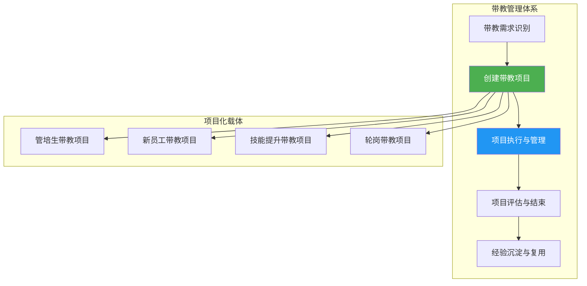

### 1.2 设计突破：从关系管理到项目管理

**传统带教方式的问题**：
- 师徒关系松散，缺乏明确目标
- 过程难以跟踪，效果难以评估
- 经验无法沉淀，优秀做法难以复制

**项目化带教的优势**：
- **明确的项目目标**：每个带教项目都有清晰的培养目标和成功标准
- **标准化的项目流程**：启动→执行→监控→收尾的完整项目生命周期
- **可衡量的项目成果**：量化的进度跟踪和效果评估
- **可复制的项目经验**：成功项目的模板化和知识传承

### 1.3 四大核心价值

1. **目标导向**：每个带教项目都有明确的培养目标和里程碑
2. **过程可控**：通过项目管理确保带教质量和进度
3. **效果可评**：标准化的评估体系和成果衡量
4. **经验可传**：优秀项目的模板化和经验复用

---

## 2. 系统架构

### 2.1 项目化带教管理架构

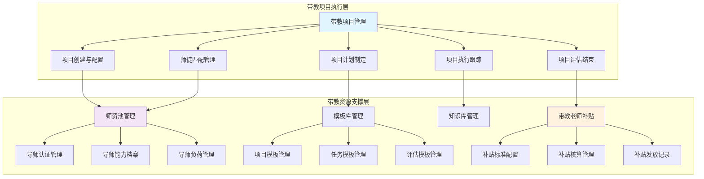

### 2.2 用户角色与项目权限

| 角色 | 在项目中的职责 | 权限范围 |
|------|---------------|----------|
| **项目负责人** | 创建带教项目、设定目标、分配资源、执行项目计划、监控进度、协调资源 | 项目全生命周期管理权限 |
| **导师(Mentor)** | 具体实施带教、指导学员成长 | 负责学员的任务分配和评估权限 |
| **学员(Mentee)** | 参与项目活动、完成学习任务 | 查看项目信息和提交作业权限 |
| **教务管理员** | 管理师资池、维护模板库、管理带教老师补贴 | 全局资源管理权限 |

---

## 3. 带教项目类型

### 3.1 两种核心项目模式

基于不同的培养需求和组织方式，带教项目分为两种核心模式：

#### 3.1.1 阶段式带教项目 (Phased Mentoring Project)

**适用场景**：
- 三卫培养项目
- 复杂技能培训项目  
- 多部门轮岗项目
- 长期职业发展项目

**核心特征**：
- **多学员多导师**：一个项目包含多名学员和多名导师
- **阶段化管理**：项目分为不同培养阶段（如基础期、实践期、提升期）
- **导师轮换**：不同阶段可以配置不同的专业导师
- **统一进度**：所有学员按照统一的阶段节奏推进

**项目结构**：
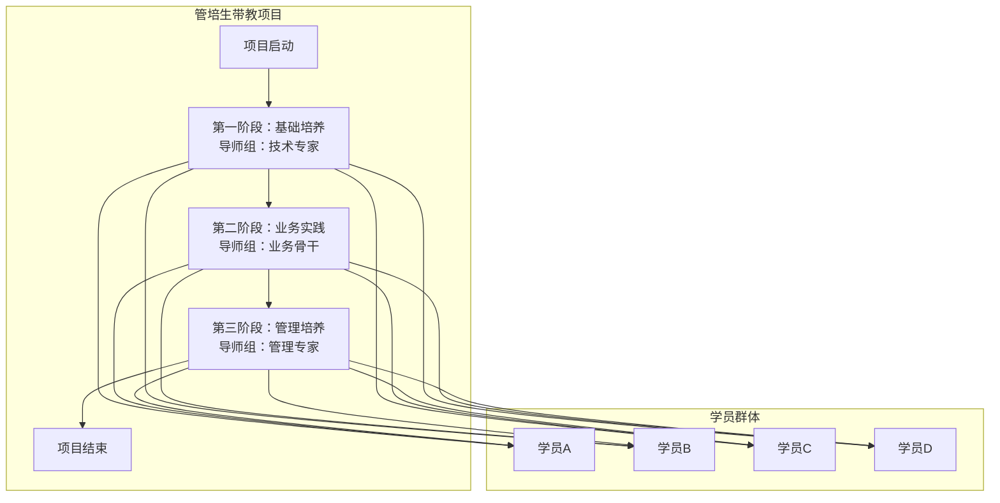

#### 3.1.2 一对一带教项目 (Dedicated Mentoring Project)

**适用场景**：
- 新员工入职带教
- 特定岗位技能提升
- 个性化能力培养
- 关键人才重点培养

**核心特征**：
- **一对一配对**：一个项目主要针对一名学员配备一名主导师
- **全程陪伴**：同一导师负责项目全周期的指导
- **个性化定制**：根据学员具体情况制定专属培养计划
- **灵活调整**：可根据学员进度随时调整计划和节奏

**项目结构**：
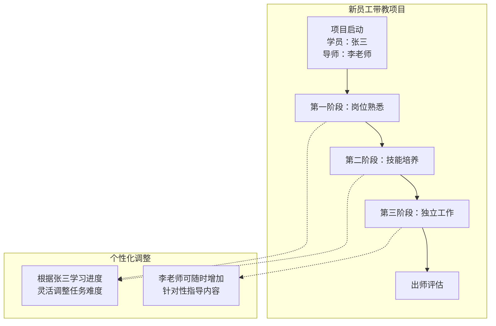

### 3.2 项目模式对比

| 对比维度 | 阶段式带教项目 | 一对一带教项目 |
|---------|---------------|---------------|
| **学员数量** | 多名学员（通常3-20人） | 单名学员 |
| **导师配置** | 按阶段配置不同导师 | 固定主导师全程负责 |
| **进度管理** | 统一阶段，集体推进 | 个性化节奏，灵活调整 |
| **计划制定** | 基于阶段的标准化模板 | 基于个人的定制化方案 |
| **适用周期** | 通常6个月-2年 | **新员工带教：1年**<br/>其他类型：1-6个月 |
| **管理复杂度** | 较高（多对多关系） | 较低（一对一关系） |
| **规模效应** | 高（可批量培养） | 低（精细化培养） |

---

## 4. 项目详情中的带教功能

### 4.1 功能概述

在培训系统的"项目详情"页面中，"带教"作为一个独立的Tab页面，提供该项目的带教管理功能。这里的核心是**将带教活动项目化管理**，确保每个带教需求都通过项目的形式得到有效实施。

### 4.2 统一带教项目的智能适配模式

系统采用**智能适配的统一模式**，充分考虑与项目其他菜单的协同：

#### 4.2.1 设计理念

**核心思想**：带教管理作为项目详情的一个菜单，需要与学员、任务等其他菜单深度集成，形成完整的项目管理闭环。

#### 4.2.2 与其他菜单的协同机制

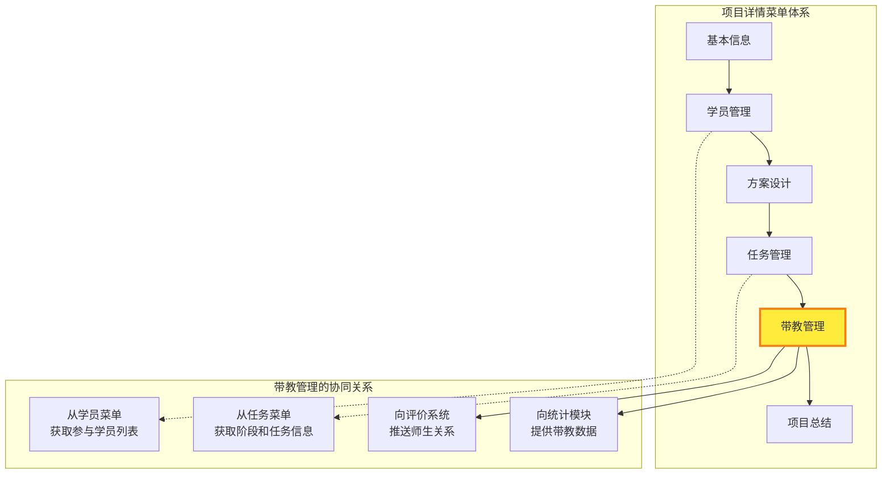

#### 4.2.3 智能适配流程

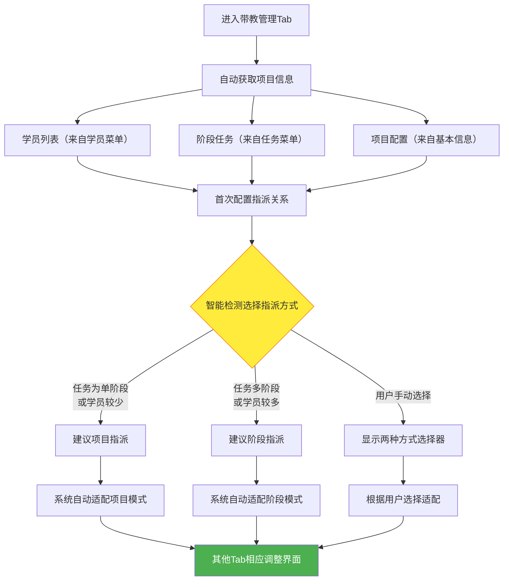

### 4.3 四个核心Tab设计

#### Tab 1: 指派关系 (Assignment Relationships)

**功能定位**：基于项目已有信息，智能配置学员和导师的分配关系

**核心特点**：
- 自动同步学员菜单中的参与者信息
- 基于任务菜单的阶段结构智能推荐指派方式
- 提供项目指派和阶段指派两种灵活模式
- 支持批量操作和智能匹配

#### 🔄 智能适配机制设计

##### 自动信息获取
```
┌─ 项目信息自动同步 ─────────────────────────────┐
│ 📊 从其他菜单获取信息:                          │
│ ├─ 学员菜单: 8名参与学员                        │
│ ├─ 任务菜单: 3个培养阶段，12个培养任务          │
│ ├─ 基本信息: 12个月培养周期                     │
│ └─ 项目类型: 新员工带教项目                     │
│                                               │
│ 🤖 系统智能建议:                               │
│ └─ 建议采用"阶段指派"（基于多阶段任务结构）     │
└─────────────────────────────────────────────┘
```

##### 指派方式智能选择器
```
┌─ 指派方式配置 ─────────────────────────────────┐
│ 🎯 项目指派模式                                │
│ ○ 整体指派 - 一个导师负责学员全程培养            │
│   适用场景: □ 学员数量较少(≤3人)                │
│            □ 培养目标单一                       │
│            □ 希望建立深度师徒关系               │
│                                               │
│ 🔄 阶段指派模式 (系统推荐 ⭐)                  │
│ ● 分阶段指派 - 不同阶段配置专业导师             │
│   适用场景: ☑ 学员数量较多(8人)                │
│            ☑ 多阶段培养任务(3个阶段)           │
│            ☑ 需要不同专业背景导师               │
│                                               │
│ [确认选择] [查看影响范围] [预览配置]            │
└─────────────────────────────────────────────┘
```

### 📋 草稿状态界面设计

##### 📊 项目指派模式界面
```
🎯 项目整体指派
┌─ 项目信息 ───────────────────────────────────┐
│ 项目名称: Java开发工程师培养                     │
│ 培养周期: 12个月 (新员工标准)                   │
│ 参与学员: 8名                                  │
└─────────────────────────────────────────────┘

👥 学员列表
┌─────────────────────────────────────────────┐
│ 编号  姓名   部门     状态                      │
│ ──────────────────────────────────────────│
│ □ 001 张三   研发部   待指派 → [选择导师▼]      │
│ □ 002 李四   研发部   待指派 → [选择导师▼]      │
│ □ 003 王五   研发部   已指派 → 陈老师          │
│                                             │
│ [批量导入] [添加学员] [批量指派]                │
└─────────────────────────────────────────────┘

🎯 导师选择与匹配
┌─ 推荐导师列表 ─────────────────────────────┐
│ 🥇 李老师 (匹配度: 95%)                      │
│   ├─ 专业: Java后端 ⭐⭐⭐⭐⭐                │
│   ├─ 经验: 5年，成功率85%                    │
│   ├─ 负荷: 轻度 (2/8)                      │
│   └─ [指派给所选学员]                       │
│                                           │
│ 🥈 陈老师 (匹配度: 87%)                      │
│   ├─ 专业: 全栈开发 ⭐⭐⭐⭐☆                │
│   ├─ 经验: 4年，成功率78%                    │
│   ├─ 负荷: 中度 (4/8)                      │
│   └─ [指派给所选学员]                       │
└─────────────────────────────────────────┘
```

##### 📊 阶段指派模式界面
```
🔄 阶段定义与配置
┌─ 项目阶段设置 ─────────────────────────────┐
│ 阶段1: 基础技能培养 (1-3个月)                │
│ ├─ 目标: Java基础、开发环境、简单项目        │
│ ├─ 导师要求: 技术基础扎实                   │
│ └─ [编辑阶段] [删除阶段]                   │
│                                           │
│ 阶段2: 业务实践 (4-8个月)                   │
│ ├─ 目标: 业务理解、复杂项目、团队协作        │
│ ├─ 导师要求: 业务经验丰富                   │
│ └─ [编辑阶段] [删除阶段]                   │
│                                           │
│ 阶段3: 进阶提升 (9-12个月)                  │
│ ├─ 目标: 架构设计、性能优化、技术创新        │
│ ├─ 导师要求: 高级技术专家                   │
│ └─ [编辑阶段] [删除阶段]                   │
│                                           │
│ [添加阶段] [保存配置] [预览流程]             │
└─────────────────────────────────────────┘

👥 分阶段指派界面
┌─ 阶段1: 基础技能培养 ─────────────────────┐
│ 学员: 张三、李四、王五 (3名)                │
│ 推荐导师: 陈老师 (基础培养专家)              │
│ 指派状态: ✅ 已确认                        │
└─────────────────────────────────────────┘

┌─ 阶段2: 业务实践 ─────────────────────────┐
│ 学员: 张三、李四、王五 (3名)                │
│ 推荐导师: 刘老师 (业务专家)                 │
│ 指派状态: ⚠️ 待确认                       │
│ [确认指派] [更换导师]                      │
└─────────────────────────────────────────┘

┌─ 阶段3: 进阶提升 ─────────────────────────┐
│ 学员: 张三、李四、王五 (3名)                │
│ 推荐导师: 待配置                          │
│ 指派状态: 🔄 待处理                       │
│ [选择导师] [跳过此阶段]                    │
└─────────────────────────────────────────┘
```

### 📊 发布状态界面

##### 📈 项目指派模式 - 发布状态
```
🎯 师徒关系总览
┌─────────────────────────────────────────────┐
│ 项目: Java开发工程师培养                     │
│ 导师: 李老师 (主导师)                       │
│ 学员: 8名 | 进行中: 6名 | 已完成: 2名        │
│ 整体进度: ████████░░ 75%                    │
└─────────────────────────────────────────────┘

📋 师徒配对详情
┌─ 李老师的带教学员 ─────────────────────────┐
│ 👤 张三 | 第8周 | 进度: 80% | 评价: 4.8分    │
│ 👤 李四 | 第7周 | 进度: 70% | 评价: 4.5分    │
│ 👤 王五 | 第6周 | 进度: 65% | 评价: 4.2分    │
│ 👤 赵六 | 第5周 | 进度: 58% | 评价: 4.0分    │
│                                           │
│ [查看详情] [导师评价] [项目调整]             │
└─────────────────────────────────────────┘
```

##### 📈 阶段指派模式 - 发布状态  
```
🔄 阶段进展总览
┌─ 当前阶段: 阶段2 - 业务实践 ─────────────────┐
│ 总进度: ████████░░ 75% (第8周/12周)          │
│ 当前导师: 刘老师 (业务专家)                  │
│ 下一阶段: 阶段3 - 进阶提升 (预计第13周开始)   │
└─────────────────────────────────────────────┘

📋 分阶段师徒关系
┌─ 阶段1: 基础技能培养 ────────────────────┐
│ 导师: 陈老师 | 时间: 第1-4周 | 状态: ✅ 已完成 │
│ 学员完成情况: 8/8名 | 平均评分: 4.6分        │
└─────────────────────────────────────────┘

┌─ 阶段2: 业务实践 ──────────────────────┐
│ 导师: 刘老师 | 时间: 第5-12周 | 状态: 🔄 进行中 │
│ 学员进度: 张三 80% | 李四 75% | 王五 70%     │
│ 预计完成: 第12周末                         │
└─────────────────────────────────────────┘

┌─ 阶段3: 进阶提升 ──────────────────────┐
│ 导师: 李老师 | 时间: 第13-24周 | 状态: ⏳ 待开始│
│ 准备状态: 导师已确认，学员筛选进行中          │
└─────────────────────────────────────────┘
```

#### Tab 2: 带教导师 (Mentoring Teachers)

**功能定位**：管理和展示项目中所有带教导师的详细信息，根据指派关系Tab的配置智能适配界面布局

**智能适配机制**：
- **项目指派模式**：以项目为单位展示导师信息，强调全程责任和学员关系
- **阶段指派模式**：以阶段为维度展示导师信息，突出专业分工和交接协作
- **统一管理视图**：提供导师资源池、能力评估、历史记录等统一管理功能

**与其他Tab的联动**：
- 指派关系变更时，本Tab自动刷新相关导师信息
- 导师状态变化时，自动通知评价Tab调整评价任务
- 与任务Tab联动，显示导师在各阶段的任务关联情况

### 📋 草稿状态界面

##### 🔍 导师资源池管理
```
🎯 可用导师筛选
┌─ 筛选条件 ─────────────────────────────────┐
│ 认证类型: [全部▼] [书院认证] [部门指定]      │
│ 专业领域: [Java▼] [前端] [全栈] [架构]      │
│ 当前负荷: [全部▼] [轻度] [中度] [重度]      │
│ 成效评级: [全部▼] [优秀] [良好] [一般]      │
│                                           │
│ [重置条件] [保存筛选] [导出列表]             │
└─────────────────────────────────────────┘

📊 导师状态概览
┌─ 导师资源统计 ─────────────────────────────┐
│ 总计: 24名 | 可用: 18名 | 繁忙: 6名        │
│ 书院认证: 12名 | 部门指定: 12名             │
│ 技术类: 16名 | 业务类: 8名                │
└─────────────────────────────────────────┘
```

##### 👥 待分配导师列表
```
📋 导师候选列表

┌─ 李老师 - 书院认证带教老师 ─────────────────┐
│ 👤 基本信息                                 │
│ ├─ 部门: 技术研发部 | 职位: 高级Java工程师   │
│ ├─ 入职年限: 6年 | 认证: ✅ 书院认证        │
│ └─ 专业评级: Java后端 ⭐⭐⭐⭐⭐             │
│                                           │
│ 📊 适配度分析                               │
│ ├─ 技能匹配: 95% (项目需求: Java开发)       │
│ ├─ 经验匹配: 90% (5年带教经验)             │
│ ├─ 负荷状态: 🟢 轻度 (2/8)                │
│ └─ 历史成效: 85%成功率 (10/12)             │
│                                           │
│ 🎯 分配建议                                 │
│ ├─ 适合项目指派: ✅ 推荐 (全程带教)          │
│ ├─ 适合阶段指派: ✅ 推荐 (第2-3阶段)        │
│ └─ [选择此导师] [查看详情] [预约面谈]        │
└─────────────────────────────────────────┘

┌─ 陈老师 - 部门指定带教老师 ─────────────────┐
│ 👤 基本信息                                 │
│ ├─ 部门: 产品技术部 | 职位: 前端开发工程师   │
│ ├─ 入职年限: 4年 | 认证: 部门指定           │
│ └─ 专业评级: 前端技术 ⭐⭐⭐⭐☆              │
│                                           │
│ 📊 适配度分析                               │
│ ├─ 技能匹配: 60% (项目需求: Java开发)       │
│ ├─ 经验匹配: 70% (3年带教经验)             │
│ ├─ 负荷状态: 🟡 中度 (4/8)                │
│ └─ 历史成效: 78%成功率 (7/9)               │
│                                           │
│ 🎯 分配建议                                 │
│ ├─ 适合项目指派: ❌ 不推荐 (技能不匹配)      │
│ ├─ 适合阶段指派: ✅ 可选 (第1阶段基础培养)   │
│ └─ [查看详情] [技能评估] [培训安排]          │
└─────────────────────────────────────────┘
```

### 📊 发布状态界面

##### 📈 项目指派模式 - 导师管理
```
🎯 项目导师总览
┌─ 当前项目导师情况 ─────────────────────────┐
│ 项目: Java开发工程师培养                    │
│ 主导师: 李老师 (书院认证)                   │
│ 负责学员: 8名 | 进行中: 6名 | 已完成: 2名   │
│ 整体评价: 4.8分/5分 | 风险级别: 🟢 低       │
└─────────────────────────────────────────┘

┌─ 李老师 - 项目主导师详情 ─────────────────┐
│ 👤 基本信息                                │
│ ├─ 认证状态: ✅ 书院认证 (2023年获得)       │
│ ├─ 专业领域: Java后端开发 ⭐⭐⭐⭐⭐         │
│ └─ 带教经验: 5年，累计带教12名学员          │
│                                           │
│ 📊 当前项目状态                             │
│ ├─ 项目进度: 第8周/52周 (15%)              │
│ ├─ 沟通频次: 4.2次/周 ✅ (标准: ≥4次)      │
│ ├─ 学员反馈: 4.8分/5分 ✅                 │
│ ├─ 任务完成: 85% (按时完成)                │
│ └─ 风险预警: 无                           │
│                                           │
│ 📈 学员进展情况                             │
│ ├─ 👤 张三: 第8周 | 80%进度 | 4.9分评价     │
│ ├─ 👤 李四: 第7周 | 75%进度 | 4.7分评价     │
│ ├─ 👤 王五: 第6周 | 70%进度 | 4.6分评价     │
│ └─ 👤 赵六: 第5周 | 65%进度 | 4.5分评价     │
│                                           │
│ 🎯 近期关键事项                             │
│ ├─ ⏰ 下周: 第一阶段评估 (4名学员)          │
│ ├─ 📝 本周: 项目实战指导 (张三、李四)        │
│ └─ 💬 待处理: 学员提问3个，技术难题2个       │
│                                           │
│ [详细档案] [沟通记录] [进度调整] [评价管理]   │
└─────────────────────────────────────────┘
```

##### 📈 阶段指派模式 - 导师管理
```
🔄 分阶段导师总览
┌─ 项目阶段与导师配置 ───────────────────────┐
│ 项目: Java开发工程师培养                    │
│ 当前阶段: 阶段2 - 业务实践                  │
│ 总参与导师: 3名 | 当前导师: 1名 | 已完成: 1名│
└─────────────────────────────────────────┘

┌─ 阶段1: 基础技能培养 - 陈老师 ─────────────┐
│ 🏁 状态: ✅ 已完成 (第1-4周)                │
│ 👥 负责学员: 8名 | 全部完成: 8名            │
│ 📊 阶段成效: 4.6分/5分 | 成功率: 100%       │
│ 💰 补贴状态: ✅ 已发放 (1000元)             │
│                                           │
│ 📈 阶段总结                                 │
│ ├─ 优秀表现: 基础知识传授扎实，学员反馈好     │
│ ├─ 改进建议: 可增加更多实践练习              │
│ └─ 交接情况: ✅ 与刘老师顺利交接            │
│                                           │
│ [阶段报告] [交接记录] [导师评价]             │
└─────────────────────────────────────────┘

┌─ 阶段2: 业务实践 - 刘老师 ─────────────────┐
│ 🔄 状态: 进行中 (第5-12周，当前第8周)       │
│ 👥 负责学员: 8名 | 进行中: 6名 | 风险: 2名   │
│ 📊 当前评价: 4.3分/5分 | 预计成功率: 85%    │
│ ⚠️ 风险预警: 2名学员进度滞后                │
│                                           │
│ 📊 当前阶段状态                             │
│ ├─ 整体进度: ████████░░ 75% (第8周/12周)   │
│ ├─ 沟通频次: 3.8次/周 ⚠️ (略低于标准)      │
│ ├─ 业务理解: 70%学员达标                   │
│ └─ 实践项目: 进行中，预计下周完成            │
│                                           │
│ 🎯 重点关注学员                             │
│ ├─ 👤 王五: 进度55% ⚠️ | 需加强指导         │
│ ├─ 👤 赵六: 进度50% 🔴 | 建议一对一辅导      │
│ └─ 其他学员: 进度正常 ✅                    │
│                                           │
│ 📅 近期计划                                 │
│ ├─ 本周: 业务项目中期检查                   │
│ ├─ 下周: 与李老师(阶段3)交接准备            │
│ └─ 月末: 阶段2结束评估                      │
│                                           │
│ [实时监控] [学员辅导] [风险处理] [交接准备]   │
└─────────────────────────────────────────┘

┌─ 阶段3: 进阶提升 - 李老师 ─────────────────┐
│ ⏳ 状态: 待开始 (第13-24周)                │
│ 👥 预期学员: 6-8名 (基于阶段2筛选)          │
│ 📋 准备状态: 75% | 教案: ✅ | 资源: 待确认   │
│                                           │
│ 🎯 阶段3准备情况                            │
│ ├─ 教案准备: ✅ 已完成 (架构设计、性能优化)  │
│ ├─ 实践项目: ✅ 已确认 (微服务重构项目)      │
│ ├─ 导师培训: 🔄 进行中 (高级技术培训)       │
│ └─ 学员筛选: ⏳ 待阶段2完成后确定           │
│                                           │
│ 📊 李老师能力评估                           │
│ ├─ 架构设计: ⭐⭐⭐⭐⭐ (资深架构师)        │
│ ├─ 性能优化: ⭐⭐⭐⭐☆ (丰富经验)          │
│ ├─ 技术创新: ⭐⭐⭐⭐⭐ (多项技术创新)      │
│ └─ 高级指导: ⭐⭐⭐⭐⭐ (5年高级经验)       │
│                                           │
│ [准备进度] [能力评估] [资源协调] [预约会议]   │
└─────────────────────────────────────────┘
```

##### 🔧 导师管理工具
```
📊 批量操作功能
┌─ 导师管理工具栏 ───────────────────────────┐
│ 🔍 筛选: [全部导师▼] [项目导师] [阶段导师]   │
│ 📊 状态: [全部状态▼] [进行中] [已完成] [待开始]│
│ ⚠️ 预警: [显示预警] [隐藏正常] [仅显示风险]  │
│                                           │
│ 🛠️ 批量操作:                               │
│ [批量通知] [批量评估] [导出报告] [培训安排]   │
└─────────────────────────────────────────┘
```

#### Tab 3: 带教评价 (Mentoring Evaluation)

**功能定位**：管理和执行项目内所有评价活动，根据指派模式智能生成和组织评价任务

**智能适配机制**：
- **项目指派模式**：生成整体性评价任务，强调师生长期关系的评价
- **阶段指派模式**：生成阶段性评价任务，包含阶段交接和专业能力评价
- **自动化生成**：基于指派关系自动创建对应的评价任务和时间节点

**评价任务类型智能匹配**：
- 根据新员工带教的1年周期，自动设置转正前和年度评价节点
- 师徒互评任务自动分配给对应的师生对
- 评价责任人基于指派关系自动确定

### 📋 草稿状态界面

##### 🔧 评价配置与准备
```
🎯 评价体系配置
┌─ 评价参数设置 ─────────────────────────────────┐
│ 评价类型配置:                                  │
│ ☑️ 学员评价导师 (三维度100分制)                 │
│ ☑️ 导师评价学员 (业务能力评估)                  │
│ ☑️ 师徒互评 (转正和年度节点必需)                │
│                                               │
│ 时间节点设置:                                  │
│ ├─ 转正前评价: 入职第3个月末                    │
│ ├─ 年度评价: 入职满1年时                       │
│ └─ 补贴评价: 每年6月、12月统计期               │
│                                               │
│ 评价标准配置:                                  │
│ ├─ 通过标准: ≥90分                           │
│ ├─ 预警标准: <75分需要重点关注                 │
│ └─ 取消资格: 累计2名学员<75分                  │
│                                               │
│ [保存配置] [预览效果] [测试运行]                │
└─────────────────────────────────────────────┘
```

##### 📅 评价任务预览生成
```
🔄 根据指派方式智能生成评价任务

【项目指派模式】- 评价任务预览:
┌─ 项目整体评价计划 ─────────────────────────┐
│ 项目: Java开发工程师培养                    │
│ 主导师: 李老师 | 学员: 8名                  │
│                                           │
│ 📅 转正前评价 (第12周)                      │
│ ├─ 评价关系: 师徒互评 (8组)                 │
│ ├─ 学员评价导师: 李老师 (8份评价)            │
│ ├─ 导师评价学员: 8名学员 (8份评价)           │
│ └─ 评价维度: 认识、技能、文化和人文           │
│                                           │
│ 📅 年度评价 (第52周)                        │
│ ├─ 评价关系: 师徒互评 (预计6组)              │
│ ├─ 综合评价: 全年带教效果评估                │
│ └─ 补贴评估: 六项核心条件检查                │
│                                           │
│ [确认生成] [修改设置] [导出计划]             │
└─────────────────────────────────────────┘

【阶段指派模式】- 评价任务预览:
┌─ 分阶段评价计划 ───────────────────────────┐
│ 项目: Java开发工程师培养                    │
│ 涉及导师: 陈老师、刘老师、李老师              │
│                                           │
│ 📅 阶段1结束评价 (第16周)                    │
│ ├─ 评价关系: 学员评价阶段导师                │
│ ├─ 学员评价: 陈老师 (8份评价)               │
│ └─ 评价重点: 基础技能培养效果                │
│                                           │
│ 📅 阶段2结束评价 (第32周)                    │
│ ├─ 评价关系: 学员评价阶段导师                │
│ ├─ 学员评价: 刘老师 (预计6份评价)            │
│ └─ 评价重点: 业务实践指导效果                │
│                                           │
│ 📅 转正前综合评价 (第12周)                   │
│ ├─ 评价关系: 师徒互评                      │
│ ├─ 学员评价: 当前阶段导师 (陈老师)           │
│ ├─ 导师评价: 学员综合表现                   │
│ └─ 评价维度: 三维度全面评价                 │
│                                           │
│ 📅 年度综合评价 (第52周)                     │
│ ├─ 评价关系: 学员评价所有参与导师             │
│ ├─ 多导师评价: 陈老师、刘老师、李老师         │
│ └─ 各导师补贴: 分别按阶段贡献计算            │
│                                           │
│ [确认生成] [调整阶段] [导出计划]             │
└─────────────────────────────────────────┘
```

### 📊 发布状态界面

##### 📈 项目指派模式 - 评价管理
```
🎯 当前评价任务状态
┌─ 评价任务概览 ─────────────────────────────┐
│ 📅 本月待完成: 6个 | 已完成: 12个 | 逾期: 1个 │
│ 📊 完成率: 92% | 平均评分: 4.7分/5分         │
│ ⚠️ 风险预警: 李四评分88分，需关注            │
└─────────────────────────────────────────┘

📋 具体评价任务 - 师徒互评
┌─ 转正前评价任务 ─────────────────────────┐
│ 🔄 进行中 | 📅 截止: 2024-08-15 | 剩余: 3天│
│                                          │
│ 👤 张三 ↔ 李老师 (师徒互评)                │
│ ├─ 学员评价导师: ✅ 已完成 (4.8分)          │
│ │   └─ 认识15分+技能38分+文化41分 = 94分    │
│ └─ 导师评价学员: ✅ 已完成 (4.6分)          │
│     └─ 业务能力、学习态度、团队协作评价     │
│                                          │
│ 👤 李四 ↔ 李老师 (师徒互评)                │
│ ├─ 学员评价导师: ✅ 已完成 (4.4分)          │
│ │   └─ 认识14分+技能35分+文化39分 = 88分    │
│ └─ 导师评价学员: 🔄 进行中                 │
│     └─ 预计明日完成                       │
│                                          │
│ 👤 王五 ↔ 李老师 (师徒互评)                │
│ ├─ 学员评价导师: ⏳ 待开始                 │
│ └─ 导师评价学员: ⏳ 待开始                 │
│                                          │
│ [批量提醒] [延期申请] [查看详情]            │
└─────────────────────────────────────────┘
```

##### 📈 阶段指派模式 - 评价管理
```
🔄 分阶段评价任务管理
┌─ 评价任务分布 ─────────────────────────────┐
│ 当前活跃阶段: 阶段2 (业务实践)              │
│ 已完成评价: 阶段1 | 进行中: 阶段2 | 待开始: 阶段3│
└─────────────────────────────────────────┘

📋 阶段1评价结果 (已完成)
┌─ 基础技能培养 - 陈老师 ───────────────────┐
│ 🏁 评价状态: ✅ 全部完成 (第16周)           │
│ 👥 参与学员: 8名 | 完成评价: 8名           │
│ 📊 导师评分: 平均4.6分 (认识14.2+技能36.8+文化39.1)│
│                                          │
│ 📈 评价结果分析:                          │
│ ├─ 优秀(≥90分): 6名 (75%)                │
│ ├─ 良好(80-89分): 2名 (25%)              │
│ ├─ 合格(70-79分): 0名                   │
│ └─ 不合格(<70分): 0名                    │
│                                          │
│ 💰 补贴影响: ✅ 符合发放条件 (1000元)      │
│ 📝 阶段总结: 基础培养效果良好，顺利交接     │
│                                          │
│ [查看详情] [阶段报告] [经验分享]           │
└─────────────────────────────────────────┘

📋 阶段2评价进展 (进行中)
┌─ 业务实践 - 刘老师 ─────────────────────┐
│ 🔄 评价状态: 进行中 (第8周/12周)           │
│ 👥 参与学员: 6名 | 已评价: 4名 | 待评价: 2名│
│ 📊 当前评分: 平均4.3分 (认识13.8+技能34.5+文化37.2)│
│ ⚠️ 预警: 王五评分82分，需要改进指导        │
│                                          │
│ 📈 已完成评价:                            │
│ ├─ 👤 张三: 91分 ✅ (认识15+技能37+文化39) │
│ ├─ 👤 李四: 89分 ✅ (认识14+技能36+文化39) │
│ ├─ 👤 王五: 82分 ⚠️ (认识13+技能32+文化37)│
│ └─ 👤 赵六: 85分 ✅ (认识14+技能34+文化37) │
│                                          │
│ 📅 待完成评价:                            │
│ ├─ 👤 钱七: 预计本周五完成                 │
│ └─ 👤 孙八: 预计下周一完成                 │
│                                          │
│ 🎯 改进建议: 增加业务实践一对一指导         │
│ 💰 补贴预估: 符合条件 (1000元)            │
│                                          │
│ [实时监控] [改进指导] [预警处理]           │
└─────────────────────────────────────────┘

📋 转正前综合评价 (跨阶段)
┌─ 师徒互评任务 ─────────────────────────────┐
│ 📅 评价时间: 第12周 (转正节点)              │
│ 🎯 评价范围: 学员 ↔ 当前阶段导师             │
│                                          │
│ 👤 张三 ↔ 陈老师 (阶段1时转正)              │
│ ├─ 学员评价: ✅ 92分 (认识15+技能37+文化40) │
│ └─ 导师评价: ✅ 4.7分 (综合能力评估)        │
│                                          │
│ 👤 李四 ↔ 刘老师 (阶段2时转正)              │
│ ├─ 学员评价: 🔄 进行中 (预计86分)           │
│ └─ 导师评价: ⏳ 待开始                     │
│                                          │
│ [查看详情] [催办提醒] [转正建议]            │
└─────────────────────────────────────────┘
```

##### 📝 标准化评价表单界面
```
📋 三维度量化评价表单 (学员评价导师)

🎯 评价对象: 刘老师 | 评价学员: 张三 | 评价类型: 阶段2结束评价

┌─ 认识维度 (15分) ─────────────────────────┐
│ 📌 责任明确表达 (10分)                     │
│ ● 10分: 明确表达带教责任和目标             │
│ ○ 5分: 基本表达但不够明确                 │
│ ○ 0分: 未明确表达                        │
│                                          │
│ 📌 环境熟悉引导 (5分)                      │
│ ● 5分: 带领熟悉工作环境，共同就餐一次      │
│ ○ 2分: 仅带领熟悉环境                    │
│ ○ 0分: 未带领熟悉                        │
│                                          │
│ 认识维度得分: 15分                        │
└─────────────────────────────────────────┘

┌─ 技能维度 (40分) ─────────────────────────┐
│ 📌 一对一带教时长 (20分)                   │
│ ● 20分: ≥4小时/周                        │
│ ○ 15分: ≥3小时/周                        │
│ ○ 10分: ≥2小时/周                        │
│ ○ 0分: <2小时/周                         │
│                                          │
│ 📌 专业知识水平 (10分)                     │
│ ● 10分: 非常精通                         │
│ ○ 8分: 比较精通                          │
│ ○ 6分: 一般                             │
│ ○ 3分: 较差                             │
│ ○ 0分: 很差                             │
│                                          │
│ 📌 问题解决能力 (10分)                     │
│ ○ 10分: 非常有效                         │
│ ● 8分: 比较有效                          │
│ ○ 6分: 一般                             │
│ ○ 3分: 效果一般                          │
│ ○ 0分: 爱答不理                          │
│                                          │
│ 技能维度得分: 38分                        │
└─────────────────────────────────────────┘

┌─ 文化和人文维度 (45分) ───────────────────┐
│ 📌 主动沟通频次 (20分)                     │
│ ○ 20分: >3次/月                          │
│ ● 15分: 2次/月                           │
│ ○ 10分: 1次/月                           │
│ ○ 0分: 0次/月                            │
│                                          │
│ 📌 关心指导深度 (15分)                     │
│ ● 15分: 深入关心工作生活，帮助疏导情绪     │
│ ○ 10分: 有关心但不够深入                  │
│ ○ 5分: 偶尔关心                          │
│ ○ 0分: 缺乏关心                          │
│                                          │
│ 📌 共餐交流次数 (5分)                      │
│ ● 5分: ≥5次                             │
│ ○ 3分: 2-4次                            │
│ ○ 1分: 1次                              │
│ ○ 0分: 0次                              │
│                                          │
│ 📌 成长影响感受 (5分)                      │
│ ● 5分: 非常有帮助，很满意                 │
│ ○ 3分: 比较满意                          │
│ ○ 1分: 一般                             │
│ ○ 0分: 不满意                            │
│                                          │
│ 文化和人文维度得分: 40分                   │
└─────────────────────────────────────────┘

🎯 综合评价结果
总分: 93分 / 100分 ✅ 优秀
评价等级: ✅ 符合补贴发放条件 (≥90分)

📝 具体评价意见:
┌─────────────────────────────────────────┐
│ 刘老师在业务实践阶段指导非常专业，能够结合实际│
│ 项目进行教学。技能传授扎实，问题解决及时。   │
│ 建议在日常沟通方面可以更加主动一些。         │
└─────────────────────────────────────────┘

[提交评价] [保存草稿] [修改评价]
```

##### 📊 评价数据分析与洞察
```
🎯 评价数据综合分析看板

📊 项目整体评价统计
┌─ 评价完成情况 ─────────────────────────────┐
│ 总评价任务: 24个 | 已完成: 22个 | 完成率: 92%  │
│ 师徒互评: 16组 | 已完成: 14组 | 完成率: 88%   │
│ 平均评分: 4.6分/5分 (91.2分/100分)           │
└─────────────────────────────────────────┘

📈 分维度评分分析
┌─ 三维度评分统计 ───────────────────────────┐
│ 📈 认识维度: 平均13.8分/15分 (92%) ████████░░│
│ 📈 技能维度: 平均36.2分/40分 (91%) ████████░░│
│ 📈 文化和人文维度: 平均38.1分/45分 (85%) ███████░░░│
│                                           │
│ 💡 洞察: 文化和人文维度相对较低，建议加强情感关怀│
└─────────────────────────────────────────┘

📊 导师评价排名 (按指派模式分类)
┌─ 项目指派模式导师 ─────────────────────────┐
│ 🥇 李老师: 94.2分 (技能突出，全程指导到位)    │
│ 🥈 陈老师: 88.5分 (基础扎实，需加强互动)      │
└─────────────────────────────────────────┘

┌─ 阶段指派模式导师 ─────────────────────────┐
│ 🥇 陈老师(阶段1): 92.1分 (基础培养优秀)      │
│ 🥈 刘老师(阶段2): 87.3分 (业务指导专业)      │
│ 🥉 李老师(阶段3): 准备中                    │
└─────────────────────────────────────────┘

⚠️ 风险预警与改进建议
┌─ 重点关注事项 ─────────────────────────────┐
│ 🔴 低分风险: 无导师评分<90分                  │
│ 🟡 改进机会: 2名导师沟通频次需加强             │
│ 🟢 优秀实践: 李老师技能传授方法值得推广        │
│                                           │
│ [生成改进报告] [导师培训安排] [经验推广]       │
└─────────────────────────────────────────┘
```

#### Tab 4: 带教标准 (Mentoring Standards)

**功能定位**：配置和管理项目的带教标准，根据指派模式提供相应的标准配置选项

**智能适配机制**：
- **项目指派模式**：提供整体性的标准配置，重点关注师生关系的持续性标准
- **阶段指派模式**：提供分阶段的标准配置，支持不同阶段的专业化标准设置
- **动态调整**：根据项目进展和指派关系变化，智能推荐标准调整建议

**标准配置智能化**：
- 基于新员工带教的1年周期，自动配置时间节点
- 根据指派的导师类型，推荐对应的补贴标准
- 与任务Tab联动，确保标准与实际培养任务一致

### 📋 草稿状态界面

##### 🎯 标准模板选择与配置
```
🔄 根据指派方式选择标准模板

┌─ 标准模板库 ─────────────────────────────────┐
│ 📊 推荐模板 (基于项目配置)                     │
│                                               │
│ 【项目指派模式】适用模板:                      │
│ ✅ 新员工整体培养标准 (推荐)                   │
│ ├─ 适用: 12个月完整带教周期                    │
│ ├─ 评价: 转正+年度师徒互评                     │
│ ├─ 补贴: 六项考核全覆盖                       │
│ └─ [选择此模板] [查看详情]                     │
│                                               │
│ 🔄 Java技术路线带教标准                        │
│ ├─ 适用: 技术岗位专项带教                      │
│ ├─ 特色: 技能维度加权重                       │
│ └─ [选择此模板] [查看详情]                     │
│                                               │
│ 【阶段指派模式】适用模板:                      │
│ ✅ 分阶段渐进培养标准 (推荐)                   │
│ ├─ 适用: 多阶段、多导师项目                    │
│ ├─ 评价: 阶段评价+综合评价                     │
│ ├─ 补贴: 分阶段贡献计算                       │
│ └─ [选择此模板] [查看详情]                     │
│                                               │
│ 🔄 专业技能递进标准                            │
│ ├─ 适用: 基础→业务→高级递进                    │
│ ├─ 特色: 阶段间衔接评价                       │
│ └─ [选择此模板] [查看详情]                     │
│                                               │
│ [自定义模板] [导入外部标准] [模板对比]          │
└─────────────────────────────────────────────┘
```

##### 📊 评价标准配置
```
🎯 三维度评价标准详细配置

┌─ 认识维度标准 (15分) ─────────────────────────┐
│ 📌 责任明确表达 (10分)                         │
│ ├─ 项目指派: 入职当日明确全程带教责任            │
│ ├─ 阶段指派: 每阶段开始明确当前阶段责任          │
│ └─ 评分标准: 10分(已明确) / 0分(未明确)         │
│                                               │
│ 📌 环境熟悉引导 (5分)                          │
│ ├─ 项目指派: 入职一周内完成全面环境引导          │
│ ├─ 阶段指派: 各阶段环境适应和角色调整引导        │
│ └─ 评分标准: 5分(完整) / 3分(部分) / 0分(无)    │
│                                               │
│ [自定义调整] [预览评价表] [标准说明]            │
└─────────────────────────────────────────────┘

┌─ 技能维度标准 (40分) ─────────────────────────┐
│ 📌 一对一带教时长 (20分)                       │
│ ├─ 项目指派: 全程保持≥4小时/周                 │
│ ├─ 阶段指派: 各阶段内保持≥4小时/周             │
│ └─ 评分标准: 20/15/10/0分 对应 ≥4/3/2/<2小时   │
│                                               │
│ 📌 专业知识掌握 (10分)                         │
│ ├─ 项目指派: 全技能栈覆盖要求                  │
│ ├─ 阶段指派: 当前阶段专业知识精通              │
│ └─ 评分标准: 10/8/6/3/0分 精通度递减           │
│                                               │
│ 📌 问题解决能力 (10分)                         │
│ ├─ 项目指派: 全程问题解决支持                  │
│ ├─ 阶段指派: 阶段内问题高效解决                │
│ └─ 评分标准: 10/8/6/3/0分 效果递减             │
│                                               │
│ [技能要求定制] [难度级别] [专业认证]            │
└─────────────────────────────────────────────┘

┌─ 文化和人文维度标准 (45分) ───────────────────┐
│ 📌 主动沟通频次 (20分)                         │
│ ├─ 项目指派: 全程保持>3次/月主动沟通            │
│ ├─ 阶段指派: 各阶段保持密切沟通                │
│ └─ 评分标准: 20/15/10/0分 对应 >3/2/1/0次      │
│                                               │
│ 📌 关心指导深度 (15分)                         │
│ ├─ 项目指派: 深入关心全年工作生活              │
│ ├─ 阶段指派: 阶段内深度关心和引导              │
│ └─ 评分标准: 15/10/5/0分 关心深度递减          │
│                                               │
│ 📌 师徒情感建设 (10分)                         │
│ ├─ 共餐交流: 项目指派≥5次，阶段指派≥2次/阶段    │
│ ├─ 成长影响: 积极正面的情感支持                │
│ └─ 评分标准: 共餐次数+情感影响综合评分          │
│                                               │
│ [沟通标准] [情感关怀] [文化传承]                │
└─────────────────────────────────────────────┘

🎯 评价标准差异化配置
┌─ 项目指派 vs 阶段指派标准对比 ──────────────────┐
│                    项目指派      阶段指派         │
│ 评价时机      转正+年度      阶段结束+转正+年度    │
│ 评价对象      单一导师      多个阶段导师          │
│ 沟通要求      持续稳定      阶段内密集            │
│ 技能要求      全栈覆盖      阶段专精              │
│ 情感建设      深度培养      快速建立              │
│ 补贴计算      整体计算      分阶段计算            │
│                                                 │
│ [应用差异化] [统一标准] [个性定制]                │
└───────────────────────────────────────────────┘
```

### 📊 发布状态界面

##### 💰 补贴标准管理
```
🎯 制度化补贴标准应用

┌─ 两级分序列补贴标准 ───────────────────────────┐
│                工人序列    文员序列              │
│ 部门指定带教老师   ¥500     ¥1,000               │
│ 书院认证带教老师   ¥1,000   ¥3,000               │
│                                                 │
│ 📝 序列说明:                                    │
│ 工人序列: 仓管员、叉车工、清洗工、污水工、       │
│          维修工、现场工等一线作业人员            │
│ 文员序列: 办公室、技术、管理等非一线人员          │
│                                                 │
│ [序列划分] [标准调整] [特殊情况处理]              │
└─────────────────────────────────────────────┘

┌─ 六项核心考核条件配置 ─────────────────────────┐
│ 1️⃣ 学员在职考核                                │
│ 项目指派: 学员持续在职至项目结束                 │
│ 阶段指派: 学员在各阶段结束时仍在职               │
│ 考核要求: 入职满1年且绩效考核合格                │
│                                                 │
│ 2️⃣ 评价分数要求                                │
│ 项目指派: 年度评价≥90分                         │
│ 阶段指派: 各阶段评价均≥90分                     │
│ 特殊处理: 单次<90分影响对应阶段补贴              │
│                                                 │
│ 3️⃣ 带教成功率分档                              │
│ 项目指派: 按项目整体成功率计算                   │
│ 阶段指派: 按各阶段成功率分别计算                 │
│ 分档标准: ≥50%全额, 20%-50%半额, <20%不发放      │
│                                                 │
│ 4️⃣ 投诉事故零容忍                              │
│ 项目指派: 全项目周期零投诉零事故                 │
│ 阶段指派: 各阶段分别核查投诉事故                 │
│ 处理方式: 任一阶段有问题影响整体补贴             │
│                                                 │
│ 5️⃣ 教案记录要求                                │
│ 项目指派: 需有完整项目教案                       │
│ 阶段指派: 各阶段需有相应教案                     │
│ 影响系数: 有教案100%发放, 无教案50%发放          │
│                                                 │
│ 6️⃣ 带教时长要求                                │
│ 项目指派: 项目总时长≥6个月                       │
│ 阶段指派: 各阶段时长满足最低要求                 │
│ 分档标准: ≥6个月全额, 3-6个月半额, <3个月不发放   │
│                                                 │
│ [标准测试] [风险模拟] [影响预估]                 │
└─────────────────────────────────────────────┘
```

##### ⏰ 时间节点配置管理
```
🎯 智能化时间节点配置

【项目指派模式】时间节点:
┌─ 项目指派时间节点设计 ─────────────────────────┐
│ 📅 转正前评价 (第12周)                          │
│ ├─ 触发条件: 试用期结束前7天自动触发             │
│ ├─ 评价类型: 师徒互评 (学员评导师+导师评学员)    │
│ ├─ 完成要求: 试用期结束前必须完成                │
│ ├─ 责任人: 学员本人 + 项目导师                   │
│ └─ 质量控制: 系统自动检查评价完整性              │
│                                                 │
│ 📅 年度带教评价 (第52周)                        │
│ ├─ 触发条件: 入职满365天自动触发                │
│ ├─ 评价类型: 师徒互评 + 补贴考核                │
│ ├─ 完成要求: 入职满一年后30天内完成              │
│ ├─ 责任人: 学员本人 + 项目导师                   │
│ └─ 质量控制: 六项考核条件自动验证                │
│                                                 │
│ [节点测试] [通知预览] [流程验证]                 │
└─────────────────────────────────────────────┘

【阶段指派模式】时间节点:
┌─ 阶段指派时间节点设计 ─────────────────────────┐
│ 📅 阶段结束评价 (各阶段末)                      │
│ ├─ 触发条件: 各阶段预定结束前3天                │
│ ├─ 评价类型: 学员评价阶段导师                   │
│ ├─ 完成要求: 阶段结束前必须完成                 │
│ ├─ 责任人: 学员本人                            │
│ └─ 质量控制: 阶段目标达成度检查                 │
│                                                 │
│ 📅 转正前综合评价 (第12周)                      │
│ ├─ 触发条件: 试用期结束前7天                    │
│ ├─ 评价类型: 学员评价当前阶段导师 + 师徒互评     │
│ ├─ 完成要求: 试用期结束前必须完成                │
│ ├─ 责任人: 学员本人 + 当前阶段导师               │
│ └─ 质量控制: 跨阶段综合表现评估                 │
│                                                 │
│ 📅 年度综合评价 (第52周)                        │
│ ├─ 触发条件: 入职满365天自动触发                │
│ ├─ 评价类型: 学员评价所有参与导师               │
│ ├─ 完成要求: 入职满一年后30天内完成              │
│ ├─ 责任人: 学员本人 + 所有阶段导师               │
│ └─ 质量控制: 分阶段+整体双重补贴考核             │
│                                                 │
│ [阶段配置] [节点协调] [冲突检测]                 │
└─────────────────────────────────────────────┘

🔄 跨模式时间节点对比
┌─ 时间节点差异分析 ─────────────────────────────┐
│              项目指派       阶段指派              │
│ 评价频次     2次(转正+年度) 3+次(阶段+转正+年度)  │
│ 评价复杂度   中等          高                    │
│ 协调难度     低            中等                   │
│ 数据完整性   高            需跨阶段整合            │
│ 补贴计算     相对简单      复杂(分阶段)           │
│                                                 │
│ [优化建议] [风险预警] [最佳实践]                 │
└─────────────────────────────────────────────┘
```

##### 🔍 质量控制规则配置
```
🎯 智能化质量控制体系

┌─ 分模式质量控制规则 ───────────────────────────┐
│ 【项目指派模式】控制要点:                       │
│ ⚠️ 持续性监控                                  │
│ ├─ 沟通频次: 全程保持≥4小时/周                  │
│ ├─ 关系稳定: 师徒关系不得中途更换               │
│ ├─ 进度跟踪: 项目里程碑按时达成                 │
│ └─ 质量保证: 一次性通过概率高                   │
│                                                 │
│ 【阶段指派模式】控制要点:                       │
│ ⚠️ 交接质量监控                                │
│ ├─ 阶段衔接: 导师间无缝交接                     │
│ ├─ 知识传承: 阶段知识完整传递                   │
│ ├─ 关系建立: 快速师徒关系建立                   │
│ └─ 协调配合: 多导师协同效果                     │
│                                                 │
│ [规则定制] [阈值设置] [预警机制]                 │
└─────────────────────────────────────────────┘

┌─ 自动化预警机制 ───────────────────────────────┐
│ 🚨 实时风险监控                                 │
│ ├─ 沟通频次不足: <4次/周自动预警                │
│ ├─ 评价分数偏低: <90分影响补贴提醒              │
│ ├─ 时长不足风险: <6个月时长预警                 │
│ ├─ 进度滞后提醒: 超期任务自动标记                │
│ └─ 投诉事故监控: 实时检测并冻结补贴             │
│                                                 │
│ 🤖 智能处理机制                                 │
│ ├─ 预警通知: 多渠道自动通知相关人员              │
│ ├─ 状态标记: 实时更新风险等级标识                │
│ ├─ 数据统计: 动态更新补贴计算结果                │
│ ├─ 报告生成: 定期生成质量分析报告                │
│ └─ 改进建议: AI分析并提供优化建议               │
│                                                 │
│ [规则测试] [预警模拟] [效果评估]                 │
└─────────────────────────────────────────────┘

┌─ 质量控制效果仪表板 ───────────────────────────┐
│ 📊 质量指标监控                                 │
│ ├─ 评价及时率: 96% (目标: ≥95%)                │
│ ├─ 评分达标率: 92% (目标: ≥90%)                │
│ ├─ 投诉事故率: 0.5% (目标: ≤1%)                │
│ └─ 补贴合规率: 98% (目标: ≥95%)                │
│                                                 │
│ 🎯 改进重点                                     │
│ ├─ 阶段指派模式评价及时率需提升                  │
│ ├─ 新导师培训质量有待加强                       │
│ └─ 跨阶段协调机制需要优化                       │
│                                                 │
│ [详细分析] [改进方案] [最佳实践]                 │
└─────────────────────────────────────────────┘
```

##### 📋 标准管理与版本控制
```
🎯 标准库管理系统

┌─ 标准模板库 ───────────────────────────────────┐
│ 📚 官方标准模板                                 │
│ ├─ 新员工带教标准 v2.1 (当前版本)               │
│ ├─ 技术序列带教标准 v1.8                       │
│ ├─ 管理序列带教标准 v1.5                       │
│ └─ 特殊岗位带教标准 v1.2                       │
│                                                 │
│ 🏢 部门自定义标准                               │
│ ├─ 技术部Java开发标准 v1.3                     │
│ ├─ 产品部产品经理标准 v1.1                     │
│ └─ 设计部UI设计师标准 v1.0                     │
│                                                 │
│ 📊 项目专用标准                                 │
│ ├─ 当前项目标准 (基于: 新员工带教标准 v2.1)      │
│ ├─ 修改历史: 3次调整                           │
│ └─ 下次更新: 需集团政策更新后同步                │
│                                                 │
│ [新建模板] [版本对比] [合规检查]                 │
└─────────────────────────────────────────────┘

┌─ 版本控制与变更管理 ───────────────────────────┐
│ 📋 当前使用标准                                 │
│ 标准名称: Java开发工程师带教标准                 │
│ 版本号: v1.2                                   │
│ 创建时间: 2024-08-01                           │
│ 最后修改: 2024-08-15                           │
│ 修改人: 张经理                                 │
│                                                 │
│ 📝 变更历史                                     │
│ v1.2 (2024-08-15): 调整技能维度权重             │
│ v1.1 (2024-08-10): 增加阶段指派适配             │
│ v1.0 (2024-08-01): 初始版本                    │
│                                                 │
│ 🔄 影响分析                                     │
│ 受影响项目: 3个进行中项目                       │
│ 需要调整: 评价表单、补贴计算                     │
│ 预计影响: 轻微，主要是界面调整                   │
│                                                 │
│ [版本回滚] [影响评估] [变更通知]                 │
└─────────────────────────────────────────────┘
```

**标准管理功能**：
- **模板库支持**：从标准模板快速配置项目标准
- **版本控制**：记录标准变更历史，支持回滚
- **影响分析**：分析标准调整对现有项目的影响
- **合规检查**：确保自定义标准符合公司制度要求

### 4.4 项目状态流转

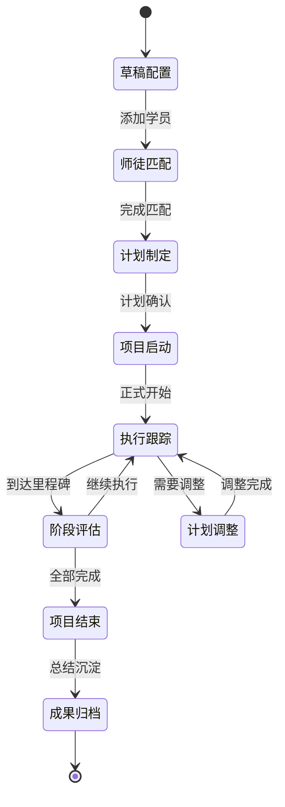

---

## 5. 教务工作台的带教管理

### 5.1 功能定位

教务工作台的带教管理是**全局性、跨项目**的带教资源和数据管理中心，为所有带教项目提供资源支撑和决策支持。

### 5.2 核心功能模块

#### 5.2.1 师资池管理 (Mentor Pool Management)

**功能目标**：基于公司《带教老师管理办法》，构建和维护导师资源库

**核心功能**：

##### A. 两级导师认证体系
基于公司制度，建立两级导师体系：

| 导师级别 | 任职要求 | 认证流程 | 带教权限 |
|---------|---------|---------|---------|
| **部门指定带教老师** | • 分享意愿高<br/>• 企业文化认同度高<br/>• 岗位技能娴熟<br/>• 通过书院审核 | • 部门经理指定<br/>• 书院核定选任情况<br/>• 入职一周内绑定关系 | 基础岗位技能带教 |
| **书院认证带教老师** | • 集团内任职满2年及以上，年度考评良好+<br/>• 三年内有成功带教记录<br/>• 通过带教老师必修课（考试>90分）<br/>• 两年内有教案记录并通过书院审核<br/>• 年度评价无2名学员<75分记录 | • 参加年中《带教老师必修课》<br/>• 考试获得传承卡<br/>• 书院审核资质<br/>• 年底公示认证名单 | 高级岗位技能带教<br/>专业路线发展指导 |

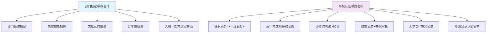

##### B. 导师资质管理系统
**部门指定带教老师资质追踪**：
- **指定流程管理**：部门经理指定→HRBP推送→书院核定→系统绑定
- **技能评估记录**：考试测试、无领导小组面试结果记录
- **分配平衡监控**：同部门多导师时的负荷平衡算法
- **地点匹配优化**：优先匹配同工作地点的师徒关系

**书院认证带教老师资质追踪**：
- **年限验证**：自动验证任职时间和年度考评等级
- **成功记录追踪**：三年内带教项目和学员任职情况统计
- **考试管理**：必修课考试成绩和传承卡状态管理
- **教案审核流程**：教案上传→书院审核→发布状态追踪
- **评价监控**：学员评分持续监控，低于75分预警

##### C. 制度化100分制评价体系

**评价体系核心理念**：基于《带教老师管理办法》建立标准化、可量化、可追溯的四维度评价体系

**管理办法量化评价标准详解**：

基于《带教老师管理办法》第4.1节评价体系，建立**三维度量化评价标准**（总分100分）：

| 评价维度 | 分值权重 | 评价项目 | 量化评分标准 | 评分时间节点 | 考核要点 |
|---------|---------|---------|-------------|-------------|---------|
| **认识维度** | 15分 | **明确表达带教责任**<br/>带教老师明确向学员表达："我是你的带教老师，接下来一年时间我会对你的成长负责任" | **10分**：已明确表达<br/>**0分**：未明确表达 | 入职当日 | • 是否在入职当日明确表达<br/>• 表达是否真诚和负责<br/>• 学员是否理解并认可 |
| | | **环境引导和关怀**<br/>带教老师带领新员工熟悉工作环境，并共同就餐一次 | **5分**：已完成环境引导+共同就餐<br/>**3分**：仅完成环境引导<br/>**1分**：引导不充分<br/>**0分**：未进行引导 | 入职一周内 | • 是否带领熟悉工作环境<br/>• 是否共同就餐<br/>• 关怀是否到位 |
| **技能维度** | 50分 | **一对一带教时长**<br/>每周专门的一对一带教时间投入 | **20分**：≥4小时/周<br/>**15分**：≥3小时/周<br/>**10分**：≥2小时/周<br/>**0分**：<2小时/周 | 入职3个月内 | • 实际一对一带教时长<br/>• 带教时间的规律性<br/>• 带教内容的质量 |
| | | **岗位专业知识掌握**<br/>导师对岗位专业知识的掌握程度 | **10分**：非常精通<br/>**8分**：比较精通<br/>**6分**：基本掌握<br/>**4分**：部分掌握<br/>**2分**：掌握较少<br/>**0分**：非常差劲 | 转正时评价 | • 专业知识的准确性<br/>• 知识体系的完整性<br/>• 传授能力的专业性 |
| | | **有效解决问题**<br/>导师帮助学员解决问题的能力和态度 | **10分**：非常有效<br/>**8分**：比较有效<br/>**6分**：基本有效<br/>**4分**：部分有效<br/>**2分**：效果较差<br/>**0分**：置答不理 | 转正时评价 | • 问题解决的及时性<br/>• 解决方案的有效性<br/>• 解决问题的态度 |
| | | **思路清晰、表达清晰**<br/>导师的思维逻辑和表达能力 | **10分**：非常清晰<br/>**8分**：比较清晰<br/>**6分**：基本清晰<br/>**4分**：部分清晰<br/>**2分**：表达较差<br/>**0分**：很糟糕 | 转正时评价 | • 思维逻辑的清晰度<br/>• 语言表达的准确性<br/>• 沟通效果的有效性 |
| **文化和人文维度** | 35分 | **面对面沟通频次**<br/>带教老师主动与学员面对面沟通的频次 | **20分**：>3次/月<br/>**15分**：2次/月<br/>**10分**：1次/月<br/>**0分**：0次/月 | 入职4-12个月 | • 沟通的主动性<br/>• 沟通的规律性<br/>• 沟通的质量 |
| | | **正式谈心和关怀**<br/>关心学员工作生活情况，帮助疏导情绪，共同就餐次数 | **5分**：与带教老师共餐次数≥5次<br/>**3分**：共餐3-4次<br/>**1分**：共餐1-2次<br/>**0分**：未共餐 | 发放带教补贴前 | • 关心学员生活的程度<br/>• 情绪疏导的效果<br/>• 师徒关系的亲密度 |
| | | **沟通对学员的情感影响**<br/>通过与带教老师沟通，对学员自身排解压力的影响 | **5分**：非常高兴（很有帮助）<br/>**4分**：比较高兴<br/>**3分**：一般<br/>**2分**：有些担忧<br/>**1分**：比较担忧<br/>**0分**：非常担忧 | 发放带教补贴前 | • 沟通是否缓解压力<br/>• 是否提升工作信心<br/>• 是否促进心理健康 |
| | | **主动分享经验的意愿度**<br/>带教老师主动分享工作经验和心得的意愿 | **5分**：非常愿意<br/>**4分**：比较愿意<br/>**3分**：一般<br/>**2分**：不太愿意<br/>**1分**：比较勉强<br/>**0分**：非常勉强 | 发放带教补贴前 | • 分享经验的主动性<br/>• 分享内容的价值<br/>• 分享态度的真诚度 |

**评价标准说明**：
- **总分100分**：认识15分 + 技能50分 + 文化和人文35分
- **90分合格线**：达到90分及以上符合补贴发放条件
- **75分预警线**：累计2名学员评价<75分，取消带教老师资格
- **量化标准严格执行**：每个评价项目都有明确的分数对应标准

**三时间节点评价管理体系**：

| 评价类型 | 执行时间 | 评价目的 | 评价责任人 | 参与人员 | 评价重点 | 结果用途 |
|---------|---------|---------|-----------|---------|---------|---------|
| **转正前评价** | 试用期结束前1周 | 考察试用期带教效果<br/>为转正决策提供依据<br/>**师徒互评** | 学员本人+带教老师 | 学员+HR+部门经理 | • 基础适应能力<br/>• 初期学习效果<br/>• 师徒关系建立 | • 转正决策主要参考<br/>• 带教方式调整<br/>• 后续计划制定 |
| **年度带教评价** | 学员入职满一年时 | 全面评价带教质量<br/>评估年度带教成果<br/>**师徒互评** | 学员本人+带教老师 | 学员+部门领导+HRBP | • 全面技能掌握<br/>• 工作胜任能力<br/>• 综合成长效果 | • 补贴发放主要依据<br/>• 导师年度评价<br/>• 带教项目总结 |
| **补贴统计评价** | 每年6月、12月 | 补贴发放前最终确认<br/>质量控制检查 | 学员本人 | 学员+书院管理员 | • 90分达标检查<br/>• 带教质量确认<br/>• 风险项目识别 | • 补贴发放最终依据<br/>• 资格审核标准<br/>• 风险预警触发 |

**评价质量保障机制**：

| 保障环节 | 具体措施 | 责任主体 | 执行标准 |
|---------|---------|---------|---------|
| **评价标准统一** | • 统一评价表单<br/>• 标准化评分细则<br/>• 评价培训指导 | 书院+HRBP | 确保评价标准一致性 |
| **评价过程监控** | • 评价完成时间检查<br/>• 评价内容质量审核<br/>• 异常评分预警 | 系统自动+人工审核 | 及时发现评价问题 |
| **评价结果应用** | • 90分合格线执行<br/>• 连续低分预警<br/>• 取消资格管理 | 书院管理 | 严格按制度执行 |

**界面设计要点**：
```
师资池管理:
┌─────────────────────────────────────┐
│ 📊 导师概览                          │
│ 书院认证: 45人  部门指定: 156人       │
│ 认证中: 23人  资质到期: 8人          │
│                                     │
│ 🏅 认证管理                          │
│ [必修课安排] [资质审核] [年度公示]     │
│                                     │
│ 📋 导师列表                          │
│ 李老师 | 书院认证 | Java专家 | 96分评价 │
│ 王老师 | 部门指定 | 前端开发 | 88分评价 │
│ 张老师 | 认证中   | 产品设计 | 待审核   │
└─────────────────────────────────────┘
```

##### D. 导师负荷与匹配优化
- **智能负荷计算**：基于导师级别、当前项目数、学员反馈动态调整负荷
- **最优匹配算法**：综合技能匹配、性格匹配、历史成功率等因素推荐导师
- **预警机制**：导师负荷过重、评价下降、认证到期等自动提醒

#### 5.2.2 模板库管理 (Template Library Management)

**功能目标**：维护标准化的带教项目模板

**模板分类**：
- **岗位模板**：按不同岗位设计的标准培养模板
- **阶段模板**：可复用的阶段性培养内容模板
- **任务模板**：具体的带教任务和评估标准模板
- **评估模板**：标准化的评估表单和标准模板

**界面设计要点**：
```
模板库管理:
┌─────────────────────────────────────┐
│ 📚 模板分类                          │
│ ├─ 岗位模板 (23个)                   │
│ │  ├─ Java开发工程师模板              │
│ │  ├─ 产品经理模板                    │
│ │  └─ UI设计师模板                    │
│ ├─ 阶段模板 (15个)                   │  
│ │  ├─ 新人入职阶段模板                │
│ │  └─ 技能提升阶段模板                │
│ └─ 评估模板 (8个)                    │
│    ├─ 30天评估模板                   │
│    └─ 出师评估模板                    │
│                                     │
│ [新建模板] [导入模板] [批量管理]        │
└─────────────────────────────────────┘
```

#### 5.2.3 项目管理中心 (Project Management Center)

**功能目标**：全局管理所有带教项目

**核心功能**：
- **项目看板**：所有带教项目的状态概览
- **项目检索**：按部门、状态、类型等维度筛选项目
- **批量操作**：批量启动、暂停、结束项目
- **异常监控**：识别风险项目并提供干预建议

**界面设计要点**：
```
项目管理中心:
┌─────────────────────────────────────┐
│ 📈 项目统计看板                      │
│ 进行中: 28个  |  已完成: 156个        │
│ 本月新增: 12个  |  风险项目: 3个      │
│                                     │
│ 🔍 项目筛选                          │  
│ [项目类型▼] [状态▼] [部门▼] [时间▼]   │
│                                     │
│ 📋 项目列表                          │
│ 管培生项目2024 | 阶段式 | 进行中 | 技术部 │
│ 张三入职带教   | 一对一 | 进行中 | 产品部 │
│ 新人批量带教   | 阶段式 | 已完成 | 设计部 │
└─────────────────────────────────────┘
```

#### 5.2.4 带教老师补贴管理 (Mentor Compensation Management)

**功能目标**：基于《带教老师、讲师及导师管理办法》，规范化管理导师带教补贴的核算和发放，确保制度执行的精确性和公正性

**核心理念**：实现补贴管理的数字化、制度化、透明化，确保每一笔补贴都有据可查、有章可循

##### A. 制度化补贴标准体系

**分级分序列补贴标准**：

| 导师级别 | 工人序列补贴 | 文员序列补贴 | 适用说明 |
|---------|-------------|-------------|---------|
| **部门指定带教老师** | ¥500/人·期 | ¥1,000/人·期 | 一线现场作业人员：仓管员、叉车工、清洗工、污水工、维修工、现场工等 |
| **书院认证带教老师** | ¥1,000/人·期 | ¥3,000/人·期 | 通过书院认证、持有传承卡的高级导师 |

**补贴发放周期**：
- **统计周期**：每年6月、12月进行补贴统计
- **发放条件**：所带学员在职、入职满一年及以上，且考核合格
- **特殊说明**：技术序列人员（已获评军士长）除不再享受补贴外，其他考核方式相同

##### B. 六项核心考核指标体系

基于管理办法，建立**6项全满足考核机制**（任一项不达标直接影响补贴发放）：

| 序号 | 考核指标 | 具体要求 | 不达标处理 | 系统实现要点 |
|-----|---------|---------|-----------|-------------|
| **1** | **学员在职考核** | • 所带学员仍在职<br/>• 入职满一年及以上<br/>• 学员考核合格 | 不符合直接取消补贴资格 | • 实时在职状态检查<br/>• 精确入职时间计算<br/>• 绩效考核记录验证 |
| **2** | **评价分数要求** | • 学员带教评价达90分及以上<br/>• 基于100分制四维度评价 | 不符合直接取消补贴资格 | • 四维度分数统计<br/>• 态度+内容+方法+效果<br/>• 各维度25分制精确计算 |
| **3** | **带教成功率分档** | • 年度带教成功率 = 在职学员数÷总学员数<br/>• 被动离职不影响成功率 | **分档发放**：<br/>• <20%：不予发放<br/>• 20%-50%：按50%发放<br/>• ≥50%：全额发放 | • 年度学员总数统计<br/>• 在职学员实时统计<br/>• 离职原因智能识别<br/>• 被动离职自动排除 |
| **4** | **无投诉事故** | • 带教老师本人无投诉/事故<br/>• 所带学员无投诉/事故<br/>• 限制在学员入职年度内 | 不符合直接取消补贴资格 | • 投诉记录系统查询<br/>• 事故记录系统查询<br/>• 时间范围精确限定<br/>• 多系统数据联查 |
| **5** | **教案记录要求** | • 书院平台有教案记录或培训经历<br/>• PPT+视频+测试标准<br/>• 战狼/海豹培训授课记录 | **系数调整**：<br/>• 有教案：100%发放<br/>• 无教案：50%发放 | • 教案上传记录检查<br/>• 书院审核状态验证<br/>• 培训项目参与记录<br/>• 教案标准符合性验证 |
| **6** | **带教时长要求** | • 实际带教时间不少于3个月<br/>• 带教过程真实有效<br/>• 师徒关系持续稳定 | **分档发放**：<br/>• <3个月：不予发放<br/>• 3-6个月：50%发放<br/>• ≥6个月：全额发放 | • 带教开始时间记录<br/>• 带教结束时间记录<br/>• 精确天数自动计算<br/>• 带教过程真实性验证 |

##### C. 智能化补贴计算引擎

**新版计算模型**：避免多重惩罚的公平计算
```
最终补贴金额 = 基础补贴标准 × MIN(成功率系数, 时长系数, 教案系数, 其他系数)
```

**计算逻辑说明**：
- **原则**：取所有折扣系数中的最低值，避免多重惩罚
- **合理性**：如果导师在某一方面存在问题，按该问题对应的折扣执行，不会因多个问题叠加而过度惩罚
- **公平性**：确保最终补贴不会因为多个50%折扣而降到25%或更低

**计算示例对比**：

| 情况 | 成功率系数 | 时长系数 | 教案系数 | 旧公式结果 | 新公式结果 | 说明 |
|------|-----------|---------|---------|-----------|-----------|------|
| 完全达标 | 1.0 | 1.0 | 1.0 | 100% | 100% | 无变化 |
| 成功率偏低 | 0.5 | 1.0 | 1.0 | 50% | 50% | 无变化 |
| 多项问题 | 0.5 | 0.5 | 0.5 | 12.5% | 50% | 避免多重惩罚 |
| 部分问题 | 0.5 | 1.0 | 0.5 | 25% | 50% | 取最低折扣 |
| 不合格项 | 0 | 1.0 | 1.0 | 0% | 0% | 直接取消不变 |

**各计算模块详细逻辑**：

| 计算模块 | 核算逻辑 | 数据来源 | 系统处理 | 输出结果 |
|---------|---------|---------|---------|---------|
| **基础补贴核算** | 导师级别 × 学员序列 → 基础金额 | • 导师认证状态表<br/>• 学员人员分类表<br/>• 补贴标准配置表 | • 自动匹配补贴标准<br/>• 实时级别状态检查<br/>• 序列分类自动识别 | 基础补贴金额（¥500/1000/3000） |
| **成功率系数计算** | 年度成功率 → 分档系数 | • 年度带教学员明细<br/>• 在职状态实时数据<br/>• 离职原因记录 | • 实时在职统计<br/>• 被动离职排除<br/>• 自动分档映射 | 成功率系数（0/0.5/1.0） |
| **时长系数计算** | 带教时长 → 分档系数 | • 带教开始时间<br/>• 带教结束时间<br/>• 师徒关系记录 | • 精确天数计算<br/>• 有效时长验证<br/>• 自动分档映射 | 时长系数（0/0.5/1.0） |
| **教案系数调整** | 教案状态 → 调整系数 | • 教案上传记录<br/>• 书院审核状态<br/>• 培训参与记录 | • 教案状态检查<br/>• 培训记录验证<br/>• 系数智能映射 | 教案系数（0.5/1.0） |
| **综合金额计算** | **取最低系数运算**（新） | 以上所有模块结果 | • **MIN函数取最低值**<br/>• 金额精确计算<br/>• 异常情况处理 | 最终应发补贴金额 |

**计算引擎核心算法**：
```typescript
// 补贴计算核心算法（修正版）
function calculateMentorCompensation(mentorId: string, assessmentPeriod: string): CompensationResult {
  // 1. 获取基础补贴标准
  const baseAmount = getBaseCompensationAmount(mentorId);
  
  // 2. 计算各项系数
  const successRate = calculateAnnualSuccessRate(mentorId, assessmentPeriod);
  const successRateMultiplier = getSuccessRateMultiplier(successRate);
  
  const mentoringDuration = calculateMentoringDuration(mentorId);
  const durationMultiplier = getDurationMultiplier(mentoringDuration);
  
  const hasTeachingMaterials = checkTeachingMaterials(mentorId);
  const materialMultiplier = hasTeachingMaterials ? 1.0 : 0.5;
  
  // 3. 【关键修改】取最低系数，避免多重惩罚
  const allMultipliers = [successRateMultiplier, durationMultiplier, materialMultiplier];
  const finalMultiplier = Math.min(...allMultipliers);
  
  // 4. 计算最终金额
  const finalAmount = baseAmount * finalMultiplier;
  
  // 5. 验证所有必要条件（0分条件检查）
  const eligibilityCheck = validateEligibility(mentorId, assessmentPeriod);
  
  return {
    baseAmount,
    successRateMultiplier,
    durationMultiplier,
    materialMultiplier,
    finalMultiplier,  // 新增：实际使用的系数
    finalAmount: eligibilityCheck.eligible ? finalAmount : 0,
    eligible: eligibilityCheck.eligible,
    ineligibleReasons: eligibilityCheck.reasons,
    calculationMethod: 'MIN_MULTIPLIER' // 新增：计算方法标识
  };
}
```

**系数优先级说明**：
```
系数类型及其含义：
• 1.0系数：完全达标，无折扣
• 0.5系数：存在问题，50%折扣
• 0.0系数：严重违规，直接取消补贴资格

新计算逻辑：
• 如果任一系数为0：最终补贴为0（直接取消）
• 如果最低系数为0.5：最终按50%发放
• 如果所有系数为1.0：按100%发放
• 避免多个0.5系数相乘变成0.25（25%）
```

##### D. 全方位预警监控体系

**实时风险预警机制**：

| 预警类型 | 触发条件 | 预警时机 | 通知对象 | 自动处理 | 人工干预建议 |
|---------|---------|---------|---------|---------|-------------|
| **成功率风险预警** | 年度成功率 < 50% | 每月末统计 | 导师本人 + 书院管理员 | • 标记风险状态<br/>• 自动发送提醒 | • 加强带教跟进<br/>• 分析离职原因<br/>• 改进带教方法 |
| **评分不达标预警** | 学员评价 < 90分 | 评价提交后24小时内 | 导师本人 + HRBP | • 风险等级标记<br/>• 补贴影响计算 | • 制定改进计划<br/>• 增加指导频次<br/>• 技能培训补强 |
| **时长不足预警** | 带教时长 < 6个月 | 每月第1个工作日 | 导师 + 部门经理 | • 时长不足标记<br/>• 系数影响提示 | • 延长带教周期<br/>• 确认带教必要性<br/>• 调整带教计划 |
| **教案缺失预警** | 无有效教案记录 | 补贴统计前30天 | 导师本人 | • 教案缺失标记<br/>• 50%系数预警 | • 上传教案材料<br/>• 申请培训记录<br/>• 完善教学资料 |
| **投诉事故预警** | 检测到投诉/事故记录 | 记录产生后即时 | 导师 + 书院 + HRBP | • 补贴资格冻结<br/>• 风险等级提升 | • 立即整改措施<br/>• 风险深度评估<br/>• 预防性干预 |
| **合规风险预警** | 任一考核指标异常 | 实时监控 | 相关责任人 | • 风险等级评估<br/>• 补贴影响计算 | • 针对性整改<br/>• 系统性排查<br/>• 流程优化改进 |

##### E. 制度化四步审批流程

**严格按照管理办法执行的审批链条**：

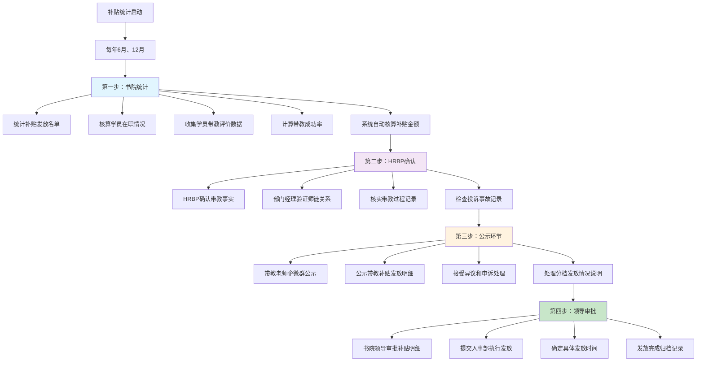

**各环节详细实现标准**：

| 审批环节 | 负责人员 | 执行时间 | 核心工作内容 | 系统支持功能 | 输出结果 |
|---------|---------|---------|-------------|-------------|---------|
| **书院统计** | 书院工作人员 | 每年6月、12月<br/>统计期间 | • 自动统计补贴发放名单<br/>• 核算所带学员在职情况<br/>• 收集学员带教评价数据<br/>• 计算年度带教成功率<br/>• 核对投诉事故记录<br/>• 检查教案上传状态 | • 全自动数据统计<br/>• 多系统数据整合<br/>• 智能异常识别<br/>• 补贴金额自动计算<br/>• 风险预警提示 | 《补贴发放统计表》<br/>《风险明细报告》<br/>《异常情况清单》 |
| **HRBP确认** | 部门经理<br/>HRBP辅助 | 统计完成后<br/>3个工作日内 | • 逐一确认带教事实是否存在<br/>• 核实师徒关系真实性<br/>• 验证带教过程记录完整性<br/>• 确认带教时长有效性<br/>• 核对部门内带教安排 | • 带教记录查询<br/>• 师徒关系验证<br/>• 过程记录展示<br/>• 异常情况标记<br/>• 确认状态管理 | 《带教事实确认表》<br/>《师徒关系验证报告》<br/>《异常情况处理意见》 |
| **公示环节** | 书院<br/>企微群管理员 | 确认完成后<br/>5个工作日 | • 带教老师企微群公示补贴明细<br/>• 公示分档发放具体原因<br/>• 接受带教老师异议申诉<br/>• 处理公示期间的问题反馈<br/>• 记录异议处理过程 | • 自动生成公示内容<br/>• 企微群自动发布<br/>• 异议申诉管理<br/>• 处理过程记录<br/>• 公示状态跟踪 | 《公示公告》<br/>《异议处理记录》<br/>《公示期间反馈汇总》 |
| **领导审批** | 书院领导<br/>人事部 | 公示无异议后<br/>2个工作日内 | • 书院领导最终审批补贴明细<br/>• 提交人事部执行发放指令<br/>• 确定具体发放时间表<br/>• 建立发放档案记录<br/>• 完成流程闭环管理 | • 审批流程管理<br/>• 发放指令生成<br/>• 时间计划安排<br/>• 档案自动归档<br/>• 流程状态跟踪 | 《审批通过通知》<br/>《发放执行指令》<br/>《发放时间安排表》<br/>《流程完成档案》 |

##### F. 用户界面设计规范

**补贴管理主界面设计**：
```
┌─ 带教老师补贴管理系统 ─────────────────────────────┐
│                                                    │
│ 📊 统计概览（2024年下半年统计）                      │
│ ┌──────────────────────────────────────────────┐   │
│ │ 总待发补贴：¥245,500  已发放：¥189,000         │   │
│ │ 合格导师：89人        不合格：12人             │   │
│ │ 公示状态：进行中      风险导师：3人             │   │
│ └──────────────────────────────────────────────┘   │
│                                                    │
│ 🏅 补贴标准速查                                     │
│ ┌──────────┬──────────┬──────────┬──────────┐     │
│ │导师级别    │工人序列  │文员序列  │发放周期  │     │
│ ├──────────┼──────────┼──────────┼──────────┤     │
│ │部门指定    │¥500     │¥1,000   │半年统计  │     │
│ │书院认证    │¥1,000   │¥3,000   │半年统计  │     │
│ └──────────┴──────────┴──────────┴──────────┘     │
│                                                    │
│ 📋 六项考核指标达标情况                             │
│ ┌──────────────────────────────────────────────┐   │
│ │ ✅ 90分+评价：78人   ⚠️  时长不足：5人          │   │
│ │ ✅ 成功率≥50%：85人   ❌ 投诉事故：2人          │   │
│ │ ✅ 在职考核：92人     ⚠️  教案缺失：8人         │   │
│ └──────────────────────────────────────────────┘   │
│                                                    │
│ 📈 补贴核算明细（支持导出Excel）                    │
│ ┌──────┬──────┬──────┬──────┬──────┬──────┬──────┐ │
│ │姓名  │级别  │序列  │评分  │成功率│时长  │应发  │ │
│ ├──────┼──────┼──────┼──────┼──────┼──────┼──────┤ │
│ │李老师│书院认│文员  │95分  │80%  │8个月│¥3,000│ │
│ │王老师│部门指│工人  │88分  │30%  │4个月│¥125  │ │
│ │张老师│书院认│文员  │92分  │65%  │7个月│¥1,500│ │
│ │赵老师│部门指│文员  │<90分 │45%  │2个月│¥0   │ │
│ └──────┴──────┴──────┴──────┴──────┴──────┴──────┘ │
│                                                    │
│ 🚨 风险预警面板                                     │
│ • 李某某：学员评价86分，低于90分标准                │
│ • 王某某：年度成功率18%，低于20%最低标准           │
│ • 张某某：带教时长2.5个月，不满足3个月要求         │
│                                                    │
│ [导出统计报告] [开始公示流程] [审批状态查询]          │
└────────────────────────────────────────────────────┘
```

**审批流程界面设计**：
```
┌─ 补贴审批流程跟踪 ─────────────────────────────────┐
│                                                    │
│ 🔄 当前流程状态：第三步 - 公示环节                   │
│                                                    │
│ ✅ 第一步：书院统计      ✅ 第二步：HRBP确认        │
│ 📅 完成时间：2024-12-01   📅 完成时间：2024-12-03  │
│                                                    │
│ 🔄 第三步：公示环节（进行中）                       │
│ 📅 开始时间：2024-12-04                            │
│ 📅 截止时间：2024-12-09                            │
│ 📊 公示内容：89人补贴明细已发布企微群               │
│ 💬 异议情况：收到2条异议，已处理1条，处理中1条      │
│                                                    │
│ ⏳ 第四步：领导审批（待执行）                       │
│ 📅 预计时间：2024-12-10                            │
│                                                    │
│ [查看公示详情] [处理异议申诉] [推进到下一步]          │
└────────────────────────────────────────────────────┘
```

#### 5.2.5 评价管理中心 (Evaluation Management Center)

**功能目标**：统一管理和监控所有带教老师的评价活动，确保评价体系的标准化执行和质量控制

**核心理念**：建立全生命周期的评价管理，从评价发起、执行、审核到结果应用的完整闭环

##### A. 评价任务管理

**自动化评价任务调度**：

| 任务类型 | 触发条件 | 任务内容 | 责任分配 | 执行标准 |
|---------|---------|---------|---------|---------|
| **转正前评价任务** | 学员试用期结束前7天 | • 自动创建评价任务<br/>• 推送评价通知<br/>• 设置截止时间<br/>• 跟踪完成状态<br/>• **师徒互评同步进行** | **评价人**：学员本人+带教老师<br/>**协助人**：HR+部门经理<br/>**审核人**：书院管理员 | 试用期结束前必须完成 |
| **年度评价任务** | 学员入职满365天时 | • 计算入职满一年时间<br/>• 创建年度评价任务<br/>• 通知相关责任人<br/>• 安排评价时间<br/>• **师徒互评同步进行** | **评价人**：学员本人+带教老师<br/>**参与人**：部门领导+HRBP<br/>**审核人**：书院管理员 | 入职满一年后30天内完成 |
| **补贴统计评价任务** | 每年6月1日、12月1日 | • 批量创建评价任务<br/>• 统一评价时间安排<br/>• 集中质量控制<br/>• 汇总评价结果 | **评价人**：学员本人<br/>**监督人**：书院管理员<br/>**审核人**：书院领导 | 统计月15日前必须完成 |

**评价任务状态跟踪**：

| 任务状态 | 状态描述 | 系统行为 | 责任人操作 |
|---------|---------|---------|-----------|
| **待发起** | 任务已创建，等待发起 | 自动推送通知给责任人 | 责任人确认并启动评价 |
| **进行中** | 评价任务正在执行 | 进度跟踪和提醒 | 学员填写评价表单 |
| **待审核** | 评价已提交，等待审核 | 推送审核通知 | 审核人员质量检查 |
| **已完成** | 评价审核通过 | 结果记录和应用 | 结果用于补贴等决策 |
| **已逾期** | 评价任务超过截止时间 | 自动标记逾期，发送警告 | 紧急处理和补救 |

##### B. 评价表单数字化管理

**管理办法标准化评价表单设计**：
```
┌─ 带教老师带教质量评价表（100分制-管理办法标准） ──────┐
│                                                      │
│ 📋 基本信息                                           │
│ 被评价导师：[李老师]    评价学员：[张三]              │
│ 评价类型：[年度带教评价]  评价时间：[2024-12-05]      │
│ 带教时长：[8个月]      带教项目：[新员工带教项目]      │
│                                                      │
│ 📊 三维度量化评价（总分100分）                         │
│                                                      │
│ 1️⃣ 认识维度评价（15分）                               │
│ ┌────────────────────────────────────────────────┐ │
│ │ 明确表达带教责任 [已完成✓] 10分                  │ │
│ │ ☑ 入职当日明确表达："我是你的带教老师，接下来一年 │ │
│ │   时间我会对你的成长负责任"                       │ │
│ │ ☑ 表达真诚且负责任，学员理解并认可               │ │
│ │                                                │ │
│ │ 环境引导和关怀 [已完成✓] 5分                    │ │
│ │ ☑ 入职一周内带领熟悉工作环境                     │ │
│ │ ☑ 共同就餐一次                                   │ │
│ │ ☑ 关怀到位，让我感到温暖                         │ │
│ │                                                │ │
│ │ 认识维度小计：15分 / 15分                        │ │
│ └────────────────────────────────────────────────┘ │
│                                                      │
│ 2️⃣ 技能维度评价（50分）                               │
│ ┌────────────────────────────────────────────────┐ │
│ │ 一对一带教时长 [≥4小时/周] 20分                  │ │
│ │ ○ ≥4小时/周 (20分) ● ≥3小时/周 (15分)           │ │
│ │ ○ ≥2小时/周 (10分) ○ <2小时/周 (0分)            │ │
│ │ 实际：每周约5小时的专门带教时间                   │ │
│ │                                                │ │
│ │ 岗位专业知识掌握 [非常精通] 10分                 │ │
│ │ ○ 非常精通(10分) ● 比较精通(8分) ○ 基本掌握(6分) │ │
│ │ ○ 部分掌握(4分) ○ 掌握较少(2分) ○ 非常差劲(0分) │ │
│ │ 评价：专业知识扎实，传授准确                     │ │
│ │                                                │ │
│ │ 有效解决问题 [非常有效] 10分                     │ │
│ │ ● 非常有效(10分) ○ 比较有效(8分) ○ 基本有效(6分) │ │
│ │ ○ 部分有效(4分) ○ 效果较差(2分) ○ 置答不理(0分) │ │
│ │ 评价：问题解决及时有效，态度很好                 │ │
│ │                                                │ │
│ │ 思路清晰、表达清晰 [非常清晰] 10分               │ │
│ │ ● 非常清晰(10分) ○ 比较清晰(8分) ○ 基本清晰(6分) │ │
│ │ ○ 部分清晰(4分) ○ 表达较差(2分) ○ 很糟糕(0分)   │ │
│ │ 评价：思维清晰，表达准确，沟通效果好             │ │
│ │                                                │ │
│ │ 技能维度小计：50分 / 50分                        │ │
│ └────────────────────────────────────────────────┘ │
│                                                      │
│ 3️⃣ 文化和人文维度评价（35分）                         │
│ ┌────────────────────────────────────────────────┐ │
│ │ 面对面沟通频次 [>3次/月] 20分                    │ │
│ │ ● >3次/月(20分) ○ 2次/月(15分) ○ 1次/月(10分)   │ │
│ │ ○ 0次/月(0分)                                   │ │
│ │ 实际：每月平均4-5次面对面沟通，主动性强          │ │
│ │                                                │ │
│ │ 正式谈心和关怀 [共餐≥5次] 5分                   │ │
│ │ ● 共餐≥5次(5分) ○ 共餐3-4次(3分)               │ │
│ │ ○ 共餐1-2次(1分) ○ 未共餐(0分)                 │ │
│ │ 实际：与老师共餐6次，关心我的生活情况           │ │
│ │                                                │ │
│ │ 沟通对学员的情感影响 [非常高兴] 5分             │ │
│ │ ● 非常高兴(5分) ○ 比较高兴(4分) ○ 一般(3分)     │ │
│ │ ○ 有些担忧(2分) ○ 比较担忧(1分) ○ 非常担忧(0分) │ │
│ │ 评价：沟通很有帮助，缓解压力，提升信心           │ │
│ │                                                │ │
│ │ 主动分享经验的意愿度 [非常愿意] 5分             │ │
│ │ ● 非常愿意(5分) ○ 比较愿意(4分) ○ 一般(3分)     │ │
│ │ ○ 不太愿意(2分) ○ 比较勉强(1分) ○ 非常勉强(0分) │ │
│ │ 评价：主动分享宝贵经验，毫无保留               │ │
│ │                                                │ │
│ │ 文化和人文维度小计：35分 / 35分                  │ │
│ └────────────────────────────────────────────────┘ │
│                                                      │
│ 🎯 综合评价结果                                       │
│ ┌────────────────────────────────────────────────┐ │
│ │ 认识：15分  技能：50分  文化和人文：35分          │ │
│ │                                                │ │
│ │ 🏆 总分：100分 / 100分  评价等级：优秀             │ │
│ │                                                │ │
│ │ ✅ 远超90分合格标准（完全符合补贴发放条件）        │ │
│ └────────────────────────────────────────────────┘ │
│                                                      │
│ 💭 综合文字评价（必填，不少于50字）                   │
│ ┌────────────────────────────────────────────────┐ │
│ │ 李老师是一位非常优秀的带教老师。从入职第一天就明  │ │
│ │ 确承担带教责任，每周投入大量时间进行一对一指导，  │ │
│ │ 专业知识扎实，问题解决及时有效。主动关心我的工作  │ │
│ │ 和生活，经常请我吃饭谈心，分享宝贵经验。与老师的  │ │
│ │ 沟通让我收获很大，工作信心显著提升。              │ │
│ └────────────────────────────────────────────────┘ │
│                                                      │
│ [保存草稿] [提交评价] [重新评价]                       │
└──────────────────────────────────────────────────────┘
```

##### C. 评价质量监控体系

**多层次质量检查机制**：

| 检查层级 | 检查内容 | 检查标准 | 处理机制 |
|---------|---------|---------|---------|
| **系统自动检查** | • 评价完整性检查<br/>• 分数合理性验证<br/>• 异常评分识别<br/>• 时间规范性检查 | • 四维度必须全部填写<br/>• 各维度分数在0-25分范围<br/>• 总分与分项一致<br/>• 文字评价不少于50字 | • 自动提示补充<br/>• 阻止不合规提交<br/>• 异常预警<br/>• 强制规范化 |
| **人工初审** | • 评价内容真实性<br/>• 评分依据合理性<br/>• 文字评价质量<br/>• 评价态度检查 | • 内容具体真实<br/>• 评分有理有据<br/>• 文字表达清晰<br/>• 评价态度认真 | • 评价质量反馈<br/>• 要求重新评价<br/>• 评价培训指导<br/>• 建立评价档案 |
| **专业复审** | • 评价结果一致性<br/>• 跨项目对比分析<br/>• 历史评价趋势<br/>• 异常情况调查 | • 同导师多学员评价一致性<br/>• 评价结果符合常理<br/>• 评价趋势合理<br/>• 异常必须有说明 | • 深度调查分析<br/>• 约谈相关人员<br/>• 调整评价结果<br/>• 改进评价制度 |

**评价异常识别与处理**：

| 异常类型 | 识别标准 | 预警级别 | 处理措施 |
|---------|---------|---------|---------|
| **评分过高异常** | 连续多名学员给同一导师95分以上 | 🟡 中等风险 | • 抽查评价依据<br/>• 核实带教质量<br/>• 交叉验证评价 |
| **评分过低异常** | 学员给导师评分低于75分 | 🔴 高风险 | • 立即深度调查<br/>• 约谈师徒双方<br/>• 制定改进方案 |
| **评分波动异常** | 同一导师评分差异超过20分 | 🟠 中高风险 | • 分析波动原因<br/>• 核实特殊情况<br/>• 标准化培训 |
| **评价延迟异常** | 评价任务超期未完成 | 🟡 中等风险 | • 催促完成评价<br/>• 分析延迟原因<br/>• 流程优化改进 |

##### D. 评价结果应用管理

**90分合格线严格执行**：
```
评价结果应用决策树:
                    评价结果
                       │
            ┌─────────┴─────────┐
            │                   │
         ≥90分                <90分
            │                   │
    ┌─────────────┐         ┌─────────────┐
    │  符合补贴条件  │         │  不符合补贴条件 │
    │  继续带教资格  │         │  启动改进计划   │
    │  优秀导师候选  │         │  跟踪提升效果   │
    └─────────────┘         └─────────────┘
            │                   │
    [正常发放补贴]           [取消补贴资格]
    [年度优秀评选]           [制定改进方案]
    [经验分享推广]           [增加培训支持]
```

**连续低分预警管理**：

| 预警触发条件 | 预警级别 | 处理措施 | 责任人 |
|-------------|---------|---------|--------|
| 单次评价<75分 | 🟠 中高风险 | • 即时约谈导师<br/>• 分析问题原因<br/>• 制定改进计划<br/>• 增加指导频次 | 书院+HRBP |
| 连续2次<80分 | 🔴 高风险 | • 深度调查分析<br/>• 暂停新学员分配<br/>• 专项培训计划<br/>• 考虑调整岗位 | 书院+部门经理 |
| 累计2名学员<75分 | ❌ 直接取消 | • 立即取消带教资格<br/>• 全面调查分析<br/>• 制定改进方案<br/>• 重新认证流程 | 书院领导 |

##### E. 评价数据分析与洞察

**评价数据统计分析**：
```
评价管理数据看板:
┌─ 评价管理中心 - 数据概览 ─────────────────────────────┐
│                                                      │
│ 📊 本月评价统计                                       │
│ ┌────────────────────────────────────────────────┐ │
│ │ 待完成评价：23个    已完成评价：156个            │ │
│ │ 逾期评价：3个       异常评价：5个                │ │
│ │ 平均评分：87.5分    90分以上：89%               │ │
│ └────────────────────────────────────────────────┘ │
│                                                      │
│ 📈 三维度评分统计                                     │
│ ┌────────────────────────────────────────────────┐ │
│ │ 认识维度：平均13.8分/15分(92%)                  │ │
│ │ 技能维度：平均43.2分/50分(86%)                  │ │
│ │ 文化和人文维度：平均30.5分/35分(87%)            │ │
│ │                                                │ │
│ │ 💡 洞察：技能维度一对一时长不足，需督促增加时长  │ │
│ └────────────────────────────────────────────────┘ │
│                                                      │
│ 🚨 风险预警                                           │
│ • 李某某：连续2次评分<80分，需重点关注               │
│ • 王某某：本月评价逾期3天，催促完成                  │
│ • 张某某：学员评分75分，触发预警机制                 │
│                                                      │
│ 🏆 优秀导师（本月90分以上）                           │
│ • 赵老师：平均95.5分，方法创新性突出                 │
│ • 钱老师：平均94.2分，学员成长效果显著               │
│ • 孙老师：平均93.8分，沟通能力优秀                   │
│                                                      │
│ [导出评价报告] [异常情况处理] [优秀经验分享]           │
└──────────────────────────────────────────────────────┘
```

#### 5.2.6 数据分析中心 (Analytics Center)

**功能目标**：提供数据驱动的决策支持

**分析维度**：
- **项目效果分析**：完成率、满意度、能力提升效果
- **导师绩效分析**：带教成功率、学员评价、贡献度
- **资源利用分析**：师资配置效率、模板使用情况
- **补贴效益分析**：补贴投入与培养效果的关联分析
- **趋势预测分析**：基于历史数据的效果预测

**界面设计要点**：
```
数据分析中心:
┌─────────────────────────────────────┐
│ 📊 关键指标                          │
│ 项目成功率: 89%  ↑ 5%                │
│ 平均项目周期: 3.2个月  ↓ 0.5个月      │
│ 导师满意度: 4.6/5.0  ↑ 0.2          │
│ 学员满意度: 4.8/5.0  ↑ 0.1          │
│                                     │
│ 📈 趋势分析图表                      │
│ [项目数量趋势] [成功率趋势] [满意度趋势] │
│                                     │  
│ 🏆 优秀导师排行                      │
│ 1. 李老师 - 带教成功率 95%            │
│ 2. 王老师 - 学员满意度 4.9分          │
│ 3. 张老师 - 项目完成数 12个           │
└─────────────────────────────────────┘
```

---

## 6. 技术实现方案

### 6.1 核心数据模型

#### 6.1.1 带教项目数据模型

```typescript
// 带教项目核心模型
interface MentoringProject {
  id: string;
  name: string;
  type: 'phased' | 'dedicated'; // 项目类型：阶段式|一对一
  status: 'draft' | 'active' | 'paused' | 'completed';
  
  // 项目基本信息
  description: string;
  startDate: Date;
  expectedEndDate: Date;
  actualEndDate?: Date;
  
  // 项目参与者
  initiator: string; // 项目发起人
  manager: string;   // 项目管理者
  mentees: string[]; // 学员ID列表
  
  // 项目配置
  phases?: ProjectPhase[];      // 阶段式项目的阶段配置
  mentorAssignments: MentorAssignment[]; // 师徒分配关系
  projectPlan: ProjectPlan;     // 项目计划
  
  // 项目进度
  progress: number;             // 整体进度百分比
  currentPhase?: string;        // 当前阶段（阶段式项目）
  milestones: Milestone[];      // 里程碑列表
  
  // 项目成果
  evaluations: Evaluation[];    // 评估记录
  outcomes: ProjectOutcome[];   // 项目成果
}

// 项目阶段模型（仅阶段式项目使用）
interface ProjectPhase {
  id: string;
  name: string;
  description: string;
  order: number;
  duration: number; // 阶段时长（天）
  objectives: string[]; // 阶段目标
  entryConditions: string[]; // 进入条件
  exitConditions: string[];  // 完成条件
}

// 师徒分配关系
interface MentorAssignment {
  id: string;
  menteeId: string;
    mentorId: string;
  role: 'primary' | 'secondary' | 'consultant'; // 导师角色
  scope?: string; // 负责范围（阶段式项目中指定阶段）
    startDate: Date;
    endDate?: Date;
  status: 'active' | 'completed' | 'cancelled';
}

// 项目计划
interface ProjectPlan {
  id: string;
  templateId?: string; // 使用的模板ID
  customizations: string; // 个性化调整说明
  tasks: ProjectTask[]; // 任务列表
  milestones: Milestone[]; // 里程碑
  resources: Resource[]; // 所需资源
}

// 项目任务
interface ProjectTask {
  id: string;
  name: string;
  description: string;
  type: 'learning' | 'practice' | 'evaluation' | 'milestone';
  assignedTo: string; // 分配给的学员ID
  mentorId: string;   // 负责导师ID
  phaseId?: string;   // 所属阶段（阶段式项目）
  
  // 任务计划
  estimatedDuration: number; // 预计耗时（小时）
  startDate: Date;
  dueDate: Date;
  
  // 任务状态
  status: 'not_started' | 'in_progress' | 'completed' | 'overdue';
  progress: number;
  completedDate?: Date;
  
  // 任务成果
  deliverables: string[]; // 交付物要求
  submittedWork?: any[];  // 学员提交的作业
  mentorFeedback?: string; // 导师反馈
}
```

#### 6.1.2 师资池数据模型

```typescript
// 导师信息模型（基于公司带教制度）
interface Mentor {
  id: string;
  name: string;
  email: string;
  department: string;
  position: string;
  staffCategory: 'WORKER' | 'CLERK'; // 人员序列：工人序列/文员序列
  
  // 专业能力
  expertise: SkillTag[]; // 技能标签
  specialties: string[]; // 专业特长
  
  // 带教资质等级（制度化两级）
  mentoringLevel: 'DEPARTMENT_ASSIGNED' | 'ACADEMY_CERTIFIED'; // 部门指定/书院认证
  certificationStatus: 'PENDING' | 'CERTIFIED' | 'EXPIRED' | 'SUSPENDED';
  
  // 部门指定带教老师资质
  departmentAssignment?: {
    assignedBy: string; // 部门经理ID
    assignedDate: Date; // 指定日期
    hrbpConfirmed: boolean; // HRBP确认状态
    academyApproved: boolean; // 书院核定状态
    skillAssessmentPassed: boolean; // 技能考核通过
    cultureAlignmentScore: number; // 文化认同度评分
    sharingWillingness: number; // 分享意愿评分
  };
  
  // 书院认证带教老师资质
  academyCertification?: {
    yearsOfService: number; // 任职年限
    annualEvaluationGrade: 'EXCELLENT' | 'GOOD' | 'SATISFACTORY'; // 年度考评等级
    successfulMentoringRecords: MentoringRecord[]; // 三年内成功带教记录
    mandatoryCourseCompleted: boolean; // 必修课完成状态
    inheritanceCardObtained: boolean; // 传承卡获得状态
    mandatoryCourseScore: number; // 必修课考试分数
    teachingMaterialsUploaded: TeachingMaterial[]; // 教案上传记录
    certificationDate: Date; // 认证日期
    certificationExpiry: Date; // 认证到期日期
    disqualificationRisk: boolean; // 取消资格风险（2名学员<75分）
  };
  
  // 工作地点信息（用于师徒匹配）
  workLocation: string;
  availableForRemoteMentoring: boolean; // 是否可异地带教
  
  // 当前状态
  currentMentees: string[]; // 当前带教学员ID列表
  mentoringCapacity: number; // 带教能力上限
  availability: 'available' | 'busy' | 'unavailable';
  
  // 历史记录
  mentoringHistory: MentoringRecord[];
  evaluationHistory: MentorEvaluation[];
  compensationHistory: MentorCompensation[]; // 补贴发放历史
  performance: MentorPerformance;
}

// 导师评估记录（基于制度100分制四维度评价）
interface MentorEvaluation {
  id: string;
  
  // 评价基础信息
  mentorId: string; // 被评价导师ID
  menteeId: string; // 评价学员ID
  projectId: string; // 关联的带教项目ID
  evaluationType: 'PROBATION_END' | 'ANNUAL' | 'COMPENSATION_REVIEW'; // 转正前(师徒互评)/年度(师徒互评)/补贴发放前
  evaluationDate: Date; // 评价日期
  evaluatorId: string; // 评价人ID（通常是学员本人）
  
  // 评价任务管理
  taskInfo: {
    taskId: string; // 评价任务ID
    taskCreatedDate: Date; // 任务创建时间
    taskDueDate: Date; // 任务截止时间
    taskStatus: 'PENDING' | 'IN_PROGRESS' | 'SUBMITTED' | 'REVIEWED' | 'COMPLETED' | 'OVERDUE'; // 任务状态
    remindersSent: number; // 发送提醒次数
    lastReminderDate?: Date; // 最后提醒时间
  };
  
  // 带教基础信息
  mentoringInfo: {
    mentoringStartDate: Date; // 带教开始时间
    mentoringEndDate?: Date; // 带教结束时间（如已结束）
    mentoringDurationDays: number; // 带教时长（天）
    mentoringDurationMonths: number; // 带教时长（月）
    mentoringProjectName: string; // 带教项目名称
    mentoringPhase?: string; // 带教阶段（如适用）
  };
  
  // 100分制三维度量化评价详细（基于管理办法标准）
  dimensionScores: {
    // 认识维度 (15分)
    recognition: {
      totalScore: number; // 认识维度总分 (0-15分)
      subScores: {
        responsibilityExpression: {
          score: number; // 明确表达带教责任 (0分或10分)
          completed: boolean; // 是否完成责任表达
          expressionDate: Date; // 表达日期
          expressionQuality: 'EXCELLENT' | 'GOOD' | 'POOR' | 'NOT_DONE'; // 表达质量
          studentUnderstood: boolean; // 学员是否理解并认可
        };
        environmentGuidance: {
          score: number; // 环境引导和关怀 (0-5分)
          guidanceCompleted: boolean; // 是否完成环境引导
          sharedMealCompleted: boolean; // 是否共同就餐
          guidanceQuality: 'EXCELLENT' | 'GOOD' | 'INSUFFICIENT' | 'NOT_DONE'; // 引导质量
          careLevel: 'HIGH' | 'MEDIUM' | 'LOW'; // 关怀程度
        };
      };
      evaluationTimePoint: 'FIRST_DAY' | 'FIRST_WEEK'; // 评价时间节点
      comments: string; // 认识维度评价说明
      specificExamples: string[]; // 具体事例
    };
    
    // 技能维度 (50分)
    skills: {
      totalScore: number; // 技能维度总分 (0-50分)
      subScores: {
        oneOnOneTeachingHours: {
          score: number; // 一对一带教时长分数 (0/10/15/20分)
          weeklyHours: number; // 每周实际带教小时数
          hoursCategory: 'BELOW_2_HOURS' | 'BETWEEN_2_3_HOURS' | 'BETWEEN_3_4_HOURS' | 'ABOVE_4_HOURS'; // 时长档次
          consistency: boolean; // 时间投入的一致性
          qualityOfTime: 'HIGH' | 'MEDIUM' | 'LOW'; // 带教时间的质量
        };
        professionalKnowledge: {
          score: number; // 岗位专业知识掌握 (0-10分)
          masteryLevel: 'VERY_PROFICIENT' | 'QUITE_PROFICIENT' | 'BASIC_MASTERY' | 'PARTIAL_MASTERY' | 'LIMITED_MASTERY' | 'VERY_POOR'; // 掌握程度
          accuracyRating: number; // 知识准确性评分 (0-10)
          completenessRating: number; // 知识完整性评分 (0-10)
          teachingAbility: number; // 传授能力评分 (0-10)
        };
        problemSolving: {
          score: number; // 有效解决问题 (0-10分)
          effectivenessLevel: 'VERY_EFFECTIVE' | 'QUITE_EFFECTIVE' | 'BASIC_EFFECTIVE' | 'PARTIAL_EFFECTIVE' | 'POOR_EFFECT' | 'IGNORE_PROBLEMS'; // 有效性等级
          responsivenessRating: number; // 响应及时性评分 (0-10)
          solutionQuality: number; // 解决方案质量评分 (0-10)
          attitudeRating: number; // 解决问题态度评分 (0-10)
        };
        clarityOfThoughtAndExpression: {
          score: number; // 思路清晰、表达清晰 (0-10分)
          logicalClarity: 'VERY_CLEAR' | 'QUITE_CLEAR' | 'BASIC_CLEAR' | 'PARTIAL_CLEAR' | 'POOR_EXPRESSION' | 'VERY_POOR'; // 逻辑清晰度
          expressionAccuracy: number; // 语言表达准确性评分 (0-10)
          communicationEffectiveness: number; // 沟通效果评分 (0-10)
          teachingLogic: number; // 教学逻辑性评分 (0-10)
        };
      };
      evaluationTimePoint: 'WITHIN_3_MONTHS' | 'AT_PROBATION_END'; // 评价时间节点
      comments: string; // 技能维度评价说明
      specificExamples: string[]; // 具体事例
    };
    
    // 文化和人文维度 (35分)
    cultureAndHumanity: {
      totalScore: number; // 文化和人文维度总分 (0-35分)
      subScores: {
        faceToFaceCommunication: {
          score: number; // 面对面沟通频次 (0/10/15/20分)
          monthlyFrequency: number; // 每月实际沟通次数
          frequencyCategory: 'MORE_THAN_3_TIMES' | 'TWICE_PER_MONTH' | 'ONCE_PER_MONTH' | 'NO_COMMUNICATION'; // 频次档次
          initiativeLevel: 'HIGH' | 'MEDIUM' | 'LOW'; // 主动性程度
          communicationQuality: number; // 沟通质量评分 (0-10)
        };
        formalCareAndSupport: {
          score: number; // 正式谈心和关怀 (0-5分)
          sharedMealCount: number; // 实际共餐次数
          mealCategory: 'MORE_THAN_5_TIMES' | 'BETWEEN_3_4_TIMES' | 'BETWEEN_1_2_TIMES' | 'NO_SHARED_MEALS'; // 共餐档次
          careForLifeAndWork: boolean; // 是否关心工作生活情况
          emotionalSupportProvided: boolean; // 是否提供情绪疏导
        };
        emotionalImpactOfCommunication: {
          score: number; // 沟通对学员的情感影响 (0-5分)
          impactLevel: 'VERY_HAPPY' | 'QUITE_HAPPY' | 'NEUTRAL' | 'SOMEWHAT_WORRIED' | 'QUITE_WORRIED' | 'VERY_WORRIED'; // 影响等级
          stressReliefEffect: boolean; // 是否缓解压力
          confidenceBoost: boolean; // 是否提升工作信心
          mentalHealthSupport: boolean; // 是否促进心理健康
        };
        experienceSharingWillingness: {
          score: number; // 主动分享经验的意愿度 (0-5分)
          willingnessLevel: 'VERY_WILLING' | 'QUITE_WILLING' | 'NEUTRAL' | 'NOT_VERY_WILLING' | 'QUITE_RELUCTANT' | 'VERY_RELUCTANT'; // 意愿等级
          sharingInitiative: boolean; // 分享的主动性
          sharingValue: number; // 分享内容的价值评分 (0-10)
          sharingAuthenticity: number; // 分享态度的真诚度评分 (0-10)
        };
      };
      evaluationTimePoint: 'MONTHS_4_TO_12' | 'BEFORE_COMPENSATION_REVIEW'; // 评价时间节点
      comments: string; // 文化和人文维度评价说明
      specificExamples: string[]; // 具体事例
    };
  };
  
  // 综合评价结果
  overallResult: {
    totalScore: number; // 总分（100分制）
    gradeLevel: 'EXCELLENT' | 'GOOD' | 'SATISFACTORY' | 'NEEDS_IMPROVEMENT' | 'POOR'; // 评价等级
    passedThreshold: boolean; // 是否达到90分及以上
    scoreBracket: string; // 分数区间 (如 "90-95分")
    meetCompensationStandard: boolean; // 是否符合补贴标准
    
    // 各维度评价等级
    dimensionGrades: {
      recognition: 'EXCELLENT' | 'GOOD' | 'SATISFACTORY' | 'POOR'; // 认识维度等级
      skills: 'EXCELLENT' | 'GOOD' | 'SATISFACTORY' | 'POOR'; // 技能维度等级
      cultureAndHumanity: 'EXCELLENT' | 'GOOD' | 'SATISFACTORY' | 'POOR'; // 文化和人文维度等级
    };
    
    // 各维度分数分档标准
    dimensionScoreBreakdown: {
      recognition: {
        score: number; // 认识维度得分 (0-15分)
        percentage: number; // 认识维度得分率
        grade: 'EXCELLENT' | 'GOOD' | 'SATISFACTORY' | 'POOR';
      };
      skills: {
        score: number; // 技能维度得分 (0-50分)
        percentage: number; // 技能维度得分率
        grade: 'EXCELLENT' | 'GOOD' | 'SATISFACTORY' | 'POOR';
      };
      cultureAndHumanity: {
        score: number; // 文化和人文维度得分 (0-35分)
        percentage: number; // 文化和人文维度得分率
        grade: 'EXCELLENT' | 'GOOD' | 'SATISFACTORY' | 'POOR';
      };
    };
  };
  
  // 文字评价（必填）
  textualEvaluation: {
    overallComment: string; // 总体评价（不少于50字）
    strengthsHighlighted: string[]; // 突出优势
    improvementSuggestions: string[]; // 改进建议
    specificFeedback: string; // 具体反馈意见
    futureExpectations: string; // 未来期望
    personalGrowth: string; // 个人成长感受
  };
  
  // 评价质量控制
  qualityControl: {
    // 系统自动检查
    systemChecks: {
      completenessCheck: boolean; // 完整性检查
      scoreValidationCheck: boolean; // 分数合理性检查
      textLengthCheck: boolean; // 文字长度检查
      logicalConsistencyCheck: boolean; // 逻辑一致性检查
    };
    
    // 人工审核
    humanReview: {
      reviewRequired: boolean; // 是否需要人工审核
      reviewedBy?: string; // 审核人ID
      reviewedAt?: Date; // 审核时间
      reviewComments?: string; // 审核意见
      reviewPassed: boolean; // 审核是否通过
      reviewLevel: 'AUTO_PASSED' | 'MANUAL_REVIEWED' | 'EXCEPTION_HANDLING'; // 审核级别
    };
    
    // 异常标记
    anomalyFlags: {
      scoreAnomalyDetected: boolean; // 分数异常
      anomalyType?: 'TOO_HIGH' | 'TOO_LOW' | 'INCONSISTENT' | 'SUSPICIOUS'; // 异常类型
      anomalyDescription?: string; // 异常描述
      investigationRequired: boolean; // 是否需要调查
      investigationStatus?: 'PENDING' | 'IN_PROGRESS' | 'COMPLETED'; // 调查状态
    };
  };
  
  // 补贴影响评估
  compensationImpact: {
    directlyEligible: boolean; // 直接符合补贴条件
    scoreQualified: boolean; // 90分以上合格
    riskLevel: 'LOW' | 'MEDIUM' | 'HIGH' | 'CRITICAL'; // 风险等级
    riskFactors: string[]; // 风险因素
    
    // 历史评价风险
    historicalRisk: {
      consecutiveLowScores: number; // 连续低分次数
      totalLowScoreCount: number; // 总共低分次数
      nearDisqualificationThreshold: boolean; // 接近取消资格阈值
      disqualificationRisk: boolean; // 取消资格风险
    };
  };
  
  // 制度合规性检查
  complianceCheck: {
    studentEmploymentStatus: {
      stillEmployed: boolean; // 学员是否仍在职
      employmentVerificationDate: Date; // 在职状态验证时间
      employmentVerificationMethod: string; // 验证方式
    };
    
    tenureRequirement: {
      oneYearTenureCompleted: boolean; // 是否满一年任职
      exactTenureDays: number; // 准确任职天数
      tenureCalculationDate: Date; // 任职时间计算日期
    };
    
    disciplinaryRecord: {
      noComplaints: boolean; // 无投诉记录
      noAccidents: boolean; // 无事故记录
      complaintCheckDate: Date; // 投诉检查日期
      accidentCheckDate: Date; // 事故检查日期
      disciplinaryCheckScope: string; // 检查范围（学员入职年度）
    };
    
    mentoringDuration: {
      durationSufficient: boolean; // 带教时长是否充足
      minimumDurationMet: boolean; // 是否满足最低时长要求
      durationCategory: 'BELOW_3_MONTHS' | 'BETWEEN_3_6_MONTHS' | 'ABOVE_6_MONTHS';
      durationImpactOnCompensation: number; // 时长对补贴的影响系数
    };
  };
  
  // 评价流程管理
  processManagement: {
    submissionInfo: {
      submittedAt: Date; // 提交时间
      submissionMethod: 'WEB_FORM' | 'MOBILE_APP' | 'EMAIL' | 'PAPER'; // 提交方式
      ipAddress?: string; // 提交IP地址
      deviceInfo?: string; // 设备信息
    };
    
    approvalWorkflow: {
      currentStage: 'SUBMITTED' | 'UNDER_REVIEW' | 'APPROVED' | 'REJECTED' | 'PENDING_CORRECTION';
      workflowHistory: {
        stage: string;
        processedBy: string;
        processedAt: Date;
        comments?: string;
        action: 'APPROVED' | 'REJECTED' | 'REQUESTED_CHANGES' | 'FORWARDED';
      }[];
    };
    
    resultApplication: {
      appliedToCompensation: boolean; // 是否已应用于补贴计算
      appliedAt?: Date; // 应用时间
      appliedBy?: string; // 应用人
      compensationCycleId?: string; // 对应的补贴周期ID
    };
  };
  
  // 相关联的数据
  relatedData: {
    previousEvaluations: string[]; // 历史评价ID列表
    mentorPerformanceTrend: 'IMPROVING' | 'STABLE' | 'DECLINING'; // 导师表现趋势
    peerEvaluationComparison: {
      averageScore: number; // 同期导师平均分
      rankingPosition: number; // 排名位置
      percentile: number; // 百分位数
    };
  };
  
  // 系统元数据
  metadata: {
    createdAt: Date; // 创建时间
    updatedAt: Date; // 最后更新时间
    version: number; // 版本号
    dataIntegrity: {
      checksum: string; // 数据校验和
      lastVerified: Date; // 最后验证时间
      integrityStatus: 'VERIFIED' | 'PENDING' | 'CORRUPTED'; // 完整性状态
    };
  };
  
  // 隐私和权限控制
  accessControl: {
    visibilityLevel: 'PRIVATE' | 'MENTOR_VISIBLE' | 'DEPARTMENT_VISIBLE' | 'PUBLIC'; // 可见性级别
    allowedViewers: string[]; // 允许查看的用户ID列表
    sensitiveDataMasked: boolean; // 是否已屏蔽敏感数据
    dataRetentionPeriod: number; // 数据保留期（月）
    anonymizedVersion?: string; // 匿名化版本ID
  };
}

// 技能标签
interface SkillTag {
  skillName: string;
  level: 'beginner' | 'intermediate' | 'advanced' | 'expert';
  verified: boolean; // 是否经过验证
  verifiedBy?: string; // 验证人
}

// 带教记录
interface MentoringRecord {
  projectId: string;
  projectName: string;
  menteeId: string;
  menteeName: string;
  startDate: Date;
  endDate: Date;
  outcome: 'successful' | 'partially_successful' | 'unsuccessful';
  menteeRating: number; // 学员评分
  achievements: string[]; // 取得成就
}

// 导师绩效
interface MentorPerformance {
  totalProjects: number;
  successfulProjects: number;
  averageRating: number;
  totalMenteesTrained: number;
  averageProjectDuration: number; // 平均项目周期
  specialRecognitions: string[]; // 特殊认可
  totalCompensation: number; // 累计补贴金额
  averageCompensationPerProject: number; // 平均每项目补贴
}

// 带教老师补贴模型（基于制度六项考核复合计算）
interface MentorCompensation {
  id: string;
  mentorId: string;
  menteeId: string; // 针对具体学员的补贴
  assessmentPeriod: 'FIRST_HALF' | 'SECOND_HALF'; // 上半年(6月)/下半年(12月)
  assessmentYear: number; // 考核年度
  
  // 导师基础信息（影响基础补贴标准）
  mentorLevel: 'DEPARTMENT_ASSIGNED' | 'ACADEMY_CERTIFIED'; // 部门指定/书院认证
  mentorStaffCategory: 'WORKER' | 'CLERK'; // 工人序列/文员序列
  menteeStartDate: Date; // 学员入职日期（用于计算满一年）
  mentoringStartDate: Date; // 带教开始日期
  mentoringEndDate?: Date; // 带教结束日期
  
  // 基础补贴标准映射
  baseCompensationRate: number; // 基础补贴标准（500/1000/3000）
  
  // 六项考核指标验证（完全按照管理办法）
  sixCriteriaChecks: {
    // 第1项：学员在职考核（不达标直接取消补贴资格）
    studentEmploymentCheck: {
      stillEmployed: boolean; // 学员是否在职
      oneYearTenureCompleted: boolean; // 入职满一年及以上
      performanceQualified: boolean; // 学员考核合格
      checkResult: 'QUALIFIED' | 'DISQUALIFIED'; // 检查结果
      disqualificationReason?: string; // 不合格原因
    };
    
    // 第2项：评价分数要求（不达标直接取消补贴资格）
    evaluationScoreCheck: {
      latestEvaluationScore: number; // 最新带教评价分数(100分制)
      meets90Threshold: boolean; // 是否达到90分及以上
      evaluationDetails: {
        attitudeScore: number; // 态度评分(25分)
        contentScore: number; // 内容评分(25分)
        methodScore: number; // 方法评分(25分)
        effectScore: number; // 效果评分(25分)
      };
      checkResult: 'QUALIFIED' | 'DISQUALIFIED'; // 检查结果
      disqualificationReason?: string; // 不合格原因
    };
    
    // 第3项：带教成功率分档（影响发放比例）
    successRateCheck: {
      totalMenteesThisYear: number; // 本年度带教学员总数
      stillEmployedCount: number; // 仍在职学员数
      passiveResignationCount: number; // 被动离职数量（不影响成功率）
      successRate: number; // 成功率百分比
      rateCategory: 'BELOW_20' | 'BETWEEN_20_50' | 'ABOVE_50'; // 成功率档次
      multiplier: 0 | 0.5 | 1.0; // 对应发放系数
      calculationFormula: string; // 计算公式记录
    };
    
    // 第4项：无投诉事故（不达标直接取消补贴资格）
    complaintAccidentCheck: {
      mentorHasComplaints: boolean; // 导师本人是否有投诉
      mentorHasAccidents: boolean; // 导师本人是否有事故
      studentHasComplaints: boolean; // 所带学员是否有投诉
      studentHasAccidents: boolean; // 所带学员是否有事故
      timeScope: string; // 检查时间范围（学员入职年度）
      checkResult: 'QUALIFIED' | 'DISQUALIFIED'; // 检查结果
      disqualificationReason?: string; // 不合格原因
    };
    
    // 第5项：教案记录要求（影响发放比例）
    teachingMaterialCheck: {
      hasUploadedMaterials: boolean; // 是否上传教案
      academyApprovalStatus: 'APPROVED' | 'PENDING' | 'REJECTED' | 'NOT_SUBMITTED'; // 书院审核状态
      materialStandard: 'PPT_VIDEO_TEST' | 'TRAINING_RECORD' | 'NONE'; // 教案标准类型
      alternativeTrainingRecord: boolean; // 战狼/海豹培训记录
      multiplier: 0.5 | 1.0; // 对应发放系数（无教案50%，有教案100%）
      checkDetails: string; // 检查详情
    };
    
    // 第6项：带教时长要求（影响发放比例）
    durationCheck: {
      totalDays: number; // 带教总时长（天）
      totalMonths: number; // 带教总时长（月）
      durationCategory: 'BELOW_3_MONTHS' | 'BETWEEN_3_6_MONTHS' | 'ABOVE_6_MONTHS'; // 时长档次
      multiplier: 0 | 0.5 | 1.0; // 对应发放系数
      effectiveMentoringPeriod: boolean; // 是否为有效带教时长
      verificationMethod: string; // 时长验证方式
    };
  };
  
  // 补贴计算结果（多系数复合计算）
  calculationResult: {
    baseAmount: number; // 基础金额（根据级别和序列）
    successRateMultiplier: number; // 成功率系数（0/0.5/1.0）
    durationMultiplier: number; // 时长系数（0/0.5/1.0）
    teachingMaterialMultiplier: number; // 教案系数（0.5/1.0）
    calculationFormula: string; // 计算公式：基础×成功率×时长×教案
    finalAmount: number; // 最终应发金额
    eligible: boolean; // 是否符合发放条件
    ineligibleReasons: string[]; // 不符合条件的具体原因
    riskWarnings: string[]; // 风险预警信息
  };
  
  // 制度化四步审批流程
  approvalProcess: {
    // 第一步：书院统计
    academyStatistics: {
      statisticsBy: string; // 统计人员ID
      statisticsDate: Date; // 统计日期
      statisticsReport: string; // 统计报告文件路径
      includeInPaymentList: boolean; // 是否纳入发放名单
      automaticCalculationCompleted: boolean; // 自动计算是否完成
      riskItemsIdentified: string[]; // 识别的风险项目
    };
    
    // 第二步：HRBP确认
    hrbpConfirmation: {
      confirmedBy: string; // HRBP人员ID
      confirmedAt: Date; // 确认时间
      departmentManagerId: string; // 部门经理ID
      departmentManagerConfirmed: boolean; // 部门经理确认
      mentoringFactExists: boolean; // 带教事实是否存在
      mentorshipRelationshipVerified: boolean; // 师徒关系验证
      mentoringProcessRecordsComplete: boolean; // 带教过程记录完整
      confirmationComments?: string; // 确认意见
      verificationReport: string; // 验证报告文件路径
    };
    
    // 第三步：公示环节
    publicNotice: {
      publishedAt: Date; // 公示开始时间
      publishedBy: string; // 公示发布人
      weworkGroupId: string; // 企微群ID
      weworkGroupPublished: boolean; // 企微群公示状态
      publicNoticeContent: string; // 公示内容
      publicNoticePeriod: number; // 公示期限（天）
      objectionsReceived: number; // 收到异议数量
      objectionsResolved: number; // 已处理异议数量
      objectionDetails?: string[]; // 异议详情
      noObjections: boolean; // 无异议状态
      publicNoticeResult: 'ONGOING' | 'COMPLETED' | 'WITH_OBJECTIONS'; // 公示结果
    };
    
    // 第四步：领导审批
    leadershipApproval: {
      approvedBy: string; // 书院领导ID
      approvedAt: Date; // 审批时间
      approvalDecision: 'APPROVED' | 'REJECTED' | 'PENDING'; // 审批决定
      approvalComments?: string; // 审批意见
      submittedToHR: boolean; // 是否提交人事部
      hrSubmissionDate?: Date; // 提交人事部时间
      paymentSchedule: string; // 发放时间安排
      finalApprovalDocument: string; // 最终审批文件路径
    };
  };
  
  // 状态管理
  status: 'DRAFT' | 'STATISTICS_COMPLETED' | 'HRBP_CONFIRMED' | 'PUBLIC_NOTICED' | 'LEADERSHIP_APPROVED' | 'PAID' | 'REJECTED';
  statusHistory: {
    status: string;
    changedAt: Date;
    changedBy: string;
    comments?: string;
  }[]; // 状态变更历史
  
  // 预警管理
  warnings: {
    type: 'SUCCESS_RATE' | 'EVALUATION_SCORE' | 'DURATION' | 'TEACHING_MATERIAL' | 'COMPLAINT' | 'COMPLIANCE';
    level: 'LOW' | 'MEDIUM' | 'HIGH' | 'CRITICAL';
    message: string;
    triggeredAt: Date;
    resolved: boolean;
    resolvedAt?: Date;
  }[]; // 预警记录
  
  // 时间记录
  createdAt: Date;
  updatedAt: Date;
  paidAt?: Date;
  rejectedAt?: Date;
  rejectionReason?: string;
  
  // 审计追踪
  auditTrail: {
    operation: string;
    operatedBy: string;
    operatedAt: Date;
    details: any;
  }[]; // 操作审计记录
}

// 补贴标准配置 - 按导师级别分级配置
interface CompensationStandard {
  id: string;
  name: string;
  version: string; // 标准版本
  
  // 分级补贴标准
  levelStandards: {
    [key in 'JUNIOR_INSTRUCTOR' | 'MENTOR_TEACHER' | 'SENIOR_MENTOR']: {
      dailyBaseRate: number; // 日基础补贴
      projectCompletionBonus: number; // 项目完成奖励
      excellenceBonus: number; // 优秀评价奖励  
      maxMonthlyLimit: number; // 月度补贴上限
      
      // 资质要求
      requiredExperience: number; // 要求工作经验
      requiredSuccessfulProjects: number; // 要求成功项目数
      minEvaluationScore: number; // 最低评估分数要求
    };
  };
  
  // 绩效系数配置
  performanceMultipliers: {
    excellent: number; // 95-100分系数
    good: number; // 90-94分系数  
    satisfactory: number; // 80-89分系数
    needsImprovement: number; // 70-79分系数
    poor: number; // 70分以下系数
  };
  
  // 难度调整系数
  difficultyAdjustments: {
    easy: number; // 简单项目系数
    medium: number; // 中等项目系数
    hard: number; // 困难项目系数
    expert: number; // 专家级项目系数
  };
  
  // 项目类型差异
  projectTypeAdjustments: {
    phased: number; // 阶段式项目系数
    dedicated: number; // 一对一项目系数
  };
  
  // 审批配置
  approvalConfig: {
    requireProjectConfirmation: boolean; // 是否需要项目确认
    requireHRReview: boolean; // 是否需要HR审核
    requireFinanceApproval: boolean; // 是否需要财务审批
    autoPaymentThreshold: number; // 自动支付阈值
  };
  
  // 配置生效管理
  isActive: boolean;
  effectiveDate: Date;
  expiryDate?: Date;
  createdBy: string;
  approvedBy?: string;
  
  // 使用统计
  usageStats: {
    totalApplications: number; // 总申请次数
    totalAmountPaid: number; // 总支付金额
    averageScore: number; // 平均评估分数
    lastUsedDate?: Date;
  };
}
```

#### 6.1.3 模板库数据模型

   ```typescript
// 项目模板
interface ProjectTemplate {
  id: string;
  name: string;
  type: 'position' | 'skill' | 'phase' | 'custom'; // 模板类型
  targetRole?: string; // 目标岗位（岗位模板）
  skillCategory?: string; // 技能类别（技能模板）
  
  // 模板内容
  description: string;
  objectives: string[]; // 培养目标
  estimatedDuration: number; // 预计周期（天）
  
  // 适用项目模式
  supportedProjectTypes: ('phased' | 'dedicated')[];
  phases?: TemplatePhase[]; // 阶段配置（阶段式模板）
  
  // 任务模板
  taskTemplates: TaskTemplate[];
  milestoneTemplates: MilestoneTemplate[];
  evaluationTemplates: EvaluationTemplate[];
  
  // 模板元数据
  version: string;
  author: string;
  createdDate: Date;
  lastModified: Date;
  usageCount: number; // 使用次数
  rating: number; // 模板评分
}

// 任务模板
interface TaskTemplate {
  id: string;
  name: string;
  description: string;
  type: 'learning' | 'practice' | 'evaluation' | 'milestone';
  estimatedDuration: number;
  prerequisites: string[]; // 前置条件
  deliverables: string[]; // 交付物要求
  evaluationCriteria: string[]; // 评估标准
  resources: ResourceTemplate[]; // 推荐资源
  
  // 个性化选项
  isOptional: boolean;
  difficultyLevel: 'easy' | 'medium' | 'hard';
  customizationOptions: string[]; // 可定制的方面
}
```

### 6.2 核心算法设计

#### 6.2.1 智能师徒匹配算法

```typescript
// 师徒匹配算法
class MentorMatchingAlgorithm {
  // 权重配置
  private weights = {
    skillMatch: 0.4,      // 技能匹配度
    experienceMatch: 0.25, // 经验匹配度
    workloadBalance: 0.2,  // 工作负荷平衡
    personalityMatch: 0.15 // 性格匹配度
  };
  
  // 为学员推荐导师
  async recommendMentors(
    mentee: Mentee, 
    requirements: MentoringRequirements,
    availableMentors: Mentor[]
  ): Promise<MentorRecommendation[]> {
    
    const recommendations: MentorRecommendation[] = [];
    
    for (const mentor of availableMentors) {
      // 计算各维度匹配分数
      const skillScore = this.calculateSkillMatch(mentee, mentor, requirements);
      const experienceScore = this.calculateExperienceMatch(mentor, requirements);
      const workloadScore = this.calculateWorkloadScore(mentor);
      const personalityScore = this.calculatePersonalityMatch(mentee, mentor);
      
      // 综合评分
      const totalScore = 
        skillScore * this.weights.skillMatch +
        experienceScore * this.weights.experienceMatch +
        workloadScore * this.weights.workloadBalance +
        personalityScore * this.weights.personalityMatch;
      
      recommendations.push({
        mentor,
        totalScore,
        breakdown: {
          skillMatch: skillScore,
          experienceMatch: experienceScore,
          workloadBalance: workloadScore,
          personalityMatch: personalityScore
        },
        reasons: this.generateRecommendationReasons(mentor, mentee, requirements)
      });
    }
    
    // 按总分排序并返回前5名
    return recommendations
      .sort((a, b) => b.totalScore - a.totalScore)
      .slice(0, 5);
  }
  
  // 技能匹配度计算
  private calculateSkillMatch(
    mentee: Mentee, 
    mentor: Mentor, 
    requirements: MentoringRequirements
  ): number {
    const requiredSkills = requirements.targetSkills;
    const mentorSkills = mentor.expertise.map(e => e.skillName);
    const menteeCurrentSkills = mentee.currentSkills;
    
    // 计算导师技能覆盖度
    const coverageScore = requiredSkills.filter(skill => 
      mentorSkills.includes(skill)
    ).length / requiredSkills.length;
    
    // 计算技能互补度
    const skillGaps = requiredSkills.filter(skill => 
      !menteeCurrentSkills.includes(skill)
    );
    const complementScore = skillGaps.filter(skill => 
      mentorSkills.includes(skill)
    ).length / skillGaps.length;
    
    return (coverageScore * 0.6 + complementScore * 0.4) * 100;
  }
  
  // 工作负荷评分（负荷越轻，分数越高）
  private calculateWorkloadScore(mentor: Mentor): number {
    const utilizationRate = mentor.currentLoad / mentor.maxConcurrentMentees;
    return Math.max(0, (1 - utilizationRate)) * 100;
  }
}
```

### 6.3 前端组件架构

```typescript
// 主要组件结构
interface ComponentStructure {
  // 项目详情中的带教管理
  ProjectMentoring: {
    MentoringOverview: 'Tab1: 项目概览',
    MentorMenteeManagement: 'Tab2: 师徒管理',
    ProjectPlan: 'Tab3: 项目计划', 
    EvaluationOutcomes: 'Tab4: 评估与成果'
  },
  
  // 教务工作台的带教管理
  MentoringWorkbench: {
    MentorPoolManagement: '师资池管理',
    TemplateLibrary: '模板库管理',
    ProjectCenter: '项目管理中心',
    CompensationManagement: '带教老师补贴管理',
    AnalyticsCenter: '数据分析中心'
  },
  
  // 通用组件
  SharedComponents: {
    MentorCard: '导师信息卡片',
    ProjectCard: '项目信息卡片',
    MentoringTimeline: '带教时间线',
    SkillTagManager: '技能标签管理器',
    MentorMatcher: '师徒匹配器'
  }
}
```

---

## 7. 数据流设计

### 7.1 项目创建到执行的完整数据流

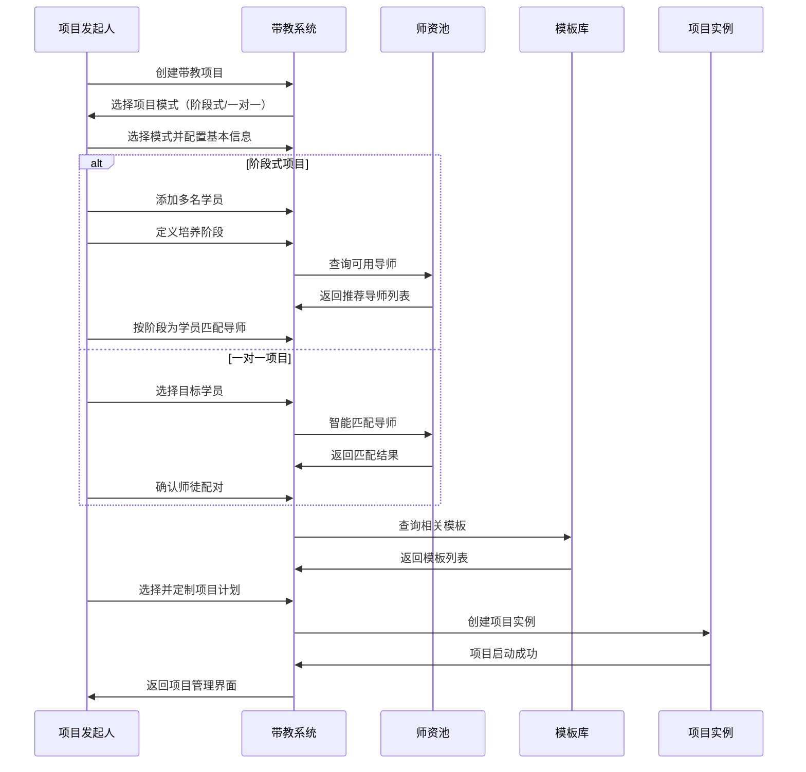

### 7.2 项目执行过程的数据流

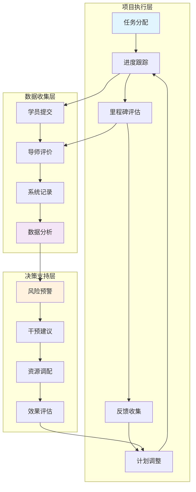

### 7.3 跨系统数据集成

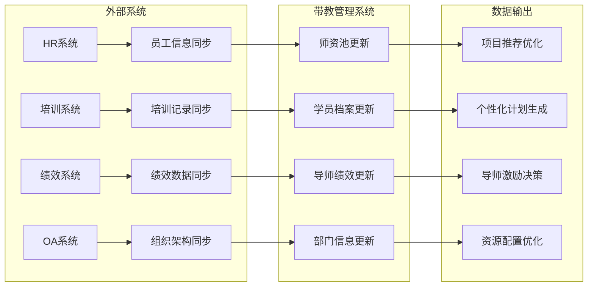

---

## 8. 智能适配设计总结

### 8.1 设计理念实现

本次更新完整实现了"合二为一"的智能适配设计理念：

**核心成果**：
- ✅ **统一项目模式**：无需在项目创建时选择模式，在指派环节灵活选择
- ✅ **智能推荐系统**：基于项目信息自动推荐最适合的指派方式
- ✅ **深度菜单集成**：与学员、任务等其他菜单形成完整的协同体系
- ✅ **自适应界面**：四个Tab根据指派方式智能调整界面和功能

### 8.2 技术可行性确认

基于对项目管理模块架构的深入分析：

**技术基础**：
- ✅ **模块化架构**：NestJS后端 + Vue3前端，支持灵活的配置驱动
- ✅ **数据库设计**：已有完整的项目、阶段、任务关系模型
- ✅ **前端组件**：已实现的项目详情页面支持动态Tab配置
- ✅ **API契约**：已定义的接口支持不同模式的数据交互

**实现策略**：
- 无需大规模重构现有架构
- 通过配置参数和UI适配器实现智能切换
- 利用现有的事件总线机制实现Tab间通信

### 8.3 业务价值实现

**用户体验提升**：
- 用户在实际操作时根据具体情况选择，而非预先决定
- 系统智能推荐，减少选择困难
- 一旦选择后，所有相关功能自动适配

**系统灵活性**：
- 支持不同类型项目采用不同策略
- 支持项目中途调整（在合理范围内）
- 减少了模式选择对后续使用的限制

**管理效率**：
- 减少了模式切换的复杂性
- 统一的管理界面降低学习成本
- 智能化的适配减少手动配置工作

### 8.4 下一步实施建议

**开发优先级**：
1. **第一阶段**：实现指派关系Tab的智能选择器
2. **第二阶段**：实现其他Tab的适配机制
3. **第三阶段**：完善跨Tab的联动效果
4. **第四阶段**：增加智能推荐算法

**关键实施点**：
- 确保与现有项目管理架构的兼容性
- 重点测试不同指派模式的切换流程
- 验证与学员、任务菜单的联动效果

---

## 9. 管理办法合规性补充

### 9.1 完整角色定义体系

基于《带教老师讲师及导师管理办法》，系统需要支持完整的五角色体系：

#### 9.1.1 带教老师双层认证体系

**核心区别**：
```
部门指定带教老师 ← 项目化管理 → 书院认证带教老师
     ↓                              ↓
 基础指导能力                    示范引领能力
 临时性指派                      制度化认证
 部门内管理                      集团级管理
```

| 角色级别 | 选拔标准 | 认证要求 | 补贴标准 | 职责范围 |
|---------|---------|---------|---------|---------|
| **部门指定** | • 岗位技能娴熟<br/>• 分享意愿高<br/>• 企业文化认同度高 | • 部门经理指定<br/>• 岗位技能测试<br/>• 就近原则考虑 | 工人序列：500元/人<br/>文员序列：1000元/人 | • 基础带教指导<br/>• 一对一答疑解惑<br/>• 协助融入团队 |
| **书院认证** | • 集团任职满2年<br/>• 年度考评良好<br/>• 3年内成功带教记录 | • 《带教老师必修课》>90分<br/>• 获得带教老师传承卡<br/>• 教案审核并发布 | 工人序列：1000元/人<br/>文员序列：3000元/人 | • 示范引领作用<br/>• 标准化教案制作<br/>• 参与战狼/海豹培训<br/>• 指导其他带教老师 |

#### 9.1.2 其他角色体系扩展

| 角色类别 | 核心职责 | 认证标准 | 奖励机制 | 系统支持 |
|---------|---------|---------|---------|---------|
| **讲师** | 日常培训课程讲授 | TTT认证+试讲评估 | 500元/课时 | 课程管理+评价系统 |
| **高级讲师** | 核心课程开发+指导 | 课程开发成果+创新案例 | 800元/课时 | 课程开发+创新管理 |
| **导师(CSO)** | 干部体系化指导 | 年度体系建设成果 | 按集团薪酬体系 | 体系管理+效果评价 |

### 9.2 书院认证体系实现

#### 9.2.1 认证流程设计

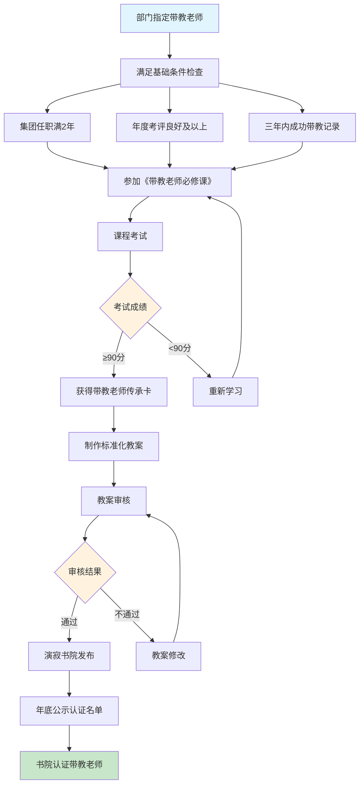

#### 9.2.2 认证管理功能

**系统功能要求**：
```typescript
interface CertificationManagement {
  // 认证申请管理
  applicationProcess: {
    eligibilityCheck: '自动检查基础条件',
    courseEnrollment: '必修课报名',
    examManagement: '考试管理（>90分要求）',
    cardIssuance: '传承卡发放'
  },
  
  // 教案管理
  teachingMaterialMgmt: {
    templateProvision: 'PPT+视频+测试标准模板',
    contentReview: '书院审核流程',
    publishingSystem: '演寂书院平台发布',
    versionControl: '教案版本管理'
  },
  
  // 年度管理
  annualManagement: {
    listPublication: '年底认证名单公示',
    qualityMonitoring: '累计2名学员<75分取消资格',
    continuousLearning: '年度必修课要求',
    statusMaintenance: '认证状态维护'
  }
}
```

### 9.3 完整业务流程补充

#### 9.3.1 端到端带教流程

基于管理办法第5.1节，完整的业务流程设计：

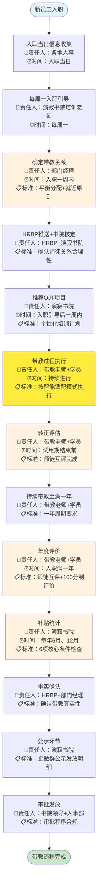

#### 9.3.2 关键时间节点管理

| 时间节点 | 管理要求 | 系统实现 | 质量标准 |
|---------|---------|---------|---------|
| **入职当日** | 信息收集推送 | 自动触发工作流 | 信息完整准确 |
| **入职一周内** | 确定带教关系 | 平衡分配算法+就近原则 | 师徒匹配合理 |
| **3个月内** | 专业技能培养 | 进度跟踪+时长统计 | ≥4小时/周带教时长 |
| **转正前** | 师徒互评 | 100分制评价系统 | ≥90分达标要求 |
| **入职满一年** | 年度评价 | 师徒互评+补贴预评估 | 6项条件预检查 |
| **每年6、12月** | 补贴统计发放 | 自动化统计+审批流程 | 严格按制度执行 |

### 9.4 管理规定系统化实现

#### 9.4.1 智能分配规则

```typescript
interface AssignmentRules {
  // 平衡分配规则
  balancedAssignment: {
    condition: '部门存在两个及以上带教老师',
    algorithm: '均匀分配学员数量',
    exception: '特殊技能需求优先匹配'
  },
  
  // 就近原则
  proximityPrinciple: {
    priority: '优先安排相同工作地点的带教老师',
    crossLocationHandling: 'HRBP告知书院监督',
    remoteSupervision: '异地带教特殊监督机制'
  },
  
  // 时长要求
  durationRequirement: {
    minimumPeriod: '带教时间不少于3个月',
    idealPeriod: '≥6个月获得全额补贴',
    qualityAssurance: '真实有效的带教过程'
  }
}
```

#### 9.4.2 质量监控机制

| 监控维度 | 监控标准 | 预警机制 | 处理措施 |
|---------|---------|---------|---------|
| **带教时长** | ≥4小时/周 | 低于标准自动预警 | 系统提醒+人工干预 |
| **评价分数** | ≥90分 | 低分风险提醒 | 针对性改进指导 |
| **投诉事故** | 零投诉零事故 | 实时监测 | 立即冻结补贴资格 |
| **成功率** | ≥50%全额，≥20%半额 | 季度趋势分析 | 分档发放机制 |

### 9.5 系统集成要求

#### 9.5.1 与现有项目管理系统集成

```
项目管理系统 ←→ 带教管理系统
      ↓              ↓
   学员管理    ←→   师徒关系管理
   任务管理    ←→   带教过程管理  
   评价系统    ←→   补贴考核系统
   数据统计    ←→   质量监控系统
```

#### 9.5.2 外部系统数据同步

| 外部系统 | 数据同步内容 | 同步频率 | 同步目的 |
|---------|-------------|---------|---------|
| **HR系统** | 员工入职信息、在职状态 | 实时同步 | 触发带教流程 |
| **绩效系统** | 年度考评结果 | 年度同步 | 认证资格判定 |
| **培训平台** | 必修课完成、传承卡状态 | 实时同步 | 认证流程管理 |
| **企业微信** | 公示通知、流程提醒 | 按需推送 | 流程自动化 |

---

*本文档版本：v3.0*  
*最后更新：2024年12月*  
*核心理念：智能适配，灵活管理，深度集成* 