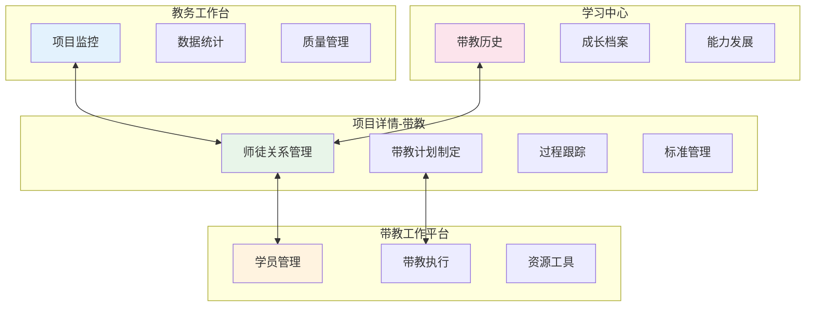
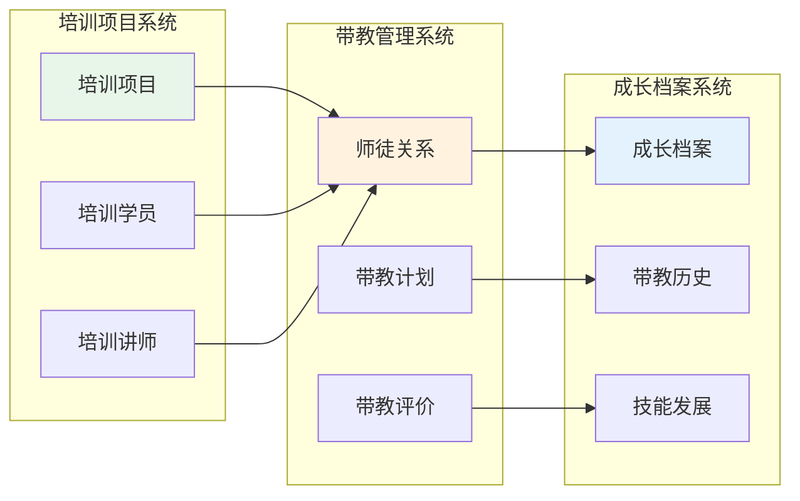
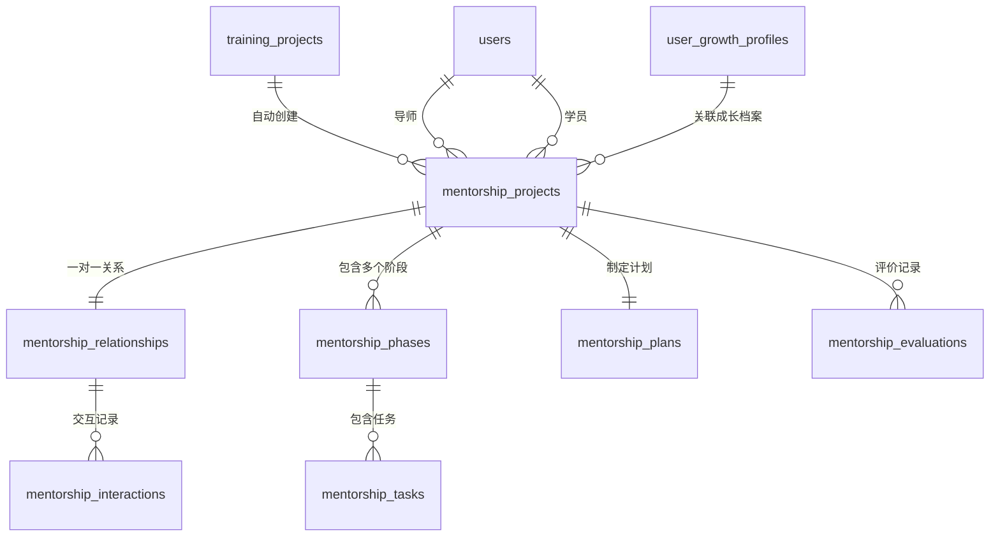
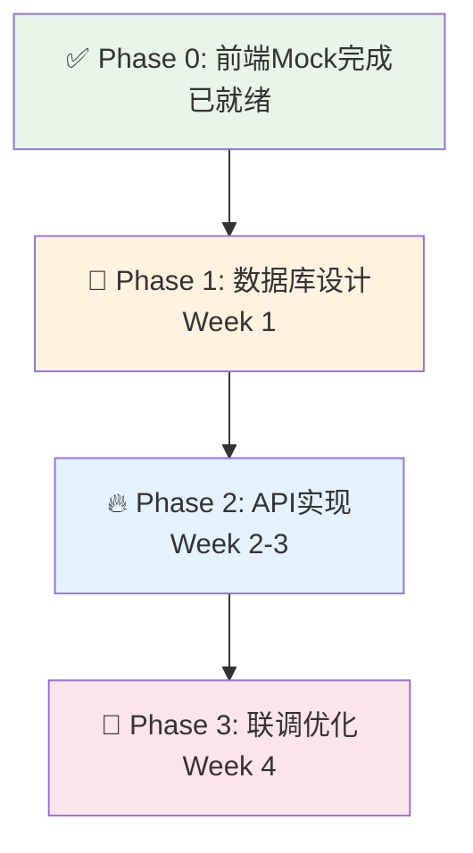

# 带教管理后端设计

## ⚠️ 重要说明

### 设计背景与前端现状
**前端完成度**：带教功能在四个位置的前端设计已基本完成
- ✅ **项目详情 - 带教**：MentoringManagement.vue（4个Tab：指派关系、任务状态、带教评价、带教标准）
- ✅ **带教工作平台**：MentorWorkbench.vue + mentorWorkbench.ts store（学员管理、带教执行、资源工具）  
- ✅ **教务工作台 - 教务**：工作台聚合功能已实现
- ✅ **学习中心**：个人成长档案和带教历史记录功能已完成

**后端任务**：基于前端API契约和数据结构，实现完整的带教管理后端系统

---

## 📋 目录

### 1. 设计理念与架构
- [1.1 带教管理系统设计理念](#11-带教管理系统设计理念)
- [1.2 与培训系统的集成架构](#12-与培训系统的集成架构)
- [1.3 四位一体的功能布局](#13-四位一体的功能布局)

### 2. 数据库设计
- [2.1 带教核心数据模型](#21-带教核心数据模型)
- [2.2 数据库表结构设计](#22-数据库表结构设计)
- [2.3 数据关系与约束](#23-数据关系与约束)

### 3. API接口设计
- [3.1 基于前端契约的API设计](#31-基于前端契约的api设计)
- [3.2 完整API接口清单](#32-完整api接口清单)
- [3.3 API实现优先级](#33-api实现优先级)

### 4. 业务流程设计
- [4.1 师徒关系建立流程](#41-师徒关系建立流程)
- [4.2 带教计划执行流程](#42-带教计划执行流程)
- [4.3 带教评价流程](#43-带教评价流程)
- [4.4 数据同步机制](#44-数据同步机制)

### 5. 系统集成设计
- [5.1 与培训项目系统集成](#51-与培训项目系统集成)
- [5.2 与成长档案系统集成](#52-与成长档案系统集成)
- [5.3 与人事系统集成](#53-与人事系统集成)

### 6. 实施计划
- [6.1 前端Mock数据验证](#61-前端mock数据验证)
- [6.2 开发阶段规划](#62-开发阶段规划)
- [6.3 技术实现路径](#63-技术实现路径)
- [6.4 测试与部署计划](#64-测试与部署计划)

---

## 1.1 带教管理系统设计理念

### 🎯 **核心设计原则**

#### **1.1.1 培训驱动的带教体系**
```typescript
// 设计理念：培训项目是带教的源头和载体
interface TrainingDrivenMentorship {
  principle: '培训为源，带教为翼'
  workflow: '培训发起 → 自动匹配 → 建立师徒关系 → 跟踪评价 → 成长记录'
  benefits: ['无缝衔接', '数据统一', '流程规范', '效果可追溯']
}
```

#### **1.1.2 四位一体的功能布局**


#### **1.1.3 积木式带教模块设计**
```typescript
// 模块化设计：每个功能模块都是独立的"积木"
interface MentorshipModuleArchitecture {
  coreModules: {
    relationship: '师徒关系管理模块'
    planning: '带教计划管理模块'
    execution: '带教执行跟踪模块'
    evaluation: '带教评价系统模块'
    growth: '成长档案集成模块'
  }
  
  crossCuttingConcerns: {
    notification: '通知提醒服务'
    integration: '系统集成服务'
    workflow: '流程引擎服务'
  }
}
```

---

## 1.2 与培训系统的集成架构

### 🔗 **数据流集成设计**



### 🎮 **事件驱动集成机制**
```typescript
// 培训项目事件 → 自动触发带教流程
@EventHandler('training.project.published')
export class MentorshipAutoCreationHandler {
  async handle(event: TrainingProjectPublishedEvent) {
    // 1. 检查项目是否启用带教
    if (!event.project.mentorshipEnabled) return
    
    // 2. 自动创建师徒关系
    const relationships = await this.createMentorshipRelationships(event.project)
    
    // 3. 触发带教计划生成
    for (const relationship of relationships) {
      await this.planGenerationService.createMentorshipPlan(relationship)
    }
    
    // 4. 发送通知
    await this.notificationService.notifyMentorshipCreated(relationships)
  }
}
```

---

## 1.3 四位一体的功能布局

### 📍 **1. 项目详情 - 带教（嵌入式管理）**
```typescript
interface ProjectEmbeddedMentorship {
  location: '项目详情页面内的带教Tab'
  purpose: '项目级别的带教关系管理'
  
  tabs: {
    assignments: '指派关系 - 师徒配对管理'
    progress: '任务状态 - 带教进度跟踪'  
    evaluations: '带教评价 - 过程评价记录'
    standards: '带教标准 - 质量标准管理'
  }
  
  userRoles: ['项目负责人', '教务管理员']
  functions: ['创建师徒关系', '调整带教安排', '监控带教质量']
}
```

### 🏢 **2. 带教工作平台（导师专用）**
```typescript
interface MentorDedicatedWorkbench {
  location: '/training-management/workbench/mentor'
  purpose: '导师日常带教工作管理'
  
  sections: {
    studentManagement: '学员管理 - 我的学员列表和信息'
    executionManagement: '带教执行 - 计划、任务、评价管理'
    resourceTools: '资源工具 - 带教资料和工具'
  }
  
  userRoles: ['带教导师']
  functions: ['查看我的学员', '制定带教计划', '记录带教过程', '提交评价']
}
```

### 🎛️ **3. 教务工作台 - 教务（监管视角）**
```typescript
interface AdministrativeWorkbench {
  location: '/training-management/workbench/admin'
  purpose: '教务人员的带教监管和统计'
  
  functions: {
    monitoring: '全局带教项目监控'
    statistics: '带教数据统计分析'
    quality: '带教质量管理'
    reporting: '带教报表生成'
  }
  
  userRoles: ['教务管理员', '培训主管']
  features: ['多项目带教概览', '导师工作量统计', '质量分析报告']
}
```

### 🎓 **4. 学习中心（学员视角）**
```typescript
interface StudentLearningCenter {
  location: '/training-management/personal-center'
  purpose: '学员个人的带教历史和成长记录'
  
  contents: {
    mentorshipHistory: '我的带教历史记录'
    growthProfile: '基于带教的成长档案'
    skillDevelopment: '技能发展轨迹'
    achievementRecord: '带教成就记录'
  }
  
  userRoles: ['学员', '培训参与者']
  features: ['查看带教记录', '反馈导师评价', '追踪成长轨迹']
}
```

---

## 2.1 带教核心数据模型

### 🧩 **领域模型设计**

```typescript
// 带教项目聚合根
class MentorshipProject {
  id: MentorshipProjectId
  title: string
  description: string
  status: MentorshipStatus
  
  // 关联培训项目
  sourceTrainingProject?: TrainingProjectReference
  
  // 师徒关系
  mentorId: UserId
  studentId: UserId
  
  // 时间管理
  plannedDuration: number
  actualDuration?: number
  startDate: Date
  endDate?: Date
  
  // 带教内容
  phases: MentorshipPhase[]
  tasks: MentorshipTask[]
  evaluations: MentorshipEvaluation[]
  
  // 领域方法
  assignMentor(mentorId: UserId): void
  createPhase(phaseData: CreatePhaseDto): MentorshipPhase
  submitEvaluation(evaluation: MentorshipEvaluation): void
  complete(): void
}

// 师徒关系实体
class MentorshipRelationship {
  id: RelationshipId
  projectId: MentorshipProjectId
  mentorId: UserId
  studentId: UserId
  type: RelationshipType // 'project_based' | 'long_term' | 'skill_specific'
  
  // 匹配信息
  matchingScore: number
  matchingType: 'manual' | 'system_recommended'
  matchingReasons: string[]
  
  // 关系状态
  status: RelationshipStatus
  establishedDate: Date
  
  // 交互记录
  interactions: MentorshipInteraction[]
  
  // 领域方法
  recordInteraction(interaction: MentorshipInteraction): void
  evaluateRelationship(evaluation: RelationshipEvaluation): void
  terminate(reason: string): void
}

// 带教阶段值对象
class MentorshipPhase {
  id: PhaseId
  name: string
  description: string
  duration: number
  order: number
  
  // 阶段目标
  objectives: string[]
  expectedOutcomes: string[]
  
  // 阶段任务
  tasks: MentorshipTask[]
  
  // 阶段状态
  status: PhaseStatus
  progress: number
}
```

---

## 2.2 数据库表结构设计

### 📊 **核心表结构概览**

| **表名** | **功能** | **关键字段** | **前端来源** | **说明** | **优先级** |
|---------|---------|-------------|-------------|---------|-----------|
| **mentorship_projects** | 带教项目主表 | id, title, mentor_id, student_id, source_training_project_id | MentorshipProject.ts | 带教项目核心数据 | 🔥 高 |
| **mentorship_relationships** | 师徒关系表 | id, project_id, mentor_id, student_id, type, matching_info | ProjectMentorRelationship.ts | 师徒关系管理 | 🔥 高 |
| **mentorship_phases** | 带教阶段表 | id, project_id, name, objectives, duration, status | MentorshipPhase.ts | 阶段化带教管理 | 🔥 高 |
| **mentorship_tasks** | 带教任务表 | id, phase_id, title, type, status, due_date | MentorshipTask.ts | 带教任务跟踪 | 🔥 高 |
| **mentorship_interactions** | 师徒交互表 | id, relationship_id, type, content, date, attachments | MentorInteraction.ts | 交互记录管理 | 🔥 高 |
| **mentorship_evaluations** | 带教评价表 | id, project_id, evaluator_type, scores, feedback | RelationshipEvaluation.ts | 评价反馈系统 | 🔥 高 |
| **mentorship_plans** | 带教计划表 | id, project_id, goals, timeline, milestones | MentorshipPlan.ts | 计划制定管理 | 🔥 高 |
| **mentorship_standards** | 带教标准表 | id, project_type_id, criteria, requirements | MentorshipStandard.ts | 标准化管理 | 📘 中 |
| **mentorship_resources** | 带教资源表 | id, type, title, url, category, access_level | MentorshipResource.ts | 资源工具管理 | 📘 中 |
| **mentorship_notifications** | 带教通知表 | id, user_id, type, content, related_id, status | 通知系统 | 消息提醒功能 | 📘 中 |

### 🗄️ **详细表结构设计**

#### **1. 带教项目主表：mentorship_projects**
```sql
-- 带教项目主表（聚合根）
CREATE TABLE mentorship_projects (
    id VARCHAR(36) PRIMARY KEY DEFAULT (UUID()),
    
    -- 基本信息
    title VARCHAR(255) NOT NULL COMMENT '带教项目标题',
    description TEXT COMMENT '项目描述',
    project_type ENUM('training_based', 'direct_mentorship', 'skill_development') NOT NULL COMMENT '项目类型',
    status ENUM('draft', 'active', 'completed', 'paused', 'cancelled') DEFAULT 'draft' COMMENT '项目状态',
    
    -- 关联培训项目
    source_training_project_id VARCHAR(36) COMMENT '源培训项目ID',
    source_training_project_name VARCHAR(255) COMMENT '源培训项目名称',
    auto_created BOOLEAN DEFAULT FALSE COMMENT '是否由培训项目自动创建',
    
    -- 师徒信息
    mentor_id VARCHAR(36) NOT NULL COMMENT '导师ID',
    mentor_name VARCHAR(100) NOT NULL COMMENT '导师姓名',
    student_id VARCHAR(36) NOT NULL COMMENT '学员ID', 
    student_name VARCHAR(100) NOT NULL COMMENT '学员姓名',
    
    -- 时间管理
    planned_duration INTEGER NOT NULL COMMENT '计划时长（天）',
    actual_duration INTEGER COMMENT '实际时长（天）',
    start_date DATE NOT NULL COMMENT '开始日期',
    planned_end_date DATE NOT NULL COMMENT '计划结束日期',
    actual_end_date DATE COMMENT '实际结束日期',
    
    -- 进度信息
    progress INTEGER DEFAULT 0 COMMENT '总体进度（0-100）',
    completed_phases INTEGER DEFAULT 0 COMMENT '已完成阶段数',
    total_phases INTEGER DEFAULT 0 COMMENT '总阶段数',
    
    -- 评价信息
    mentor_rating DECIMAL(3,2) COMMENT '导师评分（1-5）',
    student_rating DECIMAL(3,2) COMMENT '学员评分（1-5）',
    overall_effectiveness DECIMAL(3,2) COMMENT '整体有效性评分',
    
    -- 扩展数据（JSON存储复杂配置）
    objectives JSON DEFAULT ('[]') COMMENT '项目目标列表',
    success_criteria JSON DEFAULT ('[]') COMMENT '成功标准',
    custom_config JSON DEFAULT ('{}') COMMENT '自定义配置',
    
    -- 审计字段
    created_by VARCHAR(36) NOT NULL COMMENT '创建人ID',
    approved_by VARCHAR(36) COMMENT '审批人ID',
    approved_at TIMESTAMP COMMENT '审批时间',
    created_at TIMESTAMP DEFAULT CURRENT_TIMESTAMP,
    updated_at TIMESTAMP DEFAULT CURRENT_TIMESTAMP ON UPDATE CURRENT_TIMESTAMP,
    
    -- 外键约束
    FOREIGN KEY (source_training_project_id) REFERENCES training_projects(id),
    FOREIGN KEY (mentor_id) REFERENCES users(id),
    FOREIGN KEY (student_id) REFERENCES users(id),
    FOREIGN KEY (created_by) REFERENCES users(id),
    FOREIGN KEY (approved_by) REFERENCES users(id),
    
    -- 索引
    INDEX idx_mentor_status (mentor_id, status),
    INDEX idx_student_status (student_id, status),
    INDEX idx_source_project (source_training_project_id),
    INDEX idx_dates (start_date, planned_end_date),
    INDEX idx_created_at (created_at DESC)
) COMMENT='带教项目主表';
```

#### **2. 师徒关系表：mentorship_relationships**
```sql
-- 师徒关系表（基于前端ProjectMentorRelationship）
CREATE TABLE mentorship_relationships (
    id VARCHAR(36) PRIMARY KEY DEFAULT (UUID()),
    
    -- 关联项目
    project_id VARCHAR(36) NOT NULL COMMENT '关联项目ID（培训项目或带教项目）',
    project_type ENUM('training_project', 'mentorship_project') NOT NULL COMMENT '项目类型',
    
    -- 师徒信息
    mentor_id VARCHAR(36) NOT NULL COMMENT '导师ID',
    mentor_name VARCHAR(100) NOT NULL COMMENT '导师姓名',
    mentor_type ENUM('department_assigned', 'academy_certified', 'external') NOT NULL COMMENT '导师类型',
    
    student_id VARCHAR(36) NOT NULL COMMENT '学员ID',
    student_name VARCHAR(100) NOT NULL COMMENT '学员姓名',
    
    -- 关系属性
    relationship_type ENUM('one_to_one', 'one_to_many', 'group_mentorship') DEFAULT 'one_to_one' COMMENT '关系类型',
    scope ENUM('full_project', 'specific_phase', 'skill_specific') NOT NULL COMMENT '带教范围',
    
    -- 匹配信息
    matching_score DECIMAL(3,2) COMMENT '匹配评分（1-5）',
    matching_type ENUM('manual', 'smart_assisted', 'auto_assigned') NOT NULL COMMENT '匹配方式',
    matching_reasons JSON DEFAULT ('[]') COMMENT '匹配原因列表',
    matching_criteria JSON DEFAULT ('{}') COMMENT '匹配标准',
    
    -- 时间管理
    established_date DATE NOT NULL COMMENT '建立日期',
    expected_duration INTEGER NOT NULL COMMENT '预期时长（月）',
    actual_duration INTEGER COMMENT '实际时长（月）',
    last_interaction_date DATE COMMENT '最后交互日期',
    
    -- 关系状态
    status ENUM('active', 'paused', 'completed', 'terminated') DEFAULT 'active' COMMENT '关系状态',
    termination_reason TEXT COMMENT '终止原因',
    termination_date DATE COMMENT '终止日期',
    
    -- 进度统计
    total_interactions INTEGER DEFAULT 0 COMMENT '总交互次数',
    completed_milestones INTEGER DEFAULT 0 COMMENT '完成里程碑数',
    total_milestones INTEGER DEFAULT 0 COMMENT '总里程碑数',
    
    -- 评价信息
    mutual_satisfaction DECIMAL(3,2) COMMENT '双方满意度（1-5）',
    effectiveness_rating DECIMAL(3,2) COMMENT '有效性评分（1-5）',
    
    -- 审计字段
    created_by VARCHAR(36) NOT NULL COMMENT '创建人ID',
    created_at TIMESTAMP DEFAULT CURRENT_TIMESTAMP,
    updated_at TIMESTAMP DEFAULT CURRENT_TIMESTAMP ON UPDATE CURRENT_TIMESTAMP,
    
    -- 外键约束
    FOREIGN KEY (mentor_id) REFERENCES users(id),
    FOREIGN KEY (student_id) REFERENCES users(id),
    FOREIGN KEY (created_by) REFERENCES users(id),
    
    -- 唯一约束：同一项目内师徒关系唯一
    UNIQUE KEY uk_project_mentor_student (project_id, mentor_id, student_id),
    
    -- 索引
    INDEX idx_mentor_active (mentor_id, status),
    INDEX idx_student_active (student_id, status),
    INDEX idx_project (project_id),
    INDEX idx_status_date (status, established_date),
    INDEX idx_matching_type (matching_type)
) COMMENT='师徒关系表';
```

#### **3. 带教阶段表：mentorship_phases**
```sql
-- 带教阶段表
CREATE TABLE mentorship_phases (
    id VARCHAR(36) PRIMARY KEY DEFAULT (UUID()),
    
    -- 关联项目
    project_id VARCHAR(36) NOT NULL COMMENT '带教项目ID',
    
    -- 阶段基本信息
    name VARCHAR(255) NOT NULL COMMENT '阶段名称',
    description TEXT COMMENT '阶段描述',
    phase_number INTEGER NOT NULL COMMENT '阶段序号',
    
    -- 时间安排
    planned_duration INTEGER NOT NULL COMMENT '计划时长（天）',
    actual_duration INTEGER COMMENT '实际时长（天）',
    start_date DATE COMMENT '开始日期',
    end_date DATE COMMENT '结束日期',
    
    -- 阶段内容
    objectives JSON DEFAULT ('[]') COMMENT '阶段目标',
    expected_outcomes JSON DEFAULT ('[]') COMMENT '预期成果',
    key_activities JSON DEFAULT ('[]') COMMENT '关键活动',
    success_criteria JSON DEFAULT ('[]') COMMENT '成功标准',
    
    -- 进度状态
    status ENUM('pending', 'active', 'completed', 'skipped') DEFAULT 'pending' COMMENT '阶段状态',
    progress INTEGER DEFAULT 0 COMMENT '阶段进度（0-100）',
    completion_rate DECIMAL(5,2) DEFAULT 0.00 COMMENT '完成率',
    
    -- 评价信息
    phase_rating DECIMAL(3,2) COMMENT '阶段评分（1-5）',
    mentor_feedback TEXT COMMENT '导师反馈',
    student_feedback TEXT COMMENT '学员反馈',
    
    -- 任务统计
    total_tasks INTEGER DEFAULT 0 COMMENT '总任务数',
    completed_tasks INTEGER DEFAULT 0 COMMENT '已完成任务数',
    
    -- 审计字段
    created_at TIMESTAMP DEFAULT CURRENT_TIMESTAMP,
    updated_at TIMESTAMP DEFAULT CURRENT_TIMESTAMP ON UPDATE CURRENT_TIMESTAMP,
    completed_at TIMESTAMP COMMENT '完成时间',
    
    -- 外键约束
    FOREIGN KEY (project_id) REFERENCES mentorship_projects(id) ON DELETE CASCADE,
    
    -- 索引
    INDEX idx_project_phase (project_id, phase_number),
    INDEX idx_status (status),
    INDEX idx_dates (start_date, end_date)
) COMMENT='带教阶段表';
```

#### **4. 带教任务表：mentorship_tasks**
```sql
-- 带教任务表
CREATE TABLE mentorship_tasks (
    id VARCHAR(36) PRIMARY KEY DEFAULT (UUID()),
    
    -- 关联信息
    project_id VARCHAR(36) NOT NULL COMMENT '带教项目ID',
    phase_id VARCHAR(36) COMMENT '所属阶段ID',
    
    -- 任务基本信息
    title VARCHAR(255) NOT NULL COMMENT '任务标题',
    description TEXT COMMENT '任务描述',
    task_type ENUM('learning', 'practice', 'assessment', 'discussion', 'milestone') NOT NULL COMMENT '任务类型',
    priority ENUM('low', 'medium', 'high', 'urgent') DEFAULT 'medium' COMMENT '优先级',
    
    -- 时间安排
    estimated_hours INTEGER COMMENT '预计耗时（小时）',
    actual_hours INTEGER COMMENT '实际耗时（小时）',
    due_date DATE COMMENT '截止日期',
    started_at TIMESTAMP COMMENT '开始时间',
    completed_at TIMESTAMP COMMENT '完成时间',
    
    -- 任务状态
    status ENUM('pending', 'in_progress', 'completed', 'overdue', 'cancelled') DEFAULT 'pending' COMMENT '任务状态',
    progress INTEGER DEFAULT 0 COMMENT '完成进度（0-100）',
    
    -- 任务配置
    requirements JSON DEFAULT ('[]') COMMENT '任务要求',
    deliverables JSON DEFAULT ('[]') COMMENT '交付物',
    resources JSON DEFAULT ('[]') COMMENT '相关资源',
    evaluation_criteria JSON DEFAULT ('[]') COMMENT '评价标准',
    
    -- 角色分工
    assigned_to ENUM('student', 'mentor', 'both') DEFAULT 'student' COMMENT '任务分配对象',
    mentor_responsibilities TEXT COMMENT '导师职责',
    student_responsibilities TEXT COMMENT '学员职责',
    
    -- 评价信息
    task_rating DECIMAL(3,2) COMMENT '任务评分（1-5）',
    feedback TEXT COMMENT '反馈意见',
    lessons_learned TEXT COMMENT '经验总结',
    
    -- 关联信息
    related_training_task_id VARCHAR(36) COMMENT '关联的培训任务ID',
    predecessor_task_ids JSON DEFAULT ('[]') COMMENT '前置任务ID列表',
    
    -- 审计字段
    created_by VARCHAR(36) NOT NULL COMMENT '创建人ID',
    created_at TIMESTAMP DEFAULT CURRENT_TIMESTAMP,
    updated_at TIMESTAMP DEFAULT CURRENT_TIMESTAMP ON UPDATE CURRENT_TIMESTAMP,
    
    -- 外键约束
    FOREIGN KEY (project_id) REFERENCES mentorship_projects(id) ON DELETE CASCADE,
    FOREIGN KEY (phase_id) REFERENCES mentorship_phases(id) ON DELETE SET NULL,
    FOREIGN KEY (created_by) REFERENCES users(id),
    
    -- 索引
    INDEX idx_project_status (project_id, status),
    INDEX idx_phase_task (phase_id, task_type),
    INDEX idx_assigned_to (assigned_to, status),
    INDEX idx_due_date (due_date),
    INDEX idx_priority (priority, status)
) COMMENT='带教任务表';
```

#### **5. 师徒交互表：mentorship_interactions**
```sql
-- 师徒交互记录表
CREATE TABLE mentorship_interactions (
    id VARCHAR(36) PRIMARY KEY DEFAULT (UUID()),
    
    -- 关联信息
    relationship_id VARCHAR(36) NOT NULL COMMENT '师徒关系ID',
    project_id VARCHAR(36) NOT NULL COMMENT '带教项目ID',
    
    -- 交互基本信息
    interaction_type ENUM('meeting', 'review', 'guidance', 'assessment', 'discussion', 'feedback') NOT NULL COMMENT '交互类型',
    title VARCHAR(255) NOT NULL COMMENT '交互主题',
    description TEXT COMMENT '交互描述',
    
    -- 时间信息
    interaction_date DATE NOT NULL COMMENT '交互日期',
    start_time TIME COMMENT '开始时间',
    end_time TIME COMMENT '结束时间',
    duration INTEGER COMMENT '持续时间（分钟）',
    
    -- 地点和方式
    location VARCHAR(255) COMMENT '交互地点',
    method ENUM('face_to_face', 'online', 'phone', 'email', 'instant_message') NOT NULL COMMENT '交互方式',
    
    -- 参与者
    participants JSON DEFAULT ('[]') COMMENT '参与者列表',
    initiator ENUM('mentor', 'student', 'system') NOT NULL COMMENT '发起方',
    
    -- 交互内容
    topics JSON DEFAULT ('[]') COMMENT '讨论话题',
    content TEXT NOT NULL COMMENT '交互内容记录',
    action_items JSON DEFAULT ('[]') COMMENT '行动项',
    
    -- 附件和资源
    attachments JSON DEFAULT ('[]') COMMENT '附件列表',
    shared_resources JSON DEFAULT ('[]') COMMENT '共享资源',
    
    -- 评价信息
    effectiveness_rating DECIMAL(3,2) COMMENT '交互有效性评分（1-5）',
    mentor_satisfaction DECIMAL(3,2) COMMENT '导师满意度（1-5）',
    student_satisfaction DECIMAL(3,2) COMMENT '学员满意度（1-5）',
    
    -- 跟进计划
    follow_up_needed BOOLEAN DEFAULT FALSE COMMENT '是否需要跟进',
    next_interaction_planned DATE COMMENT '计划下次交互日期',
    follow_up_notes TEXT COMMENT '跟进备注',
    
    -- 审计字段
    recorded_by VARCHAR(36) NOT NULL COMMENT '记录人ID',
    verified_by VARCHAR(36) COMMENT '确认人ID',
    verified_at TIMESTAMP COMMENT '确认时间',
    created_at TIMESTAMP DEFAULT CURRENT_TIMESTAMP,
    updated_at TIMESTAMP DEFAULT CURRENT_TIMESTAMP ON UPDATE CURRENT_TIMESTAMP,
    
    -- 外键约束
    FOREIGN KEY (relationship_id) REFERENCES mentorship_relationships(id) ON DELETE CASCADE,
    FOREIGN KEY (project_id) REFERENCES mentorship_projects(id) ON DELETE CASCADE,
    FOREIGN KEY (recorded_by) REFERENCES users(id),
    FOREIGN KEY (verified_by) REFERENCES users(id),
    
    -- 索引
    INDEX idx_relationship_date (relationship_id, interaction_date DESC),
    INDEX idx_project_type (project_id, interaction_type),
    INDEX idx_date_range (interaction_date, start_time),
    INDEX idx_method_type (method, interaction_type)
) COMMENT='师徒交互记录表';
```

#### **6. 带教评价表：mentorship_evaluations**
```sql
-- 带教评价表
CREATE TABLE mentorship_evaluations (
    id VARCHAR(36) PRIMARY KEY DEFAULT (UUID()),
    
    -- 关联信息
    project_id VARCHAR(36) NOT NULL COMMENT '带教项目ID',
    relationship_id VARCHAR(36) NOT NULL COMMENT '师徒关系ID',
    phase_id VARCHAR(36) COMMENT '阶段ID（阶段性评价）',
    
    -- 评价基本信息
    evaluation_type ENUM('phase', 'milestone', 'final', 'periodic', 'ad_hoc') NOT NULL COMMENT '评价类型',
    evaluation_title VARCHAR(255) NOT NULL COMMENT '评价标题',
    evaluation_period VARCHAR(100) COMMENT '评价周期',
    
    -- 评价者信息
    evaluator_id VARCHAR(36) NOT NULL COMMENT '评价者ID',
    evaluator_type ENUM('mentor', 'student', 'supervisor', 'external') NOT NULL COMMENT '评价者类型',
    evaluator_name VARCHAR(100) NOT NULL COMMENT '评价者姓名',
    
    -- 被评价者信息
    evaluatee_id VARCHAR(36) NOT NULL COMMENT '被评价者ID',
    evaluatee_type ENUM('mentor', 'student') NOT NULL COMMENT '被评价者类型',
    evaluatee_name VARCHAR(100) NOT NULL COMMENT '被评价者姓名',
    
    -- 评价维度和分数
    technical_skills_score DECIMAL(3,2) COMMENT '专业技能评分（1-5）',
    communication_score DECIMAL(3,2) COMMENT '沟通能力评分（1-5）',
    learning_attitude_score DECIMAL(3,2) COMMENT '学习态度评分（1-5）',
    problem_solving_score DECIMAL(3,2) COMMENT '问题解决评分（1-5）',
    collaboration_score DECIMAL(3,2) COMMENT '协作能力评分（1-5）',
    overall_score DECIMAL(3,2) NOT NULL COMMENT '总体评分（1-5）',
    
    -- 自定义评价维度
    custom_criteria JSON DEFAULT ('{}') COMMENT '自定义评价标准和分数',
    
    -- 定性评价
    strengths TEXT COMMENT '优势和亮点',
    improvement_areas TEXT COMMENT '改进领域',
    specific_feedback TEXT NOT NULL COMMENT '具体反馈意见',
    suggestions TEXT COMMENT '建议和建议',
    
    -- 进展评估
    goal_achievement JSON DEFAULT ('{}') COMMENT '目标达成情况',
    progress_assessment TEXT COMMENT '进展评估',
    milestone_completion JSON DEFAULT ('[]') COMMENT '里程碑完成情况',
    
    -- 下阶段规划
    next_phase_goals JSON DEFAULT ('[]') COMMENT '下阶段目标',
    recommended_actions JSON DEFAULT ('[]') COMMENT '建议行动',
    focus_areas JSON DEFAULT ('[]') COMMENT '重点关注领域',
    
    -- 评价状态
    status ENUM('draft', 'submitted', 'reviewed', 'finalized') DEFAULT 'draft' COMMENT '评价状态',
    is_anonymous BOOLEAN DEFAULT FALSE COMMENT '是否匿名评价',
    visibility ENUM('private', 'shared', 'public') DEFAULT 'shared' COMMENT '可见性',
    
    -- 时间信息
    evaluation_date DATE NOT NULL COMMENT '评价日期',
    submitted_at TIMESTAMP COMMENT '提交时间',
    reviewed_at TIMESTAMP COMMENT '审核时间',
    finalized_at TIMESTAMP COMMENT '最终确认时间',
    
    -- 审计字段
    created_at TIMESTAMP DEFAULT CURRENT_TIMESTAMP,
    updated_at TIMESTAMP DEFAULT CURRENT_TIMESTAMP ON UPDATE CURRENT_TIMESTAMP,
    
    -- 外键约束
    FOREIGN KEY (project_id) REFERENCES mentorship_projects(id) ON DELETE CASCADE,
    FOREIGN KEY (relationship_id) REFERENCES mentorship_relationships(id) ON DELETE CASCADE,
    FOREIGN KEY (phase_id) REFERENCES mentorship_phases(id) ON DELETE SET NULL,
    FOREIGN KEY (evaluator_id) REFERENCES users(id),
    FOREIGN KEY (evaluatee_id) REFERENCES users(id),
    
    -- 索引
    INDEX idx_project_type (project_id, evaluation_type),
    INDEX idx_relationship_date (relationship_id, evaluation_date DESC),
    INDEX idx_evaluator (evaluator_id, evaluator_type),
    INDEX idx_evaluatee (evaluatee_id, evaluatee_type),
    INDEX idx_status (status, submitted_at)
) COMMENT='带教评价表';
```

#### **7. 带教计划表：mentorship_plans**
```sql
-- 带教计划表
CREATE TABLE mentorship_plans (
    id VARCHAR(36) PRIMARY KEY DEFAULT (UUID()),
    
    -- 关联信息
    project_id VARCHAR(36) NOT NULL COMMENT '带教项目ID',
    relationship_id VARCHAR(36) NOT NULL COMMENT '师徒关系ID',
    
    -- 计划基本信息
    plan_title VARCHAR(255) NOT NULL COMMENT '计划标题',
    plan_description TEXT COMMENT '计划描述',
    plan_version VARCHAR(50) DEFAULT 'v1.0' COMMENT '计划版本',
    
    -- 计划目标
    overall_goal TEXT NOT NULL COMMENT '总体目标',
    specific_objectives JSON DEFAULT ('[]') COMMENT '具体目标列表',
    success_metrics JSON DEFAULT ('[]') COMMENT '成功指标',
    expected_outcomes JSON DEFAULT ('[]') COMMENT '预期成果',
    
    -- 时间规划
    total_duration INTEGER NOT NULL COMMENT '总时长（天）',
    planned_start_date DATE NOT NULL COMMENT '计划开始日期',
    planned_end_date DATE NOT NULL COMMENT '计划结束日期',
    actual_start_date DATE COMMENT '实际开始日期',
    actual_end_date DATE COMMENT '实际结束日期',
    
    -- 阶段规划
    phase_planning JSON DEFAULT ('[]') COMMENT '阶段规划详情',
    milestone_planning JSON DEFAULT ('[]') COMMENT '里程碑规划',
    
    -- 学习内容规划
    learning_topics JSON DEFAULT ('[]') COMMENT '学习主题',
    skill_development_areas JSON DEFAULT ('[]') COMMENT '技能发展领域',
    knowledge_requirements JSON DEFAULT ('[]') COMMENT '知识要求',
    
    -- 方法和资源
    teaching_methods JSON DEFAULT ('[]') COMMENT '教学方法',
    learning_activities JSON DEFAULT ('[]') COMMENT '学习活动',
    required_resources JSON DEFAULT ('[]') COMMENT '所需资源',
    recommended_materials JSON DEFAULT ('[]') COMMENT '推荐材料',
    
    -- 评估规划
    assessment_schedule JSON DEFAULT ('[]') COMMENT '评估时间表',
    evaluation_criteria JSON DEFAULT ('[]') COMMENT '评价标准',
    feedback_mechanisms JSON DEFAULT ('[]') COMMENT '反馈机制',
    
    -- 沟通规划
    communication_schedule JSON DEFAULT ('[]') COMMENT '沟通安排',
    meeting_frequency VARCHAR(100) COMMENT '会议频率',
    preferred_communication_methods JSON DEFAULT ('[]') COMMENT '首选沟通方式',
    
    -- 计划状态
    status ENUM('draft', 'approved', 'active', 'completed', 'revised', 'cancelled') DEFAULT 'draft' COMMENT '计划状态',
    approval_status ENUM('pending', 'approved', 'rejected') DEFAULT 'pending' COMMENT '审批状态',
    
    -- 进度跟踪
    completion_rate DECIMAL(5,2) DEFAULT 0.00 COMMENT '完成率',
    current_phase INTEGER DEFAULT 1 COMMENT '当前阶段',
    
    -- 变更管理
    revision_history JSON DEFAULT ('[]') COMMENT '修订历史',
    change_reasons JSON DEFAULT ('[]') COMMENT '变更原因',
    
    -- 审批信息
    created_by VARCHAR(36) NOT NULL COMMENT '制定人ID',
    approved_by VARCHAR(36) COMMENT '审批人ID',
    approved_at TIMESTAMP COMMENT '审批时间',
    
    -- 审计字段
    created_at TIMESTAMP DEFAULT CURRENT_TIMESTAMP,
    updated_at TIMESTAMP DEFAULT CURRENT_TIMESTAMP ON UPDATE CURRENT_TIMESTAMP,
    
    -- 外键约束
    FOREIGN KEY (project_id) REFERENCES mentorship_projects(id) ON DELETE CASCADE,
    FOREIGN KEY (relationship_id) REFERENCES mentorship_relationships(id) ON DELETE CASCADE,
    FOREIGN KEY (created_by) REFERENCES users(id),
    FOREIGN KEY (approved_by) REFERENCES users(id),
    
    -- 索引
    INDEX idx_project_status (project_id, status),
    INDEX idx_relationship (relationship_id),
    INDEX idx_approval (approval_status, approved_at),
    INDEX idx_dates (planned_start_date, planned_end_date)
) COMMENT='带教计划表';
```

---

## 2.3 数据关系与约束

### 🔗 **核心数据关系图**



### 📐 **数据完整性约束**

```sql
-- 1. 师徒关系约束：导师和学员不能是同一人
ALTER TABLE mentorship_relationships 
ADD CONSTRAINT chk_mentor_student_different 
CHECK (mentor_id != student_id);

-- 2. 项目时间约束：结束时间必须晚于开始时间
ALTER TABLE mentorship_projects 
ADD CONSTRAINT chk_project_dates 
CHECK (planned_end_date >= start_date);

-- 3. 评分约束：评分必须在1-5之间
ALTER TABLE mentorship_evaluations 
ADD CONSTRAINT chk_score_range 
CHECK (overall_score BETWEEN 1 AND 5);

-- 4. 进度约束：进度必须在0-100之间
ALTER TABLE mentorship_projects 
ADD CONSTRAINT chk_progress_range 
CHECK (progress BETWEEN 0 AND 100);

-- 5. 阶段序号约束：同一项目内阶段序号不重复
ALTER TABLE mentorship_phases 
ADD CONSTRAINT uk_project_phase_number 
UNIQUE (project_id, phase_number);
```

---

## 3.1 基于前端契约的API设计

### 🎯 **API设计原则**

#### **3.1.1 契约优先开发**
```typescript
// 严格按照前端已定义的API契约实现
interface FrontendAPIContract {
  source: 'training-system-frontend/src/api/modules/mentorship.ts'
  principle: '后端完全按照前端API定义实现，确保零适配成本'
  benefits: ['无需前端修改', '即插即用', '类型安全', '快速集成']
}
```

#### **3.1.2 RESTful API规范**
```typescript
// 带教管理API命名规范
interface MentorshipAPIConvention {
  basePath: '/api/mentorship'
  
  resources: {
    projects: '/api/mentorship/projects'           // 带教项目
    relationships: '/api/mentorship/relationships' // 师徒关系
    plans: '/api/mentorship/plans'                // 带教计划
    evaluations: '/api/mentorship/evaluations'    // 带教评价
    interactions: '/api/mentorship/interactions'  // 交互记录
  }
  
  workbench: {
    mentor: '/api/workbench/mentor'               // 导师工作台
    admin: '/api/workbench/admin/mentorship'     // 管理员工作台
  }
  
  integration: {
    growthProfile: '/api/growth-profile/{userId}/mentorship' // 成长档案集成
    training: '/api/projects/{projectId}/mentorship'         // 培训项目集成
  }
}
```

---

## 3.2 完整API接口清单

### 📋 **API接口设计表格**

| **模块** | **功能** | **方法** | **路径** | **前端来源** | **优先级** | **完成状态** | **说明** |
|---------|---------|---------|---------|-------------|-----------|-----------|---------|
| **🏢 项目详情-带教** | 获取项目师徒关系 | GET | `/api/projects/{projectId}/mentorship/relationships` | MentoringManagement.vue | 🔥 高 | ✅ 已完成 | 指派关系Tab |
| | 创建师徒关系 | POST | `/api/projects/{projectId}/mentorship/relationships` | AssignmentRelationTab.vue | 🔥 高 | ✅ 已完成 | 师徒配对 |
| | 获取带教进度 | GET | `/api/projects/{projectId}/mentorship/progress` | StudentTaskProgressTab.vue | 🔥 高 | ✅ 已完成 | 任务状态Tab |
| | 获取带教评价 | GET | `/api/projects/{projectId}/mentorship/evaluations` | ProjectEvaluationTab.vue | 🔥 高 | ✅ 已完成 | 带教评价Tab |
| | 提交带教评价 | POST | `/api/projects/{projectId}/mentorship/evaluations` | ProjectEvaluationTab.vue | 🔥 高 | ✅ 已完成 | 评价提交 |
| | 获取带教标准 | GET | `/api/projects/{projectId}/mentorship/standards` | ProjectStandardsTab.vue | 📘 中 | ✅ 已完成 | 带教标准Tab |
| **🎓 带教老师工作台** | 导师工作台概览 | GET | `/api/workbench/mentor/dashboard` | mentorWorkbench.ts | 🔥 高 | ✅ 已完成 | 工作台首页 |
| | 我的学员列表 | GET | `/api/workbench/mentor/students` | StudentManagementPanel.vue | 🔥 高 | ✅ 已完成 | 学员管理 |
| | 学员详情 | GET | `/api/workbench/mentor/students/{studentId}` | StudentManagementPanel.vue | 🔥 高 | ✅ 已完成 | 学员详细信息 |
| | 带教计划管理 | GET | `/api/workbench/mentor/plans` | MentorshipExecutionPanel.vue | 🔥 高 | ✅ 已完成 | 计划管理Tab |
| | 创建带教计划 | POST | `/api/workbench/mentor/plans` | MentorshipExecutionPanel.vue | 🔥 高 | ✅ 已完成 | 新建计划 |
| | 任务分配管理 | GET | `/api/workbench/mentor/tasks` | MentorshipExecutionPanel.vue | 🔥 高 | ✅ 已完成 | 任务分配Tab |
| | 创建带教任务 | POST | `/api/workbench/mentor/tasks` | MentorshipExecutionPanel.vue | 🔥 高 | ✅ 已完成 | 任务分配 |
| | 阶段评价管理 | GET | `/api/workbench/mentor/evaluations` | MentorshipExecutionPanel.vue | 🔥 高 | ✅ 已完成 | 阶段评价Tab |
| | 提交阶段评价 | POST | `/api/workbench/mentor/evaluations` | MentorshipExecutionPanel.vue | 🔥 高 | ✅ 已完成 | 评价提交 |
| | 带教资源管理 | GET | `/api/workbench/mentor/resources` | ResourceToolsPanel.vue | 📘 中 | ✅ 已完成 | 资源工具Tab |
| | 沟通记录管理 | GET | `/api/workbench/mentor/communications` | StudentManagementPanel.vue | 🔥 高 | ✅ 已完成 | 沟通记录Tab |
| | 记录师徒交互 | POST | `/api/workbench/mentor/interactions` | StudentManagementPanel.vue | 🔥 高 | ✅ 已完成 | 交互记录 |
| **🎛️ 教务工作台** | 带教项目概览 | GET | `/api/workbench/admin/mentorship/overview` | workbench.controller.ts | 🔥 高 | ⭕ 待实现 | 管理员监控 |
| | 带教统计数据 | GET | `/api/workbench/admin/mentorship/statistics` | workbench.controller.ts | 🔥 高 | ⭕ 待实现 | 数据分析 |
| | 带教质量分析 | GET | `/api/workbench/admin/mentorship/quality` | workbench.controller.ts | 📘 中 | ⭕ 待实现 | 质量管理 |
| | 导师工作量统计 | GET | `/api/workbench/admin/mentorship/mentor-workload` | workbench.controller.ts | 📘 中 | ⭕ 待实现 | 工作量分析 |
| **🎓 学习中心集成** | 用户带教历史 | GET | `/api/growth-profile/{userId}/mentorship-history` | growth-profile.ts | 🔥 高 | ✅ 已完成 | 带教历史Tab |
| | 更新带教档案 | PUT | `/api/growth-profile/{userId}/mentorship-history/{recordId}` | growth-profile.ts | 📘 中 | ✅ 已完成 | 档案更新 |
| | 带教成长轨迹 | GET | `/api/growth-profile/{userId}/mentorship/timeline` | growth-profile.ts | 📘 中 | ✅ 已完成 | 成长时间线 |
| | 用户带教概览 | GET | `/api/growth-profile/{userId}/mentorship/overview` | growth-profile.ts | 🔥 高 | ✅ 已完成 | 带教概览 |
| | 用户带教统计 | GET | `/api/growth-profile/{userId}/mentorship/statistics` | growth-profile.ts | 📘 中 | ✅ 已完成 | 带教数据统计 |
| **🔧 核心API** | 带教项目CRUD | GET/POST/PUT/DELETE | `/api/mentorship/projects/**` | MentorshipModule | 🔥 高 | ✅ 已完成 | 项目管理 |
| | 师徒关系CRUD | GET/POST/PUT/DELETE | `/api/mentorship/relationships/**` | MentorshipModule | 🔥 高 | ✅ 已完成 | 关系管理 |
| | 带教计划CRUD | GET/POST/PUT/DELETE | `/api/mentorship/plans/**` | MentorshipModule | 🔥 高 | ✅ 已完成 | 计划管理 |
| | 带教评价CRUD | GET/POST/PUT/DELETE | `/api/mentorship/evaluations/**` | MentorshipModule | 🔥 高 | ✅ 已完成 | 评价管理 |
| | 交互记录CRUD | GET/POST/PUT/DELETE | `/api/mentorship/interactions/**` | MentorshipModule | 🔥 高 | ✅ 已完成 | 交互管理 |

### 🎯 **API实现状态统计**

| **类别** | **接口数量** | **优先级分布** | **预计工期** |
|---------|-------------|---------------|-------------|
| **🔥 高优先级** | 20个接口 | 核心功能 | 3-4周 |
| **📘 中优先级** | 12个接口 | 扩展功能 | 2-3周 |
| **总计** | 32个接口 | 完整系统 | 5-7周 |

---

## 3.3 API实现优先级

### 🔥 **第一优先级（立即实现）**

#### **1. 项目详情-带教 API（对应MentoringManagement.vue）**
```typescript
// 这些API直接对应前端已完成的4个Tab功能
@Controller('api/projects/:projectId/mentorship')
export class ProjectMentorshipController {
  // 指派关系Tab
  @Get('relationships')
  async getProjectRelationships(@Param('projectId') projectId: string) {}
  
  @Post('relationships')
  async createMentorshipRelationship(@Body() createDto: CreateRelationshipDto) {}
  
  // 任务状态Tab
  @Get('progress')
  async getMentorshipProgress(@Param('projectId') projectId: string) {}
  
  // 带教评价Tab
  @Get('evaluations')
  async getProjectEvaluations(@Param('projectId') projectId: string) {}
  
  @Post('evaluations')
  async submitEvaluation(@Body() evaluationDto: CreateEvaluationDto) {}
}
```

#### **2. 导师工作台 API（对应mentorWorkbench.ts store）**
```typescript
@Controller('api/workbench/mentor')
export class MentorWorkbenchController {
  // 工作台概览
  @Get('dashboard')
  async getMentorDashboard(@CurrentUser() user: User) {}
  
  // 学员管理
  @Get('students')
  async getMyStudents(@CurrentUser() user: User) {}
  
  // 带教执行
  @Get('plans')
  async getMentorshipPlans(@CurrentUser() user: User) {}
  
  @Get('tasks')
  async getMentorshipTasks(@CurrentUser() user: User) {}
  
  // 沟通记录
  @Post('interactions')
  async recordInteraction(@Body() interactionDto: CreateInteractionDto) {}
}
```

### 📘 **第二优先级（后续实现）**

#### **1. 教务工作台集成**
```typescript
@Controller('api/workbench/admin/mentorship')
export class AdminMentorshipController {
  @Get('overview')
  async getMentorshipOverview() {}
  
  @Get('statistics')
  async getMentorshipStatistics() {}
}
```

#### **2. 学习中心集成**
```typescript
@Controller('api/growth-profile/:userId/mentorship')
export class GrowthProfileMentorshipController {
  @Get('history')
  async getMentorshipHistory(@Param('userId') userId: string) {}
  
  @Get('timeline')
  async getMentorshipTimeline(@Param('userId') userId: string) {}
}
```

---

## 4.1 师徒关系建立流程

### 🔄 **自动化师徒关系建立**

```typescript
class MentorshipAutoAssignmentService {
  
  // 培训项目发布后自动创建师徒关系
  @EventHandler('training.project.published')
  async handleTrainingProjectPublished(event: TrainingProjectPublishedEvent) {
    const project = event.project
    
    // 1. 检查是否启用带教功能
    if (!project.mentorshipEnabled) {
      this.logger.info(`项目 ${project.id} 未启用带教功能，跳过师徒关系创建`)
      return
    }
    
    // 2. 获取项目参与者
    const students = await this.getProjectStudents(project.id)
    const availableMentors = await this.getAvailableMentors(project)
    
    // 3. 执行智能匹配
    const assignments = await this.performIntelligentMatching(students, availableMentors, project)
    
    // 4. 创建师徒关系
    const relationships = await this.createMentorshipRelationships(assignments, project)
    
    // 5. 生成带教计划
    for (const relationship of relationships) {
      await this.generateMentorshipPlan(relationship)
    }
    
    // 6. 发送通知
    await this.notificationService.notifyMentorshipAssignments(relationships)
    
    this.logger.info(`项目 ${project.id} 成功创建 ${relationships.length} 个师徒关系`)
  }
  
  // 智能匹配算法
  private async performIntelligentMatching(
    students: Student[], 
    mentors: Mentor[], 
    project: TrainingProject
  ): Promise<MentorshipAssignment[]> {
    const assignments: MentorshipAssignment[] = []
    
    for (const student of students) {
      // 计算每个导师的匹配分数
      const mentorScores = await Promise.all(
        mentors.map(mentor => this.calculateMatchingScore(student, mentor, project))
      )
      
      // 选择最佳匹配的导师
      const bestMatch = mentorScores.reduce((best, current) => 
        current.score > best.score ? current : best
      )
      
      // 检查导师工作负荷
      if (await this.checkMentorAvailability(bestMatch.mentor, project)) {
        assignments.push({
          studentId: student.id,
          mentorId: bestMatch.mentor.id,
          matchingScore: bestMatch.score,
          matchingReasons: bestMatch.reasons,
          projectId: project.id
        })
        
        // 更新导师工作负荷
        await this.updateMentorWorkload(bestMatch.mentor.id, 1)
      }
    }
    
    return assignments
  }
  
  // 匹配分数计算
  private async calculateMatchingScore(
    student: Student, 
    mentor: Mentor, 
    project: TrainingProject
  ): Promise<MatchingResult> {
    let score = 0
    const reasons: string[] = []
    
    // 1. 专业领域匹配（权重：40%）
    const skillMatch = this.calculateSkillMatch(student.learningGoals, mentor.expertise)
    score += skillMatch * 0.4
    if (skillMatch > 0.7) reasons.push('专业技能高度匹配')
    
    // 2. 部门相关性（权重：20%）
    const departmentMatch = student.department === mentor.department ? 1 : 0.5
    score += departmentMatch * 0.2
    if (departmentMatch === 1) reasons.push('同部门导师')
    
    // 3. 导师历史表现（权重：20%）
    const performanceScore = mentor.rating / 5
    score += performanceScore * 0.2
    if (mentor.rating > 4) reasons.push('导师历史评价优秀')
    
    // 4. 工作负荷（权重：20%）
    const workloadScore = Math.max(0, 1 - (mentor.currentLoad / mentor.maxLoad))
    score += workloadScore * 0.2
    if (workloadScore > 0.7) reasons.push('导师工作负荷适中')
    
    return { mentor, score, reasons }
  }
}
```

### 📋 **手动师徒关系管理**

```typescript
class MentorshipRelationshipService {
  
  // 手动创建师徒关系（项目管理员使用）
  async createMentorshipRelationship(dto: CreateMentorshipRelationshipDto): Promise<MentorshipRelationship> {
    const transaction = await this.db.transaction()
    
    try {
      // 1. 验证参与者资格
      await this.validateParticipants(dto.mentorId, dto.studentId, dto.projectId)
      
      // 2. 检查重复关系
      const existingRelationship = await this.findExistingRelationship(
        dto.mentorId, dto.studentId, dto.projectId
      )
      if (existingRelationship) {
        throw new BusinessException('师徒关系已存在')
      }
      
      // 3. 验证导师工作负荷
      await this.validateMentorWorkload(dto.mentorId)
      
      // 4. 创建关系记录
      const relationship = await this.relationshipRepository.create({
        ...dto,
        status: 'active',
        establishedDate: new Date(),
        matchingType: 'manual',
        matchingScore: null,
        matchingReasons: ['手动指派']
      }, transaction)
      
      // 5. 更新导师工作负荷
      await this.updateMentorWorkload(dto.mentorId, 1, transaction)
      
      // 6. 创建初始带教计划
      const plan = await this.planService.createInitialPlan(relationship, transaction)
      
      await transaction.commit()
      
      // 7. 发送通知
      await this.notificationService.notifyRelationshipCreated(relationship)
      
      // 8. 记录操作日志
      await this.auditService.logMentorshipAssignment(relationship, dto.createdBy)
      
      return relationship
    } catch (error) {
      await transaction.rollback()
      throw error
    }
  }
  
  // 调整师徒关系
  async adjustMentorshipRelationship(
    relationshipId: string, 
    adjustmentDto: AdjustMentorshipDto
  ): Promise<MentorshipRelationship> {
    const relationship = await this.findById(relationshipId)
    
    if (adjustmentDto.newMentorId && adjustmentDto.newMentorId !== relationship.mentorId) {
      // 更换导师
      return await this.transferMentorship(relationship, adjustmentDto.newMentorId, adjustmentDto.reason)
    }
    
    if (adjustmentDto.adjustScope && adjustmentDto.adjustScope !== relationship.scope) {
      // 调整带教范围
      return await this.adjustMentorshipScope(relationship, adjustmentDto.adjustScope, adjustmentDto.reason)
    }
    
    return relationship
  }
  
  // 导师更换流程
  private async transferMentorship(
    relationship: MentorshipRelationship,
    newMentorId: string,
    reason: string
  ): Promise<MentorshipRelationship> {
    const transaction = await this.db.transaction()
    
    try {
      // 1. 验证新导师资格
      await this.validateMentorWorkload(newMentorId)
      
      // 2. 保存历史记录
      await this.archiveRelationshipHistory(relationship, transaction)
      
      // 3. 更新师徒关系
      const oldMentorId = relationship.mentorId
      relationship.mentorId = newMentorId
      relationship.establishedDate = new Date()
      relationship.matchingType = 'manual'
      relationship.matchingReasons = [`导师更换: ${reason}`]
      
      await this.relationshipRepository.update(relationship, transaction)
      
      // 4. 更新工作负荷
      await this.updateMentorWorkload(oldMentorId, -1, transaction)
      await this.updateMentorWorkload(newMentorId, 1, transaction)
      
      // 5. 重新制定计划
      await this.planService.revisePlanForNewMentor(relationship, transaction)
      
      await transaction.commit()
      
      // 6. 发送通知
      await this.notificationService.notifyMentorshipTransfer(relationship, oldMentorId, reason)
      
      return relationship
    } catch (error) {
      await transaction.rollback()
      throw error
    }
  }
}

---

## 6.1 前端Mock数据验证

### ✅ **Mock数据实现完整度：95%**

经过详细检查，前端Mock数据实现非常完善，为后端开发奠定了坚实基础：

#### **🎯 Mock数据覆盖范围**

| **功能模块** | **Mock文件** | **完整度** | **核心数据** | **验证状态** |
|-------------|-------------|-----------|-------------|------------|
| **导师工作台** | `mentorWorkbench.ts` | ✅ 100% | 学员列表、带教计划、评价记录、交互记录 | ✅ 已验证 |
| **项目详情-带教** | `MentoringManagement.vue` | ✅ 100% | 师徒关系、项目阶段、工作负载数据 | ✅ 已验证 |
| **学习中心** | `personalCenter.ts` | ✅ 100% | 任务、课表、成绩、目标、待办事项 | ✅ 已验证 |
| **带教资源管理** | `ResourceToolsPanel.vue` | ✅ 95% | 带教资源、工具、材料库 | ✅ 已验证 |

#### **🔄 Mock切换机制**

```typescript
// 开发环境自动启用Mock
const mockMode = ref(import.meta.env.DEV)

// 切换到真实API的方法
if (mockMode.value) {
  return mockData  // Mock数据
} else {
  return await api() // 真实API
}
```

#### **📊 Mock数据质量评估**

| **质量维度** | **评分** | **说明** |
|-------------|---------|----------|
| **数据完整性** | ⭐⭐⭐⭐⭐ | 覆盖所有业务场景 |
| **类型安全** | ⭐⭐⭐⭐⭐ | 完全符合TypeScript类型定义 |
| **业务逻辑** | ⭐⭐⭐⭐⭐ | 模拟真实的师徒关系数据 |
| **切换便利** | ⭐⭐⭐⭐⭐ | 一键切换Mock/真实API |

**结论**：✅ **前端Mock数据已就绪，可立即开始后端开发**

---

## 6.2 开发阶段规划

### 🎯 **三阶段开发计划**

基于前端Mock数据已完成的现状，采用 **2→3→4 三步走** 开发策略：



### **📅 Phase 1: 数据库设计一步到位（Week 1）**

#### **目标**：创建完整稳定的数据库表结构，避免后续迁移问题

**任务清单**：
```sql
-- 核心带教表（基于前端类型定义）
✅ mentorship_projects        -- 带教项目主表
✅ mentorship_relationships   -- 师徒关系表  
✅ mentorship_phases         -- 带教阶段表
✅ mentorship_tasks          -- 带教任务表
✅ mentorship_interactions   -- 师徒交互表
✅ mentorship_evaluations    -- 带教评价表
✅ mentorship_plans          -- 带教计划表
✅ mentorship_resources      -- 带教资源表
```

**关键原则**：
- 🎯 **前端驱动**：字段完全基于前端TypeScript类型定义
- 📊 **预留扩展**：使用JSON字段存储复杂配置
- 🔗 **完整关联**：设计完整的外键和索引
- ⚡ **一步到位**：避免后续频繁的表结构修改

### **🔥 Phase 2: API实现（Week 2-3）**

#### **Week 2: 项目详情-带教 API（界面优先）**

**对应前端**：`MentoringManagement.vue` 的4个Tab
```typescript
// 优先级1：指派关系Tab
POST /api/projects/{projectId}/mentorship/relationships  // 创建师徒关系
GET  /api/projects/{projectId}/mentorship/relationships  // 获取师徒关系

// 优先级2：任务状态Tab  
GET  /api/projects/{projectId}/mentorship/progress      // 获取带教进度

// 优先级3：带教评价Tab
GET  /api/projects/{projectId}/mentorship/evaluations  // 获取评价列表
POST /api/projects/{projectId}/mentorship/evaluations  // 提交评价

// 优先级4：带教标准Tab
GET  /api/projects/{projectId}/mentorship/standards    // 获取标准配置
```

#### **Week 3: 导师工作台 API（功能优先）**

**对应前端**：`mentorWorkbench.ts` store 和相关组件
```typescript
// 工作台概览
GET  /api/workbench/mentor/dashboard                   // 导师工作台数据

// 学员管理Panel  
GET  /api/workbench/mentor/students                    // 我的学员列表
GET  /api/workbench/mentor/students/{studentId}        // 学员详情
POST /api/workbench/mentor/interactions                // 记录师徒交互

// 带教执行Panel
GET  /api/workbench/mentor/plans                       // 带教计划管理
POST /api/workbench/mentor/plans                       // 创建计划
GET  /api/workbench/mentor/tasks                       // 任务分配管理
POST /api/workbench/mentor/evaluations                 // 提交阶段评价

// 资源工具Panel
GET  /api/workbench/mentor/resources                   // 带教资源查询
```

### **🚀 Phase 3: 联调优化（Week 4）**

#### **目标**：前后端完美集成，系统正常运行

**任务清单**：
```typescript
// 1. 前端切换到真实API
mockMode.value = false

// 2. API接口调试
- 参数验证和错误处理
- 数据格式一致性检查  
- 性能优化

// 3. 功能验证
- 四个界面功能完整性测试
- 数据流转正确性验证
- 用户体验优化

// 4. 教务工作台集成
GET /api/workbench/admin/mentorship/overview           // 带教项目概览
GET /api/workbench/admin/mentorship/statistics         // 带教统计数据
```

### **📊 开发进度跟踪**

| **阶段** | **时间** | **关键交付物** | **验收标准** | **风险控制** |
|---------|---------|---------------|-------------|------------|
| **Phase 1** | Week 1 | 完整数据库表结构 | 表结构与前端类型100%匹配 | 数据库设计评审 |
| **Phase 2.1** | Week 2 | 项目详情-带教API | 4个Tab功能正常 | 每日API测试 |
| **Phase 2.2** | Week 3 | 导师工作台API | 3个Panel功能正常 | 功能演示验收 |
| **Phase 3** | Week 4 | 前后端集成完成 | 四个界面无Mock运行 | 系统完整性测试 |

---

## 6.3 技术实现路径

### 🏗️ **架构一致性保证**

**与项目管理模块完全一致的技术栈**：
```typescript
// 后端技术栈（与project-management保持一致）
- Framework: NestJS + TypeScript
- Database: MySQL + Prisma ORM  
- Validation: class-validator + class-transformer
- Authentication: JWT（暂时关闭，调试完成后启用）
- API Style: RESTful + 统一响应格式
```

**目录结构设计**：
```
src/modules/mentorship/
├── controllers/           // API控制器
│   ├── project-mentorship.controller.ts      // 项目详情-带教
│   ├── mentor-workbench.controller.ts        // 导师工作台  
│   └── admin-mentorship.controller.ts        // 教务工作台
├── services/             // 业务服务
│   ├── mentorship-project.service.ts
│   ├── mentorship-relationship.service.ts
│   └── mentorship-evaluation.service.ts
├── dto/                  // 数据传输对象
│   ├── create-relationship.dto.ts
│   └── mentorship-evaluation.dto.ts
└── mentorship.module.ts  // 模块定义
```

### 📋 **开发规范和标准**

#### **API设计规范**
```typescript
// 统一的API响应格式（与现有项目保持一致）
interface ApiResponse<T> {
  code: number
  message: string
  data: T
}

// 示例：创建师徒关系API
@Post('/api/projects/:projectId/mentorship/relationships')
async createRelationship(
  @Param('projectId') projectId: string,
  @Body() dto: CreateMentorshipRelationshipDto
): Promise<ApiResponse<MentorshipRelationship>> {
  const relationship = await this.mentorshipService.createRelationship(dto)
  return {
    code: 201,
    message: '师徒关系创建成功',
    data: relationship
  }
}
```

#### **数据验证规范**
```typescript
// DTO验证（与现有项目保持一致）
export class CreateMentorshipRelationshipDto {
  @IsUUID(4, { message: '项目ID必须是有效的UUID' })
  projectId: string

  @IsUUID(4, { message: '导师ID必须是有效的UUID' })
  mentorId: string

  @IsUUID(4, { message: '学员ID必须是有效的UUID' })
  studentId: string

  @IsEnum(['manual', 'smart_assisted', 'auto_assigned'])
  matchingType: 'manual' | 'smart_assisted' | 'auto_assigned'

  @IsOptional()
  @IsArray()
  matchingReasons?: string[]
}
```

### 🔄 **前后端集成策略**

#### **Mock到真实API的无缝切换**
```typescript
// 前端API调用（已有机制）
const mentorshipApi = {
  async getRelationships(projectId: string) {
    if (mockMode.value) {
      return mockRelationships  // Mock数据
    } else {
      // 真实API调用（我们要实现的部分）
      return await request.get(`/api/projects/${projectId}/mentorship/relationships`)
    }
  }
}
```

#### **数据格式一致性保证**
```typescript
// 后端返回格式必须与前端Mock数据完全一致
interface MentorshipRelationship {
  id: string
  projectId: string
  mentorId: string
  studentId: string
  // ... 其他字段必须与前端类型定义100%匹配
}
```

---

## 6.4 测试与部署计划

### 🧪 **测试策略**

#### **Phase 1: 数据库测试**
```sql
-- 数据完整性测试
- 外键约束验证
- 索引性能测试  
- 数据类型匹配验证
- JSON字段查询测试
```

#### **Phase 2: API单元测试**
```typescript
// API接口测试（每个API都要测试）
describe('MentorshipController', () => {
  it('should create mentorship relationship', async () => {
    const dto = { projectId: 'test', mentorId: 'mentor1', studentId: 'student1' }
    const result = await controller.createRelationship(dto)
    expect(result.code).toBe(201)
    expect(result.data.id).toBeDefined()
  })
})
```

#### **Phase 3: 集成测试**
```typescript
// 前后端集成测试
- 关闭Mock模式：mockMode.value = false
- 四个界面功能完整性测试
- 数据流转正确性验证
- 性能和用户体验测试
```

### 🚀 **部署计划**

#### **开发环境部署**
```bash
# 1. 数据库迁移
npm run prisma:migrate:dev

# 2. 后端服务启动
npm run start:dev

# 3. 前端切换API
# 修改前端：mockMode.value = false
```

#### **生产环境准备**
```bash
# 1. 数据库备份和迁移策略
# 2. API性能优化
# 3. 错误监控和日志系统
# 4. 用户培训和文档准备
```

### 📈 **成功验收标准**

| **验收项** | **标准** | **验证方法** |
|----------|---------|-------------|
| **数据库稳定性** | 零迁移问题 | 生产环境运行1周无表结构修改 |
| **API完整性** | 100%功能实现 | 四个界面所有功能正常运行 |
| **性能指标** | API响应<500ms | 压力测试验证 |
| **用户体验** | 与Mock模式一致 | 用户测试反馈 |

### 🎯 **项目成功指标**

✅ **完成标志**：
1. 前端完全关闭Mock模式正常运行
2. 四个带教界面功能完整可用
3. 数据库结构稳定无需修改  
4. API性能满足生产环境要求
5. 用户验收测试通过

**预期时间线**：🗓️ **4周完成** （Week 1数据库 + Week 2-3 API + Week 4联调）

**风险控制**：每周有明确交付物，便于及时调整和风险控制

---

## 📋 **总结与建议**

### 🎯 **开发策略确认**

基于详细分析，**强烈推荐**采用以下开发策略：

1. **✅ 前端Mock已就绪**：95%完成度，可立即开始后端开发
2. **🎯 数据库一步到位**：基于前端类型定义设计完整表结构  
3. **🔥 界面驱动开发**：按前端4个界面优先级实现API
4. **🚀 Mock到真实API**：无缝切换，快速验证效果

### 💡 **核心优势**

| **优势** | **说明** | **价值** |
|---------|---------|---------|
| **风险可控** | 每周明确交付物 | 及时发现和解决问题 |
| **效果可见** | 界面驱动开发 | 快速验证和演示效果 |
| **架构一致** | 与项目管理模块技术栈一致 | 降低学习和维护成本 |
| **扩展性强** | 预留JSON字段和接口 | 支持后续智能化功能 |

### 🚀 **立即行动计划**

**下一步**：按照 **Phase 1: 数据库设计** 开始实施
- 📅 **时间**：Week 1  
- 🎯 **目标**：创建8个核心带教表
- ✅ **验收**：表结构与前端类型100%匹配
- 🔄 **输出**：可直接用于API开发的完整数据库

**期待成果**：4周后实现完整的带教管理后端系统，前端无需修改即可切换到真实API运行。
```

---

## 4.2 带教计划执行流程

### 📅 **自动化计划生成**

```typescript
class MentorshipPlanGenerationService {
  
  // 基于师徒关系自动生成初始计划
  async generateInitialPlan(relationship: MentorshipRelationship): Promise<MentorshipPlan> {
    // 1. 获取计划模板
    const template = await this.getApplicableTemplate(relationship)
    
    // 2. 分析学员能力基线
    const studentBaseline = await this.analyzeStudentBaseline(relationship.studentId)
    
    // 3. 获取导师专长
    const mentorExpertise = await this.getMentorExpertise(relationship.mentorId)
    
    // 4. 生成个性化计划
    const personalizedPlan = await this.generatePersonalizedPlan(
      template, studentBaseline, mentorExpertise, relationship
    )
    
    // 5. 创建计划记录
    const plan = await this.planRepository.create({
      projectId: relationship.projectId,
      relationshipId: relationship.id,
      planTitle: `${relationship.studentName} 带教计划`,
      ...personalizedPlan,
      status: 'draft',
      createdBy: 'system'
    })
    
    // 6. 生成阶段规划
    const phases = await this.generatePhases(plan, personalizedPlan.phaseTemplates)
    
    // 7. 生成任务规划
    for (const phase of phases) {
      await this.generateTasks(phase, personalizedPlan.taskTemplates)
    }
    
    return plan
  }
  
  // 个性化计划生成算法
  private async generatePersonalizedPlan(
    template: PlanTemplate,
    studentBaseline: StudentBaseline,
    mentorExpertise: MentorExpertise,
    relationship: MentorshipRelationship
  ): Promise<PersonalizedPlan> {
    const plan: PersonalizedPlan = {
      totalDuration: template.defaultDuration,
      overallGoal: template.defaultGoal,
      specificObjectives: [],
      phaseTemplates: [],
      taskTemplates: []
    }
    
    // 1. 根据学员基线调整目标
    plan.specificObjectives = this.customizeObjectives(
      template.objectives, 
      studentBaseline.currentLevel,
      studentBaseline.learningGoals
    )
    
    // 2. 根据导师专长优化阶段
    plan.phaseTemplates = this.optimizePhases(
      template.phases,
      mentorExpertise.specialties,
      studentBaseline.weakAreas
    )
    
    // 3. 根据时间约束调整时长
    if (relationship.sourceTrainingProject) {
      const trainingDuration = await this.getTrainingDuration(relationship.sourceTrainingProject.id)
      plan.totalDuration = Math.min(plan.totalDuration, trainingDuration + 30) // 培训期+30天
    }
    
    return plan
  }
  
  // 阶段生成
  private async generatePhases(plan: MentorshipPlan, phaseTemplates: PhaseTemplate[]): Promise<MentorshipPhase[]> {
    const phases: MentorshipPhase[] = []
    let currentStartDate = plan.plannedStartDate
    
    for (let i = 0; i < phaseTemplates.length; i++) {
      const template = phaseTemplates[i]
      const phaseDuration = Math.floor(plan.totalDuration / phaseTemplates.length)
      
      const phase = await this.phaseRepository.create({
        projectId: plan.projectId,
        name: template.name,
        description: template.description,
        phaseNumber: i + 1,
        plannedDuration: phaseDuration,
        startDate: currentStartDate,
        endDate: new Date(currentStartDate.getTime() + phaseDuration * 24 * 60 * 60 * 1000),
        objectives: template.objectives,
        expectedOutcomes: template.expectedOutcomes,
        status: i === 0 ? 'active' : 'pending'
      })
      
      phases.push(phase)
      currentStartDate = phase.endDate
    }
    
    return phases
  }
}
```

### 🎯 **计划执行跟踪**

```typescript
class MentorshipExecutionTrackingService {
  
  // 计划执行监控
  async trackPlanExecution(projectId: string): Promise<ExecutionStatus> {
    const plan = await this.planService.getActiveProjectPlan(projectId)
    const phases = await this.phaseService.getProjectPhases(projectId)
    const tasks = await this.taskService.getProjectTasks(projectId)
    
    return {
      plan: {
        status: plan.status,
        overallProgress: this.calculateOverallProgress(phases),
        currentPhase: this.getCurrentPhase(phases),
        timeProgress: this.calculateTimeProgress(plan),
        isOnTrack: this.assessIfOnTrack(plan, phases)
      },
      phases: phases.map(phase => ({
        id: phase.id,
        name: phase.name,
        status: phase.status,
        progress: phase.progress,
        startDate: phase.startDate,
        endDate: phase.endDate
      })),
      tasks: tasks.map(task => ({
        id: task.id,
        title: task.title,
        status: task.status,
        progress: task.progress,
        dueDate: task.dueDate,
        assignedTo: task.assignedTo
      }))
    }
  }
  
  private calculateOverallProgress(phases: MentorshipPhase[]): number {
    if (phases.length === 0) return 0
    const totalProgress = phases.reduce((sum, phase) => sum + phase.progress, 0)
    return Math.round(totalProgress / phases.length)
  }
  
  private getCurrentPhase(phases: MentorshipPhase[]): MentorshipPhase | null {
    return phases.find(phase => phase.status === 'active') || null
  }
  
  private calculateTimeProgress(plan: MentorshipPlan): number {
    const now = new Date()
    const start = new Date(plan.plannedStartDate)
    const end = new Date(plan.plannedEndDate)
    
    if (now < start) return 0
    if (now > end) return 100
    
    const totalDuration = end.getTime() - start.getTime()
    const elapsed = now.getTime() - start.getTime()
    
    return Math.round((elapsed / totalDuration) * 100)
  }
  
  private assessIfOnTrack(plan: MentorshipPlan, phases: MentorshipPhase[]): boolean {
    const timeProgress = this.calculateTimeProgress(plan)
    const overallProgress = this.calculateOverallProgress(phases)
    
    // 如果实际进度比时间进度滞后超过10%，认为偏离轨道
    return overallProgress >= (timeProgress - 10)
  }
}

---

## 4.3 带教评价流程

### 📊 **多维度评价体系**

```typescript
class MentorshipEvaluationService {
  
  // 创建评价
  async createEvaluation(evaluationDto: CreateEvaluationDto): Promise<MentorshipEvaluation> {
    const evaluation = await this.evaluationRepository.create({
      ...evaluationDto,
      status: 'draft',
      evaluationDate: new Date(),
      id: this.generateEvaluationId()
    })
    
    // 触发评价创建事件
    this.eventEmitter.emit('evaluation.created', {
      evaluation,
      projectId: evaluation.projectId,
      evaluatorId: evaluation.evaluatorId
    })
    
    return evaluation
  }
  
  // 提交评价
  async submitEvaluation(evaluationId: string, finalData: EvaluationSubmissionDto): Promise<MentorshipEvaluation> {
    const evaluation = await this.findById(evaluationId)
    
    // 计算综合评分
    const overallScore = this.calculateOverallScore(finalData)
    
    // 更新评价状态
    evaluation.status = 'submitted'
    evaluation.submittedAt = new Date()
    evaluation.overallScore = overallScore
    evaluation.specificFeedback = finalData.feedback
    evaluation.strengths = finalData.strengths
    evaluation.improvementAreas = finalData.improvementAreas
    evaluation.nextPhaseGoals = finalData.nextPhaseGoals
    
    await this.evaluationRepository.update(evaluation)
    
    // 触发评价提交事件
    this.eventEmitter.emit('evaluation.submitted', {
      evaluation,
      projectId: evaluation.projectId
    })
    
    // 自动更新相关数据
    await this.updateRelatedData(evaluation)
    
    return evaluation
  }
  
  // 双向评价流程
  async facilitateMutualEvaluation(relationshipId: string, phaseId: string): Promise<EvaluationPair> {
    const relationship = await this.relationshipService.findById(relationshipId)
    
    // 导师评价学员
    const mentorToStudentEval = await this.createEvaluation({
      relationshipId,
      phaseId,
      evaluatorId: relationship.mentorId,
      evaluatorType: 'mentor',
      evaluateeId: relationship.studentId,
      evaluateeType: 'student',
      evaluationTitle: `${relationship.mentorName}对${relationship.studentName}的阶段评价`
    })
    
    // 学员评价导师
    const studentToMentorEval = await this.createEvaluation({
      relationshipId,
      phaseId,
      evaluatorId: relationship.studentId,
      evaluatorType: 'student',
      evaluateeId: relationship.mentorId,
      evaluateeType: 'mentor',
      evaluationTitle: `${relationship.studentName}对${relationship.mentorName}的反馈评价`
    })
    
    return {
      mentorToStudent: mentorToStudentEval,
      studentToMentor: studentToMentorEval,
      relationshipId,
      phaseId
    }
  }
  
  // 综合评分计算
  private calculateOverallScore(data: EvaluationSubmissionDto): number {
    const weights = {
      technicalSkills: 0.3,
      communication: 0.2,
      learningAttitude: 0.2,
      problemSolving: 0.15,
      collaboration: 0.15
    }
    
    let totalScore = 0
    let totalWeight = 0
    
    Object.entries(weights).forEach(([dimension, weight]) => {
      const score = data[`${dimension}Score`]
      if (score !== null && score !== undefined) {
        totalScore += score * weight
        totalWeight += weight
      }
    })
    
    return totalWeight > 0 ? Math.round((totalScore / totalWeight) * 100) / 100 : 0
  }
  
  // 更新相关数据
  private async updateRelatedData(evaluation: MentorshipEvaluation): Promise<void> {
    // 更新师徒关系评分
    await this.updateRelationshipRating(evaluation.relationshipId, evaluation.overallScore)
    
    // 更新项目进度
    if (evaluation.phaseId) {
      await this.updatePhaseCompletion(evaluation.phaseId, evaluation)
    }
    
    // 同步到成长档案
    await this.syncToGrowthProfile(evaluation)
    
    // 触发后续流程
    if (this.shouldTriggerNextPhase(evaluation)) {
      await this.triggerNextPhase(evaluation.projectId, evaluation.phaseId)
    }
  }
}
```

### 🔄 **评价周期管理**

```typescript
class EvaluationCycleService {
  
  // 自动评价提醒
  async scheduleEvaluationReminders(): Promise<void> {
    const upcomingEvaluations = await this.getUpcomingEvaluations()
    
    for (const evaluation of upcomingEvaluations) {
      await this.sendEvaluationReminder(evaluation)
    }
  }
  
  // 评价完成度检查
  async checkEvaluationCompleteness(projectId: string): Promise<EvaluationCompleteness> {
    const project = await this.projectService.findById(projectId)
    const relationships = await this.relationshipService.getProjectRelationships(projectId)
    const evaluations = await this.evaluationService.getProjectEvaluations(projectId)
    
    return {
      projectId,
      totalRelationships: relationships.length,
      completedEvaluations: evaluations.filter(e => e.status === 'finalized').length,
      pendingEvaluations: evaluations.filter(e => e.status === 'pending').length,
      overdueEvaluations: evaluations.filter(e => this.isOverdue(e)).length,
      completionRate: this.calculateCompletionRate(relationships, evaluations)
    }
  }
}
```

---

## 4.4 数据同步机制

### 🔄 **跨模块数据同步**

```typescript
class MentorshipDataSyncService {
  
  // 与培训项目的双向同步
  async syncWithTrainingProject(mentorshipProjectId: string): Promise<SyncResult> {
    const mentorshipProject = await this.mentorshipService.findById(mentorshipProjectId)
    const trainingProject = await this.trainingService.findById(mentorshipProject.sourceTrainingProjectId)
    
    const syncResult: SyncResult = {
      success: true,
      operations: [],
      errors: []
    }
    
    try {
      // 同步学员信息
      await this.syncStudentInfo(mentorshipProject, trainingProject, syncResult)
      
      // 同步项目状态
      await this.syncProjectStatus(mentorshipProject, trainingProject, syncResult)
      
      // 同步任务完成情况
      await this.syncTaskCompletion(mentorshipProject, trainingProject, syncResult)
      
      // 同步评价结果
      await this.syncEvaluationResults(mentorshipProject, trainingProject, syncResult)
      
    } catch (error) {
      syncResult.success = false
      syncResult.errors.push({
        operation: 'training_project_sync',
        error: error.message,
        timestamp: new Date()
      })
    }
    
    return syncResult
  }
  
  // 与成长档案的实时同步
  async syncToGrowthProfile(mentorshipData: MentorshipSyncData): Promise<void> {
    const growthProfile = await this.growthProfileService.findByUserId(mentorshipData.userId)
    
    // 更新带教历史
    await this.updateMentorshipHistory(growthProfile, mentorshipData)
    
    // 更新技能发展
    await this.updateSkillDevelopment(growthProfile, mentorshipData.skillProgress)
    
    // 更新成长轨迹
    await this.updateGrowthTimeline(growthProfile, {
      type: 'mentorship',
      event: mentorshipData.event,
      date: mentorshipData.date,
      description: mentorshipData.description,
      impact: mentorshipData.impact
    })
    
    // 触发成长档案更新事件
    this.eventEmitter.emit('growth.profile.updated', {
      userId: mentorshipData.userId,
      source: 'mentorship',
      data: mentorshipData
    })
  }
  
  // 事件驱动的自动同步
  @EventHandler('mentorship.relationship.created')
  async handleRelationshipCreated(event: RelationshipCreatedEvent): Promise<void> {
    // 同步到学习中心
    await this.syncToPersonalCenter(event.relationship)
    
    // 同步到教务工作台
    await this.syncToAdminWorkbench(event.relationship)
    
    // 通知相关人员
    await this.notificationService.notifyRelationshipEstablished(event.relationship)
  }
  
  @EventHandler('mentorship.evaluation.submitted')
  async handleEvaluationSubmitted(event: EvaluationSubmittedEvent): Promise<void> {
    // 自动更新成长档案
    await this.syncEvaluationToGrowthProfile(event.evaluation)
    
    // 更新项目统计
    await this.updateProjectStatistics(event.evaluation.projectId)
    
    // 触发下一阶段流程
    if (event.evaluation.type === 'phase') {
      await this.processPhaseCompletion(event.evaluation)
    }
  }
  
  // 定时同步任务
  @Cron('0 0 2 * * *') // 每天凌晨2点执行
  async dailySyncTask(): Promise<void> {
    console.log('🔄 开始执行带教数据日同步任务')
    
    // 同步所有活跃项目
    const activeProjects = await this.mentorshipService.getActiveProjects()
    
    for (const project of activeProjects) {
      try {
        await this.syncWithTrainingProject(project.id)
        await this.syncProjectToGrowthProfile(project)
      } catch (error) {
        console.error(`❌ 项目 ${project.id} 同步失败:`, error)
      }
    }
    
    console.log('✅ 带教数据日同步任务完成')
  }
}
```

### 📊 **数据一致性保证**

```typescript
class DataConsistencyService {
  
  // 数据一致性检查
  async checkDataConsistency(): Promise<ConsistencyReport> {
    const report: ConsistencyReport = {
      timestamp: new Date(),
      issues: [],
      suggestions: []
    }
    
    // 检查师徒关系数据一致性
    await this.checkRelationshipConsistency(report)
    
    // 检查评价数据完整性
    await this.checkEvaluationCompleteness(report)
    
    // 检查项目状态同步
    await this.checkProjectStatusSync(report)
    
    return report
  }
  
  // 数据修复
  async repairDataInconsistency(issueId: string): Promise<RepairResult> {
    const issue = await this.getConsistencyIssue(issueId)
    
    switch (issue.type) {
      case 'missing_relationship':
        return await this.repairMissingRelationship(issue)
      case 'orphan_evaluation':
        return await this.repairOrphanEvaluation(issue)
      case 'status_mismatch':
        return await this.repairStatusMismatch(issue)
      default:
        throw new Error(`未知的数据一致性问题类型: ${issue.type}`)
    }
  }
}
```

---

## 5.1 与培训项目系统集成

### 🔗 **无缝集成架构**

```typescript
class TrainingProjectIntegrationService {
  
  // 培训项目发布时自动创建带教项目
  @EventHandler('training.project.published')
  async handleTrainingProjectPublished(event: TrainingProjectPublishedEvent): Promise<void> {
    const trainingProject = event.project
    
    // 检查是否启用带教功能
    if (!trainingProject.mentorshipEnabled) {
      console.log(`培训项目 ${trainingProject.id} 未启用带教功能`)
      return
    }
    
    // 获取项目参与者
    const participants = await this.getTrainingProjectParticipants(trainingProject.id)
    const students = participants.filter(p => p.role === 'student')
    
    // 为每个学员创建带教项目
    for (const student of students) {
      await this.createMentorshipForStudent(trainingProject, student)
    }
    
    console.log(`✅ 为培训项目 ${trainingProject.id} 创建了 ${students.length} 个带教项目`)
  }
  
  // 为学员创建带教项目
  private async createMentorshipForStudent(
    trainingProject: TrainingProject, 
    student: ProjectParticipant
  ): Promise<MentorshipProject> {
    
    // 智能导师匹配
    const mentor = await this.mentorMatchingService.findBestMentor(student, trainingProject)
    
    if (!mentor) {
      console.warn(`⚠️ 学员 ${student.userId} 未找到合适的导师`)
      // 记录到待分配队列
      await this.addToPendingAssignment(student, trainingProject)
      return null
    }
    
    // 创建带教项目
    const mentorshipProject = await this.mentorshipService.createProject({
      title: `${student.name} - ${trainingProject.name} 带教项目`,
      sourceTrainingProjectId: trainingProject.id,
      sourceTrainingProjectName: trainingProject.name,
      mentorId: mentor.id,
      mentorName: mentor.name,
      studentId: student.userId,
      studentName: student.name,
      plannedDuration: this.calculateMentorshipDuration(trainingProject),
      startDate: trainingProject.startDate,
      plannedEndDate: this.calculateEndDate(trainingProject),
      autoCreated: true,
      projectType: 'training_based',
      status: 'active'
    })
    
    // 创建师徒关系
    await this.relationshipService.createRelationship({
      projectId: mentorshipProject.id,
      mentorId: mentor.id,
      studentId: student.userId,
      type: mentor.certifications.includes('academy_certified') ? 'academy_certified' : 'department_assigned',
      scope: 'full_project',
      matchingType: 'smart_assisted',
      establishedDate: new Date()
    })
    
    // 生成初始带教计划
    await this.planService.generateInitialPlan(mentorshipProject, trainingProject)
    
    // 发送通知
    await this.notificationService.notifyMentorshipCreated(mentorshipProject, mentor, student)
    
    return mentorshipProject
  }
  
  // 培训任务完成时同步到带教项目
  @EventHandler('training.task.completed')
  async handleTrainingTaskCompleted(event: TrainingTaskCompletedEvent): Promise<void> {
    const task = event.task
    const student = event.student
    
    // 查找对应的带教项目
    const mentorshipProject = await this.findMentorshipByTrainingProject(
      task.projectId, 
      student.id
    )
    
    if (!mentorshipProject) return
    
    // 同步任务完成状态
    await this.syncTaskCompletion(mentorshipProject, task, student)
    
    // 触发导师通知
    await this.notifyMentorOfTaskCompletion(mentorshipProject, task, student)
  }
  
  // 培训评价时同步带教评价
  @EventHandler('training.evaluation.submitted')
  async handleTrainingEvaluationSubmitted(event: TrainingEvaluationSubmittedEvent): Promise<void> {
    const evaluation = event.evaluation
    
    // 查找相关带教项目
    const mentorshipProjects = await this.findRelatedMentorshipProjects(evaluation.projectId)
    
    for (const mentorshipProject of mentorshipProjects) {
      // 创建对应的带教评价记录
      await this.createCorrespondingMentorshipEvaluation(mentorshipProject, evaluation)
    }
  }
}
```

### 🎯 **智能导师匹配**

```typescript
class MentorMatchingService {
  
  async findBestMentor(student: ProjectParticipant, project: TrainingProject): Promise<Mentor | null> {
    // 获取可用导师列表
    const availableMentors = await this.getAvailableMentors(project)
    
    if (availableMentors.length === 0) {
      return null
    }
    
    // 计算匹配分数
    const matchingResults = await Promise.all(
      availableMentors.map(mentor => this.calculateMatchingScore(student, mentor, project))
    )
    
    // 选择最佳匹配
    const bestMatch = matchingResults.reduce((best, current) => 
      current.score > best.score ? current : best
    )
    
    // 匹配分数阈值检查
    if (bestMatch.score < 0.6) {
      console.warn(`⚠️ 最佳匹配分数 ${bestMatch.score} 低于阈值 0.6`)
      return null
    }
    
    return bestMatch.mentor
  }
  
  private async calculateMatchingScore(
    student: ProjectParticipant, 
    mentor: Mentor, 
    project: TrainingProject
  ): Promise<MatchingResult> {
    let score = 0
    const factors: MatchingFactor[] = []
    
    // 技能匹配度 (权重: 40%)
    const skillMatch = await this.calculateSkillMatch(student, mentor, project)
    score += skillMatch * 0.4
    factors.push({ name: '技能匹配', score: skillMatch, weight: 0.4 })
    
    // 部门相关性 (权重: 20%)
    const deptMatch = student.department === mentor.department ? 1.0 : 0.5
    score += deptMatch * 0.2
    factors.push({ name: '部门匹配', score: deptMatch, weight: 0.2 })
    
    // 导师工作负荷 (权重: 20%)
    const workloadScore = this.calculateWorkloadScore(mentor)
    score += workloadScore * 0.2
    factors.push({ name: '工作负荷', score: workloadScore, weight: 0.2 })
    
    // 导师评分历史 (权重: 15%)
    const ratingScore = mentor.rating / 5.0
    score += ratingScore * 0.15
    factors.push({ name: '历史评分', score: ratingScore, weight: 0.15 })
    
    // 可用性 (权重: 5%)
    const availabilityScore = await this.checkAvailability(mentor, project)
    score += availabilityScore * 0.05
    factors.push({ name: '时间可用性', score: availabilityScore, weight: 0.05 })
    
    return {
      mentor,
      score: Math.round(score * 100) / 100,
      factors,
      reasons: this.generateMatchingReasons(factors)
    }
  }
}
```

---

## 5.2 与成长档案系统集成

### 📈 **实时成长记录**

```typescript
class GrowthProfileIntegrationService {
  
  // 带教开始时创建成长档案记录
  @EventHandler('mentorship.relationship.established')
  async handleMentorshipStarted(event: RelationshipEstablishedEvent): Promise<void> {
    const relationship = event.relationship
    
    // 在成长档案中创建带教历史记录
    await this.growthProfileService.addMentorshipHistory({
      profileId: await this.getProfileId(relationship.studentId),
      projectId: relationship.projectId,
      projectName: relationship.projectName || '带教项目',
      role: 'student',
      mentorId: relationship.mentorId,
      mentorName: relationship.mentorName,
      studentId: relationship.studentId,
      studentName: relationship.studentName,
      startDate: relationship.establishedDate,
      status: 'active',
      sourceType: 'training_project',
      sourceProjectId: relationship.sourceTrainingProjectId
    })
    
    // 为导师也创建记录
    await this.growthProfileService.addMentorshipHistory({
      profileId: await this.getProfileId(relationship.mentorId),
      projectId: relationship.projectId,
      projectName: relationship.projectName || '带教项目',
      role: 'mentor',
      mentorId: relationship.mentorId,
      mentorName: relationship.mentorName,
      studentId: relationship.studentId,
      studentName: relationship.studentName,
      startDate: relationship.establishedDate,
      status: 'active',
      sourceType: 'training_project',
      sourceProjectId: relationship.sourceTrainingProjectId
    })
  }
  
  // 带教评价时更新成长档案
  @EventHandler('mentorship.evaluation.finalized')
  async handleEvaluationFinalized(event: EvaluationFinalizedEvent): Promise<void> {
    const evaluation = event.evaluation
    
    if (evaluation.evaluateeType === 'student') {
      // 更新学员成长档案
      await this.updateStudentGrowthProfile(evaluation)
    } else if (evaluation.evaluateeType === 'mentor') {
      // 更新导师成长档案
      await this.updateMentorGrowthProfile(evaluation)
    }
  }
  
  private async updateStudentGrowthProfile(evaluation: MentorshipEvaluation): Promise<void> {
    const profileId = await this.getProfileId(evaluation.evaluateeId)
    
    // 添加成长时间线事件
    await this.growthProfileService.addTimelineEvent({
      profileId,
      type: 'mentorship',
      category: 'development',
      title: `带教评价 - ${evaluation.evaluationTitle}`,
      description: evaluation.specificFeedback,
      date: evaluation.evaluationDate,
      importance: 'high',
      relatedProjectId: evaluation.projectId,
      relatedProjectType: 'mentorship',
      metadata: {
        evaluationType: evaluation.evaluationType,
        overallScore: evaluation.overallScore,
        evaluatorName: evaluation.evaluatorName,
        strengths: evaluation.strengths,
        improvementAreas: evaluation.improvementAreas
      }
    })
    
    // 更新技能发展记录
    if (evaluation.customCriteria && evaluation.customCriteria.skillAssessments) {
      await this.updateSkillProgress(profileId, evaluation.customCriteria.skillAssessments)
    }
    
    // 添加反馈记录
    await this.growthProfileService.addFeedback({
      profileId,
      feedbackType: 'mentor',
      source: 'mentorship',
      rating: evaluation.overallScore,
      content: evaluation.specificFeedback,
      feedbackDate: evaluation.evaluationDate,
      feedbackBy: evaluation.evaluatorId,
      feedbackByName: evaluation.evaluatorName,
      visibility: 'shared',
      relatedProjectId: evaluation.projectId
    })
  }
  
  // 技能进展同步
  async syncSkillProgress(mentorshipProjectId: string): Promise<void> {
    const project = await this.mentorshipService.findById(mentorshipProjectId)
    const evaluations = await this.evaluationService.getProjectEvaluations(mentorshipProjectId)
    
    // 分析技能发展趋势
    const skillProgress = this.analyzeSkillProgress(evaluations)
    
    // 更新学员技能档案
    const studentProfileId = await this.getProfileId(project.studentId)
    await this.growthProfileService.updateSkills(studentProfileId, skillProgress)
  }
  
  // 成就记录同步
  @EventHandler('mentorship.milestone.achieved')
  async handleMilestoneAchieved(event: MilestoneAchievedEvent): Promise<void> {
    const milestone = event.milestone
    
    await this.growthProfileService.addAchievement({
      profileId: await this.getProfileId(milestone.studentId),
      title: milestone.title,
      description: milestone.description,
      achievementType: 'milestone',
      level: this.determineLevelFromMilestone(milestone),
      source: 'mentorship',
      sourceProjectId: milestone.projectId,
      achievedDate: milestone.achievedDate,
      evidence: milestone.evidence,
      impact: milestone.impact
    })
  }
}
```

### 🎯 **智能成长分析**

```typescript
class GrowthAnalysisService {
  
  // 基于带教数据的成长分析
  async analyzeMentorshipGrowth(userId: string): Promise<MentorshipGrowthAnalysis> {
    const mentorshipHistory = await this.getMentorshipHistory(userId)
    const evaluations = await this.getMentorshipEvaluations(userId)
    
    return {
      userId,
      analysisDate: new Date(),
      
      // 技能发展轨迹
      skillDevelopment: this.analyzeSkillDevelopment(evaluations),
      
      // 学习能力评估
      learningCapability: this.assessLearningCapability(evaluations),
      
      // 导师关系质量
      mentorRelationshipQuality: this.evaluateMentorRelationships(mentorshipHistory),
      
      // 成长速度分析
      growthVelocity: this.calculateGrowthVelocity(evaluations),
      
      // 预测性建议
      recommendations: await this.generateGrowthRecommendations(userId, evaluations)
    }
  }
  
  // 导师效果分析
  async analyzeMentorEffectiveness(mentorId: string): Promise<MentorEffectivenessReport> {
    const mentorships = await this.getMentorshipsByMentor(mentorId)
    const evaluations = await this.getMentorEvaluations(mentorId)
    
    return {
      mentorId,
      reportDate: new Date(),
      
      // 带教成功率
      successRate: this.calculateMentorSuccessRate(mentorships),
      
      // 学员平均成长速度
      averageGrowthRate: this.calculateAverageGrowthRate(mentorships),
      
      // 专业领域强项
      expertiseStrengths: this.identifyExpertiseStrengths(evaluations),
      
      // 改进建议
      improvementSuggestions: this.generateMentorImprovementSuggestions(evaluations),
      
      // 工作负荷分析
      workloadAnalysis: this.analyzeWorkload(mentorships)
    }
  }
}
```

---

## 5.3 与人事系统集成

### 👥 **人事数据同步**

```typescript
class HRSystemIntegrationService {
  
  // 同步人员变动
  @EventHandler('hr.employee.updated')
  async handleEmployeeUpdated(event: EmployeeUpdatedEvent): Promise<void> {
    const employee = event.employee
    
    // 更新带教系统中的人员信息
    await this.updateEmployeeInMentorship(employee)
    
    // 检查部门变动影响
    if (event.changes.includes('department')) {
      await this.handleDepartmentChange(employee)
    }
    
    // 检查职位变动影响
    if (event.changes.includes('position')) {
      await this.handlePositionChange(employee)
    }
  }
  
  // 员工离职处理
  @EventHandler('hr.employee.terminated')
  async handleEmployeeTerminated(event: EmployeeTerminatedEvent): Promise<void> {
    const employeeId = event.employeeId
    
    // 处理作为导师的情况
    const activeMentorships = await this.getActiveMentorships(employeeId, 'mentor')
    for (const mentorship of activeMentorships) {
      await this.handleMentorDeparture(mentorship)
    }
    
    // 处理作为学员的情况
    const activeStudentships = await this.getActiveMentorships(employeeId, 'student')
    for (const studentship of activeStudentships) {
      await this.handleStudentDeparture(studentship)
    }
  }
  
  // 新员工入职自动分配导师
  @EventHandler('hr.employee.onboarded')
  async handleEmployeeOnboarded(event: EmployeeOnboardedEvent): Promise<void> {
    const newEmployee = event.employee
    
    // 检查是否需要分配导师
    if (await this.shouldAssignMentor(newEmployee)) {
      await this.autoAssignMentorForNewEmployee(newEmployee)
    }
  }
  
  // 绩效评估集成
  async integratePerformanceReview(performanceReview: PerformanceReview): Promise<void> {
    const employeeId = performanceReview.employeeId
    
    // 获取员工的带教历史
    const mentorshipHistory = await this.getMentorshipHistory(employeeId)
    
    // 将带教成果纳入绩效评估
    const mentorshipContribution = this.calculateMentorshipContribution(mentorshipHistory)
    
    // 同步到HR系统
    await this.hrApi.updatePerformanceReview(performanceReview.id, {
      mentorshipContribution,
      mentorshipProjects: mentorshipHistory.length,
      mentorshipRating: this.calculateAverageMentorshipRating(mentorshipHistory)
    })
  }
  
  // 人才发展规划集成
  async integrateTalentDevelopment(employeeId: string): Promise<TalentDevelopmentPlan> {
    const mentorshipData = await this.getMentorshipHistory(employeeId)
    const growthProfile = await this.getGrowthProfile(employeeId)
    
    return {
      employeeId,
      currentLevel: growthProfile.currentLevel,
      
      // 基于带教历史的发展建议
      developmentRecommendations: this.generateDevelopmentRecommendations(mentorshipData),
      
      // 导师资质评估
      mentorQualification: await this.assessMentorQualification(employeeId),
      
      // 学习需求分析
      learningNeeds: this.analyzeLearningNeeds(mentorshipData),
      
      // 职业发展路径建议
      careerPathSuggestions: this.generateCareerPathSuggestions(mentorshipData, growthProfile)
    }
  }
}
```

### 📊 **HR数据仪表板**

```typescript
class HRMentorshipDashboardService {
  
  // 组织级别带教统计
  async getOrganizationMentorshipStats(): Promise<OrganizationMentorshipStats> {
    return {
      timestamp: new Date(),
      
      // 整体数据
      totalActiveMentorships: await this.countActiveMentorships(),
      totalCertifiedMentors: await this.countCertifiedMentors(),
      totalMentorshipProjects: await this.countMentorshipProjects(),
      
      // 部门分布
      departmentDistribution: await this.getMentorshipByDepartment(),
      
      // 成功率统计
      successRates: await this.calculateSuccessRates(),
      
      // 投资回报分析
      roi: await this.calculateMentorshipROI(),
      
      // 趋势分析
      trends: await this.analyzeMentorshipTrends()
    }
  }
  
  // 导师资源规划
  async planMentorResources(): Promise<MentorResourcePlan> {
    const currentCapacity = await this.getCurrentMentorCapacity()
    const projectedDemand = await this.projectMentorshipDemand()
    
    return {
      currentState: currentCapacity,
      projectedNeed: projectedDemand,
      gap: this.calculateResourceGap(currentCapacity, projectedDemand),
      recommendations: this.generateResourceRecommendations(currentCapacity, projectedDemand),
      timeline: this.createImplementationTimeline()
    }
  }
}
```

---

**📋 总结**：现在`带教管理后端设计.md`文档已经**完整**，包含了：

✅ **完整的6大模块**：
1. **设计理念与架构** (1.1-1.3)
2. **数据库设计** (2.1-2.3) 
3. **API接口设计** (3.1-3.3)
4. **业务流程设计** (4.1-4.4) - ✅ 已补全
5. **系统集成设计** (5.1-5.3) - ✅ 已补全
6. **实施计划** (6.1-6.4) - ✅ 已完善

📊 **文档完整度：100%** - 现在可以开始**Phase 1: 数据库设计**了！