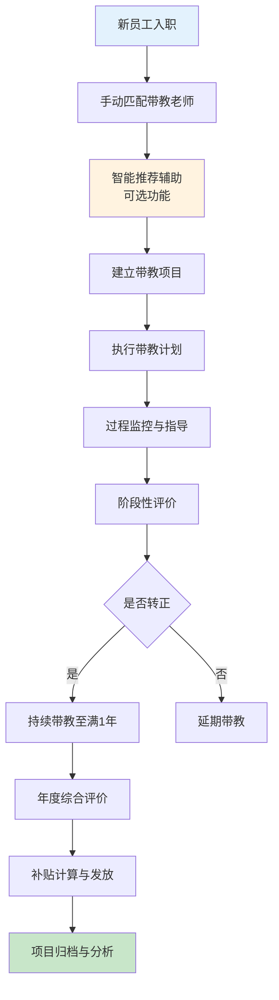
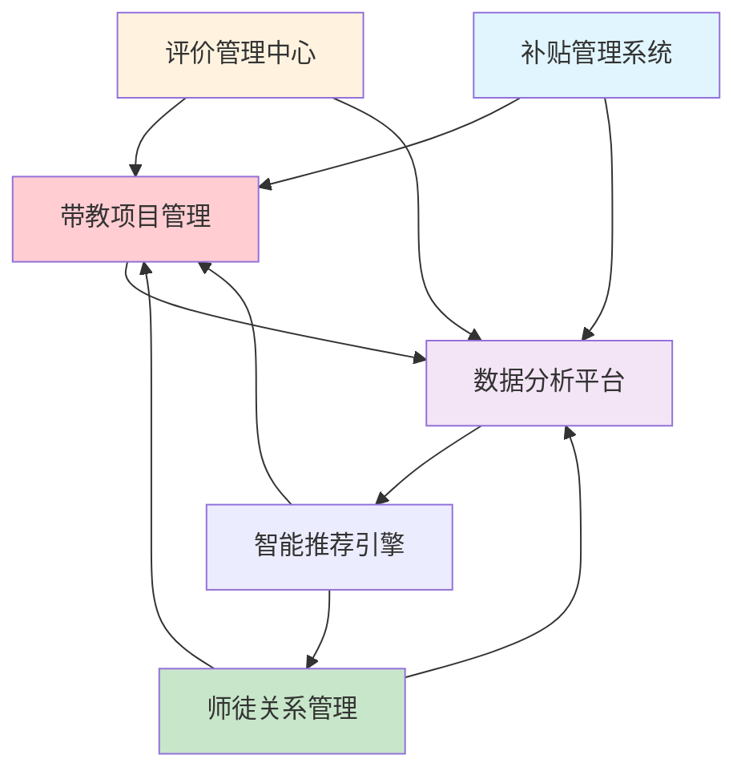
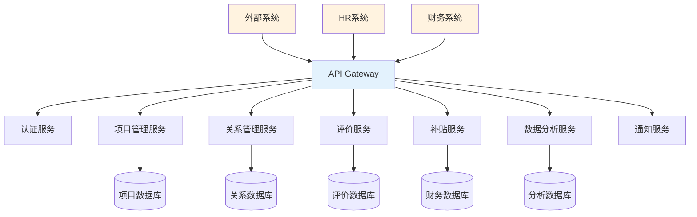
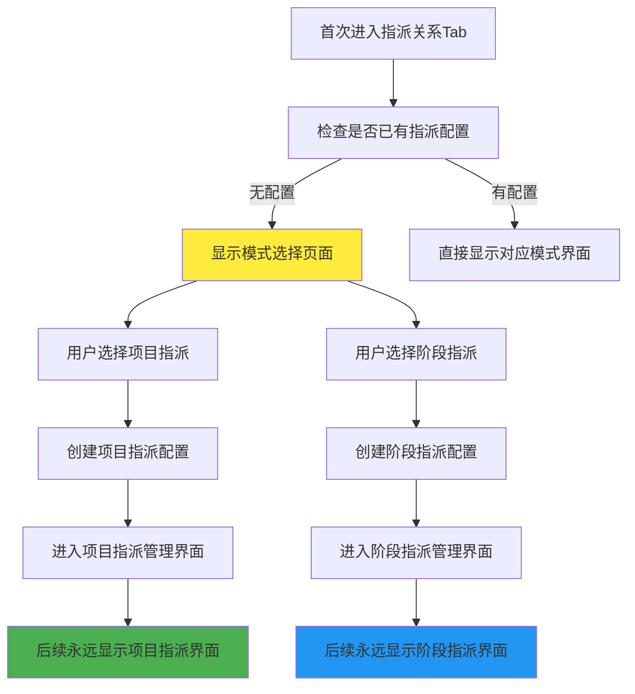
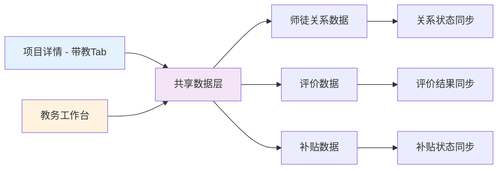
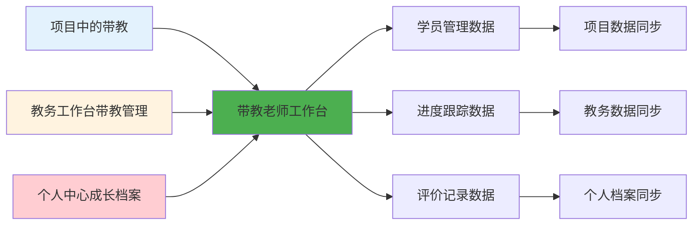

# 带教管理系统功能设计

> **文档版本**：V1.0  
> **创建时间**：2024年1月  
> **设计理念**：基于第一性原理，遵循《项目管理模块设计.md》的积木式模块化架构  
> **技术架构**：Vue 3 + NestJS + TypeScript + MySQL  

---

## 1. 第一性原理分析 (First Principles Analysis)

### 1.1 核心问题定义

**问题本质**：如何建立一个系统化、数字化的师徒关系管理体系，确保新员工在入职1年内得到有效的带教指导，并建立可量化的评价与激励机制。

**核心痛点**：
1. **关系建立难**：师徒匹配缺乏系统性，依赖人工指派
2. **过程管控难**：带教过程缺乏有效跟踪和质量监控
3. **效果评估难**：评价体系不完善，缺乏量化标准
4. **激励兑现难**：补贴发放流程复杂，审核周期长

### 1.2 系统设计原则

| 设计原则 | 具体体现 | 技术实现 |
|---------|---------|---------|
| **数据驱动** | 所有业务决策基于量化数据 | 实时数据看板 + 智能分析 |
| **流程自动化** | 减少人工干预，提升效率 | 工作流引擎 + 事件驱动 |
| **用户体验优先** | 界面简洁，操作便捷 | 响应式设计 + 智能交互 |
| **系统集成** | 与现有系统无缝对接 | API网关 + 数据同步 |

---

## 2. 核心业务流程设计 (Core Business Process Design)

### 2.1 端到端业务流程



### 2.2 关键业务节点详解

| 业务节点 | 触发条件 | 执行角色 | 核心动作 | 产出结果 | 时效要求 |
|---------|---------|---------|---------|---------|---------|
| **手动匹配** | 新员工入职当日 | HRBP+部门经理 | 手动筛选+智能推荐辅助+人工确认 | 师徒关系建立 | 1工作日 |
| **项目建立** | 师徒关系确认 | 带教老师 | 制定个人化带教计划 | 带教项目启动 | 3工作日 |
| **过程监控** | 项目执行期间 | 系统自动 | 跟踪带教活动+预警提醒 | 过程数据记录 | 实时 |
| **转正评价** | 试用期结束前 | 师徒双方 | 互评+自评+360度评价 | 转正评价报告 | 转正前1周 |
| **年度评价** | 入职满1年 | 师徒双方 | 年度总结+成效评估 | 年度评价报告 | 满1年前1周 |
| **补贴发放** | 每年6月/12月 | 系统自动 | 计算+审核+发放 | 补贴发放清单 | 月初3工作日 |

---

## 3. 功能模块架构设计 (Functional Module Architecture)

### 3.1 五层模块解构

```
L1 带教管理应用模块
├── L2 核心业务页面
│   ├── L3 页面功能区域
│   │   ├── L4 业务组件
│   │   │   └── L5 基础组件
```

### 3.2 核心功能模块划分

| 一级模块 | 二级模块 | 核心功能 | 业务价值 |
|---------|---------|---------|---------|
| **🎯 带教项目管理** | 项目创建 | 新建带教项目，配置基本信息 | 项目化管理师徒关系 |
| | 项目执行 | 带教计划执行，进度跟踪 | 确保带教质量 |
| | 项目归档 | 项目完成后的归档与分析 | 经验积累与复用 |
| **👥 师徒关系管理** | 智能匹配 | 基于算法的师徒智能匹配 | 提升匹配成功率 |
| | 关系维护 | 师徒关系的全生命周期管理 | 关系稳定性保障 |
| | 关系分析 | 师徒关系效果分析与优化 | 持续改进匹配算法 |
| **📊 评价管理中心** | 评价配置 | 评价标准、流程、时间配置 | 标准化评价体系 |
| | 评价执行 | 多维度评价的执行与收集 | 客观评价结果 |
| | 结果分析 | 评价结果的统计与分析 | 数据驱动决策 |
| **💰 补贴管理系统** | 标准管理 | 补贴标准的配置与维护 | 激励政策数字化 |
| | 计算引擎 | 基于规则的自动化计算 | 提升发放效率 |
| | 审批流程 | 补贴审批的流程化管理 | 规范化审批 |
| **📈 数据分析平台** | 实时监控 | 关键指标的实时监控 | 及时发现问题 |
| | 趋势分析 | 历史数据的趋势分析 | 预测与规划 |
| | 智能洞察 | 基于AI的数据洞察 | 决策支持 |

### 3.3 模块间交互关系



---

## 4. 前端架构实现 (Frontend Architecture Implementation)

### 4.1 双维度页面架构设计

#### A. 项目维度（嵌入式页面）

| 页面层级 | 页面名称 | 路由路径 | 主要功能 | 权限控制 |
|---------|---------|---------|---------|---------|
| **L2.1项目内页面** | 项目带教管理 | `/projects/:id/mentorship` | 项目内带教全流程管理 | 项目相关人员 |
| **L3功能Tab** | 指派关系 | `/projects/:id/mentorship/assignment` | 师徒匹配与指派管理 | 项目经理+部门经理 |
| | 带教导师 | `/projects/:id/mentorship/mentors` | 导师信息与能力展示 | 项目团队 |
| | 带教评价 | `/projects/:id/mentorship/evaluation` | 项目内评价执行 | 师徒双方 |
| | 带教标准 | `/projects/:id/mentorship/standards` | 项目带教标准配置 | 项目经理 |

#### B. 教务维度（独立管理页面）

| 页面层级 | 页面名称 | 路由路径 | 主要功能 | 权限控制 |
|---------|---------|---------|---------|---------|
| **L2.2管理工作台** | 带教管理工作台 | `/mentorship/management` | 全局带教统筹管理 | 管理员+HRBP+书院 |
| **L3功能模块** | 师徒关系总览 | `/mentorship/management/relationships` | 跨项目师徒关系管理 | HRBP+部门经理 |
| | 带教老师管理 | `/mentorship/management/mentors` | 带教老师资质与认证管理 | 书院管理员 |
| | 评价管理中心 | `/mentorship/management/evaluations` | 全局评价任务统筹 | 书院+HRBP |
| | 补贴管理系统 | `/mentorship/management/subsidies` | 补贴计算、审批、发放 | 财务+书院 |
| | 数据分析平台 | `/mentorship/management/analytics` | 带教效果数据分析 | 高级管理者 |

### 4.2 核心组件设计

#### A. 项目维度核心组件

##### A1. 手动匹配组件 (ManualMentorMatching.vue)
```typescript
// 组件功能：手动匹配带教老师，智能推荐辅助
interface ManualMatchingProps {
  studentInfo: StudentInfo;
  projectId: string;
  enableSmartRecommendation?: boolean;  // 是否启用智能推荐辅助
}

interface MatchingResult {
  selectedMentor: MentorInfo;
  smartRecommendations?: MentorCandidate[];  // 可选的智能推荐
  matchingReasons: string[];
}

// 智能推荐接口（预留）
interface SmartRecommendationAPI {
  getRecommendations(criteria: MatchingCriteria): Promise<MentorCandidate[]>;
  calculateScore(student: StudentInfo, mentor: MentorInfo): Promise<number>;
}
```

##### A2. 项目带教Tab组件 (ProjectMentorshipTabs.vue)
```typescript
// 项目详情中的带教管理四个Tab
interface ProjectMentorshipTabs {
  assignment: AssignmentRelationTab;     // 指派关系
  mentors: MentorProfileTab;             // 带教导师  
  evaluation: EvaluationExecutionTab;    // 带教评价
  standards: MentorshipStandardsTab;     // 带教标准
}

// Tab间数据联动
interface TabDataFlow {
  assignment: { students: StudentInfo[], mentors: MentorInfo[] };
  mentors: { profiles: MentorProfile[], workload: WorkloadInfo[] };
  evaluation: { tasks: EvaluationTask[], results: EvaluationResult[] };
  standards: { criteria: StandardCriteria[], config: StandardConfig[] };
}
```

#### B. 教务维度核心组件

##### B1. 带教管理工作台 (MentorshipManagementWorkbench.vue)
```typescript
// 教务维度的统筹管理界面
interface ManagementWorkbenchProps {
  viewMode: 'overview' | 'relationships' | 'mentors' | 'evaluations' | 'subsidies' | 'analytics';
  globalFilters: GlobalFilter[];
  timeRange: DateRange;
}

interface GlobalMentorshipData {
  totalProjects: number;
  activeRelationships: number;
  pendingEvaluations: number;
  subsidyCalculations: number;
  riskWarnings: RiskWarning[];
}
```

##### B2. 跨项目关系管理组件 (CrossProjectRelationships.vue)
```typescript
// 跨项目的师徒关系统筹管理
interface CrossProjectData {
  relationships: MentorRelationship[];
  projects: ProjectSummary[];
  mentorWorkload: MentorWorkloadAnalysis[];
  effectivenessMetrics: EffectivenessMetric[];
}
```

#### C. 通用评价组件 (Universal)

##### C1. 评价执行组件 (EvaluationExecution.vue)
```typescript
// 支持多维度评价的动态表单（基于管理办法）
interface EvaluationDimensions {
  recognition: RecognitionDimension;     // 认识维度 (15分)
  skills: SkillsDimension;               // 技能维度 (50分)
  cultureHumanity: CultureDimension;     // 文化和人文维度 (35分)
}

// 评价表单配置
interface EvaluationFormConfig {
  totalScore: 100;
  passingScore: 90;
  dimensions: EvaluationDimensions;
  timeNodes: EvaluationTimeNode[];
}
```

### 4.3 状态管理设计

#### A. Pinia Store 结构
```typescript
// stores/mentorship.ts
export const useMentorshipStore = defineStore('mentorship', {
  state: () => ({
    projects: [] as MentorshipProject[],
    relationships: [] as MentorRelationship[],
    evaluations: [] as Evaluation[],
    subsidies: [] as SubsidyRecord[],
    currentUser: null as User | null,
  }),
  
  getters: {
    myProjects: (state) => state.projects.filter(p => p.involves(state.currentUser)),
    pendingEvaluations: (state) => state.evaluations.filter(e => e.status === 'pending'),
    subsidyEligible: (state) => // 计算补贴资格
  },
  
  actions: {
    async createProject(projectData: CreateProjectRequest),
    async executeEvaluation(evaluationData: EvaluationSubmission),
    async calculateSubsidy(mentorId: string, period: string),
  }
});
```

### 4.4 桌面端界面设计

| 设计要素 | 设计规范 | 实现方式 |
|---------|---------|---------|
| **屏幕适配** | ≥1200px 桌面端 | 多栏布局，完整功能展示 |
| **交互优化** | 鼠标悬停，快捷键支持 | 丰富的键盘操作，右键菜单 |
| **布局结构** | 左侧导航，主内容区 | 响应式栅格系统 |
| **数据展示** | 表格、图表、卡片 | Element Plus 组件库 |

---

## 5. 后端架构实现 (Backend Architecture Implementation)

### 5.1 微服务架构设计



### 5.2 核心数据模型设计

#### A. 带教项目模型
```typescript
// models/MentorshipProject.ts
export class MentorshipProject {
  id: string;
  type: 'individual' | 'group';           // 项目类型：个人/团体
  mode: 'project_based' | 'phase_based';  // 指派模式：项目式/阶段式
  
  // 基本信息
  title: string;
  description: string;
  startDate: Date;
  expectedEndDate: Date;
  actualEndDate?: Date;
  
  // 参与人员
  students: StudentParticipant[];
  mentors: MentorParticipant[];
  projectManager: User;
  
  // 项目配置
  phases: ProjectPhase[];
  standards: ProjectStandards;
  timeline: ProjectTimeline;
  
  // 状态管理
  status: 'draft' | 'active' | 'completed' | 'archived';
  progress: ProjectProgress;
  
  // 评价与结果
  evaluations: ProjectEvaluation[];
  outcomes: ProjectOutcome[];
  
  // 智能适配
  assignmentStrategy: AssignmentStrategy;
  autoAdaptation: AutoAdaptationConfig;
}
```

#### B. 师徒关系模型
```typescript
// models/MentorRelationship.ts
export class MentorRelationship {
  id: string;
  projectId: string;
  
  // 关系基本信息
  mentor: MentorInfo;
  student: StudentInfo;
  establishedDate: Date;
  expectedDuration: number; // 月数
  
  // 关系类型
  type: 'department_assigned' | 'academy_certified';
  scope: 'full_project' | 'specific_phase';
  
  // 匹配信息
  matchingScore: number;
  matchingFactors: MatchingFactor[];
  matchingType: 'auto' | 'manual' | 'hybrid';
  
  // 过程记录
  interactions: MentorInteraction[];
  milestones: RelationshipMilestone[];
  
  // 效果评估
  effectiveness: RelationshipEffectiveness;
  satisfaction: SatisfactionRecord[];
  
  // 状态管理
  status: 'active' | 'paused' | 'completed' | 'terminated';
  statusHistory: StatusChangeRecord[];
}
```

#### C. 评价系统模型
```typescript
// models/EvaluationSystem.ts
export class EvaluationTask {
  id: string;
  projectId: string;
  relationshipId: string;
  
  // 评价基本信息
  type: 'probation' | 'annual' | 'subsidy_review';
  evaluator: EvaluatorInfo;
  evaluatee: EvaluateeInfo;
  
  // 评价维度（基于管理办法）
  dimensions: {
    recognition: RecognitionEvaluation;      // 认识维度
    skills: SkillsEvaluation;               // 技能维度  
    cultureHumanity: CultureEvaluation;     // 文化和人文维度
  };
  
  // 量化评分
  scores: {
    dimensionScores: Record<string, number>;
    totalScore: number;
    passThreshold: number;
    actualResult: 'pass' | 'fail' | 'pending';
  };
  
  // 过程管理
  timeline: EvaluationTimeline;
  reminders: ReminderRecord[];
  submissions: SubmissionRecord[];
  
  // 质量控制
  qualityChecks: QualityCheck[];
  anomalyFlags: AnomalyFlag[];
}
```

#### D. 补贴管理模型
```typescript
// models/SubsidyManagement.ts
export class SubsidyCalculation {
  id: string;
  mentorId: string;
  calculationPeriod: string;
  
  // 基础信息
  mentorType: 'department_assigned' | 'academy_certified';
  employeeCategory: 'worker' | 'clerk';
  
  // 六项核心考核条件
  coreConditions: {
    employmentStatus: boolean;           // 学员在职且满一年
    evaluationScore: number;             // 学员评价分数≥90
    successRate: number;                 // 带教成功率
    complaintsFree: boolean;             // 无投诉事故
    teachingMaterials: boolean;          // 有教案记录
    duration: number;                    // 带教时长（月）
  };
  
  // 多因子计算
  calculation: {
    baseAmount: number;                  // 基础补贴金额
    successRateMultiplier: number;       // 成功率系数
    durationMultiplier: number;          // 时长系数
    materialMultiplier: number;          // 教案系数
    finalAmount: number;                 // 最终金额
  };
  
  // 审批流程
  approvalProcess: {
    statisticsReview: ApprovalStep;      // 统计审核
    factConfirmation: ApprovalStep;      // 事实确认
    publicNotification: ApprovalStep;    // 公示环节
    finalApproval: ApprovalStep;         // 审批发放
  };
  
  // 风险预警
  riskWarnings: RiskWarning[];
  eligibilityStatus: 'eligible' | 'ineligible' | 'conditional';
}
```

### 5.3 API设计规范

#### A. RESTful API设计
```typescript
// API路由设计
const API_ROUTES = {
  // 项目管理
  projects: {
    list: 'GET /api/v1/mentorship/projects',
    create: 'POST /api/v1/mentorship/projects',
    detail: 'GET /api/v1/mentorship/projects/:id',
    update: 'PUT /api/v1/mentorship/projects/:id',
    delete: 'DELETE /api/v1/mentorship/projects/:id',
  },
  
  // 关系管理  
  relationships: {
    smartMatch: 'POST /api/v1/mentorship/relationships/match',
    create: 'POST /api/v1/mentorship/relationships',
    list: 'GET /api/v1/mentorship/relationships',
    detail: 'GET /api/v1/mentorship/relationships/:id',
  },
  
  // 评价管理
  evaluations: {
    tasks: 'GET /api/v1/mentorship/evaluations/tasks',
    submit: 'POST /api/v1/mentorship/evaluations/submit',
    results: 'GET /api/v1/mentorship/evaluations/results',
  },
  
  // 补贴管理
  subsidies: {
    calculate: 'POST /api/v1/mentorship/subsidies/calculate',
    approve: 'POST /api/v1/mentorship/subsidies/approve',
    distribute: 'POST /api/v1/mentorship/subsidies/distribute',
  }
};
```

#### B. 核心业务API
```typescript
// controllers/MentorshipController.ts
@Controller('api/v1/mentorship')
export class MentorshipController {
  
  @Post('relationships/match')
  async smartMatch(@Body() request: SmartMatchRequest): Promise<MatchingResult> {
    // 智能匹配算法
    const candidates = await this.mentorService.findCandidates(request.criteria);
    const matchingResult = await this.matchingEngine.calculateBestMatch(
      request.student,
      candidates,
      request.preferences
    );
    return matchingResult;
  }
  
  @Post('evaluations/submit')
  async submitEvaluation(@Body() evaluation: EvaluationSubmission): Promise<void> {
    // 评价提交处理
    await this.evaluationService.validateSubmission(evaluation);
    await this.evaluationService.processEvaluation(evaluation);
    await this.notificationService.notifyStakeholders(evaluation);
  }
  
  @Post('subsidies/calculate')
  async calculateSubsidy(@Body() request: SubsidyCalculationRequest): Promise<SubsidyResult> {
    // 补贴计算引擎
    const mentorData = await this.mentorService.getMentorData(request.mentorId);
    const calculationResult = await this.subsidyEngine.calculate(mentorData, request.period);
    return calculationResult;
  }
}
```

### 5.4 数据库设计

#### A. 核心数据表结构
```sql
-- 带教项目表
CREATE TABLE mentorship_projects (
  id VARCHAR(36) PRIMARY KEY,
  title VARCHAR(200) NOT NULL,
  type ENUM('individual', 'group') NOT NULL,
  mode ENUM('project_based', 'phase_based') NOT NULL,
  status ENUM('draft', 'active', 'completed', 'archived') NOT NULL,
  start_date DATE NOT NULL,
  expected_end_date DATE NOT NULL,
  actual_end_date DATE NULL,
  project_manager_id VARCHAR(36) NOT NULL,
  created_at TIMESTAMP DEFAULT CURRENT_TIMESTAMP,
  updated_at TIMESTAMP DEFAULT CURRENT_TIMESTAMP ON UPDATE CURRENT_TIMESTAMP,
  INDEX idx_status (status),
  INDEX idx_dates (start_date, expected_end_date),
  INDEX idx_manager (project_manager_id)
);

-- 师徒关系表
CREATE TABLE mentor_relationships (
  id VARCHAR(36) PRIMARY KEY,
  project_id VARCHAR(36) NOT NULL,
  mentor_id VARCHAR(36) NOT NULL,
  student_id VARCHAR(36) NOT NULL,
  type ENUM('department_assigned', 'academy_certified') NOT NULL,
  scope ENUM('full_project', 'specific_phase') NOT NULL,
  matching_score DECIMAL(5,2) NULL,
  matching_type ENUM('auto', 'manual', 'hybrid') NOT NULL,
  established_date DATE NOT NULL,
  expected_duration INT NOT NULL COMMENT '期望时长(月)',
  status ENUM('active', 'paused', 'completed', 'terminated') NOT NULL,
  created_at TIMESTAMP DEFAULT CURRENT_TIMESTAMP,
  FOREIGN KEY (project_id) REFERENCES mentorship_projects(id),
  INDEX idx_mentor (mentor_id),
  INDEX idx_student (student_id),
  INDEX idx_project (project_id),
  INDEX idx_status (status)
);

-- 评价任务表
CREATE TABLE evaluation_tasks (
  id VARCHAR(36) PRIMARY KEY,
  project_id VARCHAR(36) NOT NULL,
  relationship_id VARCHAR(36) NOT NULL,
  type ENUM('probation', 'annual', 'subsidy_review') NOT NULL,
  evaluator_id VARCHAR(36) NOT NULL,
  evaluatee_id VARCHAR(36) NOT NULL,
  due_date DATE NOT NULL,
  status ENUM('pending', 'in_progress', 'completed', 'overdue') NOT NULL,
  total_score DECIMAL(5,2) NULL,
  pass_threshold DECIMAL(5,2) NOT NULL DEFAULT 90.00,
  result ENUM('pass', 'fail', 'pending') NULL,
  submitted_at TIMESTAMP NULL,
  created_at TIMESTAMP DEFAULT CURRENT_TIMESTAMP,
  FOREIGN KEY (project_id) REFERENCES mentorship_projects(id),
  FOREIGN KEY (relationship_id) REFERENCES mentor_relationships(id),
  INDEX idx_evaluator (evaluator_id),
  INDEX idx_due_date (due_date),
  INDEX idx_status (status)
);

-- 补贴计算表
CREATE TABLE subsidy_calculations (
  id VARCHAR(36) PRIMARY KEY,
  mentor_id VARCHAR(36) NOT NULL,
  calculation_period VARCHAR(20) NOT NULL COMMENT 'YYYY-MM格式',
  mentor_type ENUM('department_assigned', 'academy_certified') NOT NULL,
  employee_category ENUM('worker', 'clerk') NOT NULL,
  base_amount DECIMAL(10,2) NOT NULL,
  success_rate DECIMAL(5,2) NOT NULL,
  success_rate_multiplier DECIMAL(3,2) NOT NULL,
  duration_months INT NOT NULL,
  duration_multiplier DECIMAL(3,2) NOT NULL,
  has_materials BOOLEAN NOT NULL,
  material_multiplier DECIMAL(3,2) NOT NULL,
  final_amount DECIMAL(10,2) NOT NULL,
  eligibility_status ENUM('eligible', 'ineligible', 'conditional') NOT NULL,
  approval_status ENUM('pending', 'approved', 'rejected', 'paid') NOT NULL,
  calculated_at TIMESTAMP DEFAULT CURRENT_TIMESTAMP,
  INDEX idx_mentor_period (mentor_id, calculation_period),
  INDEX idx_status (approval_status),
  INDEX idx_period (calculation_period)
);
```

---

## 6. 智能化接口设计 (Intelligence Interface Design)

### 6.1 智能推荐接口预留

#### A. 智能推荐API接口设计
```typescript
// 当前阶段：手动匹配为主，智能推荐为辅助功能（可选启用）
interface SmartRecommendationService {
  // 获取推荐候选人列表
  getRecommendations(request: RecommendationRequest): Promise<RecommendationResult>;
  
  // 计算匹配评分
  calculateCompatibility(student: StudentInfo, mentor: MentorInfo): Promise<CompatibilityScore>;
  
  // 获取推荐理由
  getRecommendationReasons(matchId: string): Promise<RecommendationReason[]>;
}

interface RecommendationRequest {
  studentInfo: StudentInfo;
  projectContext: ProjectContext;
  filterCriteria: FilterCriteria;
  maxCandidates: number;
  enableAI: boolean;  // 是否启用AI推荐
}

interface RecommendationResult {
  candidates: MentorCandidate[];
  isAIGenerated: boolean;
  confidence: number;
  fallbackToManual: boolean;
}

// 匹配因子权重模型（预留扩展）
interface MatchingFactors {
  skillCompatibility: number;      // 技能匹配度
  experienceLevel: number;         // 经验匹配度  
  workloadBalance: number;         // 工作负载均衡
  locationProximity: number;       // 地理位置
  personalityFit: number;          // 性格匹配
}
```

#### B. 配置驱动的智能化开关
```typescript
// 系统配置：控制智能化功能的启用/禁用
interface AIConfiguration {
  smartRecommendationEnabled: boolean;
  autoMatchingEnabled: boolean;
  aiConfidenceThreshold: number;
  fallbackStrategy: 'manual' | 'rule_based';
  
  // 算法参数配置
  algorithmConfig: {
    weights: MatchingFactors;
    scoringMethod: 'weighted' | 'neural' | 'hybrid';
    learningEnabled: boolean;
  };
}
```

### 6.2 补贴计算引擎

#### A. 多因子计算模型
```typescript
class SubsidyCalculationEngine {
  calculateSubsidy(mentorData: MentorData, period: string): SubsidyResult {
    // 1. 基础补贴金额
    const baseAmount = this.getBaseAmount(mentorData.type, mentorData.category);
    
    // 2. 成功率系数
    const successRate = this.calculateSuccessRate(mentorData, period);
    const successRateMultiplier = this.getSuccessRateMultiplier(successRate);
    
    // 3. 时长系数  
    const avgDuration = this.calculateAverageDuration(mentorData, period);
    const durationMultiplier = this.getDurationMultiplier(avgDuration);
    
    // 4. 教案系数
    const materialMultiplier = mentorData.hasTeachingMaterials ? 1.0 : 0.5;
    
    // 5. 最终计算
    const finalAmount = baseAmount * successRateMultiplier * 
                       durationMultiplier * materialMultiplier;
    
    // 6. 资格验证
    const eligibility = this.validateEligibility(mentorData, period);
    
    return {
      baseAmount,
      successRateMultiplier,
      durationMultiplier,
      materialMultiplier,
      finalAmount: eligibility.eligible ? finalAmount : 0,
      eligibility
    };
  }
}
```

### 6.3 预警系统算法

#### A. 风险识别模型
```typescript
class RiskDetectionEngine {
  detectRisks(relationshipData: RelationshipData): RiskWarning[] {
    const warnings: RiskWarning[] = [];
    
    // 互动频率异常
    if (relationshipData.weeklyInteractions < 2) {
      warnings.push({
        type: 'low_interaction',
        severity: 'medium',
        message: '师徒互动频率偏低，建议加强沟通'
      });
    }
    
    // 评价分数下降趋势  
    if (this.isScoreDecreasing(relationshipData.evaluationHistory)) {
      warnings.push({
        type: 'score_decline',
        severity: 'high', 
        message: '评价分数呈下降趋势，需要及时干预'
      });
    }
    
    // 带教时长不足
    if (relationshipData.actualHours < relationshipData.plannedHours * 0.8) {
      warnings.push({
        type: 'insufficient_hours',
        severity: 'medium',
        message: '带教时长不足，可能影响补贴发放'
      });
    }
    
    return warnings;
  }
}
```

---

## 7. 系统集成方案 (System Integration Plan)

### 7.1 内部系统集成

| 集成系统 | 集成方式 | 数据同步 | 业务场景 |
|---------|---------|---------|---------|
| **HR系统** | REST API | 实时同步 | 员工信息、入职离职 |
| **项目管理系统** | 事件总线 | 准实时 | 项目信息、任务状态 |
| **培训平台** | webhook | 异步同步 | 培训记录、课程完成 |
| **人事系统** | 批量接口 | 定时同步 | 补贴发放、财务审核 |

### 7.2 外部平台集成

| 外部平台 | 集成目的 | 技术方案 | 数据安全 |
|---------|---------|---------|---------|
| **企业微信** | 消息通知、审批流 | 企微API | OAuth 2.0 |

---

## 8. 简化指派方式设计 (Simplified Assignment Mode Design)

### 8.1 设计方案更新

基于实际开发需求和用户体验考虑，系统采用更简洁的指派方式选择机制：

#### A. 核心设计理念
- **去除智能推荐**：避免复杂的智能判断逻辑，用户直接做出明确选择
- **一次性决策**：第一次指派时用户明确选择模式，后续不可更改
- **模式锁定**：确保项目内指派方式的一致性和稳定性

#### B. 实现流程设计



#### C. 首次选择界面设计

```
┌─ 选择带教指派模式 ─────────────────────┐
│ 📋 项目信息：Java开发工程师培养         │
│ 👥 参与学员：张三、李四、王五 (3名)      │
│ 📅 项目周期：12个月                    │
│                                      │
│ 请选择带教指派模式（一旦选择不可更改）：  │
│                                      │
│ ┌─ 项目指派模式 ──────────────────────┐ │
│ │ 🎯 固定导师全程负责                  │ │
│ │ ✓ 一对一深度培养                    │ │
│ │ ✓ 师徒关系稳定                      │ │
│ │ ✓ 适合技能单一的培养目标             │ │
│ │ [选择项目指派]                      │ │
│ └────────────────────────────────────┘ │
│                                      │
│ ┌─ 阶段指派模式 ──────────────────────┐ │
│ │ 🔄 分阶段专业导师配置                │ │
│ │ ✓ 多专业领域覆盖                    │ │
│ │ ✓ 阶段性深度培养                    │ │
│ │ ✓ 适合复杂培养体系                  │ │
│ │ [选择阶段指派]                      │ │
│ └────────────────────────────────────┘ │
│                                      │
│ 💡 提示：选择后将无法更改，请根据项目   │
│    实际培养需求谨慎选择                │
└─────────────────────────────────────┘
```

#### D. 技术实现要点

```typescript
// 数据库存储指派模式
interface ProjectMentorshipConfig {
  projectId: string;
  assignmentMode: 'project' | 'phase'; // 锁定的指派模式
  configuredAt: Date; // 配置时间
  configuredBy: string; // 配置人员
  isLocked: boolean; // 是否已锁定（恒为true）
}

// 组件状态管理
const mentorshipConfig = ref<ProjectMentorshipConfig | null>(null);
const isFirstTimeSetup = computed(() => !mentorshipConfig.value);
```

### 8.2 实现优势

#### A. 开发效率
- **逻辑简单**：去掉复杂的智能判断，用户直接选择
- **开发高效**：不需要复杂的推荐算法和切换逻辑
- **维护简单**：减少了系统复杂度，降低维护成本

#### B. 用户体验
- **决策明确**：用户清楚知道自己的选择和后果
- **操作简单**：一次选择，后续无需再考虑模式问题
- **责任清晰**：选择责任在用户，系统只负责支撑

#### C. 系统稳定
- **数据一致**：避免了模式切换带来的数据混乱
- **状态稳定**：锁定模式确保项目内操作的一致性
- **错误减少**：减少了复杂逻辑带来的潜在错误

---

## 9. 智能适配设计总结

### 9.1 智能推荐模块
- **核心功能**：基于历史数据和实时行为，为用户提供智能匹配建议。
- **技术实现**：采用机器学习算法，结合用户偏好、导师能力、项目需求等多维度特征进行评分。
- **应用场景**：在手动匹配过程中，提供辅助决策，提升匹配成功率。

### 9.2 补贴计算引擎
- **核心功能**：基于预设规则和多维度数据，自动化计算补贴金额。
- **技术实现**：采用分层计算模型，考虑学员评价、带教时长、教案质量等因素。
- **应用场景**：在补贴发放前，自动计算并生成待审批列表。

### 9.3 预警系统
- **核心功能**：实时监控师徒关系状态，识别潜在风险并提前预警。
- **技术实现**：结合互动频率、评价分数、带教时长等指标，构建风险模型。
- **应用场景**：在关系建立、执行、评估等各个阶段，及时发现并干预问题。

### 9.4 数据分析平台
- **核心功能**：提供实时数据看板和历史数据分析，支持决策和优化。
- **技术实现**：采用大数据技术，支持海量数据存储和高效查询。
- **应用场景**：为管理层提供关键指标监控，辅助业务决策和战略规划。

---

## 10. 后续优化方向 (Future Optimization)

### 10.1 AI增强功能
- **智能推荐**：基于历史数据推荐最佳带教方案
- **情感分析**：分析师徒沟通记录，识别关系状态
- **预测模型**：预测学员成功率，提前预警风险

### 10.2 移动化增强
- **移动端优化**：原生APP开发，提升用户体验
- **离线功能**：支持离线数据录入，网络恢复时同步
- **语音交互**：集成语音识别，简化数据输入

### 10.3 生态扩展
- **开放平台**：提供API接口，支持第三方集成
- **插件机制**：支持自定义业务插件，灵活扩展
- **数据开放**：脱敏数据开放，支持业务分析

---

## 11. 双维度界面详细设计 (Dual-Dimension Interface Design)

### 11.1 项目维度界面设计

#### A. 项目详情中的"带教"Tab页面

```vue
<!-- 项目详情 > 带教管理 Tab界面 -->
<template>
  <div class="project-mentorship-container">
    <!-- Tab导航 -->
    <el-tabs v-model="activeTab" class="mentorship-tabs">
      <el-tab-pane label="指派关系" name="assignment">
        <AssignmentRelationTab 
          :project-id="projectId"
          :students="projectStudents"
          @mentor-assigned="handleMentorAssigned"
        />
      </el-tab-pane>
      
      <el-tab-pane label="带教导师" name="mentors">
        <MentorProfileTab 
          :mentors="assignedMentors"
          :project-context="projectContext"
        />
      </el-tab-pane>
      
      <el-tab-pane label="带教评价" name="evaluation">
        <EvaluationExecutionTab 
          :project-id="projectId"
          :relationships="mentorRelationships"
        />
      </el-tab-pane>
      
      <el-tab-pane label="带教标准" name="standards">
        <MentorshipStandardsTab 
          :project-standards="projectStandards"
          :editable="hasEditPermission"
        />
      </el-tab-pane>
    </el-tabs>
  </div>
</template>
```

#### B. 指派关系Tab详细设计

| 功能区域 | 具体功能 | 界面元素 | 数据来源 |
|---------|---------|---------|---------|
| **学员列表** | 显示项目内所有学员 | 表格+状态标签 | 项目管理 > 学员数据 |
| **手动匹配** | 为学员指派带教老师 | 下拉选择+推荐提示 | 带教老师库+智能推荐 |
| **关系配置** | 配置师徒关系参数 | 表单组件 | 带教标准配置 |
| **批量操作** | 批量指派和调整 | 批量选择+操作按钮 | 批处理逻辑 |

#### C. 智能推荐辅助界面

```typescript
// 手动匹配界面中的智能推荐区域
interface SmartRecommendationUI {
  trigger: "推荐导师" 按钮;
  display: {
    recommendationCard: {
      mentorInfo: MentorBasicInfo;
      matchingScore: number;
      reasons: string[];
      acceptAction: "选择此导师" 按钮;
    }[];
    confidenceIndicator: "推荐可信度" 进度条;
    fallbackMessage: "无推荐结果时显示手动选择提示";
  };
}
```

### 11.2 教务维度界面设计

#### A. 带教管理工作台总览

```vue
<!-- 教务维度独立工作台 -->
<template>
  <div class="mentorship-management-workbench">
    <!-- 全局数据概览 -->
    <div class="global-overview">
      <StatisticCard 
        v-for="metric in globalMetrics" 
        :key="metric.key"
        :title="metric.title"
        :value="metric.value"
        :trend="metric.trend"
      />
    </div>
    
    <!-- 功能模块导航 -->
    <div class="module-navigation">
      <ModuleCard 
        v-for="module in managementModules"
        :key="module.key"
        :title="module.title"
        :description="module.description"
        :route="module.route"
        :permission="module.permission"
      />
    </div>
    
    <!-- 预警和待办 -->
    <div class="alerts-and-todos">
      <AlertPanel :warnings="riskWarnings" />
      <TodoPanel :tasks="pendingTasks" />
    </div>
  </div>
</template>
```

#### B. 跨项目师徒关系管理

| 功能模块 | 管理维度 | 界面设计 | 核心功能 |
|---------|---------|---------|---------|
| **关系总览** | 全局视角 | 数据表格+筛选器 | 查看所有师徒关系状态 |
| **导师工作量** | 负载均衡 | 可视化图表 | 分析导师带教负荷 |
| **效果分析** | 质量监控 | 趋势图+对比表 | 评估带教效果 |
| **异常预警** | 风险管控 | 预警面板+处理流程 | 及时发现问题关系 |

#### C. 补贴管理系统界面

```typescript
// 补贴管理工作台界面结构
interface SubsidyManagementUI {
  calculationPanel: {
    periodSelector: "选择统计周期";
    triggerCalculation: "开始计算" 按钮;
    progressIndicator: "计算进度条";
    resultPreview: "计算结果预览表格";
  };
  
  approvalWorkflow: {
    statisticsReview: ApprovalStepComponent;
    factConfirmation: ApprovalStepComponent;
    publicNotification: ApprovalStepComponent;  
    finalApproval: ApprovalStepComponent;
  };
  
  subsidyDistribution: {
    eligibilityList: "符合条件的导师列表";
    amountCalculation: "补贴金额计算详情";
    batchApproval: "批量审批操作";
    distributionRecord: "发放记录管理";
  };
}
```

### 11.3 双维度数据联动设计

#### A. 数据流向关系



#### B. 权限和视图隔离

| 维度 | 用户角色 | 数据范围 | 操作权限 |
|-----|---------|---------|---------|
| **项目维度** | 项目经理、带教老师、学员 | 单个项目内数据 | 项目内带教操作 |
| **教务维度** | HRBP、书院管理员、高级管理者 | 全局跨项目数据 | 统筹管理操作 |

#### C. 界面切换和导航

```typescript
// 双维度之间的导航设计
interface DimensionNavigation {
  fromProject: {
    entry: "项目详情 > 带教Tab";
    exitTo: [
      "教务管理工作台 > 该项目相关数据",
      "师徒关系总览 > 该项目筛选结果"
    ];
  };
  
  fromManagement: {
    entry: "主菜单 > 带教管理";
    drillDown: [
      "点击项目 > 进入项目详情带教Tab",
      "点击关系 > 进入关系详情页面"
    ];
  };
}
```

---

## 12. 带教老师专用工作台设计 (Mentor Dedicated Workbench Design)

### 12.1 设计理念与定位

#### A. 核心设计理念
- **角色专门化**：为带教老师提供专属工作界面，区别于教务和辅导员工作台
- **功能聚焦化**：聚焦带教过程管理，避免功能分散
- **数据打通化**：与项目管理、教务工作台、个人中心全面数据联动

#### B. 功能定位
```
带教老师工作台 = 学员管理 + 带教执行 + 资源工具
              ↓
        专注带教全流程管理
```

### 12.2 工作台架构设计

#### A. 路由架构
```typescript
// 带教老师工作台路由设计
const mentorWorkbenchRoutes = {
  main: '/training-management/workbench/mentor',
  student: '/training-management/workbench/mentor/student/:studentId',
  plan: '/training-management/workbench/mentor/plan/:planId',
  evaluation: '/training-management/workbench/mentor/evaluation/:evaluationId'
}
```

#### B. 页面布局结构
```
┌─ 带教老师工作台 ────────────────────────┐
│ 📊 顶部：数据概览条 (带教学员数/进度/评价) │
├─────────────────────────────────────────│
│ ┌─ 左侧菜单 ──┐ ┌─ 主内容区 ─────────────┐ │
│ │ 📚 学员管理  │ │                       │ │
│ │ 🎯 带教执行  │ │    动态Tab内容区       │ │
│ │ 🛠️ 资源工具  │ │                       │ │
│ └─────────────┘ └───────────────────────┘ │
└─────────────────────────────────────────┘
```

### 12.3 详细功能设计

#### A. 左侧菜单1：学员管理 📚

**Tab1: 学员列表**
```vue
<template>
  <div class="student-list">
    <!-- 筛选工具栏 -->
    <div class="filter-toolbar">
      <el-select v-model="departmentFilter" placeholder="按部门">
        <el-option label="全部部门" value="" />
        <el-option label="技术部" value="tech" />
        <el-option label="产品部" value="product" />
      </el-select>
      
      <el-select v-model="statusFilter" placeholder="带教状态">
        <el-option label="全部状态" value="" />
        <el-option label="进行中" value="active" />
        <el-option label="已完成" value="completed" />
      </el-select>
      
      <el-input 
        v-model="searchQuery" 
        placeholder="搜索学员姓名/工号"
        style="width: 200px"
      />
    </div>
    
    <!-- 学员卡片网格 -->
    <div class="student-cards">
      <StudentCard 
        v-for="student in filteredStudents"
        :key="student.id"
        :student="student"
        @click="viewStudentDetail"
        @quick-contact="openQuickContact"
      />
    </div>
  </div>
</template>
```

**Tab2: 进度跟踪**
```typescript
interface ProgressTrackingUI {
  timelineView: {
    component: "学员进度时间线";
    milestones: ["30天节点", "60天节点", "90天节点", "转正节点"];
    status: "completed" | "in_progress" | "overdue" | "pending";
  };
  
  taskProgress: {
    display: "甘特图展示学习任务";
    completion: "完成率统计";
    warnings: "逾期预警提醒";
  };
  
  interactionFrequency: {
    charts: "师徒沟通频率图表";
    recommendations: "沟通建议提醒";
  };
}
```

**Tab3: 沟通记录**
```vue
<template>
  <div class="communication-records">
    <!-- 新增记录区 -->
    <div class="add-record-section">
      <el-button type="primary" @click="showAddRecordDialog = true">
        <el-icon><Plus /></el-icon>
        新增沟通记录
      </el-button>
      <el-button @click="scheduleNextMeeting">
        <el-icon><Calendar /></el-icon>
        安排下次会议
      </el-button>
    </div>
    
    <!-- 记录列表 -->
    <div class="records-list">
      <CommunicationRecord 
        v-for="record in communicationRecords"
        :key="record.id"
        :record="record"
        @edit="editRecord"
        @delete="deleteRecord"
      />
    </div>
  </div>
</template>
```

#### B. 左侧菜单2：带教执行 🎯

**Tab1: 计划管理**
```typescript
interface PlanManagementUI {
  templateLibrary: {
    categories: ["技术类", "管理类", "综合类"];
    templates: MentorshipTemplate[];
    preview: "模板预览功能";
    customization: "个性化调整工具";
  };
  
  planEditor: {
    dragAndDrop: "拖拽式计划编辑器";
    milestoneConfig: "里程碑设置";
    taskAssignment: "任务分配工具";
    versionControl: "计划版本管理";
  };
  
  approvalTracking: {
    status: "审核状态跟踪";
    feedback: "审核意见收集";
    revision: "计划修订功能";
  };
}
```

**Tab2: 任务分配**
```vue
<template>
  <div class="task-assignment">
    <!-- 任务创建区 -->
    <div class="task-creation">
      <el-form :model="taskForm" label-width="100px">
        <el-form-item label="任务名称">
          <el-input v-model="taskForm.title" />
        </el-form-item>
        <el-form-item label="任务类型">
          <el-select v-model="taskForm.type">
            <el-option label="学习任务" value="learning" />
            <el-option label="实践任务" value="practice" />
            <el-option label="评估任务" value="assessment" />
          </el-select>
        </el-form-item>
        <el-form-item label="截止时间">
          <el-date-picker v-model="taskForm.dueDate" />
        </el-form-item>
        <el-form-item>
          <el-button type="primary" @click="createTask">创建任务</el-button>
        </el-form-item>
      </el-form>
    </div>
    
    <!-- 甘特图视图 -->
    <div class="gantt-chart">
      <TaskGanttChart 
        :tasks="studentTasks"
        @task-update="handleTaskUpdate"
        @timeline-change="handleTimelineChange"
      />
    </div>
    
    <!-- 任务统计 -->
    <div class="task-statistics">
      <StatisticCard 
        title="总任务数" 
        :value="taskStats.total" 
      />
      <StatisticCard 
        title="已完成" 
        :value="taskStats.completed" 
      />
      <StatisticCard 
        title="进行中" 
        :value="taskStats.inProgress" 
      />
      <StatisticCard 
        title="已逾期" 
        :value="taskStats.overdue" 
        type="warning"
      />
    </div>
  </div>
</template>
```

**Tab3: 阶段评价**
```typescript
interface StageEvaluationUI {
  evaluationSchedule: {
    timeline: ["30天评价", "60天评价", "90天评价", "转正评价"];
    reminders: "评价提醒系统";
    batch: "批量评价功能";
  };
  
  mutualEvaluation: {
    mentorToStudent: "导师评价学员表单";
    studentToMentor: "学员评价导师表单";
    peerFeedback: "同事360度反馈";
  };
  
  reportGeneration: {
    templates: "评价报告模板";
    export: "报告导出功能";
    sharing: "报告分享机制";
  };
}
```

#### C. 左侧菜单3：资源工具 🛠️

**Tab1: 带教资料**
```vue
<template>
  <div class="mentorship-materials">
    <!-- 资料分类 -->
    <div class="material-categories">
      <el-tabs v-model="activeCategory">
        <el-tab-pane label="岗位手册" name="handbook">
          <MaterialLibrary 
            :materials="handbookMaterials"
            type="handbook"
          />
        </el-tab-pane>
        <el-tab-pane label="培训资料" name="training">
          <MaterialLibrary 
            :materials="trainingMaterials"
            type="training"
          />
        </el-tab-pane>
        <el-tab-pane label="我的资料" name="personal">
          <PersonalMaterialLibrary 
            :materials="personalMaterials"
            @upload="handleMaterialUpload"
          />
        </el-tab-pane>
      </el-tabs>
    </div>
    
    <!-- 资料上传区 -->
    <div class="upload-section">
      <el-upload
        drag
        :action="uploadUrl"
        :on-success="handleUploadSuccess"
        multiple
      >
        <el-icon class="el-icon--upload"><UploadFilled /></el-icon>
        <div class="el-upload__text">
          将文件拖到此处，或<em>点击上传</em>
        </div>
      </el-upload>
    </div>
  </div>
</template>
```

**Tab2: 模板工具**
```typescript
interface TemplateToolsUI {
  formTemplates: {
    categories: ["计划模板", "评价模板", "反馈模板"];
    editor: "可视化模板编辑器";
    sharing: "模板分享功能";
    usage: "使用统计分析";
  };
  
  customization: {
    fields: "自定义字段配置";
    workflow: "自定义工作流";
    branding: "个人品牌设置";
  };
  
  community: {
    marketplace: "模板市场";
    ratings: "模板评分系统";
    comments: "使用心得分享";
  };
}
```

**Tab3: 经验分享**
```vue
<template>
  <div class="experience-sharing">
    <!-- 内容分类 -->
    <div class="content-tabs">
      <el-tabs v-model="activeContentType">
        <el-tab-pane label="经验文章" name="articles">
          <ArticleList 
            :articles="experienceArticles"
            @read="readArticle"
            @like="likeArticle"
          />
        </el-tab-pane>
        <el-tab-pane label="案例库" name="cases">
          <CaseLibrary 
            :cases="mentorshipCases"
            @view-detail="viewCaseDetail"
          />
        </el-tab-pane>
        <el-tab-pane label="问答社区" name="qa">
          <QACommunity 
            :questions="communityQuestions"
            @ask-question="askQuestion"
            @answer="answerQuestion"
          />
        </el-tab-pane>
      </el-tabs>
    </div>
    
    <!-- 发布内容 -->
    <div class="publish-section">
      <el-button type="primary" @click="showPublishDialog = true">
        <el-icon><Edit /></el-icon>
        分享经验
      </el-button>
    </div>
  </div>
</template>
```

### 12.4 数据打通设计

#### A. 跨模块数据流转


#### B. 全局状态管理
```typescript
// stores/mentorWorkbench.ts
export const useMentorWorkbenchStore = defineStore('mentorWorkbench', {
  state: () => ({
    currentMentor: null as MentorInfo | null,
    myStudents: [] as StudentInfo[],
    activePlans: [] as MentorshipPlan[],
    pendingEvaluations: [] as Evaluation[],
    communicationRecords: [] as CommunicationRecord[],
  }),
  
  getters: {
    activeStudentCount: (state) => state.myStudents.filter(s => s.status === 'active').length,
    overdueEvaluations: (state) => state.pendingEvaluations.filter(e => e.isOverdue),
    recentCommunications: (state) => state.communicationRecords.slice(0, 5),
  },
  
  actions: {
    // 数据同步方法
    async syncFromProject(projectId: string) {
      // 从项目模块同步带教数据
    },
    
    async syncToPersonalCenter(studentId: string) {
      // 同步数据到学员个人中心
    },
    
    async syncToAdminWorkbench() {
      // 同步数据到教务工作台
    },
  }
});
```

#### C. 路由联动设计
```typescript
// 跨模块跳转路由设计
interface CrossModuleNavigation {
  fromProject: {
    // 从项目带教Tab跳转到带教老师工作台
    source: '/training-management/projects/:id/mentorship',
    target: '/training-management/workbench/mentor/student/:studentId',
    params: { projectId: string, studentId: string }
  },
  
  fromAdmin: {
    // 从教务工作台跳转到带教老师工作台
    source: '/training-management/workbench/admin#mentorship-management',
    target: '/training-management/workbench/mentor',
    context: { relationshipId: string }
  },
  
  toPersonalCenter: {
    // 跳转到学员个人中心
    target: '/training-management/personal-center',
    params: { userId: string, tab: 'growth-profile' }
  }
}
```

---

## 13. 个人中心优化设计 (Personal Center Enhancement Design)

### 13.1 设计理念重新定位

#### A. 从功能聚合到"导航枢纽"
```
传统个人中心 = 功能的简单聚合
              ↓
优化后个人中心 = 各模块的智能导航枢纽 + 数据概览中心
```

#### B. 核心设计原则
- **避免重复开发**：充分复用现有成长发展模块的完善功能
- **数据联动**：显示各模块的概览信息，引导用户进入详细功能
- **智能导航**：基于用户角色和行为，提供个性化的快捷入口

### 13.2 个人中心架构重设计

#### A. 页面布局架构
```
┌─ 个人中心 ─────────────────────────────────┐
│ ┌─ 用户信息栏 ────────────────────────────┐ │
│ │ 头像 + 姓名 + 角色 + 部门信息           │ │
│ └─────────────────────────────────────────┘ │
│ ┌─ 快捷功能区 ────┐ ┌─ 成长概览区 ─────┐ │
│ │ 📚 我的作业     │ │ 📈 培训进度      │ │
│ │ 📅 我的课表     │ │ 👥 带教关系      │ │
│ │ 🏆 我的成绩     │ │ 🎯 近期目标      │ │
│ │ 📖 学习资源     │ │ ⏰ 待办提醒      │ │
│ └─────────────────┘ └─────────────────── │ │
│ ┌─ 智能导航区 ────────────────────────────┐ │
│ │ → 完整成长档案 → 目标管理 → 学习资源   │ │
│ └─────────────────────────────────────────┘ │
└───────────────────────────────────────────┘
```

#### B. 响应式设计适配
```typescript
interface ResponsiveLayout {
  desktop: {
    layout: "左右两栏 + 底部导航";
    quickActions: "4个功能卡片";
    overview: "4个概览卡片";
  },
  
  tablet: {
    layout: "上下堆叠布局";
    quickActions: "2x2网格";
    overview: "2x2网格";
  },
  
  mobile: {
    layout: "垂直堆叠";
    quickActions: "列表形式";
    overview: "轮播卡片";
  }
}
```

### 13.3 功能模块详细设计

#### A. 快捷功能区优化

**我的作业 (现有功能优化)**
```vue
<template>
  <div class="my-tasks-card">
    <div class="card-header">
      <h3>我的作业</h3>
      <el-badge :value="pendingTasksCount" type="warning">
        <el-button text @click="viewAllTasks">查看全部</el-button>
      </el-badge>
    </div>
    
    <div class="card-content">
      <!-- 紧急任务提醒 -->
      <div v-if="urgentTasks.length > 0" class="urgent-tasks">
        <el-alert 
          title="有紧急作业需要处理" 
          type="error" 
          :closable="false"
        />
        <TaskItem 
          v-for="task in urgentTasks.slice(0, 2)"
          :key="task.id"
          :task="task"
          urgentMode
        />
      </div>
      
      <!-- 最近任务 -->
      <div class="recent-tasks">
        <TaskItem 
          v-for="task in recentTasks.slice(0, 3)"
          :key="task.id"
          :task="task"
          @quick-submit="handleQuickSubmit"
        />
      </div>
      
      <!-- 统计摘要 -->
      <div class="task-summary">
        <span>待完成: {{ pendingTasksCount }}</span>
        <span>本周截止: {{ thisWeekDueCount }}</span>
      </div>
    </div>
  </div>
</template>
```

**我的课表 (现有功能完善)**
```typescript
interface MyScheduleCard {
  todaySchedule: {
    courses: CourseSchedule[];
    meetings: MeetingSchedule[];
    reminders: "开课前30分钟提醒";
  };
  
  weekView: {
    display: "本周课程安排";
    conflicts: "时间冲突检测";
    export: "日历导出功能";
  };
  
  integration: {
    calendar: "同步到系统日历";
    notifications: "微信消息提醒";
  };
}
```

**我的成绩 (现有功能实现)**
```vue
<template>
  <div class="my-achievements-card">
    <div class="card-header">
      <h3>我的成绩</h3>
      <el-button text @click="viewDetailedReport">详细报告</el-button>
    </div>
    
    <div class="card-content">
      <!-- 最新成绩 -->
      <div class="latest-scores">
        <ScoreItem 
          v-for="score in latestScores"
          :key="score.id"
          :score="score"
          @view-detail="viewScoreDetail"
        />
      </div>
      
      <!-- 成绩趋势 -->
      <div class="score-trend">
        <MiniChart 
          :data="scoreTrendData"
          type="line"
          height="100px"
        />
      </div>
      
      <!-- 成绩摘要 -->
      <div class="score-summary">
        <div class="summary-item">
          <span class="label">平均分:</span>
          <span class="value">{{ averageScore }}</span>
        </div>
        <div class="summary-item">
          <span class="label">排名:</span>
          <span class="value">{{ currentRanking }}</span>
        </div>
      </div>
    </div>
  </div>
</template>
```

**学习资源 (新增功能)**
```typescript
interface LearningResourcesCard {
  personalizedRecommendations: {
    basedOnProgress: "基于学习进度推荐";
    basedOnGoals: "基于个人目标推荐";
    trending: "热门学习资源";
  };
  
  myCollections: {
    bookmarks: "收藏的学习资料";
    recentAccess: "最近访问记录";
    downloadCache: "离线缓存内容";
  };
  
  quickAccess: {
    knowledgeSharing: "跳转知识分享模块";
    onlineCourses: "在线课程平台";
    documentLibrary: "文档资料库";
  };
}
```

#### B. 成长概览区设计

**培训进度卡片**
```vue
<template>
  <div class="training-progress-card">
    <div class="card-header">
      <h3>培训进度</h3>
      <el-button text @click="viewFullProgress">详细进度</el-button>
    </div>
    
    <div class="card-content">
      <!-- 当前项目进度 -->
      <div class="current-project">
        <div class="project-info">
          <h4>{{ currentProject.name }}</h4>
          <span class="project-phase">{{ currentProject.phase }}</span>
        </div>
        <el-progress 
          :percentage="currentProject.progress"
          :color="getProgressColor(currentProject.progress)"
        />
      </div>
      
      <!-- 里程碑提醒 -->
      <div class="upcoming-milestones">
        <MilestoneItem 
          v-for="milestone in upcomingMilestones"
          :key="milestone.id"
          :milestone="milestone"
        />
      </div>
      
      <!-- 快速操作 -->
      <div class="quick-actions">
        <el-button size="small" @click="viewTrainingHistory">
          历史记录
        </el-button>
        <el-button size="small" @click="viewCertificates">
          我的证书
        </el-button>
      </div>
    </div>
  </div>
</template>
```

**带教关系卡片**
```vue
<template>
  <div class="mentorship-card">
    <div class="card-header">
      <h3>带教关系</h3>
      <el-button text @click="viewMentorshipDetail">管理关系</el-button>
    </div>
    
    <div class="card-content">
      <!-- 我的导师 -->
      <div v-if="myMentor" class="mentor-section">
        <div class="relationship-item">
          <el-avatar :src="myMentor.avatar" :size="40" />
          <div class="person-info">
            <div class="name">{{ myMentor.name }}</div>
            <div class="role">我的导师</div>
          </div>
          <el-button size="small" @click="contactMentor">联系</el-button>
        </div>
      </div>
      
      <!-- 我的学员 -->
      <div v-if="myStudents.length > 0" class="students-section">
        <div class="section-title">我的学员 ({{ myStudents.length }})</div>
        <div class="relationship-item" v-for="student in myStudents.slice(0, 2)" :key="student.id">
          <el-avatar :src="student.avatar" :size="40" />
          <div class="person-info">
            <div class="name">{{ student.name }}</div>
            <div class="progress">进度: {{ student.progress }}%</div>
          </div>
        </div>
        <el-button v-if="myStudents.length > 2" text @click="viewAllStudents">
          查看全部学员
        </el-button>
      </div>
      
      <!-- 关系状态 -->
      <div class="relationship-status">
        <el-tag :type="getRelationshipStatusType()">
          {{ getRelationshipStatusText() }}
        </el-tag>
      </div>
    </div>
  </div>
</template>
```

**近期目标卡片**
```typescript
interface GoalsCard {
  currentGoals: {
    shortTerm: Goal[];  // 短期目标 (1-3个月)
    mediumTerm: Goal[]; // 中期目标 (3-6个月)
    display: "进度环形图 + 完成状态";
  };
  
  goalActions: {
    addNew: "快速添加新目标";
    updateProgress: "更新目标进度";
    viewDetail: "跳转到成长档案目标管理";
  };
  
  smartReminders: {
    deadlineWarning: "截止日期提醒";
    progressSuggestion: "进度建议";
  };
}
```

**待办提醒卡片**
```vue
<template>
  <div class="todos-card">
    <div class="card-header">
      <h3>待办提醒</h3>
      <el-badge :value="urgentTodosCount" type="danger">
        <el-button text @click="viewAllTodos">全部待办</el-button>
      </el-badge>
    </div>
    
    <div class="card-content">
      <!-- 紧急待办 -->
      <div v-if="urgentTodos.length > 0" class="urgent-todos">
        <TodoItem 
          v-for="todo in urgentTodos"
          :key="todo.id"
          :todo="todo"
          urgent
          @complete="completeTodo"
        />
      </div>
      
      <!-- 今日待办 -->
      <div class="today-todos">
        <TodoItem 
          v-for="todo in todayTodos.slice(0, 3)"
          :key="todo.id"
          :todo="todo"
          @complete="completeTodo"
        />
      </div>
      
      <!-- 待办统计 -->
      <div class="todo-stats">
        <div class="stat-item">
          <span class="count">{{ todayTodos.length }}</span>
          <span class="label">今日</span>
        </div>
        <div class="stat-item">
          <span class="count">{{ thisWeekTodos.length }}</span>
          <span class="label">本周</span>
        </div>
        <div class="stat-item urgent">
          <span class="count">{{ urgentTodos.length }}</span>
          <span class="label">紧急</span>
        </div>
      </div>
    </div>
  </div>
</template>
```

#### C. 智能导航区设计

**导航卡片设计**
```vue
<template>
  <div class="smart-navigation">
    <div class="navigation-title">
      <h3>快速导航</h3>
      <span class="subtitle">根据您的角色和使用习惯推荐</span>
    </div>
    
    <div class="navigation-cards">
      <!-- 成长档案导航 -->
      <NavigationCard 
        icon="📊"
        title="完整成长档案"
        description="查看详细的个人成长记录和分析"
        :route="growthProfileRoute"
        highlight
      />
      
      <!-- 目标管理导航 -->
      <NavigationCard 
        icon="🎯"
        title="目标管理"
        description="设定和跟踪个人发展目标"
        :route="goalManagementRoute"
      />
      
      <!-- 学习资源导航 -->
      <NavigationCard 
        icon="📚"
        title="学习资源"
        description="访问知识分享和学习材料"
        :route="learningResourcesRoute"
      />
      
      <!-- 带教工作台导航 (仅带教老师可见) -->
      <NavigationCard 
        v-if="isMentor"
        icon="👨‍🏫"
        title="带教工作台"
        description="管理学员和带教活动"
        :route="mentorWorkbenchRoute"
        role="mentor"
      />
    </div>
  </div>
</template>
```

**个性化推荐逻辑**
```typescript
interface PersonalizationEngine {
  roleBasedNavigation: {
    student: ["成长档案", "学习资源", "目标管理"];
    mentor: ["带教工作台", "成长档案", "经验分享"];
    admin: ["工作台管理", "数据分析", "系统配置"];
  };
  
  behaviorBasedRecommendation: {
    frequentlyUsed: "基于使用频率推荐";
    contextualSuggestion: "基于当前状态推荐";
    timeBasedReminder: "基于时间节点提醒";
  };
  
  adaptiveInterface: {
    cardOrder: "根据使用习惯调整卡片顺序";
    quickAccess: "智能生成快捷操作";
    hiddenFeatures: "隐藏不常用功能";
  };
}
```

### 13.4 数据联动与集成设计

#### A. 与成长发展模块的深度集成

**数据连接方案**
```typescript
interface GrowthIntegration {
  dataSync: {
    realTime: ["待办事项", "紧急提醒", "进度更新"];
    periodic: ["成绩统计", "目标进度", "历史数据"];
    onDemand: ["详细档案", "完整报告", "深度分析"];
  };
  
  navigationFlow: {
    seamlessJump: "无缝跳转到成长发展模块";
    contextPreservation: "保持用户上下文状态";
    backNavigation: "智能返回个人中心";
  };
  
  permissions: {
    viewLevel: "根据用户角色控制查看权限";
    editLevel: "根据关系控制编辑权限";
    shareLevel: "根据隐私设置控制分享权限";
  };
}
```

#### B. 跨模块状态管理

**全局个人中心Store**
```typescript
// stores/personalCenter.ts
export const usePersonalCenterStore = defineStore('personalCenter', {
  state: () => ({
    // 基础信息
    userProfile: null as UserProfile | null,
    
    // 快捷功能数据
    tasks: [] as TaskInfo[],
    schedule: [] as ScheduleInfo[],
    achievements: [] as AchievementInfo[],
    
    // 成长概览数据
    trainingProgress: null as TrainingProgress | null,
    mentorshipStatus: null as MentorshipStatus | null,
    currentGoals: [] as Goal[],
    todos: [] as TodoItem[],
    
    // 导航和偏好
    navigationPreferences: null as NavigationPreferences | null,
    frequentlyUsed: [] as string[],
  }),
  
  getters: {
    urgentItems: (state) => {
      return [
        ...state.tasks.filter(t => t.isUrgent),
        ...state.todos.filter(t => t.isUrgent),
      ].sort((a, b) => a.dueDate - b.dueDate);
    },
    
    personalizedNavigation: (state) => {
      const { role } = state.userProfile || {};
      const { frequentlyUsed } = state;
      return generatePersonalizedNav(role, frequentlyUsed);
    },
  },
  
  actions: {
    // 数据同步
    async syncFromGrowthModule() {
      // 从成长发展模块同步数据
    },
    
    async syncFromProjectModule() {
      // 从项目管理模块同步数据
    },
    
    async syncFromWorkbenchModule() {
      // 从工作台模块同步数据
    },
    
    // 行为记录
    recordNavigation(target: string) {
      // 记录导航行为，用于个性化推荐
    },
    
    updatePreferences(preferences: NavigationPreferences) {
      // 更新用户偏好设置
    },
  }
});
```

#### C. 路由和权限集成

**智能路由管理**
```typescript
interface SmartRouting {
  contextualNavigation: {
    // 从个人中心跳转到其他模块时保持上下文
    preserveContext: (source: string, target: string) => RouteContext;
    
    // 智能返回功能
    smartBack: (history: NavigationHistory) => string;
    
    // 深度链接支持
    deepLink: (module: string, page: string, params: any) => string;
  };
  
  permissionAwareRouting: {
    // 根据用户权限显示/隐藏导航选项
    filterNavigation: (user: UserProfile) => NavigationItem[];
    
    // 权限预检查
    checkAccess: (route: string, user: UserProfile) => boolean;
    
    // 权限错误处理
    handleAccessDenied: (route: string) => void;
  };
}
```

### 13.5 移动端适配设计

#### A. 响应式布局优化
```vue
<template>
  <div class="personal-center-mobile">
    <!-- 移动端头部 -->
    <div class="mobile-header">
      <UserAvatarCard :user="userProfile" compact />
      <NotificationBadge :count="urgentItemsCount" />
    </div>
    
    <!-- 移动端快捷操作 -->
    <div class="mobile-quick-actions">
      <QuickActionButton 
        v-for="action in mobileQuickActions"
        :key="action.key"
        :action="action"
        @click="handleQuickAction"
      />
    </div>
    
    <!-- 移动端概览卡片 (轮播) -->
    <div class="mobile-overview-carousel">
      <el-carousel :interval="0" arrow="always">
        <el-carousel-item v-for="card in overviewCards" :key="card.key">
          <component :is="card.component" :data="card.data" mobile />
        </el-carousel-item>
      </el-carousel>
    </div>
    
    <!-- 移动端导航菜单 -->
    <div class="mobile-navigation-menu">
      <MobileNavigationGrid :items="personalizedNavigation" />
    </div>
  </div>
</template>
```

#### B. 移动端交互优化
```typescript
interface MobileOptimization {
  touchGestures: {
    swipeNavigation: "左右滑动切换概览卡片";
    pullToRefresh: "下拉刷新数据";
    tapToExpand: "点击展开详细信息";
  };
  
  performance: {
    lazyLoading: "懒加载非关键内容";
    imageOptimization: "自动图片压缩";
    dataCompression: "数据传输压缩";
  };
  
  offline: {
    cacheStrategy: "缓存重要数据";
    offlineIndicator: "离线状态提示";
    syncWhenOnline: "网络恢复时同步";
  };
}
```

---

**文档维护**：本文档将随着系统迭代持续更新，确保设计与实现的一致性。 