# 带教老师、讲师及导师管理办法（重构版）

> **文档编号**：SA005  
> **版本信息**：2023年5月19日修改版  
> **制定目的**：提高集团内部人员在职培训师资力量的综合质量，系统化提高培训水平，并选拔一级至士长，演寂书院经调研制定本考评办法，经集团总裁同意后实施，并负责修改、完善工作，是集团《人事行政管理制度》的补充办法，由演寂书院负责管理。

---

## 1. 角色定义与职责体系 (Role Definition & Responsibility System)

### 1.1 角色分类总览

| 角色类别 | 入职培训要求 | 在职培训要求 | 文化培训要求 | 培训对象 | 组织及频次 | 牵头部门 |
|---------|-------------|-------------|-------------|---------|-----------|----------|
| **部门指定带教老师** | 三级在岗带教 | 战狼/海豹 | / | 员工/干部 | 事业部或部门 | |
| **书院认证带教老师** | | | | | | |
| **讲师** | | 战狼/海豹 | 入模子 | 员工 | | |
| **高级讲师** | 一级导向 二级安全 | 菁英/干铃 书院开讲 | 入模子 | 干部/员工 | 集团统一组织 | 书院 |
| **导师(CSO)** | 体系辅导 | / | / | 干部 | 视情况而定 | |

### 1.2 各角色核心职责与日常工作

| 角色类别 | 核心职责定义 | 日常工作内容 |
|---------|-------------|-------------|
| **带教老师 ***(部门指定+书院认证)* | • 通过言传身教传授岗位技能 • 答疑解惑，帮助学员胜任岗位职责 • 推动学员企业文化落地 • 协助学员尽快融入团队环境 *（书院认证者需承担示范引领作用）* | **基础工作**： • 制定个人带教计划 • 定期一对一辅导交流 • 跟踪学员学习进度 • 协助学员解决工作问题 • 参与学员转正评估 **书院认证者额外工作**： • 制作标准化教案材料 • 在演寂书院平台发布培训内容 • 参与战狼/海豹培训授课 • 指导其他带教老师 • 承担新人培训示范课 |
| **讲师 ***(讲师+高级讲师)* | • 负责日常培训课程讲授 • 具备基础教学能力 • 课程设计和内容传授 • 及时更新教案内容 *（高级讲师需具备课程开发和创新能力）* | **基础工作**： • 设计和开发培训课程 • 实施课堂教学活动 • 评估学员学习效果 • 根据反馈改进课程 • 维护培训资料库 **高级讲师额外工作**： • 开发公司级核心专业课程 • 指导普通讲师提升能力 • 承担培训体系建设任务 • 研究前沿教学方法 • 对外交流培训经验 |
| **导师(CSO)** | • 体系化指导干部级别人员 • 制度及职责培训指导 • 辅导规律制定与更新 • MCP督学体系管理 | • 制定干部培训体系规划 • 辅导管理制度建立和完善 • 指导年度计划和项目规划 • 建立和维护MCP督学体系 • 培养高级管理人才 |

---

## 2. 任职标准与评选体系 (Qualification Standards & Selection System)

### 2.1 各角色选拔标准与评选流程

| 角色级别 | 基础资格要求 | 专业能力要求 | 认证考核要求 | 评选流程与时间 | 管理规定 |
|---------|-------------|-------------|-------------|-------------|---------|
| **带教老师 (部门指定)** | • 分享意愿高、企业文化认同度高 • 岗位技能娴熟 • 入职时间较短的按"最佳实践"原则选派 | • 具备岗位专业技能 • 通过岗位技能考察 • 有良好沟通表达能力 | • 岗位技能测试或面试 • 部门经理综合评估 • 平衡分配和就近原则考虑 | **时间**：新员工入职前指定 **流程**： 1. 部门经理根据原则指定 2. HRBP推送结果至演寂书院 3. 演寂书院与部门经理核定 4. 新员工入职一周内绑定关系 | • 平衡分配：部门存在两个及以上带教老师需平衡分配 • 就近原则：优先安排与学员相同工作地点的带教老师 • 异地监督：异地带教需HRBP告知演寂书院监督 • 时间要求：带教时间不少于3个月 |
| **带教老师 (书院认证)** | • 集团内任职满2年及以上 • 年度考评良好及以上 • 三年内有成功带教记录 *（新设立部门适当放宽）* | • 有带教岗位相关教案记录 • 或在战狼/海豹培训中做过组织/授课 • 教案符合标准（PPT+视频+测试） | • 通过《带教老师必修课》考试（>90分） • 获得带教老师传承卡 • 教案通过演寂书院审核并发布 | **时间**：每年年中发布必修课，年底公示认证名单 **流程**： 1. 演寂书院发布《带教老师必修课》 2. 带教老师自行报名参加 3. 通过课程考试获得传承卡 4. 演寂书院审核资质并年底公示 | • 年度评审：每年底公示认证名单 • 质量监控：学员评价累计2名<75分取消资格 • 专业路线：为走专业路线员工提供晋升通道 • 持续学习：需完成年度必修课并获得传承卡 |
| **讲师** | • 具备基础教学能力和意愿 • 对培训工作有热情 | • 课程设计、内容、传授方式熟练掌握 • 及时更新教案 • 有良好的表达和沟通能力 | • 通过TTT《培训培训师》认证考试 • 课程试讲通过评估 • 教案通过培训负责人审核 | **时间**：每年11月中旬推荐，12月底前评定 **流程**： 1. 部门负责人推荐 2. 本人提交评价资料 3. 演寂书院院长复审评定 | • 授课频次：每年至少1次，≥4课时 • 质量标准：学员评价平均分≥75分 • 教案管理：及时更新，通过审核 • 动态管理：连续两年未达标取消资格 |
| **高级讲师** | • 已获得并保持讲师资格满一年 • 专业领域具有公认深度和影响力 • 有创新思维和研发能力 | • 主导或深度参与公司级核心课程 • 课程开发、重大修订或优化 • 指导普通讲师提升能力 | • 课程开发成果展示 • 培训创新案例提交 • 教案需演寂书院院长审核通过 | **时间**：每年12月，演寂书院根据课程安排推荐 **流程**： 1. 演寂书院推荐 2. 本人提交相关资料 3. 演寂书院院长+董事长评定并发聘书 | • 高级要求：每年至少3次授课，≥8课时 • 高级标准：学员评价平均分≥85分 • 创新要求：需有课程开发或重大优化贡献 • 晋升管理：失格需重新认证讲师资格 |
| **导师(CSO)** | • 具备高级管理经验 • 在专业领域有突出贡献 • 具备体系建设能力 | • 体系化指导能力 • 制度及职责培训指导 • 辅导规律制定与更新 • MCP督学体系管理 | • 年度体系建设成果评估 • 被辅导对象成长效果评价 • 集团业务板块综合评审 | **时间**：每年度评审任命 **流程**： 1. 集团核心业务板块提名 2. 年度评审确认 3. 直接任命 | • 任命制：由集团核心业务板块任命 • 评审周期：每年度评审任命一次 • 评价标准：年度体系建设贡献、被辅导对象评价 • 责任范围：干部培训、制度辅导、计划指导 |

---

## 3. 奖励与激励体系 (Reward & Incentive System)

### 3.1 各角色奖励标准统一对比表

| 角色类别 | 奖励标准 | 发放时间 | 核心考核条件 | 取消资格标准 |
|---------|---------|---------|-------------|-------------|
| **带教老师 (书院认证)** | • **工人序列**：1000元/人 • **文员序列**：3000元/人 *（工人序列指一线现场作业人员：仓管员、叉车工、清洗工、污水工、维修工、现场工等）* | 每年6月、12月 补贴发放统计期间 | **6项核心考核条件**（全部满足）： 1. 所带学员在职、入职满一年及以上，且考核合格 2. 学员带教评价分数达90分及以上 3. 带教成功率分档发放：<20%-不予发放；20%~50%-按50%发放；≥50%-全额发放 4. 带教学员入职年度，带教老师和学员均无投诉/事故 5. 有教案记录或培训经历：有-100%发放；无-50%发放 6. 带教时间分档：<3个月-不予发放；3~6个月-50%发放；≥6个月-全额发放 | • 学员评价<90分 • 带教成功率<20% • 有投诉/事故 • 带教时间<3个月 • 累计2名学员评价<75分 • 无教案记录影响发放比例 |
| **带教老师 (部门指定)** | • **工人序列**：500元/人 • **文员序列**：1000元/人 *（工人序列指一线现场作业人员：仓管员、叉车工、清洗工、污水工、维修工、现场工等）* | 每年6月、12月 补贴发放统计期间 | 同书院认证带教老师的6项核心考核条件 | 同书院认证带教老师 |
| **讲师** | **500元/课时** | 次年1月补贴中发放 | • 每年至少授课1次，≥4课时 • 学员评价平均分≥75分 • 按时更新教案 | • 学员评价<75分 • 连续两年未满足授课要求 • 教案审核不通过 |
| **高级讲师** | **800元/课时** (入职培训课时费减半) | 次年1月补贴中发放 | • 每年至少授课3次，≥8课时 • 学员评价平均分≥85分 • 课程开发或重大优化贡献 | • 学员评价<85分 • 连续两年未满足授课要求 • 需重新认证讲师资格 |
| **导师(CSO)** | 按集团薪酬体系 | 月度薪酬 | • 年度体系建设贡献 • 干部培训效果评价 • 制度辅导成效 | • 年度评审不合格 • 体系建设无明显贡献 • 被辅导对象评价差 |

### 3.2 带教老师补贴发放管理流程

| 发放环节 | 执行时间 | 责任部门 | 核心工作内容 | 审核标准 |
|---------|---------|---------|-------------|---------|
| **补贴统计** | 每年6月、12月 | 书院 | • 统计补贴发放名单 • 核算所带学员在职情况 • 收集学员带教评价数据 • 计算带教成功率 | • 学员入职满一年及以上 • 考核合格状态确认 • 评价分数≥90分 |
| **事实确认** | 统计完成后 | HRBP+部门经理 | • 确认带教事实是否存在 • 核实师徒关系真实性 • 验证带教过程记录 • 检查投诉事故记录 | • 带教关系确实存在 • 带教过程真实有效 • 零投诉零事故记录 |
| **公示环节** | 确认完成后 | 书院 | • 带教老师企微群公示 • 公示带教补贴发放明细 • 接受异议和申诉 • 处理分档发放情况 | • 发放明细准确完整 • 分档标准执行正确 • 公示时间充分 |
| **审批发放** | 公示无异议后 | 书院领导+人事部 | • 提交带教补贴发放明细至书院领导 • 经审批后提交人事部 • 执行补贴发放 • 记录发放档案 | • 审批程序合规 • 发放标准准确 • 档案记录完整 |

### 3.3 重要管理说明

#### A. 关键术语定义
- **"带教学员入职年度"**：指所带学员入职所在年度。例如：学员入职时间为2024年2月1日，则统计的年度为2024年
- **"带教成功率"**：带教学员入职年度带教成功率 = 该年度在职学员总数 ÷ 该年度带教学员总数（被动离职部分不影响成功率）
- **"成功带教记录"**：指三年内有带教行为，且所带学员任职满一年及以上
- **"教案标准"**：指PPT+视频+测试，达到培训平台要求

#### B. 特殊情况处理
- **新设立部门**：任职要求适当放宽，具体标准由书院根据实际情况确定
- **异地带教**：HRBP应及时告知书院，由书院监督带教过程
- **技术序列人员**：已获评军士长进入技术序列的带教老师，除不再享受带教老师带教补贴，其他考核方式同上
- **专业通道说明**：带教老师是为走专业路线员工提供的晋升通道，已明确走管理通道或已具备管理团队职能的副职不涵盖在评选之列

---

## 4. 评价考核体系 (Evaluation & Assessment System)

### 4.1 带教老师评价体系

#### A. 评价时间节点与责任

| 评价类型 | 评价对象 | 评价时间节点 | 评价维度 | 使用表单 | 评价责任人 |
|---------|---------|-------------|---------|---------|-----------|
| **过程评价** | 部门指定带教老师 书院认证带教老师 | ①新员工转正前 ②新员工入职满一年/发放带教补贴之前 | 过程：100分 （态度、内容、方法、效果） | 《带教老师带教质量评价表》（附件4） | 被带教学员 |
| **年度盘点** | 所有带教老师 | 年度 | 综合带教情况盘点 | 《带教老师盘点表》（附件3） | HRBP协助书院 |

### 4.2 统一评价维度标准

#### A. 高级讲师授课质量评价表

| 评价项目 | 评价维度 | 评价指标 | 评价打分 |
|---------|---------|---------|---------|
| **课件评价 (30分)** | 目标 (10分) | 培训目标明确具体、可衡量，易理解 | |
| | 内容 (10分) | 符合公司制度/流程/体系及文化要求；具有专业深度，有前瞻性和创新性；重点难点突出，解析到位 | |
| | 形式 (10分) | 结构清晰、逻辑严谨；视觉设计简洁专业、图文并茂；案例、练习等教学资源运用得当 | |
| **过程评价 (50分)** | 逻辑表达 (15分) | 授课思路清晰、条理分明，有引人入胜的效果；语言表达流畅、准确、生动；时间把控合理 | |
| | 互动引导 (15分) | 有效运用提问、讨论、演练、案例分析等互动手段；能激发学员参与，引导深入思考；对学员问题反及讨论给予及时、恰当的点评与反馈 | |
| | 技能传授 (15分) | 技能演示规范、清晰，能有效指导学员练习；能帮助学员理解并掌握关键技能点；技能传授达到更高水平，能有效启动高阶思维 | |
| | 控场 (5分) | 营造积极、专注的学习氛围；课堂秩序与学员状态良好 | |
| **课程开发与优化 (20分)** | 需求把握 (10分) | 能精准识别业务痛点与学习需求；课程设计理念先进，结构严谨，逻辑性强；教学目标设定高阶且可衡量 | |
| | 内容深度 (10分) | 课程内容具有显著的专业深度、前瞻性或独到见解；能整合内外部最佳实践，教学方法或工具运用有创新 | |

#### B. 讲师授课质量评价表

| 评价项目 | 评价维度 | 评价指标 | 评价打分 |
|---------|---------|---------|---------|
| **课件评价 (30分)** | 目标 (10分) | 培训目标明确、具体、可衡量，易理解 | |
| | 内容 (10分) | 符合公司制度/流程/体系及文化要求；专业知识准确，可操作性，可复制性；重点难点突出，解析到位 | |
| | 形式 (10分) | 结构清晰、逻辑严谨；视觉设计简洁专业、图文并茂；案例、练习等教学资源运用得当 | |
| **过程评价 (70分)** | 逻辑表达 (20分) | 授课思路清晰、条理分明；语言表达流畅、准确、生动；时间把控合理 | |
| | 互动引导 (20分) | 有效运用提问、讨论、演练、案例分析等互动手段；能激发学员参与，引导深入思考；对学员问题反及讨论给予及时、恰当的点评与反馈 | |
| | 技能传授 (20分) | 技能演示规范、清晰，能有效指导学员练习；能帮助学员理解并掌握关键技能点 | |
| | 培训现场 (10分) | 营造积极、专注的学习氛围；有效管理课堂秩序与学员状态，灵活应对突发情况 | |

#### C. 带教老师带教质量评分表

| 时间节点 | 维度 | 项目 | 分值 | 评分时间 |
|---------|-----|-----|-----|---------|
| **入职当日** | 认识 | 带教老师明确表达：我是你的带教老师，接下来一年时间我会对你的成长负责任 | 10 | |
| **入职一周内** | 认识 | 带领老师带领新员工工作环境，并共同就餐一次 | 5 | |
| **入职3个月之内** | 技能 | **专业知识**： • 一对一带教时长：>=4小时/周 (20分) • >=3小时/周 (15分) • >=2小时/周 (10分) • <2小时/周 (0分) **岗位专业知识是否扎实**： • 非常精通为10分，非常差劲为0分 **有效解决问题**： • 非常有效为10分，受答不理为0分 **思路清晰、表达清晰**： • 非常清晰为10分，很糟糕为0分 | 转正时 10 10 10 | |
| **入职4-12月** | 文化和人文 | **面对面沟通**： • 带教老师主动：>3次/月 (20分) • 2次/月 (15分) • 1次/月 (10分) • 0次/月 (0分) **正式谈心，关心工作生活情况，帮助疏导情绪**： • 和带教老师共餐次数>=5次 (5分) **通过和带教老师沟通，对自身排错影响**： • 非常高兴为5分，非常担忧为0分 **带教老师主动分享经验的意愿度**： • 非常愿意为5分，非常勉强为0分 | 发放带教补贴之前 20 15 10 0 5 5 | |

---

## 5. 操作流程与管理制度 (Operational Processes & Management System)

### 5.1 带教流程管理

#### A. 完整带教流程图（含时间节点和责任人）

```mermaid
flowchart TD
    Start([新员工入职]) --> A{员工入职当日}
    A --> A1[信息收集<br/>📍 责任人：各地人事<br/>⏰ 时间：入职当日<br/>✅ 完成标准：信息推送给演寂书院]
    
    A1 --> B{每周一}
    B --> B1[入职引导<br/>📍 责任人：演寂书院培训老师<br/>⏰ 时间：每周一<br/>✅ 完成标准：完成集团新员工入职引导和平台使用介绍]
    
    B1 --> C{入职一周内}
    C --> C1[确定带教关系<br/>📍 责任人：部门经理<br/>⏰ 时间：入职一周内<br/>✅ 完成标准：明确带教老师，建立师徒关系]
    C1 --> C2[HRBP推送结果至演寂书院<br/>演寂书院与部门经理核定选任情况]
    
    C2 --> D{入职引导后一周内}
    D --> D1[推荐OJT项目<br/>📍 责任人：演寂书院<br/>⏰ 时间：入职引导后一周内<br/>✅ 完成标准：推送个性化培训计划]
    
    D1 --> E[OJT学习过程<br/>📍 责任人：带教老师+学员<br/>⏰ 时间：持续进行<br/>✅ 完成标准：按计划完成学习任务]
    
    E --> F{OJT学习完成}
    F --> F1[转正评估<br/>📍 责任人：带教老师+学员<br/>⏰ 时间：OJT学习完成后<br/>✅ 完成标准：完成互评，准备转正资料]
    
    F1 --> G1[学员转正<br/>正式成为公司员工]
    G1 --> G2[持续带教至入职满一年]
    
    G2 --> H{每年6月、12月}
    H --> H1[补贴发放统计<br/>📍 责任人：演寂书院<br/>⏰ 时间：每年6月、12月<br/>✅ 完成标准：统计满一年员工情况]
    
    H1 --> H2[事实确认<br/>📍 责任人：HRBP+部门经理<br/>✅ 完成标准：确认带教事实存在]
    
    H2 --> H3[公示环节<br/>📍 责任人：演寂书院<br/>✅ 完成标准：企微群公示发放明细]
    
    H3 --> H4[审批发放<br/>📍 责任人：演寂书院领导+人事部<br/>✅ 完成标准：审批通过并执行发放]
    
    H4 --> End([带教流程完成])
    
    style Start fill:#e1f5fe
    style End fill:#c8e6c9
    style A fill:#fff3e0
    style B fill:#fff3e0
    style C fill:#fff3e0
    style D fill:#fff3e0
    style F fill:#fff3e0
    style H fill:#fff3e0
```

### 5.2 质量管控机制

#### A. 培训质量监控

| 监控环节 | 监控标准 | 责任部门 | 处理机制 |
|---------|---------|---------|---------|
| **课程质量** | 学员评价平均分>=75分(讲师)/85分(高级讲师) | 书院 | 低于标准连续两年取消资格 |
| **带教效果** | 学员评价>=90分，年度留存率>=50% | 部门+书院 | 不达标取消当年补贴资格 |
| **投诉处理** | 零投诉、零事故 | 人事+书院 | 有投诉事故直接取消资格 |

#### B. 持续改进机制

| 改进领域 | 改进方式 | 执行频率 | 负责部门 |
|---------|---------|---------|---------|
| **教案更新** | 根据制度、体系、文化变更及时更新 | 实时更新 | 各级讲师 |
| **流程优化** | 基于反馈和实践效果持续优化 | 年度回顾 | 书院 |
| **标准调整** | 根据实际执行情况调整评价标准 | 年度评估 | 书院+人事 |

---

## 附件列表 (Appendices)

| 附件编号 | 附件名称 | 用途说明 |
|---------|---------|---------|
| **附件1** | 带教流程 | 完整带教流程图和操作指引 |
| **附件2** | 《带教老师培训课程》 | 带教老师必修培训课程大纲 |
| **附件3** | 《带教老师盘点表》 | 带教老师年度综合情况统计和管理表格 |
| **附件4** | 《带教老师带教质量评价表》 | 带教过程质量评价的详细评分标准（100分制：态度、内容、方法、效果） |
| **附件5** | 《讲师聘用申请表》 | 讲师申请和聘用流程表格 |
| **附件6** | 《讲师授课质量评价表》 | 讲师授课质量的评价标准和打分表 |
| **附件7** | 《高级讲师授课质量评价表》 | 高级讲师授课质量的高标准评价表 |

---

**说明**：本办法自发布之日起执行，原相关规定同时废止。本办法的解释权归演寂书院所有。

---

*文档最后更新：2023年5月19日*  
*版本：V2023.1*  
*制定部门：演寂书院*  
*审批部门：集团总裁办* 