# 人才发展模块设计说明

## 目录

### 一、顶层设计：人才发展体系架构
- 1.1 核心概念关系解析：高速公路系统模型
- 1.2 关系总结与数据流向
- 1.3 数据流向图

### 二、四大核心功能模块
- 2.1 模块核心设计理念
  - 2.1.1 核心哲学：自我驱动自我管理
  - 2.1.2 四大核心目标
- 2.2 模块功能架构

### 三、功能模块详细设计
- 3.1 我的成长路径 (My Growth Path)
  - 3.1.1 设计理念：从"模糊的预期"到"清晰的成长地图"
  - 3.1.2 分阶段实施方案
- 3.2 继任者计划 (Succession Planning)
  - 3.2.1 设计理念：如何科学地"选人"与"看人"
  - 3.2.2 功能详细设计
- 3.3 师徒与带教 (Mentorship & Coaching)
  - 3.3.1 设计理念：从"零散的传帮带"到"结构化的赋能网"
  - 3.3.2 业务流程全景图
  - 3.3.3 功能详细设计
- 3.4 个人成长档案 (Growth Profile)
  - 3.4.1 设计理念：从"静态的履历"到"动态的价值罗盘"
  - 3.4.2 功能详细设计

### 四、下一步计划

### 五、系统定位与边界划分
- 5.1 核心定位：身份证 vs 导航仪
- 5.2 功能与数据对比
- 5.3 协同关系：数据流向与价值闭环

### 六、用户体验设计：如何让成长"被看见"
- 6.1 关键身份转变的感知设计方案

### 七、未来扩展
- 7.1 AI赋能的路径规划

---

## 一、顶层设计：一个集成的人才发展体系

### 1.1 核心概念关系解析：高速公路系统模型

为了构建一个逻辑清晰、无缝协作的人才发展体系，我们首先需要澄清几个核心概念之间的关系："个人成长"、"三卫/高潜人才池"和"继任者计划"。我们可以用一个**高速公路系统**来比喻：

*   **"个人成长"体系 (我的成长)**：是整个集团的**国家高速公路网**。
    *   它为**每一位**员工开放，提供了从A地到B地的标准路径和导航（我的成长路径）。
    *   每个人都在这条公路上行驶，速度和路线选择可能不同，但目标是帮助大家不断前进。
    *   **它是基础，覆盖所有员工。**

*   **"三卫"等高潜人才池**：是高速公路上的**"快车道"或"HOV多乘员车道"**。
    *   它不是一条独立的路，而是公路上的一部分。只有表现优异、潜力突出的车辆（员工）才能驶入。
    *   进入"快车道"本身就是一种**身份标识**，意味着你被寄予厚望，能获得更多资源（比如更好的路况、更快的速度）。
    *   **它是筛选机制，是一个高潜人才的标签和池子。**

*   **"继任者计划"**：专项培养关键岗位后备人才的计划。
    *   这个计划的候选人，通常会从"快车道"（三卫人才池）中挑选最合适的人员。
    *   它的目标非常明确——培养能够胜任某个关键岗位的继任者。
    *   它有专门的培养方案（个人发展计划IDP）、专属的导师团队，并且全程跟踪培养效果。
    *   **它是具体应用，是为组织风险兜底的专项计划。**

### 1.2 关系总结与数据流向

| 维度 | **个人成长 (基础)** | **三卫/高潜人才池 (筛选)** | **继任者计划 (应用)** |
| :--- | :--- | :--- | :--- |
| **目标** | 赋能员工，实现个人职业发展 | 识别和储备公司未来的核心骨干 | 为关键岗位准备好接班人，保障组织稳定 |
| **对象** | **全体员工** | 被识别出的**高潜力员工**（如三卫） | 为特定关键岗位挑选出的**少数核心候选人** |
| **驱动方** | 员工自我驱动 + 经理支持 | 公司战略驱动，HR和高层评定 | 组织风险驱动，由高层和HR主导 |
| **关系** | 是**基础和土壤** | 是从"个人成长"中**筛选出的精英库** | 是从"高潜人才池"中为特定目标**选拔出的专项团队** |
| **产出** | 员工个人成长档案 | 一个带有"高潜"标签的人才名单 | 一份覆盖关键岗位、有明确候选人的继任地图 |

### 1.3 数据流向图
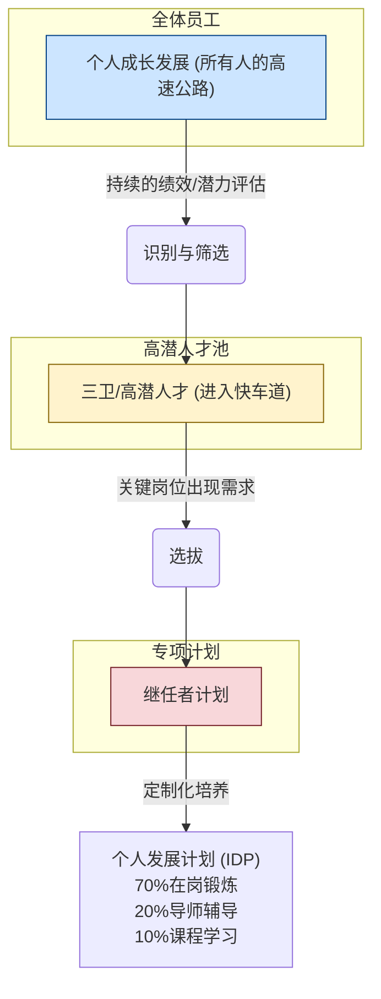
---

## 二、四大核心功能模块

### 2.1 模块核心设计理念

#### 2.1.1 核心哲学：自我驱动自我管理

本模块的设计完全体现了集团"**自我驱动自我管理**"的人才培养理念。我们相信：

> **"最好的管理就是让员工自己管理自己"**

**设计哲学对比：**

```mermaid
graph TD
    subgraph "传统管理方式"
        A1["组织设定目标"]
        A2["组织安排培训"]
        A3["组织跟踪进度"]
        A4["组织评估结果"]
        A5["员工被动执行"]
        
        A1 --> A2 --> A3 --> A4 --> A5
        style A5 fill:#ffebee,stroke:#f44336
    end
    
    subgraph "我们的设计：自我驱动平台"
        C1["🎯 员工自主选择目标<br/>（系统提供路径图参考）"]
        C2["📊 员工自主分析差距<br/>（系统提供能力快照）"]
        C3["📝 员工自主制定计划<br/>（系统提供学习跟踪工具）"]
        C4["🤝 员工自主寻求支持<br/>（系统提供导师推荐）"]
        C5["📈 员工自主跟踪进展<br/>（系统提供进度可视化）"]
        C6["🔄 员工自主调整优化<br/>（系统支持灵活修改）"]
        
        C1 --> C2 --> C3 --> C4 --> C5 --> C6
        C6 -.-> C1
        
        style C1 fill:#e8f5e9,stroke:#4caf50
        style C2 fill:#e8f5e9,stroke:#4caf50
        style C3 fill:#e8f5e9,stroke:#4caf50
        style C4 fill:#e8f5e9,stroke:#4caf50
        style C5 fill:#e8f5e9,stroke:#4caf50
        style C6 fill:#e8f5e9,stroke:#4caf50
    end
```

**组织角色转变：从"管控者"到"赋能者"**

| 维度 | 传统"推"模式 | 我们的"拉"模式 |
|------|-------------|---------------|
| **动力源** | 外部压力驱动 | 内在需求驱动 |
| **主导权** | 组织决定做什么 | 员工选择做什么 |
| **参与度** | 被动配合执行 | 主动规划参与 |
| **持续性** | 依赖外部监督 | 依靠内在动机 |
| **效果** | 完成任务导向 | 实现价值导向 |

**组织的"隐形之手"：**

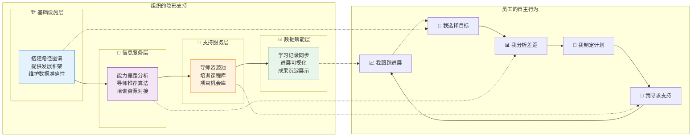

#### 2.1.2 四大核心目标

基于"自我驱动自我管理"的理念，本模块将原有的"带教成长"功能升级为贯穿员工整个职业生命周期的**"人才发展中心"**：

1.  **承接集团人才战略**：系统化管理关键岗位的继任者计划。
2.  **赋能员工自我驱动**：为员工提供清晰、多元的我的成长路径（个人职业GPS）。
3.  **强化师徒制文化**：将带教和辅导作为人才发展的核心手段，并形成文化催化剂。
4.  **沉淀人才数据资产**：构建完整、动态的个人成长档案，为未来的组织能力分析（驾驶舱）打下基础。

#### 2.1.3 创新突破：从"伯乐相马"到"毛遂自荐"

本系统最具创新性的设计，是在三卫和继任者计划中引入了**"员工主动申请"**机制，实现了人才选拔模式的根本性转变：

**传统模式的局限性：**
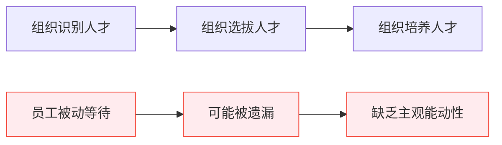

**我们的创新模式：**
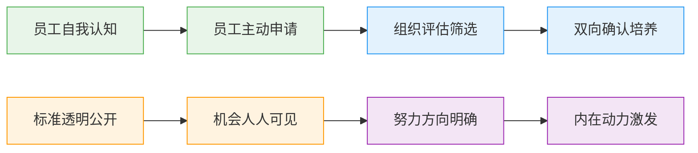

**核心价值突破：**
- 突破管理者视野局限，让优秀人才主动现身
- 基于透明标准的公平竞争，避免"关系导向"
- 激发员工内在驱动力，从"要我发展"到"我要发展"
- 组织从"管控者"转变为"赋能者"和"评估者"

#### 2.1.4 成长目标的全面性：从职业发展到全人发展

真正的"自我驱动自我管理"不应该只关注组织提供的晋升机会，而应该支持员工的**全面成长需求**：

**设计理念升级：**
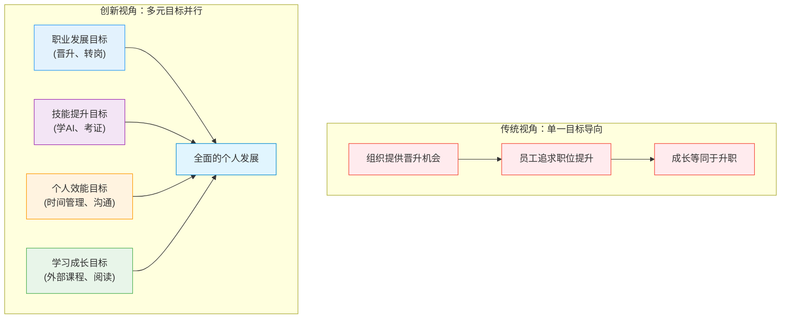

**核心认知转变：**
- **成长≠晋升**：成长是多维度的，不仅仅是职位的提升
- **目标多元化**：每个人的成长需求和兴趣点都不同
- **内在驱动**：真正的动力来自于个人的兴趣和价值追求
- **组织支持**：平台应该支持而不是限制员工的多样化发展

#### 2.1.5 申请记录的数据价值：让员工行为成为人才洞察的窗口

员工的**主动申请行为**是最真实的人才数据，比任何评估都更能反映员工的内在状态：

**申请记录的五大价值维度：**

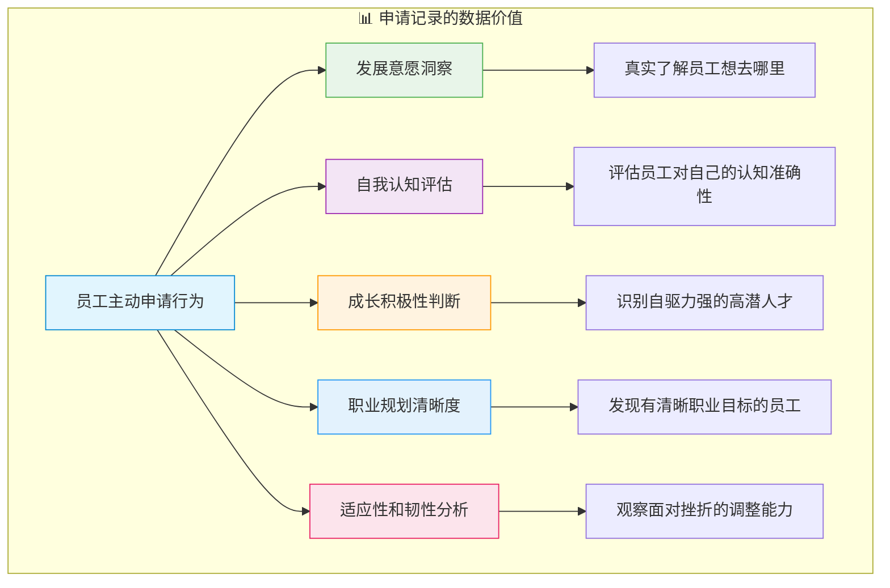

**对组织的战略价值：**

| 数据维度 | 传统方式的局限 | 申请记录的优势 | 应用价值 |
|---------|---------------|---------------|----------|
| **发展意愿** | 依赖年度面谈询问 | 真实行为记录，持续更新 | 精准识别员工真实想法 |
| **自我认知** | 主观评估，可能不准确 | 申请条件vs实际能力对比 | 发现认知偏差，提供指导 |
| **主动性** | 难以量化评估 | 申请频率、质量可量化 | 识别自驱力强的高潜人才 |
| **适应性** | 缺乏观察机会 | 失败后的调整和再申请 | 评估抗挫折能力和学习能力 |
| **职业规划** | 一次性了解，可能变化 | 申请方向的演进轨迹 | 理解员工职业发展逻辑 |

**核心洞察：申请失败同样有价值**
- **勇于尝试**：敢于申请本身就体现了积极性
- **自我反思**：失败后的调整显示学习能力  
- **持续成长**：再次申请展现韧性和改进能力
- **真实反馈**：为组织提供人才培养的真实数据

#### 2.1.6 成长伙伴机制：社会化学习的力量

基于现代学习理论中的**社会建构主义**，我们创新性地引入了**"成长伙伴"机制**，将个人成长从"孤独奋斗"升级为"协作成长"：

**理论基础：为什么协作学习更有效？**

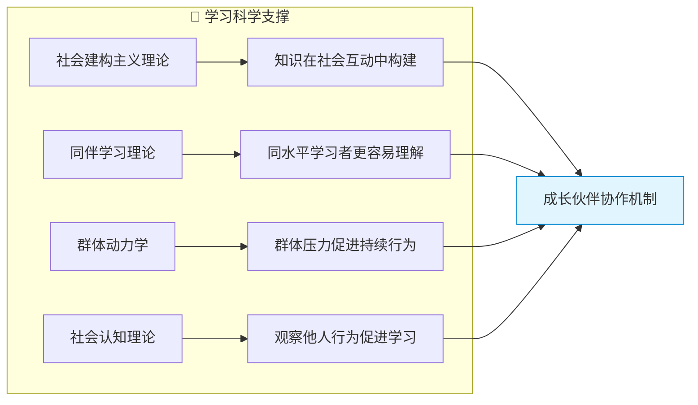

**设计创新：从个体到群体的学习生态**

| 学习模式 | 个人学习 | 成长伙伴协作 | 创新价值 |
|---------|---------|-------------|----------|
| **动力来源** | 内在自律 | 内在自律 + 同伴激励 + 群体责任 | 多重动力保障 |
| **知识获取** | 单一视角 | 多重视角 + 经验分享 + 集体智慧 | 学习效率倍增 |
| **坚持难度** | 容易放弃 | 不好意思放弃 + 相互监督 | 完成率大幅提升 |
| **社交价值** | 孤独学习 | 结识伙伴 + 建立连接 | 工作关系网络扩展 |
| **组织效应** | 个人提升 | 群体提升 + 文化建设 | 学习型组织形成 |

**核心机制设计：**
1. **智能匹配**：系统自动发现有相同目标的员工
2. **自愿组队**：基于兴趣和意愿的自主选择
3. **协作制定**：共同讨论和制定实现计划
4. **进度共享**：透明的学习进度和经验分享
5. **相互激励**：持续的鼓励和支持机制

### 2.2 模块功能架构

"人才发展"模块将围绕四大核心功能进行构建，它们相辅相成，共同构成一个完整的人才培养与发展闭环。

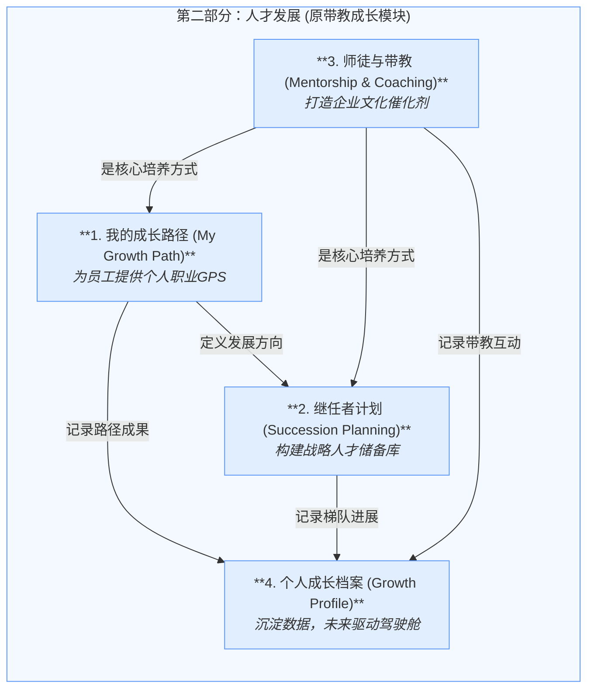

---

## 三、功能模块详细设计

### 3.1 我的成长路径 (My Growth Path)

#### 3.1.1 设计理念：从"模糊的预期"到"清晰的成长地图"

**核心问题**：
- 员工经常不知道自己的成长方向和路径
- 管理者缺乏指导员工发展的标准化工具
- 组织缺少系统性的人才发展数据支撑

**设计思路**：
"我的成长路径"就像一个**职业GPS导航系统**，为每位员工提供：
1. **当前位置定位**：我现在在哪里？
2. **目标设定**：我想去哪里？
3. **路径规划**：如何到达目的地？
4. **实时导航**：每一步该做什么？
5. **重新规划**：遇到变化如何调整？

#### 3.1.2 分阶段实施方案

考虑到功能的复杂性和落地的实用性，"我的成长路径"将采用分两个阶段的实施策略：

**第一阶段：基于现有系统的功能增强（MVP版本）**

*目标：在现有成长路径基础上，让流程跑通，员工能够真正使用起来*

#### 核心改进理念：从"被动观看者"到"主动参与者"

第一阶段的本质是**增强员工互动**，让员工从"被动观看者"变成"主动参与者"。更重要的是，让所有员工都能看到**"进阶的希望"**——不仅知道自己当前在哪里，更要知道**还能去向何方**。

**核心设计原则：让希望可见，让努力有方向**

```mermaid
graph TD
    subgraph "现有系统：静态展示"
        A1["员工登录系统"]
        A2["查看成长路径图"]
        A3["只能'看'路径"]
        A4["无法互动"]
        A5["离开系统"]
        
        A1 --> A2 --> A3 --> A4 --> A5
    end
    
    subgraph "第一阶段增强后：可交互体验"
        B1["员工登录系统"]
        B2["看到个人定位标识<br/>💡 我在这里"]
        B3["点击选择目标职位<br/>🎯 我要去那里"]
        B4["查看能力差距提示<br/>📊 我需要什么"]
        B5["设置学习计划<br/>📝 我要做什么"]
        B6["记录学习进展<br/>📈 我完成了什么"]
        B7["申请导师支持<br/>🤝 我需要帮助"]
        B8["持续跟踪进度<br/>⏰ 定期回来更新"]
        
        B1 --> B2 --> B3 --> B4 --> B5 --> B6 --> B7 --> B8
        B8 -.-> B6
    end
    
    style A3 fill:#ffebee,stroke:#f44336
    style A4 fill:#ffebee,stroke:#f44336
    style B2 fill:#e8f5e9,stroke:#4caf50
    style B3 fill:#e8f5e9,stroke:#4caf50
    style B4 fill:#e8f5e9,stroke:#4caf50
    style B5 fill:#e8f5e9,stroke:#4caf50
    style B6 fill:#e8f5e9,stroke:#4caf50
    style B7 fill:#e8f5e9,stroke:#4caf50
```

#### 员工体验转变对比

| 维度 | 现有系统 | 第一阶段增强后 |
|------|---------|---------------|
| **员工角色** | 👀 观看者 | 🎮 参与者 |
| **交互方式** | 📖 只能看 | 🖱️ 可以点、可以选、可以记录 |
| **使用频率** | 🔄 偶尔查看 | 📅 定期更新 |
| **心理感受** | 😐 "这是公司的系统" | 😊 "这是我的成长工具" |
| **希望感知** | 🤷 "不知道还能做什么" | 🌟 "我看到了更多可能性" |

**一句话概括**：让成长路径从"墙上的装饰画"变成了"手中的导航仪"

#### 进阶机会的可视化设计

让每位员工都能清楚地看到"成长的阶梯"，知道努力的方向：

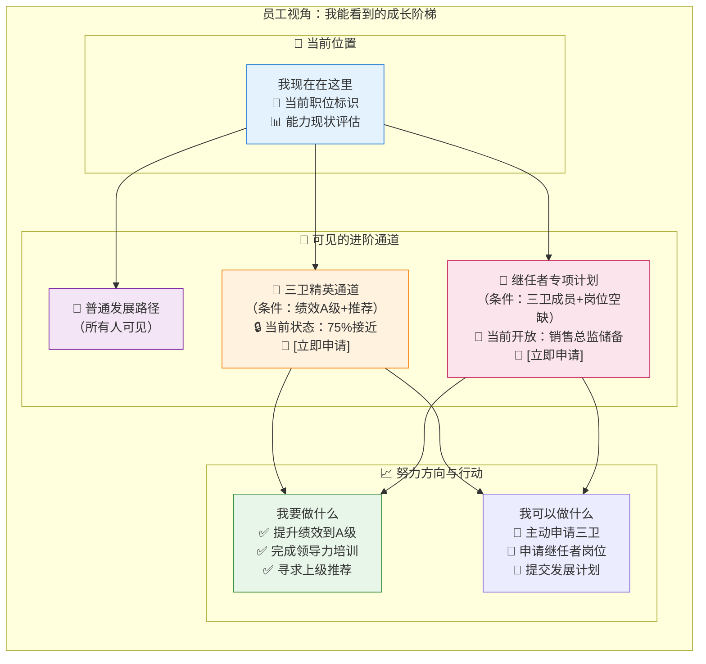

#### 个人成长目标的多元化视角

除了组织提供的晋升机会，员工还可以设定各种个人成长目标：

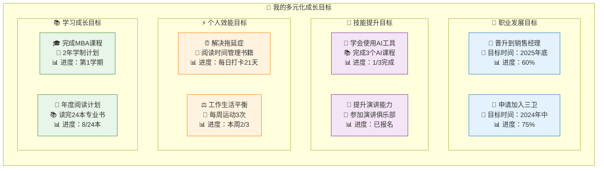

**关键设计理念：成长目标的个性化和多样化**

| 目标类型 | 特点 | 示例 | 跟踪方式 |
|---------|------|------|----------|
| **职业发展** | 与组织路径相关 | 晋升、转岗、进入精英通道 | 里程碑式跟踪 |
| **技能提升** | 能力建设导向 | 学AI、考证书、掌握新技术 | 学习进度+证据记录 |
| **个人效能** | 习惯和行为改善 | 时间管理、沟通能力、健康习惯 | 日常打卡+自我评估 |
| **学习成长** | 知识扩展导向 | 外部课程、专业阅读、学历提升 | 完成度统计+成果展示 |

#### 成长伙伴机制：从孤独奋斗到协作成长

**核心创新：让相同目标的员工组成"成长伙伴"，共同制定和实现目标**

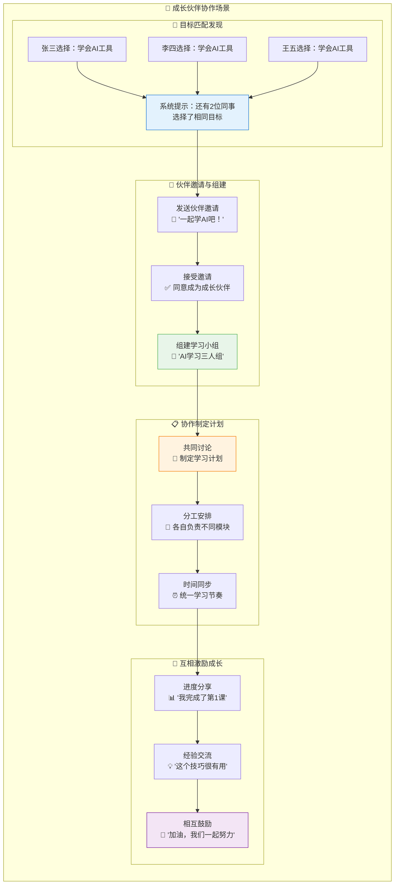

**成长伙伴机制的五大价值：**

| 价值维度 | 传统个人学习 | 成长伙伴协作 | 提升效果 |
|---------|-------------|-------------|----------|
| **学习动力** | 容易放弃，缺乏监督 | 伙伴互相激励，不好意思放弃 | 📈 持续性提升70% |
| **学习效率** | 独自摸索，效率较低 | 经验分享，避免重复踩坑 | 📈 学习效率提升50% |
| **知识深度** | 理解可能有局限 | 多角度讨论，加深理解 | 📈 知识掌握深度提升40% |
| **社交价值** | 孤独学习，缺乏交流 | 结识志同道合的伙伴 | 📈 工作满意度提升30% |
| **组织氛围** | 各自为战，缺乏协作 | 形成学习型组织文化 | 📈 团队凝聚力提升60% |

#### 具体功能体验示意

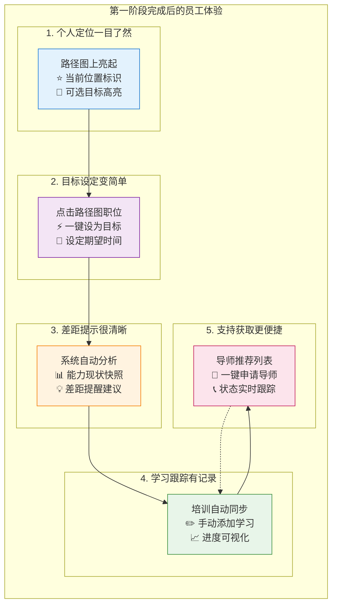

**现有基础分析：**
- ✅ 已有管理序列和匠人序列的路径图谱
- ✅ 已有"我的成长计划"基础菜单结构  
- ✅ 已有基本的可视化展示框架

| 功能模块 | 功能点 | 功能描述 | 基于现有系统的实现方式 | 开发复杂度 |
|---------|-------|------|---------|---------|
| **路径图增强** | **个人定位标识** | 在现有的管理序列/匠人序列图上： - **当前位置高亮**：用特殊颜色/图标标识员工当前职位 - **可达路径提示**：高亮显示可能的发展路径 - **点击交互**：点击职位可查看详细要求 | 在现有路径图组件上增加定位逻辑，从HR系统获取当前职位数据 | **低** |
| | **目标设定交互** | 让现有路径图变为可交互： - **点击选择目标**：员工可点击路径图上的职位设为目标 - **目标标记**：用星标等图标标记已选目标 - **路径预览**：显示从当前位置到目标的建议路径 | 为现有路径图添加点击事件，增加目标选择和保存功能 | **中** |
| **目标管理面板** | **我的目标卡片** | 在"我的成长计划"页面添加目标展示区域： - **目标职位卡片**：显示选定的目标职位 - **预期时间**：员工设定的达成时间 - **进度条**：简单的完成度显示 | 在现有页面布局中增加目标展示卡片组件 | **低** |
| | **多元化目标管理** | 支持员工设定各种类型的个人成长目标： - **职业发展目标**：晋升、转岗、进入精英通道 - **技能提升目标**：学会AI工具、提升演讲能力、获得认证 - **个人效能目标**：解决拖延症、时间管理、工作生活平衡 - **学习成长目标**：外部课程、专业阅读、行业会议 | 扩展现有目标管理功能，增加目标分类和模板 | **中** |
| | **成长伙伴机制** | **创新突破：从个人奋斗到协作成长** - **同目标发现**：系统提示"还有X位同事选择了相同目标" - **伙伴邀请**：可邀请有相同目标的同事成为"成长伙伴" - **计划共享**：经允许后可查看伙伴的实现计划和进度 - **协作制定**：伙伴们可以一起设计目标实现的具体计划 - **互相激励**：进度分享、经验交流、相互鼓励 | 建立成长伙伴匹配和协作功能 | **高** |
| | **目标编辑功能** | 提供简单的目标管理： - **修改目标**：重新选择目标职位 - **调整时间**：修改预期达成时间 - **添加备注**：记录个人想法 | 增加目标编辑弹窗，复用现有的表单组件 | **低** |
| | **灵活跟踪方式** | 支持不同类型目标的跟踪方式： - **量化指标**：完成百分比、次数统计 - **里程碑式**：阶段性成果标记 - **证据记录**：上传学习证明、心得体会 - **自我评估**：定期的主观感受记录 | 增加多样化的进度记录和展示方式 | **中** |
| **能力状态展示** | **个人能力快照** | 基于现有数据展示当前状态： - **基础信息**：当前职位、入职时间、所属部门 - **培训履历**：已完成的培训项目列表 - **技能标签云**：从培训记录自动提取的技能关键词 | 调用现有HR系统和培训系统API，数据展示复用现有组件 | **中** |
| | **差距提示** | 简单的文字提醒功能： - **能力缺口**：对比目标职位，提示可能需要的技能 - **培训建议**：推荐相关的培训课程 - **经验提醒**：提示可能需要的工作经验 | 基于职位要求数据和个人履历的简单比对逻辑 | **中** |
| **学习跟踪** | **学习活动记录** | 整合现有培训数据： - **自动同步**：培训系统的学习记录自动显示 - **手动添加**：员工可记录自主学习活动 - **时间轴展示**：按时间顺序展示学习历程 | 集成现有培训系统API，增加手动记录功能 | **中** |
| | **简单进度跟踪** | 基础的进展管理： - **里程碑设置**：员工可设置阶段性目标 - **完成标记**：手动标记完成状态 - **进度百分比**：简单的完成度计算 | 增加里程碑管理功能，简单的进度计算逻辑 | **低** |
| **基础支持对接** | **导师申请入口** | 简化的导师申请流程： - **导师推荐**：基于目标职位推荐可能的导师 - **申请按钮**：一键发起导师申请 - **状态跟踪**：显示申请状态 | 对接现有师徒带教功能，增加推荐逻辑 | **低** |
| **进阶通道展示** | **三层路径可视化** | 在成长路径图上分层展示发展机会： - **基础层**：普通成长路径（蓝色标识） - **精英层**：三卫快车道（金色边框，皇冠图标） - **专项层**：继任者计划（红色边框，钻石图标） | 集成人才标签和继任者计划数据 | **中** |
| | **进阶条件展示** | 智能显示进入高级通道的条件： - **当前状态**：你在哪一层，距离下一层多远 - **具体条件**：绩效要求、培训要求、经验要求 - **进度指示**：用进度条显示接近程度 | 基于绩效系统和培训记录的条件匹配 | **中** |
| | **机会公告板** | 定期更新的发展机会信息： - **三卫选拔**：当前开放的选拔通知 - **继任者空缺**：关键岗位的储备需求 - **成功案例**：展示已进入这些通道的同事故事 | 人才盘点系统和继任者计划数据 | **低** |
| | **主动申请通道** | 员工可以主动申请进入高级通道： - **三卫申请**：员工可提交三卫申请，附上自我评估和成长计划 - **继任者申请**：针对开放岗位提交继任者申请 - **申请指导**：系统提供申请模板和评估标准 - **进度跟踪**：实时显示申请状态和反馈 | 申请流程管理和评估系统 | **中** |

**第二阶段：体验优化与智能化扩展**

*目标：提升用户体验，增加智能化功能*

将在第一阶段稳定运行后，根据用户反馈和数据积累情况，逐步添加高级功能。具体的扩展功能规划详见文档末尾的"**七、未来扩展**"章节。

### 3.2 继任者计划 (Succession Planning)

#### 3.2.1 设计理念：如何科学地"选人"与"看人"

"继任者计划"的成功，核心在于两点：**选对人**和**看准人**。本系统旨在将这一个人经验沉淀的艺术，转化为一套科学、高效、可复制的数字化流程。

1.  **关于"选人"：智能与经验的结合**
    *   **问题**：如何快速、全面地发现潜在的继任者，避免视野局限？
    *   **我们的方案**：系统提供"智能推荐 + 手动搜索"相结合的提名方式。
        *   **智能推荐**：利用算法，根据预设的职业路径、能力模型、历史绩效和高潜标签，从全公司范围内筛选出匹配度最高的候选人名单，作为决策的起点，打破部门墙。
        *   **手动提名**：充分尊重管理者的识人经验和业务判断，允许管理者根据自己的洞察，直接提名任何人选。
    *   **价值**：这种模式既利用了数据的广度与客观性，又结合了管理者的深度与直觉，让"选人"更科学、更高效。

2.  **关于"看人"：标准统一的可视化罗盘**
    *   **问题**：如何客观、公正地评估不同背景的候选人，避免评估标准不一或仅凭主观印象？
    *   **我们的方案**：引入业界成熟的"九宫格人才盘点"工具作为评估的"罗盘"。
        *   **双轴坐标**：以"业绩"（横轴，来自绩效系统）和"潜力"（纵轴，来自上级评估和360评估）为标准坐标系，为所有候选人提供了统一的衡量标尺。
        *   **可视化呈现**：将抽象的评估转化为直观的九宫格视图，候选人自动落位（如"明星"、"潜力股"、"中坚力量"等），其人才画像一目了然。
    *   **价值**：它将"看人"的过程从模糊的感觉变为清晰的定位，为后续的人才发展和决策提供了坚实的数据基础，让管理者在识别人才时"心中有数，手上有图"。

#### 3.2.2 功能详细设计

| 功能模块 | 功能点 | 功能描述 | 系统集成 | 前置条件 |
| :--- | :--- | :--- | :--- | :--- |
| **关键岗位管理** | **关键岗位识别** | **初期（手动标记）**：授权用户（高管/HR）可在系统组织架构图上，为任意岗位手动标记"关键岗位👑"。 **未来（规则辅助）**：系统支持配置规则（如"M3以上岗位"），自动识别并标记关键岗位。 | {组织架构} | 兼具灵活性与自动化潜力 |
| | **岗位风险评估** | 系统从四个维度综合评估岗位风险，并以**红(高风险)黄(中风险)绿(低风险)**灯进行预警。 | - | 岗位已标记为关键 |
| | | **1. 离任风险**：评估现任者的离职可能性。 <u>数据源</u>：关联员工近半年绩效(持续低绩效则风险升高)、敬业度调研结果、关键人才盘点中的离职风险标识。 | {绩效系统}、{调研系统}、{人才盘点} | **高风险项** |
| | | **2. 储备不足风险**：评估内部人才梯队的厚度。 <u>数据源</u>：系统自动判断。若该岗位下无继任候选人，或第一、二梯队候选人为空，则风险升高。 | {继任者计划}模块 | **中风险项** |
| | | **3. 招聘难度风险**：评估从外部获取人才的难度。 <u>数据源</u>：由HR根据市场情况，为该岗位手动设置"高/中/低"难度等级。 | 手动配置 | **中风险项** |
| | | **4. 唯一性风险**：评估该岗位技能的稀缺性。 <u>数据源</u>：由HR手动标记该岗位是否为"单点故障"（技能具有唯一性）。 | 手动配置 | **高风险项** |
| **人才梯队建设** | **候选人提名** | 管理者点击"提名继任者"后，系统提供两种方式： 1. **智能推荐**：系统根据路径匹配、能力相似度、高潜标识等，推荐潜在候选人。 2. **手动搜索**：管理者可根据判断，直接搜索并提名。 | {我的成长路径}、{员工标签} | 兼具智能与灵活 |
| | **员工主动申请机制** | **创新突破：从"被选拔"到"主动申请"** - **申请入口**：员工可在"我的成长路径"中看到开放的继任者岗位，主动提交申请 - **自我评估**：系统引导员工对照岗位要求进行能力自评 - **申请材料**：员工可提交个人发展计划、成长档案、推荐信等 - **状态跟踪**：实时显示申请进度和评估结果 | {我的成长路径}、{个人成长档案} | **让员工从"等待被发现"变为"主动展示自己"** |
| | **梯队安排** | 提名后，管理者需将候选人放入不同梯队"泳道"： - **第一梯队 (Ready Now)**: 1年内可接任。 - **第二梯队 (Ready in 1-3 Yrs)**: 1-3年内可培养成熟。 - **第三梯队 (Future Potential)**: 3-5年长期储备。 | - | 清晰定义人才储备周期 |
| | **候选人评估(九宫格)** | 采用经典的"九宫格人才盘点"工具，对候选人进行可视化评估。  - **横轴-业绩**：数据来自{绩效系统}。  - **纵轴-潜力**：数据来自上级评估、{360评估}及高潜标识。 | {绩效系统}、{360评估} | **业界最佳实践** |
| | **可视化人才盘点** | 在一个可视化的九宫格中，候选人头像根据其业绩/潜力得分，自动落入相应格子（如明星/潜力股）。管理者可拖拽微调，系统会记录盘点历史。 | - | 直观、动态、可追溯 |
| | **梯队健康度分析** | 可视化展示各关键岗位的人才梯队覆盖率、候选人准备度等，分析梯队健康状况。 | - | 梯队已建立 |
| **继任者发展** | **发展计划(IDP)生成** | 基于"岗位要求"与"候选人现状"的差距分析，为候选人生成个人发展计划(IDP)。 系统可根据差距，自动推荐发展活动组合（70-20-10模型）。 | {我的成长路径}, {九宫格评估结果} | 候选人已完成评估 |
| | **70%在岗锻炼** | 管理者可在IDP中为候选人指派"挑战性任务"、"项目性工作"或设置"代理岗位"。系统提供任务库模板，也支持手动创建。 | {项目管理系统} (远期) | IDP已生成 |
| | **20%辅导反馈** | 系统可根据能力短板，从"师资库"中推荐合适的导师(Mentor)或教练(Coach)。师徒关系一旦建立，辅导计划自动纳入IDP。 | {师徒与带教} | IDP已生成 |
| | **10%正式学习** | 系统根据能力短板，从"知识分享"模块中推荐相关的"线上课程"或"学习资料"。课程完成状态自动同步回IDP。 | {知识分享} | IDP已生成 |
| | **IDP确认与锁定** | 系统生成的IDP为草稿，需经由管理者与候选人沟通确认后，共同"锁定"该发展计划，进入执行阶段。 | - | IDP草稿已生成 |
| | **发展进度追踪** | 提供一个可视化的仪表盘，展示IDP的整体完成进度和各项发展活动的具体状态（未开始/进行中/已完成）。 | - | IDP已锁定 |
| | **自动化进度更新** | 与系统集成的部分（如线上课程）完成时，IDP中的对应项目会自动标记为"已完成"。 | {知识分享} | IDP执行中 |
| | **手动更新与举证** | 对于在岗锻炼、外部学习等线下活动，支持候选人或管理者手动更新状态，并可上传证明材料（如心得、报告、证书扫描件）。 | - | IDP执行中 |
| | **定期回顾提醒** | 系统可设置周期性提醒（如每季度），推动管理者与候选人进行IDP进度回顾，并记录回顾要点。 | {待办事项} | IDP执行中 |

### 3.3 师徒与带教 (Mentorship & Coaching)

#### 3.3.1 设计理念：从"零散的传帮带"到"结构化的赋能网"

本模块的核心，是将公司内部宝贵的、无形的"人带人"经验，通过引入"项目化管理"和"模板化运营"的思路，转变为一套有章可循、可规模化、可沉淀的结构化赋能体系。

我们将每一对"师徒关系"，都视为一个特殊类型的、长期的"师徒带教项目"来进行管理。这样做的好处是：
*   **结构化**：利用"培训项目"成熟的"前/中/后"流程，为带教关系提供了清晰的生命周期。
*   **标准化**：通过"岗位带教模板库"，确保了各岗位带教内容的基线质量。
*   **可追溯**：所有的带教过程和产出，都被作为项目材料沉淀下来，方便回顾与评估。
*   **可管理**：带教的完成、评估、激励，都可以纳入项目的自动化管理流程。

#### 3.3.2 业务流程全景图

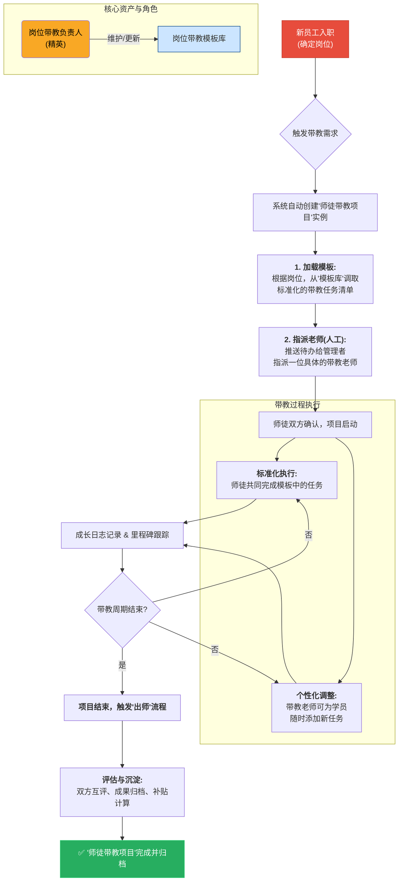

#### 3.3.3 功能详细设计

| 功能模块 | 功能点 | 功能描述 | 系统集成 | 设计亮点 |
| :--- | :--- | :--- | :--- | :--- |
| **1. 带教模板库** | **岗位带教模板** | 为每个需要带教的关键岗位，建立一份标准化的带教模板。模板中包含： - **带教任务清单** (如：熟悉XX系统、完成首次客户拜访)。 - **关键里程碑** (如：30/60/90天应达成的目标)。 - **学习资源** (推荐阅读的文档、视频课程等)。 | {知识分享} | **将精英的带教经验标准化、产品化** |
| | **模板负责人** | 为每个岗位模板指定一位"模板负责人"(该岗位的精英)，他负责持续迭代和优化这份模板。 | - | **确保模板的鲜活与实战性** |
| **2. 项目自动化** | **项目实例化** | 当有新员工入职或触发带教需求时，系统自动完成以下操作： 1. 创建一个"师徒带教项目"。 2. 根据新员工的岗位，自动加载对应的"带教模板"。 | {HR系统} | **流程自动化，减少事务性工作** |
| | **指派带教老师** | **实际流程**：员工入职时，HR会提前和部门经理沟通好，并在系统中填写带教老师字段。 **系统支持**：当实际带教老师和系统指派不一致时，教务人员可手动调整师徒关系。 | {待办事项} | **HR预设+教务调整，确保关系质量** |
| **3. 带教过程管理** | **任务管理** | 在项目内部，师徒可以共同管理任务列表。带教老师拥有权限，可在标准任务之外，为学员添加个性化的临时任务。 | - | **标准化与个性化相结合** |
| | **成长日志** | 提供一个私密的、仅师徒和相关管理者可见的"成长日志"空间，用于记录沟通要点、反馈、待办和感悟。 | - | **过程可追溯，成长有沉淀** |
| | **里程碑跟踪** | 项目的"日程"视图，清晰地展示了带教过程中的关键里程碑及其达成状态，方便管理者和HR快速掌握进度。 | - | **可视化管理，进度一目了然** |
| **4. 激励与评估** | **"出师"评估** | 带教周期结束时，系统自动触发"出师"流程，引导师徒双方进行总结，并完成在线的相互匿名评价。 | - | **形成闭环，持续迭代** |
| | **贡献与激励** | 导师的贡献将被量化和认可： - **数据展示**：个人主页将展示其带教总时长、学员数、好评率等。 - **补贴挂钩**：可根据带教时长和质量，计算并发放带教补贴。 - **荣誉体系**：设立"金牌导师"等荣誉并公开表彰。 | {我的成长}, {集团补贴} | **让导师的付出有回报、有荣誉** |
| **师资池管理** | **师资分类与画像** | 1.  **明确师资类型**：系统化管理`书院认证带教老师`、`内部讲师`、`一级军士长`等不同师资角色。 2.  **360°师资画像**：整合师资的专业领域、带教经验、历史评价、学员反馈、认证状态等信息，形成完整画像。 | {HR系统}, {个人成长档案} | **让合适的老师更容易被找到** |
| | **智能检索与匹配** | 提供多维度检索功能（如按业务领域、按职级、按学员评价），并可为"师徒带教项目"提供智能化的匹配推荐。 | - | **从"人找人"到"系统助人"** |
| **师资认证与统计** | **多通道认证体系** | 1.  **书院认证**：为"书院认证带教老师"建立线上认证流程，管理认证课程、考评（如任职年限、考评结果）。 2.  **讲师/军士长认证**：为"讲师"和"一级军士长"的评定提供流程支持。 | {培训项目} | **将认证标准流程化、线上化** |
| | **关键数据统计** | **自动化统计带教成效**： - **数量统计**：自动累计每位导师的`带教学员数`。 - **质量跟踪**：记录`带教事故情况`（需定义标准），并关联分析`学员1年内离职率`。 这些数据将作为师资评级和认证续期的重要依据。 | {HR系统} | **用数据客观评估带教质量** |

### 3.4 个人成长档案 (Growth Profile)

#### 3.4.1 设计理念：从"静态的履历"到"动态的价值罗盘"

传统的员工档案是静态的、向后看的，主要用于记录"你做过什么"。我们的"个人成长档案"旨在成为一个动态的、向前看的"价值罗盘"，它将成为所有成长数据的最终汇集地和展示中心，不仅要回答"你做过什么"，更要回答：

*   **你现在是谁？** (当前的能力、身份和定位)
*   **你能去向何方？** (你的潜力、发展趋势和目标)
*   **如何去往那里？** (你的能力短板和发展建议)

为此，整个档案的设计将围绕"可视化"、"故事化"和"多维度"三个核心原则展开。

#### 3.4.2 功能详细设计

| 功能模块 | 功能点 | 功能描述 | 数据来源 | 设计亮点 |
| :--- | :--- | :--- | :--- | :--- |
| **1. 档案概览** | **个人快照** | 在档案顶部，用卡片形式展示最核心的信息：姓名、岗位、职级、**特殊身份标签**（如"精英通道成员"、"XX岗位继任者"）、能力最强的三个标签。 | {HR系统}, {职业发展路径}, {继任者计划} | **3秒内了解一个人** |
| | **能力雷达图** | 动态生成的能力雷达图，可视化展示员工当前的能力状况。可选与"当前岗位要求"或"目标岗位要求"进行对比，清晰暴露能力优势与短板。 | {我的成长}的技能树, 各项评估数据 | **能力差距一目了然** |
| **2. 成长时间轴** | **关键里程碑** | 以时间轴的形式，按时间倒序展示员工职业生涯中的关键事件，如： - 加入公司、岗位变动、晋升 - 进入"精英通道" - 启动"继任者任务" - 完成一个重要的"师徒带教项目" | {HR系统}, 本模块各功能 | **故事化呈现成长轨迹** |
| **3. 成就陈列室** | **荣誉与徽章** | 集中展示所有通过系统获得的**电子徽章**（如"XX岗位通关"）、**证书**（如"子衿培训合格证书"）、以及被授予的**公司荣誉**（如"年度优秀员工"）。 | {我的成长}, {培训项目}, {HR系统} | **激励的可视化沉淀** |
| **4. 详细记录** | **培训履历** | 详细列出所有参加过的培训项目，包括项目名称、完成时间、所获成绩、担任角色（如组长）等。 | {培训项目} | **学习经历的完整记录** |
| | **带教履历** | 分为"我作为导师"和"我作为学员"两部分，记录所有的师徒带教经历、周期、以及双方的最终互评摘要。 | {师徒与带教} | **传承贡献与被培养经历** |
| | **项目与实践** | 记录参与过的重大项目、挑战性任务，尤其是作为IDP一部分的在岗锻炼经历和产出。 | {继任者计划} | **展示实战经验** |
| **5. 综合评估** | **360°反馈** | 汇总展示来自上级、平级、下级以及导师的评价与反馈（经过脱敏或权限处理）。 | {绩效系统}, {师徒与带教} | **提供多维度的客观视角** |
| | **九宫格盘点历史** | 记录该员工在历次人才盘点中的"九宫格"位置及其变化轨迹，直观展示其绩效与潜力的发展趋势。 | {继任者计划} | **动态看发展，而不仅是看当前** |
| **6. 权限与分享** | **多视角查看** | 档案支持不同角色查看不同视图： - **员工本人**：看到全部内容。 - **直接上级**：看到其下属的全部内容。 - **HR/高层**：根据权限查看，并用于人才盘点。 | 权限系统 | **保障数据安全与合理使用** |
| | **档案导出/打印** | 支持将个人成长档案一键导出为设计精美的PDF格式，可用于晋升述职、评优等正式场合。 | - | **让成长档案产生线下价值** |
| **成长轨迹记录** | **学习履历** | 自动记录员工的培训参与情况： - **培训清单**：按时间顺序展示已完成的培训项目 - **学习时长**：累计学习时间统计 - **培训评价**：培训效果评估和反馈记录 | 对接培训系统API，自动同步培训数据 | **低** |
| | **申请记录档案** | **创新价值：完整记录员工的主动申请历史** - **内聘申请记录**：员工申请的所有内部职位，包括申请时间、岗位、申请理由 - **三卫申请记录**：申请加入三卫的历史，包括自我评估、申请材料 - **继任者申请记录**：申请继任者岗位的完整记录 - **申请分析**：申请频率、申请方向、成功率等数据分析 | 建立申请记录数据库，与HR系统集成 | **中** |
| | **发展意愿画像** | 基于申请记录生成员工发展意愿分析： - **发展方向偏好**：从申请记录分析员工的职业倾向 - **成长积极性**：通过申请频率和质量评估员工的主动性 - **自我认知水平**：对比申请条件和实际能力的匹配度 - **适应性分析**：申请失败后的调整和再申请行为 | 基于申请数据的智能分析算法 | **高** |
| | **成长节点记录** | 记录员工成长过程中的关键时刻： - **晋升记录**：职位变化的完整历史 - **项目经历**：参与的重要项目和承担的角色 - **导师关系**：师徒带教的历史记录 | 整合多个系统的数据，形成完整的成长时间轴 | **中** |

---

## 四、下一步计划

1.  细化每个功能点的业务规则和交互流程。
2.  设计关键界面的原型草图。
3.  与IT部门探讨技术实现的可行性。
4.  最终定稿后，将此模块内容整合进《演寂书院培训系统产品设计》主文档。

---

## 五、系统定位：与人事系统「员工档案」的边界划分

在设计本模块前，必须清晰界定它与公司现有`人事系统-员工档案`的关系，以确保系统边界清晰、数据职责明确，从而避免功能重叠和数据混乱。

### 5.1 核心定位：身份证 vs 导航仪

我们可以用一个精准的比喻来定位这两个"档案"：

*   **人事系统的「员工档案」是"身份证"和"户口本"**：它是法定的、官方的、静态的记录，是企业管理的基石 (System of Record)。
*   **本系统的「个人成长档案」是"个人作品集"和"发展导航仪"**：它是动态的、发展的、面向未来的画像，是人才发展的引擎 (System of Engagement)。

### 5.2 功能与数据对比

| 维度 | 人事系统 - 员工档案 | **本模块 - 个人成长档案** | 一句话总结 |
| :--- | :--- | :--- | :--- |
| **核心定位** | **企业管理的基石** | **人才发展的引擎** | 一个是"管人"的基础，一个是"发展人"的工具 |
| **时间视角** | **向后看（Past-Oriented）** | **向前看（Future-Oriented）** | 一个记录"你来自哪里"，一个规划"你将去向何方" |
| **数据性质** | **静态、契约性、结果性** | **动态、过程性、潜力性** | 官方记录 vs 动态画像 |
| **核心数据** | 合同、薪酬、考勤、社保、职位、奖惩等**法定事实** | 技能、潜力、评估、培训记录、带教履历、成长目标等**发展轨迹** | 硬数据 vs 软实力 |
| **主要用户** | HR、财务、法务 | **员工本人**、直接上级、导师、高阶管理者 | 管理者 vs 赋能对象 |
| **更新频率** | 低频（职位变动、年度调薪时更新） | **高频**（完成一个任务、获得一个徽章时即时更新） | 事件驱动 vs 持续记录 |
| **核心价值** | 确保**合规性**、**准确性**和**管理效率** | 驱动**个人成长**、**组织能力提升**和**人才保留** | 降低风险 vs 创造价值 |

### 5.3 协同关系：数据流向与价值闭环

这两个档案并非孤立存在，而是通过清晰的API接口，构成了一个"基础"与"应用"的协同关系，实现1+1>2的效果。

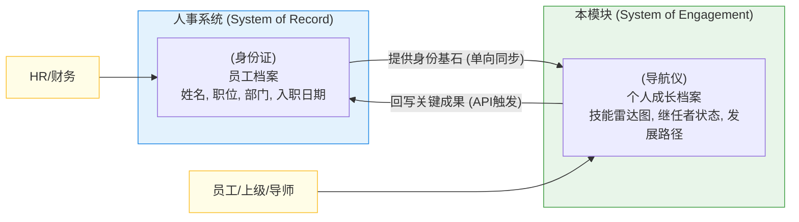

**数据流说明：**

1.  **人事系统 → 本模块 (单向数据流)**
    *   **内容**：人事系统的`员工档案`是权威的**数据源头 (Single Source of Truth)**。员工的姓名、工号、部门、职级、直属上级等基础信息，会通过API单向同步给`个人成长档案`。
    *   **目的**：确保了身份的唯一性和准确性。`个人成长档案`不必再维护一套重复的人员信息，它只需要"挂靠"在权威的员工ID上即可。

2.  **本模块 → 人事系统 (API触发式回写)**
    *   **内容**：`个人成长档案`在发展过程中产生的、具有**里程碑意义的"结果性"数据**，可以被选择性地回写到`员工档案`中。例如：
        *   通过了"子衿培训合格证书"，证书信息可回写。
        *   正式成为"三卫"后备人才，这个**标签**可以回写。
        *   完成了"CEO继任者计划"，这个重要的**培训履历**可以回写。
    *   **目的**：丰富了官方档案的内涵，使得`员工档案`不再仅仅是冰冷的记录，也包含了员工能力成长的关键成果，为正式的晋升、调薪提供了更全面的依据。

---

## 六、用户体验设计：如何让成长"被看见"

如果员工无法清晰地感知到自己的成长和身份变化，那么再完善的系统也无法有效激励员工。因此，本模块将采用"强仪式感的主动告知"与"无处不在的环境暗示"相结合的组合拳，为员工营造强烈的、独一无二的"专属体验"。

### 6.1 关键身份转变的感知设计方案

| 场景 | 实现方式 | 设计目标和用户感知 |
| :--- | :--- | :--- |
| **首次**被评定为"三卫" **(解锁精英通道)** | **全屏祝贺弹窗** - **标题**："恭喜！您已成功进入'精英通道'！" - **内容**：强调这是对他过去卓越表现的认可，以及公司对他未来潜力的期待。 - **交互**：一个醒目的"**点亮我的精英通道**"按钮，点击后关闭并进入"我的成长"界面。 | **创造惊喜和荣誉感**。 通过一次性的、强制的、充满仪式感的交互，确保员工明确地知道发生了什么，并理解其重要性。 |
| **每次**以"精英"身份登录或浏览 | **持续的视觉强化** 1. **路径光环**："我的成长"地图上的个人路径，持续被"精英金"光晕渲染。 2. **头像徽章**：个人头像在系统各处都带上独特的"精英"徽章。 3. **专属角标**：在任务列表或课程库中，部分内容会带有"精英专属"角标。 | **持续强化精英身份**。 通过无处不在的环境暗示，让员工时刻感知到自己的与众不同，并体会到"专属"和"特权"带来的激励。 |
| **首次**被纳入"继任者计划" **(开启继任者任务)** | **"使命任命书"式弹窗** - **标题**："新的征程！您已启动'继任者任务'！" - **内容**：明确告知他被选为某个关键岗位的重点培养对象，并介绍核心资源（如专属导师）。 - **交互**：一个"**查看我的继任者任务**"按钮，点击后进入"我的成长"并高亮任务面板。 | **赋予使命感和责任感**。 通过严肃、正式的交互，让员工理解这是一个有明确目标的专项培养计划，认知到自己肩负的期望。 |
| **每次**以"继任者"身份登录或浏览 | **聚焦目标的界面元素** 1. **目标光束**："我的成长"地图上，一道清晰光束直指目标岗位。 2. **专属面板**：界面上出现一个固定的"继任者任务"小组件，时刻显示IDP进度。 3. **任务高亮**：IDP相关的任务，在所有列表（如待办）中都会被置顶或用特殊颜色高亮。 | **持续聚焦发展目标**。 通过清晰的视觉引导和信息组织，帮助员工过滤干扰，时刻将精力聚焦在最重要、最紧急的发展任务上。 |
| **普通员工**浏览成长路径时 **(发现进阶机会)** | **"希望之光"展示设计** - **分层路径图**：清晰展示三个层次的发展通道，用不同颜色和图标区分。 - **进度提示**：\"距离三卫通道还需：绩效提升至A级(当前B+)\" - **激励文案**：\"已有XX位同事通过努力进入精英通道，你也可以！\" - **行动按钮**：\"查看进入条件\"、\"制定提升计划\" | **播种希望和目标**。 让每位员工都知道\"努力是有回报的\"，看到具体的努力方向，激发内在的成长动力和职业抱负。 |
| **员工**设定个人成长目标时 **(多元化目标管理)** | **"我的成长画板"设计** - **目标分类卡片**：职业发展、技能提升、个人效能、学习成长四大类 - **目标模板库**：\"学会AI工具\"、\"解决拖延症\"、\"完成MBA\"等常见模板 - **自定义目标**：支持员工创建个性化的成长目标 - **进度可视化**：不同类型目标用不同的进度展示方式 | **支持全面发展**。 让员工不仅关注职业晋升，更关注个人的全面成长，真正体现\"自我驱动\"的多元化追求。 |
| **员工**发现成长伙伴时 **(协作学习激活)** | **"找到同路人"惊喜设计** - **智能提示**：\"太棒了！还有3位同事也选择了'学会AI工具'\" - **伙伴预览卡**：显示同目标同事的头像、部门、学习计划概要 - **一键邀请**：\"邀请TA成为我的成长伙伴\"按钮 - **组队建议**：\"你们可以一起制定学习计划，互相激励！\" | **从孤独到协作**。 让员工发现志同道合的伙伴，将个人奋斗升级为团队协作，大幅提升学习动力和成功率。 |
| **HR/管理者**查看员工申请档案时 **(发现人才潜力)** | **"人才洞察雷达"设计** - **申请时间轴**：完整展示员工的所有申请历史，成功与失败并列 - **意愿分析图**：可视化展示员工的发展方向偏好和变化趋势 - **主动性指标**：通过申请频率、质量评估员工的自驱力 - **成长轨迹**：\"从申请销售岗到申请管理岗，显示其职业规划的清晰演进\" | **深度识别人才**。 通过申请行为分析员工的真实意愿、自我认知和成长潜力，为人才决策提供数据支撑。 |

---

## 七、未来扩展

基于第一阶段MVP版本的运行情况和用户反馈，我们将在后续版本中逐步引入以下扩展功能，以提升用户体验和系统智能化水平：

### 7.1 功能扩展规划表

| 扩展类别 | 功能名称 | 功能描述 | 数据依据 | 预期价值 | 实施优先级 |
|---------|---------|---------|----------|----------|-----------|
| **智能推荐** | **培训课程推荐** | 基于目标职位和能力差距的智能推荐： - **精准匹配**：根据能力雷达图差距推荐课程 - **学习路径**：推荐最优的课程学习顺序 - **同侪推荐**：展示同类职位员工的热门选择 | 能力模型、培训效果数据、学习行为分析 | 提高培训针对性和效果 | **高** |
| | **AI路径规划** | 智能化的职业发展路径推荐： - **最短路径**：基于历史成功案例的快速发展路线 - **稳妥路径**：风险最小、成功率最高的发展路线 - **个性化路径**：结合个人特点的定制化方案 | 历史晋升数据、能力模型、个人画像 | 为员工提供科学的发展指导 | **高** |
| | **智能导师匹配** | 基于需求和专长的精准匹配： - **能力互补**：根据学员短板匹配专长导师 - **风格匹配**：考虑沟通风格和性格特点 - **历史成效**：优先推荐带教效果好的导师 | 导师画像、学员需求、历史带教数据 | 提高师徒匹配成功率 | **中** |
| | **智能项目推荐** | 基于能力匹配的实践机会推荐： - **挑战性任务**：推荐适合的项目和任务 - **能力锻炼**：匹配能力发展需求的实践机会 - **跨部门协作**：推荐跨部门学习机会 | 项目数据库、能力要求、员工能力评估 | 提供实战锻炼机会 | **中** |
| **可视化增强** | **可视化职业路径图谱** | 复杂的职业发展全景图： - **3D路径图**：立体展示职业发展路径 - **交互式探索**：可点击查看不同路径详情 - **动态更新**：根据组织变化实时更新 | 组织架构、职位关系、发展路径 | 提供直观的职业发展视图 | **中** |
| | **360度能力雷达图** | 多维度能力可视化展示： - **动态雷达图**：实时更新的能力状况 - **对比分析**：与目标职位要求对比 - **历史轨迹**：展示能力发展轨迹 | 多维度能力评估数据、历史记录 | 清晰展示能力优势和短板 | **低** |
| **游戏化体验** | **游戏化技能树** | 技能点亮和成就系统： - **技能解锁**：完成培训解锁新技能 - **成就徽章**：设置各类成长成就 - **等级体系**：建立能力等级和经验值 | 培训完成记录、能力评估、活动参与 | 增强学习动机和参与度 | **低** |
| | **个性化学习路径** | 基于学习偏好的定制化推荐： - **学习风格**：识别视觉/听觉/实践型偏好 - **时间安排**：根据个人时间安排推荐 - **难度调节**：根据学习能力调整内容难度 | 学习行为数据、偏好设置、效果反馈 | 提供个性化学习体验 | **低** |

### 7.2 实施策略

**分阶段实施原则：**
- **优先级排序**：先实施用户需求强烈、技术实现相对简单的功能
- **数据驱动**：基于第一阶段积累的数据和用户反馈进行功能设计
- **技术成熟度**：考虑AI技术的成熟度和实施成本

**预期时间线：**
- **6-12个月**：数据收集和高优先级功能开发
- **12-18个月**：中优先级功能实施和优化
- **18个月以上**：低优先级功能和持续迭代

这些扩展功能将使整个人才发展系统从基础的管理工具进化为智能化的发展平台，为员工提供更精准、更个性化的成长支持。 