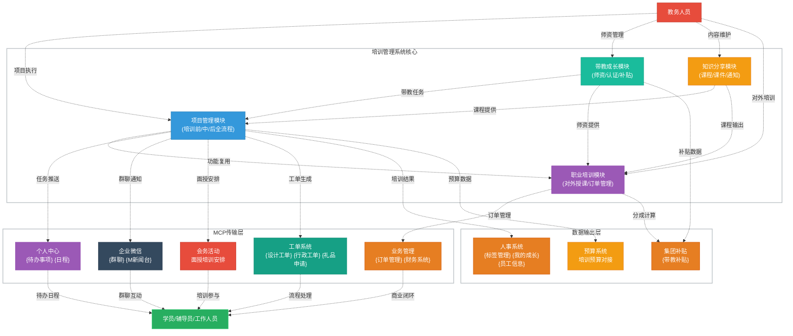
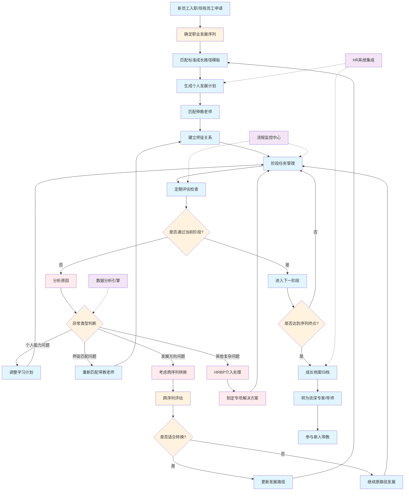
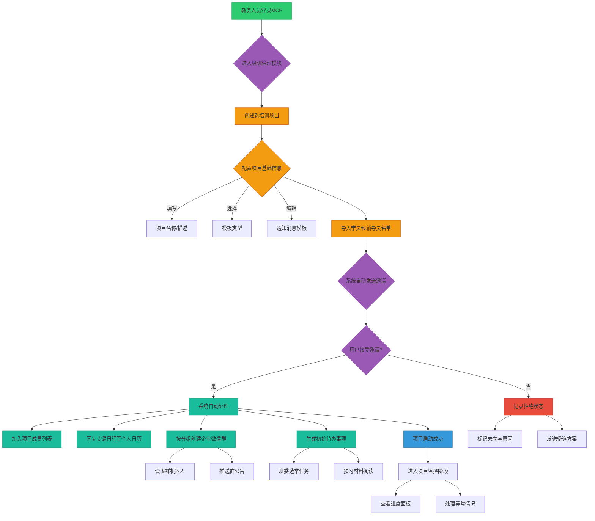
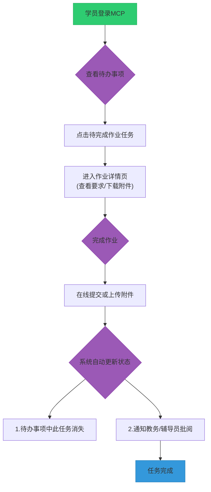
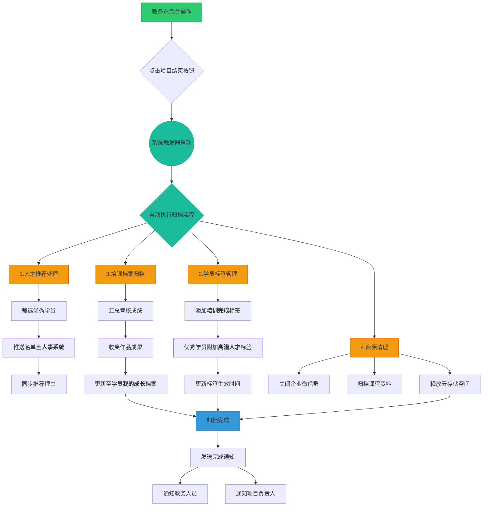
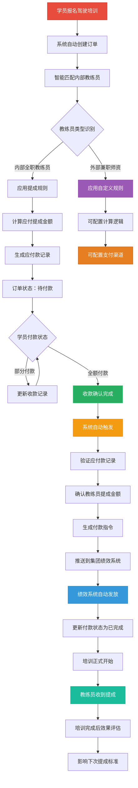

# 演寂书院培训系统产品设计说明书

## 文档说明

- ✅ **教务负责部分**：产品概述、功能设计、业务详细设计
- ❌ **IT负责部分**：技术架构、数据库设计、接口设计、系统集成技术实现、项目管理等

---

## 目录

#### 第一部分：产品概述
- [设计思路](#一设计思路)

#### 第二部分：功能设计
- [需求整理](#二需求整理)
- [功能架构](#三功能架构)
- [业务流程](#四业务流程)

#### 第三部分：详细设计（业务层面）
- [功能详细设计](#五功能详细设计)
- [界面原型设计](#六界面原型设计)
- [业务规则设计](#七业务规则设计)

#### 第四部分：技术实现说明
- [技术需求说明](#八技术需求说明)
- [系统集成需求](#九系统集成需求)
- [开发协作说明](#十开发协作说明)

---

# 第一部分：产品概述

## 一、设计思路

### 1.1 核心设计思路

本章节旨在阐述"培训管理"模块的顶层设计思想，为后续的功能设计提供统一的指导原则和上下文。

### 1.2 核心目标
将现有线下的、手动的培训组织工作，**全面地、自动化地迁移到线上MCP系统中**，以提升效率、沉淀数据、并最终服务于人才发展。

### 1.3 模块化设计理念
培训系统采用**模块化架构设计**，每个功能作为独立的最小单元，支持灵活拼装组合。这一设计理念贯穿整个系统：

- **功能模块独立性**：每个功能模块都可以独立运行，互不干扰
- **灵活组合配置**：教务人员可根据具体培训项目的特点、规模和需求，自由选择启用的功能模块
- **动态界面呈现**：未选择的模块不会出现在操作界面中，保持界面简洁
- **标准化与个性化并重**：既保证了系统的标准化，又提供了充分的灵活性
- **可扩展架构**：新功能模块可以无缝集成到现有体系中

### 1.4 核心用户与核心需求
我们识别出以下几类核心用户，其需求各有侧重：

| 用户角色 | 核心需求 |
| :--- | :--- |
| **教务人员** | **自动化、流程化、数据可视化**的强大后台管理能力。 |
| **学员** | **任务清晰、操作便捷、信息透明**的直观用户体验。 |
| **辅导员** | **随时记录、批量管理、一键导出**的便捷记录与反馈工具。 |
| **讲师** | **方便地上传和管理课件**。 |
| **管理层/HR**| **获取准确、自动推送**的人才数据（标签、成长记录等）。 |

# 第二部分：功能设计

## 二、需求整理

培训系统包括四个模块：培训项目 人才发展 知识分享 职业培训

### 需求总览表

| 主模块 | 子模块 | 功能模块数 | 具体功能模块 | 系统集成点 |
|--------|--------|------------|------------|------------|
| **培训项目** | 培训规划 | 2 | 1.计划 2.项目模板 | {日程}、{待办事项} |
| | 项目配置 | 2 | 3.基本信息 4.请假审批设置 | 各子系统配置 |
| | 培训前阶段 | 10 | **方案相关(5个)：** 5.日程 6.预算 7.资源 8.分工 9.方案 **基础流程(5个)：** 10.对象 11.分组 12.通知 13.组群 14.角色 | {待办事项}、{日程}、企业微信 |
| | 培训中阶段 | 8 | **任务管理(4个)：** 15.面授 16.作业 17.线上课程 18.会务活动 **培训管理(4个)：** 19.带教 20.成绩 21.观察 22.复盘 | {会务活动}、{待办事项} |
| | 培训后阶段 | 6 | **可选功能(2个)：** 23.决算 24.新闻 **必选功能(4个)：** 25.问卷 26.总结 27.推荐 28.证书管理 | {新闻台}、{待办事项} |
| | 项目完成 | 1 | 29.项目结束 | 人事系统、集团补贴 |
| **人才发展** | 职业发展路径 | 2 | 30.个人成长地图 31.技能树管理 | {我的成长} |
| | 继任者计划 | 3 | 32.关键岗位管理 33.人才梯队建设 34.个人发展计划管理 | {HR系统} |
| | 师徒与带教 | 3 | 35.带教项目管理 36.带教模板库 37.师资池 | {集团补贴} |
| | 个人成长档案 | 1 | 38.统一成长档案 | {HR系统}, {培训项目} |
| **知识分享** | 内容管理 | 3 | 39.课程管理 40.课件管理 41.内容分类 | 培训项目线上课程 |
| | 学习体验 | 2 | 42.学习进度追踪 43.互动功能 | {人才发展}-{个人成长档案} |
| | 智能推荐 | 2 | 44.个性化推荐 45.热门内容 | {人才发展}-{个人成长档案} |
| | 通知推送 | 2 | 46.上新通知 47.学习提醒 | 消息推送系统 |
| **职业培训** | 师资管理 | 4 | 48.内部兼职讲师管理 49.内部全职教练员管理 50.师资能力建设 51.外部师资管理 | 带教成长讲师管理、{日程}、内部员工系统 |
| | 订单管理 | 3 | 52.订单模式切换 53.收费管理 54.学员订单关系 | **复用内部培训项目功能**、**{订单管理}**、**{集团绩效}** |
| | 市场管理 | 4 | 55.优惠活动管理 56.转介绍奖励 57.学员关系管理 58.营销数据分析 | **{订单管理}**、**{集团绩效}**、客户关系系统 |
| | 财务对接 | 2 | 59.师资薪酬计算 60.财务系统集成 | **{MCP财务管理}**、{集团补贴}、**{集团绩效}** |
| **合计** | - | **60** | **完整功能模块清单** | **20+个系统集成点** |

### 1. 培训项目

**培训项目模块**整合了培训规划和项目执行两大功能板块，形成完整的项目管理闭环。

#### 1.1 培训规划

**1.1.1 计划管理**

| 功能模块 | 功能点 | 功能描述 | 系统集成 | 前置条件 |
|---------|--------|----------|----------|----------|
| **计划** | 批量导入 | 支持批量导入培训计划 | 无 | 无 |
| | 项目生成 | 根据计划直接生成培训项目 | 可在培训项目中连接计划 | 计划已创建 |
| | 日程推送 | 推送到负责人日程 | 推送到{日程} | 计划已确定 |
| | 统计计算 | 计划完成情况统计自动计算 | 无 | 项目进行中 |
| | 推送通知 | 推送给指定人员 | 默认推送给培训负责人和HRBP | 计划已创建 |

**1.1.2 模板管理**

| 功能模块 | 功能点 | 功能描述 | 系统集成 | 前置条件 |
|---------|--------|----------|----------|----------|
| **项目模板** | 培训类型模板 | 新员工培训、干部培训、在职培训、管培生、三卫、CEO计划等标准类型 | 无 | 无 |
| | 功能配置模板 | 每种类型预设标准功能模块组合 | 如干部入模子：方案全模块+消息+群聊+新闻 | 培训类型已确定 |
| | 内容标准模板 | 日程结构框架、预算科目、资源清单、分工角色、分组规则等 | 可复用内容 | 无 |
| | 智能化功能 | 根据培训对象智能推荐模板 | 支持参数化配置（{培训名称}、{培训天数}等） | 培训对象已确定 |
| | 模板管理 | 模板创建、使用、版本控制和使用统计 | 自动过滤个性化信息（人员、时间、地点） | 无 |
| **资源模板** | 资源分类 | 占用型资源、消耗型资源 | 无 | 无 |
| **消息模板** | 系统基础模板 | 按功能阶段分类（组群通知、角色选举、作业下发等） | 无 | 无 |
| | 培训类型模板 | 针对不同培训类型的话术风格 | 干部培训、新员工培训、技能培训等 | 培训类型已确定 |
| | 项目定制模板 | 继承类型模板并个性化修改 | 支持变量替换（{项目名称}、{学员姓名}等） | 类型模板已选择 |
| **其他模板** | 调研模板 | 调研问卷模板 | 无 | 无 |
| | 评价模板 | 评价表单模板 | 无 | 无 |
| | 新闻模板 | 新闻稿模板 | 无 | 无 |
| | 证书模板 | 各类培训证书模板 | 支持不同培训类型的证书样式 | 无 | 

#### 1.2 项目配置

**1.2.1 基础配置**

| 功能模块 | 功能点 | 功能描述 | 系统集成 | 前置条件 |
|---------|--------|----------|----------|----------|
| **基本信息** | 项目信息 | 项目名称、召开时间、地点等 | 无 | 无 |
| **审批流程设置** | 请假审批设置 | 学员拒绝参训时的请假审批流程 | 选择审批人（直属领导、HRBP等） | 无 |
| | 方案审批设置 | 培训方案的审批流程配置 | 选择审批人（部门负责人、分管领导等） | 启用方案功能时必配 |
| | 审批模板设置 | 自定义审批表单和审批流程模板 | 可配置多级审批、并行审批等 | 无 |

**1.2.2 功能模块选择**

| 功能类别 | 功能模块 | 功能描述 | 系统集成 | 配置说明 |
|---------|---------|----------|----------|----------|
| **并列功能模块** | 消息 | 启用自定义消息模板功能 | 可选择培训类型模板作为基础，进行项目级定制 | 可选 |
| | 群聊 | 启动企业微信群 | 企业微信{群聊} | 可选 |
| | 新闻 | 项目结束后发布新闻 | 推送{新闻台} | 可选 |
| | 方案 | 启用完整的方案规划审批流程 | 包含子模块配置 | 可选 |
| **方案子模块** | 日程 | 培训时间安排和活动规划 | 作为其他模块规划基准 | 需启用方案功能 |
| | 预算 | 费用预算和成本控制 | 对接集团预算系统 | 需启用方案功能 |
| | 资源 | 物料、场地、人员等资源协调 | 连接工单系统 | 需启用方案功能 |
| | 分工 | 工作分配和责任人设定 | 推送{待办事项} | 需启用方案功能 |
| | 决算 | 项目结束后的费用结算 | 自动收集实际开支数据 | 需启用方案功能 |

**配置示例**

| 项目类型 | 启用模块组合 | 适用场景 |
|---------|-------------|----------|
| 简单内部分享 | 群聊 | 小型内部交流活动 |
| 中等培训项目 | 方案（日程+分工）+ 群聊 + 新闻 | 标准培训项目 |
| 大型培训项目 | 方案（全部子模块）+ 消息 + 群聊 + 新闻 | 重要培训项目 |

> **设计理念**：所有功能模块平等可选，方案作为复杂项目的管理工具，内部可灵活配置。教务可根据项目特点自由组合所需功能。

#### 1.3 培训前阶段功能模块

**1.3.1 方案相关功能模块**（需在项目配置中启用方案功能）

| 功能模块 | 功能点 | 功能描述 | 系统集成 | 前置条件 |
|---------|--------|----------|----------|----------|
| **日程** | 制定初步日程 | 设定核心培训日期和高级里程碑，以及每日详细活动安排（面授、展示、讲师等） | 作为预算、资源、分工等模块的规划基准 | 无 |
| | 确认最终日程 | 方案审批通过后，系统将初步日程锁定为最终日程 | 触发工单推送、待办推送等执行任务 | 方案审批通过 |
| | 生成培训中任务 | 根据最终日程自动生成具体的培训中任务（面授、作业等） | 自动创建任务到{待办事项} | 学员确认参训 |
| **预算** | 预算录入 | 录入总数字/明细清单 | 当前：手动录入；未来：对接集团预算系统 | 无 |
| **资源** | 物料设计 | 活动海报等设计需求 | 提交{设计工单} | 无 |
| | 行政服务 | 保洁、司机、酒店预订、餐饮预定等 | 提交{行政工单} | 基于初步日程 |
| | 行政采购 | 具体物料采购，支持分批次 | 连接{行政工单} | 无 |
| | 纪念品 | 纪念品申请 | 连接{礼品申请} | 无 |
| | 打印物料 | 物料清单打印，可选择范围 | 无 | 无 |
| **分工** | 工作分配 | 分项目或分详细工作指定负责人 | 推送到负责人{待办事项} | 基于初步日程 |
| | 任务推送 | 最终日程确认后自动推送任务 | 自动推送到{待办事项} | 最终日程确认 |
| **方案** | 形成初步方案 | 汇总已启用功能模块和基础流程模块的规划结果 | 无 | 相关模块配置完成 |
| | 方案审批与锁定 | 按项目配置的审批流程提交审批，通过后锁定为"最终方案" | 触发管理层执行任务 | 初步方案完成，审批流程已配置 |
| | 培训中任务生成 | 学员确认参训后根据最终日程自动生成培训中任务 | 自动生成到{待办事项} | 学员确认参训 |

**1.3.2 基础流程功能模块**

| 功能模块 | 功能点 | 功能描述 | 系统集成 | 前置条件 |
|---------|--------|----------|----------|----------|
| **对象** | 确定参训学员 | 根据培训模板预设范围筛选或主动选择学员 | 可作为方案的一部分进行审批 | 无 |
| **分组** | 分组设置 | 分组数量/规则设置，每组学员/辅导员设定 | 无 | 已确定培训对象 |
| **通知** | 发送通知 | 向学员发送培训通知 | 自动进入学员{日程} | 已确定培训对象 |
| | 接受确认 | 学员接受培训安排 | 可继续后续流程 | 通知已发送 |
| | 拒绝处理 | 学员拒绝需填写理由 | 如设置请假审批则进入审批流程 | 通知已发送 |
| | 任务下发 | 培训过程中逐步下发具体任务 | 进入学员{待办事项} | 学员已确认参与 |
| **组群** | 小组群创建 | 小组学员/辅导员/教务企业微信群 | 推送"班委选举"到{待办事项} | 学员确认参与 |
| | 学员大群创建 | 所有小组成员、辅导员及教务群 | 企业微信{群聊} | 学员确认参与 |
| | 辅导员群创建 | 辅导员专用群 | 企业微信{群聊} | 学员确认参与 |
| **角色** | 任务下发 | 向小组成员下发"角色选举"任务 | 进入成员{待办事项} | 已建立组群 |
| | 角色填写 | 小组成员填写角色（组长、纪律委员、学习委员等） | 任一成员完成后，该小组所有成员任务标记完成 | 任务已下发 |
| | 结果通知 | 角色确定后一键发送通知 | 推送到大群 | 角色已确定 |  

#### 1.4 培训中阶段功能模块

**1.4.1 任务管理功能模块**

| 功能模块 | 功能点 | 功能描述 | 系统集成 | 前置条件 |
|---------|--------|----------|----------|----------|
| **面授** | 任务发布 | 教务发布面授任务 | 通知讲师上传课件到{待办事项} | 培训中阶段开始 |
| | 课件管理 | 讲师上传课件作为课程附件 | 直接作为课程附件 | 面授任务已发布 |
| | 会务安排 | 填写召开时间等具体信息 | 连接{会务活动}，加入{培训议程} | 课件已准备 |
| **作业** | 任务下发 | 教务下发作业任务 | 自动进入学员{待办事项} | 培训中阶段开始 |
| | 作业提交 | 学员上传作业 | 作为附件/正文，自动标记任务完成 | 作业任务已下发 |
| | 批量管理 | 支持一键下载所有附件 | 无 | 有作业提交 |
| | 消息推送 | 任务下发消息推送到指定组群 | 推送到组群 | 组群已建立 |
| | 现场展示 | 支持现场展示环节 | 连接{会务活动} | 作业任务设置 |
| **线上课程** | 课程分配 | 选择知识分享中的课程/课件 | 自动进入学员{待办事项} | 知识分享模块有内容 |
| **会务活动** | 活动启动 | 包括面授和作业（现场展示） | 启动{会务活动} | 相关任务已设置 |

> **任务下发机制说明**：培训中的所有具体任务（面授、作业、线上课程等）均由教务根据培训进度主动下发，每次下发时自动进入相关人员的 **{待办事项}** 中。任务完成后，对应的 **{待办事项}** 自动更新为已完成状态，确保培训进度的有序推进。

**1.4.2 培训管理功能模块**

| 功能模块 | 功能点 | 功能描述 | 系统集成 | 前置条件 |
|---------|--------|----------|----------|----------|
| **带教** | 阶段设置 | 不同阶段设置不同带教老师和任务 | 支持师徒互评 | 培训中阶段开始 |
| | 全局设置 | 选择带教老师类型（管培生/三卫/CEO计划） | 带教标准，师徒皆可查阅 | 无 |
| **成绩** | 成绩录入 | 根据科目录入各组成绩 | 无 | 有考核任务 |
| | 推送管理 | 支持推送范围选择（各组及辅导员） | 推送本组/所有小组成绩 | 成绩已录入 |
| | 排名功能 | 支持成绩排名 | 无 | 成绩已录入 |
| **观察** | 表现记录 | 辅导员记录学员表现（闪光点/不足） | 无 | 辅导员已分配 |
| | 每日记录 | 支持每日观察记录 | 无 | 培训进行中 |
| | 总记录表 | 支持总观察记录表 | 无 | 有观察记录 |
| | 数据导出 | 支持一键下载观察记录 | 无 | 有观察记录 |
| **复盘** | 报告上传 | 支持上传多个复盘报告 | 默认1个，可增加多个 | 培训阶段完成 |
| | 在线预览 | 支持在线预览复盘报告 | 无 | 报告已上传 |

#### 1.5 培训后阶段功能模块

**1.5.1 可选功能模块**

| 功能模块 | 功能点 | 功能描述 | 系统集成 | 前置条件 |
|---------|--------|----------|----------|----------|
| **决算** | 决算处理 | 有预算则必有决算 | 推送决算单到{待办事项} | 启用了预算功能 |
| | 数据收集 | 工单负责人填写实际开支 | 自动返回决算数据 | 决算单已推送 |
| | 纪念品核算 | 直接获取礼品申请的金额 | 连接{礼品申请} | 有纪念品申请 |
| **新闻** | 新闻编辑 | 调用H5编辑器编辑新闻 | 无 | 启用了新闻功能 |
| | 新闻审批 | 新闻审批流程 | 无 | 新闻已编辑 |
| | 新闻发布 | 推送到新闻台 | 推送{新闻台} | 新闻审批通过 |

**1.5.2 常用功能模块**

| 功能模块 | 功能点 | 功能描述 | 系统集成 | 前置条件 |
|---------|--------|----------|----------|----------|
| **问卷** | 问卷推送 | 推送问卷调查 | 自动进入{待办事项} | 培训后阶段开始 |
| | 模板选择 | 支持各种调研模板选择 | 无 | 无 |
| | 推送范围 | 支持推送范围选择（各组及辅导员） | 无 | 问卷已创建 |
| | 结果导出 | 支持一键下载问卷调查结果 | 无 | 问卷已完成 |
| **总结** | 复盘报告 | 按集团复盘报告格式，支持上传附件 | 无 | 培训已结束 |
| | 精彩瞬间-视频 | 视频上传到知识分享后选择连接 | 连接【知识分享】 | 视频已上传 |
| | 精彩瞬间-照片 | 照片存储并连接，分享到组群 | 分享到组群 | 照片已上传 |
| **推荐** | 辅导员推荐 | 推荐名单（羽林卫、锦衣卫）及推荐原因 | 无 | 辅导员已分配 |
| | 教务管理 | 管理人才推荐，确定最终名单 | 无 | 辅导员已推荐 |
| **证书管理** | 内部培训证书 | 内部培训完成后的证书管理： - 模板选择：从模板管理中选择内部证书模板 - 证书颁发：基于选定模板批量颁发内部培训证书 - 证书查询：内部培训证书下载、补发、记录查询 | 连接模板管理系统，证书状态追踪 | 内部培训项目完成 |
| | 对外培训证书 | 对外培训完成后的证书管理： - 证书类型：结业证书、能力认证证书、企业品牌证书等 - 证书颁发：证书生成、颁发、真伪验证的完整流程 - 证书续期：有时效性证书的续期提醒和管理 | 可对外开放查询接口，使用企业专用证书模板，可对接第三方认证机构 | 对外培训项目完成 |
| | 统一证书管理 | 内部和对外培训证书的统一管理平台： - 证书查询：支持按姓名、证书号、培训类型等多维度查询 - 证书统计：内部/对外证书颁发数量、类型分布统计 - 模板管理：内部和对外证书模板的统一管理 | 共享证书管理系统，支持数据分析和统计报表 | 证书系统已部署 |

#### 1.6 培训完成

| 功能模块 | 功能点 | 功能描述 | 系统集成 | 前置条件 |
|---------|--------|----------|----------|----------|
| **项目结束** | 人才推荐数据推送 | 将最终推荐名单自动推送到人事系统 | 推送到**"人事系统"--"标签"** | 培训后阶段完成 |
| | 培训记录更新 | 更新学员培训完成情况到员工档案 | 更新到**"员工信息"-"培训记录"** | 培训后阶段完成 |
| | 成长档案同步 | 同步培训成果到个人成长档案 | 显示在**"我的成长"模块**：项目名称、完成时间、成绩、小组担任角色 | 培训后阶段完成 |
| | 项目状态更新 | 标记项目为已完成状态 | 项目状态变更，触发归档流程 | 所有数据同步完成 |

### 2. 人才发展（原带教成长）

#### 2.1 我的成长路径 (My Growth Path)

##### 2.1.1 设计理念：从"模糊的预期"到"清晰的成长地图"

**核心问题**：
- 员工经常不知道自己的成长方向和路径
- 管理者缺乏指导员工发展的标准化工具
- 组织缺少系统性的人才发展数据支撑

**设计思路**：
"我的成长路径"就像一个**职业GPS导航系统**，为每位员工提供：
1. **当前位置定位**：我现在在哪里？
2. **目标设定**：我想去哪里？
3. **路径规划**：如何到达目的地？
4. **实时导航**：每一步该做什么？
5. **重新规划**：遇到变化如何调整？

##### 2.1.2 功能详细设计

| 功能模块 | 功能点 | 功能描述 | 数据关联 | 设计亮点 |
|---------|-------|------|---------|---------|
| **成长地图总览** | **职业路径图谱** | 展示集团所有职位的发展路径图，包括： - **纵向晋升路径**：从初级到高级的职级发展线 - **横向发展路径**：跨部门、跨职能的转岗路径 - **专业发展路径**：技术专家、管理专家等专业路线 | {组织架构}、{职位体系} | **可视化职业全景** |
| | **个人定位** | 在路径图谱中标注员工当前位置，包括： - 当前职位标识 - 个人能力雷达图叠加 - 成长阶段标识（新手/熟练/专家/大师） | {员工信息}、{个人成长档案} | **我在哪里一目了然** |
| **个人成长GPS** | **目标设定** | 员工可以设置短期（1年）和长期（3-5年）目标： - **目标职位选择**：从路径图谱中选择心仪职位 - **发展方向确认**：纵向晋升/横向发展/专业深化 - **时间规划**：设定预期达成时间 | - | **让目标更清晰** |
| | **路径推荐** | 系统根据员工当前位置和目标职位，智能推荐： - **最短路径**：最快到达目标的路线 - **稳妥路径**：风险最小的发展路线 - **个性化路径**：结合个人兴趣和能力的定制路线 | {能力模型}、{历史数据} | **AI赋能的路径规划** |
| | **差距分析** | 对比当前能力与目标岗位要求，生成： - **能力差距报告**：缺失的核心技能清单 - **经验差距报告**：需要补充的实践经验 - **资质差距报告**：需要获得的认证和资格 | {能力模型}、{岗位要求} | **精准识别发展重点** |
| **技能树与学习地图** | **技能树展示** | 以游戏化的技能树形式展示： - **已掌握技能**：点亮的技能节点 - **正在学习**：进行中的技能节点 - **待学习技能**：未点亮但可解锁的技能 - **前置技能**：需要先掌握的基础技能 | {培训记录}、{技能评估} | **游戏化的技能展示** |
| | **学习路径规划** | 基于技能树，为员工规划学习路径： - **学习优先级**：根据目标职位要求排序 - **学习资源推荐**：课程、书籍、实践项目 - **学习时间安排**：合理的学习计划时间线 | {培训资源}、{项目库} | **个性化学习导航** |
| **实践发展机会** | **项目机会推荐** | 根据员工发展需求，推荐合适的实践机会： - **内部项目**：跨部门项目、改善项目 - **轮岗机会**：横向发展的轮岗安排 - **导师机会**：担任新人导师的成长机会 | {项目信息}、{轮岗计划} | **在实践中成长** |
| | **挑战任务** | 为员工设计能力提升的挑战任务： - **技能挑战**：针对特定技能的实战任务 - **领导力挑战**：管理类发展任务 - **创新挑战**：鼓励创新思维的任务 | {任务库}、{能力评估} | **在挑战中突破** |
| **进展跟踪** | **成长进度条** | 直观展示向目标迈进的进展： - **整体进度**：距离目标职位的完成度 - **技能进度**：各项技能的掌握程度 - **里程碑标记**：重要成长节点的达成情况 | {学习记录}、{实践记录} | **进步可视化** |
| | **阶段性评估** | 定期评估成长效果： - **季度自评**：员工自我评估成长状况 - **上级评估**：直接上级的发展评估 - **360度评估**：全方位能力评估 | {评估系统}、{360评估} | **多维度成长反馈** |
| **成长支持** | **导师匹配** | 根据员工成长路径，匹配合适的导师： - **技能导师**：特定技能领域的专家 - **职业导师**：目标职位的资深人员 - **生涯导师**：职业发展规划的顾问 | {师资池}、{导师资源} | **个性化成长指导** |
| | **资源推荐** | 智能推荐成长所需的各类资源： - **学习资源**：课程、培训、书籍 - **实践资源**：项目、岗位、实习机会 - **网络资源**：行业专家、同行交流群 | {资源库}、{专家库} | **全方位资源支持** |

#### 2.2 继任者计划 (Succession Planning)

##### 2.2.1 设计理念：如何科学地"选人"与"看人"

"继任者计划"的成功，核心在于两点：**选对人**和**看准人**。本系统旨在将这一过程转化为一套科学、高效、可复制的数字化流程。

##### 2.2.2 功能详细设计

| 功能模块 | 功能点 | 功能描述 | 系统集成 | 前置条件 |
| :--- | :--- | :--- | :--- | :--- |
| **关键岗位管理** | **关键岗位识别** | 授权用户可在系统组织架构图上，为任意岗位手动标记"关键岗位👑" | {组织架构} | 兼具灵活性与自动化潜力 |
| | **岗位风险评估** | 系统从四个维度综合评估岗位风险，并以红黄绿灯进行预警： 1. **离任风险**：评估现任者的离职可能性 2. **储备不足风险**：评估内部人才梯队的厚度 3. **招聘难度风险**：评估从外部获取人才的难度 4. **唯一性风险**：评估该岗位技能的稀缺性 | {绩效系统}、{人才盘点} | 岗位已标记为关键 |
| **人才梯队建设** | **候选人提名** | 管理者可通过两种方式提名： 1. **智能推荐**：系统根据能力匹配推荐候选人 2. **手动搜索**：管理者直接搜索并提名 | {我的成长路径}、{员工标签} | 兼具智能与灵活 |
| | **梯队安排** | 将候选人放入不同梯队： - **第一梯队**：1年内可接任 - **第二梯队**：1-3年内可培养成熟 - **第三梯队**：3-5年长期储备 | - | 清晰定义人才储备周期 |
| | **九宫格人才盘点** | 采用"九宫格人才盘点"工具，对候选人进行可视化评估 | {绩效系统}、{360评估} | **业界最佳实践** |
| **继任者发展** | **个人发展计划生成** | 基于差距分析，为候选人生成个人发展计划 | {我的成长路径} | 候选人已完成评估 |
| | **70%在岗锻炼** | 为候选人指派挑战性任务、项目性工作 | {项目管理系统} | 个人发展计划已生成 |
| | **20%辅导反馈** | 从师资库中推荐合适的导师 | {师徒与带教} | 个人发展计划已生成 |
| | **10%正式学习** | 推荐相关的线上课程或学习资料 | {知识分享} | 个人发展计划已生成 |
| | **发展进度追踪** | 提供可视化仪表盘，展示个人发展计划完成进度 | - | 个人发展计划已锁定 |

#### 2.3 师徒与带教 (Mentorship & Coaching)

##### 2.3.1 设计理念：从"零散的传帮带"到"结构化的赋能网"

本模块将每一对"师徒关系"视为一个特殊类型的、长期的"师徒带教项目"来进行管理，实现结构化、标准化、可追溯、可管理的带教体系。

##### 2.3.2 功能详细设计

| 功能模块 | 功能点 | 功能描述 | 系统集成 | 设计亮点 |
| :--- | :--- | :--- | :--- | :--- |
| **1. 带教模板库** | **岗位带教模板** | 为每个关键岗位建立标准化的带教模板，包含： - **带教任务清单** - **关键里程碑** - **学习资源** | {知识分享} | **将精英的带教经验标准化、产品化** |
| | **模板负责人** | 为每个岗位模板指定一位"模板负责人"，负责持续优化模板 | - | **确保模板的鲜活与实战性** |
| **2. 项目自动化** | **项目实例化** | 当有带教需求时，系统自动： 1. 创建"师徒带教项目" 2. 根据岗位加载对应模板 | {HR系统} | **流程自动化，减少事务性工作** |
| | **指派带教老师** | HR预设+教务调整的灵活指派机制 | {待办事项} | **HR预设+教务调整，确保关系质量** |
| **3. 带教过程管理** | **任务管理** | 师徒共同管理任务列表，支持个性化任务添加 | - | **标准化与个性化相结合** |
| | **成长日志** | 提供私密的成长日志空间，记录沟通要点和反馈 | - | **过程可追溯，成长有沉淀** |
| | **里程碑跟踪** | 清晰展示带教过程中的关键里程碑及达成状态 | - | **可视化管理，进度一目了然** |
| **4. 激励与评估** | **"出师"评估** | 带教周期结束时，系统自动触发"出师"流程 | - | **形成闭环，持续迭代** |
| | **贡献与激励** | 导师贡献量化和认可： - **数据展示**：带教时长、学员数、好评率 - **补贴挂钩**：带教补贴计算发放 - **荣誉体系**："金牌导师"等荣誉表彰 | {集团补贴} | **让导师的付出有回报、有荣誉** |
| **师资池管理** | **师资分类与画像** | 系统化管理不同师资角色，形成360°师资画像 | {个人成长档案} | **让合适的老师更容易被找到** |
| | **智能检索与匹配** | 提供多维度检索和智能匹配推荐功能 | - | **从"人找人"到"系统助人"** |
| **师资认证与统计** | **多通道认证体系** | 为不同类型师资建立线上认证流程 | {培训项目} | **将认证标准流程化、线上化** |
| | **关键数据统计** | 自动化统计带教成效：带教学员数、质量跟踪等 | {HR系统} | **用数据客观评估带教质量** |

#### 2.4 个人成长档案 (Growth Profile)

##### 2.4.1 设计理念：从"静态的履历"到"动态的价值罗盘"

"个人成长档案"旨在成为一个动态的、向前看的"价值罗盘"，它将成为所有成长数据的最终汇集地和展示中心。

##### 2.4.2 功能详细设计

| 功能模块 | 功能点 | 功能描述 | 数据来源 | 设计亮点 |
| :--- | :--- | :--- | :--- | :--- |
| **1. 档案概览** | **个人快照** | 用卡片形式展示核心信息：姓名、岗位、特殊身份标签、能力标签 | {HR系统}、{继任者计划} | **3秒内了解一个人** |
| | **能力雷达图** | 动态生成的能力雷达图，可视化展示员工当前能力状况 | {我的成长}的技能树 | **能力差距一目了然** |
| **2. 成长时间轴** | **关键里程碑** | 以时间轴形式展示职业生涯中的关键事件 | 本模块各功能 | **故事化呈现成长轨迹** |
| **3. 成就陈列室** | **荣誉与徽章** | 集中展示所有电子徽章、证书、公司荣誉 | {培训项目}、{HR系统} | **激励的可视化沉淀** |
| **4. 详细记录** | **培训履历** | 详细列出所有参加过的培训项目 | {培训项目} | **学习经历的完整记录** |
| | **带教履历** | 记录所有师徒带教经历，包括作为导师和学员的经历 | {师徒与带教} | **传承贡献与被培养经历** |
| | **项目与实践** | 记录参与过的重大项目、挑战性任务 | {继任者计划} | **展示实战经验** |
| **5. 综合评估** | **360°反馈** | 汇总展示来自各方的评价与反馈 | {绩效系统}、{师徒与带教} | **提供多维度的客观视角** |
| | **九宫格盘点历史** | 记录员工在历次人才盘点中的位置变化轨迹 | {继任者计划} | **动态看发展，而不仅是看当前** |
| **6. 权限与分享** | **多视角查看** | 支持不同角色查看不同视图 | 权限系统 | **保障数据安全与合理使用** |
| | **档案导出/打印** | 支持导出为精美的PDF格式 | - | **让成长档案产生线下价值** |

### 3. 知识分享

**知识分享内容分类**：入职培训、文化培训、海豹培训、子衿精英、老虎说、虎嗅集、书院开讲、悦读会、M人传

| 功能模块 | 功能点 | 功能描述 | 系统集成 | 前置条件 |
|---------|--------|----------|----------|----------|
| **内容管理** | 课程管理 | 各类培训课程管理，支持视频、音频、图文等多种形式 | 可被培训项目中的线上课程功能选择 | 无 |
| | 课件管理 | 培训课件资源管理，支持PPT、PDF、视频等多格式 | 可被培训项目中的线上课程功能选择 | 无 |
| | 内容分类 | 按业务领域、职级、技能等多维度标签分类管理 | 无 | 有内容资源 |
| **学习体验** | 学习进度追踪 | 记录学习时长、完成度、知识点掌握情况 | {人才发展}-{个人成长档案} | 学员已开始学习 |
| | 互动功能 | 支持评论、问答讨论、学习笔记分享 | 无 | 有学习内容 |
| **智能推荐** | 个性化推荐 | 根据岗位、学习历史推荐相关内容 | {人才发展}-{个人成长档案} | 有用户学习数据 |
| | 热门内容 | 基于观看量、完成率、评价的热门内容排行 | 无 | 有学习数据统计 |
| **通知推送** | 上新通知 | 新课程/课件上线通知 | 无 | 有新内容上线 |
| | 学习提醒 | 基于学习计划的智能学习提醒 | 消息推送系统 | 学员有学习计划 |

### 4. 职业培训

**职业培训模块概述**

职业培训模块面向社会招生，是培训系统对外服务的重要组成部分，与内部培训模块形成有机整合的培训生态系统。

#### 4.1 师资力量来源与分类管理

**师资分类体系设计**

| 师资类型 | 雇佣关系 | 工作性质 | 当前薪酬模式 | 支付渠道 | 未来扩展性 |
|---------|----------|----------|------------|----------|------------|
| **内部兼职讲师** | 内部员工 | 兼职授课 | 按授课时长课时费 | {集团补贴}系统 | 支持薪酬规则调整 |
| **内部全职教练员** | 内部员工 | 全职教学 | 固定薪资+按学员提成 | {集团绩效}系统 | 支持提成规则调整 |
| **外部兼职师资** | 外部合作 | 专项授课 | 灵活配置（未来） | 可配置支付渠道 | 完全可配置模式 |

**4.1.1 内部师资共享机制**

| 功能模块 | 功能点 | 功能描述 | 系统集成 | 前置条件 |
|---------|--------|----------|----------|----------|
| **内部兼职讲师管理** | 讲师认证状态查询 | 查询内部讲师的认证等级和授课能力 | 连接【带教成长】-讲师管理 | 讲师已通过内部认证 |
| | 对外授课资格审批 | 内部讲师申请对外授课的审批流程 | 审批流程设置 | 讲师认证有效 |
| | 授课档期管理 | 管理讲师的内外部授课时间安排 | 连接{日程}系统 | 对外授课资格已获得 |
| **内部全职教练员管理** | 教练员档案管理 | 全职教练员的基础信息和专业资质管理 | 连接内部员工系统 | 教练员已入职 |
| | 专业技能认证 | 教练员的专业技能等级和认证管理 | 支持多种专业领域认证 | 教练员已分配专业 |
| | 学员分配管理 | 教练员与学员的匹配和分配管理 | 自动计算工作负荷和提成基数 | 教练员可用 |
| **师资能力建设** | 对外授课培训 | 针对社会培训特点的师资专项培训 | 可复用内部培训项目功能 | 师资基础资格 |
| | 授课效果评估 | 社会学员对师资的评价反馈 | 影响师资等级和薪酬标准 | 对外授课进行中 |

**4.1.2 外部师资管理机制**（未来扩展）

| 功能模块 | 功能点 | 功能描述 | 系统集成 | 前置条件 |
|---------|--------|----------|----------|----------|
| **外部师资管理** | 师资档案管理 | 外部兼职师资的基础信息、资质认证、等级评定管理 | 独立于内部员工系统，支持证书有效期提醒 | 无 |
| | 师资调度管理 | 师资匹配、排课管理、临时调配的统一调度 | 连接{日程}系统，避免时间冲突 | 师资档案已建立 |
| | 协议管理 | 合作协议签署、续签提醒、协议变更的全生命周期管理 | 提前30天进入教务{待办事项}，记录变更历史 | 师资资质审核通过 |

#### 4.2 订单管理

**4.2.1 订单生成规则引擎**

**三种业务模式对比分析**

| 业务模式 | 付费方式 | 订单粒度 | 收款模式支持 | 财务核算 | 盈亏分析 | 典型场景 |
|---------|----------|----------|------------|----------|----------|----------|
| **个人付费模式** | 学员个人付费 | 一人一单 | 一次性/分阶段 | 单订单独立核算 | 每个订单独立盈亏 | 驾照培训、技能认证 |
| **批量委派模式** | 委派方统一付费 | 一单多人 | 一次性/分阶段 | 项目级统一核算 | 整个项目统一盈亏 | 政府委派培训、企业团训 |
| **班级招生模式** | 按学员收费 | 多单汇总 | 一次性/分阶段 | 班级级汇总核算 | 班级整体盈亏分析 | 自主招生培训班、公开课程 |

**简化订单模式设计**

| 功能模块 | 功能点 | 功能描述 | 系统集成 | 前置条件 |
|---------|--------|----------|----------|----------|
| **默认订单模式** | 个人付费模式（默认） | 系统默认采用个人付费模式，一人一单 | 适用于驾照培训等高频场景，无需配置 | 无 |
| **订单模式切换** | 批量委派模式 | 创建项目时可切换为批量模式，一单多人 | 适用于政府委派等低频场景 | 需要时手动切换 |
| | 班级招生模式 | 创建项目时可切换为班级模式，多单汇总 | 适用于自主招生等班级管理场景 | 需要时手动切换 |

**4.2.2 订单执行管理**

| 功能模块 | 功能点 | 功能描述 | 系统集成 | 前置条件 |
|---------|--------|----------|----------|----------|
| **订单模式切换** | 个人付费模式（默认） | 系统默认采用个人付费模式，一人一单 | 适用于驾照培训等高频场景，无需配置 | 无 |
| | 批量委派模式 | 创建项目时可切换为批量模式，一单多人 | 适用于政府委派等低频场景 | 需要时手动切换 |
| | 班级招生模式 | 创建项目时可切换为班级模式，多单汇总 | 适用于自主招生等班级管理场景 | 需要时手动切换 |
| **收费管理** | 收费标准设置 | 设置不同培训项目的收费标准和优惠政策 | 连接市场管理的优惠活动 | 培训项目已创建 |
| | 收款管理 | 学员缴费、分期付款、退费等收款业务管理 | 对接{MCP财务管理}系统 | 收费标准已设置 |
| | 发票管理 | 发票开具、寄送、记录等发票相关业务 | 通过{MCP财务管理}系统处理 | 收款已确认 |
| **学员订单关系** | 订单生成 | 根据选择的订单模式自动生成相应的订单结构 | **复用内部培训项目管理功能** | 学员报名确认 |
| | 订单状态管理 | 订单从创建到完成的全生命周期状态管理 | 订单状态变更通知相关系统 | 订单已生成 |
| | 学员订单查询 | 学员可查询自己的订单状态、缴费记录、学习进度 | 提供学员自助查询界面 | 订单关系已建立 |

> **设计理念**：职业培训的培训项目执行**完全复用内部培训项目管理功能**，包括培训前/中/后的全流程管理。订单管理只负责商业化相关的订单处理、收费管理和学员订单关系，避免重复开发，确保功能一致性。

#### 4.3 市场管理

**针对学生群体的营销策略**

| 功能模块 | 功能点 | 功能描述 | 系统集成 | 前置条件 |
|---------|--------|----------|----------|----------|
| **优惠活动管理** | 活动策划 | 新生开学季、寒暑假、节假日等时间节点的优惠活动 | 自动应用到订单系统 | 无 |
| | 优惠类型设置 | 早鸟价、团报优惠、学生价、新学员优惠等多种优惠类型 | **如：学生证优惠10%、3人团报每人减200元** | 活动已策划 |
| | 优惠券管理 | 优惠券生成、发放、使用、核销的完整管理 | 支持线上线下核销，防止重复使用 | 优惠活动已设置 |
| | 活动效果分析 | 各类优惠活动的转化率、获客成本、ROI分析 | 连接营销数据分析系统 | 活动已执行 |
| **转介绍奖励** | 奖励规则设置 | 转介绍成功的奖励标准和发放条件 | **如：成功转介绍1人奖励200元，被介绍人优惠100元** | 无 |
| | 介绍关系追踪 | 记录学员之间的介绍关系和转化路径 | 通过推荐码、链接等方式追踪介绍来源 | 奖励规则已设置 |
| | 奖励发放管理 | 转介绍奖励的计算、审核、发放流程 | 推送到{集团绩效}系统或现金奖励 | 转介绍成功确认 |
| | 防刷机制 | 防止虚假转介绍的风控机制 | **身份验证、支付验证、培训参与验证** | 奖励发放前 |
| **学员关系管理** | 学员档案管理 | 外部学员的完整档案信息管理 | **学校、专业、联系方式、学习偏好、消费能力等** | 学员首次接触 |
| | 学员标签体系 | 按学员特征建立标签分类体系 | **在校生、毕业生、价格敏感、品质优先、时间灵活等** | 学员档案已建立 |
| | 精准营销推送 | 基于学员标签的个性化营销内容推送 | **在校生推送学生优惠，时间灵活者推送周末班** | 学员标签已建立 |
| | 学员生命周期管理 | 从潜在客户到老学员的全生命周期管理 | **潜客→试听→报名→学习→结业→复购→转介绍** | 学员关系建立 |
| **营销数据分析** | 获客渠道分析 | 分析不同获客渠道的效果和成本 | **线上广告、线下推广、转介绍、自然流量等渠道ROI** | 有营销数据 |
| | 学员画像分析 | 基于大数据的学员特征和行为分析 | **年龄分布、消费能力、学习偏好、转化路径分析** | 有足够数据样本 |
| | 营销效果监控 | 实时监控各项营销指标和转化漏斗 | **曝光→点击→咨询→试听→报名的转化率分析** | 营销活动进行中 |
| | 竞品分析 | 竞争对手的价格、活动、服务对比分析 | 为定价和营销策略提供参考 | 有竞品数据收集 |

#### 4.4 财务对接

**与集团MCP财务系统深度集成**

| 功能模块 | 功能点 | 功能描述 | 系统集成 | 前置条件 |
|---------|--------|----------|----------|----------|
| **师资薪酬计算** | 薪酬规则配置 | **内部兼职讲师**：按课时费标准 **内部全职教练员**：按学员提成 **外部师资**：按协议计算 | 计算结果推送到{MCP财务管理}系统 | 师资协议已确定 |
| | 自动计算触发 | 根据培训完成情况和收款状态自动计算师资薪酬 | 收款确认后自动触发薪酬计算并推送 | 有业务数据 |
| | 分成数据生成 | 生成师资分成明细数据 | 推送到{集团补贴}和{集团绩效}系统 | 薪酬计算完成 |
| **财务系统集成** | 订单数据同步 | 培训订单信息自动同步到MCP财务系统 | 直接对接**{MCP财务管理}**模块 | 订单已创建 |
| | 收付款状态同步 | 实时同步收款和付款状态 | 双向数据同步，状态实时更新 | 集成接口已建立 |
| | 财务报表获取 | 从MCP财务系统获取职业培训相关财务报表 | 复用MCP系统的报表和分析功能 | 有财务数据 |

> **设计理念**：充分利用集团MCP系统的**{财务管理}**模块，培训系统只负责业务逻辑和薪酬计算，所有收款、付款、应收应付、发票管理等标准财务功能都通过系统集成实现，避免重复开发，确保数据一致性。

---

## 三、功能架构

*（此部分将详细描述系统的功能模块架构、模块间关系、数据流向等）*

## 四、业务流程

### 功能流程图
#### 1. "培训系统"功能总览流程图

此图展示了培训管理系统的三个核心模块如何相互协作，并与MCP生态系统进行深度集成，构成一个完整的培训管理闭环。优化后的架构将培训规划整合到项目管理模块中，形成更清晰的业务逻辑层次。

#### 2. 培训管理详细功能流程图 (培训管理模块内部)

```mermaid
graph TD;
    %% 项目启动层
    Start[教务创建培训项目] --> Config[项目配置阶段]
    Config --> BasicInfo[基本信息设置]
    Config --> ApprovalSetup[审批流程设置]
    Config --> SelectTemplate[选择项目模板<br/>（含各类模板：项目、资源、消息、证书等）]
    Config --> ModuleSelection[功能模块选择<br/>（含消息模板配置）]
    
    BasicInfo --> PreStart[进入培训前阶段]
    ApprovalSetup --> PreStart
    SelectTemplate --> PreStart
    ModuleSelection --> PreStart
    
    %% 培训前阶段
    subgraph PrePhase["🔸 培训前阶段"]
        direction TB
        
        PreStart --> ModeDecision{是否启用方案功能?}
        
        %% 核心必选流程与方案子模块并行布局
        ModeDecision --> PD_Selection[🎯 对象] --> PD_Grouping[🏘 分组]
        ModeDecision -.->|如启用方案| PD_Schedule[🗓️ 日程]
        ModeDecision -.->|如启用方案| PD_Budget[💰 预算]
        ModeDecision -.->|如启用方案| PD_Resource[📦 资源]
        ModeDecision -.->|如启用方案| PD_Division[👥 分工]
        
        %% 方案汇总（多输入单输出）
        PD_Schedule -.-> PD_Proposal[📋 汇总形成完整方案]
        PD_Budget -.-> PD_Proposal
        PD_Resource -.-> PD_Proposal
        PD_Division -.-> PD_Proposal
        PD_Grouping -.->|方案模式| PD_Proposal
        
        %% 执行路径分支与汇合
        PD_Proposal -.-> ProposalApproval{📋 方案审批<br/>（按配置的审批流程）}
        ProposalApproval -.->|审批通过| ExecutionStart[开始执行阶段]
        ProposalApproval -.->|审批拒绝| ProposalRevision[📝 修改方案]
        ProposalRevision -.-> PD_Proposal
        PD_Grouping -->|直接模式| ExecutionStart
        
        %% 方案审批后的自动化任务（不包括培训中任务）
        ExecutionStart -.->|如有方案子模块| PE_AutoTasks[触发自动化任务]
        PE_AutoTasks -.->|如启用分工| PE_Todo[--> 推送待办]
        PE_AutoTasks -.->|如启用资源| PE_WorkOrder[--> 推送工单]
        
        %% 通知发送
        ExecutionStart --> Notification[📢 通知发送<br/>（如启用消息：使用自定义模板）]
        
        %% 人员管理流程链式连接
        Notification --> StudentAccept{学员接受确认}
        StudentAccept -->|接受| GroupSetup[💬 组群设置<br/>（如启用群聊：创建企业微信群）]
        StudentAccept -->|拒绝| RejectReason[📝 填写拒绝理由]
        RejectReason --> LeaveCheck{是否设置了请假审批？}
        LeaveCheck -->|是| LeaveApproval[📋 提交请假审批<br/>（按配置的审批流程）]
        LeaveCheck -->|否| RejectRecord[记录拒绝状态]
        LeaveApproval --> ApprovalResult{审批结果}
        ApprovalResult -->|通过| GroupSetup
        ApprovalResult -->|拒绝| RejectRecord
        RejectRecord --> PreComplete
        
        GroupSetup --> AddToSchedule[📅 加入学员日程] --> RoleAssignTask[👑 下发角色选举任务<br/>（进入小组成员待办事项）] --> PreComplete[培训前准备完成]
        
    end
    
    %% 培训中阶段
    PreComplete --> DuringStart[进入培训中阶段]
    
    subgraph DuringPhase["🔸 培训中阶段"]
        direction TB
        
        %% 日程驱动培训中任务
        PD_Schedule --> TaskManagementCategory
        
        DuringStart --> TaskManagementCategory[📚 任务管理类功能]
        DuringStart --> TrainingManagementCategory[🎯 培训管理类功能]
        
        %% 任务管理类功能模块
        TaskManagementCategory --> FaceToFace[面授任务:<br/>（可由日程自动生成）<br/>通知讲师上传课件<br/>安排会务活动]
        TaskManagementCategory --> Assignment[作业任务:<br/>（展示环节可由日程生成）<br/>作业下发→学员提交<br/>支持批量下载<br/>现场展示安排]
        TaskManagementCategory --> OnlineCourse[线上课程:<br/>选择知识分享课程<br/>分配给学员]
        TaskManagementCategory --> MeetingActivity[会务活动:<br/>包括面授和作业（现场展示）<br/>启动会务活动系统]
        
        %% 培训管理类功能模块
        TrainingManagementCategory --> TutorManagement[带教管理:<br/>阶段设置+全局设置<br/>不同阶段带教老师<br/>师徒互评+带教标准]
        TrainingManagementCategory --> ScoreManagement[成绩管理:<br/>按科目录入成绩<br/>成绩排名<br/>推送给相关人员]
        TrainingManagementCategory --> ObserveManagement[观察管理:<br/>每日观察记录<br/>总观察记录<br/>一键下载记录]
        TrainingManagementCategory --> ReviewManagement[复盘管理:<br/>多个复盘报告<br/>在线预览]
        
        FaceToFace --> DuringComplete[培训中阶段完成]
        Assignment --> DuringComplete
        OnlineCourse --> DuringComplete
        MeetingActivity --> DuringComplete
        TutorManagement --> DuringComplete
        ScoreManagement --> DuringComplete
        ObserveManagement --> DuringComplete
        ReviewManagement --> DuringComplete
    end
    
    %% 培训后阶段
    DuringComplete --> PostStart[进入培训后阶段]
    
    subgraph PostPhase["🔸 培训后阶段"]
        direction TB
        PostStart --> OptionalModules[🔧 可选功能模块]
        PostStart --> CommonModules[📋 常用功能模块]
        
        %% 可选功能模块
        OptionalModules -.->|如启用决算| Settlement[💰 决算]
        OptionalModules -.->|如启用新闻| NewsModule[📰 新闻]
        
        Settlement -.-> SettlementFlow[推送决算单给负责人<br/>填写实际开支<br/>获取礼品申请金额]
        NewsModule -.-> NewsFlow[H5编辑器编辑新闻<br/>新闻审批流程<br/>推送到新闻台]
        
        %% 常用功能模块（项目必选）
        CommonModules --> Survey[📝 问卷]
        CommonModules --> ProjectSummary[📑 总结]
        CommonModules --> TalentRecommend[🌟 推荐]
        CommonModules --> Certificate[🏆 证书]
        
        Survey --> SurveyFlow[选择调研模板<br/>推送到待办事项<br/>一键下载结果]
        ProjectSummary --> SummaryFlow[复盘报告<br/>精彩瞬间<br/>视频照片分享]
        TalentRecommend --> RecommendFlow[辅导员推荐名单<br/>教务确定最终名单]
        Certificate --> CertFlow[选择证书模板<br/>批量颁发证书<br/>证书管理服务]
        
        SettlementFlow -.-> PostComplete[培训后阶段完成]
        NewsFlow -.-> PostComplete
        SurveyFlow --> PostComplete
        SummaryFlow --> PostComplete
        RecommendFlow --> PostComplete
        CertFlow --> PostComplete
    end
    
    %% 项目完成层
    PostComplete --> ProjectEnd[项目结束]
    ProjectEnd --> AutoTrigger[🔄 系统自动触发]
    
    AutoTrigger --> HRPush[推送人才名单到“人事系统”--“标签”]
    AutoTrigger --> TrainingUpdate[更新“员工信息”-“培训记录”]
    AutoTrigger --> GrowthUpdate[同步到“我的成长”模块]
    
    HRPush --> FinalComplete[✅ 项目完成归档]
    TrainingUpdate --> FinalComplete
    GrowthUpdate --> FinalComplete
    
    %% 样式设置
    style Start fill:#e74c3c,stroke:#c0392b,color:#fff
    style FinalComplete fill:#27ae60,stroke:#2ecc71,color:#fff
    style AutoTrigger fill:#1abc9c,stroke:#16a085,color:#fff
    
    %% 阶段样式
    style PrePhase fill:transparent,stroke:#3498db,stroke-width:3px
    style DuringPhase fill:transparent,stroke:#f39c12,stroke-width:3px  
    style PostPhase fill:transparent,stroke:#9b59b6,stroke-width:3px
    
       
    %% 关键节点样式
    style PreComplete fill:#3498db,stroke:#2980b9,color:#fff
    style DuringComplete fill:#f39c12,stroke:#e67e22,color:#fff
    style PostComplete fill:#9b59b6,stroke:#8e44ad,color:#fff
    style ProjectEnd fill:#34495e,stroke:#2c3e50,color:#fff
    
    %% 分类样式
    classDef optional fill:#ecf0f1,stroke:#95a5a6,color:#2c3e50
    classDef required fill:#2c3e50,stroke:#34495e,color:#fff
    classDef process fill:#ffffff,stroke:#bdc3c7,color:#2c3e50
    classDef decision fill:#f8f9fa,stroke:#6c757d,color:#495057
    classDef automation fill:#ff9500,stroke:#e67e22,color:#fff
    classDef approval fill:#ff69b4,stroke:#e91e63,color:#fff
    
    class PD_Schedule,PD_Budget,PD_Resource,PD_Division,Settlement,NewsModule,OptionalModules optional
    class PD_Selection,PD_Grouping,Notification,GroupSetup,Survey,ProjectSummary,TalentRecommend,Certificate,CommonModules required
    class ExecutionStart,PE_Todo,PE_WorkOrder,PD_Proposal,AddToSchedule,RoleAssignTask process
    class ModeDecision,LeaveCheck decision
    class PE_AutoTasks automation
    class ProposalApproval,StudentAccept,ApprovalResult approval
    class RejectReason,LeaveApproval,RejectRecord,ProposalRevision process
    class TaskManagementCategory,TrainingManagementCategory required
    class FaceToFace,Assignment,OnlineCourse,MeetingActivity,TutorManagement,ScoreManagement,ObserveManagement,ReviewManagement process
    class SettlementFlow,NewsFlow,SurveyFlow,SummaryFlow,RecommendFlow,CertFlow process
```

**模块化架构体现**：
1. **配置与执行分离**：项目配置时选择功能模块，执行时在相应步骤中体现
2. **分层模块设计**：
   - 顶层功能选择：消息、群聊、新闻、方案等并列功能模块
   - 子模块配置：方案下的日程、预算、资源、分工、决算等子模块
   - 基础流程模块：对象、分组、通知、组群、角色等核心流程模块
3. **灵活组合机制**：各阶段功能模块支持任意组合，未启用模块不显示
4. **模块间协作**：配置的功能在对应的执行步骤中自动体现（如群聊→组群步骤）
5. **统一数据流**：所有模块共享统一的项目数据和状态管理

#### 3. 带教成长模块标准化流程设计

基于现有的培训项目中"带教"功能，将其扩展为覆盖整个职业发展生命周期的长期带教成长体系。设计重点以**标准化流程管理**为基础，逐步构建完整的带教成长生态。

#### 3.1 带教成长详细功能流程图

### 角色视角业务流程图

为了更直观地展示系统如何运作，以下为三个核心业务场景的可视化流程图。

#### 流程一：创建并启动新培训项目 (教务视角)

#### 流程二：学员完成作业任务 (学员视角)

#### 流程三：项目结束与数据归档 (系统视角)

**内部全职教练员自动化支付详细流程**：

#### 3.2 标准化流程管理的三阶段实施方案

**第一阶段：标准化流程基础建设**

1. **成长路径模板引擎**
   - 标准模板库：为管理序列、专业序列、技术序列建立标准发展路径模板
   - 阶段里程碑：明确每个阶段的能力要求、学习目标、考核标准
   - 任务清单：标准化各阶段的学习任务和实践要求
   - 跨序列转换：支持技术转管理等发展路径调整

2. **师徒关系管理系统**
   - 带教老师资源池：建立师资档案，记录专业领域、带教经验、评价等级
   - 匹配规则引擎：基于专业匹配、性格匹配、时间匹配等维度的标准化匹配
   - 关系生命周期管理：从建立到结束的全流程管理
   - 师资认证体系：与现有"书院认证带教老师"体系整合

3. **过程管控机制**
   - 进度跟踪仪表板：可视化展示每个学员的发展进度
   - 预警机制：自动识别进度异常、长期无互动等风险信号
   - 标准化评估流程：定期评估的标准化流程和评估工具
   - HRBP介入机制：异常情况的升级处理流程

**第二阶段：智能化功能增强**（后续扩展）

1. **智能匹配算法**：基于大数据分析的师徒智能匹配
2. **个性化推荐**：根据学员特点推荐个性化学习路径
3. **预测分析**：基于历史数据预测成长风险和成功概率

**第三阶段：生态化体系完善**（后续扩展）

1. **多维度评估体系**：360度评价系统+数字化能力档案
2. **激励补贴优化**：与现有补贴系统深度集成，自动化计算和发放
3. **知识分享整合**：与知识分享模块深度整合，构建学习生态

#### 3.3 关键设计亮点

1. **标准化+个性化并重**：既有标准流程保证质量，又支持个性化发展路径
2. **全生命周期管理**：从入职到成为导师的完整闭环
3. **智能预警体系**：主动发现问题，及时干预调整
4. **深度系统集成**：与现有MCP系统、HR系统无缝对接
5. **可扩展架构**：支持后续功能模块的平滑升级

#### 说明
【人事系统】 **标签管理**：需要根据三卫管理办法确认规则（大小名单的INPUT和OUTPUT规则）；只显示绿色标签（即已获得的标签）

---

# 第三部分：详细设计（业务层面）

## 五、功能详细设计

### 5.1 培训项目模块详细设计

#### 5.1.1 培训规划功能详细设计
*（每个功能的具体操作流程、字段定义、业务规则等）*

**计划管理功能详细设计**
- 功能入口：培训项目 → 培训规划 → 计划
- 操作流程：创建计划 → 填写基本信息 → 设置时间节点 → 保存发布
- 界面字段：计划名称、负责人、开始时间、结束时间、参与人数、预算范围等
- 业务规则：计划创建后可生成项目、可推送日程、支持批量导入

**项目模板功能详细设计**
- 功能入口：培训项目 → 培训规划 → 项目模板
- 操作流程：选择模板类型 → 配置模板参数 → 预览模板内容 → 保存模板
- 模板类型：新员工培训、干部培训、管培生、三卫培训、CEO计划等
- 业务规则：模板支持参数化配置、智能推荐、版本控制

#### 5.1.2 项目配置功能详细设计
*（详细的配置流程、配置项说明、配置逻辑等）*

#### 5.1.3 培训前阶段功能详细设计
*（每个功能模块的详细操作步骤、界面设计、业务逻辑等）*

#### 5.1.4 培训中阶段功能详细设计
*（任务管理、培训管理各功能的详细设计）*

#### 5.1.5 培训后阶段功能详细设计
*（项目收尾各功能的详细操作流程）*

### 5.2 带教成长模块详细设计
*（师资管理、成长管理等功能的详细设计）*

### 5.3 知识分享模块详细设计
*（课程管理、课件管理等功能的详细设计）*

## 六、界面原型设计

### 6.1 界面设计原则
- **用户体验优先**：界面简洁直观，操作流程清晰
- **角色导向设计**：不同角色看到不同的界面和功能
- **移动端适配**：支持手机端操作，特别是学员端功能
- **一致性设计**：保持与MCP系统整体风格一致

### 6.2 核心界面原型设计

#### 6.2.1 教务管理界面
**培训项目管理主界面**
- 界面布局：左侧菜单导航 + 右侧内容区域
- 主要功能区：项目列表、快速创建、统计看板、待办提醒
- 操作流程：项目列表 → 选择项目 → 进入项目详情 → 各阶段功能操作

**项目配置界面**
- 界面结构：向导式配置流程，分步骤完成
- 配置步骤：基本信息 → 功能模块选择 → 参数配置 → 预览确认
- 交互设计：实时预览、智能推荐、配置保存

#### 6.2.2 学员操作界面
**个人培训中心**
- 界面布局：卡片式设计，展示当前培训项目
- 功能区域：我的培训、待办任务、成长档案、消息通知
- 移动端优化：大按钮设计、简化操作流程

**任务管理界面**
- 任务列表：待完成任务、已完成任务、逾期任务
- 任务详情：任务描述、完成要求、提交方式、截止时间
- 操作功能：任务提交、进度更新、消息反馈

#### 6.2.3 辅导员界面
**带教管理界面**
- 功能模块：学员管理、观察记录、评价反馈、数据统计
- 操作便捷性：批量操作、快速记录、一键导出
- 数据可视化：学员进度图表、评价趋势分析

### 6.3 界面交互设计
*（具体的交互逻辑、状态变化、提示信息等）*

## 七、业务规则设计

### 7.1 权限控制规则
**角色权限矩阵**
- 教务人员：全部功能的管理权限
- 学员：个人相关功能的操作权限
- 辅导员：负责小组的管理权限
- 讲师：课程相关的管理权限
- 管理层：查看统计数据的权限

### 7.2 业务流程规则
**培训项目状态流转规则**
- 草稿 → 配置中 → 培训前 → 培训中 → 培训后 → 已完成
- 状态变更条件：每个状态的进入条件和完成标准
- 异常处理：状态回退、异常终止的处理规则

### 7.3 数据验证规则
**输入验证规则**
- 必填字段验证
- 数据格式验证（日期、邮箱、手机号等）
- 业务逻辑验证（时间先后顺序、人员重复等）

### 7.4 自动化规则
**系统自动触发规则**
- 消息推送规则：何时推送、推送给谁、推送内容
- 数据同步规则：与其他系统的数据同步时机和规则
- 任务生成规则：自动生成任务的条件和规则

---

# 第四部分：技术实现说明

## 八、技术需求说明

### 8.1 对IT开发人员的技术需求

**系统性能要求**
- 支持并发用户数：预计同时在线用户500+
- 响应时间要求：页面加载时间 < 3秒
- 数据存储要求：支持大量培训数据和文件存储

**技术实现重点**
- 移动端适配：需要良好的手机端用户体验
- 文件处理：支持各种格式的课件和作业文件上传下载
- 消息推送：与企业微信的消息推送集成
- 数据导出：支持Excel等格式的数据导出功能

### 8.2 数据结构需求说明

**核心数据实体**（需要IT人员设计具体的数据库表结构）
- 培训项目：项目基本信息、配置信息、状态信息
- 参训人员：人员信息、参训状态、成绩记录
- 培训任务：任务信息、完成状态、提交内容
- 师资信息：讲师信息、课程关联、评价反馈
- **统一订单表**：订单基础信息、客户信息、应收应付信息、绩效信息

**订单数据结构设计要点**
- **统一表结构**：所有订单类型使用同一张订单表
- **订单类型字段**：通过订单类型字段区分个人/批量/班级订单
- **灵活字段设计**：客户信息、学员列表等字段支持不同粒度的数据存储
- **统一业务逻辑**：应收应付、状态管理等使用相同的处理逻辑

**数据关系说明**
- 一个培训项目可以包含多个订单（班级招生模式）
- 一个订单可以关联多个学员（批量委派模式）
- 一个订单对应一套应收应付信息
- 订单与师资信息关联，支持绩效计算
- 数据需要支持历史追踪和版本管理

## 九、系统集成需求

> **集成重要性说明**：与MCP现有模块、人事系统以及企业微信的深度API对接是培训系统体验提升的关键。无缝的系统集成能够实现数据自动流转，减少重复操作，提升用户体验。

### 9.1 与MCP系统集成需求

#### 9.1.1 用户认证集成
- 使用MCP统一登录，无需单独注册
- 用户权限与MCP角色体系对接

#### 9.1.2 员工自助模块集成

**{待办事项}集成**
- 培训任务自动推送到个人待办
- 记录员工需要完成的培训相关事项
- 支持任务状态同步和完成标记

**{日程}集成**
- 培训安排自动同步到个人日程
- 记录员工的培训计划安排
- 支持日程冲突检测和提醒

**{会务活动}集成**
- 面授培训与会务系统对接
- 需要面授的培训项目自动创建会务活动
- 支持会议室预订和参会人员管理

**{员工自助}工单系统集成**
- {设计工单}：培训物料设计需求提交
- {行政工单}：酒店预订、餐饮预定、保洁服务等
- {礼品申请}：培训纪念品申请流程

### 9.2 与人事系统集成需求

#### 9.2.1 人事管理模块集成

**{标签}管理集成**
- 培训对象是否纳入特殊培训项目标记（羽林卫/锦衣卫/CEO计划等）
- 培训对象参加完成的项目记录
- 在人事管理"员工信息"-"标签管理"中呈现培训相关标签

**{我的成长}模块集成**
- 同步员工完成的培训项目信息
- 显示项目的具体信息：完成时间、成绩、荣誉、担当角色
- 构建完整的员工成长档案

**{集团补贴}模块集成**
- 带教老师补贴自动推送到"带教补贴"字段
- 支持补贴标准配置和自动计算
- 补贴发放记录和统计

#### 9.2.2 数据同步需求
- 员工基础信息实时同步
- 培训完成信息推送到"员工信息"-"培训记录"
- 人才推荐数据推送到"人事系统"-"标签"
- 成长档案数据双向同步

### 9.3 与企业微信集成需求

#### 9.3.1 群聊管理集成

**{群聊}功能集成**
- 自动创建培训相关群聊（小组群、学员大群、辅导员群）
- 群成员自动管理和维护
- 支持群聊权限控制和管理

#### 9.3.2 消息推送集成

**培训消息推送**
- 培训通知自动推送
- 任务提醒和截止日期提醒
- 培训进度和状态更新通知

**{新闻台}集成**
- 培训新闻稿自动发布到{新闻台}
- 支持新闻模板和格式化发布
- 培训成果和亮点宣传

### 9.4 与监管银行系统集成需求

#### 9.4.1 政府监管模式支持

**分阶段收款集成**
- 与政府指定监管银行API对接
- 支持分阶段扣款指令发送
- 实时同步扣款状态和结果

**培训进度同步**
- 培训阶段完成自动触发收款
- 考试通过状态与收款阶段关联
- 异常情况的处理和重试机制

#### 9.4.2 合规性管理集成

**监管数据报送**
- 按监管要求生成培训进度报表
- 收款记录的完整性和可追溯性
- 学员投诉和纠纷的记录管理

**风险控制机制**
- 培训进度异常的预警提醒
- 收款失败的异常处理流程
- 监管合规性的自动检查

### 9.5 职业培训模块专项集成需求

#### 9.5.1 与其他培训模块的内部集成

**与带教成长模块集成**
- **师资共享**：内部讲师认证数据为职业培训提供师资来源
- **能力验证**：带教成长模块的师资认证体系支撑对外授课资格审批
- **经验积累**：内部带教经验转化为对外培训的师资优势

**与培训项目模块集成**
- **功能复用**：项目管理、任务管理、进度跟踪等核心功能可复用于职业培训
- **模板共享**：培训模板、消息模板、证书模板等资源共享
- **流程标准化**：统一的培训管理流程和标准

**与知识分享模块集成**
- **内容转化**：内部沉淀的课程内容可转化为对外培训产品
- **课程管理**：共享课程管理系统和课件资源库
- **知识输出**：形成内部培养→对外服务的知识传递闭环

#### 9.5.2 与MCP业务管理系统的深度集成

**{订单管理}系统集成**
- **订单全生命周期管理**：从订单创建到完成结算的完整流程管理
- **业务流承载**：订单状态流转、审批流程、异常处理
- **资金流管理**：应收应付、收款确认、分阶段收款
- **数据流整合**：订单数据、学员数据、师资数据的统一管理

**财务系统集成**
- **应收应付管理**：自动生成应收应付记录，支持分阶段收款
- **发票开具**：培训费用发票的自动化开具和管理
- **成本核算**：师资成本、场地成本、材料成本的自动核算
- **收入确认**：按会计准则进行收入确认和财务报表生成

**{集团补贴}系统集成**
- **内部兼职讲师分成**：按授课时长自动计算课时费
- **补贴审批流程**：内部讲师对外授课的补贴审批和发放
- **转介绍奖励发放**：学员转介绍成功的奖励自动计算和发放

**{集团绩效}系统集成**
- **内部全职教练员薪酬**：固定薪资+按学员提成的自动计算和发放
- **绩效考核数据**：师资教学效果、学员满意度等绩效数据同步
- **激励机制执行**：基于绩效的奖励和激励措施自动执行

**客户关系系统集成**
- **学员档案管理**：外部学员的完整档案信息管理
- **营销活动执行**：优惠活动、转介绍活动的执行和效果跟踪
- **客户标签体系**：学员分类标签、营销标签的统一管理

#### 9.5.3 审批流程系统集成

**订单审批集成**
- **价格调整审批**：特殊价格、优惠政策的审批流程
- **退费审批**：学员退费申请的审批和处理流程
- **订单变更审批**：订单信息变更的审批机制

**师资管理审批集成**
- **内部讲师对外授课审批**：内部员工对外授课的资格审批
- **师资分成发放审批**：内部兼职讲师课时费的审批和发放
- **外部师资协议审批**：外部师资合作协议的审批流程

**财务相关审批集成**
- **大额收款审批**：超过一定金额的收款确认审批
- **成本支出审批**：师资费用、场地费用等成本支出的审批
- **财务调整审批**：财务数据调整和修正的审批流程

## 十、开发协作说明

### 10.1 开发阶段协作

**需求确认阶段**
- 教务提供：功能需求、业务流程、界面原型
- IT确认：技术可行性、开发工作量、技术方案

**开发过程协作**
- 定期沟通：每周进度同步，及时解决业务疑问
- 原型确认：关键界面和流程的原型确认
- 测试配合：业务场景测试和用户体验测试

### 10.2 技术文档分工

**教务负责文档**
- ✅ 功能需求文档（本文档）
- ✅ 业务流程文档
- ✅ 界面原型文档
- ✅ 用户操作手册

**IT负责文档**
- ❌ 技术架构设计文档
- ❌ 数据库设计文档
- ❌ 接口设计文档
- ❌ 部署运维文档

### 10.3 项目里程碑

**关键节点**（具体时间由双方协商确定）
1. 需求确认完成
2. 技术方案确认完成
3. 核心功能开发完成
4. 系统集成测试完成
5. 用户验收测试完成
6. 正式上线

**验收标准**
- 功能完整性：所有功能模块按需求实现
- 用户体验：界面友好，操作流畅
- 系统集成：与其他系统正常对接
- 性能稳定：系统运行稳定，响应及时