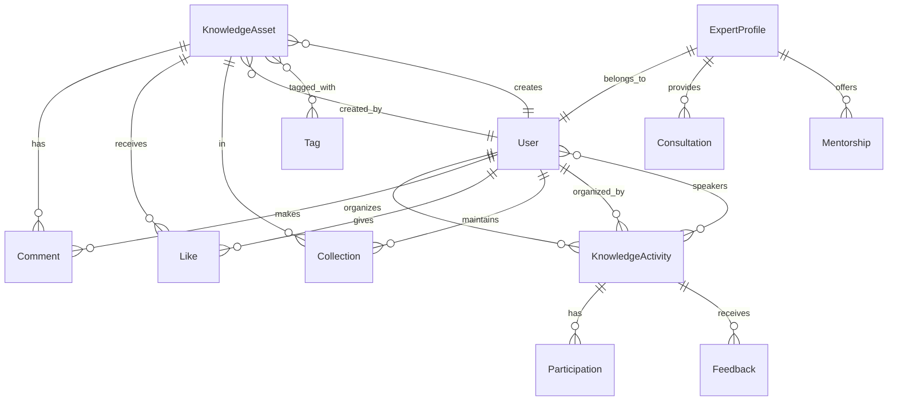

# 知识分享前端设计方案

## 目录

- [1. The "Why": 核心设计哲学](#1-the-why-核心设计哲学)
  - [1.1 第一性原理：拆解知识分享到最小颗粒 (WHAT)](#11-第一性原理拆解知识分享到最小颗粒-what)
  - [1.2 单一数据源：管理知识资产的唯一来源 (WHERE)](#12-单一数据源管理知识资产的唯一来源-where)
  - [1.3 界面驱动开发 (UI-Driven)](#13-界面驱动开发-ui-driven)
- [2. The "What & How": 核心模型与实现](#2-the-what--how-核心模型与实现)
  - [2.1 视图层：界面展示与交互](#21-视图层界面展示与交互)
  - [2.2 数据层：状态管理与数据流转](#22-数据层状态管理与数据流转)
  - [2.3 逻辑层：业务处理与集成](#23-逻辑层业务处理与集成)
  - [2.4 项目目录结构模型](#24-项目目录结构模型)
- [3. 实施路线图与技术方案](#3-实施路线图与技术方案)

## 1. The "Why": 核心设计哲学

本章节阐述驱动知识分享模块所有技术决策的底层思考逻辑。

### 1.1 第一性原理：拆解知识分享到最小颗粒 (WHAT)

我们遵循第一性原理，通过不断向下钻取来分析和解构知识分享系统。这个过程的核心是回答 **"WHAT"**：知识分享系统的本质**是什么**？它最不可再分的**基本组成部分是什么**？

在我们的实践中，面对"知识分享系统"这个复杂问题，我们最终将其拆解为三个核心的原子单元：

1. **知识资产 (KnowledgeAsset)**：系统的核心实体，定义了知识内容的基本属性
   - 必须有：`id`, `title`, `content`, `type`, `author`
   - 可以有：`tags`, `category`, `attachments`, `relatedTraining`

2. **知识活动 (KnowledgeActivity)**：知识传播的载体，定义了知识分享的场景
   - 必须有：`id`, `title`, `type`, `startTime`, `organizer`
   - 可以有：`speakers`, `participants`, `materials`, `recording`

3. **专家档案 (ExpertProfile)**：知识网络的节点，定义了专家的能力和影响力
   - 必须有：`userId`, `expertiseAreas`, `contributions`
   - 可以有：`influence`, `availability`, `verification`

这些原子单元在 `/src/types/models/` 中定义，作为整个知识分享系统的基础。

### 1.2 单一数据源：管理知识资产的唯一来源 (WHERE)

在通过"拆解"得到这些宝贵的"原子单元"之后，我们采用**单一数据源 (Single Source of Truth, SSoT)** 原则来组织和管理它们。这个原则的核心是回答 **"WHERE"**：这些"原子单元"的权威定义应该**存放在哪里**？

它规定，任何一个"原子单元"在整个系统中都必须有且只有一个权威的、可信的来源：

- 所有 `KnowledgeAsset` 对象的**权威定义**，必须且只能存放在 `src/modules/knowledge-sharing/stores/assets.ts` 这个地方
- 所有 `KnowledgeActivity` 对象的**权威定义**，必须且只能存放在 `src/modules/knowledge-sharing/stores/activities.ts` 这个地方
- 所有 `ExpertProfile` 对象的**权威定义**，必须且只能存放在 `src/modules/knowledge-sharing/stores/experts.ts` 这个地方

任何需要使用这些数据的组件，都**不准自己创建或硬编码**这些对象，必须从这些唯一的数据源获取。

### 1.3 界面驱动开发 (UI-Driven)

为确保最高效的开发模式，我们采用**界面驱动开发 (UI-Driven Development)** 流程。此流程以用户最终看到的界面为起点，自顶向下分解，自底向上构建：

1. **界面分析**：从用户界面出发，识别核心功能区域
   - 知识广场：浏览和搜索知识内容
   - 活动中心：参与和组织知识分享活动
   - 专家网络：寻找和咨询领域专家
   - 我的知识：管理个人知识贡献

2. **组件拆解**：将界面拆解为组件层次
   - L1：应用模块（knowledge-sharing）
   - L2：页面组件（KnowledgeSquare, ActivityCenter等）
   - L3：区域组件（SearchSection, ContentSection等）
   - L4：业务组件（KnowledgeCard, ActivityCard等）
   - L5：基础组件（Button, Input等）

3. **数据流设计**：确定数据流转和状态管理策略
   - 单向数据流：Props Down, Events Up
   - 状态管理：Pinia Store集中管理
   - API集成：统一的服务层封装

## 2. The "What & How": 核心模型与实现

本章节是知识分享系统的"蓝图"和"字典"，定义了所有核心的抽象模型。一个现代化的知识分享应用，可以从概念上分解为不同的关注点。我们首先从顶层对前端架构进行分层，然后为每一层建立清晰的模型。

> 📝 **架构拆解说明**：
> 
> 本章节采用自顶向下的架构拆解方法，主要聚焦在系统的整体结构和组织方式。拆解层次为：
> 1. 架构层：视图层、数据层、逻辑层
> 2. 分类：如"应用模块"、"业务组件"、"基础组件"等
> 3. 功能模块：如"知识展示"、"活动管理"、"专家网络"等
> 
> 这种拆解到功能模块级别的粒度，为知识分享的具体业务实现提供了清晰的指导框架。

### 2.0 知识分享架构分层模型

知识分享前端架构主要分为三层：视图层、数据层和逻辑层。每一层都有其明确的职责、关注点和具体实现内容。

#### 2.0.1 职能视角的分层

| 架构层 | 职责 | 关注点 | 具体内容 | 对应目录 |
|-------|------|--------|----------|----------|
| **视图层**<br/>(View Layer) | 负责知识分享界面展示和用户交互 | - 知识浏览体验<br/>- 活动参与界面<br/>- 专家网络展示 | - **组件系统**<br/>&nbsp;&nbsp;* L1：知识分享模块<br/>&nbsp;&nbsp;* L2：主页面/视图<br/>&nbsp;&nbsp;* L3：页面区域<br/>&nbsp;&nbsp;* L4：业务组件<br/>&nbsp;&nbsp;* L5：基础组件<br/>- **布局系统**<br/>&nbsp;&nbsp;* 知识广场布局<br/>&nbsp;&nbsp;* 活动中心布局<br/>- **样式系统**<br/>&nbsp;&nbsp;* 知识分享主题<br/>&nbsp;&nbsp;* 组件样式 | - `/src/modules/knowledge-sharing/`<br/>- `/src/components/business/knowledge/`<br/>- `/src/layouts/knowledge/`<br/>- `/src/assets/styles/knowledge/` |
| **数据层**<br/>(Data Layer) | 管理知识分享的数据和状态 | - 知识资产管理<br/>- 活动数据管理<br/>- 专家档案管理 | - **数据实体定义**<br/>&nbsp;&nbsp;* KnowledgeAsset模型<br/>&nbsp;&nbsp;* KnowledgeActivity模型<br/>&nbsp;&nbsp;* ExpertProfile模型<br/>- **状态管理**<br/>&nbsp;&nbsp;* 知识资产状态<br/>&nbsp;&nbsp;* 活动状态<br/>&nbsp;&nbsp;* 专家网络状态<br/>- **数据源管理**<br/>&nbsp;&nbsp;* 知识API<br/>&nbsp;&nbsp;* 活动API<br/>&nbsp;&nbsp;* 专家API | - `/src/types/models/knowledge/`<br/>- `/src/modules/knowledge-sharing/stores/`<br/>- `/src/api/modules/knowledge/` |
| **逻辑层**<br/>(Logic Layer) | 处理知识分享业务逻辑和数据流转 | - 知识分享规则<br/>- 活动管理逻辑<br/>- 专家匹配算法 | - **服务层**<br/>&nbsp;&nbsp;* 知识服务<br/>&nbsp;&nbsp;* 活动服务<br/>&nbsp;&nbsp;* 专家服务<br/>- **业务层**<br/>&nbsp;&nbsp;* 知识分享逻辑<br/>&nbsp;&nbsp;* 活动管理逻辑<br/>&nbsp;&nbsp;* 专家匹配逻辑<br/>- **工具层**<br/>&nbsp;&nbsp;* 知识搜索工具<br/>&nbsp;&nbsp;* 内容解析工具<br/>&nbsp;&nbsp;* 推荐算法工具 | - `/src/api/modules/knowledge/`<br/>- `/src/services/knowledge/`<br/>- `/src/composables/knowledge/`<br/>- `/src/utils/knowledge/` |

### 2.1 视图层：界面展示与交互

在详细介绍视图层之前，我们需要明确组件的命名策略：前文从业务视角描述了系统的整体结构，而在具体的技术实现中，我们将统一使用更贴近开发实践的技术视角命名。

#### 2.1.1 知识分享组件系统

| 分类 | 功能模块 | 职责 | 实现方式 | 使用场景 | 目录结构 |
|------|---------|------|----------|----------|----------|
| **应用模块**<br/>`/src/modules/knowledge-sharing/` | **页面组件**<br/>(L1) | • 知识分享业务封装<br>• 路由级别组件<br>• 状态管理集成 | • 模块化设计<br>• 状态管理<br>• 路由配置 | • 知识分享主页<br>• 完整业务流程<br>• 独立功能模块 | `/src/modules/knowledge-sharing/` |
| | **视图组件**<br/>(L2) | • 页面级组件<br>• 知识数据聚合<br>• 用户交互处理 | • 页面布局<br>• 数据获取<br>• 状态管理 | • 知识广场页面<br>• 活动中心页面<br>• 专家网络页面 | `/src/modules/knowledge-sharing/pages/` |
| | **区域组件**<br/>(L3) | • 功能区块封装<br>• 局部状态管理<br>• 组件组合 | • 区域布局<br>• 组件封装<br>• 事件处理 | • 搜索筛选区域<br>• 内容展示区域<br>• 操作工具栏 | `/src/modules/knowledge-sharing/sections/` |
| **业务组件**<br/>`/src/components/business/knowledge/` | **知识展示**<br/>(L4) | • 知识内容展示<br>• 交互逻辑处理<br>• 状态维护 | • 数据渲染<br>• 事件处理<br>• 状态管理 | • 知识卡片<br>• 知识列表<br>• 知识详情 | `/src/components/business/knowledge/display/` |
| | **活动管理**<br/>(L4) | • 活动展示管理<br>• 报名流程控制<br>• 活动数据处理 | • 活动流程<br>• 数据验证<br>• 状态变更 | • 活动卡片<br>• 报名组件<br>• 活动日历 | `/src/components/business/knowledge/activity/` |
| | **专家网络**<br/>(L4) | • 专家信息展示<br>• 咨询流程管理<br>• 专家匹配 | • 专家档案<br>• 匹配算法<br>• 咨询流程 | • 专家卡片<br>• 专家搜索<br>• 咨询申请 | `/src/components/business/knowledge/expert/` |
| **基础组件**<br/>`/src/components/common/` | **表单控件**<br/>(L5) | • 知识录入<br>• 搜索输入<br>• 筛选控制 | • 双向绑定<br>• 验证规则<br>• UI反馈 | • 知识编辑器<br>• 搜索框<br>• 标签选择器 | `/src/components/common/form/` |
| | **内容展示**<br/>(L5) | • 内容渲染<br>• 媒体展示<br>• 格式化显示 | • 插槽设计<br>• 样式变量<br>• 主题适配 | • 富文本显示<br>• 媒体播放器<br>• 标签云 | `/src/components/common/display/` |
| | **交互反馈**<br/>(L5) | • 用户反馈<br>• 状态提示<br>• 操作响应 | • 动画效果<br>• 状态切换<br>• 交互事件 | • 点赞按钮<br>• 收藏按钮<br>• 分享组件 | `/src/components/common/feedback/` |

#### 2.1.2 知识分享布局系统

| 分类 | 功能模块 | 职责 | 实现方式 | 使用场景 | 目录结构 |
|------|---------|------|----------|----------|----------|
| **知识广场布局**<br/>`/src/layouts/knowledge/square/` | **网格布局** | • 知识卡片排列<br>• 响应式网格<br>• 自适应布局 | • CSS Grid<br>• 响应式设计<br>• 自动填充 | • 知识卡片网格<br>• 瀑布流布局<br>• 响应式展示 | `/src/layouts/knowledge/square/grid/` |
| | **筛选布局** | • 搜索区域<br>• 筛选条件<br>• 排序控制 | • Flex布局<br>• 固定定位<br>• 折叠展开 | • 搜索栏<br>• 筛选面板<br>• 排序工具 | `/src/layouts/knowledge/square/filter/` |
| **活动中心布局**<br/>`/src/layouts/knowledge/activity/` | **时间线布局** | • 活动时间轴<br>• 日程安排<br>• 历史记录 | • 时间线组件<br>• 日历视图<br>• 列表视图 | • 活动时间线<br>• 日程表<br>• 活动历史 | `/src/layouts/knowledge/activity/timeline/` |
| | **详情布局** | • 活动详情页<br>• 报名界面<br>• 直播界面 | • 多栏布局<br>• 模态框<br>• 全屏模式 | • 活动详情<br>• 报名表单<br>• 直播观看 | `/src/layouts/knowledge/activity/detail/` |
| **专家网络布局**<br/>`/src/layouts/knowledge/expert/` | **网络图布局** | • 专家关系图<br>• 领域地图<br>• 交互式图表 | • 图形布局<br>• 交互控制<br>• 缩放平移 | • 专家网络图<br>• 知识地图<br>• 关系可视化 | `/src/layouts/knowledge/expert/network/` |
| | **档案布局** | • 专家档案页<br>• 能力展示<br>• 联系方式 | • 卡片布局<br>• 信息分组<br>• 交互按钮 | • 专家主页<br>• 能力雷达图<br>• 联系界面 | `/src/layouts/knowledge/expert/profile/` |

#### 2.1.3 知识分享样式系统

| 分类 | 功能模块 | 职责 | 实现方式 | 使用场景 | 目录结构 |
|------|---------|------|----------|----------|----------|
| **知识主题**<br/>`/src/assets/styles/knowledge/theme/` | **颜色系统** | • 知识分类色彩<br>• 状态指示色<br>• 品牌色应用 | • CSS变量<br>• 色彩函数<br>• 主题配置 | • 知识分类标识<br>• 状态提示<br>• 品牌统一 | `/src/assets/styles/knowledge/theme/colors/` |
| | **图标系统** | • 知识类型图标<br>• 操作图标<br>• 状态图标 | • 图标字体<br>• SVG图标<br>• 动态图标 | • 知识类型标识<br>• 操作按钮<br>• 状态指示 | `/src/assets/styles/knowledge/theme/icons/` |
| **组件样式**<br/>`/src/assets/styles/knowledge/components/` | **卡片样式** | • 知识卡片样式<br>• 活动卡片样式<br>• 专家卡片样式 | • 卡片设计<br>• 悬停效果<br>• 阴影层次 | • 内容卡片<br>• 信息展示<br>• 交互反馈 | `/src/assets/styles/knowledge/components/cards/` |
| | **交互样式** | • 按钮样式<br>• 表单样式<br>• 反馈样式 | • 交互状态<br>• 动画效果<br>• 视觉反馈 | • 操作按钮<br>• 表单控件<br>• 状态提示 | `/src/assets/styles/knowledge/components/interactive/` |
| **响应式样式**<br/>`/src/assets/styles/knowledge/responsive/` | **移动端适配** | • 手机端布局<br>• 触摸交互<br>• 性能优化 | • 移动优先<br>• 触摸友好<br>• 加载优化 | • 移动浏览<br>• 触摸操作<br>• 快速加载 | `/src/assets/styles/knowledge/responsive/mobile/` |
| | **平板适配** | • 平板端布局<br>• 多栏显示<br>• 手势支持 | • 中等屏幕<br>• 多栏布局<br>• 手势交互 | • 平板浏览<br>• 多任务<br>• 手势操作 | `/src/assets/styles/knowledge/responsive/tablet/` |

#### 2.1.4 最佳实践

* **组件设计原则**
  - 遵循"自底向上"的构建原则，从L5基础组件开始，逐步组装成L4业务组件和L2/L3的页面和区域
  - 严格遵循单向数据流，父组件通过 `props` 向子组件传递数据
  - 子组件通过 `emits` 向父组件发送通知，禁止子组件直接修改父组件状态
  - 优先使用插槽来构建灵活的、可组合的布局型组件

* **知识分享特定原则**
  - 知识内容的展示要保持一致性，统一使用知识卡片组件
  - 活动相关的交互要提供清晰的状态反馈
  - 专家网络的可视化要保持性能和美观的平衡
  - 所有用户生成内容要进行适当的安全过滤和格式化 

### 2.2 数据层：状态管理与数据流转

数据层是知识分享应用的核心，负责管理应用的数据和状态。一个良好的数据层设计能够让应用的数据流更加清晰、可预测，并且易于维护。

| 分类 | 功能模块 | 职责 | 实现方式 | 使用场景 | 目录结构 |
|------|---------|------|----------|----------|----------|
| **数据实体**<br/>`/src/types/models/knowledge/` | **知识实体模型** | • 定义知识对象结构<br>• 封装知识规则<br>• 类型约束 | • TypeScript接口<br>• 类定义<br>• 枚举定义 | • KnowledgeAsset<br>• KnowledgeActivity<br>• ExpertProfile | `/src/types/models/knowledge/` |
| | **接口类型定义** | • API请求/响应类型<br>• DTO定义<br>• 通用类型 | • Request/Response类型<br>• DTO映射<br>• 工具类型 | • KnowledgeDTO<br>• ActivityDTO<br>• ExpertDTO | `/src/api/types/knowledge/` |
| | **数据校验规则** | • 知识内容验证<br>• 活动数据校验<br>• 专家信息校验 | • Zod Schema<br>• 验证函数<br>• 类型断言 | • 知识发布验证<br>• 活动创建验证<br>• 专家认证验证 | `/src/types/validators/knowledge/` |
| **状态管理**<br/>`/src/modules/knowledge-sharing/stores/` | **知识资产状态** | • 知识内容管理<br>• 搜索状态<br>• 筛选条件 | • Pinia store<br>• 状态持久化<br>• 缓存策略 | • 知识列表<br>• 搜索结果<br>• 用户收藏 | `/src/modules/knowledge-sharing/stores/assets.ts` |
| | **活动状态** | • 活动数据管理<br>• 报名状态<br>• 参与记录 | • 活动级store<br>• 状态同步<br>• 实时更新 | • 活动列表<br>• 报名信息<br>• 参与历史 | `/src/modules/knowledge-sharing/stores/activities.ts` |
| | **专家网络状态** | • 专家档案管理<br>• 关系网络<br>• 咨询状态 | • 专家数据<br>• 网络关系<br>• 咨询记录 | • 专家列表<br>• 专家关系<br>• 咨询历史 | `/src/modules/knowledge-sharing/stores/experts.ts` |
| **数据源**<br/>`/src/api/modules/knowledge/` | **知识API** | • 知识CRUD操作<br>• 搜索接口<br>• 统计接口 | • RESTful API<br>• 搜索服务<br>• 统计服务 | • 知识管理<br>• 内容搜索<br>• 数据统计 | `/src/api/modules/knowledge/assets.ts` |
| | **活动API** | • 活动管理接口<br>• 报名接口<br>• 直播接口 | • 活动服务<br>• 报名服务<br>• 直播服务 | • 活动管理<br>• 报名流程<br>• 直播功能 | `/src/api/modules/knowledge/activities.ts` |
| | **专家API** | • 专家档案接口<br>• 匹配算法<br>• 咨询接口 | • 专家服务<br>• 匹配服务<br>• 咨询服务 | • 专家管理<br>• 专家匹配<br>• 咨询服务 | `/src/api/modules/knowledge/experts.ts` |
| **数据流转**<br/>`/src/utils/knowledge/` | **知识数据流** | • 知识数据处理<br>• 格式转换<br>• 缓存管理 | • 数据转换<br>• 缓存策略<br>• 同步机制 | • 数据格式化<br>• 内容缓存<br>• 离线同步 | `/src/utils/knowledge/dataflow.ts` |
| | **搜索引擎** | • 全文搜索<br>• 智能推荐<br>• 相关性排序 | • 搜索算法<br>• 推荐引擎<br>• 排序算法 | • 内容搜索<br>• 智能推荐<br>• 结果排序 | `/src/utils/knowledge/search.ts` |
| | **统计分析** | • 数据统计<br>• 行为分析<br>• 效果评估 | • 统计算法<br>• 分析工具<br>• 报表生成 | • 使用统计<br>• 效果分析<br>• 数据报表 | `/src/utils/knowledge/analytics.ts` |

#### 2.2.1 核心实体设计

#### 4.1.1 知识资产 (KnowledgeAsset)
```typescript
interface KnowledgeAsset {
  id: string;
  title: string;
  content: string;
  type: 'article' | 'video' | 'document' | 'presentation' | 'case_study';
  category: string;
  tags: string[];
  author: {
    id: string;
    name: string;
    avatar: string;
    department: string;
  };
  status: 'draft' | 'published' | 'archived';
  visibility: 'public' | 'internal' | 'department' | 'private';
  createdAt: Date;
  updatedAt: Date;
  publishedAt?: Date;
  
  // 统计数据
  viewCount: number;
  likeCount: number;
  commentCount: number;
  shareCount: number;
  collectCount: number;
  
  // 关联数据
  relatedTraining?: string[]; // 关联的培训项目
  relatedMentoring?: string[]; // 关联的带教项目
  attachments?: FileAttachment[];
  
  // 质量评估
  qualityScore: number;
  reviewStatus: 'pending' | 'approved' | 'rejected';
  reviewer?: string;
  reviewComment?: string;
}
```

#### 4.1.2 知识活动 (KnowledgeActivity)
```typescript
interface KnowledgeActivity {
  id: string;
  title: string;
  description: string;
  type: 'lecture' | 'workshop' | 'discussion' | 'sharing' | 'training';
  format: 'online' | 'offline' | 'hybrid';
  
  // 时间安排
  startTime: Date;
  endTime: Date;
  duration: number; // 分钟
  
  // 参与者
  organizer: {
    id: string;
    name: string;
    avatar: string;
  };
  speakers: Array<{
    id: string;
    name: string;
    avatar: string;
    topic: string;
  }>;
  participants: Array<{
    id: string;
    name: string;
    status: 'registered' | 'attended' | 'absent';
    registeredAt: Date;
  }>;
  
  // 活动配置
  maxParticipants: number;
  registrationDeadline: Date;
  location?: string;
  onlineLink?: string;
  
  // 状态管理
  status: 'draft' | 'published' | 'ongoing' | 'completed' | 'cancelled';
  
  // 活动沉淀
  summary?: string;
  recording?: string;
  materials?: FileAttachment[];
  feedback?: Array<{
    participantId: string;
    rating: number;
    comment: string;
    createdAt: Date;
  }>;
  
  // 关联数据
  relatedAssets?: string[]; // 关联的知识资产
  tags: string[];
  category: string;
}
```

#### 4.1.3 专家档案 (ExpertProfile)
```typescript
interface ExpertProfile {
  userId: string;
  expertiseAreas: Array<{
    domain: string;
    level: 'beginner' | 'intermediate' | 'advanced' | 'expert';
    certifications?: string[];
    experience: number; // 年限
  }>;
  
  // 贡献统计
  contributions: {
    assetCount: number;
    activityCount: number;
    mentorshipCount: number;
    totalViews: number;
    totalLikes: number;
    averageRating: number;
  };
  
  // 社交影响力
  influence: {
    followerCount: number;
    followingCount: number;
    endorsementCount: number;
    collaborationCount: number;
  };
  
  // 可用性
  availability: {
    consultingHours: number; // 每月可咨询时间
    mentorshipSlots: number; // 可带教名额
    activityParticipation: boolean; // 是否参与活动
  };
  
  // 认证信息
  verification: {
    isVerified: boolean;
    verificationLevel: 'basic' | 'professional' | 'expert';
    verifiedBy: string;
    verifiedAt: Date;
  };
}
```

#### 2.2.2 数据关系图



#### 2.2.3 最佳实践

* **状态管理设计**
  - 采用Pinia作为状态管理工具，用于管理知识分享的全局状态
  - 每个核心业务实体都在对应的store文件中管理：assets.ts、activities.ts、experts.ts
  - State定义该实体的核心数据和UI状态
  - Getters定义基于state的计算属性和数据过滤
  - Actions定义修改state的方法，封装所有业务逻辑和API请求

* **数据流转原则**
  - 保持知识数据流向的清晰性和可预测性
  - 统一的知识内容获取和更新机制
  - 合理使用缓存策略提升用户体验
  - 实现知识数据的响应式更新和离线同步

### 2.3 逻辑层：业务处理与集成

逻辑层是连接视图层和数据层的桥梁，负责处理知识分享的业务逻辑、控制流程和数据转换。良好的逻辑层设计能够提高代码的可维护性和可测试性。

#### 2.3.1 核心分层与职责

| 分类 | 功能模块 | 职责 | 实现方式 | 使用场景 | 目录结构 |
|------|---------|------|----------|----------|----------|
| **服务层**<br/>`/src/services/knowledge/` | **知识服务** | • 知识API封装<br>• 内容处理<br>• 搜索服务 | • Service类<br>• API适配器<br>• 搜索引擎 | • 知识CRUD<br>• 内容搜索<br>• 数据同步 | `/src/services/knowledge/assets.ts` |
| | **活动服务** | • 活动管理<br>• 报名流程<br>• 直播集成 | • 活动服务<br>• 报名服务<br>• 直播服务 | • 活动管理<br>• 报名处理<br>• 直播功能 | `/src/services/knowledge/activities.ts` |
| | **专家服务** | • 专家匹配<br>• 咨询管理<br>• 关系维护 | • 匹配算法<br>• 咨询服务<br>• 关系服务 | • 专家匹配<br>• 咨询流程<br>• 关系管理 | `/src/services/knowledge/experts.ts` |
| **业务层**<br/>`/src/composables/knowledge/` | **知识业务逻辑** | • 知识发布逻辑<br>• 内容管理<br>• 互动处理 | • Composables<br>• 业务规则<br>• 状态管理 | • 知识发布<br>• 内容编辑<br>• 用户互动 | `/src/composables/knowledge/useKnowledge.ts` |
| | **活动业务逻辑** | • 活动创建逻辑<br>• 报名管理<br>• 活动执行 | • 活动流程<br>• 报名逻辑<br>• 执行控制 | • 活动创建<br>• 报名处理<br>• 活动执行 | `/src/composables/knowledge/useActivity.ts` |
| | **专家业务逻辑** | • 专家认证<br>• 匹配算法<br>• 咨询流程 | • 认证逻辑<br>• 匹配算法<br>• 咨询流程 | • 专家认证<br>• 智能匹配<br>• 咨询服务 | `/src/composables/knowledge/useExpert.ts` |
| **控制层**<br/>`/src/router/modules/` | **路由控制** | • 知识分享路由<br>• 权限控制<br>• 导航管理 | • 路由配置<br>• 权限守卫<br>• 导航控制 | • 页面跳转<br>• 权限验证<br>• 导航控制 | `/src/router/modules/knowledge.ts` |
| | **权限管理** | • 知识访问控制<br>• 操作权限<br>• 数据权限 | • 权限判断<br>• 访问控制<br>• 数据过滤 | • 内容访问<br>• 操作权限<br>• 数据安全 | `/src/router/guards/knowledge.ts` |
| **工具层**<br/>`/src/utils/knowledge/` | **知识工具** | • 内容解析<br>• 格式转换<br>• 搜索工具 | • 解析器<br>• 转换器<br>• 搜索引擎 | • 内容处理<br>• 格式转换<br>• 搜索功能 | `/src/utils/knowledge/` |
| | **推荐算法** | • 内容推荐<br>• 专家推荐<br>• 相关性计算 | • 推荐引擎<br>• 算法实现<br>• 相关性分析 | • 智能推荐<br>• 个性化<br>• 相关内容 | `/src/utils/knowledge/recommendation.ts` |

#### 2.3.2 最佳实践

* **服务层设计**
  - 每个核心业务实体都有对应的服务类进行API封装
  - 统一的错误处理机制和重试策略
  - 合理的缓存策略提升性能
  - 完善的数据转换和适配

* **业务逻辑封装**
  - 使用Composables封装可复用的业务逻辑
  - 保持业务逻辑的纯净性和可测试性
  - 合理的状态管理和数据流控制
  - 清晰的错误处理和用户反馈

### 2.4 项目目录结构模型

基于前面章节的分层设计，我们建立了知识分享模块的完整目录结构模型。这个模型清晰地展示了各个模块的组织方式和职责边界。

#### 2.4.1 知识分享模块目录结构（简化版）

基于现有项目的扁平化组织原则，采用以下简化的目录结构：

```bash
/src/modules/knowledge-sharing/          # 知识分享模块
├── pages/                              # 页面组件
│   ├── KnowledgeSquare.vue            # 知识广场
│   ├── ActivityCenter.vue             # 活动中心
│   ├── ExpertNetwork.vue              # 专家网络
│   ├── MyKnowledge.vue                # 我的知识
│   └── KnowledgeDetail.vue            # 知识详情
├── components/                         # 模块专用组件
│   ├── KnowledgeCard.vue              # 知识卡片
│   ├── ActivityItem.vue               # 活动项
│   ├── ExpertCard.vue                 # 专家卡片
│   └── SearchBar.vue                  # 搜索栏
└── composables/                        # 组合式API
    ├── useKnowledge.ts                # 知识相关逻辑
    ├── useActivity.ts                 # 活动相关逻辑
    └── useExpert.ts                   # 专家相关逻辑

/src/components/business/               # 业务组件层（扁平化）
├── KnowledgeCard.vue                  # 知识卡片
├── ExpertProfile.vue                  # 专家档案
├── ActivityTimeline.vue               # 活动时间线
├── KnowledgeSearch.vue                # 知识搜索
├── KnowledgeFilter.vue                # 知识筛选
├── KnowledgeTag.vue                   # 知识标签
├── RatingStars.vue                    # 评分星级
└── ShareButton.vue                    # 分享按钮

/src/api/modules/                       # API层（扁平化）
├── knowledge.ts                       # 知识相关API
├── expert.ts                          # 专家相关API
└── activity.ts                        # 活动相关API

/src/types/                            # 类型定义（扁平化）
├── knowledge.ts                       # 知识类型
├── expert.ts                          # 专家类型
└── activity.ts                        # 活动类型

/src/stores/                           # 状态管理（扁平化）
├── knowledge.ts                       # 知识状态
├── expert.ts                          # 专家状态
└── activity.ts                        # 活动状态
```

#### 2.4.2 目录设计原则

| 原则 | 说明 | 实现方式 |
|------|------|----------|
| **扁平化优先** | 避免过深的嵌套层级 | 按功能分组，不超过3层目录 |
| **保持一致性** | 与现有项目结构保持一致 | 遵循现有模块的组织方式 |
| **渐进式扩展** | 支持后续功能扩展 | 预留扩展空间，可按需增加子目录 |
| **职责清晰** | 每个目录职责明确 | 按照架构层次和功能模块划分 |

#### 2.4.3 目录职责说明

| 目录 | 职责 | 包含内容 | 使用原则 |
|------|------|----------|----------|
| **modules/knowledge-sharing/** | 知识分享模块 | • 页面组件<br>• 模块专用组件<br>• 组合式API | • 业务内聚<br>• 模块独立<br>• 扁平化组织 |
| **components/business/** | 业务组件层 | • 知识卡片<br>• 专家档案<br>• 活动时间线 | • 业务特定<br>• 可复用性<br>• 扁平化存放 |
| **api/modules/** | API层 | • 知识API<br>• 专家API<br>• 活动API | • 接口封装<br>• 类型安全<br>• 功能分组 |
| **types/** | 类型定义 | • 知识类型<br>• 专家类型<br>• 活动类型 | • 类型安全<br>• 数据约束<br>• 扁平化组织 |
| **stores/** | 状态管理 | • 知识状态<br>• 专家状态<br>• 活动状态 | • 状态管理<br>• 数据流<br>• 扁平化存放 |

### 5.2 核心可复用组件

#### 5.2.1 知识卡片 (KnowledgeCard)
```vue
<template>
  <div class="knowledge-card">
    <div class="card-header">
      <div class="author-info">
        
        <div class="author-details">
          <h4>{{ asset.author.name }}</h4>
          <p>{{ asset.author.department }}</p>
        </div>
      </div>
      <div class="card-actions">
        <button @click="toggleLike" class="like-btn">
          <Icon name="heart" :filled="isLiked" />
          {{ asset.likeCount }}
        </button>
        <button @click="toggleCollect" class="collect-btn">
          <Icon name="bookmark" :filled="isCollected" />
        </button>
      </div>
    </div>
    
    <div class="card-content">
      <h3 class="title">{{ asset.title }}</h3>
      <p class="summary">{{ asset.summary }}</p>
      <div class="tags">
        <span v-for="tag in asset.tags" :key="tag" class="tag">{{ tag }}</span>
      </div>
    </div>
    
    <div class="card-footer">
      <div class="stats">
        <span><Icon name="eye" /> {{ asset.viewCount }}</span>
        <span><Icon name="comment" /> {{ asset.commentCount }}</span>
        <span><Icon name="share" /> {{ asset.shareCount }}</span>
      </div>
      <div class="meta">
        <span>{{ formatDate(asset.publishedAt) }}</span>
      </div>
    </div>
  </div>
</template>
```

#### 5.2.2 活动卡片 (ActivityCard)
```vue
<template>
  <div class="activity-card">
    <div class="card-header">
      <div class="activity-type">
        <Icon :name="getActivityIcon(activity.type)" />
        <span>{{ getActivityTypeName(activity.type) }}</span>
      </div>
      <div class="activity-status">
        <span :class="['status', activity.status]">
          {{ getStatusText(activity.status) }}
        </span>
      </div>
    </div>
    
    <div class="card-content">
      <h3 class="title">{{ activity.title }}</h3>
      <p class="description">{{ activity.description }}</p>
      
      <div class="activity-info">
        <div class="time-info">
          <Icon name="calendar" />
          <span>{{ formatDateTime(activity.startTime) }}</span>
        </div>
        <div class="location-info">
          <Icon name="location" />
          <span>{{ activity.location || '在线活动' }}</span>
        </div>
        <div class="participants-info">
          <Icon name="users" />
          <span>{{ activity.participants.length }}/{{ activity.maxParticipants }}</span>
        </div>
      </div>
    </div>
    
    <div class="card-footer">
      <div class="speakers">
        <div class="speaker-avatars">
          
        </div>
      </div>
      <div class="actions">
        <button 
          v-if="canRegister" 
          @click="registerActivity"
          class="register-btn"
        >
          立即报名
        </button>
        <button 
          v-else-if="isRegistered" 
          @click="viewDetails"
          class="view-btn"
        >
          查看详情
        </button>
      </div>
    </div>
  </div>
</template>
```

## 3. 实施路线图与技术方案

### 3.1 实施路线图

基于知识分享模块的架构设计，我们制定了分阶段的实施计划，确保每个阶段都能交付可用的功能，同时为后续阶段奠定坚实的基础。

#### 3.1.1 第一阶段：内容核心（MVP）

**目标**：建立基础的知识分享能力，实现核心的知识管理功能

**时间周期**：4-6周

**架构实现**：
- **视图层**：实现L5基础组件和L4知识展示组件
- **数据层**：建立KnowledgeAsset核心数据模型和基础状态管理
- **逻辑层**：实现知识CRUD的基础服务层和API封装

**核心功能**：
- 知识广场基础功能（浏览、搜索、分类）
- 知识内容发布和编辑
- 基础的互动功能（点赞、评论、收藏）
- 简单的用户权限控制

**技术实现**：
```bash
# 第一阶段目录结构
/src/modules/knowledge-sharing/
├── pages/KnowledgeSquare.vue          # 知识广场页面
├── pages/KnowledgeDetail.vue          # 知识详情页面
└── stores/assets.ts                   # 知识资产状态管理

/src/components/business/knowledge/display/
├── KnowledgeCard.vue                  # 知识卡片组件
├── KnowledgeList.vue                  # 知识列表组件
└── ContentViewer.vue                  # 内容查看器

/src/api/modules/knowledge/
├── assets.ts                          # 知识资产API
└── types/assets.ts                    # 知识资产类型定义
```

#### 3.1.2 第二阶段：活动场景

**目标**：增加活动组织和参与能力，构建知识分享的场景化应用

**时间周期**：6-8周

**架构扩展**：
- **视图层**：增加活动相关的L4业务组件和L2页面组件
- **数据层**：扩展KnowledgeActivity数据模型和活动状态管理
- **逻辑层**：实现活动管理的业务逻辑和集成服务

**核心功能**：
- 活动中心功能（活动浏览、创建、管理）
- 活动报名和参与流程
- 在线直播集成（可选）
- 活动沉淀和记录

**技术实现**：
```bash
# 第二阶段新增目录
/src/modules/knowledge-sharing/
├── pages/ActivityCenter.vue           # 活动中心页面
├── pages/ActivityDetail.vue           # 活动详情页面
└── stores/activities.ts               # 活动状态管理

/src/components/business/knowledge/activity/
├── ActivityCard.vue                   # 活动卡片组件
├── ActivityCalendar.vue               # 活动日历组件
├── RegistrationForm.vue               # 报名表单组件
└── LiveViewer.vue                     # 直播观看器（可选）

/src/services/knowledge/
├── activities.ts                      # 活动服务
└── notification.ts                    # 通知服务
```

#### 3.1.3 第三阶段：社交与个性化

**目标**：构建专家网络和个性化体验，实现智能化的知识分享

**时间周期**：8-10周

**架构完善**：
- **视图层**：完成专家网络的可视化组件和个性化界面
- **数据层**：实现ExpertProfile模型和复杂的关系数据管理
- **逻辑层**：构建推荐算法、匹配逻辑和高级分析工具

**核心功能**：
- 专家网络构建和可视化
- 个性化推荐系统
- 智能专家匹配算法
- 高级数据分析和报表

**技术实现**：
```bash
# 第三阶段新增目录
/src/modules/knowledge-sharing/
├── pages/ExpertNetwork.vue            # 专家网络页面
├── pages/ExpertProfile.vue            # 专家档案页面
└── stores/experts.ts                  # 专家网络状态管理

/src/components/business/knowledge/expert/
├── ExpertCard.vue                     # 专家卡片组件
├── NetworkGraph.vue                   # 关系网络图组件
└── ConsultationForm.vue               # 咨询表单组件

/src/utils/knowledge/
├── recommendation.ts                  # 推荐算法
├── matching.ts                        # 匹配算法
└── analytics.ts                       # 数据分析工具
```

### 3.2 技术实现方案

#### 3.2.1 前端技术栈

```json
{
  "framework": "Vue 3 + TypeScript",
  "state_management": "Pinia",
  "routing": "Vue Router 4", 
  "ui_library": "Element Plus",
  "styling": "Tailwind CSS + SCSS",
  "build_tool": "Vite",
  "testing": "Vitest + Vue Test Utils",
  "code_quality": "ESLint + Prettier",
  "visualization": "D3.js + ECharts",
  "rich_editor": "Quill.js",
  "real_time": "Socket.io (可选)"
}
```

#### 3.2.2 架构集成策略

**与通用架构的集成**：
- 遵循通用前端架构的三层模型（视图层、数据层、逻辑层）
- 使用统一的目录结构和命名规范
- 集成到现有的路由系统和状态管理体系
- 复用通用的基础组件和工具函数

**模块间集成**：
- 与培训管理模块的数据同步（培训内容→知识资产）
- 与成长发展模块的数据共享（专家档案、成长记录）
- 与系统集成模块的协同工作（数据推送、同步机制）

#### 3.2.3 性能优化策略

**前端性能优化**：
- 组件懒加载和代码分割
- 虚拟滚动处理大量知识内容
- 图片懒加载和内容预加载
- 智能缓存策略

**用户体验优化**：
- 响应式设计适配多端
- 骨架屏和渐进式加载
- 实时搜索和智能推荐
- 无障碍访问支持

### 3.3 数据分析与运营

#### 3.3.1 核心指标体系

**内容质量指标**：
- 知识资产发布量和质量评分
- 用户互动率（点赞、评论、收藏、分享）
- 内容完成度和更新频率

**用户活跃度指标**：
- 日活跃用户数和用户留存率
- 平均使用时长和访问深度
- 知识贡献者和消费者比例

**知识传播指标**：
- 知识分享次数和传播范围
- 知识复用率和引用关系
- 专家影响力和网络密度

#### 3.3.2 运营策略

**内容运营**：
- 优质内容的发现和推荐机制
- 主题活动和专题内容策划
- 专家内容孵化和质量管控

**用户运营**：
- 新用户引导和激励机制
- 活跃用户的等级和权益体系
- 专家认证和成长路径设计

**数据驱动运营**：
- 用户行为分析和画像构建
- 内容效果评估和优化建议
- 运营策略的数据支撑和调整

通过以上完整的架构设计和实施方案，知识分享模块将能够与整个培训成长体系形成有机的整体，真正实现知识的有效沉淀、传播和创新，为组织的学习型发展提供强有力的支撑。

## 7. 技术实现方案

### 7.1 前端技术栈

```json
{
  "framework": "Vue 3 + TypeScript",
  "state_management": "Pinia",
  "routing": "Vue Router 4",
  "ui_library": "Element Plus",
  "styling": "Tailwind CSS",
  "build_tool": "Vite",
  "testing": "Vitest + Vue Test Utils",
  "code_quality": "ESLint + Prettier"
}
```

### 7.2 核心服务层设计

```typescript
// 知识分享服务
export class KnowledgeService {
  // 知识资产管理
  async createAsset(asset: CreateAssetDto): Promise<KnowledgeAsset> {
    return await this.apiClient.post('/knowledge/assets', asset);
  }
  
  async getAssetList(params: AssetListParams): Promise<PaginatedResponse<KnowledgeAsset>> {
    return await this.apiClient.get('/knowledge/assets', { params });
  }
  
  async getAssetDetail(id: string): Promise<KnowledgeAsset> {
    return await this.apiClient.get(`/knowledge/assets/${id}`);
  }
  
  async updateAsset(id: string, asset: UpdateAssetDto): Promise<KnowledgeAsset> {
    return await this.apiClient.put(`/knowledge/assets/${id}`, asset);
  }
  
  async deleteAsset(id: string): Promise<void> {
    await this.apiClient.delete(`/knowledge/assets/${id}`);
  }
  
  // 互动功能
  async likeAsset(id: string): Promise<void> {
    await this.apiClient.post(`/knowledge/assets/${id}/like`);
  }
  
  async collectAsset(id: string): Promise<void> {
    await this.apiClient.post(`/knowledge/assets/${id}/collect`);
  }
  
  async shareAsset(id: string, shareData: ShareData): Promise<void> {
    await this.apiClient.post(`/knowledge/assets/${id}/share`, shareData);
  }
  
  // 搜索功能
  async searchAssets(query: string, filters: SearchFilters): Promise<SearchResult> {
    return await this.apiClient.get('/knowledge/search', { 
      params: { query, ...filters } 
    });
  }
  
  // 推荐功能
  async getRecommendations(userId: string): Promise<KnowledgeAsset[]> {
    return await this.apiClient.get(`/knowledge/recommendations/${userId}`);
  }
}

// 活动管理服务
export class ActivityService {
  async createActivity(activity: CreateActivityDto): Promise<KnowledgeActivity> {
    return await this.apiClient.post('/knowledge/activities', activity);
  }
  
  async getActivityList(params: ActivityListParams): Promise<PaginatedResponse<KnowledgeActivity>> {
    return await this.apiClient.get('/knowledge/activities', { params });
  }
  
  async registerForActivity(activityId: string): Promise<void> {
    await this.apiClient.post(`/knowledge/activities/${activityId}/register`);
  }
  
  async submitFeedback(activityId: string, feedback: ActivityFeedback): Promise<void> {
    await this.apiClient.post(`/knowledge/activities/${activityId}/feedback`, feedback);
  }
}

// 专家网络服务
export class ExpertService {
  async getExpertList(params: ExpertListParams): Promise<PaginatedResponse<ExpertProfile>> {
    return await this.apiClient.get('/knowledge/experts', { params });
  }
  
  async getExpertProfile(userId: string): Promise<ExpertProfile> {
    return await this.apiClient.get(`/knowledge/experts/${userId}`);
  }
  
  async requestConsultation(expertId: string, request: ConsultationRequest): Promise<void> {
    await this.apiClient.post(`/knowledge/experts/${expertId}/consultation`, request);
  }
  
  async findMentor(criteria: MentorCriteria): Promise<ExpertProfile[]> {
    return await this.apiClient.post('/knowledge/experts/find-mentor', criteria);
  }
}
```

### 7.3 状态管理设计

```typescript
// 知识分享状态管理
export const useKnowledgeStore = defineStore('knowledge', {
  state: () => ({
    // 知识资产
    assetList: [] as KnowledgeAsset[],
    currentAsset: null as KnowledgeAsset | null,
    assetFilters: {
      category: '',
      tags: [],
      author: '',
      dateRange: null
    } as AssetFilters,
    
    // 活动管理
    activityList: [] as KnowledgeActivity[],
    currentActivity: null as KnowledgeActivity | null,
    myActivities: [] as KnowledgeActivity[],
    
    // 专家网络
    expertList: [] as ExpertProfile[],
    currentExpert: null as ExpertProfile | null,
    
    // 用户数据
    myAssets: [] as KnowledgeAsset[],
    myCollections: [] as KnowledgeAsset[],
    myStatistics: null as UserStatistics | null,
    
    // 界面状态
    loading: false,
    error: null as string | null
  }),
  
  actions: {
    // 知识资产操作
    async fetchAssetList(params: AssetListParams) {
      this.loading = true;
      try {
        const response = await knowledgeService.getAssetList(params);
        this.assetList = response.data;
      } catch (error) {
        this.error = error.message;
      } finally {
        this.loading = false;
      }
    },
    
    async likeAsset(assetId: string) {
      await knowledgeService.likeAsset(assetId);
      // 更新本地状态
      const asset = this.assetList.find(a => a.id === assetId);
      if (asset) {
        asset.likeCount++;
      }
    },
    
    // 活动操作
    async registerActivity(activityId: string) {
      await activityService.registerForActivity(activityId);
      // 更新本地状态
      const activity = this.activityList.find(a => a.id === activityId);
      if (activity) {
        activity.participants.push({
          id: getCurrentUserId(),
          name: getCurrentUserName(),
          status: 'registered',
          registeredAt: new Date()
        });
      }
    },
    
    // 专家网络操作
    async fetchExpertList(params: ExpertListParams) {
      this.loading = true;
      try {
        const response = await expertService.getExpertList(params);
        this.expertList = response.data;
      } catch (error) {
        this.error = error.message;
      } finally {
        this.loading = false;
      }
    }
  }
});
```

### 7.4 路由配置

```typescript
// 知识分享路由配置
export const knowledgeRoutes = [
  {
    path: '/knowledge',
    component: () => import('@/layouts/KnowledgeLayout.vue'),
    children: [
      {
        path: '',
        name: 'KnowledgeHub',
        component: () => import('@/views/knowledge-sharing/KnowledgeHub.vue'),
        meta: { title: '知识分享' }
      },
      {
        path: 'square',
        name: 'KnowledgeSquare',
        component: () => import('@/views/knowledge-sharing/KnowledgeSquare.vue'),
        meta: { title: '知识广场' }
      },
      {
        path: 'activities',
        name: 'ActivityCenter',
        component: () => import('@/views/knowledge-sharing/ActivityCenter.vue'),
        meta: { title: '活动中心' }
      },
      {
        path: 'experts',
        name: 'ExpertNetwork',
        component: () => import('@/views/knowledge-sharing/ExpertNetwork.vue'),
        meta: { title: '专家网络' }
      },
      {
        path: 'my-knowledge',
        name: 'MyKnowledge',
        component: () => import('@/views/knowledge-sharing/MyKnowledge.vue'),
        meta: { title: '我的知识' }
      },
      {
        path: 'asset/:id',
        name: 'KnowledgeDetail',
        component: () => import('@/views/knowledge-sharing/KnowledgeDetail.vue'),
        meta: { title: '知识详情' }
      },
      {
        path: 'activity/:id',
        name: 'ActivityDetail',
        component: () => import('@/views/knowledge-sharing/ActivityDetail.vue'),
        meta: { title: '活动详情' }
      },
      {
        path: 'expert/:id',
        name: 'ExpertProfile',
        component: () => import('@/views/knowledge-sharing/ExpertProfile.vue'),
        meta: { title: '专家档案' }
      }
    ]
  }
];
```

## 8. 性能优化方案

### 8.1 前端性能优化

1. **懒加载和代码分割**
   - 路由级别的懒加载
   - 组件级别的异步加载
   - 第三方库的按需加载

2. **数据优化**
   - 虚拟滚动处理大量数据
   - 分页加载和无限滚动
   - 数据缓存和预加载

3. **资源优化**
   - 图片懒加载和压缩
   - 静态资源 CDN 加速
   - 组件库的按需引入

### 8.2 用户体验优化

1. **响应式设计**
   - 移动端适配
   - 不同屏幕尺寸的优化
   - 触摸友好的交互设计

2. **加载体验**
   - 骨架屏加载
   - 渐进式加载
   - 错误状态处理

3. **交互反馈**
   - 实时更新反馈
   - 操作成功提示
   - 操作确认机制

## 9. 数据分析与运营

### 9.1 核心指标体系

1. **内容质量指标**
   - 内容发布量
   - 内容质量评分
   - 用户互动率

2. **用户活跃度指标**
   - 日活跃用户数
   - 用户留存率
   - 平均使用时长

3. **知识传播指标**
   - 知识分享次数
   - 知识复用率
   - 影响力扩散度

### 9.2 运营策略

1. **内容运营**
   - 优质内容推荐
   - 主题活动策划
   - 专家内容孵化

2. **用户运营**
   - 新用户引导
   - 活跃用户激励
   - 专家认证体系

3. **数据驱动**
   - 用户行为分析
   - 内容效果评估
   - 运营策略调整

---

## 总结

通过以上完整的架构设计，知识分享前端模块将能够：

1. **遵循统一的设计哲学**：采用第一性原理、单一数据源和界面驱动开发的核心理念
2. **实现清晰的分层架构**：视图层、数据层、逻辑层各司其职，职责明确
3. **提供完整的功能体验**：知识管理、活动组织、专家网络等核心功能
4. **保证优秀的技术实现**：Vue 3 + TypeScript + Pinia 现代化技术栈
5. **支持灵活的扩展能力**：模块化设计，便于后续功能扩展和维护

这个设计方案与通用前端架构保持高度一致，为知识分享模块提供了坚实的技术基础，能够支撑组织内部知识的有效沉淀、传播和创新，真正实现知识分享系统的价值。

### 与培训成长体系的协同

知识分享模块作为培训成长体系的重要组成部分，将与其他模块形成有机协同：

- **与培训管理的协同**：培训项目产生的知识自动沉淀到知识广场，形成可复用的知识资产
- **与成长发展的协同**：员工的知识贡献记录到成长档案，专家网络支撑个人发展规划
- **与系统集成的协同**：通过统一的数据同步机制，实现知识在整个体系中的流转

通过这种协同设计，知识分享模块不仅是一个独立的功能模块，更是整个培训成长体系的知识枢纽，为组织的学习型发展提供强有力的支撑。 