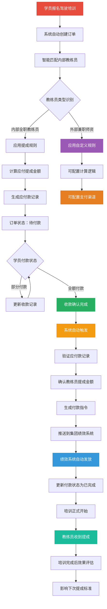

### 4. 职业培训

**职业培训模块概述**

职业培训模块面向社会招生，是培训系统对外服务的重要组成部分，与内部培训模块形成有机整合的培训生态系统。

#### 4.1 师资力量来源与分类管理

**师资分类体系设计**

| 师资类型 | 雇佣关系 | 工作性质 | 当前薪酬模式 | 支付渠道 | 未来扩展性 |
|---------|----------|----------|------------|----------|------------|
| **内部兼职讲师** | 内部员工 | 兼职授课 | 按授课时长课时费 | {集团补贴}系统 | 支持薪酬规则调整 |
| **内部全职教练员** | 内部员工 | 全职教学 | 固定薪资+按学员提成 | {集团绩效}系统 | 支持提成规则调整 |
| **外部兼职师资** | 外部合作 | 专项授课 | 灵活配置（未来） | 可配置支付渠道 | 完全可配置模式 |

**4.1.1 内部师资共享机制**

| 功能模块 | 功能点 | 功能描述 | 系统集成 | 前置条件 |
|---------|--------|----------|----------|----------|
| **内部兼职讲师管理** | 讲师认证状态查询 | 查询内部讲师的认证等级和授课能力 | 连接【带教成长】-讲师管理 | 讲师已通过内部认证 |
| | 对外授课资格审批 | 内部讲师申请对外授课的审批流程 | 审批流程设置 | 讲师认证有效 |
| | 授课档期管理 | 管理讲师的内外部授课时间安排 | 连接{日程}系统 | 对外授课资格已获得 |
| **内部全职教练员管理** | 教练员档案管理 | 全职教练员的基础信息和专业资质管理 | 连接内部员工系统 | 教练员已入职 |
| | 专业技能认证 | 教练员的专业技能等级和认证管理 | 支持多种专业领域认证 | 教练员已分配专业 |
| | 学员分配管理 | 教练员与学员的匹配和分配管理 | 自动计算工作负荷和提成基数 | 教练员可用 |
| **师资能力建设** | 对外授课培训 | 针对社会培训特点的师资专项培训 | 可复用内部培训项目功能 | 师资基础资格 |
| | 授课效果评估 | 社会学员对师资的评价反馈 | 影响师资等级和薪酬标准 | 对外授课进行中 |

**4.1.2 外部师资管理机制**（未来扩展）

| 功能模块 | 功能点 | 功能描述 | 系统集成 | 前置条件 |
|---------|--------|----------|----------|----------|
| **外部师资档案管理** | 外部师资注册 | 外部兼职师资的基础信息管理 | 独立于内部员工系统 | 无 |
| | 资质认证管理 | 师资的专业资质、证书、从业经验管理 | 支持证书有效期提醒 | 师资已注册 |
| | 师资等级评定 | 根据教学效果、学员评价等进行等级评定 | 影响薪酬标准和优先级 | 有授课记录 |
| **外部师资调度** | 师资匹配 | 根据课程类型、时间安排自动匹配合适师资 | 连接{日程}系统 | 师资档案已建立 |
| | 排课管理 | 外部师资的课程安排和时间管理 | 避免时间冲突，优化师资利用率 | 师资已匹配 |
| | 临时调配 | 师资临时调整和替换机制 | 自动通知相关学员和管理人员 | 有突发情况 |
| **外部师资协议管理** | 合作协议签署 | 外部师资合作协议的签署和管理 | 明确薪酬规则、支付方式等 | 师资资质审核通过 |
| | 协议续签提醒 | 协议到期自动提醒续签 | 提前30天进入教务{待办事项} | 协议已签署 |
| | 协议变更管理 | 协议条款的变更和版本管理 | 记录变更历史和生效时间 | 协议已生效 |

#### 4.2 培训项目管理

**4.2.1 订单生成规则引擎**

**三种业务模式对比分析**

| 业务模式 | 付费方式 | 订单粒度 | 收款模式支持 | 财务核算 | 盈亏分析 | 典型场景 |
|---------|----------|----------|------------|----------|----------|----------|
| **个人付费模式** | 学员个人付费 | 一人一单 | 一次性/分阶段 | 单订单独立核算 | 每个订单独立盈亏 | 驾照培训、技能认证 |
| **批量委派模式** | 委派方统一付费 | 一单多人 | 一次性/分阶段 | 项目级统一核算 | 整个项目统一盈亏 | 政府委派培训、企业团训 |
| **班级招生模式** | 按学员收费 | 多单汇总 | 一次性/分阶段 | 班级级汇总核算 | 班级整体盈亏分析 | 自主招生培训班、公开课程 |

**简化订单模式设计**

| 功能模块 | 功能点 | 功能描述 | 系统集成 | 前置条件 |
|---------|--------|----------|----------|----------|
| **默认订单模式** | 个人付费模式（默认） | 系统默认采用个人付费模式，一人一单 | 适用于驾照培训等高频场景，无需配置 | 无 |
| **订单模式切换** | 批量委派模式 | 创建项目时可切换为批量模式，一单多人 | 适用于政府委派等低频场景 | 需要时手动切换 |
| | 班级招生模式 | 创建项目时可切换为班级模式，多单汇总 | 适用于自主招生等班级管理场景 | 需要时手动切换 |

**4.2.2 社会培训项目执行**

| 功能模块 | 功能点 | 功能描述 | 系统集成 | 前置条件 |
|---------|--------|----------|----------|----------|
| **项目类型** | 个人付费培训（默认） | 驾照培训、技能认证等个人付费项目 | 系统默认个人订单模式，一人一单 | 无 |
| | 委派培训项目 | 政府委派、企业团训等批量付费项目 | 手动切换为批量订单模式，一单多人 | 创建时切换模式 |
| | 班级招生项目 | 自主招生培训班、公开课程等 | 手动切换为班级模式，多单汇总分析 | 创建时切换模式 |
| **学员管理** | 社会学员档案 | 外部学员的基础信息管理 | 独立于内部员工系统 | 无 |
| | 学习进度跟踪 | 外部学员的学习进度和成果管理 | 复用内部培训的进度管理功能 | 学员已报名 |
| | 学员订单关联 | 学员与订单的关联关系管理 | 根据订单模式建立不同的关联关系 | 订单已生成 |

#### 4.3 证书与认证管理

**对外培训证书体系**

| 功能模块 | 功能点 | 功能描述 | 系统集成 | 前置条件 |
|---------|--------|----------|----------|----------|
| **证书类型** | 结业证书 | 培训完成证明 | 共享内部培训的证书管理系统 | 培训项目完成 |
| | 能力认证证书 | 具备行业认可度的技能认证 | 可对接第三方认证机构 | 通过认证考核 |
| | 企业品牌证书 | 体现企业培训品牌价值的证书 | 使用企业专用证书模板 | 达到企业认证标准 |
| **证书管理** | 证书真伪验证 | 提供证书真伪查询服务 | 可对外开放查询接口 | 证书已颁发 |
| | 证书续期管理 | 有时效性证书的续期管理 | 自动提醒和续期流程 | 证书有时效性设置 |

#### 4.4 市场管理

**针对学生群体的营销策略**

| 功能模块 | 功能点 | 功能描述 | 系统集成 | 前置条件 |
|---------|--------|----------|----------|----------|
| **优惠活动管理** | 活动策划 | 新生开学季、寒暑假、节假日等时间节点的优惠活动 | 自动应用到订单系统 | 无 |
| | 优惠类型设置 | 早鸟价、团报优惠、学生价、新学员优惠等多种优惠类型 | **如：学生证优惠10%、3人团报每人减200元** | 活动已策划 |
| | 优惠券管理 | 优惠券生成、发放、使用、核销的完整管理 | 支持线上线下核销，防止重复使用 | 优惠活动已设置 |
| | 活动效果分析 | 各类优惠活动的转化率、获客成本、ROI分析 | 连接营销数据分析系统 | 活动已执行 |
| **转介绍奖励** | 奖励规则设置 | 转介绍成功的奖励标准和发放条件 | **如：成功转介绍1人奖励200元，被介绍人优惠100元** | 无 |
| | 介绍关系追踪 | 记录学员之间的介绍关系和转化路径 | 通过推荐码、链接等方式追踪介绍来源 | 奖励规则已设置 |
| | 奖励发放管理 | 转介绍奖励的计算、审核、发放流程 | 推送到{集团绩效}系统或现金奖励 | 转介绍成功确认 |
| | 防刷机制 | 防止虚假转介绍的风控机制 | **身份验证、支付验证、培训参与验证** | 奖励发放前 |
| **学员关系管理** | 学员档案管理 | 外部学员的完整档案信息管理 | **学校、专业、联系方式、学习偏好、消费能力等** | 学员首次接触 |
| | 学员标签体系 | 按学员特征建立标签分类体系 | **在校生、毕业生、价格敏感、品质优先、时间灵活等** | 学员档案已建立 |
| | 精准营销推送 | 基于学员标签的个性化营销内容推送 | **在校生推送学生优惠，时间灵活者推送周末班** | 学员标签已建立 |
| | 学员生命周期管理 | 从潜在客户到老学员的全生命周期管理 | **潜客→试听→报名→学习→结业→复购→转介绍** | 学员关系建立 |
| **营销数据分析** | 获客渠道分析 | 分析不同获客渠道的效果和成本 | **线上广告、线下推广、转介绍、自然流量等渠道ROI** | 有营销数据 |
| | 学员画像分析 | 基于大数据的学员特征和行为分析 | **年龄分布、消费能力、学习偏好、转化路径分析** | 有足够数据样本 |
| | 营销效果监控 | 实时监控各项营销指标和转化漏斗 | **曝光→点击→咨询→试听→报名的转化率分析** | 营销活动进行中 |
| | 竞品分析 | 竞争对手的价格、活动、服务对比分析 | 为定价和营销策略提供参考 | 有竞品数据收集 |

**学生群体营销策略设计要点**

1. **时间节点营销**：
   - **开学季**（9月）：新生入学优惠，"大学第一课"主题营销
   - **寒暑假**：假期学车优惠，"假期充电计划"
   - **毕业季**（6月）：毕业生专享价，"毕业礼物给自己"

2. **群体特征营销**：
   - **在校生**：学生证优惠、分期付款、周末班优先
   - **应届毕业生**：求职技能加分、就业前必备、职场新人特惠
   - **研究生**：高学历专享、精英班优先、导师推荐奖励

3. **社交化营销**：
   - **宿舍团报**：3-6人团报优惠，"宿舍集体学车"
   - **同班同学**：班级群体优惠，"全班一起考驾照"
   - **社团活动**：与学校社团合作，组织"学车体验活动"

4. **转介绍激励机制**：
   - **双向奖励**：介绍人获得现金奖励，被介绍人获得学费优惠
   - **累计奖励**：介绍人数越多，奖励越丰厚（如介绍3人奖500元，介绍5人奖1000元）
   - **特殊奖励**：成功介绍同宿舍或同班同学额外奖励

5. **数字化营销工具**：
   - **专属推荐码**：每位学员都有专属推荐码，便于追踪转介绍
   - **微信小程序**：便于学生分享和传播
   - **学生社群运营**：建立学员微信群，持续互动和转化

#### 4.5 订单与财务管理

**职业培训商业闭环管理**

| 功能模块 | 功能点 | 功能描述 | 系统集成 | 前置条件 |
|---------|--------|----------|----------|----------|
| **统一订单结构** | 订单基础信息 | 所有订单采用统一的基础结构：订单编号、订单类型、创建时间、状态等 | **个人/批量/班级订单都使用相同的基础字段** | 无 |
| | 客户信息适配 | 根据订单类型填充不同的客户信息 | **个人订单：单学员信息；批量订单：委派方+学员列表；班级订单：班级+学员列表** | 订单类型已确定 |
| | 应收应付信息 | 统一的应收应付字段，填入不同粒度的金额 | **个人订单：单人金额；批量订单：项目总金额；班级订单：班级总金额** | 订单已创建 |
| | 绩效信息管理 | 统一的绩效字段，应用不同的计算规则 | **师资分成规则、分成金额、绩效考核数据等字段统一，计算逻辑不同** | 师资已分配 |
| | 订单状态管理 | 订单全生命周期状态跟踪（待付款→已付款→培训中→已完成→已结算） | 所有类型订单使用相同的状态流转机制 | 订单进行中 |
| **分阶段收款管理** | 收款模式配置 | 支持一次性收款和分阶段收款两种模式 | **所有订单类型（个人/批量/班级）均支持两种收款模式** | 订单类型已确定 |
| | 地区模板管理 | 按地区管理不同的收款阶段配置模板 | **支持不同地区的监管政策模板** | 启用监管模式 |
| | 收款阶段设置 | 配置收款阶段和每阶段金额比例 | **支持3-6个阶段，比例可自定义，总和必须100%** | 选择地区模板 |
| | 培训进度关联 | 收款阶段与培训进度自动关联 | **培训进度完成→自动触发该阶段收款** | 收款阶段已设置 |
| | 监管银行对接 | 与政府指定监管银行系统对接 | **学员监管账户→分阶段扣款→公司账户** | 监管模式启用 |
| **应收应付管理** | 应收款记录 | 客户应付培训费用的记录和跟踪，支持分阶段记录 | **一次性模式：总金额记录；分阶段模式：按阶段分别记录** | 订单已确认 |
| | 收款确认 | 客户付款后的收款确认和到账记录 | **一次性收款或分阶段收款的状态更新** | 客户已付款 |
| | 应付款自动生成 | 订单创建时自动生成师资应付款记录 | **驾驶培训等独立师资：订单生成→应付教练提成/课时费** | 订单已创建 |
| | 应付款计算 | 根据师资类型和协议自动计算应付金额 | **支持按收款进度同步计算师资费用** | 师资协议已确定 |
| | 自动触发付款 | 收款到账后自动触发付款流程 | **一次性收款完成或分阶段收款达到条件→触发师资付款** | 收款条件满足 |
| | 付款执行追踪 | 师资费用的实际支付状态追踪 | 连接{集团补贴}和绩效系统，实时同步付款状态 | 付款已触发 |
| **收费与定价** | 课程定价策略 | 不同培训项目的价格设定和调整 | 可参考内部培训成本核算 | 课程内容已确定 |
| | 优惠政策管理 | 早鸟价、团报优惠、会员折扣等优惠策略 | 自动应用到订单金额计算 | 定价策略已确定 |
| | 发票管理 | 培训费用发票的开具和管理 | 对接财务系统发票模块 | 收款已确认 |
| **灵活薪酬规则引擎** | 薪酬模式配置 | 支持多种薪酬计算模式的灵活配置 | **课时费模式、提成模式、混合模式、自定义模式** | 师资类型已确定 |
| | 薪酬规则设置 | **内部兼职讲师**：按授课时长×课时费标准<br/>**内部全职教练员**：按学员数量×提成标准<br/>**外部师资**：可配置任意规则组合 | 支持规则参数的动态调整和版本管理 | 师资协议已签署 |
| | 费用计算引擎 | 根据师资类型自动选择对应的计算规则 | **自动识别师资类型→应用对应规则→计算应付金额** | 有业务数据 |
| | 计算时机控制 | **内部兼职讲师**：培训完成后计算<br/>**内部全职教练员**：订单创建时预设+收款后触发<br/>**外部师资**：可配置计算时机 | 支持不同的触发条件和计算时机 | 规则已配置 |
| **差异化支付流程** | 支付渠道路由 | 根据师资类型自动选择支付渠道 | **内部兼职讲师→{集团补贴}；内部教练员→{集团绩效}；外部师资→可配置渠道** | 费用计算完成 |
| | 支付审批流程 | **内部兼职讲师**：需要审批后发放<br/>**内部全职教练员**：自动触发发放<br/>**外部师资**：可配置审批流程 | 支持不同师资类型的差异化审批要求 | 应付款已生成 |
| | 支付状态管理 | 统一管理所有师资的费用支付状态和历史记录 | 实时同步支付状态，支持查询和对账 | 支付流程已启动 |
| **规则维护与扩展** | 薪酬规则版本管理 | 支持薪酬规则的版本控制和历史追踪 | 规则变更时保持历史数据的准确性 | 有规则变更需求 |
| | 规则测试与验证 | 新规则上线前的测试和验证机制 | 确保规则变更不影响现有业务 | 规则已修改 |
| | 扩展性设计 | 支持未来新师资类型和薪酬模式的快速接入 | **插件化设计，新增师资类型无需修改核心代码** | 有新业务需求 |
| **多维度财务核算** | 单订单核算 | 每个订单的独立收入、成本、利润核算 | **适用于个人付费模式（如驾照培训）** | 个人订单模式 |
| | 项目级核算 | 整个项目的统一收入、成本、利润核算 | **适用于批量委派模式（如政府培训）** | 批量订单模式 |
| | 班级级核算 | 班级内所有订单的汇总分析和盈亏计算 | **适用于班级招生模式（如自主招生培训班）** | 汇总分析模式 |
| | 成本分摊引擎 | 根据不同模式自动分摊师资、场地、材料等成本 | **个人模式：直接分摊；批量模式：平均分摊；班级模式：比例分摊** | 有成本数据 |
| | 盈亏分析报表 | 生成不同维度的盈亏分析报表 | **支持订单级、项目级、班级级、时间段等多维度分析** | 有财务数据 |
| **财务报表** | 收入统计 | 职业培训收入的统计和分析 | 数据流汇总分析 | 有订单数据 |
| | 成本分析 | 培训成本的核算和分析（讲师费、场地费、材料费等） | 成本数据自动汇总 | 有成本发生 |
| | 利润分析 | 各类培训项目的盈利能力分析 | 收入成本数据对比分析 | 有完整财务数据 |

#### 4.6 系统集成关系

**与其他模块的关联**

- **带教成长模块**：内部讲师认证为职业培训提供师资来源
- **培训项目模块**：项目管理功能、模板资源可复用于职业培训
- **知识分享模块**：内部沉淀的课程内容可转化为对外培训产品

**与MCP业务管理系统的深度集成**

- **{订单管理}系统**：职业培训订单的全生命周期管理，承载业务流、资金流、数据流
- **财务系统**：应收应付管理、发票开具、成本核算、收入确认
- **{集团补贴}系统**：内部讲师分成的自动计算和发放
- **{集团绩效}系统**：独立师资（如驾驶教练员）课时费和提成的自动支付、转介绍奖励发放
- **客户关系系统**：学员档案管理、营销活动执行、客户标签体系
- **审批流程**：订单审批、价格调整审批、内部讲师分成发放审批等

**三种业务模式的完整数据流**

**模式一：个人付费模式**（如驾照培训）
```
学员报名 → 个人订单创建 → 教练员匹配 → 应付款预设 → 学员付款 → 自动触发师资付款 → 培训执行 → 单订单核算 → 独立盈亏分析
    ↓           ↓           ↓           ↓           ↓           ↓           ↓           ↓           ↓
业务流记录   一人一单生成   师资直接分配   提成金额确定   资金流记录   推送绩效系统   服务交付    直接成本分摊   订单级利润计算
```

**模式二：批量委派模式**（如政府培训）
```
委派方洽谈 → 批量订单创建 → 学员名单确定 → 项目总价确认 → 收款模式选择 → 师资费用分摊 → 批量培训执行 → 项目级核算 → 整体盈亏分析
    ↓           ↓           ↓           ↓           ↓           ↓           ↓           ↓           ↓
业务流记录   一单多人生成   多学员关联   固定总价设定   一次性/分阶段   平均成本分摊   批量服务交付   项目成本汇总   项目级利润计算
```

**模式三：班级招生模式**（如自主招生培训班）
```
班级开设 → 多个个人订单 → 学员逐步报名 → 班级收入汇总 → 收款模式选择 → 班级成本分摊 → 班级培训执行 → 班级级核算 → 班级盈亏分析
    ↓           ↓           ↓           ↓           ↓           ↓           ↓           ↓           ↓
业务流记录   多单汇总管理   动态学员管理   收入实时汇总   一次性/分阶段   比例成本分摊   班级服务交付   汇总成本核算   班级级利润分析
```

**师资薪酬数据流**（复用现有设计）

**内部兼职讲师模式**：
```
客户报名 → 订单创建 → 应收确认 → 收款到账 → 培训执行 → 效果评价 → 课时费计算 → 审批发放 → 利润分析
    ↓           ↓           ↓           ↓           ↓           ↓           ↓           ↓           ↓
业务流记录   订单状态更新   资金流记录   状态变更通知   服务交付    评价数据收集   应付款生成   推送补贴系统   财务报表生成
```

**内部全职教练员模式**：
```
客户报名 → 订单创建 → 教练员分配 → 应付款预设 → 收款到账 → 自动触发付款 → 培训执行 → 成本核算 → 利润分析
    ↓           ↓           ↓           ↓           ↓           ↓           ↓           ↓           ↓
业务流记录   订单状态更新   师资匹配记录   应付款记录   资金流记录   推送绩效系统   服务交付    成本数据汇总   财务报表生成
```

**外部兼职师资模式**（未来扩展）：
```
客户报名 → 订单创建 → 师资匹配 → 薪酬规则应用 → 收款到账 → 灵活支付流程 → 培训执行 → 成本核算 → 利润分析
    ↓           ↓           ↓           ↓           ↓           ↓           ↓           ↓           ↓
业务流记录   订单状态更新   师资分配记录   应付款计算   资金流记录   可配置支付渠道   服务交付    成本数据汇总   财务报表生成
```

**统一订单结构设计理念**

**核心设计原则**：所有订单都采用统一的基础结构，包括基础信息和应收应付信息。不同模式下，订单的基本构成是一样的，区别仅在于字段内容的填充。

**统一订单数据结构**：

| 字段类别 | 统一字段 | 个人付费模式 | 批量委派模式 | 班级招生模式 |
|---------|----------|-------------|-------------|-------------|
| **基础信息** | 订单编号 | ORD001 | ORD002 | ORD003 |
| | 订单类型 | 个人订单 | 批量订单 | 班级订单 |
| | 培训项目 | 驾照培训 | 政府委派培训 | 自主招生班 |
| | 创建时间 | 2024-01-01 | 2024-01-01 | 2024-01-01 |
| **客户信息** | 主要客户 | 张三（学员） | XX政府（委派方） | 培训班A（班级） |
| | 学员列表 | [张三] | [学员1,学员2...学员50] | [学员A,学员B...学员30] |
| | 联系方式 | 张三手机号 | 政府联系人 | 班级负责人 |
| **应收应付** | 应收总金额 | ¥3000 | ¥150000 | ¥90000 |
| | 收款模式 | 分阶段收款 | 分阶段收款 | 一次性收款 |
| | 收款阶段 | 报名30%/科目一10%/科目二30%/科目三30% | 签约50%/培训开始30%/培训完成20% | 开班时100% |
| | 已收金额 | ¥900（报名阶段） | ¥75000（签约阶段） | ¥90000 |
| | 应付师资费 | ¥100（按进度） | ¥50000 | ¥30000 |
| | 收款状态 | 部分收款 | 部分收款 | 已收款 |
| **绩效信息** | 师资分成规则 | 按学员提成 | 按项目分摊 | 按班级分摊 |
| | 分成金额 | ¥100 | ¥50000 | ¥30000 |

**简化的订单模式操作**

**默认模式**：系统默认采用**个人付费模式**（一人一单），因为驾照培训等个人付费场景频率最高，无需额外配置。

**模式切换**：仅在需要时进行简单切换：
- **批量委派**：创建项目时选择"批量委派模式"（一单多人）
- **班级招生**：创建项目时选择"班级招生模式"（多单汇总）

**操作流程**：
1. 创建职业培训项目
2. 系统默认个人付费模式
3. 如需其他模式，点击切换按钮即可
4. 系统自动应用对应的订单生成和财务核算规则

**典型应用场景**：

**个人付费模式**：
- **一次性收款**：技能认证、短期培训
- **分阶段收款**：驾照培训（政府监管）、长期技能培训

**批量委派模式**：
- **一次性收款**：短期企业内训、政府短期委培
- **分阶段收款**：长期政府委培项目（签约→开训→中期→结业）、大型企业培训项目

**班级招生模式**：
- **一次性收款**：短期公开课程、研修班
- **分阶段收款**：长期专业培训班（报名→开班→中期→结业）、学历教育项目

**政府监管模式支持**

**背景说明**：部分地区政府对驾校培训实施账户监管，学员在指定银行开设监管账户，根据培训进度分阶段扣款，以规避学员与驾校的纠纷。

**分阶段收款流程**：

**标准政府监管模式示例**：

| 培训阶段 | 收款比例 | 触发条件 | 系统操作 | 资金流向 |
|---------|----------|----------|----------|----------|
| **报名阶段** | 30% | 学员完成报名 | 自动向监管银行发送扣款指令 | 监管账户→公司账户 |
| **科目一完成** | 10% | 科目一考试通过 | 系统确认进度→触发扣款 | 监管账户→公司账户 |
| **科目二完成** | 30% | 科目二考试通过 | 系统确认进度→触发扣款 | 监管账户→公司账户 |
| **科目三完成** | 30% | 科目三考试通过 | 系统确认进度→触发扣款 | 监管账户→公司账户 |

**灵活配置支持**：

| 配置项 | 说明 | 示例 |
|--------|------|------|
| **收款阶段数量** | 支持3-6个收款阶段 | 4阶段（报名+科目一二三）或5阶段（增加科目四） |
| **阶段比例设置** | 各阶段比例可自定义，总和必须100% | A地区：30%+10%+30%+30%<br/>B地区：25%+15%+30%+30%<br/>C地区：20%+20%+30%+30% |
| **触发条件配置** | 每个阶段的触发条件可自定义 | 标准：考试通过<br/>灵活：学时完成、实操达标等 |
| **地区模板管理** | 按地区保存标准配置模板 | 北京模板、上海模板、广州模板等 |

**系统设计要点**：
1. **地区差异化支持**：支持不同地区政府的监管政策差异
2. **模板化管理**：预设地区模板，快速适配当地政策
3. **灵活配置**：支持3-6个收款阶段，比例可自定义调整
4. **进度关联**：培训进度自动触发收款，确保合规性
5. **监管对接**：与不同地区政府指定银行系统API对接
6. **合规管理**：完整的培训记录和收款凭证追溯
7. **风险控制**：异常情况的处理和预警机制
8. **扩展性设计**：支持未来新地区政策的快速接入


**师资费用同步**：
- 所有模式的师资费用都按实际收款进度同步计算
- 避免预付费用导致的资金风险
- 确保收支匹配的财务安全

**内部全职教练员自动化支付详细流程**：


> **设计理念**：职业培训模块采用**弹性架构设计**，既满足当前业务需求，又为未来发展预留充分空间。通过**多元化师资管理**（内部兼职讲师+内部全职教练员+外部兼职师资）和**灵活薪酬规则引擎**，支持不同师资类型的差异化管理。系统采用**可配置化设计**，薪酬规则、支付流程、审批机制均可根据业务发展动态调整，确保系统能够适应未来的业务变化和扩展需求。

-