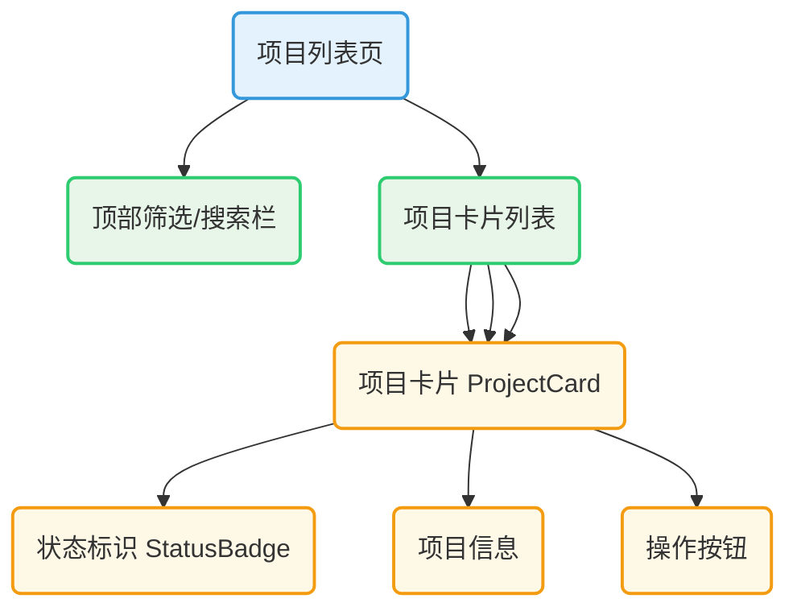
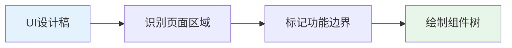
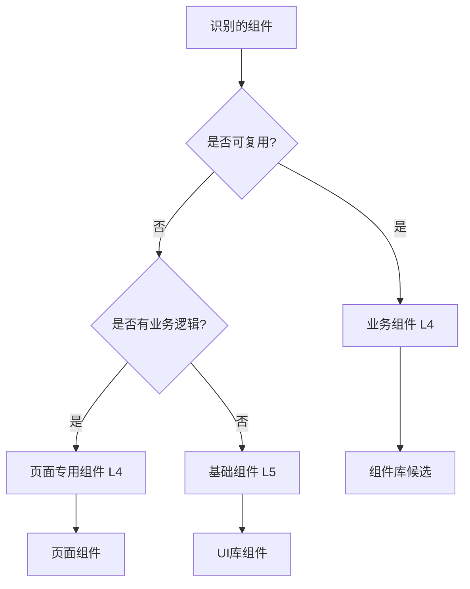
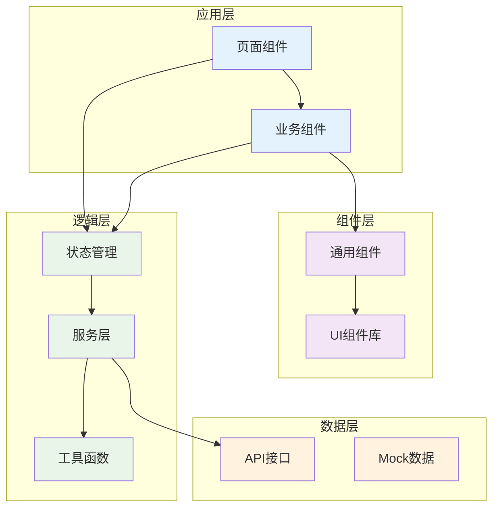
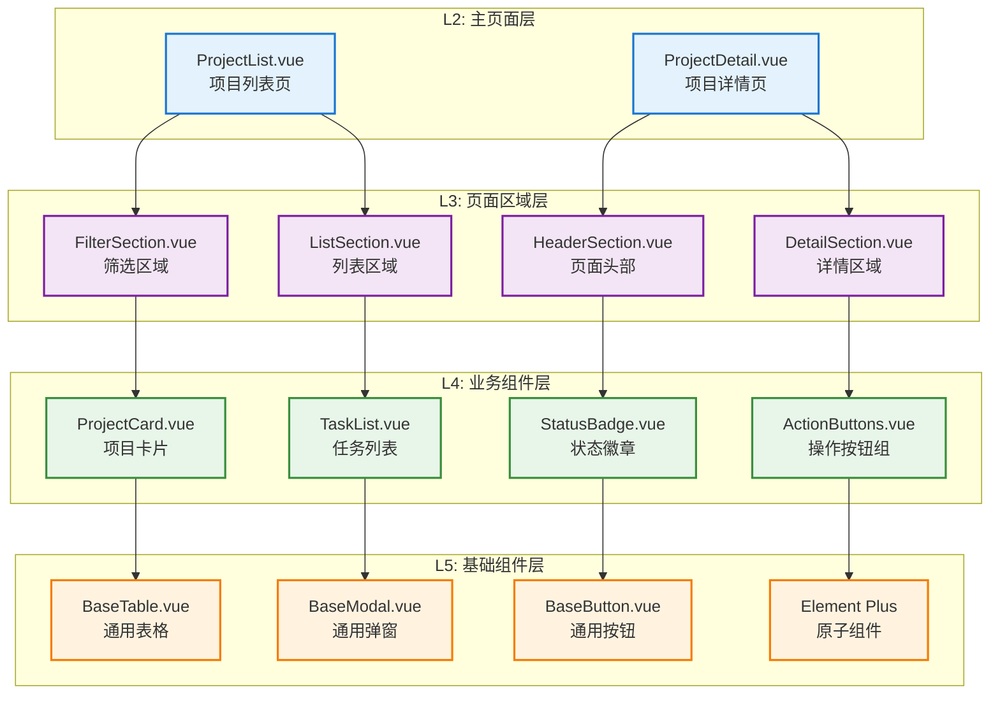
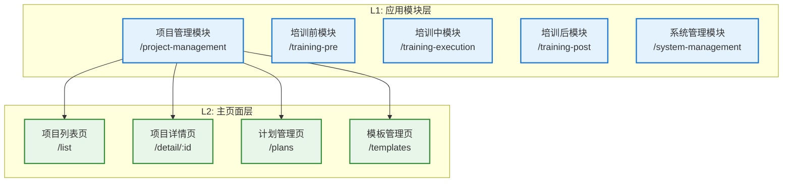
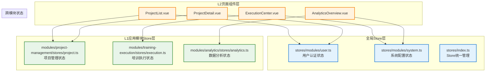

# 培训管理前端架构设计

## 目录

- [培训管理前端架构设计](#培训管理前端架构设计)
  - [目录](#目录)
  - [1. The "Why": 核心设计哲学](#1-the-why-核心设计哲学)
    - [1.1 界面驱动开发 (UI-Driven Development)](#11-界面驱动开发-ui-driven-development)
    - [1.2 UI颗粒度分解模型](#12-ui颗粒度分解模型)
    - [1.3 配置驱动：单一数据源原则](#13-配置驱动单一数据源原则)
  - [2. The "What & How": 核心模型与实现](#2-the-what--how-核心模型与实现)
    - [2.1 架构概览与系统定位](#21-架构概览与系统定位)
    - [2.2 技术选型](#22-技术选型)
    - [2.3 项目结构设计](#23-项目结构设计)
    - [2.4 组件架构设计](#24-组件架构设计)
    - [2.5 状态管理设计](#25-状态管理设计)
    - [2.6 路由与导航设计](#26-路由与导航设计)
    - [2.7 通用组件库设计](#27-通用组件库设计)
    - [2.8 工具函数与开发规范](#28-工具函数与开发规范)
  - [3. 专项设计方案](#3-专项设计方案)
    - [3.1 动态菜单设计方案](#31-动态菜单设计方案)
    - [3.2 高级功能展望：自动化与模板引擎](#32-高级功能展望自动化与模板引擎)
  - [4. 实施与迭代](#4-实施与迭代)
    - [4.1 开发实施计划](#41-开发实施计划)
    - [4.2 最近迭代记录](#42-最近迭代记录)

---

## 1. The "Why": 核心设计哲学

本章节阐述驱动我们所有技术决策的底层思考逻辑。

### 1.1 界面驱动开发 (UI-Driven Development)

为确保最高效的开发模式，我们采用**界面驱动开发 (UI-Driven Development)** 流程。此流程以用户最终看到的界面为起点，自顶向下分解，自底向上构建，确保前后端高效解耦和并行开发。

#### 1.1.1 核心流程四步法

我们以**"项目列表页"**的开发为例，演示此流程的四个核心步骤：

##### 步骤1：页面解构 (Page Deconstruction)

拿到UI设计稿后，首先将其解构为组件树，识别出可复用的业务组件和通用组件。



##### 步骤2：组件开发与数据模拟 (Component Development with Mocks)

自底向上构建组件，在开发阶段使用**模拟数据 (Mock Data)**，不依赖任何后端API。

- **定义Props**: 为每个组件定义清晰的数据输入接口。
- **模拟数据**: 在组件或页面层创建静态的假数据，使组件能够独立渲染和测试。

**此阶段产出**: 一个功能完整、样式精美的**静态页面**。

##### 步骤3：状态集成 (State Integration)

将页面中的模拟数据抽离，统一迁移到 **Pinia 状态管理** 中。

- **组件数据源**: 组件的数据不再由自身或父组件直接提供，而是从全局的Store中获取。
- **逻辑分离**: 视图（Component）与状态（Store）完全分离。

##### 步骤4：API 对接 (API Connection)

最后一步，修改Store中的`actions`，用真实的API调用替换获取模拟数据的逻辑。由于组件的数据源是Store，此步骤**无需修改任何组件代码**，界面将自动更新为真实数据。

#### 1.1.2 实践指南

##### 步骤1：页面解构 (Page Deconstruction)


##### 步骤2：组件分类 (Component Classification)


##### 步骤3：接口设计 (Interface Design)
- 根据组件需求定义API接口
- 确定数据结构和状态管理方案
- 设计组件间的通信协议

##### 步骤4：开发实施 (Development Implementation)
- 先开发L5基础组件
- 再构建L4业务组件
- 最后组装L2-L3页面结构

### 1.2 UI颗粒度分解方法

为了与后端业务设计保持高度一致，我们将业务模型的五层颗粒度（L1-L5）巧妙地映射到前端界面设计上，形成**"UI颗粒度分解模型"**。

#### 1.2.1 分解层级定义

| 层级 | UI颗粒度 | 说明 | 对应物 | 示例 |
|:---:|---|---|---|---|
| **L1** | **应用模块** | 系统最高级别的功能划分，通常对应主导航的一级菜单。 | 业务阶段 | 培训管理、培训执行 |
| **L2** | **主页面/视图** | 在一个应用模块下，承载一个完整、独立业务场景的页面。 | 功能模块 | 项目列表页、项目详情页 |
| **L3** | **页面区域** | 一个复杂页面内部，根据功能或布局划分的独立区块。 | 子模块 | 列表筛选区、内容展示区 |
| **L4** | **业务组件** | 具有明确业务含义、可在多个页面区域中复用的组件。 | 功能点 | `ProjectCard`、`TaskList` |
| **L5** | **基础/原子组件** | 不含业务逻辑、最纯粹的UI元素，通常来自UI组件库。 | 原子服务层 | `Button`、`Input`、`Table` |

#### 1.2.2 层级内容清单

基于培训系统的30个功能模块，我们系统化梳理各UI层级的完整内容：

##### **L1: 应用模块 (5个)**

| 应用模块 | 功能范围 | 对应业务阶段 | 主要用户群体 |
|---|---|---|---|
| **项目管理模块** | 项目创建、计划管理、模板配置 | 项目管理阶段 | 教务人员、项目负责人 |
| **培训前模块** | 对象确定、分组、通知、方案规划 | 培训前阶段 | 教务人员、学员、辅导员 |
| **培训中模块** | 任务执行、过程管理、数据记录 | 培训中阶段 | 学员、讲师、辅导员 |
| **培训后模块** | 评估总结、成果转化、项目收尾 | 培训后阶段 | 教务人员、学员、管理层 |
| **系统管理模块** | 用户权限、系统配置、数据统计 | 跨阶段支撑 | 系统管理员、教务管理员 |

##### **L2: 主页面/视图 (33个核心页面)**

**A. 通用导航页面 (3个)**

| 页面名称 | 页面类型 | 核心功能 | 用户角色 | 重要性 | 设计说明 |
|---|---|---|---|---|---|
| **培训管理首页** | 综合仪表板 | 培训管理模块的主入口，提供项目概览、数据统计、快捷操作 | 所有用户 | ⭐⭐⭐⭐⭐ | 参考`首页.png`，设计项目卡片、统计图表、操作入口 |
| **项目列表页** | 列表+卡片 | 所有培训项目的总览、筛选、快速进入 | 教务、学员、讲师 | ⭐⭐⭐⭐⭐ | 基于集团系统表格样式，支持多维度筛选 |
| **帮助中心页** | 文档+指南 | 培训管理系统使用帮助、操作指南、FAQ | 所有用户 | ⭐⭐ | 业务专用帮助文档 |

**B. 功能业务页面 (30个)**

| 应用模块 | 页面名称 | 页面类型 | 核心功能 | 用户角色 | 设计说明 |
|---|---|---|---|---|---|
| **项目管理模块** | 项目列表页 | 列表+卡片 | 培训项目的总览、筛选、快速进入 | 教务、学员、讲师 | 项目卡片式展示 |
| | 项目详情页 | 详情+tab | 项目完整信息展示和子功能导航 | 教务、负责人 | 详情页+功能模块导航 |
| | 计划管理页 | 列表+详情 | 培训计划的制定、审批、执行管理 | 教务、负责人 | 标准表格+表单组合 |
| | 计划创建页 | 表单+步骤 | 培训计划的创建和配置 | 教务、负责人 | 分步骤表单设计 |
| | 计划详情页 | 详情+操作 | 培训计划的详细信息和操作 | 教务、负责人 | 详情展示+操作按钮 |
| | 模板管理页 | 库管理 | 各类模板的创建、编辑、应用 | 教务 | 卡片式模板展示 |
| | 群聊模板编辑器 | 表单+预览 | 群聊通知模板的编辑和预览 | 教务 | 表单编辑+实时预览 |
| | 消息模板编辑器 | 表单+预览 | 消息通知模板的编辑和预览 | 教务 | 表单编辑+实时预览 |
| | 管理员推荐页 | 推荐+审批 | 管理员视角的人才推荐和审批 | 管理员 | 推荐表单+审批流程 |
| **培训前模块** | 对象选择页 | 筛选+选择 | 培训学员的筛选和确定 | 教务 | 双列选择器设计 |
| | 分组管理页 | 拖拽+分配 | 学员分组和辅导员分配 | 教务 | 可视化拖拽界面 |
| | 通知管理页 | 消息+状态 | 培训通知发送和回执管理 | 教务 | 消息列表+状态看板 |
| | 群聊管理页 | 群组+成员 | 企业微信群创建和管理 | 教务 | 群组卡片+成员列表 |
| | 角色选举页 | 投票+认定 | 小组角色的选举和确认 | 学员 | 角色卡片+投票界面 |
| | 议程规划页 | 日历+时间轴 | 培训时间安排和活动规划 | 教务 | 日历视图+拖拽编辑 |
| | 资源协调页 | 申请+管理 | 培训资源的申请和协调 | 教务 | 资源清单+申请表单 |
| | 预算管理页 | 财务+计算 | 培训费用预算和成本控制 | 教务 | 预算表格+图表展示 |
| | 分工管理页 | 任务+分配 | 培训任务分配和执行管理 | 教务 | 任务看板+分配界面 |
| | 方案汇总页 | 整合+审批 | 培训方案的汇总和审批 | 教务、审批人 | 方案预览+审批流程 |
| **培训中模块** | 面授管理页 | 任务+课件 | 面授任务和课件管理 | 讲师、教务 | 参考`项目页面.png`的表格样式 |
| | 作业管理页 | 提交+批阅 | 作业下发、提交和批量管理 | 学员、辅导员 | 作业列表+批量操作 |
| | 线上课程页 | 学习+跟踪 | 在线课程分配和学习跟踪 | 学员、教务 | 课程卡片+进度展示 |
| | 会务管理页 | 活动+支持 | 会务活动的申请和管理 | 教务 | 活动列表+申请表单 |
| | 考试管理页 | 出题+考试 | 在线考试和成绩管理 | 学员、讲师 | 试卷管理+考试界面 |
| | 考勤管理页 | 签到+统计 | 签到管理和出勤统计 | 学员、教务 | 签到界面+统计图表 |
| | 带教管理页 | 师徒+评价 | 师徒关系和互评管理 | 带教老师、学员 | 师徒配对+评价表单 |
| | 成绩管理页 | 录入+排名 | 成绩录入、计算和排名 | 教务、讲师 | 成绩表格+排名展示 |
| | 观察记录页 | 记录+分析 | 学员表现记录和分析 | 辅导员、讲师 | 记录表单+时间轴展示 |
| | 复盘管理页 | 报告+预览 | 复盘报告上传和预览 | 学员、小组 | 文档上传+在线预览 |
| **培训后模块** | 问卷调研页 | 问卷+分析 | 培训效果调研和数据分析 | 学员、教务 | 问卷设计+结果分析 |
| | 项目总结页 | 编辑+协作 | 项目总结报告协作编辑 | 教务、讲师、学员 | 富文本编辑+协作功能 |
| | 人才推荐页 | 推荐+审批 | 优秀学员推荐和审批 | 辅导员、教务、管理层 | 推荐表单+审批流程 |
| | 证书管理页 | 生成+颁发 | 培训证书生成和管理 | 教务、学员 | 证书模板+批量生成 |
| | 决算管理页 | 对比+核算 | 培训费用决算和核算 | 教务、财务 | 对比表格+差异分析 |
| | 新闻发布页 | 编辑+发布 | 培训新闻编辑和发布 | 教务、品牌部 | 富文本编辑+发布流程 |
| **系统管理模块** | 用户管理页 | 权限+角色 | 用户权限和角色管理 | 系统管理员 | 用户列表+权限配置 |
| | 系统配置页 | 参数+设置 | 系统参数和配置管理 | 系统管理员 | 配置表单+参数管理 |
| | 数据统计页 | 报表+分析 | 培训数据统计和分析 | 教务管理员 | 图表展示+数据导出 |

##### **L3: 页面区域**

| 区域类型 | 英文标识 | 功能描述 |
|---|---|---|
| 列表页通用区域 | `FilterSection` | 用于放置搜索框、筛选器等条件控件。 |
| | `ListSection` | 用于展示列表或网格内容。 |
| | `PaginationSection` | 用于放置分页组件。 |
| 详情页通用区域 | `HeaderSection` | 用于放置页面主标题和主要操作按钮。 |
| | `ContentSection` | 用于展示页面的核心信息和内容。 |
| | `SidebarSection` | 用于展示关联信息、步骤条或次要操作。 |

##### **L4: 业务组件**

| 组件名称 | 英文标识 | 功能描述 |
|---|---|---|
| 项目卡片 | `ProjectCard` | 在列表中以卡片形式展示单个培训项目的核心信息。 |
| 任务列表 | `TaskList` | 以列表形式展示学员需要完成的学习任务。 |
| 任务类型选择器 | `TaskTypeSelector` | 提供任务类型选择和添加功能。 |
| 培训阶段面板 | `TrainingStagePanel` | 管理培训阶段的创建、编辑和切换。 |
| 事件议程 | `EventAgenda` | 管理培训议程和时间安排。 |
| 分组管理 | `GroupManagement` | 学员分组和辅导员分配管理。 |
| 参与者选择器 | `ParticipantSelector` | 提供参与者筛选和选择功能。 |
| 资源管理 | `ResourceManagement` | 培训资源的申请和管理。 |
| 预算管理 | `BudgetManagement` | 培训费用预算和成本控制。 |
| 决算管理 | `SettlementManagement` | 培训费用决算和核算。 |
| 基本信息管理 | `BasicInfoManagement` | 项目基本信息的配置和管理。 |
| 方案管理 | `ProposalManagement` | 培训方案的制定和管理。 |
| 分工管理 | `DivisionManagement` | 培训任务分配和执行管理。 |
| 群聊管理 | `GroupChatManagement` | 企业微信群创建和管理。 |
| 通知管理 | `NoticeManagement` | 培训通知发送和回执管理。 |
| 成绩管理 | `ScoreManagement` | 成绩录入、计算和排名管理。 |
| 考试管理 | `ExamManagement` | 在线考试和成绩管理。 |
| 协同管理 | `CooperationManagement` | 协同任务管理和跟踪。 |
| 会议记录 | `MeetingRecords` | 培训会议记录和管理。 |
| 项目总结 | `ProjectSummary` | 项目总结报告的编辑和管理。 |
| 项目新闻 | `ProjectNews` | 培训新闻的编辑和发布。 |
| 管理员人才推荐 | `AdminTalentRecommendation` | 管理员视角的人才推荐功能。 |
| 辅导员推荐 | `CounselorRecommendation` | 辅导员视角的人才推荐功能。 |
| 管理员观察记录 | `AdminObserveRecords` | 管理员的学员观察记录。 |
| 辅导员观察 | `CounselorObserve` | 辅导员的学员观察功能。 |
| 辅导员任务列表 | `CounselorTaskList` | 辅导员的任务管理列表。 |
| 辅导员任务审阅 | `CounselorTaskReview` | 辅导员的任务审阅功能。 |
| 模板卡片 | `TemplateCard` | 模板展示卡片组件。 |
| 模板类型侧边栏 | `TemplateTypeSidebar` | 模板类型选择侧边栏。 |
| 模板预览面板 | `TemplatePreviewPanel` | 模板预览功能组件。 |
| 表单组件集合 | `[Various]Form` | 各种表单组件（作业、考试、问卷、讨论、协同等）。 |
| 用户选择器 | `UserSelector` | 提供一个弹窗或下拉列表，用于选择一个或多个用户。 |
| 角色选择器 | `RoleSelector` | 提供一个弹窗或下拉列表，用于选择一个或多个角色。 |

##### **L5: 基础/原子组件**
- 依赖 `Element Plus` UI组件库，例如：`El-Button`, `El-Input`, `El-Table`, `El-Dialog`, `El-Card` 等。

### 1.3 配置驱动：单一数据源原则

为确保架构的稳定性、可维护性和可扩展性，我们严格遵循**"配置驱动视图"**的核心原则。这意味着，所有动态的、可变的界面元素（如导航菜单、权限点等）都必须由统一的、结构化的配置数据来定义和驱动，视图层（Vue组件）只负责渲染这些数据，而不包含任何硬编码的逻辑或内容。

这一原则的最佳实践体现在我们的**导航菜单系统**中：

#### 1.3.1 菜单系统的三层解耦架构

我们将菜单系统清晰地拆分为三个独立的层次，各司其职，从根本上解决了因配置来源不统一而导致的各类问题（如菜单重复、渲染错误等）。

| 层级 | 关键目录/文件 | 核心职责 | 说明 |
|:---:|---|---|---|
| **数据层** | `src/menu/modules/` | **唯一数据源** | 每个 `.ts` 文件定义一个独立的菜单模块，包含其所有信息（标题、图标、路径）及其所有子菜单 (`children`)。 |
| **组装层** | `src/menu/top-nav-menu.ts` | **数据聚合器** | 纯粹的"组装厂"，负责从 `modules` 目录"进口"所有菜单模块，按序排列成最终的 `topNavMenu` 数组。自身不产生任何菜单数据。 |
| **视图层** | `src/layouts/TrainingLayout.vue` | **通用渲染器** | "无状态"的渲染组件，完全依赖 `topNavMenu` 数组。它通过 `v-for` 遍历数据，并根据每个菜单对象是否包含 `children` 属性，智能地将其渲染为普通菜单项或可下拉的子菜单。 |

#### 1.3.2 新架构的优势

这种清晰的职责划分带来了三大核心优势：

1.  **高度可预测性**: 由于数据来源是唯一的，视图的展现完全由配置数据决定，消除了"改一处而动全身"的风险，使系统行为稳定可控。
2.  **彻底解耦**: 视图层（Layout）与数据层（Modules）完全分离。视图不知道也不关心菜单的具体内容，而数据层也不关心它将被如何渲染。这使得两部分都可以被独立修改和替换。
3.  **极致的维护效率**:
    *   **修改**: 调整菜单文字或图标，只需在对应的 `modules` 文件中修改一行代码。
    *   **扩展**: 在"项目管理"下增加一个新功能页面，只需在其模块文件的 `children` 数组中增加一个对象。
    *   **集成**: 未来上线一个全新的大模块（如"财务管理"），只需在 `modules` 目录下新建一个配置文件，然后在组装层导入即可，对现有代码库的侵入性降至最低。

通过严格遵循此设计原则，我们构建了一个真正健壮、灵活且面向未来的前端架构。

## 2. The "What & How": 核心模型与实现

本章节是系统的"蓝图"和"字典"，定义了培训管理系统的核心抽象模型和具体实现方案。我们采用自顶向下的架构拆解方法，从系统定位到具体技术实现，层层递进地构建完整的前端架构体系。

### 2.1 架构概览与系统定位

**培训成长**作为集团人才发展的核心模块，包含四个子系统：

| 子系统 | 核心功能 | 与培训管理的关系 | 集成方式 |
|---|---|---|---|
| **培训管理** | 培训项目全生命周期管理 | 核心管理系统 | **本次设计重点** |
| **带教成长** | 师徒关系、带教管理 | 接收带教任务和数据 | 数据推送集成 |
| **知识分享** | 在线课程、知识库 | 提供线上课程资源 | 课程调用集成 |
| **职业培训** | 职业发展、技能认证 | 提供培训需求输入 | 需求对接集成 |

### 2.2 技术选型

#### 2.2.0 技术架构图



#### 2.2.0 架构原则

| 原则 | 说明 | 实现 |
|------|------|------|
| **模块化** | 功能模块独立开发 | 按业务域拆分文件夹 |
| **组件化** | 可复用的组件设计 | 原子组件+业务组件 |
| **响应式** | 状态驱动UI更新 | Vue 3响应式系统 |
| **类型安全** | TypeScript类型检查 | 严格的类型定义 |
| **可维护** | 清晰的代码结构 | ESLint+Prettier |

#### 2.2.1 前端技术栈

| 技术分类 | 选择方案 | 版本 | 选择理由 |
|---------|---------|------|----------|
| **前端框架** | Vue 3 | 3.4+ | 学习成本低、生态完善、支持组合式API |
| **UI组件库** | Element Plus | 2.4+ | 企业级组件丰富、中文文档、定制性强 |
| **状态管理** | Pinia | 2.1+ | Vue 3官方推荐、轻量级、TypeScript友好 |
| **路由管理** | Vue Router | 4.2+ | Vue官方路由解决方案 |
| **构建工具** | Vite | 5.0+ | 快速热更新、现代化构建 |
| **类型检查** | TypeScript | 5.0+ | 代码可维护性、IDE支持 |
| **HTTP客户端** | Axios | 1.6+ | 拦截器支持、请求取消 |
| **富文本编辑** | Quill.js | 1.3+ | 模块化、可扩展 |
| **图表可视化** | ECharts | 5.4+ | 图表类型丰富、性能优秀 |

#### 2.2.2 开发工具链

| 工具类型 | 选择方案 | 用途 |
|---------|---------|------|
| **代码规范** | ESLint + Prettier | 代码质量和格式化 |
| **CSS预处理** | Sass | 样式编写增强 |
| **Mock数据** | Mock.js | 接口数据模拟 |
| **测试框架** | Vitest | 单元测试 |
| **构建优化** | Vite插件生态 | 构建性能优化 |

### 2.3 项目结构设计

#### 2.3.1 基于UI颗粒度的目录结构

为完全遵循**UI颗粒度分解方法**，我们的项目结构严格按照L1-L5层级组织：

```
src/
├── api/                    # API接口定义，统一管理所有后端请求
│   └── ...
├── assets/                 # 静态资源，如图片、字体、全局样式等
├── components/             # 全局组件库
│   ├── common/             # L5: 通用基础组件（无业务逻辑）
│   ├── business/           # L4: 业务组件（有业务逻辑，可跨页面复用）
│   └── sections/           # L3: 页面区域组件（页面内部的功能区块）
├── composables/            # 组合式函数（自定义Hooks）
├── layouts/                # 布局组件
│   ├── TrainingLayout.vue  # 培训系统专用布局
│   └── AuthLayout.vue      # 认证页布局（用于登录、注册页）
├── menu/                   # (新增) 全局菜单配置文件
│   ├── sidebar-menu.ts     # 左侧边栏菜单配置
│   ├── top-nav-menu.ts     # 顶部导航菜单配置
│   └── types.ts            # 菜单项类型定义
├── modules/                # L1: 应用模块（按业务阶段划分的顶级模块）
│   └── ...
├── pages/                  # L2: 主页面/视图（跨模块的通用页面）
├── router/                 # 路由配置
│   ├── modules/            # (更新) 按L1应用模块划分的路由 (自动加载)
│   │   ├── dashboard.ts
│   │   ├── project-management.ts
│   │   └── ...
│   └── index.ts            # (更新) 路由主文件，自动导入模块
├── stores/                 # Pinia状态管理
├── types/                  # TypeScript类型定义
├── utils/                  # 通用工具函数
└── main.ts                 # Vue应用入口文件
```

#### 2.3.2 UI颗粒度层级映射

| UI层级 | 目录位置 | 说明 | 示例 |
|:---:|---|---|---|
| **L1** | `src/modules/` | 应用模块，按业务阶段划分 | `project-management/`, `training-pre/` |
| **L2** | `src/modules/*/pages/` + `src/pages/` | 主页面/视图 | `ProjectList.vue`, `Dashboard.vue` |
| **L3** | `src/components/sections/` | 页面区域组件 | `FilterSection.vue`, `ListSection.vue` |
| **L4** | `src/components/business/` + `src/modules/*/components/` | 业务组件 | `ProjectCard.vue`, `TaskList.vue` |
| **L5** | `src/components/common/` | 基础/原子组件 | `BaseTable.vue`, `BaseButton.vue` |

#### 2.3.3 模块化组织原则

##### 2.3.3.1 L1应用模块内部结构

每个应用模块都是一个相对独立的业务单元。以项目管理模块为例，实际的代码实现如下：

```
src/modules/project-management/
├── pages/                  # 该模块的L2页面
│   ├── AdminRecommendation.vue          # 管理员推荐页面
│   ├── ProjectDetail.vue                # 项目详情页面
│   ├── PlanCreate.vue                   # 计划创建页面
│   ├── PlanDetail.vue                   # 计划详情页面
│   ├── PlanManagement.vue               # 计划管理页面
│   ├── planUtils.ts                     # 计划工具函数
│   ├── GroupChatTemplateEditor.vue      # 群聊模板编辑器
│   ├── TemplateManagement.vue           # 模板管理页面
│   ├── MessageTemplateEditor.vue        # 消息模板编辑器
│   └── ProjectList.vue                  # 项目列表页面
├── components/             # 该模块专用的L4组件
│   ├── template/           # 模板相关组件
│   │   ├── message/        # 消息模板组件
│   │   │   ├── VariablePicker.vue       # 变量选择器
│   │   │   ├── PhonePreview.vue         # 手机预览组件
│   │   │   ├── MessageEditor.vue        # 消息编辑器
│   │   │   └── StageTree.vue            # 阶段树组件
│   │   ├── TemplateTypeSidebar.vue      # 模板类型侧边栏
│   │   ├── TemplateCard.vue             # 模板卡片
│   │   └── TemplatePreviewPanel.vue     # 模板预览面板
│   ├── summary/            # 总结相关组件
│   │   ├── ImageLinkForm.vue            # 图片链接表单
│   │   ├── CoursePicker.vue             # 课程选择器
│   │   ├── AttachmentUploader.vue       # 附件上传器
│   │   └── SummaryEditor.vue            # 总结编辑器
│   ├── news/               # 新闻相关组件
│   │   ├── StatsMiniCard.vue            # 统计小卡片
│   │   ├── PublishStatusTag.vue         # 发布状态标签
│   │   ├── NewsTemplatePicker.vue       # 新闻模板选择器
│   │   ├── AiDraftDialog.vue            # AI草稿对话框
│   │   └── NewsEditor.vue               # 新闻编辑器
│   ├── CooperationManagement.vue        # 协同管理组件
│   ├── AdminTalentRecommendation.vue    # 管理员人才推荐
│   ├── AdminObserveRecords.vue          # 管理员观察记录
│   ├── MeetingRecords.vue               # 会议记录
│   ├── ScoreManagement.vue              # 成绩管理
│   ├── CounselorRecommendation.vue      # 辅导员推荐
│   ├── CounselorObserve.vue             # 辅导员观察
│   ├── EventAgenda.vue                  # 事件议程
│   ├── ProjectNews.vue                  # 项目新闻
│   ├── ProjectSummary.vue               # 项目总结
│   ├── TaskTypeSelector.vue             # 任务类型选择器
│   ├── ResourceManagement.vue           # 资源管理
│   ├── SettlementManagement.vue         # 决算管理
│   ├── BudgetManagement.vue             # 预算管理
│   ├── TrainingStagePanel.vue           # 培训阶段面板
│   ├── GroupManagement.vue              # 分组管理
│   ├── TaskList.vue                     # 任务列表
│   ├── ExamManagement.vue               # 考试管理
│   ├── BasicInfoManagement.vue          # 基本信息管理
│   ├── ProposalManagement.vue           # 方案管理
│   ├── DivisionManagement.vue           # 分工管理
│   ├── GroupChatManagement.vue          # 群聊管理
│   ├── NoticeManagement.vue             # 通知管理
│   ├── ParticipantSelector.vue          # 参与者选择器
│   └── [其他组件...]                    # 其他业务组件
├── stores/                 # 该模块的状态管理
│   ├── score.ts            # 成绩状态管理
│   ├── agenda.ts           # 议程状态管理
│   ├── trainingStage.ts    # 培训阶段状态管理
│   ├── group.ts            # 分组状态管理
│   ├── attendance.ts       # 考勤状态管理
│   ├── exam.ts             # 考试状态管理
│   └── meeting.ts          # 会议状态管理
├── types/                  # 该模块的类型定义
│   ├── agenda.ts           # 议程类型定义
│   └── trainingStage.ts    # 培训阶段类型定义
├── constants/              # 该模块的常量定义
│   ├── taskTypeCategories.ts # 任务类型分类
│   └── taskEditRegistry.ts   # 任务编辑注册表
└── execution/              # 执行相关文件
    ├── components/         # 执行相关组件
    └── README.md          # 执行文档
```

##### 2.3.3.2 跨模块共享原则

- **L5基础组件**：全局共享，位于 `src/components/common/`
- **L4业务组件**：优先模块内部，复用时提升到 `src/components/business/`
- **L3页面区域**：全局共享，位于 `src/components/sections/`

#### 2.3.4 核心目录职责划分

```
/src
├── api/         # API接口模块，按业务划分
├── assets/      # 静态资源（图片、样式）
├── components/  # 全局通用组件
│   ├── business/  # 业务相关组件 (L4)
│   ├── common/    # 基础UI组件封装 (L5)
│   └── mock/      # 模拟组件 (如集团导航栏)
├── layouts/     # 布局组件 (如TrainingLayout.vue)
├── menu/        # 菜单配置
│   └── modules/   # (数据层) 各模块菜单定义
├── modules/     # 各业务模块页面和相关组件
├── pages/       # 主视图/页面组件 (L2)
├── router/      # 路由配置
│   └── modules/   # 各模块路由定义
├── sections/    # 页面区域组件 (L3)
├── stores/      # Pinia状态管理
└── utils/       # 通用工具函数
```

### 2.4 组件架构设计

#### 2.4.1 基于UI颗粒度的组件分层

严格遵循**UI颗粒度分解方法**，组件架构分为三个核心层级：



#### 2.4.2 界面驱动开发四步法在组件设计中的应用

##### 2.4.2.1 步骤1：页面解构 (L2→L3→L4)

以项目列表页为例，展示如何从UI设计稿解构到具体组件：

```typescript
// 1. 从UI设计稿识别页面区域（L3）
const pageRegions = {
  header: 'HeaderSection.vue',     // 页面标题、面包屑
  filter: 'FilterSection.vue',    // 筛选条件区域
  toolbar: 'ToolbarSection.vue',  // 操作工具栏
  content: 'ListSection.vue',     // 主要内容区域
  pagination: 'PaginationSection.vue' // 分页区域
};

// 2. 从页面区域识别业务组件（L4）
const businessComponents = {
  ProjectCard: 'src/components/business/ProjectCard.vue',
  FilterForm: 'src/components/business/FilterForm.vue',
  BatchActions: 'src/components/business/BatchActions.vue',
  ProjectStatus: 'src/components/business/ProjectStatus.vue'
};
```

##### 2.4.2.2 步骤2：组件开发与数据模拟

遵循**自底向上**的开发顺序：L5→L4→L3→L2

```vue
<!-- L4业务组件示例：ProjectCard.vue -->
<template>
  <div class="project-card">
    <BaseCard :bordered="true">
      <template #header>
        <div class="project-header">
          <h3>{{ project.title || '项目标题' }}</h3>
          <ProjectStatus :status="project.status || 'planning'" />
        </div>
      </template>
      
      <template #content>
        <div class="project-info">
          <p>负责人：{{ project.manager || '张三' }}</p>
          <p>开始时间：{{ formatDate(project.startDate) || '2024-01-01' }}</p>
          <p>进度：{{ project.progress || 60 }}%</p>
        </div>
      </template>
      
      <template #actions>
        <BaseButton @click="handleView">查看详情</BaseButton>
        <BaseButton type="primary" @click="handleEdit">编辑</BaseButton>
      </template>
    </BaseCard>
  </div>
</template>

<script setup lang="ts">
import { computed } from 'vue';
import type { Project } from '@/types';

// Props定义
const props = withDefaults(defineProps<{
  project?: Partial<Project>;
  mockMode?: boolean;
}>(), {
  mockMode: true, // 默认使用模拟数据
});

// 模拟数据（步骤2：组件开发阶段）
const mockProject: Project = {
  id: 'mock-001',
  title: '新员工入职培训项目',
  manager: '李经理',
  status: 'active',
  startDate: '2024-01-15',
  progress: 75
};

// 计算最终使用的项目数据
const project = computed(() => {
  if (props.mockMode) {
    return { ...mockProject, ...props.project };
  }
  return props.project || {};
});

// 事件处理
const emit = defineEmits<{
  view: [project: Project];
  edit: [project: Project];
}>();

const handleView = () => emit('view', project.value as Project);
const handleEdit = () => emit('edit', project.value as Project);
</script>
```

##### 2.4.2.3 步骤3：状态集成

将组件与Pinia状态管理集成：

```vue
<!-- 集成状态管理后的ProjectCard.vue -->
<script setup lang="ts">
import { computed } from 'vue';
import { useProjectStore } from '@/stores/project';

const props = defineProps<{
  projectId: string;
}>();

const projectStore = useProjectStore();

// 从Store获取项目数据
const project = computed(() => 
  projectStore.getProjectById(props.projectId)
);

const handleEdit = () => {
  projectStore.setEditingProject(project.value);
  // 导航到编辑页面...
};
</script>
```

##### 2.4.2.4 步骤4：API对接

最终与真实API对接：

```typescript
// stores/project.ts - API对接阶段
export const useProjectStore = defineStore('project', () => {
  const projects = ref<Project[]>([]);
  
  // API对接：获取项目列表
  const fetchProjects = async (params: ProjectQueryParams) => {
    try {
      const response = await projectApi.getProjects(params);
      projects.value = response.data;
    } catch (error) {
      console.error('获取项目列表失败:', error);
      // 降级到模拟数据
      projects.value = mockProjectList;
    }
  };
  
  return {
    projects: readonly(projects),
    fetchProjects,
  };
});
```

#### 2.4.3 L3页面区域组件设计

页面区域组件是**UI颗粒度分解**中的关键层级，负责组织页面内部的功能区块：

```vue
<!-- src/components/sections/FilterSection.vue -->
<template>
  <div class="filter-section">
    <BaseCard class="filter-card">
      <el-form 
        ref="formRef"
        :model="filters"
        :inline="true"
        class="filter-form"
      >
        <el-form-item label="项目状态">
          <el-select v-model="filters.status" placeholder="请选择">
            <el-option label="全部" value="" />
            <el-option label="计划中" value="planning" />
            <el-option label="进行中" value="active" />
            <el-option label="已完成" value="completed" />
          </el-select>
        </el-form-item>
        
        <el-form-item label="负责人">
          <el-input 
            v-model="filters.manager" 
            placeholder="请输入负责人姓名"
            clearable
          />
        </el-form-item>
        
        <el-form-item label="时间范围">
          <el-date-picker
            v-model="filters.dateRange"
            type="daterange"
            range-separator="至"
            start-placeholder="开始日期"
            end-placeholder="结束日期"
          />
        </el-form-item>
        
        <el-form-item>
          <BaseButton type="primary" @click="handleSearch">
            搜索
          </BaseButton>
          <BaseButton @click="handleReset">重置</BaseButton>
        </el-form-item>
      </el-form>
    </BaseCard>
      </div>
</template>

<script setup lang="ts">
import { ref, reactive } from 'vue';
import type { ProjectFilters } from '@/types';

// 筛选条件
const filters = reactive<ProjectFilters>({
  status: '',
  manager: '',
  dateRange: null,
});

const emit = defineEmits<{
  search: [filters: ProjectFilters];
  reset: [];
}>();

const handleSearch = () => {
  emit('search', { ...filters });
};

const handleReset = () => {
  Object.assign(filters, {
    status: '',
    manager: '',
    dateRange: null,
  });
  emit('reset');
};
</script>
```

### 2.6 路由与导航设计

#### 2.6.1 基于UI颗粒度的路由架构

路由设计严格遵循**UI颗粒度分解**，体现L1应用模块→L2主页面的清晰层次关系。



#### 2.6.2 模块化路由配置

为了解决多人协作开发时频繁修改单一路由文件导致的冲突问题，我们采用**模块化路由配置**方案。每个L1应用模块都有其独立的路由配置文件，由主路由文件自动聚合。

##### 2.6.2.1 模块路由文件示例 (`router/modules/project-management.ts`)

每个模块文件负责导出该模块下的所有页面路由。这种方式保证了模块的独立性和高内聚。

```typescript
// router/modules/project-management.ts
import type { RouteRecordRaw } from 'vue-router'
import { RouterView } from 'vue-router'

const routes: Array<RouteRecordRaw> = [
  {
    path: 'project-management',
    component: { render: () => RouterView },
    redirect: '/training-management/project-management/list',
    children: [
      {
        path: 'list',
        name: 'ProjectList',
        component: () =>
          import('@/modules/project-management/pages/ProjectList.vue'),
        meta: { title: '项目列表', level: 'L2' },
      },
      {
        path: 'plan',
        name: 'PlanManagement',
        component: () =>
          import('@/modules/project-management/pages/PlanManagement.vue'),
        meta: { title: '计划管理', level: 'L2' },
      },
    ],
  },
]

export default routes
```

##### 2.6.2.2 主路由自动加载 (`router/index.ts`)

主路由文件 `index.ts` 利用 Vite 提供的 `import.meta.glob` 功能，**自动**扫描、导入并注册 `modules` 目录下的所有路由模块。这使得新增或删除一个功能模块时，完全无需修改主路由文件。

```typescript
// router/index.ts
import { createRouter, createWebHistory } from 'vue-router'
import TrainingLayout from '@/layouts/TrainingLayout.vue'

// 1. 自动导入所有路由模块
const modules = import.meta.glob('./modules/*.ts', { eager: true })

// 2. 提取并整合所有路由配置
const appRoutes = Object.values(modules).flatMap((module: any) => module.default || [])

const router = createRouter({
  history: createWebHistory(import.meta.env.BASE_URL),
  routes: [
    {
      path: '/',
      redirect: '/training-management/dashboard',
    },
    {
      path: '/training-management',
      name: 'TrainingManagement',
      component: TrainingLayout,
      redirect: '/training-management/dashboard',
      // 3. 将所有模块的子路由统一挂载
      children: appRoutes,
    },
  ],
})

export default router
```

#### 2.6.3 模块化导航与动态渲染

与路由同理，我们将硬编码在组件中的导航菜单也完全抽离，实现了**配置与视图的分离**。

##### 2.6.3.1 菜单配置模块化

为彻底解决多人协作时菜单易冲突、难维护、扩展性差等问题，培训系统采用**菜单配置模块化+类型安全+自动聚合**的最佳实践方案，实现菜单与路由的解耦和高内聚。

- 每个L1应用模块（如dashboard、project-management等）单独维护自己的菜单配置文件，统一放置于`src/menu/modules/`目录下，文件命名与模块一致（如`project-management.ts`）。
- 所有菜单项类型统一定义于`src/menu/types.ts`，确保类型安全和一致性。
- 主菜单聚合文件（如`sidebar-menu.ts`、`top-nav-menu.ts`）自动导入并合并所有模块菜单，无需手动维护全量菜单列表。

**类型定义示例（src/menu/types.ts）：**
```typescript
export interface MenuItem {
  key: string;           // 唯一标识
  title: string;         // 菜单标题
  path: string;          // 路由路径
  icon?: any;            // 图标组件（可选）
  disabled?: boolean;    // 是否禁用（可选）
  children?: MenuItem[]; // 子菜单（可选）
  topNav?: boolean;      // 是否为顶部导航（可选）
}
```

**模块菜单配置示例（src/menu/modules/project-management.ts）：**
```typescript
import type { MenuItem } from '../types';
import { Folder } from '@element-plus/icons-vue';

export const projectManagementMenu: MenuItem = {
  key: 'project-management',
  title: '项目管理',
  path: '/training-management/project-management',
  icon: Folder,
  topNav: true,
  children: [
    { key: 'project-list', title: '项目列表', path: '/training-management/project-management/list' },
    { key: 'plan-management', title: '计划管理', path: '/training-management/project-management/plans' },
    // ... 其他子菜单
  ],
};
```

**主菜单聚合（src/menu/sidebar-menu.ts）：**
```typescript
import { projectManagementMenu } from './modules/project-management';
import { dashboardMenu } from './modules/dashboard';
// ...自动导入其他模块菜单

export const sidebarMenu = [dashboardMenu, projectManagementMenu /* ... */];
```

> 只需维护`src/menu/modules/`下的各自菜单配置文件，系统即可自动聚合并渲染全局菜单，无需任何硬编码。

##### 2.6.3.2 动态菜单渲染与路由联动

布局组件（如`TrainingLayout.vue`）**不再包含任何硬编码菜单项**，而是通过`v-for`遍历`sidebarMenu`、`topNavMenu`等配置，自动渲染所有菜单。

- 菜单项的`path`字段与路由配置完全一致，实现菜单与路由的自动联动。
- 支持多级菜单、图标、禁用、权限等扩展属性，便于后续功能拓展。
- 新增、调整、删除菜单项时，只需修改对应模块的菜单配置文件，无需全局查找和手动同步。

**动态渲染示例（layouts/TrainingLayout.vue）：**
```vue
<template>
  <aside class="group-sidebar">
    <el-menu ...>
      <template v-for="menu in sidebarMenu" :key="menu.key">
        <el-sub-menu v-if="menu.children?.length" :index="menu.key">
          <template #title>
            <el-icon v-if="menu.icon"><component :is="menu.icon" /></el-icon>
            <span>{{ menu.title }}</span>
          </template>
          <el-menu-item
            v-for="child in menu.children"
            :key="child.key"
            :index="child.path"
            :disabled="child.disabled"
          >{{ child.title }}</el-menu-item>
        </el-sub-menu>
        <el-menu-item v-else :index="menu.path">
          <el-icon v-if="menu.icon"><component :is="menu.icon" /></el-icon>
          <span>{{ menu.title }}</span>
        </el-menu-item>
      </template>
    </el-menu>
  </aside>
  <div class="group-main">
    <div class="top-nav">
      <el-menu mode="horizontal" ...>
        <el-menu-item
          v-for="nav in topNavMenu"
          :key="nav.key"
          :index="nav.path"
        >
          <el-icon v-if="nav.icon"><component :is="nav.icon" /></el-icon>
          <span>{{ nav.title }}</span>
        </el-menu-item>
      </el-menu>
    </div>
    <!-- ... -->
  </div>
</template>
<script setup lang="ts">
import { sidebarMenu } from '@/menu/sidebar-menu';
import { topNavMenu } from '@/menu/top-nav-menu';
// ... 其他逻辑
</script>
```

**优势总结：**
- 菜单配置与业务模块强关联，天然支持多人协作、分工明确。
- 自动聚合、类型安全，极大降低冲突和出错概率。
- 动态渲染，菜单与路由解耦，维护成本极低。
- 支持权限、国际化、动态加载等高级扩展。

### 6.4 菜单层级规范

#### 6.4.1 集团系统菜单层级标准

根据集团系统规范，培训系统的菜单层级结构如下：

```
培训成长（一级菜单 - 集团系统左侧导航）
└── 培训管理（二级菜单 - 集团系统左侧导航）
    ├── 培训首页（三级菜单 - 培训系统顶部导航）
    ├── 项目管理（三级菜单 - 培训系统顶部导航）
    │   ├── 项目列表（四级页面）
    │   ├── 计划管理（四级页面）
    │   ├── 模板管理（四级页面）
    │   └── 项目配置（四级页面）
    ├── 培训执行（三级菜单 - 培训系统顶部导航）
    │   ├── 培训前准备（四级页面）
    │   ├── 培训中管理（四级页面）
    │   └── 培训后收尾（四级页面）
    ├── 数据分析（三级菜单 - 培训系统顶部导航）
    │   ├── 数据概览（四级页面）
    │   ├── 报表分析（四级页面）
    │   └── 统计分析（四级页面）
    └── 系统设置（三级菜单 - 培训系统顶部导航）
        ├── 模板库（四级页面）
        ├── 权限管理（四级页面）
        └── 系统配置（四级页面）
```

#### 6.4.2 菜单显示规范

| 菜单层级 | 显示位置 | 显示方式 | 交互方式 | 设计原则 |
|:---:|---|---|---|---|
| **一级菜单** | 集团系统左侧导航 | 培训成长 | 点击展开/收起 | 人才培养核心模块 |
| **二级菜单** | 集团系统左侧导航 | 培训管理 | 点击进入培训系统 | 保持简洁，避免层级过深 |
| **三级菜单** | 培训系统顶部导航 | 水平标签栏 | 标签切换 | 便于快速切换功能模块 |
| **四级页面** | 培训系统内容区 | 页面路由 | 路由跳转 | 具体功能页面实现 |

#### 6.4.3 菜单与UI颗粒度映射关系

| 菜单层级 | UI颗粒度层级 | 对应关系 | 实现方式 |
|:---:|:---:|---|---|
| **三级菜单** | **L1应用模块** | 培训首页 ↔ dashboard模块 | `src/modules/dashboard/` |
| **三级菜单** | **L1应用模块** | 项目管理 ↔ project-management模块 | `src/modules/project-management/` |
| **三级菜单** | **L1应用模块** | 培训执行 ↔ training-execution模块 | `src/modules/training-execution/` |
| **四级页面** | **L2主页面** | 项目列表 ↔ ProjectList.vue | `src/modules/project-management/pages/` |

#### 6.4.4 集团系统集成的路由结构

```typescript
// router/index.ts - 符合集团系统规范的路由结构
const routes: Array<RouteRecordRaw> = [
  {
    path: '/',
    redirect: '/training-management/dashboard',
  },
  
  // 培训管理系统主入口（对应集团系统的二级菜单）
  {
    path: '/training-management',
    component: TrainingLayout, // 培训系统专用布局
    meta: { 
      title: '培训管理',
      requiresAuth: true,
      breadcrumb: ['培训成长', '培训管理'] // 面包屑导航
    },
    children: [
      // 培训首页（三级菜单）
      {
        path: 'dashboard',
        name: 'TrainingDashboard',
        component: () => import('@/modules/dashboard/pages/Overview.vue'),
        meta: { 
          title: '培训首页', 
          topNav: true, // 标识为顶部导航菜单
          level: 'L1' // UI颗粒度标识
        }
      },
      
      // 项目管理（三级菜单）
      {
        path: 'project-management',
        name: 'ProjectManagement',
        meta: { 
          title: '项目管理', 
          topNav: true,
          level: 'L1'
        },
        children: projectManagementRoutes,
      },
      
      // 培训执行（三级菜单）
      {
        path: 'training-execution',
        name: 'TrainingExecution',
        meta: { 
          title: '培训执行', 
          topNav: true,
          level: 'L1'
        },
        children: trainingExecutionRoutes,
      },
      
      // 培训后模块
      {
        path: 'training-post',
        component: DefaultLayout, 
        meta: { 
          title: '培训后收尾', 
          requiresAuth: true,
          module: 'training-post'
        },
        children: trainingPostRoutes,
      },
      
      // 系统管理模块
      {
        path: 'system-management',
        component: DefaultLayout,
        meta: { 
          title: '系统管理', 
          requiresAuth: true,
          module: 'system-management'
        },
        children: systemManagementRoutes,
      },
    ]
  }
];
```

#### 6.4.5 培训系统布局组件

```vue
<!-- layouts/TrainingLayout.vue -->
<template>
  <div class="training-layout">
    <!-- 面包屑导航 -->
    <div class="breadcrumb-nav">
      <el-breadcrumb separator="/">
        <el-breadcrumb-item>培训成长</el-breadcrumb-item>
        <el-breadcrumb-item>培训管理</el-breadcrumb-item>
        <el-breadcrumb-item v-if="currentPageTitle">
          {{ currentPageTitle }}
        </el-breadcrumb-item>
      </el-breadcrumb>
    </div>
    
    <!-- 顶部系统栏 - 三级菜单（L1应用模块导航） -->
    <div class="top-nav">
      <el-menu 
        mode="horizontal" 
        :default-active="activeTopNav"
        @select="handleTopNavSelect"
        class="top-nav-menu"
      >
        <el-menu-item index="dashboard">
          <el-icon><House /></el-icon>
          <span>培训首页</span>
            </el-menu-item>
        <el-menu-item index="project-management">
          <el-icon><Folder /></el-icon>
          <span>项目管理</span>
            </el-menu-item>
        <el-menu-item index="training-execution">
          <el-icon><VideoPlay /></el-icon>
          <span>培训执行</span>
        </el-menu-item>
        <el-menu-item index="analytics">
          <el-icon><DataAnalysis /></el-icon>
          <span>数据分析</span>
        </el-menu-item>
        <el-menu-item index="settings">
          <el-icon><Setting /></el-icon>
          <span>系统设置</span>
        </el-menu-item>
        </el-menu>
    </div>
      
    <!-- 页面内容区 -->
    <div class="content-area">
        <router-view />
    </div>
  </div>
</template>

<script setup lang="ts">
import { computed } from 'vue';
import { useRoute, useRouter } from 'vue-router';
import { House, Folder, VideoPlay, DataAnalysis, Setting } from '@element-plus/icons-vue';

const route = useRoute();
const router = useRouter();

// 当前激活的顶部导航
const activeTopNav = computed(() => {
  const pathSegments = route.path.split('/');
  return pathSegments[2] || 'dashboard'; // 获取三级菜单标识
});

// 当前页面标题
const currentPageTitle = computed(() => {
  return route.meta.title as string;
});

// 顶部导航切换处理
const handleTopNavSelect = (key: string) => {
  router.push(`/training-management/${key}`);
};
</script>

<style scoped>
.training-layout {
  height: 100vh;
  display: flex;
  flex-direction: column;
}

.breadcrumb-nav {
  padding: 12px 24px;
  background: #f5f5f5;
  border-bottom: 1px solid #e4e7ed;
}

.top-nav {
  background: #fff;
  border-bottom: 1px solid #e4e7ed;
  box-shadow: 0 2px 4px rgba(0,0,0,0.1);
}

.top-nav-menu {
  border-bottom: none;
}

.content-area {
  flex: 1;
  overflow: auto;
  background: #f0f2f5;
}
</style>
```

#### 6.4.6 菜单设计优势

**重新设计的菜单结构具有以下优势：**

1. **符合集团规范**：完全遵循集团系统的菜单层级标准
2. **层级清晰简洁**：最多四级层级，避免过深的嵌套结构  
3. **交互体验统一**：与集团其他系统保持一致的操作习惯
4. **功能模块聚焦**：按业务流程组织，便于用户理解和使用
5. **扩展性良好**：新增功能可按规范轻松集成

**与UI颗粒度分解的完美结合：**
- **三级菜单** = **L1应用模块**：实现了菜单与架构的一一对应
- **四级页面** = **L2主页面**：页面组织与菜单结构高度统一
- **路由层级** = **UI层级**：技术实现与业务逻辑完全匹配

### 2.5 状态管理设计

我们将使用 Pinia 作为首选的状态管理库，它以其简洁的API、强大的TypeScript支持和模块化能力，完美契合Vue 3的组合式API。

#### 2.5.1 基于UI颗粒度的状态管理架构

为了与**UI颗粒度分解方法**保持一致，我们采用**双层Store架构**：



#### 7.1.1 Store组织原则

| Store类型 | 存放位置 | 使用场景 | 示例 |
|:---:|---|---|---|
| **全局Store** | `src/stores/modules/` | 跨模块共享的状态 | 用户信息、系统配置、权限管理 |
| **模块Store** | `src/modules/*/stores/` | 模块内部的业务状态 | 项目列表、培训进度、分析结果 |

#### 7.1.2 模块Store细化：项目详情状态

为了管理"项目详情页"内各子模块（如对象、分组、通知等）的复杂状态交互，并确保数据的一致性，我们定义一个专门的`项目详情状态库` (Project Detail Store)。

- **定位**: 它属于`模块Store`，将被放置在 `src/modules/project-management/stores/projectDetailStore.ts`。
- **核心职责**:
    1.  **单一数据源**: 作为"项目详情页"内部所有子功能的**唯一可信数据源**。
    2.  **持有学员名单**: 存储由"对象"模块确认的最终学员名单。
    3.  **管理分组状态**: 存储学员的分组情况、角色分配等信息。
    4.  **数据联动**: 确保"分组"模块使用的数据源严格来自于"对象"模块的输出，实现两个功能区的无缝数据同步。

#### 7.1.3 状态管理与界面驱动开发的结合

Store设计完全支持**界面驱动开发四步法**：

```typescript
// 支持四步法的Store结构
export const useProjectStore = defineStore('project', () => {
  // 步骤2：模拟数据支持
  const mockMode = ref(true);
  const mockProjects = ref<Project[]>([/* 模拟数据 */]);
  
  // 步骤3：真实状态
  const projects = ref<Project[]>([]);
  
  // 步骤4：API集成
  const fetchProjects = async () => {
    if (mockMode.value) {
      projects.value = mockProjects.value;
    } else {
      const response = await projectApi.getProjects();
      projects.value = response.data;
    }
  };
  
  return { mockMode, projects, fetchProjects };
});
```

### 7.2 支持界面驱动开发的Store示例

以下是一个完整支持**界面驱动开发四步法**的模块Store示例：

```typescript
// modules/project-management/stores/project.ts
import { ref, computed, readonly } from 'vue';
import { defineStore } from 'pinia';
import * as projectApi from '@/api/modules/project';
import type { Project, ProjectQuery } from '@/types/project';

export const useProjectStore = defineStore('project', () => {
  // ============ 步骤2：模拟数据支持 ============
  const mockMode = ref(import.meta.env.DEV); // 开发环境默认使用模拟数据
  
  const mockProjects = ref<Project[]>([
    {
      id: 'mock-001',
      title: '新员工入职培训项目',
      manager: '李经理',
      status: 'active',
      startDate: '2024-01-15',
      progress: 75,
      description: '为新入职员工提供全面的培训...'
    },
    {
      id: 'mock-002', 
      title: '中层管理培训项目',
      manager: '王主管',
      status: 'planning',
      startDate: '2024-02-01',
      progress: 30,
      description: '提升中层管理人员的领导力...'
    },
  ]);

  // ============ 步骤3：真实状态管理 ============
  const projects = ref<Project[]>([]);
  const total = ref(0);
  const currentProject = ref<Project | null>(null);
  const loading = ref(false);
  const query = ref<ProjectQuery>({
    page: 1,
    pageSize: 10,
    keyword: '',
    status: '',
  });

  // ============ 计算属性 ============
  const activeProjects = computed(() => {
    const sourceData = mockMode.value ? mockProjects.value : projects.value;
    return sourceData.filter(p => p.status === 'active');
  });

  const displayProjects = computed(() => {
    return mockMode.value ? mockProjects.value : projects.value;
  });

  // ============ 步骤4：API集成方法 ============
  const fetchProjects = async () => {
    loading.value = true;
    
    try {
      if (mockMode.value) {
        // 模拟API延迟
        await new Promise(resolve => setTimeout(resolve, 500));
        projects.value = mockProjects.value;
        total.value = mockProjects.value.length;
      } else {
        const { data } = await projectApi.getProjectList(query.value);
        projects.value = data.items;
        total.value = data.total;
      }
    } catch (error) {
      console.error('获取项目列表失败:', error);
      // 降级到模拟数据
      if (!mockMode.value) {
        console.warn('API失败，降级使用模拟数据');
        projects.value = mockProjects.value;
        total.value = mockProjects.value.length;
      }
    } finally {
      loading.value = false;
    }
  };

  const fetchProjectById = async (id: string) => {
    loading.value = true;
    
    try {
      if (mockMode.value) {
        await new Promise(resolve => setTimeout(resolve, 300));
        const mockProject = mockProjects.value.find(p => p.id === id);
        currentProject.value = mockProject || null;
        return mockProject;
      } else {
        const { data } = await projectApi.getProjectDetail(id);
        currentProject.value = data;
        return data;
      }
    } catch (error) {
      console.error('获取项目详情失败:', error);
      // 降级处理
      if (!mockMode.value) {
        const mockProject = mockProjects.value.find(p => p.id === id);
        currentProject.value = mockProject || null;
        return mockProject;
      }
    } finally {
      loading.value = false;
    }
  };

  // 设置查询条件
  const setQuery = (payload: Partial<ProjectQuery>) => {
    query.value = { ...query.value, ...payload };
    fetchProjects();
  };

  // 切换模式（开发时使用）
  const toggleMockMode = () => {
    mockMode.value = !mockMode.value;
    console.log(`已切换到${mockMode.value ? '模拟' : '真实'}数据模式`);
    fetchProjects();
  };

  return {
    // 状态（只读）
    projects: readonly(displayProjects),
    total: readonly(total),
    currentProject: readonly(currentProject),
    loading: readonly(loading),
    query: readonly(query),
    
    // 计算属性
    activeProjects,
    
    // 方法
    fetchProjects,
    fetchProjectById,
    setQuery,
    
    // 开发辅助
    mockMode: readonly(mockMode),
    toggleMockMode,
  };
});
```

### 7.3 `use`组合函数封装

为了进一步简化在组件中的使用，并封装通用业务逻辑（如API调用后的消息提示、页面跳转等），我们推荐为复杂的Store封装一个对应的`use`组合函数。

```typescript
// modules/project-management/composables/useProject.ts
import { computed } from 'vue';
import { useProjectStore } from '../stores/project';
import { ElMessage, ElMessageBox } from 'element-plus';
import { useRouter } from 'vue-router';

export function useProject() {
  const store = useProjectStore();
  const router = useRouter();

  const createProject = async (projectData) => {
    // 调用store的action
    await store.createProject(projectData);
    ElMessage.success('创建成功');
    router.push({ name: 'ProjectList' });
  };
  
  const deleteProject = async (id: string) => {
    await ElMessageBox.confirm('此操作将永久删除该项目, 是否继续?', '提示', {
      type: 'warning',
    });
    await store.deleteProject(id);
    ElMessage.success('删除成功');
    // 刷新列表
    store.fetchProjects();
  };

  return {
    // 从store中暴露state和getters (使用computed保持响应性)
    projects: computed(() => store.projects),
    total: computed(() => store.total),
    loading: computed(() => store.loading),
    query: computed(() => store.query),
    
    // 暴露封装后的业务函数
    createProject,
    deleteProject,
    setQuery: store.setQuery,
    fetchProjects: store.fetchProjects,
  };
}
```

### 2.7 通用组件库设计

我们的组件库策略是**"基础靠引入，通用靠封装，业务靠沉淀"**，完全遵循**UI颗粒度分解方法**。

#### 2.7.1 基础UI库 (L5层)

- **库选型**: 我们选用 `Element Plus` 作为基础UI库。
- **引入方式**: 推荐使用**按需自动导入**，借助 `unplugin-vue-components` 和 `unplugin-auto-import` 插件，无需手动 `import` 即可在模板中使用。

### 8.2 通用组件封装 (L5 → L4)

通用组件 (`src/components/common/`) 是对基础UI库的二次封装，目的是**统一项目风格、固化通用逻辑、简化高频用法**。

### 8.3 页面区域组件 (L3层)

页面区域组件 (`src/components/sections/`) 负责组织页面内部的功能区块，是**UI颗粒度分解**中承上启下的关键层级：

```typescript
// L3页面区域组件的典型结构
export interface SectionComponentProps {
  // 数据输入
  data?: any[];
  loading?: boolean;
  
  // 配置选项
  config?: Record<string, any>;
  
  // 事件输出
  onAction?: (action: string, payload?: any) => void;
}

// 示例：筛选区域组件
// src/components/sections/FilterSection.vue
// 负责整合多个L4业务组件，形成完整的筛选功能区域
```

#### 8.4.1 封装原则

1.  **透传 Props 和 Events**: 封装后的组件应接受父组件传递的所有原生 `props` 和 `events`，并将其应用到根部的 `Element Plus` 组件上，确保其原生能力不丢失。可以使用 `v-bind="$attrs"` 和 `v-on="$listeners"` (Vue 2) 或等效的 Vue 3 方案。
2.  **提供便捷 Prop**: 针对项目中频繁使用的固定配置，封装为更语义化的 `prop`。例如，一个输入框可能有多种固定的校验规则，可以封装为 `validationType="phone|email|id_card"`。
3.  **预设样式与布局**: 封装组件应包含符合我们UI规范的默认样式和布局，避免在业务代码中重复编写。
4.  **提供 Slot**: 为保证灵活性，在关键位置（如`header`, `footer`, `default`）提供插槽，允许业务组件自定义内容。

#### 8.4.2 示例：封装 `BaseTable`

```vue
<!-- components/common/BaseTable.vue -->
<template>
  <div class="base-table">
    <el-table v-bind="$attrs" :data="data" :loading="loading">
      <!-- 动态渲染列 -->
      <template v-for="col in columns" :key="col.prop">
        <el-table-column v-if="!col.slot" v-bind="col" />
        <!-- 插槽列 -->
        <el-table-column v-else v-bind="col">
          <template #default="scope">
            <slot :name="col.slot" :row="scope.row" :index="scope.$index"></slot>
          </template>
        </el-table-column>
      </template>
    </el-table>
    
    <el-pagination
      v-if="pagination"
      class="mt-4"
      layout="total, sizes, prev, pager, next, jumper"
      :total="total"
      :current-page="page"
      :page-size="pageSize"
      @current-change="$emit('update:page', $event)"
      @size-change="$emit('update:pageSize', $event)"
    />
  </div>
</template>

<script setup lang="ts">
interface Column {
  prop: string;
  label: string;
  width?: number;
  slot?: string;
  formatter?: (row: any, column: any, cellValue: any) => string;
}

interface Props {
  columns: Column[];
  data: any[];
  loading?: boolean;
  pagination?: boolean;
  total?: number;
  page?: number;
  pageSize?: number;
}

withDefaults(defineProps<Props>(), {
  loading: false,
  pagination: true,
  total: 0,
  page: 1,
  pageSize: 10,
});

defineEmits<{
  'update:page': [page: number];
  'update:pageSize': [size: number];
}>();
</script>

<style scoped>
.base-table {
  .mt-4 {
    margin-top: 16px;
  }
}
</style>
```

### 8.5 业务组件沉淀 (L4)

业务组件 (`src/components/business/`) 是业务逻辑的沉淀，负责实现具体的业务功能。

#### 8.5.1 设计原则

1. **单一职责**：每个业务组件应只负责一个特定的业务功能。
2. **可复用性**：业务组件应尽可能地实现可复用，避免重复编写类似的逻辑。
3. **模块化**：业务组件应与业务逻辑紧密结合，避免与业务逻辑分离。

#### 8.5.2 示例：业务组件 `ProjectCard`

```vue
<!-- src/components/business/ProjectCard.vue -->
<template>
  <div class="project-card">
    <BaseCard :bordered="true">
      <template #header>
        <div class="project-header">
          <h3>{{ project.title || '项目标题' }}</h3>
          <ProjectStatus :status="project.status || 'planning'" />
        </div>
      </template>
      
      <template #content>
        <div class="project-info">
          <p>负责人：{{ project.manager || '张三' }}</p>
          <p>开始时间：{{ formatDate(project.startDate) || '2024-01-01' }}</p>
          <p>进度：{{ project.progress || 60 }}%</p>
        </div>
      </template>
      
      <template #actions>
        <BaseButton @click="handleView">查看详情</BaseButton>
        <BaseButton type="primary" @click="handleEdit">编辑</BaseButton>
      </template>
    </BaseCard>
  </div>
</template>

<script setup lang="ts">
import { computed } from 'vue';
import type { Project } from '@/types';

// Props定义
const props = withDefaults(defineProps<{
  project?: Partial<Project>;
  mockMode?: boolean;
}>(), {
  mockMode: true, // 默认使用模拟数据
});

// 模拟数据（步骤2：组件开发阶段）
const mockProject: Project = {
  id: 'mock-001',
  title: '新员工入职培训项目',
  manager: '李经理',
  status: 'active',
  startDate: '2024-01-15',
  progress: 75
};

// 计算最终使用的项目数据
const project = computed(() => {
  if (props.mockMode) {
    return { ...mockProject, ...props.project };
  }
  return props.project || {};
});

// 事件处理
const emit = defineEmits<{
  view: [project: Project];
  edit: [project: Project];
}>();

const handleView = () => emit('view', project.value as Project);
const handleEdit = () => emit('edit', project.value as Project);
</script>
```

### 2.8 工具函数与开发规范

#### 2.8.1 通用工具函数

- **日期格式化**: `formatDate`
- **状态转换**: `getStatusBadge`
- **数据分页**: `paginate`
- **搜索过滤**: `filter`
- **表单验证**: `validate`

#### 2.8.2 开发规范

- **命名规范**: 遵循Vue 3的命名规范
- **代码风格**: 遵循ESLint+Prettier的代码风格
- **组件封装**: 遵循组件封装的最佳实践
- **状态管理**: 遵循Pinia的使用规范
- **路由配置**: 遵循Vue Router的使用规范
- **UI设计**: 遵循Element Plus的设计规范

## 3. 专项设计方案

本章节涵盖培训管理系统中的专项设计需求和高级功能实现方案。这些设计在通用架构基础上，针对培训业务的特殊需求提供了定制化的解决方案。

### 3.1 动态菜单设计方案

为了提升用户体验，避免简单项目出现过多无关菜单，我们设计了一套动态菜单方案。此方案基于项目"基本信息"中的一个核心开关——"启用完整方案"——来动态控制"方案专属"菜单的显示与隐藏。

#### 3.1.1 设计理念

- **核心原则**：界面应根据项目复杂度"自动瘦身"，仅展示当前需要的操作。
- **实现方式**：在项目的"基本信息"配置中，增加一个"启用完整方案"的主开关。
  - **开关开启 (ON)**: 适用于需要详细规划的复杂项目，显示所有核心及方案专属菜单。
  - **开关关闭 (OFF)**: 适用于简单的执行导向型项目，仅显示最核心的菜单，隐藏规划、预算等高级菜单。
- **精细化控制**：当主开关开启后，允许用户对"议程"、"资源"、"预算"、"分工"等核心方案模块进行独立的二次启用/禁用，提供最大灵活性。
- **功能整合**: 将"模板"和"配置"等一次性设置功能，从左侧常驻菜单中移除。同时，将"角色"管理整合到"分组"功能中，让主操作界面更聚焦、更符合逻辑。

### 10.2 最终版菜单结构

| 阶段 | 菜单类型 | 菜单项 | 显示逻辑 | 备注 |
| :--- | :--- | :--- | :--- | :--- |
| **培训前** | **核心菜单** | **基本信息** | 总是显示 | 此页面包含"基础信息表单"和"功能配置区"。**用户可在此选择使用现有项目模板快速创建项目。**配置区包含总开关："启用完整方案"及各方案模块的独立开关。 |
| | | **对象** | 总是显示 | **智能化选择学员。系统根据"系统配置"中的规则（如项目类型匹配部门、职级等）进行自动推荐，并提供筛选条件供项目负责人微调，最后手动确认名单。** |
| | | **分组** | 总是显示 | 对学员进行分组、分配组内角色。**具体设计见 10.4 节。** |
| | | **通知** | 总是显示 | 发送各类项目通知。**通知模板在"系统配置"中管理。** |
| | | **群聊** | `当"启用群聊"= ON` | 创建和管理项目沟通群。此功能可在"基本信息"中独立开关。 |
| | **方案专属** | **方案** | `当"启用完整方案"= ON` | 方案的整体管理。 |
| | | **议程** | `当"启用完整方案"= ON` **且** `"启用议程"= ON` | 详细的时间安排。此功能可在"基本信息"中独立开关。 |
| | | **资源** | `当"启用完整方案"= ON` **且** `"启用资源"= ON` | 协调培训资源。此功能可在"基本信息"中独立开关。 |
| | | **预算** | `当"启用完整方案"= ON` **且** `"启用预算"= ON` | 制定项目预算。此功能可在"基本信息"中独立开关。 |
| | | **分工** | `当"启用完整方案"= ON` **且** `"启用分工"= ON` | 分配项目职责。此功能可在"基本信息"中独立开关。 |
| **培训中** | **核心菜单** | **（各项）** | 总是显示 | 面授、作业、线上、考试、考勤、带教、成绩、观察、复盘等。 |
| **培训后** | **核心菜单** | **问卷** | 总是显示 | 收集培训反馈。 |
| | | **总结** | 总是显示 | 撰写项目总结。 |
| | | **推荐** | 总是显示 | 推荐优秀人才。 |
| | | **证书** | 总是显示 | 生成和颁发证书。 |
| | | **新闻** | 总是显示 | 发布培训新闻。 |
| | **方案专属** | **决算** | `当"启用完整方案"= ON` **且** `"启用预算"= ON` | 对比预算和实际开销。依赖"预算"模块。 |

### 10.3 顶部主导航菜单设计

为确保系统模块划分清晰，用户能够快速在不同功能域之间切换，我们定义了统一的顶部主导航菜单。此菜单对应系统的L1应用模块层级。

| 序号 | 菜单名称 | 路由/模块 | 核心功能描述 |
|:---:|:--- |:--- |:--- |
| 1 | **培训首页** | `dashboard` | 提供系统概览、关键数据指标和快捷入口。 |
| 2 | **项目管理** | `project-management` | 覆盖培训项目的创建、计划、执行和模板化管理。 |
| 3 | **学员管理** | `student-management` | 管理学员信息、成长档案及相关数据。 |
| 4 | **数据分析** | `analytics` | 提供各类培训数据的统计、分析和可视化报表。 |
| 5 | **系统配置** | `system-configuration` | **（新增）** 用于管理全局性设置，例如定义项目中可用的角色类型、管理**通知模板**、**配置学员推荐规则**、配置系统级参数等。 |

### 10.4 "分组"与"角色"功能整合设计

为实现高效与灵活并存的分组管理，我们采用"全局配置+项目内操作"的二级设计，并将角色管理无缝整合其中。

#### **第一层：全局配置 (位于"系统配置"模块)**
此层级负责为所有新项目提供统一、高效的起点。

- **默认分组规则**:
  - **默认小组数量**: 可设定一个标准的项目小组数量（例如：5个）。
  - **默认命名模式**: 提供多种命名规则，如 "第N组"、"字母组（A组、B组）"或"自定义前缀+编号（如 `雏鹰队`+`1`）"。

- **角色与职责定义**:
  - **学员角色池**: 在此定义项目中所有可分配给**学员**的角色。
    - `组长`
    - `学习委员`
    - `纪律委员`
  - **辅导员池**: 独立管理项目中的辅导员资源。辅导员不作为学员参与分组，而是以指导者身份分配到各小组。

#### **第二层：项目内分组页面 (看板式设计)**
此层级为项目负责人提供了针对当前项目的最大灵活性和直观操作。

- **界面布局**:
  - **左侧**: "未分配学员"列表。
  - **右侧**: 多个小组列，每个小组是一个独立的看板列，清晰展示各组成员。

- **核心功能**:
  - **小组管理**:
    - **自动初始化**: 进入页面时，根据"系统配置"的默认规则，自动生成小组。
    - **动态调整**: 负责人可以**自由增加或删除小组**，并可**即时重命名**每个小组。
  - **学员分配**:
    - **手动拖拽**: 支持将学员从"未分配"列表拖入小组，或在小组之间任意拖动，操作直观。
    - **一键自动分组**: 提供多种智能分组策略：
      - **完全随机分配**: 快速、公平地将所有学员随机打散。
      - **按条件均衡分组**: 选择一个或多个维度（如**部门、职级、性别**），系统算法将确保各小组在这些维度上的人员构成尽可能均衡，避免同质化。
      - **按条件聚合分组**: 根据指定条件（如"同一部门"），将属性相同的学员分到一组。
  - **角色与辅导员分配**:
    - **学员角色分配**: 在每个已分配学员的卡片上，可以从"学员角色池"中选择一个或多个角色进行分配。
    - **小组辅导员分配**: 在每个小组的头部，提供一个专属的下拉选择框，用于从"辅导员池"中为该小组指派一名辅导员。

## 4. 实施与迭代

本章节记录培训管理系统的开发实施计划和具体迭代进展，为项目管理和开发协作提供指导。

### 4.1 开发实施计划

本文档不仅是架构设计的蓝图，也指导着项目的具体开发实施。为确保项目高效、有序地推进，我们制定了以下基于**界面驱动开发**的静态页面开发计划。

#### 4.1.1 开发原则

- **自底向上构建**: 严格遵循L5 -> L4 -> L3 -> L2的组件构建顺序。
- **Mock数据优先**: 在静态页面开发阶段，所有组件都将使用模拟数据进行开发和调试，不依赖后端API。
- **核心页面先行**: 从最能代表系统核心功能和设计风格的页面开始，建立UI和交互基准。

### 11.2 实施任务清单 (第一阶段：核心静态页面)

为将上述原则转化为可执行的步骤，我们制定了以下任务清单，并用 ✅ 标记已完成或基本完成的任务。

#### **第一部分：基础架构与核心组件 (已完成)**
- ✅ (L5) 技术选型与环境搭建 (Vite + Vue 3 + TS + Element Plus)
- ✅ (L5) 配置 `nvm` 管理 Node.js 版本，解决环境兼容问题
- ✅ (L4) 开发核心业务组件: `ProjectCard`, `StatisticCard`, `QuickLink`
- ✅ (L3) 开发通用页面区域组件: `FilterSection`, `ListSection`
- ✅ (L1-L2) 搭建基础路由结构，引入 `TrainingLayout` 布局和根组件 `App.vue` 的 `<router-view>`

#### **第二部分：核心页面静态开发 (进行中)**
- ✅ (L2) 完成 `培训管理首页` (`Dashboard.vue`) 静态页面开发
- ✅ (L2) 完成 `项目列表页` (`ProjectList.vue`) 静态页面开发
- ⬜ (L2) **下一步:** 开发 `计划管理页` (`PlanManagement.vue`) 静态页面
    - ⬜ 创建页面文件及路由
    - ⬜ 使用模拟数据构建包含筛选、操作按钮和表格的界面
- ⬜ (L2) 开发 `模板管理页` (`TemplateManagement.vue`) 静态页面
- ⬜ (L2) 开发 `项目配置页` (`ProjectConfig.vue`) 静态页面

#### **第三部分：状态管理与API集成 (待开始)**
- ⬜ (Pinia) 为 `项目列表页` 创建对应的 `store`
- ⬜ (API) 将 `项目列表页` 的模拟数据替换为真实的 API 调用
- ⬜ (Pinia & API) 为其他已完成的静态页面逐步集成状态管理和API

#### **第四部分：代码质量保障 (建议)**
- ⬜ 引入并配置 `ESLint` 进行代码规范检查
- ⬜ 引入并配置 `Prettier` 进行代码格式化
- ⬜ 在 `package.json` 中添加 `lint` 和 `format` 脚本

完成以上步骤后，我们将拥有两个核心静态页面和一套可复用的基础业务组件，为全面展开其他31个页面的开发工作奠定坚实基础。

### 3.2 高级功能展望：自动化与模板引擎

### 12.1 议程-资源自动化生成引擎

#### 12.1.1 核心思想

为了从根本上提升培训项目管理的效率和标准化程度，我们设想引入一个"议程-资源"模板引擎。其核心思想在于，将"做什么"（议程活动）与"需要什么"（资源配置）这两个环节通过模板进行关联，实现"选择即生成"的自动化资源规划，将项目负责人从繁琐、重复的资源清单整理工作中解放出来。

#### 12.1.2 业务流程设计

该功能涉及"后台配置"与"前台使用"两个阶段，形成一个完整闭环。

```mermaid
graph TD
    subgraph "阶段一: 管理员在系统设置中配置模板"
        A[管理员] --> B(定义议程类型<br/>例如: '面授课程');
        B --> C{为'面授课程'配置资源包};
        C --> D[数字资料模板<br/>- '[课程名].ppt'<br/>- '满意度问卷'];
        C --> E[服务预定模板<br/>- '授课场地'];
        C --> F[物料清单模板<br/>- '签字笔'<br/>- '白板纸'];
    end
    
    subgraph "阶段二: 教务在项目中使用"
        G[教务人员] -- "1. 创建议程" --> H(选择议程类型: '面授课程');
        H -- "2. 保存议程" --> I((✨ 触发自动化 ✨));
    end
    
    subgraph "阶段三: 系统自动生成资源需求"
        I -- "3. 读取模板" --> J[自动在'资源-数字资料'下<br/>创建'课程名.ppt(待提供)'];
        I -- "3. 读取模板" --> K[自动在'资源-服务预定'下<br/>创建'授课场地(待申请)'];
        I -- "3. 读取模板" --> L[自动在'资源-物料清单'下<br/>创建'签字笔(待采购)'];
    end
    
    style I fill:#ffcc00,stroke:#333,stroke-width:4px,stroke-dasharray: 5 5;
```

**A. 模板配置阶段 (系统管理员)**
1.  **入口**: 在"系统管理"模块下，创建一个新的配置页面，名为"议程资源模板"。
2.  **定义议程类型**: 管理员可以创建和管理一系列标准化的议程活动类型，例如"面授课程"、"分组讨论"、"线上考试"、"开营仪式"等。
3.  **配置资源包**: 针对每一种议程类型，管理员可以为其关联一个"资源包"，该资源包内包含了三个清单的模板：
    -   **数字资料模板**: 定义需要哪些类型的文档，并可以设置动态字段，如 `[课程名称].ppt`，同时预设好状态（待提供）和默认负责人（讲师/教务）。
    -   **服务预定模板**: 定义需要哪些服务项，如"授课场地"，并预设好类型和状态。
    -   **物料清单模板**: 定义需要哪些物料，可以设置与学员人数动态关联的数量（如 `N 支签字笔`），并预设好状态。

**B. 业务使用阶段 (项目教务)**
1.  **创建议程**: 在"项目详情"的"议程"模块中，当教务人员新增或编辑一个议程事项时，表单中会增加一个必填的"议程类型"下拉框。
2.  **触发自动化**: 教务人员从下拉框中选择了某个类型（如"面授课程"）并保存后，系统会自动触发资源生成引擎。
3.  **自动填充**: 系统会根据管理员预设好的模板，在"资源"模块下的三个选项卡中，自动创建所有对应的资源需求条目，并填充好所有预设信息。

#### 12.1.3 对前端架构的影响
- **新增配置页面**: 需要在 `src/modules/system-configuration/pages` 目录下，创建一个新的页面组件 `AgendaResourceTemplate.vue`，并为其配置路由。
- **修改议程组件**: 需要修改 `EventAgenda.vue` 组件，在其新增/编辑弹窗的表单中，增加一个用于选择"议程类型"的 `el-select` 组件。
- **无需修改资源组件**: `ResourceManagement.vue` 组件无需任何修改，因为它只负责接收和展示数据，正好印证了其良好的解耦设计。

### 培训中阶段任务流编排型页面设计

#### 1. 设计理念
"培训中"阶段以任务流编排为核心，用户可通过"阶段+任务类型+任务列表"的结构灵活组织培训任务。不同于"培训前"以功能菜单为主，"培训中"强调内容/活动的流程化、可视化管理。

#### 2. 数据结构
- **阶段（Stage）**：包含id、name、tasks（任务列表）
- **任务（Task）**：包含id、type、name、required、config、status、order等
- **任务类型（TaskType）**：包含type、label、icon、color等

#### 3. 组件拆分
- TrainingStagePanel（左侧阶段栏）：增删改阶段、切换当前阶段
- TaskTypeSelector（顶部任务类型选择器）：展示所有任务类型，点击添加任务
- TaskList（中间任务列表）：展示当前阶段任务，支持编辑、排序、批量操作
- TaskItem（任务卡片/行）：展示任务基本信息，支持操作
- TaskConfigDialog（任务配置弹窗）：新增/编辑任务时弹出，按类型动态渲染表单

#### 4. 页面布局
- 左侧：阶段列表（竖向）
- 顶部：任务类型选择器（横向）
- 中间：当前阶段任务列表（卡片/表格）
- 弹窗：任务配置/编辑

#### 5. 交互流程
1. 用户切换左侧阶段，主区显示该阶段任务列表。
2. 用户点击顶部任务类型图标，在当前阶段下添加新任务，弹出配置弹窗。
3. 用户可对任务进行编辑、删除、排序、批量操作。
4. 阶段和任务的增删改均为本地数据操作，最终整体保存/提交。

#### 6. 与设计文档内容的映射
- 任务类型严格以设计文档为准（面授、作业、线上课程、会务、考试、考勤、带教、成绩、观察、复盘）。
- 任务配置表单每种类型有专属配置项，表单内容按设计文档细化。
- 阶段可灵活增删，支持复杂培训流程的多阶段编排。

### 4.2 最近迭代记录

#### 4.2.1 项目详情模块第二阶段（2025-07）

> 本节记录"项目详情"模块在本轮迭代中的核心进展，供后续开发、评审与需求对齐参考。

##### 4.2.1.1 文档更新记录（2025-01-11）

本次更新基于实际代码实现情况，对设计文档进行了同步修正：

###### 4.2.1.1.1 目录架构更新
- **更新了4.3.1节项目管理模块内部结构**：从简化的示例结构更新为完整的实际代码实现结构
- **新增了详细的组件分类**：包括template、summary、news等子目录的具体组件文件
- **完善了stores、types、constants等目录**：添加了实际存在的文件列表和说明

###### 4.2.1.1.2 页面清单更新
- **扩展了项目管理模块页面清单**：从3个页面扩展到9个页面，包括：
  - 项目列表页、项目详情页
  - 计划创建页、计划详情页、计划管理页
  - 模板管理页、群聊模板编辑器、消息模板编辑器
  - 管理员推荐页

###### 4.2.1.1.3 业务组件清单更新
- **大幅扩展了L4业务组件清单**：从7个组件扩展到30+个组件
- **新增了核心业务组件**：包括任务管理、资源管理、预算决算、成绩管理、观察记录等
- **补充了模板相关组件**：模板卡片、类型侧边栏、预览面板等
- **添加了表单组件集合**：作业、考试、问卷、讨论、协同等各类表单组件

> **更新原则**：以实际代码实现为准，确保设计文档与开发实践的一致性。

#### 4.2.2 培训中任务菜单

1. **任务类型分组**：按照 `taskTypeCategories.ts` 中的 `online`（课程 / 作业 / 考试 / 讨论）、`offline`（面授）、`tool`（考勤 / 问卷 / 协同）三大类渲染按钮，并保持顺序一致。
2. **动态表单加载**：`TaskTypeSelector.vue` 依据配置自动引入对应任务表单组件（如 `HomeworkForm.vue`、`ExamForm.vue`、`CooperationForm.vue`）。
3. **图标映射扩展**：为"协同"、"问卷"等新增任务类型补充图标及色板映射。

#### 4.2.3 任务列表优化

1. **列顺序调整**：统一为「类型 / 任务名称 / 时间 / 操作 / 已推送」。
2. **编辑入口统一**：通过 `taskEditRegistry.ts` 为所有任务类型注册"编辑"按钮行为；"协同"类型在培训中阶段被过滤，不在列表显示。

#### 4.2.4 协同任务功能

* 表单字段：任务名、简介、小作业选择、批阅人、评分方式（支持总分 / 合格分，实时校验）。
* 保存策略：协同任务不进入培训中任务流，而是写入"协同管理"子模块供后续查看。

#### 4.2.5 协同管理模块

* 新增页面已挂载至"工作台"左侧菜单。
* 列表展示协同任务整体进度、关联的小作业表及各小组完成情况（按 Store 实时更新）。

#### 4.2.6 全局小组状态管理

* 定义 `useGroupStore`，持久化小组信息。
* `GroupManagement.vue` 负责同步后端 / 分组页面的数据到该 Store，`CooperationManagement` 通过订阅实时刷新。

#### 4.2.7 阶段面板优化

* 默认初始化「阶段 1」，新增阶段按钮替换为圆形 `Plus` 图标。
* 阶段名称支持双击重命名；更多操作由 `MoreFilled` 三点菜单提供（重命名 / 删除）。
* `stores/trainingStage.ts` 新增 `setStageName` action 并默认注入首个阶段。

#### 4.2.8 培训后菜单调整

* 移除"问卷"，保留"决算"菜单；通过 `visibleAfterMenuItems` 基于 `enabled` 字段进行动态过滤。
* "决算"仅在培训前 `enableBudget = true` 时显示。

#### 4.2.9 决算概念梳理

1. **资源页**：仅登记资源条目，不记录价格。
2. **预算页**：对所选资源填写预估金额，作为审批依据。
3. **工单生成**：方案批准后，针对需采购资源自动生成工单（待对接工单系统）。
4. **决算页**：教务在培训后填写实际金额，系统自动对比预算，输出差异分析报表。

#### 4.2.10 议程交互体验优化

> 本小节补充了议程（Agenda）功能在 2025-07 迭代中的用户体验优化目标，聚焦交互与自动化逻辑，不涉及具体技术实现细节。

##### 4.2.10.1 设计目标
1. **按天组织**：当项目负责人在"基本信息"中设置了培训开始日期与结束日期后，系统应自动按天生成议程容器（Day-1、Day-2 …）。
2. **默认签到**：每个培训日默认在最顶部固定一条"签到"事项，通常时间段为 `08:30 – 09:00`，且不可被拖拽到其他位置。
3. **自动时间排布**：用户新增议程项时，只需输入「事项类型 + 时长 + 讲师/负责人 + 场地」等信息，系统根据当日现有最后一条议程的 **结束时间** 自动计算下一条议程的开始-结束时间段。
4. **智能顺延**：
   - 若用户修改某一议程项的时长，后续所有议程项时间段需自动顺延或回推，确保时间线连续且不重叠。
   - 允许配置全局或项目级默认间隔（如 15 分钟）供系统在顺延时插入缓冲区。
5. **拖拽调整**：
   - 支持在同一天内通过拖拽手势调整议程项顺序；拖拽结束后系统按新的顺序重新计算并刷新全部时间段。
   - "签到"项被锁定在首位，不参与拖拽。
6. **跨天校验**：若用户尝试将某议程项的时长设置得过长导致跨越到下一天，系统应即时提示并阻止保存。
7. **可视化反馈**：
   - 议程列表保持时间轴样式，实时展示开始-结束时间。
   - 拖拽过程中提供占位阴影与对齐指示，提升操作手感。
8. **数据模型对齐**：新增字段 `duration`（分钟）与 `fixed`（布尔，默认为 `false`，签到项为 `true`），其余字段保持现有定义。

##### 4.2.10.2 关键业务规则
| 规则编号 | 描述 | 触发时机 |
| -------- | ---- | -------- |
| AR-01 | 新增议程项 → 读取前一项 `end`，+ 默认间隔 → 生成当前项 `start`/`end` | 保存新增议程项 |
| AR-02 | 编辑 `duration` → 自项 `end` 变化 → 依次顺延后续项 | 保存议程项编辑 |
| AR-03 | 拖拽排序完成 → 按新顺序自上而下重算 `start`/`end` | 拖拽结束 |
| AR-04 | 试图删除"签到"项 → 阻止并提示"签到为必备项，不可删除" | 点击删除按钮 |
| AR-05 | 修改导致跨天 → 阻止并提示"时长超出当前日期，请拆分为多日议程" | 保存议程项编辑 |

##### 4.2.10.3 后续扩展展望
1. **议程复制**：支持一键复制上一天全部议程结构到下一天，并自动平移日期。
2. **时区支持**：为跨地区培训提供时区切换选项，自动调整时间显示。
3. **冲突检测**：结合资源模块，实时标记讲师或场地冲突。

> 以上需求为产品与设计的对齐共识，开发实现时需遵循现有 UI 颗粒度分层与状态管理架构，确保议程相关逻辑封装在 `EventAgenda` 及其配套 Store / Composable 中，保持组件与数据层解耦。

---

</rewritten_file>