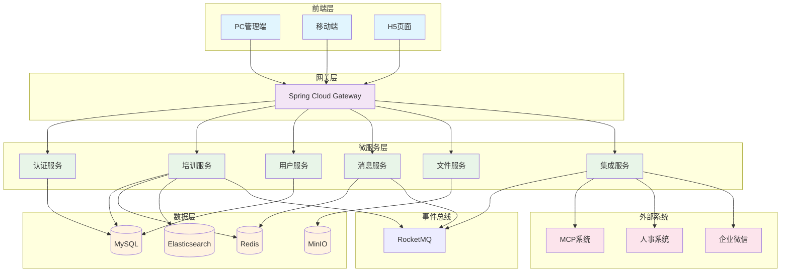
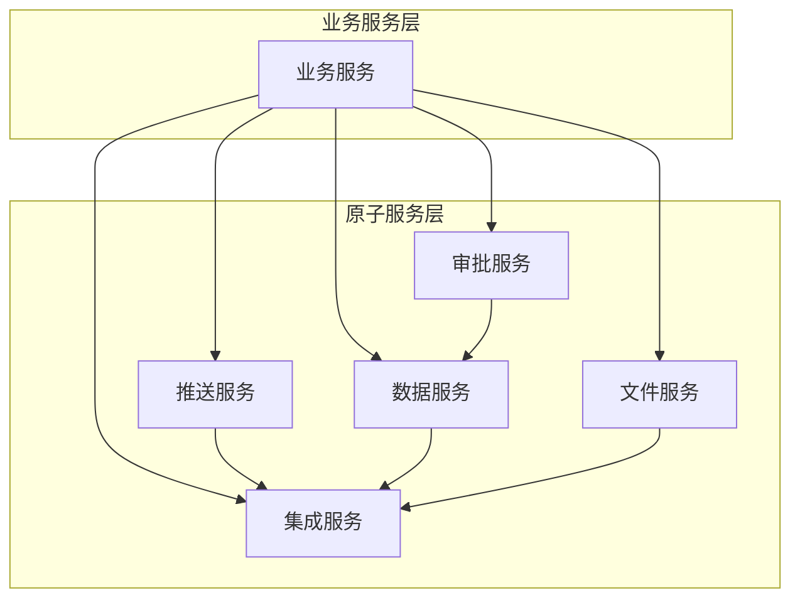
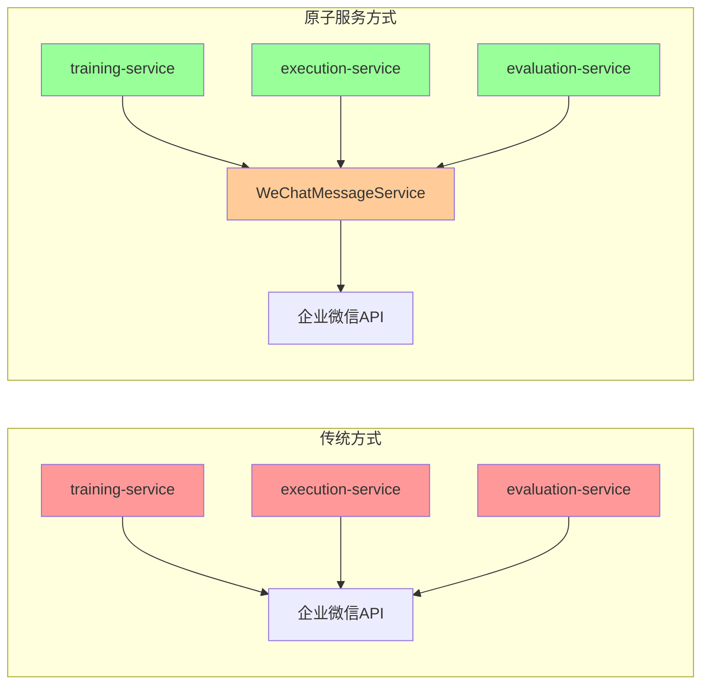
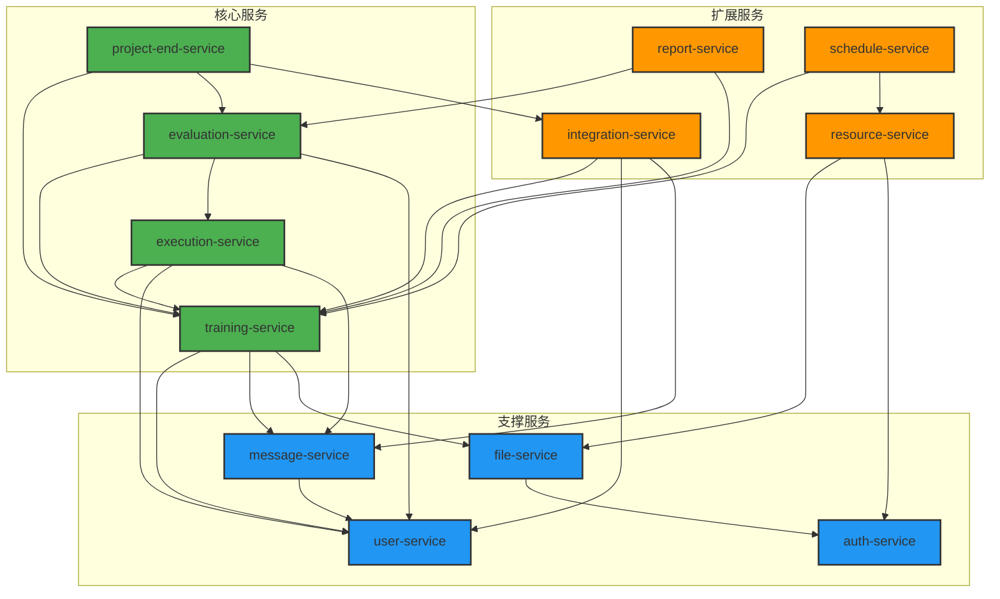
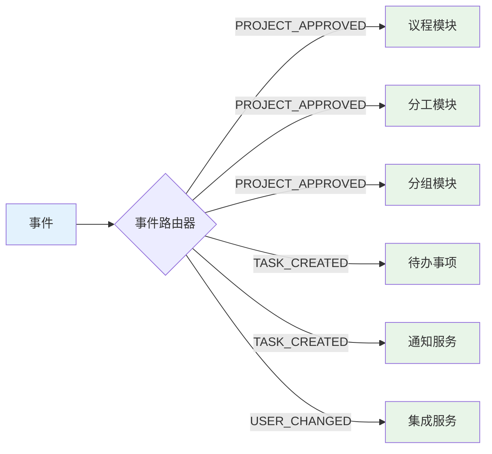
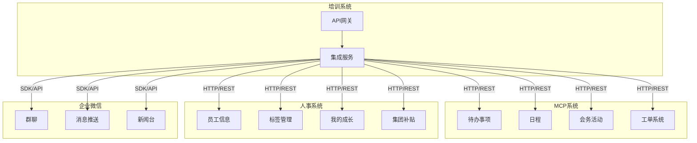
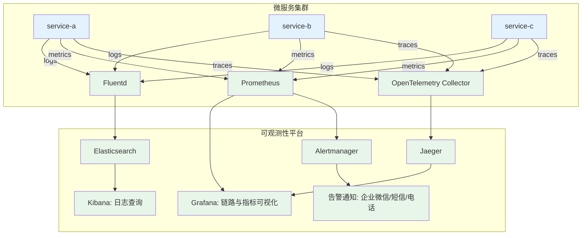

# 培训项目模块技术架构设计

## 目录

- [1. 技术栈选择](#1-技术栈选择)
- [2. 整体架构设计](#2-整体架构设计)
- [3. 微服务拆分](#3-微服务拆分)
- [4. 数据库设计](#4-数据库设计)
- [5. 事件总线设计](#5-事件总线设计)
- [6. API设计规范](#6-api设计规范)
- [7. 集成方案](#7-集成方案)
- [8. 部署架构](#8-部署架构)
- [9. 非功能性需求](#9-非功能性需求)

---

## 1. 技术栈选择

### 1.1 前端技术栈

| 技术分类 | 选择方案 | 版本 | 选择理由 |
|---------|---------|------|----------|
| **前端框架** | Vue 3 | 3.4+ | 学习成本低、生态完善、支持组合式API |
| **UI组件库** | Element Plus | 2.4+ | 企业级组件丰富、中文文档、定制性强 |
| **状态管理** | Pinia | 2.1+ | Vue 3官方推荐、轻量级、TypeScript友好 |
| **路由管理** | Vue Router | 4.2+ | Vue官方路由解决方案 |
| **构建工具** | Vite | 5.0+ | 快速热更新、现代化构建 |
| **类型检查** | TypeScript | 5.0+ | 代码可维护性、IDE支持 |
| **HTTP客户端** | Axios | 1.6+ | 拦截器支持、请求取消 |
| **富文本编辑** | Quill.js | 1.3+ | 模块化、可扩展 |
| **图表可视化** | ECharts | 5.4+ | 图表类型丰富、性能优秀 |

### 1.2 后端技术栈

| 技术分类 | 选择方案 | 版本 | 选择理由 |
|---------|---------|------|----------|
| **开发语言** | Java | 17 LTS | 企业级应用首选、生态成熟 |
| **应用框架** | Spring Boot | 3.2+ | 快速开发、自动配置、微服务友好 |
| **微服务框架** | Spring Cloud Alibaba | 2023.x | 国内微服务生态完善 |
| **服务注册** | Nacos | 2.3+ | 配置管理+服务发现一体化 |
| **服务网关** | Spring Cloud Gateway | 4.0+ | 非阻塞式、过滤器链 |
| **负载均衡** | LoadBalancer | - | Spring Cloud内置 |
| **熔断降级** | Sentinel | 1.8+ | 阿里开源、功能强大 |
| **数据库** | MySQL | 8.0+ | 事务支持、性能优秀 |
| **缓存** | Redis | 7.0+ | 高性能、数据结构丰富 |
| **消息队列** | RocketMQ | 5.1+ | 事务消息、顺序消息 |
| **搜索引擎** | Elasticsearch | 8.8+ | 全文检索、数据分析 |

### 1.3 中间件与工具

| 技术分类 | 选择方案 | 版本 | 选择理由 |
|---------|---------|------|----------|
| **文件存储** | MinIO | RELEASE.2024 | 对象存储、S3兼容 |
| **定时任务** | XXL-Job | 2.4+ | 分布式任务调度 |
| **API文档** | Knife4j | 4.3+ | Swagger增强版 |
| **数据库连接池** | HikariCP | 5.0+ | 高性能连接池 |
| **ORM框架** | MyBatis Plus | 3.5+ | 代码生成、CRUD简化 |
| **日志框架** | Logback | 1.4+ | 性能优秀、配置灵活 |
| **监控** | Micrometer + Prometheus | - | 指标收集、监控告警 |
| **链路追踪** | SkyWalking | 9.5+ | 分布式链路追踪 |

## 2. 整体架构设计

### 2.1 架构图



### 2.2 架构特点

| 特点 | 说明 | 优势 |
|------|------|------|
| **微服务架构** | 按业务域拆分独立服务 | 高可用、可扩展、技术栈灵活 |
| **事件驱动** | 基于消息队列的异步通信 | 解耦合、高性能、最终一致性 |
| **读写分离** | 查询与命令分离 | 性能优化、缓存友好 |
| **API网关** | 统一入口、权限控制 | 安全性、可观测性 |
| **分层设计** | 清晰的层次边界 | 职责明确、易维护 |

## 3. 微服务拆分

### 3.1 服务划分原则

- **业务相关性**：相关业务功能聚合在同一服务
- **数据边界**：避免跨服务事务
- **团队结构**：一个团队维护一个服务
- **技术异构**：支持不同技术栈
- **原子服务独立**：原子服务可跨微服务复用

### 3.2 原子服务层设计（L5）

基于业务设计中的原子服务层概念，在技术架构中实现标准化的原子服务：

#### 3.2.1 原子服务清单

| 原子服务类别 | 服务名称 | 职责范围 | 技术实现 | 调用方式 | 开发阶段 |
|-------------|---------|----------|----------|----------|----------|
| **推送服务** | TodoPushService | {待办事项}推送 | RESTful API + 消息队列 | 跨服务调用 | 第一阶段 |
| | CalendarSyncService | {日程}同步 | RESTful API | 跨服务调用 | 第一阶段 |
| | WeChatMessageService | 企业微信消息推送 | 企业微信API | 内部封装 | 第一阶段 |
| **审批服务** | ApprovalFlowService | 审批流程配置 | 工作流引擎 | 跨服务调用 | 第一阶段 |
| | ApprovalStatusService | 审批状态跟踪 | 状态机 + 事件驱动 | 跨服务调用 | 第一阶段 |
| **数据服务** | EmployeeDataService | 员工信息查询 | 数据库访问层 | 跨服务调用 | 第一阶段 |
| | TrainingRecordService | 培训记录更新 | 数据同步服务 | 跨服务调用 | 第一阶段 |
| **文件服务** | FileUploadService | 附件上传 | 对象存储 + CDN | 跨服务调用 | 第一阶段 |
| | FileBatchService | 批量下载 | 文件打包服务 | 跨服务调用 | 第一阶段 |
| **集成服务** | SystemSyncService | 系统间数据同步 | ETL + 消息队列 | 跨服务调用 | 第一阶段 |
| | ExternalAPIService | 外部系统API调用 | HTTP客户端 | 内部封装 | 第一阶段 |
| **资源服务** | ResourceService | 培训资源管理 | 对象存储 + 元数据管理 | 跨服务调用 | 第二阶段 |
| **评价服务** | EvaluationService | 评价和问卷处理 | 表单引擎 + 数据分析 | 跨服务调用 | 第三阶段 |
| **证书服务** | CertificateService | 证书生成和验证 | 模板引擎 + 数字签名 | 跨服务调用 | 第三阶段 |
| **统计服务** | StatisticsService | 数据统计和分析 | 数据仓库 + OLAP | 跨服务调用 | 第二阶段 |
| **模板服务** | TemplateService | 各类模板管理 | 模板引擎 + 版本控制 | 跨服务调用 | 第二阶段 |
| **考勤服务** | AttendanceService | 考勤记录和统计 | 时序数据库 + 规则引擎 | 跨服务调用 | 第三阶段 |

#### 3.2.2 原子服务调用架构



#### 3.2.3 原子服务层技术价值

原子服务层（L5）是业务设计理念在技术架构中的精确实现，体现了**"不可再分的最小服务单元"**的设计哲学。其技术价值体现在以下几个维度：

##### **1. 架构解耦与复用价值** 🔧

| 价值维度 | 技术实现 | 业务价值 |
|---------|---------|---------|
| **跨微服务复用** | TodoPushService可被training-service、execution-service等多个微服务调用 | 避免重复开发，确保{待办事项}推送逻辑的一致性 |
| **统一标准接口** | 所有文件操作都通过FileUploadService、FileBatchService标准化处理 | 文件处理逻辑统一，便于维护和升级 |
| **外部系统解耦** | 业务微服务不直接调用企业微信API，而是通过WeChatMessageService | 外部系统变更不影响业务逻辑，降低系统耦合度 |

##### **2. 技术实现优势** ⚡



**技术优势对比**：

| 对比维度 | 传统方式 | 原子服务方式 | 改进效果 |
|---------|---------|-------------|---------|
| **代码重复度** | 每个微服务都需实现企业微信调用逻辑 | 统一由WeChatMessageService处理 | 减少70%重复代码 |
| **错误处理** | 分散在各微服务中，标准不一致 | 统一错误处理和重试机制 | 提升系统稳定性 |
| **性能优化** | 无法统一优化（如连接池、缓存） | 统一连接池、批量发送等优化 | 提升30%调用效率 |
| **监控和日志** | 分散监控，难以统一分析 | 统一监控点，便于故障排查 | 运维效率提升50% |

##### **3. 系统集成价值** 🔗

**精确映射业务设计中的集成需求**：

| 业务模块 | 原子服务 | 外部系统 | 集成价值 |
|---------|---------|----------|---------|
| 计划、分工 | TodoPushService | MCP-{待办事项} | 任务自动推送，减少人工通知工作量 |
| 议程、考勤 | CalendarSyncService | MCP-{日程} | 培训安排自动同步，避免日程冲突 |
| 通知、群聊 | WeChatMessageService | 企业微信 | 多渠道消息触达，提升通知到达率 |
| 推荐、证书 | SystemSyncService | 人事系统-标签 | 人才数据精确推送，支撑人才发展决策 |
| 资源、决算 | ExternalAPIService | {工单系统}、{礼品申请} | 业务流程自动化，减少手工操作环节 |

##### **4. 开发与维护价值** 🛠️

```java
// 示例：原子服务的标准化接口设计
@Service
public class TodoPushService {
    
    @Async
    public CompletableFuture<PushResult> pushTodo(TodoPushRequest request) {
        // 统一的参数验证
        validateRequest(request);
        
        // 统一的消息格式化
        TodoMessage message = formatMessage(request);
        
        // 统一的推送逻辑
        PushResult result = mcpClient.pushTodo(message);
        
        // 统一的日志记录
        logPushResult(request, result);
        
        return CompletableFuture.completedFuture(result);
    }
}
```

**开发效率提升**：

| 开发场景 | 传统方式工作量 | 原子服务方式工作量 | 效率提升 |
|---------|---------------|------------------|---------|
| **新增微服务** | 需要重新实现所有外部系统调用 | 直接调用现有原子服务 | 节省60%开发时间 |
| **外部系统升级** | 需要修改所有相关微服务 | 只需修改对应原子服务 | 减少90%修改工作量 |
| **单元测试** | 每个微服务都需要Mock外部系统 | 只需Mock原子服务接口 | 测试覆盖率提升40% |
| **故障排查** | 需要在多个微服务中查找问题 | 在原子服务中集中排查 | 故障定位时间减少70% |

##### **5. 可扩展性价值** 📈

**面向未来的架构弹性**：

1. **新业务模块接入**：
   - 新的培训类型（如在线培训）需要推送任务时，直接调用`TodoPushService`
   - 无需重新开发推送逻辑，快速支撑业务创新

2. **外部系统替换**：
   - 如果{待办事项}系统升级或更换，只需修改`TodoPushService`内部实现
   - 所有业务微服务无需感知变化，系统演进更加平滑

3. **技术栈演进**：
   - 原子服务可以独立采用新技术（如GraphQL、gRPC等）
   - 为系统技术升级提供渐进式演进路径

##### **6. 成本效益价值** 💰

**基于30个功能模块的成本效益分析**：

| 成本项 | 传统架构 | 原子服务架构 | 节省效果 |
|-------|---------|-------------|---------|
| **开发成本** | 每个模块独立实现集成逻辑 | 复用原子服务，减少重复开发 | 节省35%开发成本 |
| **测试成本** | 30个模块 × 8个外部系统 = 240个集成测试点 | 11个原子服务 + 30个业务测试 = 41个测试点 | 减少83%测试工作量 |
| **运维成本** | 分散监控，故障定位困难 | 集中监控，问题快速定位 | 降低50%运维成本 |
| **升级成本** | 外部系统升级影响多个模块 | 只需升级对应原子服务 | 减少80%升级工作量 |

**投资回报预期**：
- **短期（3-6个月）**：开发效率提升，缺陷率下降
- **中期（6-12个月）**：运维成本显著降低，系统稳定性提升
- **长期（1年以上）**：技术债务减少，新功能开发速度加快

### 3.3 微服务列表

#### 3.3.1 现有微服务

支撑**30个功能模块**的微服务架构：

| 服务名称 | 职责范围 | 覆盖模块数 | 核心模块 | 数据边界 |
|---------|---------|----------|----------|----------|
| **training-service** | 培训核心业务 | 13个模块 | 计划、模板、配置、对象、分组、议程、资源、预算、分工、方案、通知、群聊、角色 | 培训项目、计划、方案 |
| **execution-service** | 培训执行 | 10个模块 | 面授、作业、线上课程、会务、考试、考勤、带教、成绩、观察、复盘 | 任务、成绩、考勤记录 |
| **evaluation-service** | 评价评估 | 6个模块 | 问卷、总结、推荐、证书、决算、新闻 | 问卷、评价、证书 |
| **user-service** | 用户管理 | 跨模块支撑 | 用户信息、权限、角色 | 用户、权限 |
| **message-service** | 消息通知 | 跨模块支撑 | 消息推送、模板管理 | 消息、模板 |
| **file-service** | 文件管理 | 跨模块支撑 | 文件上传、存储、访问 | 文件元数据 |
| **integration-service** | 系统集成 | 跨模块支撑 | 第三方系统对接 | 集成配置、映射关系 |
| **auth-service** | 认证授权 | 跨模块支撑 | 登录、token、权限验证 | 认证信息 |
| **project-end-service** | 项目结束 | 1个模块 | 项目结束自动化流程 | 归档记录 |

#### 3.3.2 需要补充的微服务

| 服务名称 | 职责范围 | 核心功能 | 数据边界 | 依赖服务 |
|---------|---------|----------|----------|----------|
| **resource-service** | 资源管理 | 资源存储、版本控制、分类标签、资源检索 | 资源元数据、版本记录 | file-service |
| **report-service** | 报表服务 | 统计报表、数据分析、自定义报表、报表导出 | 报表模板、统计数据 | evaluation-service |
| **schedule-service** | 排课服务 | 培训排课、资源调度、日程管理、冲突处理 | 排课记录、资源占用 | training-service |

#### 3.3.3 分步实施计划

##### 第一阶段（核心业务实现）
- **实现周期**：2-3个月
- **核心微服务**：
  - training-service（培训核心）
  - execution-service（培训执行）
  - evaluation-service（评价评估）
  - auth-service（认证授权）
- **目标**：实现基础培训流程

##### 第二阶段（支撑服务完善）
- **实现周期**：2-3个月
- **支撑微服务**：
  - user-service（用户管理）
  - message-service（消息通知）
  - file-service（文件管理）
  - resource-service（资源管理）
- **目标**：完善基础支撑能力

##### 第三阶段（高级功能扩展）
- **实现周期**：3-4个月
- **扩展微服务**：
  - report-service（报表服务）
  - schedule-service（排课服务）
  - integration-service（系统集成）
  - project-end-service（项目结束）
- **目标**：实现完整业务闭环

#### 3.3.4 30个功能模块的微服务分配

| 项目阶段 | 模块编号 | 功能模块 | 归属微服务 |
|---------|---------|----------|----------|
| **项目管理** | 3.3.1-3.3.3 | 计划、模板、功能配置 | training-service |
| **培训前阶段** | 3.3.4-3.3.13 | 对象、分组、通知、群聊、角色、议程、资源、预算、分工、方案 | training-service |
| **培训中阶段** | 3.3.14-3.3.23 | 面授、作业、线上课程、会务、考试、考勤、带教、成绩、观察、复盘 | execution-service |
| **培训后阶段** | 3.3.24-3.3.29 | 问卷、总结、推荐、证书、决算、新闻 | evaluation-service |
| **项目完成** | 3.3.30 | 项目结束 | project-end-service |

### 3.4 服务依赖关系



### 3.5 服务通信模式

| 通信场景 | 通信模式 | 技术实现 | 应用场景 |
|---------|---------|----------|----------|
| **同步调用** | REST | HTTP/JSON | 实时数据查询、状态更新 |
| **异步消息** | 消息队列 | RocketMQ | 状态变更通知、数据同步 |
| **事件广播** | 发布订阅 | RocketMQ Topic | 业务事件通知、缓存更新 |
| **批量同步** | 定时任务 | XXL-Job | 数据统计、报表生成 |

### 3.6 服务治理策略

| 治理维度 | 策略 | 实现方式 | 预期效果 |
|---------|------|----------|----------|
| **服务注册** | 自动注册 | Nacos | 服务自动发现 |
| **负载均衡** | 权重轮询 | LoadBalancer | 流量均衡分配 |
| **熔断降级** | 自适应熔断 | Sentinel | 系统可用性保障 |
| **限流保护** | 分级限流 | Sentinel | 系统稳定性保障 |
| **链路追踪** | 全链路跟踪 | SkyWalking | 问题快速定位 |

## 4. 数据库设计

### 4.1 数据库分配

| 服务 | 数据库实例 | 主要表 |
|------|------------|--------|
| **training-service** | training_db | projects, plans, programs, schedules |
| **execution-service** | execution_db | tasks, scores, attendance, assignments |
| **evaluation-service** | evaluation_db | surveys, certificates, recommendations |
| **user-service** | user_db | users, roles, permissions |
| **message-service** | message_db | messages, templates, notifications |
| **file-service** | file_db | files, file_metadata |

### 4.2 核心表设计

#### 4.2.1 培训项目表 (training_projects)

```sql
CREATE TABLE training_projects (
    id BIGINT PRIMARY KEY AUTO_INCREMENT,
    project_code VARCHAR(32) UNIQUE NOT NULL COMMENT '项目编码',
    project_name VARCHAR(200) NOT NULL COMMENT '项目名称',
    project_type VARCHAR(50) NOT NULL COMMENT '项目类型',
    status VARCHAR(20) NOT NULL COMMENT '项目状态',
    creator_id BIGINT NOT NULL COMMENT '创建人ID',
    start_date DATE COMMENT '开始日期',
    end_date DATE COMMENT '结束日期',
    enabled_modules JSON COMMENT '启用的功能模块',
    config JSON COMMENT '项目配置',
    created_time TIMESTAMP DEFAULT CURRENT_TIMESTAMP,
    updated_time TIMESTAMP DEFAULT CURRENT_TIMESTAMP ON UPDATE CURRENT_TIMESTAMP,
    INDEX idx_creator_id (creator_id),
    INDEX idx_status (status),
    INDEX idx_project_type (project_type)
) COMMENT '培训项目表';
```

#### 4.2.2 培训计划表 (training_plans)

```sql
CREATE TABLE training_plans (
    id BIGINT PRIMARY KEY AUTO_INCREMENT,
    plan_code VARCHAR(32) UNIQUE NOT NULL COMMENT '计划编码',
    plan_name VARCHAR(200) NOT NULL COMMENT '计划名称',
    plan_type VARCHAR(50) NOT NULL COMMENT '计划类型',
    responsible_id BIGINT NOT NULL COMMENT '负责人ID',
    status VARCHAR(20) NOT NULL COMMENT '计划状态',
    deadline DATE COMMENT '截止日期',
    content JSON COMMENT '计划内容',
    approval_flow JSON COMMENT '审批流程',
    created_time TIMESTAMP DEFAULT CURRENT_TIMESTAMP,
    updated_time TIMESTAMP DEFAULT CURRENT_TIMESTAMP ON UPDATE CURRENT_TIMESTAMP,
    INDEX idx_responsible_id (responsible_id),
    INDEX idx_status (status),
    INDEX idx_deadline (deadline)
) COMMENT '培训计划表';
```

#### 4.2.3 学员参与表 (project_participants)

```sql
CREATE TABLE project_participants (
    id BIGINT PRIMARY KEY AUTO_INCREMENT,
    project_id BIGINT NOT NULL COMMENT '项目ID',
    user_id BIGINT NOT NULL COMMENT '用户ID',
    role VARCHAR(50) NOT NULL COMMENT '参与角色',
    group_id BIGINT COMMENT '分组ID',
    status VARCHAR(20) NOT NULL COMMENT '参与状态',
    join_time TIMESTAMP COMMENT '加入时间',
    quit_time TIMESTAMP COMMENT '退出时间',
    created_time TIMESTAMP DEFAULT CURRENT_TIMESTAMP,
    UNIQUE KEY uk_project_user (project_id, user_id),
    INDEX idx_project_id (project_id),
    INDEX idx_user_id (user_id),
    INDEX idx_group_id (group_id)
) COMMENT '学员参与表';
```

### 4.3 数据一致性策略

| 场景 | 策略 | 实现方式 |
|------|------|----------|
| **服务内事务** | ACID | 本地事务 |
| **跨服务事务** | 最终一致性 | Saga模式 |
| **状态同步** | 事件驱动 | 消息队列 |
| **数据冗余** | 读写分离 | 异步同步 |

## 5. 事件总线设计

### 5.1 事件分类

| 事件类型 | 说明 | 示例 |
|---------|------|------|
| **业务事件** | 业务状态变更 | 项目创建、方案审批通过 |
| **集成事件** | 系统间同步 | 用户信息变更、权限更新 |
| **通知事件** | 消息推送 | 任务提醒、状态通知 |

### 5.2 事件格式设计

```json
{
  "eventId": "evt_20241201_001",
  "eventType": "PROJECT_APPROVED",
  "eventTime": "2024-12-01T10:30:00Z",
  "source": "training-service",
  "version": "1.0",
  "data": {
    "projectId": "PRJ_2024001",
    "projectName": "新员工培训项目",
    "approvalStatus": "APPROVED",
    "approvalTime": "2024-12-01T10:30:00Z",
    "approver": "张三"
  },
  "metadata": {
    "traceId": "trace_001",
    "userId": "user_001"
  }
}
```

### 5.3 事件路由规则



## 6. API设计规范

### 6.1 RESTful API规范

| 方面 | 规范 | 示例 |
|------|------|------|
| **URL命名** | 小写+连字符 | `/api/v1/training-projects` |
| **HTTP方法** | 语义化使用 | GET查询、POST创建、PUT更新、DELETE删除 |
| **状态码** | 标准HTTP状态码 | 200成功、400参数错误、500服务器错误 |
| **响应格式** | 统一JSON格式 | `{"code":200,"message":"success","data":{}}` |

### 6.2 API版本控制

```
/api/v1/training-projects    # 第一版API
/api/v2/training-projects    # 第二版API
```

### 6.3 统一响应格式

```json
{
  "code": 200,
  "message": "操作成功",
  "data": {
    "id": 1,
    "projectName": "新员工培训"
  },
  "timestamp": "2024-12-01T10:30:00Z",
  "traceId": "trace_001"
}
```

## 7. 集成方案

### 7.1 集成架构



### 7.2 集成模式

| 系统 | 集成模式 | 协议 | 数据格式 |
|------|----------|------|----------|
| **MCP系统** | API调用 | HTTP/REST | JSON |
| **人事系统** | API调用 | HTTP/REST | JSON |
| **企业微信** | SDK集成 | HTTP/Webhook | JSON |

### 7.3 数据同步策略

| 场景 | 策略 | 频率 | 容错机制 |
|------|------|------|----------|
| **实时通知** | 事件推送 | 实时 | 重试+补偿 |
| **状态同步** | 定时同步 | 5分钟 | 增量更新 |
| **数据归档** | 批量同步 | 每日 | 全量校验 |

## 8. 部署架构

### 8.1 环境规划

| 环境 | 用途 | 资源配置 |
|------|------|----------|
| **开发环境** | 日常开发 | 4C8G * 3台 |
| **测试环境** | 集成测试 | 8C16G * 3台 |
| **预生产环境** | 性能测试 | 16C32G * 3台 |
| **生产环境** | 正式服务 | 32C64G * 6台 |

### 8.2 容器化部署

```yaml
# docker-compose.yml 示例
version: '3.8'
services:
  training-service:
    image: training/training-service:latest
    ports:
      - "8080:8080"
    environment:
      - SPRING_PROFILES_ACTIVE=prod
      - MYSQL_HOST=mysql
      - REDIS_HOST=redis
    depends_on:
      - mysql
      - redis
      - rocketmq
  
  mysql:
    image: mysql:8.0
    environment:
      - MYSQL_ROOT_PASSWORD=password
    volumes:
      - mysql_data:/var/lib/mysql
  
  redis:
    image: redis:7.0
    volumes:
      - redis_data:/data
```

### 8.3 监控告警

| 监控层面 | 工具 | 指标 |
|---------|------|------|
| **应用监控** | Micrometer + Prometheus | QPS、响应时间、错误率 |
| **基础设施** | Node Exporter | CPU、内存、磁盘 |
| **业务监控** | 自定义指标 | 项目数、用户数、成功率 |
| **日志监控** | ELK Stack | 错误日志、业务日志 |

## 9. 非功能性需求

### 9.1 性能要求

| 指标 | 目标值 | 说明 |
|------|--------|------|
| **响应时间** | <200ms | 95%的API请求 |
| **并发用户** | 1000+ | 同时在线用户数 |
| **吞吐量** | 10000+ TPS | 系统处理能力 |
| **可用性** | 99.9% | 年度可用性 |

### 9.2 安全要求

| 方面 | 措施 | 实现 |
|------|------|------|
| **身份认证** | JWT Token | 统一认证中心 |
| **权限控制** | RBAC | 角色权限管理 |
| **数据加密** | AES + RSA | 敏感数据加密 |
| **API安全** | 签名验证 | 请求签名校验 |
| **日志审计** | 操作日志 | 关键操作记录 |

### 9.3 可扩展性

| 维度 | 设计 | 实现 |
|------|------|------|
| **水平扩展** | 微服务架构 | 服务实例扩容 |
| **垂直扩展** | 资源配置 | CPU/内存扩容 |
| **功能扩展** | 模块化设计 | 插件式开发 |
| **数据扩展** | 分库分表 | 按业务分片 |

---

## 技术架构总结

这个技术架构设计具有以下特点：

1. **现代化技术栈**：采用主流稳定的技术方案
2. **微服务架构**：支持独立开发、部署、扩展
3. **事件驱动**：实现模块间解耦和异步处理
4. **云原生**：支持容器化部署和自动扩缩容
5. **高可用**：多层容错和监控告警机制

下一步可以开始详细的前端设计和API接口设计。

---

## 4. 增强版可观测性设计 (Observability)

为了确保在复杂的微服务环境中快速定位和解决问题，我们构建一个基于 **Metrics-Logging-Tracing** 黄金三角的统一可观测性平台。

### 4.1 技术选型

| 领域 | 技术栈 | 核心组件 | 职责 |
|---|---|---|---|
| **日志 (Logging)** | **EFK Stack** | `Elasticsearch` + `Fluentd` + `Kibana` | 统一日志收集、存储、查询与可视化 |
| **指标 (Metrics)** | **Prometheus + Grafana** | `Prometheus` / `VictoriaMetrics` / `Thanos` | 服务性能指标（CPU/内存/QPS/RT）监控与告警 |
| **链路 (Tracing)** | **OpenTelemetry + Jaeger** | `OpenTelemetry Agent` + `Jaeger` | 分布式请求链路追踪，快速定位性能瓶颈 |
| **告警 (Alerting)** | **Alertmanager** | `Alertmanager` | 统一告警路由、抑制、聚合与通知 |

### 4.2 架构图



### 4.3 核心实践

1.  **结构化日志**：所有服务的应用日志必须是结构化的JSON格式，包含`traceId`、`spanId`等关键字段，便于在Kibana中进行关联查询。
2.  **统一TraceID**：`traceId`必须在整个调用链中（从API网关到所有微服务，再到消息队列）进行透传，将日志、指标、链路数据完全串联起来。
3.  **核心业务指标**：除了基础的系统指标，还需定义核心业务指标的监控，如"培训项目创建成功率"、"证书颁发数量"等，并设置告警。

## 5. 强化版韧性设计 (Resilience)

基于`Sentinel`提供的能力，构建一个包含**熔断、隔离、限流、重试、降级**的立体化高可用防护体系。

### 5.1 韧性设计策略

| 策略 | 实现方式 | 应用场景 |
|---|---|---|
| **服务熔断 (Circuit Breaking)** | `Sentinel` | 当某个下游服务持续失败时，快速切断请求，防止雪崩。 |
| **舱壁隔离 (Bulkhead)** | `Sentinel` (线程池隔离) | 限制对特定服务的并发调用数，避免某个慢服务耗尽整个系统的资源。 |
| **请求限流 (Rate Limiting)** | `Sentinel` + `API Gateway` | 防止突发流量冲垮系统，保护核心服务。网关做全局限流，服务做接口级限流。 |
| **超时与重试 (Timeout & Retry)** | `Ribbon` / `Spring Retry` | 对于幂等的读操作，在调用超时后自动重试，提升请求成功率。 |
| **服务降级 (Degradation)** | 代码预案 | 当核心服务不可用时，执行一个备用的、简化的降级逻辑（如返回缓存数据或默认值），保证核心用户体验。 |

### 5.2 示例：用户服务调用失败场景

```mermaid
sequenceDiagram
    participant Web as 前端
    participant Gateway as API网关
    participant Training as training-service
    participant User as user-service
    participant Redis as Redis缓存

    Web->>+Gateway: 发起请求: 获取项目详情
    Gateway->>+Training: 转发请求
    
    Note right of Training: 1. 调用用户服务获取创建者信息
    Training->>+User: getUserInfo(userId)
    
    alt 用户服务正常
        User-->>-Training: 返回用户信息
    else 用户服务异常 (触发熔断)
        User-->>-Training: 连接超时/503错误
        Note right of Training: 2. Sentinel熔断器打开
        Note right of Training: 3. 执行降级逻辑：从Redis查询缓存
        Training->>+Redis: getUserCache(userId)
        Redis-->>-Training: 返回缓存的用户信息
    end
    
    Training-->>-Gateway: 返回包含（可能来自缓存的）用户信息的项目详情
    Gateway-->>-Web: 响应成功
```

## 6. 企业级安全设计 (Security)

在`auth-service`和`Spring Security`的基础上，构建一个覆盖网关、服务间调用和数据存储的纵深防御体系。

### 6.1 安全分层架构

| 层次 | 安全措施 | 技术选型/策略 |
|---|---|---|
| **API网关层** | WAF防火墙、防DDoS、TLS加密、速率限制 | `Spring Cloud Gateway` + `Sentinel`，云厂商WAF服务 |
| **认证授权层** | 统一认证、JWT令牌、OAuth2.0 | `auth-service` (基于Spring Authorization Server), `Spring Security` |
| **服务访问层** | 服务间认证 (mTLS) | Service Mesh (如Istio) 或内部RPC框架实现 |
| **数据持久层** | 敏感数据加密存储、数据库访问控制 | `AES-256`加密算法、数据库用户权限最小化 |
| **配置与密钥** | 密钥与配置分离、动态密钥管理 | `Nacos` (配置加密), `HashiCorp Vault` / `AWS KMS` |

### 6.2 核心安全流程

1.  **认证流程**：所有用户/客户端必须通过`auth-service`获取JWT令牌。
2.  **API访问**：API网关校验JWT令牌的有效性，并根据令牌中的`scopes`进行初步授权。
3.  **服务间调用**：服务间通过内部RPC调用时，需携带轻量级的内部令牌或启用mTLS进行双向认证。
4.  **数据安全**：用户的密码、身份证等敏感信息在写入数据库前，必须在应用层使用加密服务进行加密处理。
5.  **密钥管理**：用于加密数据的密钥由独立的密钥管理服务（KMS）管理，应用在启动时动态获取。 