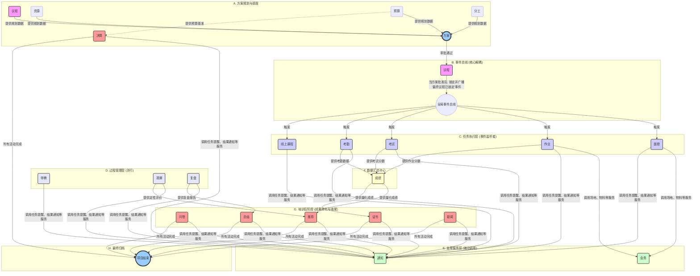
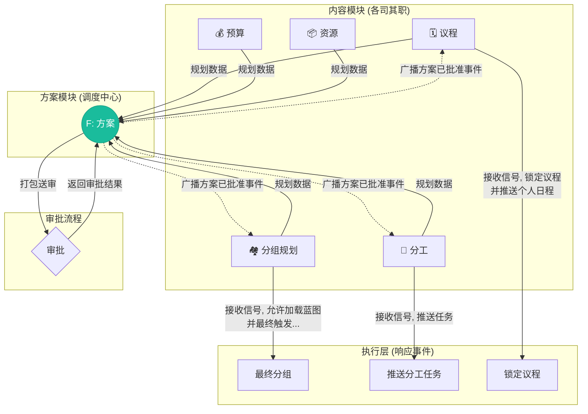

# 培训项目模块设计说明书

## 目录

- [1. 概述](#1-概述)
- [2. 业务流程](#2-业务流程)
- [3. 功能设计](#3-功能设计)
  - [3.1 层级架构设计](#31-层级架构设计)
  - [3.2 功能模块](#32-功能模块)
  - [3.3 详细设计](#33-详细设计)
- [4. 系统集成](#4-系统集成)
  - [4.1 与MCP系统集成](#41-与mcp系统集成)
  - [4.2 与人事系统集成](#42-与人事系统集成)
  - [4.3 与企业微信集成](#43-与企业微信集成)
- [5. 定义](#5-定义)
---

### 1. 概述

**培训项目模块**负责培训项目的全生命周期管理，是演寂书院培训系统四大核心模块之一。该模块通过模块化架构设计，支持从项目规划到完成归档的完整流程管理。

- **功能模块独立性**：每个功能模块都可以独立运行，互不干扰
- **灵活组合配置**：教务人员可根据具体培训项目的特点、规模和需求，自由选择启用的功能模块
- **动态界面呈现**：未选择的模块不会出现在操作界面中，保持界面简洁
- **标准化与个性化并重**：既保证了系统的标准化，又提供了充分的灵活性
- **可扩展架构**：新功能模块可以无缝集成到现有体系中

### 2.业务流程

```mermaid
graph TD;
    %% 计划管理阶段
    subgraph PlanPhase["🔸 计划管理阶段"]
        direction TB
        
        %% 两种项目启动方式
        Start[教务直接创建培训项目]
        PlanRoute[基于年度计划的项目启动] --> PlanCreate[教务创建计划收集任务]
        
        %% 计划制定流程
        PlanCreate --> PlanShare[负责人分享给协作人]
        PlanShare --> PlanCollaborate[协作式计划填写]
        PlanCollaborate --> PlanIntegrate[负责人汇总整合]
        
        %% 审批流程
        PlanIntegrate --> PlanApproval{计划审批}
        PlanSchedule[推送到负责人日程]
        PlanRevise[修改计划]
        
        %% 审批结果分支
        PlanApproval -->|审批通过| PlanSchedule
        PlanApproval -->|审批拒绝| PlanRevise
        
        %% 主流程继续
        PlanSchedule --> PlanReminder[计划提醒触发]
        PlanReminder --> PlanGenProject[负责人根据计划创建项目]
        
        %% 修改循环
        PlanRevise --> PlanIntegrate
    end
    
    %% 两种启动方式都进入项目配置
    Start --> Config[项目配置阶段]
    PlanGenProject --> Config
    
    %% 项目配置阶段
    subgraph ConfigPhase["🔸 项目配置阶段"]
        direction LR
        BasicInfo[基本信息设置] --> SelectTemplate[项目模板选择<br/>（含各类模板：项目、资源、消息、证书等）]
        SelectTemplate --> ModuleSelection[功能模块选择<br/>（含各种功能：方案、分工、预算、资源、日程等）]
        ModuleSelection --> ApprovalSetup[审批流程设置<br/>（含计划审批设置）]
    end
    
    Config --> ConfigPhase
    ConfigPhase --> PreStart[进入培训前阶段]
    
    %% 培训前阶段
    subgraph PrePhase["🔸 培训前阶段"]
        direction TB
        
        PreStart --> ModeDecision{是否启用方案功能?}
        
        %% 核心必选流程与方案子模块并行布局
        ModeDecision --> PD_Selection[🎯 对象] --> PD_Grouping[🏘 分组]
        ModeDecision -.->|如启用方案| PD_Schedule[🗓️ 日程]
        ModeDecision -.->|如启用方案| PD_Budget[💰 预算]
        ModeDecision -.->|如启用方案| PD_Resource[📦 资源]
        ModeDecision -.->|如启用方案| PD_Division[👥 分工]
        
        %% 方案汇总（多输入单输出）
        PD_Schedule -.-> PD_Proposal[📋 汇总形成完整方案]
        PD_Budget -.-> PD_Proposal
        PD_Resource -.-> PD_Proposal
        PD_Division -.-> PD_Proposal
        PD_Grouping -.->|方案模式| PD_Proposal
        
        %% 执行路径分支与汇合
        PD_Proposal -.-> ProposalApproval{📋 方案审批<br/>（按配置的审批流程）}
        ProposalApproval -.->|审批通过| ExecutionStart[开始执行阶段]
        ProposalApproval -.->|审批拒绝| ProposalRevision[📝 修改方案]
        ProposalRevision -.-> PD_Proposal
        PD_Grouping -->|直接模式| ExecutionStart
        
        %% 方案审批后的自动化任务（不包括培训中任务）
        ExecutionStart -.->|如有方案子模块| PE_AutoTasks[触发自动化任务]
        PE_AutoTasks -.->|如启用分工| PE_Todo[--> 推送待办]
        PE_AutoTasks -.->|如启用资源| PE_WorkOrder[--> 推送工单]
        
        %% 通知发送
        ExecutionStart --> Notification[📢 通知发送<br/>（如启用消息：使用自定义模板）]
        
        %% 人员管理流程链式连接
        Notification --> StudentAccept{学员接受确认}
        StudentAccept -->|接受| GroupSetup[💬 组群设置<br/>（如启用群聊：创建企业微信群）]
        StudentAccept -->|拒绝| RejectReason[📝 填写拒绝理由]
        RejectReason --> LeaveCheck{是否设置了请假审批？}
        LeaveCheck -->|是| LeaveApproval[📋 提交请假审批<br/>（按配置的审批流程）]
        LeaveCheck -->|否| RejectRecord[记录拒绝状态]
        LeaveApproval --> ApprovalResult{审批结果}
        ApprovalResult -->|通过| GroupSetup
        ApprovalResult -->|拒绝| RejectRecord
        RejectRecord --> PreComplete
        
        GroupSetup --> AddToSchedule[📅 加入学员日程] --> RoleAssignTask[👑 下发角色选举任务<br/>（进入小组成员待办事项）] --> PreComplete[培训前准备完成]
        
    end
    
    %% 培训中阶段
    PreComplete --> DuringStart[进入培训中阶段]
    
    subgraph DuringPhase["🔸 培训中阶段"]
        direction TB
        
        %% 日程驱动培训中任务
        PD_Schedule --> TaskManagementCategory
        
        DuringStart --> TaskManagementCategory[📚 任务管理类功能]
        DuringStart --> TrainingManagementCategory[🎯 培训管理类功能]
        
        %% 任务管理类功能模块
        TaskManagementCategory --> FaceToFace[面授任务:<br/>（可由日程自动生成）<br/>通知讲师上传课件<br/>安排会务活动]
        TaskManagementCategory --> Assignment[作业任务:<br/>（展示环节可由日程生成）<br/>作业下发→学员提交<br/>支持批量下载<br/>现场展示安排]
        TaskManagementCategory --> OnlineCourse[线上课程:<br/>选择知识分享课程<br/>分配给学员]
        TaskManagementCategory --> MeetingActivity[会务活动:<br/>包括面授和作业（现场展示）<br/>启动会务活动系统]
        
        %% 培训管理类功能模块
        TrainingManagementCategory --> AttendanceManagement[签到管理:<br/>多种签到方式<br/>出勤统计分析<br/>异常处理机制]
        TrainingManagementCategory --> TutorManagement[带教管理:<br/>阶段设置+全局设置<br/>不同阶段带教老师<br/>师徒互评+带教标准]
        TrainingManagementCategory --> ScoreManagement[成绩管理:<br/>按科目录入成绩<br/>成绩排名<br/>推送给相关人员]
        TrainingManagementCategory --> ObserveManagement[观察管理:<br/>每日观察记录<br/>总观察记录<br/>一键下载记录]
        TrainingManagementCategory --> ReviewManagement[复盘管理:<br/>多个复盘报告<br/>在线预览]
        
        TaskManagementCategory --> Exam[考试任务:<br/>从题库抽题/手动上传<br/>在线考试与批改<br/>成绩自动归档]

        FaceToFace --> DuringComplete[培训中阶段完成]
        Assignment --> DuringComplete
        OnlineCourse --> DuringComplete
        MeetingActivity --> DuringComplete
        Exam --> DuringComplete
        AttendanceManagement --> DuringComplete
        TutorManagement --> DuringComplete
        ScoreManagement --> DuringComplete
        ObserveManagement --> DuringComplete
        ReviewManagement --> DuringComplete
    end
    
    %% 培训后阶段
    DuringComplete --> PostStart[进入培训后阶段]
    
    subgraph PostPhase["🔸 培训后阶段"]
        direction TB
        PostStart --> OptionalModules[🔧 可选功能模块]
        PostStart --> CommonModules[📋 常用功能模块]
        
        %% 可选功能模块
        OptionalModules -.->|如启用决算| Settlement[💰 决算]
        OptionalModules -.->|如启用新闻| NewsModule[📰 新闻]
        
        Settlement -.-> SettlementFlow[推送决算单给负责人<br/>填写实际开支<br/>获取礼品申请金额]
        NewsModule -.-> NewsFlow[H5编辑器编辑新闻<br/>新闻审批流程<br/>推送到新闻台]
        
        %% 常用功能模块（项目必选）
        CommonModules --> Survey[📝 问卷]
        CommonModules --> ProjectSummary[📑 总结]
        CommonModules --> TalentRecommend[🌟 推荐]
        CommonModules --> Certificate[🏆 证书]
        
        Survey --> SurveyFlow[选择调研模板<br/>推送到待办事项<br/>一键下载结果]
        ProjectSummary --> SummaryFlow[复盘报告<br/>精彩瞬间<br/>视频照片分享]
        TalentRecommend --> RecommendFlow[辅导员推荐名单<br/>教务确定最终名单]
        Certificate --> CertFlow[选择证书模板<br/>批量颁发证书<br/>证书管理服务]
        
        SettlementFlow -.-> PostComplete[培训后阶段完成]
        NewsFlow -.-> PostComplete
        SurveyFlow --> PostComplete
        SummaryFlow --> PostComplete
        RecommendFlow --> PostComplete
        CertFlow --> PostComplete
    end
    
    %% 项目完成层
    PostComplete --> ProjectEnd[项目结束]
    ProjectEnd --> AutoTrigger[🔄 系统自动触发]
    
    AutoTrigger --> HRPush[推送人才名单到人事系统-标签]
    AutoTrigger --> TrainingUpdate[更新员工信息-培训记录]
    AutoTrigger --> GrowthUpdate[同步到我的成长模块]
    AutoTrigger --> PlanStatusUpdate[更新计划状态为执行完毕]
    
    HRPush --> FinalComplete[✅ 项目完成归档]
    TrainingUpdate --> FinalComplete
    GrowthUpdate --> FinalComplete
    PlanStatusUpdate --> FinalComplete
    
    %% 样式设置
    style FinalComplete fill:#27ae60,stroke:#2ecc71,color:#fff
    style AutoTrigger fill:#1abc9c,stroke:#16a085,color:#fff
    
    %% 阶段样式
    style PlanPhase fill:transparent,stroke:#e67e22,stroke-width:3px
    style ConfigPhase fill:transparent,stroke:#2ecc71,stroke-width:3px
    style PrePhase fill:transparent,stroke:#3498db,stroke-width:3px
    style DuringPhase fill:transparent,stroke:#f39c12,stroke-width:3px  
    style PostPhase fill:transparent,stroke:#9b59b6,stroke-width:3px
    
       
    %% 关键节点样式
    style PreComplete fill:#3498db,stroke:#2980b9,color:#fff
    style DuringComplete fill:#f39c12,stroke:#e67e22,color:#fff
    style PostComplete fill:#9b59b6,stroke:#8e44ad,color:#fff
    style ProjectEnd fill:#34495e,stroke:#2c3e50,color:#fff
    
    %% 分类样式
    classDef optional fill:#ecf0f1,stroke:#95a5a6,color:#2c3e50
    classDef required fill:#2c3e50,stroke:#34495e,color:#fff
    classDef process fill:#ffffff,stroke:#bdc3c7,color:#2c3e50
    classDef decision fill:#f8f9fa,stroke:#6c757d,color:#495057
    classDef automation fill:#ff9500,stroke:#e67e22,color:#fff
    classDef approval fill:#ff69b4,stroke:#e91e63,color:#fff
    
    class PD_Schedule,PD_Budget,PD_Resource,PD_Division,Settlement,NewsModule,OptionalModules optional
    class PD_Selection,PD_Grouping,Notification,GroupSetup,Survey,ProjectSummary,TalentRecommend,Certificate,CommonModules,Start required
    class ExecutionStart,PE_Todo,PE_WorkOrder,PD_Proposal,AddToSchedule,RoleAssignTask,PlanCreate,PlanShare,PlanCollaborate,PlanIntegrate,PlanSchedule,PlanStatusUpdate,BasicInfo,SelectTemplate,ModuleSelection,ApprovalSetup process
    class ModeDecision,LeaveCheck decision
    class PE_AutoTasks automation
    class ProposalApproval,StudentAccept,ApprovalResult,PlanApproval approval
    class PlanRevise process
    class RejectReason,LeaveApproval,RejectRecord,ProposalRevision process
    class TaskManagementCategory,TrainingManagementCategory required
    class FaceToFace,Assignment,OnlineCourse,MeetingActivity,TutorManagement,ScoreManagement,ObserveManagement,ReviewManagement process
    class SettlementFlow,NewsFlow,SurveyFlow,SummaryFlow,RecommendFlow,CertFlow process
```

## 3. 功能设计
培训项目模块采用**模块化拼搭**设计理念，通过"项目阶段→功能模块→子模块→功能点→原子服务层"五层颗粒度不断拆解，将复杂的培训业务分解为最小可配置单元，支持积木式灵活组合。用户可根据培训场景从模板库选择标准组合，也可个性化定制模块配置，实现从简单到复杂培训项目的快速搭建和精准控制。

### 3.1 层级架构设计

培训项目模块采用"项目阶段→功能模块→子模块→功能点→原子服务层"五层颗粒度拆解方法，实现复杂培训业务的精细化管理和灵活组装：

| 层级 | 内容说明 | 具体内容 | 特点 |
|------|----------|----------|------|
| **L1 项目阶段** | 培训项目的主要业务阶段 | 1.项目管理 2.培训前阶段 3.培训中阶段 4.培训后阶段 5.项目完成 | 业务主线，反映培训全生命周期 |
| **L2 功能模块** | 各阶段内的核心功能单元 | 项目管理：计划、模板、配置 培训前：对象、分组、通知、组群、角色、议程、资源、预算、分工、方案 培训中：面授、作业、线上课程、会务、考试、考勤、带教、成绩、观察、复盘 培训后：问卷、总结、推荐、证书、决算、新闻 项目完成：项目结束 | 可独立运行，支持模块化配置 |
| **L3 子模块** | 功能模块内的业务分类 | 如计划管理包含：计划制定、计划执行、计划管理 如考勤包含：功能启用设置、签到任务创建、多方式签到等 | 逻辑分组，便于业务理解 |
| **L4 功能点** | 子模块下的具体功能操作 | 如计划制定包含：类型设置、计划分享、协作填写、计划汇总、计划收集、计划审批 如签到任务创建包含：时间设置、方式配置、规则制定等 | 最小业务单元，直接面向用户操作 |
| **L5 原子服务层** | 功能点调用的底层服务 | 推送服务：{待办事项}推送、{日程}同步、企业微信消息 审批服务：审批流程配置、审批状态跟踪 数据服务：员工信息查询、培训记录更新 文件服务：附件上传、批量下载 集成服务：系统间数据同步 | 技术实现层，支撑功能点运行 |

### 3.2 功能模块

培训项目模块按照培训全生命周期分为5个项目阶段，共包含30个功能模块。各阶段功能模块采用模块化设计，支持按需启用和灵活配置：

| 项目阶段 | 章节序号 | 功能模块 | 模块类型 | 核心作用 | 配置方式 | 系统集成 |
|---------|:---:|---------|---------|----------|----------|----------|
| **项目管理** | 3.3.1 | **计划** | 必选基础 | 实现培训计划的协作制定、审批流程和执行管理，支持年度计划驱动的项目启动 | 系统预设，支持审批流程配置 | {待办事项}、{日程} |
| | 3.3.2 | **模板** | 必选基础 | 提供消息、群聊、日程等各类模板库，支持项目模板的创建和复用 | 系统预设+用户自定义 | 各功能模块调用 |
| | 3.3.3 | **功能配置** | 必选基础 | 项目创建时的功能模块选择和参数配置，决定项目的功能范围 | 项目创建时配置 | 影响后续所有模块 |
| **培训前阶段** | 3.3.4 | **对象** | 必选基础 | 确定参训学员范围，支持筛选和主动选择 | 必选，项目创建时配置 | 员工信息系统 |
| | 3.3.5 | **分组** | 必选基础 | 学员分组设置和辅导员分配，为后续功能提供基础 | 可选，对象确定后配置 | 后续各功能模块 |
| | 3.3.6 | **通知** | 必选基础 | 培训通知发送、参训确认和拒绝处理，支持审批流程 | 必选，消息模板可选 | {日程}、{待办事项} |
| | 3.3.7 | **群聊** | 可选增强 | 企业微信群创建和管理，支持多种群类型 | 可选启用，群聊模板配置 | 企业微信 |
| | 3.3.8 | **角色** | 可选增强 | 小组角色选举和结果通知 | 依赖组群功能 | {待办事项}、企业微信 |
| | 3.3.9 | **议程** | 方案核心 | 培训时间安排和活动规划，为其他方案模块提供基准 | 启用方案功能时可选 | 自动生成培训中任务 |
| | 3.3.10 | **资源** | 方案支撑 | 物料设计、行政服务、采购申请等资源协调 | 启用方案功能时可选 | {工单系统}、{礼品申请} |
| | 3.3.11 | **预算** | 方案支撑 | 培训费用预算和成本控制 | 启用方案功能时可选 | 集团预算系统 |
| | 3.3.12 | **分工** | 方案支撑 | 培训任务分配和执行管理 | 启用方案功能时可选 | {待办事项} |
| | 3.3.13 | **方案** | 方案汇总 | 汇总各方案模块内容，支持审批和锁定 | 启用方案功能时必选 | 审批流程 |
| **培训中阶段** | 3.3.14 | **面授** | 可选任务 | 面授任务发布、课件管理和会务安排 | 按需启用 | {会务活动}、{待办事项} |
| | 3.3.15 | **作业** | 可选任务 | 作业下发、提交、批量管理和现场展示 | 按需启用 | {待办事项}、企业微信 |
| | 3.3.16 | **线上课程** | 可选任务 | 在线课程分配和学习跟踪 | 按需启用 | 知识分享模块 |
| | 3.3.17 | **会务** | 支撑功能 | 面授和展示活动的会务支持 | 依赖相关任务模块 | {会务活动} |
| | 3.3.18 | **考试** | 可选任务 | 结构化在线考试，支持自动阅卷和成绩归档 | 按需启用 | {题库系统}、{成绩} |
| | 3.3.19 | **考勤** | 可选管理 | 多方式签到、出勤统计和异常处理 | 可选启用，支持多种配置 | {待办事项}、企业微信 |
| | 3.3.20 | **带教** | 可选管理 | 师徒关系管理、阶段设置和互评机制 | 可选启用，支持类型配置 | 师徒互评系统 |
| | 3.3.21 | **成绩** | 可选管理 | 成绩录入、排名和推送，支持自动计算 | 可选启用，支持构成配置 | 考勤数据、推送系统 |
| | 3.3.22 | **观察** | 可选管理 | 学员表现记录和数据导出 | 可选启用 | 无 |
| | 3.3.23 | **复盘** | 可选管理 | 复盘报告上传和在线预览 | 可选启用 | 无 |
| **培训后阶段** | 3.3.24 | **问卷** | 必选基础 | 培训效果调研和数据分析 | 必选，模板可配置 | {待办事项} |
| | 3.3.25 | **总结** | 必选基础 | 项目复盘报告和精彩瞬间记录 | 必选 | 知识分享模块 |
| | 3.3.26 | **推荐** | 必选基础 | 人才推荐和最终名单确定 | 必选 | 人事系统 |
| | 3.3.27 | **证书** | 必选基础 | 内部和对外培训证书的统一管理 | 必选，模板可配置 | 证书管理系统 |
| | 3.3.28 | **决算** | 可选增强 | 培训实际开支统计和核算（有预算则必有决算） | 依赖预算功能 | {待办事项}、{礼品申请} |
| | 3.3.29 | **新闻** | 可选增强 | 培训新闻编辑、审批和发布 | 可选启用，审批流程可配置 | {新闻台} |
| **项目完成** | 3.3.30 | **项目结束** | 系统自动 | 数据同步、状态更新和项目归档 | 系统自动执行 | 人事系统、集团补贴、我的成长 |

### 3.3 详细设计

本章节将详细阐述各功能模块的设计。在深入了解各模块前，可通过下图快速理解各核心模块之间基于**事件驱动**和**服务调用**的动态关联关系：

#### 3.3.1 计划

通过教务推送计划收集→负责人协作填写→汇总审批→日程推送→项目创建→状态更新的完整流程，实现培训计划的全生命周期管理：

| 子模块 | 功能点 | 功能描述 | 系统集成 | 前置条件 |
|---------|--------|----------|----------|----------|
| **计划制定** | 类型设置 | 教务设置培训类型及对应负责人，并配置计划收集提醒规则 | 推送到负责人{待办事项}，按提醒规则设置定时提醒 | 无 |
| | 计划分享 | 负责人可将计划收集任务分享给协作人 | 推送到协作人{待办事项} | 负责人收到计划任务 |
| | 协作填写 | 协作人在线填写分配的计划内容| 实时同步到计划汇总界面| 收到分享任务 |
| | 计划汇总 | 负责人查看所有协作人的计划填写情况 | 支持实时查看、修改、整合| 协作人开始填写 |
| | 计划收集 | 负责人提交最终整合的培训项目计划 | 包含项目名称、时间、对象等详细信息 | 计划汇总完成 |
| | 计划审批 | 按不同培训类型设置的审批流程进行审批 | 支持自定义审批流程，可配置审批人员和审批层级 | 计划收集完成 |
| **计划执行** | 日程推送 | 审批通过后自动推送到负责人{日程}，包含计划执行时间和内容提醒 | 推送到{日程}，设置提醒规则 | 计划已审批通过 |
| | 执行提醒 | 根据计划设定的时间自动提醒负责人执行培训计划 | 推送到{待办事项}，可设置提前提醒天数 | 到期时间临近 |
| | 项目创建 | 负责人收到提醒后，可基于计划内容快速创建培训项目 | 自动继承计划中的培训对象、时间、内容等信息 | 收到执行提醒 |
| | 计划关联 | 创建的培训项目与原计划建立关联关系 | 项目中可查看来源计划，计划中可查看执行项目 | 项目已创建 |
| **计划管理** | 计划修改 | 支持修改计划时间、内容、负责人等信息（需相应权限） | 修改后重新推送相关系统，重要修改需审批 | 计划已存在 |
| | 计划删除 | 支持计划删除功能，需按审批流程确认 | 使用相同的审批流程，已执行计划不可删除 | 计划已存在且未执行 |
| | 状态跟踪 | 计划状态管理：未执行、执行中、延迟执行、执行完毕、已取消 | 项目完成后自动更新状态，支持手动状态调整 | 计划存在 |
| | 执行监控 | 监控计划执行情况，识别延迟执行的计划并预警 | 自动标记延迟状态，通知教务和负责人 | 计划在执行期 |
| | 统计分析 | 计划制定、执行完成情况的多维度统计分析 | 按培训类型、负责人、时间等维度统计，支持导出报表 | 有历史数据 |

##### 详细设计说明

**协作式计划收集机制**：
- **负责人**：分享计划任务、管理协作进度、汇总整合内容、最终确认提交
- **协作人**：填写分配内容、协作沟通、跟踪个人进度
- **教务**：监控整体计划收集进度

**提醒规则设置**：
- **截止提醒**：临近截止日期自动提醒，逾期后标记状态并通知教务，允许补交
- **协作提醒**：分享给协作人后进行填写提醒，支持实时进度查看

#### 3.3.2 模板

模板管理采用两层架构设计，通过模板库建设→项目模板生成→项目应用选择→实战验证沉淀的完整流程，实现模板的标准化管理和直观应用：

| 分类 | 类型/名称 | 具体选项/组合 | 功能描述 |
|------|----------|-------------|----------|
| **📚 模板库层** | **消息模板** | 亲切话术、正式话术、简洁话术 | 培训过程中的各种消息通知，支持语言风格差异化（适用于不同培训对象和场合的通知需求），提供个性化变量替换功能 |
| | **群聊模板** | 标准群设置 | 培训群组的创建和管理样式，包含群名称格式、群公告、群规则、群介绍等模板，预设群规则和权限，支持变量替换 |
| | **新闻模板** | 标准新闻样式 | 培训新闻的发布和展示，提供H5编辑器支持 |
| | **日程模板** | 标准框架 | 培训时间安排和活动规划，提供预设时间框架 |
| | **预算模板** | 标准科目 | 培训费用预算和成本控制，提供自动计算功能 |
| | **资源模板** | 标准清单 | 培训资源的申请和管理，提供标准化申请流程 |
| | **分工模板** | 标准分工 | 培训任务分配和执行管理，确保角色权责清晰 |
| | **调研模板** | 标准调研 | 培训效果调研和数据分析，提供标准化问卷功能 |
| | **证书模板** | 标准样式 | 培训证书的生成和管理，提供标准化样式 |
| **🎯 项目模板层** | **新员工培训模板** | 消息模板(亲切话术) + 群聊模板(标准群设置) + 日程模板(基础框架) + 分工模板(简化分工) | 系统预设模板，专为新员工入职培训设计，流程简化、关怀温馨，项目创建时直接选择 |
| | **我创建的模板** | 项目完成后用户主动保存的个性化模板组合 | 用户模板，基于历史项目沉淀形成，个性化程度高、符合个人习惯，仅自己可见 |
| | ├─ *保存流程* | 系统提示"是否保存为模板" → 用户确认 → 填写模板信息 → 选择共享权限 → 保存成功 | 将项目配置沉淀为可复用模板，项目完成时主动触发，支持灵活权限设置和后续重命名、标签修改 |
| | └─ *命名规则* | [用户定义名称]_[创建人]_[创建时间]_[基于模板] | 模板标识和管理规范，标识清晰便于管理，支持重命名 |

##### 说明1：消息模板功能设计

消息模板支持按培训环节进行分类管理，提供三种话术风格（亲切话术、正式话术、简洁话术）供用户选择。支持富文本编辑和变量替换功能，实现个性化消息内容定制。具体界面设计详见《界面设计.md》文档。

##### 说明2：群聊模板功能设计

群聊模板支持4种群类型（小组学员群、学员大群、工作人员群、辅导员群）的管理，采用{培训项目}+{群类型}的统一命名规则。支持按培训环节（培训前、培训中、培训后）进行模板内容差异化设置，包括群名称、群公告、群规则、群介绍等。用户可自定义群类型并设置权限范围。

#### 3.3.3 功能配置·

功能配置是在项目创建阶段进行的配置选择，决定该培训项目启用哪些功能模块。

| 配置步骤 | 配置内容 | 配置逻辑 | 系统集成 |
|---------|---------|----------|----------|
| **基本信息填写** | 项目名称、培训对象、培训时间、项目描述等基础信息 | 必填项验证，为后续配置提供基础数据 | 关联员工信息系统 |
| **计划关联&模板选择** | 选择来源计划（如有）、选择项目模板（系统预设/用户自定义/完全自定义） | 计划关联影响项目属性，模板选择决定功能配置预设值 | 连接计划管理、模板管理 |
| **功能配置确认** | 确认启用的功能模块：系统默认功能（消息功能必选）+ 可选增强功能（方案功能可选） | 模板继承机制：选择模板后自动填充配置，用户可调整 | 影响后续模块可用性 |
| **项目创建完成** | 项目状态设为"进行中"，生成项目唯一标识，初始化功能模块 | 根据功能配置激活对应模块，创建基础数据结构 | 推送到待办事项、日程系统 |

##### 说明1：基本配置逻辑

- **消息功能**：系统默认必选，在培训前、中、后各阶段支持自定义消息发送
- **方案功能**：可选增强功能，启用后开启培训前阶段的完整方案规划流程（日程规划、预算管理、资源协调、分工管理、决算处理等子模块）

##### 说明2：模板协作机制

项目模板选择决定"用什么方案"，具体模板调整决定"怎么做"，功能配置确认决定"要不要做"，三者结合形成完整的项目实施方案。

具体页面设计和交互逻辑详见《界面设计.md》文档。

#### 3.3.4 对象

通过自动筛选和手动调整相结合的方式，精准确定培训项目的参与学员。

| 子模块 | 功能点 | 功能描述 | 系统集成 | 前置条件 |
|---------|--------|----------|----------|----------|
| **学员筛选** | **自动筛选规则设置** | 教务人员可预设多维度组合筛选条件，例如从特定人才池（如"三卫"、高潜人才）、部门、岗位、职级、能力标签、历史培训记录等维度进行筛选，系统根据规则自动生成初步学员名单。 | 员工信息系统、 人才发展模块 | 项目已创建 |
| | **手动调整名单** | 在自动筛选生成的名单基础上，支持手动从组织架构中添加（拉入）或从名单中移除（踢出）特定学员，提供最终灵活性。也支持完全手动创建名单。 | 员工信息系统 | 已生成初步名单或从零开始 |
| **学员确认** | **名单最终确认** | 教务人员最终确认参训学员名单。名单一旦确认，将作为后续所有培训活动（如分组、通知）的基础。 | 后续各功能模块 | 学员筛选完成 |
| | **方案审批（可选）** | 若启用"方案"功能，确认后的学员名单将作为方案的一部分，随整个方案一起提交审批。 | 审批流程 | 启用"方案"功能 |

#### 3.3.5 分组

通过"草案 -> 比对 -> 调整 -> 锁定"的生命周期管理，实现从规划到执行的无缝衔接，并解耦与方案模块的依赖。

| 子模块 | 功能点 | 功能描述 | 核心逻辑 / 工作基础 | 系统集成 |
|---------|--------|----------|----------|----------|
| **创建分组方案** | **制定分组草案** | 基于`对象`模块提供的**初始学员名单**，教务可将学员分配到小组中，形成一份**分组方案（草案）**。这份草案将被保存，以供后续环节（如方案审批）使用。 | **工作基础**: `对象`模块筛选的、但**未经学员确认**的初始名单。 **目标**: 形成可供后续流程调用的分组计划。 | `对象`模块 |
| **最终确定分组** | **加载草案与比对** | 在`通知`模块确认了**最终参训名单**后，教务进入本功能。系统会自动加载之前保存的**分组方案（草案）**，并与最终名单进行比对，**高亮显示差异**（如：新增、退出人员）。 | **工作基础**: `通知`模块确认后的**最终参训名单** + 已保存的**分组草案**。 **目标**: 根据实际情况调整并最终确定分组。 | `通知`模块 |
| | **手动调整** | 教务可在比对结果的基础上，对分组进行手动调整（如：将新增人员拖拽进小组，将被移除人员请出小组，解散或重建小组）。 | 根据名单差异进行调整。 | 员工信息系统 |
| | **辅导员分配** | 为每个最终确认的小组分配一名或多名辅导员。 | 无 | 员工信息系统 |
| | **锁定分组结果** | 教务最终确认分组方案，**锁定后不可修改**。此操作将作为**触发`群聊`创建**等后续流程的信号，标志着分组工作完成。 | 锁定状态，触发后续自动化任务。 | `群聊`模块 |

#### 3.3.6 通知

通过模板化、自动化、多渠道的通知机制，实现高效触达和状态跟踪。

| 子模块 | 功能点 | 功能描述 | 系统集成 | 前置条件 |
|---------|--------|----------|----------|----------|
| **内容与模板** | **调用消息模板** | 教务人员在发送通知前，可从`消息模板库`中选择合适的模板（如：开班通知、任务提醒），支持预览和个性化微调。 | 消息模板模块 | 项目已创建 |
| **发送配置** | **发送方式设置** | 可配置通知的发送方式：`立即发送`或`定时发送`（如开班前3天自动发送）。 | {日程}, 企业微信 | 学员名单已确认 |
| | **接收人与渠道** | 确定主要接收人（学员），并可选择`抄送`其直属上级或辅导员。可配置发送渠道：系统内消息、企业微信应用消息、**企业微信群聊**。 | 员工信息系统, 企业微信 | 学员名单已确认 |
| **执行与跟踪** | **执行发送** | 系统根据配置执行发送。支持**两种触发方式**： 1. **手动触发**：由教务人员在界面上确认发送。 2. **API调用**：由其他模块（如作业、考勤）自动调用本服务，传入指定参数（模板、接收人、**发送渠道**等）进行发送。 | {日程}, {待办事项} | 发送配置完成 |
| | **状态监控面板** | 提供一个发送状态监控面板，实时跟踪通知的送达和阅读情况（已送达/已读/未读），以及学员的回执状态（已接受/已拒绝/待确认）。 | 消息系统 | 通知已发送 |
| | **一键催办** | 对于长时间未确认的学员，教务人员可通过监控面板一键向其`发送提醒`（催办）通知。 | 消息系统 | 存在未确认学员 |
| **回执与审批** | **学员回执** | 学员在收到通知后，可进行"接受"或"拒绝"操作。若选择拒绝，系统会引导其填写拒绝理由。 | 无 | 通知已送达 |
| | **参训审批流程** | （可选）可为"拒绝参训"申请配置审批流程。学员提交拒绝申请后，系统自动将审批任务推送给指定的审批人（如直属上级）。 | 审批流程 | 项目创建时可配置 |
| | **名单状态更新** | 学员的最终确认状态（接受/拒绝后通过/拒绝后驳回）会自动同步，并实时更新最终的参训人员名单。 | 对象模块 | 学员完成回执或审批流程结束 |

##### 设计说明：作为"通知中心"的服务定位
`通知`模块是整个培训项目的功能中枢，扮演着**"消息服务总线"**的角色。**其他所有需要触达用户的模块（如作业、考勤、问卷等），都应调用本模块的`执行发送`服务**来完成通知的下发，确保消息出口的统一。

为实现这一目标，`执行发送`服务将包含一个`channel`（渠道）参数，用于指定消息的最终目的地（如：`应用消息`、`群聊消息`）。当外部模块需要向群聊发送消息时，它会调用`通知`模块的服务并指定渠道为`群聊`，`通知`模块在接收到请求后，**内部再调用`群聊`模块提供的底层接口**，完成向企业微信群的实际推送。

这种设计确保了：
1. **接口统一**：所有业务模块只需与`通知`模块交互，无需关心底层实现。
2. **职责清晰**：`通知`模块负责消息的路由和策略，`群聊`模块负责与企业微信的底层集成。
3. **高内聚、低耦合**：实现了系统架构的清晰与可维护性。

#### 3.3.7 群聊

作为连接培训项目与企业微信的桥梁，实现群聊的自动化创建、标准化管理和智能化维护。

| 子模块 | 功能点 | 功能描述 | 系统集成 | 前置条件 |
|---------|--------|----------|----------|----------|
| **群聊创建** | **创建触发与类型选择** | 在学员分组确认后，系统提示教务人员："是否为本次培训创建企业微信群？" 教务可选择要创建的群类型，如：  - 为所有学习小组创建**小组群**  - 创建一个**学员大群**  - 创建一个**工作人员群** | `分组`模块 | `3.3.5 分组`已完成 |
| | **应用群聊模板** | 系统根据选择的群类型，自动从`模板库`调用对应的`群聊模板`，并预设好以下内容：  - **群名称** (如：[项目名]-第一组)  - **群公告** (如：欢迎语、纪律要求)  - **入群欢迎语** | `模板`模块,  企业微信 | 已选择群聊类型 |
| **成员管理** | **初始成员自动拉入** | 系统根据`分组`模块的最终名单，自动将正确的学员、辅导员、工作人员拉入对应的群聊中。 | `分组`模块,  企业微信 | 群聊已创建 |
| | **成员动态同步** | 当参训人员名单发生变化时（如：学员请假获批后退出），系统应自动将其从相关群聊中移除。支持手动调整成员。 | `对象`模块,  企业微信 | 群聊已存在 |
| **自动化辅助**| **触发后续任务** | 小组群创建成功后，可自动触发`角色选举`任务，并推送到该小组成员的`待办事项`中。 | `角色`模块,  `待办事项` | 小组群已创建 |
| | **底层消息接口** | **对内提供**"向指定群聊推送消息"的底层服务接口，**由`通知`模块统一调用**。本模块不直接对其他业务模块（如作业、考勤）提供服务。 | `通知`模块 | 群聊已存在 |

#### 3.3.8 角色

本模块旨在为培训小组提供一个灵活的角色分配与管理工具，支持小组内部自治，并将角色履历沉淀为个人成长档案。模块核心在于**角色的"结果认定"**，而非规定其产生过程。

| 子模块 | 功能点 | 功能描述 | 系统集成 | 前置条件 |
|---|---|---|---|---|
| **角色配置** | **项目角色设置** | 教务人员在项目创建时，可从`角色库`中选择本次培训需要的角色（如组长、学习委员），并可自定义角色名称、数量和职责描述。 | 角色库（未来规划） | 项目已创建 |
| | **任务下发** | 小组的`企业微信群`创建成功后，系统自动向该小组成员的`{待办事项}`中推送"请完成小组角色选举与认定"任务。 | `群聊`模块,   `{待办事项}` | `3.3.7 群聊`已完成 |
| **结果认定** | **角色认领/指定** | 任务接收后，小组成员（默认所有人都有权限）进入角色认定页面，可以将角色分配给任意组内成员（包括自己）。页面会实时显示各角色的分配状态。 | 员工信息系统 | 任务已下发 |
| | **锁定与公示** | 所有角色分配完毕后，**组内任意成员**均可点击【锁定结果】按钮。系统会进行最后确认，锁定后角色不可更改，并自动触发结果公示。 | `{通知}`模块 | 所有角色均已分配 |
| | **结果自动通知** | 结果锁定后，系统调用`{通知}`模块的服务，自动向`小组群`和`学员大群`发送公示消息，宣布角色分配结果。 | `{通知}`模块,   `群聊`模块 | 结果已锁定 |
| **履职与沉淀** | **角色身份展示** | 在项目期间，成员的姓名旁会显示其角色标签（如"张三-组长"），增强身份认同感。 | 企业微信,   各业务模块界面 | 结果已锁定 |
| | **角色与权限挂钩** | （可选）教务可配置特定角色与系统功能的权限关联。例如，只有`组长`才有权限提交小组作业或修改小组共享文件。 | 各业务模块 | 项目创建时配置 |
| | **同步成长档案** | 培训项目结束后，学员所担任的角色及履职情况，将作为重要记录，**自动同步至其个人的`{我的成长}`档案模块**中。 | `{我的成长}`模块 | 项目完成 |

##### 设计说明：

1.  **小组自治原则**：本模块的设计核心是**赋予小组充分的自主权**。系统不干预角色的选举过程，只提供最终的"结果认定"工具。组内任何成员均有权限进行角色分配与锁定，以支持小组内部的协商与自治。

2.  **实时同步机制**：在角色认定页面，任何成员的操作都会被实时同步给其他正在查看的成员，以避免信息冲突。

3.  **长期价值闭环**：通过将角色履历同步到`{我的成长}`档案，本模块服务于培训过程管理，同时将临时性的团队贡献**沉淀为永久性的个人价值**，这与将员工主动行为纳入档案的精神一脉相承。

#### 3.3.9 议程
`议程`是整个培训项目的**时间轴**和**信号源**，通过可视化的规划工具定义事件，并通过广播机制触发后续模块的自动化流程。

| 子模块 | 功能点 | 功能描述 | 系统集成 | 前置条件 |
|---|---|---|---|---|
| **议程规划** | **多视图规划** | 提供`日历视图`和`议程列表视图`，支持教务人员通过拖拽方式直观、高效地创建和调整培训活动的时间与时长。 | 无 | 启用"方案"功能 |
| | **事件类型定义** | 教务可定义不同"事件类型"（如面授、讨论、作业），这些类型将作为后续各任务模块响应和识别的依据。 | 各任务模块 | 议程已创建 |
| | **资源冲突检测** | 安排需要特定资源（如讲师、会议室）的活动时，系统可自动检查资源在所选时间段的可用性，并实时提示冲突。 | `{资源}`模块,   `{会务活动}` | 议程已创建 |
| | **形成初步议程** | 此阶段的议程作为一份动态草案，为`预算`、`资源`、`分工`等模块提供规划基准。支持保存多个版本。 | 各方案子模块 | 完成初步规划 |
| **议程执行** | **锁定与广播** | 方案审批通过后，系统自动将当前议程版本**锁定为"最终议程"**，并**广播一个"最终议程已锁定"的全局事件**，通知所有相关模块日程已确定。 | `方案`模块, 事件总线 | 方案审批通过 |
| | **个人日程同步** | 最终议程会自动向所有相关人员的个人`{日程}`中推送一个**高级日程块**（仅包含项目总体时间），以阻塞其个人日历，同时生成一个**详细议程的只读链接**。 | `{日程}` | 议程已锁定 |
| | **链接分享与置顶** | 在`学员大群`创建后，系统可自动将**详细议程的只读链接**发送至群聊并**执行置顶操作**，方便学员随时查阅。 | `群聊`模块, `{通知}`模块 | 学员大群已创建 |
| | **进度可视化** | 在议程视图上，已完成的活动会以不同颜色或状态进行标记，直观展示项目整体进度。 | 各任务模块 | 项目进行中 |

##### 设计说明：

1.  **信号源定位（核心）**：`议程`模块的职责是**定义"何时、何地、发生何种类型的事件"**。它不负责处理事件的具体业务逻辑，而是通过广播全局事件来通知其他模块，以此实现模块间的"高内聚，低耦合"。
2.  **两级议程联动模型**：本模块采用两级议程模型管理信息粒度：**项目级议程**（在本模块内）负责详细规划，**系统级日程**（在MCP个人`{日程}`中）只显示高级日程块，为不同场景提供差异化的日程视图。
3.  **可视化与交互**：提供日历视图与拖拽式的交互方式，用于调整议程活动的时间与时长。

#### 3.3.10 资源

`资源`模块是项目物资和服务的规划中心，它承接`议程`的需求，通过对各类资源的规划与申请，为`预算`模块提供自动化的成本数据输入。

| 子模块 | 功能点 | 功能描述 | 系统集成 | 前置条件 |
|---|---|---|---|---|
| **资源规划** | **关联日程分析** | 系统可分析`议程`草案，识别出需要各类资源（如讲师、场地、物料）的活动，并向教务人员提供规划建议。 | `议程`模块 | `议程`草案已初步完成 |
| | **资源库选择** | 教务可从标准化的`资源库`中选择所需资源。资源库中的每项资源都预设了类型、规格和**成本信息**（单价）。 | 资源库 | 模块已启用 |
| | **手动资源申请** | 对于资源库中没有的临时性资源，支持手动填写资源名称、供应商和预估成本等信息。 | 无 | 模块已启用 |
| **预算联动** | **自动生成预算项** | 在申请一项带有成本的资源时，系统会自动在`预算`模块中创建或更新对应的费用条目，并根据`议程`时长和资源信息，填充数量和单价。 | `预算`模块, `议程`模块 | 选择了带成本的资源 |
| **执行对接** | **工单系统对接** | 对于需要外部执行的服务（如物料设计、行政采购），可一键将资源申请转化为`{工单}`，并推送到相应系统。 | `{工单系统}` | 资源申请已确认 |

#### 3.3.11 预算

`预算`模块负责培训项目的财务量化，它接收来自`资源`模块的成本数据，形成结构化的预算表，并最终作为`方案`的一部分被审批和锁定。

| 子模块 | 功能点 | 功能描述 | 系统集成 | 前置条件 |
|---|---|---|---|---|
| **预算编制** | **应用预算模板** | 教务可选择项目对应的`预算模板`，模板会自动载入预设的费用科目、单位等标准结构，用于归类和汇总。 | `模板`模块 | 启用"方案"功能 |
| | **从资源自动生成** | **系统根据`资源`模块的规划，自动生成绝大部分预算条目**，并归入相应费用科目。此为预算数据的主要来源。 | `资源`模块 | `资源`规划已完成 |
| | **手动调整与补充** | 教务可在自动生成的基础上，对预算进行微调，或手动补充一些无须通过资源申请的杂项费用。 | 无 | 预算已初步生成 |
| | **汇总与提交** | 系统自动计算所有费用的总预算。这份预算将作为`方案`的一部分，随主方案一同提交审批。 | `方案`模块 | 所有预算子项填写完毕 |
| **预算审批与执行** | **纳入方案审批** | 预算不设独立审批流，而是作为`方案`的核心数据之一，其审批状态与主方案完全同步。 | `方案`模块, 审批流程 | 预算已随方案提交 |
| | **预算锁定** | `方案`审批通过后，对应的预算表即被**锁定**，不可修改，作为后续`决算`模块进行开支核算的基准。 | `方案`模块, `决算`模块 | 方案审批通过 |

##### 设计说明：

1.  **数据流驱动**：严格遵循 `议程` → `资源` → `预算` 的数据流。`资源`模块是连接需求与成本的桥梁，其规划结果直接决定了预算的主要构成。
2.  **自动化与效率**：通过"资源库"和"预算联动"机制，将繁琐的成本核算工作自动化，确保了数据的准确性，并减少了教务人员的手动操作。
3.  **生命周期清晰**：严格区分了培训前的`预算`（预估）和培训后的`决算`（实际），预算锁定后即成为决算的对账基准，形成财务管理的完整闭环。

#### 3.3.12 分工

`分工`模块是项目运营团队的协作平台，通过"角色化"的任务分配和智能化的任务生成，确保培训项目从筹备到执行的每一个环节都有人负责、有据可查。

| 子模块 | 功能点 | 功能描述 | 系统集成 | 前置条件 |
|---|---|---|---|---|
| **分工规划** | **定义项目角色** | 教务人员为本次培训定义所需的运营角色（如：讲师联络人、会务负责人），并为每个角色指派具体的项目组成员。 | `模板`模块 | 项目已创建 |
| | **关联日程生成任务** | 系统可分析`议程`和`资源`规划，并**自动建议**运营任务。例如，日程中的"面授课"会自动生成"场地布置"任务，并推荐分配给"会务负责人"。 | `议程`模块, `资源`模块 | `议程`和`资源`规划已完成 |
| | **任务结构化** | 支持为复杂的任务创建**子任务清单（Checklist）**，确保执行细节不被遗漏。例如，"场地布置"任务下可包含"检查音响"、"摆放桌椅"等子任务。 | 无 | 任务已创建 |
| | **手动任务分配** | 支持手动创建、分配和调整任务，以应对模板和自动生成未能覆盖的临时性工作。 | 无 | 已定义项目角色 |
| **执行与跟踪** | **纳入方案审批** | 整个分工计划作为`方案`的一部分，随主方案一同提交审批。 | `方案`模块 | 分工规划完成 |
| | **任务自动推送** | `方案`审批通过后，系统根据分工计划，自动将所有任务及子任务清单推送到指定负责人的`{待办事项}`中。 | `{待办事项}` | 方案审批通过 |
| | **运营任务看板** | 提供一个看板视图，按"待处理"、"进行中"、"已完成"等状态分类展示所有运营任务，便于项目负责人跟踪整体筹备进度。 | `{待办事项}` | 任务已推送 |

##### 设计说明：

1.  **角色化协作**：通过引入"项目角色"的概念，将任务与角色而非具体的人绑定，实现了人员变动时任务的平滑过渡，增强了项目的组织韧性。
2.  **自动化任务发现**：`分工`模块并非孤立存在，而是通过智能分析`议程`和`资源`的规划来自动发现和建议任务，将项目计划与执行紧密联系起来。
3.  **精细化执行**：通过支持子任务清单（Checklist），使得复杂的运营工作能够被分解为更小、更易于执行和跟踪的单元。
4.  **可视化管理**：运营任务看板为项目负责人提供了全局的进度视图，使其能及时发现瓶颈和风险，确保项目顺利推进。

#### 3.3.13 方案

| 子模块 | 功能点 | 功能描述 | 系统集成 | 前置条件 |
|---|---|---|---|---|
| **方案整合** | **打包规划快照** | **作为调度中心**，从`议程`、`资源`、`预算`、`分工`、`对象`、`分组`等已启用的模块中，**收集并打包**其当前的规划数据，形成一个完整的方案快照，用于提交审批。 | 各方案子模块 | 相关模块配置完成 |
| **方案审批** | **方案审批设置** | 配置培训方案的审批流程，选择审批人（部门负责人、分管领导等）和审批层级。 | 审批流程 | 启用方案功能时必配 |
| | **提交与锁定** | 按项目配置的审批流程提交方案。审批通过后，方案状态变为"已批准"并锁定。 | 审批流程 | 初步方案完成 |
| **触发后续流程** | **发出批准信号** | 审批流程结束后，`方案`模块会向系统发出一个明确的信号（如"方案已批准"）。其他相关模块（如`议程`、`分工`、`面授`等）会接收到这个信号，并自动触发它们各自的后续流程（如锁定日程、推送任务等）。 | 事件总线 | 审批完成 |

##### 设计说明：作为"调度中心"的方案模块

`方案`模块在架构中扮演着**"调度中心"（Orchestrator）**而非"控制中心"（Controller）的角色。其核心设计基于以下原则：

1.  **职责分离**：
    *   **内容模块**（如`议程`、`预算`、`分工`等）：负责管理各自的业务数据和内部逻辑。
    *   **`方案`模块**：仅负责**打包数据、发起审批、广播结果**，不包含任何具体的内容管理逻辑。

2.  **事件驱动**：
    *   `方案`模块与内容模块之间通过**全局事件**进行通信，而非直接的方法调用。
    *   当方案审批通过时，`方案`模块会广播一个"方案已批准"的全局事件。
    *   各个内容模块（如`议程`、`分工`等）自行监听此事件，并根据自身的业务逻辑进行响应（例如：锁定日程、推送任务等）。

其工作流可以用下图表示：

#### 3.3.14 面授

本模块负责处理所有"面授"类型的培训活动，通过监听`议程`模块的广播事件，实现任务的自动创建和流程管理。

| 子模块 | 功能点 | 功能描述 | 系统集成 | 前置条件 |
|---|---|---|---|---|
| **任务生成** | **监听日程事件** | 本模块会**监听"最终议程已锁定"**事件。 | 事件总线 | 模块已启用 |
| | **解析面授活动** | 收到事件后，自动从最终议程表中查询所有**类型为"面授"**的活动及其详细信息（时间、地点、讲师等）。 | `议程`模块 | 收到日程事件 |
| | **创建并推送任务** | 根据查询到的活动，为`学员`创建"上课"待办，为`讲师`创建"上传课件"和"授课"待办，并调用`{通知}`模块推送到`{待办事项}`。 | `{待办事项}`, `{通知}`模块 | 解析完成 |
| **执行管理** | **课件管理** | 讲师根据收到的待办任务，上传课件作为课程附件。 | 文件服务 | 讲师任务已推送 |
| | **发起会务请求** | 在创建"上课"待办的同时，**自动调用`会务`模块的服务**，将时间、地点、人数等信息打包成一个标准化的服务请求并推送。 | `会务`模块 | 解析完成 |

#### 3.3.15 作业

本模块采用与`面授`模块一致的事件驱动模式，实现作业任务的自动下发与全周期管理。

| 子模块 | 功能点 | 功能描述 | 系统集成 | 前置条件 |
|---|---|---|---|---|
| **任务生成** | **监听日程事件** | 本模块会**监听"最终议程已锁定"**事件，以自动激活。 | 事件总线, `议程`模块 | 模块已启用 |
| | **解析作业活动** | 收到事件后，自动从最终议程表中查询所有**类型为"作业"**的活动。 | `议程`模块 | 收到日程事件 |
| | **创建并推送任务** | 根据解析到的活动，为学员自动创建"提交作业"的`{待办事项}`，并可调用`{通知}`模块将任务信息推送到企业微信群。 | `{待办事项}`, `{通知}`模块 | 解析完成 |
| **作业管理** | **作业提交** | 学员通过待办任务或课程页面上传作业，支持附件、正文、链接等多种形式。提交后系统自动标记任务完成。 | 文件服务 | 作业任务已下发 |
| | **批量管理** | 教务或辅导员可一键批量下载所有学员提交的作业附件，便于集中批阅。 | 文件服务 | 有学员提交作业 |
| **辅助功能** | **现场展示支持** | 对于需要在培训现场进行展示的作业，在创建任务时，可**自动调用`会务`模块的服务**，发起场地和设备支持请求。 | `{会务活动}` | 作业任务设置 |

#### 3.3.16 线上课程

本模块将学员在`知识分享`平台中的学习活动，与培训项目进行关联和管理，通过事件驱动实现自动化。

| 子模块 | 功能点 | 功能描述 | 系统集成 | 前置条件 |
|---|---|---|---|---|
| **课程规划** | **关联课程资源** | 在`议程`模块规划类型为"线上课程"的活动时，教务人员可直接从`知识分享`平台中选择一个或多个课程进行关联。 | `议程`模块, `知识分享` | `议程`模块已启用 |
| | **设置学习窗口** | 可为该线上学习活动设置一个**学习窗口期**（如：开始日期、结束日期），学员可在此期间内完成学习。 | `议程`模块 | 已关联课程 |
| **任务执行** | **监听日程事件** | 本模块会**监听"最终议程已锁定"**事件，以自动激活。 | 事件总线, `议程`模块 | 模块已启用 |
| | **创建学习任务** | 收到事件后，根据日程中规划的"线上课程"活动，为学员自动创建"完成线上学习"的`{待办事项}`，其中包含课程链接和学习窗口。 | `{待办事项}`, `知识分享` | 收到日程事件 |
| **进度跟踪** | **同步学习状态** | 系统可从`知识分享`平台**同步学员的学习进度**（如：未开始、进行中、已完成），并在培训项目后台展示。 | `知识分享` | 学习任务已推送 |

#### 3.3.17 会务

作为后台服务支持模块，`会务`负责响应其他业务模块的调用，将培训项目中需要线下支持的活动转化为对`{会务活动}`系统的标准化服务请求。**本模块不直接面向用户，也不监听全局事件，仅作为服务提供者存在。**

| 子模块 | 功能点 | 功能描述 | 系统集成 | 前置条件 |
|---|---|---|---|---|
| **服务接口** | **接收服务请求** | 对内提供标准化的服务接口，接收来自`面授`、`作业`等模块的调用请求。请求中包含活动的时间、地点、所需资源等信息。 | 各业务模块 | 模块已启用 |
| | **生成并推送请求** | 收到请求后，为每一项需要支持的活动，自动生成一个标准化的**会务服务请求**，并通过API将其推送到`{会务活动}`系统进行处理。 | `{会务活动}` | 收到服务请求 |
| **状态跟踪** | **同步服务状态** | 可从`{会务活动}`系统同步服务请求的处理状态（如：已确认、已安排、已完成），并在项目后台提供给教务人员查看。 | `{会务活动}` | 服务请求已推送 |

#### 3.3.18 考试

本模块提供结构化的在线考试功能，通过与`题库系统`的集成，实现从试卷生成、考试执行到自动阅卷的全流程管理，并作为`成绩`模块的数据来源之一。

| 子模块 | 功能点 | 功能描述 | 系统集成 | 前置条件 |
|---|---|---|---|---|
| **试卷管理** | **从题库抽题** | 教务人员可连接`{题库系统}`，通过设置规则（如：知识点范围、题型、难度、分值）自动生成一份试卷。 | `{题库系统}` | 模块已启用 |
| | **手动上传试卷** | 支持直接上传预设格式的试卷文件（如Word/Excel），系统解析后生成在线考试。 | 文件服务 | 模块已启用 |
| **考试执行** | **监听日程事件** | 本模块会**监听"最终议程已锁定"**事件，以自动激活。 | 事件总线, `议程` | 模块已启用 |
| | **解析考试活动** | 收到事件后，自动从最终议程表中查询所有**类型为"考试"**的活动。 | `议程`模块 | 收到日程事件 |
| | **发布考试任务** | 根据解析到的考试活动，为学员自动创建"在线考试"的`{待办事项}`，并配置考试时间、时长、防作弊规则等。 | `{待办事项}` | 模块已激活 |
| | **在线考试界面** | 为学员提供一个计时、答题、交卷的标准化在线考试界面。 | 无 | 考试任务已发布 |
| **阅卷与成绩** | **自动阅卷** | 对于客观题（选择、判断），系统在学员交卷后自动完成批改。 | `{题库系统}` | 学员已交卷 |
| | **人工阅卷流程** | 对于主观题（简答、论述），系统会将答题卡推送给指定的评卷人（如讲师）进行在线评分。 | `{待办事项}` | 学员已交卷 |
| | **同步至成绩模块** | 考试的最终得分，将自动同步到`{成绩}`模块，作为学员总成绩的组成部分。 | `{成绩}`模块 | 阅卷完成 |

#### 3.3.19 考勤

`考勤`模块负责对需要记录出勤的活动进行全自动化的签到管理，并将考勤数据作为`成绩`模块的计算依据之一。

| 子模块 | 功能点 | 功能描述 | 系统集成 | 前置条件 |
|---|---|---|---|---|
| **考勤规划** | **配置考勤活动** | 在`议程`模块中规划活动时，教务可为需要签到的活动（如`面授`）勾选"**需要考勤**"选项。 | `议程`模块 | 模块已启用 |
| | **设置考勤规则** | 可配置具体的考勤规则，如：`签到方式`（二维码、定位、手动）、`签到时间窗口`（如课前15分钟至课后5分钟）、`迟到/早退判定标准`。 | 无 | 已勾选"需要考勤" |
| **任务执行** | **监听日程事件** | 本模块会**监听"最终议程已锁定"**事件，以自动激活。 | 事件总线, `议程` | 模块已启用 |
| | **自动创建签到任务** | 收到事件后，自动为议程中所有标记了"需要考勤"的活动，在活动开始前预定时间（如提前30分钟）生成签到任务，并为学员创建`{待办事项}`。 | `{待办事项}`, `{通知}`模块 | 收到日程事件 |
| | **多方式签到** | 学员通过待办任务进入签到页，系统根据规则提供对应的签到方式。讲师或教务可为特殊情况的学员进行`手动补签`。 | 企业微信 | 签到任务已创建 |
| **数据与分析** | **实时考勤看板** | 教务和讲师可实时查看某场活动的考勤看板，直观了解`应到`、`实到`、`迟到`、`请假`、`缺勤`等状态和人员名单。 | 无 | 签到进行中 |
| | **同步至成绩模块** | 每场活动的考勤结果（正常、迟到、缺勤等），将作为结构化的数据，**自动同步至`成绩`模块**，作为计算最终成绩的依据之一。 | `成绩`模块 | 活动签到结束 |

#### 3.3.20 带教

| 子模块 | 功能点 | 功能描述 | 系统集成 | 前置条件 |
|---|---|---|---|---|
| 带教管理 | 阶段设置 | 可按培训项目阶段设置不同阶段的带教老师。 | 无 | 培训中阶段开始 |

#### 3.3.21 成绩

`成绩`模块是一个自动化的成绩汇总与分析中心，它通过归集学员在各个环节的表现数据，并结合预设权重进行计算，为评估培训效果和识别人才提供量化依据。

| 子模块 | 功能点 | 功能描述 | 系统集成 | 前置条件 |
|---|---|---|---|---|
| **成绩构成** | **设置成绩权重** | 教务可为本次培训设置总成绩的构成及权重。例如：`考试`60%、`考勤`20%、`作业`20%。 | 无 | 项目创建时 |
| **数据同步** | **自动归集分数** | 系统自动从各数据源模块同步学员的各项分数，包括： - `考试`模块的最终得分 - `作业`模块的批阅分数 - `考勤`模块的考勤分（根据出勤率换算） | `考试`, `作业`, `考勤` | 各项活动结束 |
| **计算与分析** | **自动计算总分** | 系统根据预设的权重，自动计算每位学员的总成绩。 | 无 | 各项分数归集完毕 |
| | **生成成绩排名** | 提供总成绩的排名看板，支持按不同维度（如小组）进行筛选查看。 | 无 | 总分计算完毕 |
| **结果应用** | **推送成绩单** | 教务可选择将最终成绩单通过`{通知}`模块推送给学员本人及其上级。 | `{通知}` | 成绩已生成 |
| | **作为决策依据** | 最终成绩将作为`推荐`模块和`证书`模块进行人才识别和资质认证的核心数据依据。 | `推荐`, `证书` | 成绩已生成 |

#### 3.3.22 观察

`观察`模块为教辅人员（讲师、辅导员）提供了一个便捷的工具，用于随时记录学员在培训过程中的关键行为和表现，形成定性的、过程性的评价数据。

| 子模块 | 功能点 | 功能描述 | 系统集成 | 前置条件 |
|---|---|---|---|---|
| **记录与管理** | **创建观察记录** | 辅导员或讲师可随时为任何学员创建观察记录，支持文字、图片、附件。 | 文件服务 | 培训进行中 |
| | **使用观察标签** | 可使用预设或自定义的标签（如：#领导力, #积极发言）对观察内容进行结构化标记，便于后续分析。 | 无 | 创建记录时 |
| | **学员记录汇总** | 系统自动将针对同一位学员的所有观察记录按时间线进行汇总，形成完整的观察档案。 | 无 | 存在观察记录 |
| **数据应用**| **一键导出档案** | 支持将单个学员或所有学员的观察档案一键导出为PDF或Word文档。 | 文件服务 | 存在观察记录 |
| | **服务于人才推荐** | 所有观察记录，特别是带有特定标签的内容，将自动呈现在`推荐`模块的"学员表现仪表盘"中，为推荐提供定性依据。 | `推荐`模块 | 存在观察记录 |

#### 3.3.23 复盘

`复盘`模块是一个轻量级的文档沉淀中心，专注于培训过程中各类复盘报告的收集、在线预览和归档。

| 子模块 | 功能点 | 功能描述 | 系统集成 | 前置条件 |
|---|---|---|---|---|
| **报告管理** | **上传复盘报告** | 学员或小组可按要求上传复盘报告，支持多种文档格式（PDF, Word, PPT等）。 | 文件服务 | 培训中/后 |
| | **在线预览** | 支持在浏览器中直接预览已上传的报告内容，无需下载。 | 文件服务 | 报告已上传 |
| | **集中归档** | 所有上传的复盘报告将按项目进行集中归档，便于教务统一查阅和管理。 | 无 | 报告已上传 |
| **知识转化** | **沉淀至总结素材** | 在项目结束后，所有上传的复盘报告将自动被聚合到`总结`模块的"总结素材库"中，成为撰写项目总结的素材来源之一。 | `总结`模块 | 项目已结束 |

#### 3.3.24 问卷

`问卷`模块是培训效果评估和持续改进的关键工具。它通过自动化的任务推送和智能化的数据分析，实现从问卷创建、分发到结果回收和分析的全流程闭环管理。

| 子模块 | 功能点 | 功能描述 | 系统集成 | 前置条件 |
|---|---|---|---|---|
| **问卷设计** | **调用调研模板** | 教务人员可从`调研模板库`中选择标准化问卷，或从零开始创建自定义问卷。支持多种题型（单选、多选、评分、问答）。 | `模板`模块 | 模块已启用 |
| | **关联评估对象** | 创建问卷时，可将其关联到**特定评估对象**，如整个`培训项目`、某位`讲师`、某次`面授`或`线上课程`。 | `议程`模块, `讲师库` | 问卷已创建 |
| | **配置填写规则** | 可设置问卷为`匿名`或`实名`填写。可配置问卷的有效期和提醒规则。 | 无 | 问卷已创建 |
| **任务执行** | **自动触发** | 系统可在关联的活动结束后（如项目结束、课程结束），根据预设规则**自动向相关学员**推送问卷填写任务。也支持教务手动触发。 | `{日程}` | 问卷已配置 |
| | **任务推送与提醒** | 系统自动创建"填写问卷"的`{待办事项}`，并通过`{通知}`模块在多渠道（应用内、企业微信）发送提醒。 | `{待办事项}`, `{通知}` | 触发条件满足 |
| **结果分析** | **实时数据看板** | 提供一个可视化的数据分析看板，实时展示问卷回收率、平均分、各题项的详细统计图表（如条形图、饼图）。 | 无 | 有学员提交问卷 |
| | **智能分析报告** | 对于问答题，可利用AI进行**关键词提取和情感分析**，生成词云图。系统可根据模板一键生成结构化的分析报告。 | AI服务 | 有学员提交问卷 |
| | **结果下载与分享** | 支持将原始数据（Excel）和分析报告（PDF/PNG）一键打包下载，或通过链接分享给相关人员（如讲师可查看自己的课程反馈）。 | 文件服务 | 有分析结果 |

#### 3.3.25 总结

`总结`模块是一个智能化的知识沉淀与协作平台，它通过自动聚合项目过程性资产，并提供协作式编辑工具，将培训的成果高效转化为可分享、可复用的组织知识。

| 子模块 | 功能点 | 功能描述 | 系统集成 | 前置条件 |
|---|---|---|---|---|
| **内容聚合** | **自动生成素材库** | 项目结束后，系统自动创建一个**"总结素材库"**，并从各业务模块中聚合过程性资产，包括： - `面授`模块的课件 - `作业`模块的优秀作品 - `复盘`模块的报告 - 各环节上传的照片与视频 | `面授`, `作业`, `复盘`, 文件服务 | 项目已结束 |
| **协作编辑** | **调用总结模板** | 教务人员可选择不同的`总结模板`（如：简报、详细报告），模板预设了"项目回顾"、"数据成果"、"学员风采"等章节。 | `模板`模块 | 素材库已生成 |
| | **邀请协作** | 教务可邀请`讲师`、`辅导员`和`学员代表`成为共同编辑者，一起参与总结报告的撰写。 | 员工信息系统 | 总结已创建 |
| | **在线编辑器** | 提供一个富文本在线编辑器，协作者可从"总结素材库"中**拖拽素材**（文字、图片、附件）到报告中，并协同完成内容撰写。 | 文件服务 | 已邀请协作者 |
| **发布与沉淀** | **一键发布** | 报告定稿后，教务可一键将其发布。 | `知识分享`模块 | 报告已完成 |
| | **沉淀知识库** | 发布后，系统自动将总结报告转化为一篇结构化的文章，归档至`知识分享`模块，作为组织的知识资产。 | `知识分享`模块 | 已发布 |
| | **成果分享** | 系统自动调用`{通知}`模块，将生成文章的链接发送给所有项目参与者，共享项目成果。 | `{通知}`模块 | 已发布 |

#### 3.3.26 推荐

`推荐`模块是一个结构化的人才识别与价值转化管道。它通过数据驱动的仪表盘和标准化的流程，确保人才推荐的客观性、公正性和可追溯性，并最终与人事系统无缝集成。

| 子模块 | 功能点 | 功能描述 | 系统集成 | 前置条件 |
|---|---|---|---|---|
| **数据驱动提名** | **生成学员表现仪表盘** | 系统为推荐人（如讲师、辅导员）自动生成一个**"学员表现仪表盘"**，聚合每位学员在项目中的多维度数据： - `成绩`排名、`考勤`率 - 担任的`角色`、`作业`情况 - `观察`模块的关键评语 | `成绩`, `考勤`, `角色`, `作业`, `观察` | 项目已结束 |
| | **发起推荐任务** | 教务人员向指定的推荐人（讲师、辅导员等）推送"推荐优秀学员"的`{待办事项}`。 | `{待办事项}` | 仪表盘已生成 |
| **结构化流程** | **提名与评价** | 推荐人基于仪表盘数据，选择学员进行提名，并必须填写一份**结构化的推荐评语**（如：领导力、创新力等维度）。 | 无 | 收到推荐任务 |
| | **复核与确认** | 教务人员可查看所有提名记录和评语，进行汇总复核，并确定最终的推荐名单以提交审批。 | 无 | 提名已完成 |
| | **推荐审批** | 可配置审批流程，将最终名单推送给指定负责人（如部门总监、HR）进行审批。 | 审批流程 | 名单已确认 |
| **集成与沉淀** | **同步人事标签** | 名单审批通过后，系统**自动调用`人事系统`API**，为入选员工精准打上标签（如：[项目名称]-优秀学员）。 | `人事系统`-`标签` | 审批已通过 |
| | **同步成长档案** | 推荐结果（无论是否入选）将作为重要事件，**自动同步至学员个人的`{我的成长}`档案模块**中，形成完整的成长记录。 | `{我的成长}`模块 | 审批流程结束 |

#### 3.3.27 证书

`证书`模块是一个自动化的资质认证中心，它通过规则引擎、动态模板和可信验证机制，将培训成果转化为官方、可查、可分享的数字凭证，并永久载入员工的成长档案。

| 子模块 | 功能点 | 功能描述 | 系统集成 | 前置条件 |
|---|---|---|---|---|
| **规则与模板** | **设置颁发规则** | 教务可为不同类型的证书（如结业证、优秀学员证）设置**自动颁发规则**。例如： - 结业证：`考勤`率≥90% 且 `成绩`≥60分 - 优秀学员证：`成绩`排名前10% | `考勤`, `成绩` | 项目创建时 |
| | **选用证书模板** | 从`证书模板库`中选择本次培训要颁发的证书样式。模板中预设了姓名、项目名称、日期等动态字段。 | `模板`模块 | 项目创建时 |
| **生成与颁发** | **自动生成名单** | 项目结束后，系统**根据预设规则和学员数据，自动计算出**符合各项证书颁发条件的学员名单。 | `考勤`, `成绩` | 项目已结束 |
| | **批量生成证书** | 对于符合条件的学员，系统调用`证书模板`，自动填充学员姓名、项目名称、完成日期、唯一证书编号等信息，批量生成证书。 | `证书管理系统` | 名单已生成 |
| | **自动颁发与通知** | 证书生成后，系统自动调用`{通知}`模块，向学员发送祝贺消息，并附上其专属的电子证书链接。 | `{通知}`模块 | 证书已生成 |
| **管理与应用** | **同步成长档案** | 颁发的证书将作为一项正式资质，**自动归档并高亮展示**在学员个人的`{我的成长}`档案模块中。 | `{我的成长}`模块 | 证书已颁发 |
| | **证书验证服务** | 每份证书都关联一个唯一的验证链接或二维码。任何人通过扫码或访问链接，即可在`证书管理系统`查验证书真伪。 | `证书管理系统` | 证书已生成 |
| | **学员分享** | 学员可以通过证书页面的分享按钮，轻松将获得的数字凭证分享至领英等职业社交平台。 | 社交平台API | 证书已颁发 |
| **自动化归档** | **触发归档流程** | 教务人员在确认所有培训后活动（如`决算`、`新闻`）完成后，在项目后台手动点击【完成并归档】按钮，触发本模块的自动化流程。 | 各培训后模块 | 所有培训后模块均已完成 |
| | **数据最终同步** | 系统自动执行一系列预设的数据推送任务： - 向`人事系统`推送`推荐`模块确定的优秀学员名单，为其打上标签。 - 向`我的成长`模块同步所有学员的培训记录、`角色`、`证书`、`推荐`等完整信息。 - 更新`计划`模块中对应计划的状态为"执行完毕"。 | `人事系统`, `{我的成长}`, `计划`模块 | 归档流程已触发 |
| | **项目状态锁定** | 所有数据同步完成后，系统自动将该培训项目的状态更新为**"已归档"**。 | 培训项目数据库 | 数据同步完成 |
| | **设为只读** | 项目归档后，其所有页面和功能将自动转为**只读模式**，不可再进行任何编辑或操作，仅供查阅。 | 全局模块配置 | 项目状态为"已归屋" |

#### 3.3.28 决算

`决算`模块是培训项目财务管理的终点，也是未来预算优化的起点。它通过将预算与实际支出进行可视化对比分析，实现项目成本的闭环管理和数据沉淀。

| 子模块 | 功能点 | 功能描述 | 系统集成 | 前置条件 |
|---|---|---|---|---|
| **任务与数据准备** | **自动触发决算** | 项目结束后，系统自动向负责人推送"请完成项目决算"的`{待办事项}`。 | `{待办事项}` | `预算`模块已启用， 项目已结束 |
| | **加载预算数据** | 系统自动拉取并锁定`预算`模块的最终数据，作为决算单的对比基准。 | `预算`模块 | 收到决算任务 |
| | **同步外部开支** | 可自动从`{礼品申请}`等其他开支系统中，同步已发生的费用，并预填到决算单的对应科目中。 | `{礼品申请}` | 外部系统有数据 |
| **填写与分析** | **预算-决算对比视图** | 提供一个清晰的并排对比界面，逐项展示`预算金额`、`实际金额`、`差额`和`差额率`，并对超支或节约项进行高亮标记。 | 无 | 决算单已生成 |
| | **填写实际开支** | 负责人填写各项费用的实际支出金额，并可为每笔开支上传对应的发票、收据等电子凭证。 | 文件服务 | 决算单已生成 |
| **审批与归档** | **提交决算审批** | 填写完毕后，可按预设流程将决算报告提交审批（如：提交至财务部门）。 | 审批流程 | 决算单填写完毕 |
| | **归档与数据沉淀** | 审批通过的决算报告将被归档，其数据将作为未来制定`预算`时的重要参考，为优化成本控制提供依据。 | `预算`模块 | 审批已通过 |

#### 3.3.29 新闻

`新闻`模块是一个智能化的内容创作与传播平台，它通过AI辅助生成稿件，结合模板化编辑和多渠道发布，高效地将培训项目转化为引人注目的新闻故事，以提升项目影响力并推广组织学习文化。

| 子模块 | 功能点 | 功能描述 | 系统集成 | 前置条件 |
|---|---|---|---|---|
| **智能内容创作** | **AI一键生成初稿** | 系统提供**"AI生成新闻稿"**功能。它能自动从各模块聚合素材，生成一篇包含标题、导语、核心数据、学员风采、图集等要素的结构化新闻初稿。 | 各业务模块 | 项目已结束 |
| | **调用新闻模板** | 用户可从`新闻模板库`中选择风格（如开班报道、结业典礼），并使用富文本H5编辑器在AI生成的初稿上进行二次创作和精细化排版。 | `模板`模块 | 初稿已生成 |
| **发布与传播** | **新闻审批流程** | （可选）新闻在正式发布前，可提交给指定负责人（如品牌部、部门领导）进行审批，确保内容准确、合规。 | 审批流程 | 稿件已完成 |
| | **多渠道一键发布** | 审批通过后，可一键将新闻发布至多个平台： - 公司官方**`新闻门户`** - **`{知识分享}`**中心，作为项目故事沉淀 - 通过`{通知}`模块向指定人群推送 | `新闻门户`, `{知识分享}`, `{通知}` | 审批已通过 |
| **效果分析** | **传播数据统计** | 系统可追踪已发布新闻的阅读量、分享次数等关键指标，帮助评估宣传活动的效果。 | 新闻门户API | 新闻已发布 |

#### 3.3.30 项目结束

本模块是项目生命周期的终点，作为一个完全自动化的系统进程，负责在所有业务活动完成后，执行数据的最终同步、状态更新和项目归档，确保所有信息沉淀至正确系统，并为项目画上句号。

| 子模块 | 功能点 | 功能描述 | 系统集成 | 前置条件 |
|---|---|---|---|---|
| **自动化归档** | **触发归档流程** | 教务人员在确认所有培训后活动（如`决算`、`新闻`）完成后，在项目后台手动点击【完成并归档】按钮，触发本模块的自动化流程。 | 各培训后模块 | 所有培训后模块均已完成 |
| | **数据最终同步** | 系统自动执行一系列预设的数据推送任务： - 向`人事系统`推送`推荐`模块确定的优秀学员名单，为其打上标签。 - 向`我的成长`模块同步所有学员的培训记录、`角色`、`证书`、`推荐`等完整信息。 - 更新`计划`模块中对应计划的状态为"执行完毕"。 | `人事系统`, `{我的成长}`, `计划`模块 | 归档流程已触发 |
| | **项目状态锁定** | 所有数据同步完成后，系统自动将该培训项目的状态更新为**"已归档"**。 | 培训项目数据库 | 数据同步完成 |
| | **设为只读** | 项目归档后，其所有页面和功能将自动转为**只读模式**，不可再进行任何编辑或操作，仅供查阅。 | 全局模块配置 | 项目状态为"已归屋" |

## 4. 系统集成

### 4.1 与MCP系统集成

| 集成模块 | 集成功能 | 功能描述 | 数据流向 | 集成方式 |
|---------|---------|----------|----------|----------|
| **{待办事项}** | 任务推送 | 培训任务自动推送到个人待办 | 培训系统 → 待办事项 | API推送 |
| | 事项记录 | 记录员工需要完成的培训相关事项 | 双向同步 | 实时同步 |
| | 状态同步 | 支持任务状态同步和完成标记 | 待办事项 → 培训系统 | 状态回调 |
| **{日程}** | 日程同步 | 培训安排自动同步到个人日程 | 培训系统 → 日程系统 | API推送 |
| | 计划管理 | 记录员工的培训计划安排 | 双向同步 | 实时同步 |
| | 冲突检测 | 支持日程冲突检测和提醒 | 日程系统 → 培训系统 | 冲突预警 |
| **{会务活动}** | 活动对接 | 面授培训与会务系统对接 | 培训系统 → 会务系统 | API集成 |
| | 自动创建 | 需要面授的培训项目自动创建会务活动 | 培训系统 → 会务系统 | 自动触发 |
| | 资源管理 | 支持会议室预订和参会人员管理 | 双向同步 | 实时同步 |
| **{工单系统}** | 设计工单 | 培训物料设计需求提交 | 培训系统 → 设计工单 | 工单生成 |
| | 行政工单 | 酒店预订、餐饮预定、保洁服务等 | 培训系统 → 行政工单 | 工单生成 |
| | 礼品申请 | 培训纪念品申请流程 | 培训系统 → 礼品申请 | 申请流程 |

### 4.2 与人事系统集成

| 集成模块 | 集成功能 | 功能描述 | 数据流向 | 集成方式 |
|---------|---------|----------|----------|----------|
| **{标签}管理** | 项目标记 | 培训对象是否纳入特殊培训项目标记（羽林卫/锦衣卫/CEO计划等） | 培训系统 → 人事系统 | 标签推送 |
| | 记录同步 | 培训对象参加完成的项目记录 | 培训系统 → 人事系统 | 记录推送 |
| | 标签呈现 | 在人事管理"员工信息"-"标签管理"中呈现培训相关标签 | 培训系统 → 人事系统 | 界面展示 |
| **{我的成长}** | 信息同步 | 同步员工完成的培训项目信息 | 培训系统 → 我的成长 | 数据同步 |
| | 详情展示 | 显示项目的具体信息：完成时间、成绩、荣誉、担当角色 | 培训系统 → 我的成长 | 详情推送 |
| | 档案构建 | 构建完整的员工成长档案 | 培训系统 → 我的成长 | 档案整合 |
| **{集团补贴}** | 标准配置 | 支持补贴标准配置和自动计算 | 双向同步 | 配置管理 |
| | 补贴推送 | 带教老师补贴自动推送到"带教补贴"字段 | 培训系统 → 集团补贴 | 补贴计算 |
| | 记录统计 | 补贴发放记录和统计 | 集团补贴 → 培训系统 | 统计查询 |

### 4.3 与企业微信集成

| 集成模块 | 集成功能 | 功能描述 | 数据流向 | 集成方式 |
|---------|---------|----------|----------|----------|
| **{群聊}功能** | 群组创建 | 自动创建培训相关群聊，群名称按"{培训项目}+{群类型}"格式自动生成（小组群、学员大群、辅导员群） | 培训系统 → 企业微信 | API创建 |
| | 成员管理 | 群成员自动管理和维护 | 培训系统 → 企业微信 | 成员同步 |
| | 权限控制 | 支持群聊权限控制和管理 | 培训系统 → 企业微信 | 权限设置 |
| **消息推送** | 培训通知 | 培训通知自动推送 | 培训系统 → 企业微信 | 消息推送 |
| | 任务提醒 | 任务提醒和截止日期提醒 | 培训系统 → 企业微信 | 定时推送 |
| | 签到提醒 | 签到开始提醒、截止提醒、异常提醒 | 培训系统 → 企业微信 | 实时推送 |
| | 进度更新 | 培训进度和状态更新通知 | 培训系统 → 企业微信 | 状态推送 |
| **{新闻台}** | 新闻发布 | 培训新闻稿自动发布到{新闻台} | 培训系统 → 新闻台 | 内容推送 |
| | 模板支持 | 支持新闻模板和格式化发布 | 培训系统 → 新闻台 | 模板应用 |
| | 成果宣传 | 培训成果和亮点宣传 | 培训系统 → 新闻台 | 内容发布 |

## 5. 定义
    
| 术语 | 定义 |
|---|---|
| **项目阶段 (L1)** | 培训项目的主要业务阶段，是整个业务流程的主线，完整反映了培训从规划到完成归档的全生命周期。 |
| **功能模块 (L2)** | 各项目阶段内的核心功能单元，可独立运行、按需启用和灵活配置，是构成培训项目的基础积木。 |
| **子模块 (L3)** | 功能模块内部根据业务逻辑进行的分类或分组，旨在使模块内部结构更加清晰，便于业务理解。 |
| **功能点 (L4)** | 子模块下的具体功能操作，是用户能直接感知和操作的最小业务单元。 |
| **原子服务层 (L5)** | 支撑功能点运行的、不可再分的底层基础服务，如消息推送、数据查询、文件上传等，是技术实现的基础。 |
