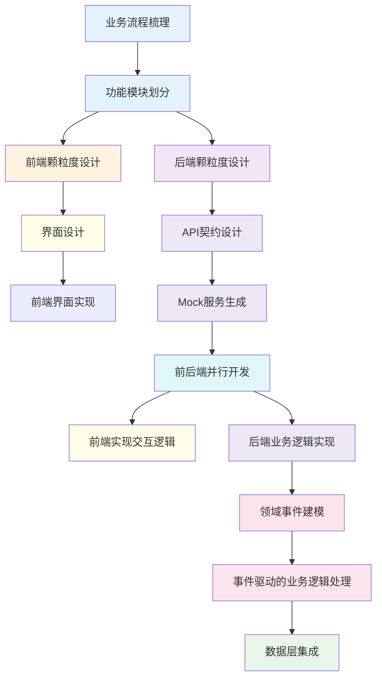

### 背景
- **项目规模**：前后端30个功能模块，37个数据表，2000+行schema，23个API端点
- **技术栈**：Vue 3 + NestJS + Prisma + MySQL
- **开发模式**：业务专家（无编程背景）+ Claude 4.0全程协作
- **开发时间**：从设计到完成约一个月时间

## 设计理念

本项目设计理念源于第一性原理与系统工程方法论，以“颗粒度控制”为核心，构建一套“乐高式”的系统开发方法。通过将系统拆解为不同层次、不同职责的“功能颗粒”，实现了前后端模块的对齐、逻辑的高内聚、接口的一致性，从而保证了项目在复杂度迅速增长的情况下仍具备可控性与可扩展性。

#### 核心理念

**第一性原理拆解**：抛开现有技术框架束缚，从“系统需完成什么最基本目标”出发，逐层向下拆解，直至最小实现单元；

**模块颗粒拼搭**：将所有功能视作具备独立职责和清晰边界的“颗粒”，通过组合形成完整系统；

**系统视角设计**：从“业务玩家视角”转变为“系统设计者视角”，站在整体目标出发，构造结构、分配边界；

**接口即契约**：每个颗粒都通过明确的输入输出接口来通信，实现真正的解耦。

#### 实践路径

1. 明确业务终局，确定系统目标
2. 拆分阶段与子任务，形成系统主线（L1）
3. 分解可独立运行的功能模块（L2）
4. 对齐 UI-业务-数据结构，建立可映射的“颗粒层次”
5. 将 AI 作为结构协同者与代码执行者参与开发

### **协作范式** 

| 角色               | 职责                                   | 工具/能力                          |
|--------------------|----------------------------------------|-----------------------------------|
| **人类（业务专家）** | 提出业务需求，拆解系统颗粒，定义模块边界，控制方向 | 业务流程建模、领域拆解、系统全局观 |
| **AI（Claude 4.0）** | 撰写设计文档、编写代码、生成接口、快速迭代     | 代码生成、接口推理、结构补全、一致性保持 |

##### 协作特点

- 人定义边界，AI填充内容
- 人控制系统性，AI追求一致性  
- 人思考变化，AI保持结构

#### 螺旋式开发流程：从图纸到装修

| 阶段         | 关键任务                                  | 协作模式                |
|--------------|------------------------------------------|-------------------------|
| 设计图阶段   | 系统拆解与需求文档生成                   | 人工主导，AI辅助        |
| 起高楼阶段   | 数据库结构与基础接口搭建                 | AI主导实现              |
| 硬装修阶段   | UI框架确立与核心服务封装                 | 人工定规范，AI编码        |
| 软装修阶段   | 基于用户体验优化界面交互与系统性能       | 人工把控需求，AI实现    |

**备注**：每个阶段结束后回溯调整，进入下一轮迭代。

### 技术实践 

第一性原理在开发中的实践

#### 五层颗粒度分解的前后端映射

在系统开发中，为实现结构清晰、职责明确、前后对齐、便于协作与复用的目标，我们将整个系统拆分为五个颗粒度层级，从业务主线到底层基础设施，形成统一的"开发语言"。

| 功能颗粒层级 | 前端视图结构 | 后端职责结构 | 协同关注点 | 示例 |
|--------------|--------------|--------------|------------|------|
| **L1 项目阶段** （业务主线） | **L1 应用模块**：系统一级路由页面 | **业务域 (Domain)**：定义实体、核心规则 | 模块边界与领域一致性 | 项目管理模块 ↔ ProjectManagementDomain |
| **L2 功能模块** （可独立运行） | **L2 主页面**：完整业务视图结构 | **聚合服务 (Orchestrator)**：业务编排逻辑 | 业务闭环与场景映射 | 项目列表页 ↔ ProjectListService（整合多个子模块） |
| **L3 子模块** （逻辑分组） | **L3 页面区域**：功能区域划分，如卡片、分栏 | **领域服务**：负责业务规则实现与流程控制 | 职责划分与数据流一致性 | 计划管理区域 ↔ PlanQueryService |
| **L4 功能点** （最小业务单元） | **L4 业务组件**：按钮、表单等操作点 | **应用服务**：执行具体动作（如创建、审批） | 原子操作与可测试性 | 计划审批组件 ↔ ApprovalService.submit() |
| **L5 技术实现颗粒** （支撑性模块） | **L5 基础组件**：通用UI组件，如上传、分页 | **基础设施层**：文件、数据库、权限等资源封装 | 技术可复用与适配能力 | 文件上传组件 ↔ FileRepository.upload() |

**映射原则**
前后端命名与颗粒一致：避免语义漂移，前端区域与后端服务命名尽量一一映射；
每一层级均可独立测试与交付：支持组件级调试、服务级验证；
每一颗粒都拥有明确接口契约：UI → API → Service → Repository 均定义边界；
层级之间上下递进，逐层聚合业务价值：从操作到领域规则，从规则到业务流程。

#### 驱动开发：文档驱动-界面驱动-API驱动

####  业务驱动的前后端协同开发流程

| 阶段               | 关键步骤           | 说明                                                                 | 产出物                  |
|--------------------|--------------------|----------------------------------------------------------------------|-------------------------|
| **业务驱动阶段**   | 业务建模优先       | 从业务出发，先梳理业务流程，明确业务目标与用户角色                   | 业务流程文档            |
|                    | 功能模块划分       | 基于业务流程，划分功能模块（功能域），形成功能地图                   | 功能地图/模块划分图     |
| **功能分解与设计** | 前端颗粒度拆解     | 拆解出界面结构（页面、组件、交互流）                                 | 界面原型/交互流程图     |
|                    | 后端颗粒度拆解     | 拆解出能力接口（服务契约、API结构、数据处理逻辑）                    | API文档/服务契约        |
| **前端开发**       | 界面驱动开发       | 根据界面颗粒度，设计页面结构和用户交互流                             | 高保真原型              |
|                    | 契约协商           | 与后端协商API契约                                                    | 确认的API契约           |
|                    | Mock开发           | 开始Mock服务开发，实现前后端并行                                     | Mock服务                |
|                    | 体验优化           | 聚焦用户体验，逐步完善界面实现                                       | 可交互界面              |
| **后端开发**       | API契约设计        | 明确每个前端交互所需的API                                            | API规范文档             |
|                    | Mock数据提供       | 按照契约提供Mock数据                                                 | Mock数据服务            |
|                    | 领域事件驱动       | 采用DDD+Event架构解耦业务逻辑                                        | 领域模型设计            |
|                    | 数据层集成         | 实现与数据层的集成                                                   | 完整后端服务            |
| **协同交付**       | 契约联调           | 前后端基于契约进行联调                                               | 联调报告                |
|                    | 闭环验证           | 持续对照业务流程验证功能、数据、体验统一                             | 验收报告                |

## 流程特点

1. **双线并行开发**
   - 前端：界面驱动开发（原型→Mock→实现）
   - 后端：契约驱动开发（API设计→领域建模→实现）

2. **核心控制点**
   - ✅ 业务模型与系统实现的一致性
   - ✅ 接口契约的版本管理
   - ✅ 持续的业务流程验证

3. **关键协作机制**
   - 每日接口对齐会议
   - 契约变更的自动化通知
   - 双向Mock服务验证

**技术小创新**
1. 从技术配置到业务配置：AI理解业务语言的配置驱动

# 🤖 人与AI协作方法论：从“牛马”到“BOSS”的跃迁

## 一、思维定位：你是AI的“BOSS”不是“牛马”

### 🐂 传统协作方式：技术人员 vs AI

| 传统行为            | 典型表现                 | 协作瓶颈                     |
|--------------------|-------------------------|-----------------------------|
| 自己动手写代码      | 让AI补代码段             | 无法释放AI的全能能力         |
| 先实现，后设计      | 业务思维让位于代码细节   | 系统割裂、低效返工           |
| 把AI当工具          | 只当“代码搜索引擎”       | 价值被限制                   |

### 🧠 新协作范式：业务专家 + AI

| 角色        | 职责                     | 优势                         |
|------------|-------------------------|-----------------------------|
| 业务专家    | 拆解需求，设计系统边界   | 站在业务顶层看问题           |
| AI伙伴      | 构建结构，生成代码       | 高速实现、推理补全           |

**关键观念转变：**
- 抑制“写代码”的冲动，专注“系统设计”
- 主动做“结构师”“思维者”，让AI承担“码农”和“架构助手”

## 二、沟通策略：把AI当人看，别当工具使

### 🎯 认知沟通层级：What → How → Why

| 层级 | 沟通方式                       | 适用场景                              | AI响应特点                              |
|------|-------------------------------|--------------------------------------|----------------------------------------|
| What | 具体任务描述 （“写一个订单查询接口”） | 对能力弱模型（如GPT-3.5）             | 高幻觉率、难以迁移复杂背景             |
| How  | 实现路径指引 （“先查表A，再过滤B…”） | 中等复杂度任务                        | 准确率提升、可控性强                   |
| Why  | 背后动机、目标 （“我们要做一个订单追踪的业务闭环…”） | 高智能模型（如Claude 4.0） | 理解任务本质、自主分解任务、创新解法、幻觉显著减少 |

**📌 类比：** 你用的是“能自我思考的AI高层”，却给他下“基层小兵”的命令，结果就是要么被误解，要么被反向挑战。

### 🧭 管理策略：根据AI“能力段位”进行匹配

| 场景                     | 建议使用模型         | 交互方式                         |
|-------------------------|---------------------|---------------------------------|
| 明确简单任务（小兵）     | O3 | What级别，逐步指令              |
| 结构搭建 + 流程设计      | Gemin  | How层级，结构沟通               |
| 战略性系统协作           | Claude 4.0          | Why层级，目标对齐，共建认知图谱 |

## 三、实战策略建议

### ✅ 使用AI时的“BOSS模式”提纲

#### 目标先行（Why）
- “我希望打造一个系统，能实现A到B的自动化闭环，主要痛点在于……”
- “我们的目标是让客户能一站式完成……，有哪些模块最关键？”

#### 结构共建（How）
- “你帮我设计一个由以下颗粒组成的系统结构，并保持低耦合”
- “我们这样拆解是否更适合高复用的设计？”

#### 执行落地（What）
- “请基于以上结构，生成prisma schema 并生成后端接口”
- “帮我把模块A转成Vue 3组件，使用X组件库，样式保持简洁”

## 四、协作意识升级图谱
| 协作类型       | 特点                     | 典型表现                         | 协作方式         | Claude 适用性  |
|----------------|--------------------------|----------------------------------|----------------|---------------|
| **What - 命令式协作** | 幻觉率高，结构不清晰      | “帮我写段代码”                   | 传统方式       | 不太适合      |
| **How - 路径式协作**  | 幻觉减少，结构合理        | “请用xx方式实现”                 | 工程协作初阶   | 可以          |
| **Why - 目标式协作**  | 几乎无幻觉，出现创新      | “我们做这个系统的核心目的是…”    | 战略协作模式   | 非常适合      |