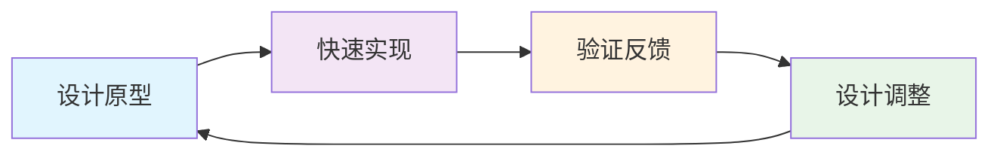
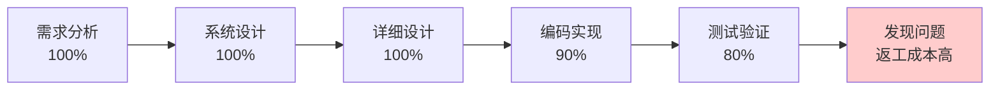
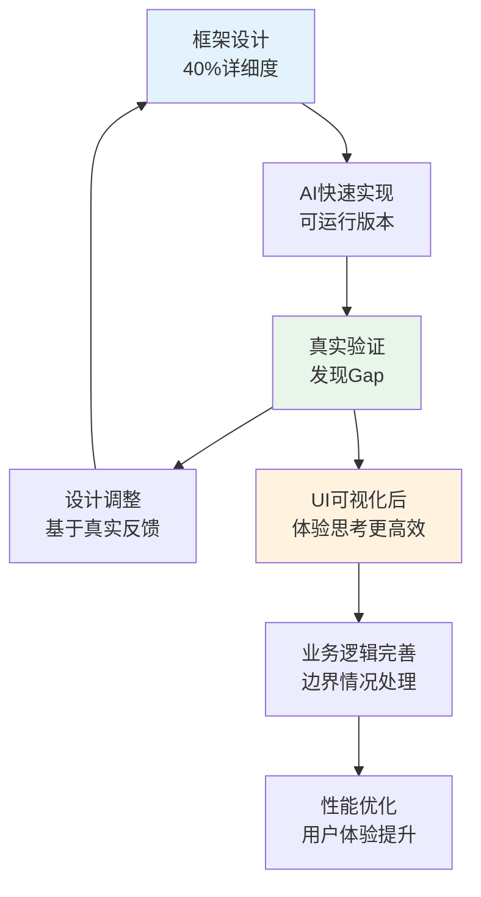

# AI时代软件工程最佳实践探索

> 基于培训系统项目的深度复盘与思考：探讨"人与AI"协作的工程实践
> 
> 作者：非技术背景业务专家基于与Claude 4.0的协作开发经验总结
> 
> 项目规模：前后端30个功能模块，37个数据表，2000+行schema，23个API端点
> 
> **核心发现**：AI时代的软件开发正从"人写代码"转向"人与AI协作"，业务专家通过掌握AI协作方法，能够参与复杂软件系统的开发过程

---

## 📋 目录

1. [引言：AI时代"人与AI"协作的工程实践变革](#1-引言ai时代人与ai协作的工程实践变革)
2. [培训系统项目的实践案例](#2-培训系统项目的实践案例)
3. [AI协作开发的核心流程实践](#3-ai协作开发的核心流程实践)
4. [从具体实践中提取的关键原则](#4-从具体实践中提取的关键原则)
5. [四部曲开发流程总结](#5-四部曲开发流程总结)
6. [最佳实践指南与适用性分析](#6-最佳实践指南与适用性分析)

---

## 1. 引言：AI时代"人与AI"协作的工程实践变革

在AI技术快速发展的今天，软件开发正在经历一场深刻的变革：**从传统的"人写代码"模式，转向"人与AI协作"的新模式**。本文基于培训系统项目（37个数据表，30个功能模块，23个API端点）的完整开发实践，深度探讨这种新型协作模式的可能性、方法论和最佳实践。

### 1.1 协作模式的根本转变

**传统开发模式的挑战**：
- 技术门槛高：需要深度编程技能
- 需求传递失真：业务专家→需求文档→技术专家→代码实现
- 开发周期长：复杂的需求理解和技术实现过程

**AI协作开发的突破**：
- 降低技术门槛：AI承担代码编写，人类专注业务思考
- 直接业务转译：业务语言直接转换为技术实现
- 快速迭代验证：设计-实现-验证的快速循环

**本文的独特视角**：
本文不是探讨AI工具的使用技巧，而是深入分析**在复杂业务场景下，不同背景的人员如何与AI建立有效的协作关系**。

### 1.2 项目背景与协作模式

- **项目规模**：30个功能模块，涵盖培训全生命周期管理
- **技术栈**：Vue 3 + NestJS + Prisma + MySQL
- **开发模式**：业务专家（无编程背景）+ Claude 4.0全程协作
- **开发时间**：从设计到完成约一个月时间
- **效率优势**：AI的快速编码能力显著提升了开发效率
- **开发周期**：四部曲流程（设计图→起高楼→硬装修→软装修）
- **核心方法**：第一性原理的颗粒拆解 + 业务语言沟通

### 1.3 关键发现

1. **业务专家参与开发的可能性**：在特定垂直领域，业务专家可通过第一性原理思维和AI协作技巧参与系统开发
2. **第一性原理的通用价值**：从业务流程到技术架构，颗粒拆解方法对系统开发的价值
3. **业务语言在AI协作中的优势**：自然业务语言有时比技术规格文档更能帮助AI理解需求
4. **设计-实现Gap的积极管理**：将差距视为认知迭代的机会，而非需要避免的问题

---

## 2. 培训系统项目的实践案例

本章节通过培训系统项目的具体实现，展示AI协作开发中的关键实践，包括五层颗粒度架构、配置驱动设计、业务驱动数据建模等。这些实践的价值在于**可复制性和可适配性**，读者可根据自己项目的复杂度选择性采用。

### 2.1 五层颗粒度架构的实际实现

五层颗粒度分解是本项目中最核心的架构实践，但**并非所有项目都需要如此细致的分层**。以下展示这种分层在复杂业务场景下的具体价值：

#### 2.1.1 前端五层架构的真实代码示例

**L1 应用模块层** - 项目管理模块：
```typescript
// training-system-frontend/src/modules/project-management/
├── pages/           # L2主页面
├── components/      # L4业务组件  
├── stores/         # 模块状态管理
├── types/          # 类型定义
└── constants/      # 模块常量
```

**L2 主页面层** - 项目详情页的核心结构：
```vue
<!-- ProjectDetail.vue - 统一入口页面 -->
<template>
  <div class="project-detail-page">
    <div class="project-detail-container">
      <!-- L3页面区域：左侧统一菜单 -->
      <div class="left-menu">
        <el-menu :default-active="activeMenu" @select="handleMenuSelect">
          <el-menu-item index="basic-info">概览</el-menu-item>
          <el-menu-item index="students">学员</el-menu-item>
          <!-- 配置驱动的动态菜单 -->
          <el-menu-item v-if="projectConfig.enableFullPlan" index="proposal">方案</el-menu-item>
          <el-menu-item v-if="projectConfig.enableMentorship" index="mentoring">带教</el-menu-item>
        </el-menu>
      </div>
      
      <!-- L3页面区域：主内容区 -->
      <div class="main-content">
        <!-- 根据菜单选择渲染不同的L4业务组件 -->
        <component :is="currentComponent" :project-data="projectData" />
      </div>
    </div>
  </div>
</template>
```

**L4 业务组件层** - 功能配置组件：
```vue
<!-- ProjectConfigForm.vue - 配置驱动的具体实现 -->
<template>
  <div class="project-config-form">
    <el-form :model="config" label-width="140px">
      <!-- 带教功能 -->
      <el-form-item label="启用带教">
        <el-switch :model-value="config.enableMentorship" 
                   @update:model-value="updateConfig('enableMentorship', $event)" />
      </el-form-item>
      
      <!-- 完整方案功能 -->
      <el-form-item label="启用完整方案">
        <el-switch :model-value="config.enableFullPlan" 
                   @update:model-value="updateConfig('enableFullPlan', $event)" />
      </el-form-item>
      
      <!-- 完整方案的子模块（配置联动） -->
      <div v-if="config.enableFullPlan" class="plan-options">
        <el-form-item label="启用议程">
          <el-switch :model-value="config.enableAgenda" 
                     @update:model-value="updateConfig('enableAgenda', $event)" />
        </el-form-item>
      </div>
    </el-form>
  </div>
</template>

<script setup lang="ts">
// 配置联动逻辑
const updateConfig = (key: string, value: boolean) => {
  // 若关闭完整方案，则级联关闭其子模块
  if (key === 'enableFullPlan' && !value) {
    newConfig.enableAgenda = false;
    newConfig.enableResource = false;
    newConfig.enableBudget = false;
  }
  
  // 若开启完整方案，则自动启用其子模块
  if (key === 'enableFullPlan' && value) {
    newConfig.enableAgenda = true;
    newConfig.enableResource = true;
  }
};
</script>
```

**L5 基础组件层** - 来自Element Plus等基础组件库

#### 2.1.2 后端五层架构的业务映射

**L1 业务域** - 项目管理域：
```typescript
// training-system-backend/src/modules/project-management/
├── controllers/     # API控制器
├── services/       # 业务服务层
├── dto/           # 数据传输对象
└── entities/      # 业务实体
```

**L2-L4层的具体映射** - 任务管理服务：
```typescript
// TaskService.ts - 体现业务逻辑的清晰分层
@Injectable()
export class TaskService {
  constructor(private readonly prisma: PrismaService) {}

  /**
   * L2层聚合服务：创建任务的完整业务流程
   */
  async createTask(createTaskDto: CreateTaskDto) {
    // L3层领域服务：验证项目是否存在
    const project = await this.validateProject(createTaskDto.projectId);
    
    // L3层领域服务：处理阶段逻辑
    const stage = await this.findOrCreateStage(createTaskDto);
    
    // L4层应用服务：执行具体的任务创建操作
    const task = await this.executeTaskCreation(createTaskDto, stage);
    
    return task;
  }

  /**
   * L3层领域服务：查找或创建默认阶段
   */
  private async findOrCreateStage(createTaskDto: CreateTaskDto) {
    // 如果stageId等于projectId，说明是简化调用，需要找到或创建默认阶段
    if (createTaskDto.stageId === createTaskDto.projectId) {
      let stage = await this.prisma.trainingStage.findFirst({
        where: { 
          projectId: createTaskDto.projectId,
          type: 'DURING'
        },
      });

      // 如果没有DURING阶段，创建一个默认阶段
      if (!stage) {
        stage = await this.prisma.trainingStage.create({
          data: {
            projectId: createTaskDto.projectId,
            name: '培训中',
            type: 'DURING',
            description: '默认培训阶段',
            orderIndex: 1,
            status: 'ACTIVE'
          }
        });
      }
      return stage;
    }
    
    // 正常验证阶段
    return await this.prisma.trainingStage.findUnique({
      where: { id: createTaskDto.stageId }
    });
  }
}
```

#### 2.1.3 五层架构的价值与适用性

**核心价值**：
1. **业务语义清晰**：每一层都有明确的业务含义，AI和人类都能准确理解
2. **前后端严格映射**：前端L1模块直接对应后端业务域，便于协作开发
3. **可控的复杂度管理**：30个功能模块×5个层级=150个清晰的开发单元

**适用性分析**：
- **适合场景**：复杂业务系统（10+功能模块）、团队协作开发、长期维护项目
- **不适合场景**：简单应用（5-功能模块）、原型验证、短期项目
- **判断标准**：当项目复杂度超过单人能够完全掌控时，分层架构的价值才显现

### 2.2 配置驱动设计的业务价值实现

配置驱动不仅是技术实现模式，更是业务灵活性的体现。培训系统通过配置实现了"一个系统适配多种培训模式"的目标。

#### 2.2.1 业务配置vs技术配置的对比

**传统技术配置**（难以理解）：
```json
{
  "features": {
    "module_001": { "enabled": true, "permissions": ["read", "write"] },
    "workflow_advanced": { "enabled": false, "dependencies": ["module_001"] }
  }
}
```

**业务语义配置**（直观易懂）：
```typescript
interface ProjectConfig {
  enableFullPlan: boolean;        // "是否启用完整方案"
  enableMentorship: boolean;      // "是否启用带教管理"
  enableNews: boolean;           // "是否启用项目新闻"
  
  // 子模块配置（联动关系清晰）
  enableAgenda: boolean;         // "议程规划"
  enableResource: boolean;       // "资源协调"
  enableBudget: boolean;         // "预算管理"
}
```

#### 2.2.2 配置驱动的自动化逻辑

```typescript
// 项目配置的智能联动
const projectConfig = reactive({
  enableFullPlan: false,  // 主开关
  enableAgenda: false,    // 子功能1
  enableResource: false,  // 子功能2
  enableBudget: false,    // 子功能3
});

// 配置变更的业务逻辑
const updateConfig = (key: string, value: boolean) => {
  // 业务规则1：关闭主功能时，级联关闭所有子功能
  if (key === 'enableFullPlan' && !value) {
    projectConfig.enableAgenda = false;
    projectConfig.enableResource = false;
    projectConfig.enableBudget = false;
  }
  
  // 业务规则2：开启主功能时，自动启用核心子功能
  if (key === 'enableFullPlan' && value) {
    projectConfig.enableAgenda = true;
    projectConfig.enableResource = true;
  }
};
```

#### 2.2.3 动态菜单的配置实现

```vue
<!-- 根据配置动态显示菜单项 -->
<el-menu>
  <!-- 基础菜单（总是显示） -->
  <el-menu-item index="basic-info">概览</el-menu-item>
  <el-menu-item index="students">学员</el-menu-item>
  
  <!-- 配置驱动的条件菜单 -->
  <el-menu-item v-if="projectConfig.enableFullPlan" index="proposal">
    方案
  </el-menu-item>
  <el-menu-item v-if="projectConfig.enableMentorship" index="mentoring">
    带教
  </el-menu-item>
  <el-menu-item v-if="projectConfig.enableNews" index="news">
    新闻
  </el-menu-item>
</el-menu>
```

**业务价值体现**：
- **新员工入职培训**：只启用基础功能（概览、学员、通知）
- **干部入模子培训项目**：启用完整方案（包含议程、资源、预算、带教）
- **临时技能培训**：启用中等功能（基础+部分方案功能）

### 2.3 业务驱动数据建模的Schema实现

培训系统的数据模型直接映射业务概念，让AI能够理解业务逻辑而不仅仅是技术结构。

#### 2.3.1 业务概念的直接映射

```prisma
// schema.prisma - 业务语义清晰的数据模型

// 培训项目（核心业务实体）
model TrainingProject {
  id                        String           @id @default(uuid())
  projectNo                 String           @unique @map("project_no")
  name                      String           
  description               String?          
  status                    ProjectStatus    @default(DRAFT)
  currentStage              StageType        @default(BEFORE)
  
  // 业务配置（对应前端的配置驱动）
  config                    Json
  
  // 业务关系（体现培训业务的天然关联）
  owner                     User             @relation("ProjectOwner", fields: [ownerId], references: [id])
  participants              ProjectParticipant[]
  stages                    TrainingStage[]
  tasks                     TrainingTask[]
  proposals                 ProjectProposal[]
  
  @@map("training_projects")
}

// 培训阶段（映射培训流程的时间维度）
model TrainingStage {
  id                        String           @id @default(uuid())
  projectId                 String
  name                      String           // "培训前" "培训中" "培训后"
  type                      StageType        // BEFORE, DURING, AFTER
  description               String?
  status                    StageStatus      @default(ACTIVE)
  orderIndex                Int              @default(0)
  
  // 业务关系
  project                   TrainingProject  @relation(fields: [projectId], references: [id])
  tasks                     TrainingTask[]
  
  @@map("training_stages")
}

// 培训任务（具体的培训活动）
model TrainingTask {
  id                        String           @id @default(uuid())
  projectId                 String
  stageId                   String
  name                      String
  type                      TaskType         // LECTURE, WORKSHOP, ASSESSMENT等
  status                    TaskStatus       @default(PENDING)
  
  // 业务属性
  required                  Boolean          @default(true)
  estimatedHours            Int?
  dueDate                   DateTime?
  
  // 业务关系
  project                   TrainingProject  @relation(fields: [projectId], references: [id])
  stage                     TrainingStage    @relation(fields: [stageId], references: [id])
  submissions               TaskSubmission[]
  
  @@map("training_tasks")
}

// 业务状态枚举（完整的生命周期）
enum ProjectStatus {
  DRAFT                     // 草稿
  PENDING_APPROVAL          // 待审批
  ACTIVE                    // 执行中
  COMPLETED                 // 已完成
  PAUSED                    // 暂停
  CANCELLED                 // 已取消
}

enum StageType {
  BEFORE                    // 培训前
  DURING                    // 培训中
  AFTER                     // 培训后
}
```

#### 2.3.2 业务规则的数据约束

```prisma
// 项目参与者（体现培训中的角色关系）
model ProjectParticipant {
  id                        String           @id @default(uuid())
  projectId                 String
  userId                    String
  role                      ParticipantRole  @default(STUDENT)
  status                    ParticipantStatus @default(ACTIVE)
  
  // 业务约束：一个用户在一个项目中只能有一个活跃角色
  @@unique([projectId, userId, status])
  @@map("project_participants")
}

enum ParticipantRole {
  STUDENT                   // 学员
  MENTOR                    // 导师
  COUNSELOR                 // 辅导员
  OBSERVER                  // 观察员
}
```

#### 2.3.3 业务驱动建模的优势

**AI理解友好**：
- AI看到`TrainingProject`直接理解这是"培训项目"
- `BEFORE`, `DURING`, `AFTER`阶段类型直观表达培训时间线
- `STUDENT`, `MENTOR`角色清晰表达培训关系

**业务扩展性**：
- 新增培训类型时，只需扩展枚举值
- 业务流程变化时，模型结构仍然稳定
- 跨系统集成时，业务语义一致

**开发效率**：
- 前后端开发者用相同的业务术语交流
- 数据库字段名直接对应业务概念
- AI生成代码时能理解业务上下文

---

## 3. AI协作开发的核心流程实践

### 3.1 **技术专家 vs 业务专家的AI协作差异**

基于培训系统项目的实践验证，技术专家和业务专家在AI协作中呈现出不同的特点和挑战：

#### **技术专家的AI协作挑战**
- **过度依赖编码能力**：因为懂编程，倾向于直接写代码而不给AI充分参与机会
- **思维惯性**：习惯性跳过设计阶段，直接进入实现细节
- **协作收益递减**：可能无法充分体验AI在架构设计和代码生成方面的价值

#### **业务专家的AI协作优势**
- **必须依赖AI**：不会编程的"限制"反而成为充分利用AI的优势
- **专注高层设计**：自然而然地专注于业务逻辑和架构思考
- **协作价值最大化**：能够充分发挥AI在技术实现方面的能力

#### **核心启示**
**技术专家使用这些方法的关键**：刻意抑制"直接编码"的冲动，将AI视为技术实现的主力，自己专注于架构设计和业务理解。

### 3.2 设计图阶段：确定最优详细度的方法

**核心挑战**：如何判断设计图需要明细到何种程度才能有效指导AI开发？

**第一性原理应用**：通过颗粒拆解确定AI执行边界，区分必须详细、适度详细和可预留迭代的部分。

#### AI时代设计详细度"三层八要素"模型

#### 🔴 第一层：AI执行边界（必须详细）

| 要素 | 详细程度 | 理由 | 示例 |
|------|---------|------|------|
| **数据模型和关系** | 100%详细 | AI需要明确的结构化信息 | Prisma schema（37个表，2000+行） |
| **核心业务流程** | 100%详细 | 定义系统边界和职责 | 培训项目五阶段流程图 |
| **技术架构边界** | 100%详细 | 模块间的依赖和通信 | 五层颗粒度架构设计 |
| **API接口约定** | 100%详细 | 前后端协作的契约 | 23个API端点规范 |

#### 🟡 第二层：功能框架（适度详细）

| 要素 | 详细程度 | 理由 | 示例 |
|------|---------|------|------|
| **主要页面结构** | 70%详细 | 提供实现框架，保留调整空间 | 工作台模块划分 |
| **核心功能组件** | 70%详细 | 定义组件边界和职责 | 业务组件设计 |
| **用户角色权限** | 70%详细 | 系统安全和业务逻辑基础 | RBAC权限模型 |
| **基本交互流程** | 70%详细 | 主要用户路径规划 | 项目创建流程 |

#### 🟢 第三层：体验细节（预留迭代空间）

- **UI详细布局**：在可视化后思考效率更高
- **交互动效**：需要真实体验才能优化
- **文案优化**：上下文相关，实时调整
- **边界情况**：在测试过程中发现和处理

### 3.2 核心洞察

**传统模式 vs AI协作模式**

```
传统瀑布模式：
设计(100%) → 开发(90%) → 测试(80%) → 部署(70%)
↑ 返工成本高，追求一次性完成

AI协作模式：
框架设计(100%) → 快速实现(80%) → 可视化优化(95%) → 持续迭代(99%)
↑ 迭代成本低，追求最优化人机协作效率
```

**设计策略调整**：
- **前置**：技术架构、数据模型、API规范
- **中置**：功能框架、页面结构、核心流程  
- **后置**：UI细节、交互体验、边界处理

---

### 3.3 数据设计阶段：业务驱动的数据库设计方法

**核心挑战**：如何确保数据库设计准确反映业务需求，特别是在业务理解和技术实现之间建立有效桥梁？

**第一性原理应用**：从业务流程颗粒拆解到数据实体，将业务逻辑转化为数据结构。这种方法对业务专家和技术人员都有价值。

#### 业务流程驱动建模的AI协作价值

相比传统的技术导向数据建模，业务流程驱动建模在AI协作中具有显著优势：

**🤖 AI理解优势**：
- **业务语言友好**：AI能直接理解"培训项目"、"学员参与"等业务概念
- **上下文丰富**：业务流程提供完整的业务背景，有助于AI生成准确的实现代码
- **关系清晰**：业务流程中的天然关系（如师生关系、项目阶段）易于AI理解和建模

**👥 协作效率提升**：
- **统一语言**：业务专家、技术人员、AI使用相同的业务术语
- **需求理解准确**：减少业务需求到技术实现的翻译损失
- **沟通成本降低**：跨角色团队能够高效协作

**🔄 长期演进优势**：
- **业务扩展性**：数据模型能够适应业务发展变化
- **维护友好性**：基于业务语义的设计更容易理解和修改
- **知识传承性**：新团队成员能够快速理解业务逻辑

### 3.3.1 AI时代数据建模"四步法"

#### 第一步：业务流程映射
```
培训项目管理流程：
项目立项 → 方案设计 → 审批流程 → 阶段执行 → 任务分配 → 进度跟踪 → 项目收尾
    ↓
核心实体识别：
Project → Proposal → Approval → Stage → Task → Progress → Summary
```

#### 第二步：实体属性提取
```
以"培训项目"为例：
业务要件 → 数据字段
├── 项目基本信息 → name, description, objective
├── 项目时间管理 → startDate, endDate, estimatedDuration  
├── 项目状态控制 → status, type, priority
└── 项目人员管理 → ownerId, participants
```

#### 第三步：关系约束建模
```
业务规则 → 数据约束
├── 一个项目包含多个阶段 → Project.id → Stage.projectId
├── 一个阶段包含多个任务 → Stage.id → Task.stageId
└── 任务必须属于某个阶段 → Task.stageId (必填)
```

#### 第四步：状态生命周期设计
```
业务流程 → 状态枚举
项目流程：草稿 → 审批 → 执行 → 完成
    ↓
enum ProjectStatus {
  DRAFT, PENDING_APPROVAL, ACTIVE, COMPLETED, CANCELLED
}
```


### 3.4 实现阶段：设计迭代完善的认知

**核心发现**：设计图再完善，在硬装修阶段（前后端对接）仍需要较多调整时间

**关键认知**：这不是设计缺陷，而是设计在实践中不断完善的自然过程

#### 3.4.1 设计完善的必然性

在培训系统项目的"硬装修"阶段，即使前期做了详细的设计图，前后端对接时仍需要大量调整：

**原本的期望**：设计图足够完善 → 一次性实现完成

**实际的过程**：设计图 → 实现验证 → 发现优化点 → 更新设计 → 更好的系统

**典型的完善场景**：
- API接口在实际使用中发现需要调整字段结构
- 用户交互流程在可视化后发现体验问题
- 数据关系在真实业务中暴露新的需求

#### 3.4.2 AI协作下的设计迭代

**传统模式的挑战**：
- 设计变更成本高，倾向于避免修改
- 返工被视为失败，心理压力大

**AI协作的优势**：
- 设计调整成本低，AI可快速重新生成代码
- 迭代被视为完善，心理负担小
- 可以更自由地在实现中验证和优化设计

**建议的心态调整**：
- 接受设计迭代的必然性
- 将硬装修阶段的调整视为设计的自然完善过程
- 充分利用AI协作的低成本迭代优势

#### 5.2.3 "同步验证"机制



**关键策略**：
1. **小步快跑**：每个模块都经历设计→实现→验证的快速循环
2. **即时反馈**：发现问题立即调整设计，而非完成后返工
3. **增量完善**：每轮迭代都在上一轮基础上增量改进
4. **Gap预期**：承认Gap的必然性，提前规划应对策略


## 4. 四部曲开发流程总结

### 4.1 四部曲流程详解

| 阶段 | 目标 | 核心交付物 | AI协作要点 |
|------|------|----------|----------|
| **🏗️ 设计图阶段** | 建立清晰的架构蓝图 | • 业务流程图和功能模块划分<br/>• 数据模型设计（Prisma Schema）<br/>• API接口规范<br/>• 技术架构设计<br/>• 前端组件架构 | • 使用自然语言描述业务流程<br/>• 提供完整的业务上下文<br/>• 明确模块边界和依赖关系 |
| **🏢 起高楼阶段** | 搭建可运行的系统骨架 | • 数据库表结构和基础数据<br/>• 核心API端点实现<br/>• 前端路由和页面框架<br/>• 基础组件库<br/>• 系统集成框架 | • 并行开发前后端模块<br/>• 快速验证架构设计<br/>• 保持代码结构清晰 |
| **🔧 硬装修阶段** | 完善业务逻辑和功能细节 | • 完整的业务功能实现<br/>• 前后端数据流打通<br/>• 用户权限和安全机制<br/>• 核心业务流程验证<br/>• API测试和集成测试 | • 逐步完善业务逻辑<br/>• 处理边界情况和异常<br/>• 优化数据流和性能 |
| **🎨 软装修阶段** | 优化用户体验和系统性能 | • UI/UX优化和细节完善<br/>• 交互体验改进<br/>• 性能优化和安全加固<br/>• 用户培训和文档<br/>• 部署和上线准备 | • 基于真实使用反馈优化<br/>• 关注用户体验细节<br/>• 持续迭代和改进 |

### 4.2 各阶段时间分配

```
设计图 (20%) ████████████████████
起高楼 (30%) ██████████████████████████████
硬装修 (40%) ████████████████████████████████████████
软装修 (10%) ██████████
```

---

## 5. 最佳实践指南与适用性分析

### 5.1 前后端协同开发最佳实践

#### 5.1.1 界面驱动开发与API驱动开发的协同

基于您的项目实践，前后端应采用**双驱动协同模式**：

**前端：界面驱动开发四步法**
```
页面解构 → 组件开发与数据模拟 → 状态集成 → API对接
```

**后端：API驱动开发四步法**
```
API契约设计 → Mock服务实现 → 前后端并行开发 → 业务逻辑实现
```

**协同关键点**：
1. **契约先行**：前后端共同制定API契约，确保接口规范统一
2. **并行开发**：前端用Mock数据，后端用Mock服务，两者并行开发
3. **分层对应**：前端UI颗粒度(L1-L5) ↔ 后端业务分层(Domain-Service-Repository)
4. **配置驱动**：前端动态菜单 ↔ 后端模块配置，保持架构一致性

#### 5.1.2 五层颗粒度分解的前后端映射

| 前端层级 | 后端对应层级 | 协同要点 | 示例 |
|---------|------------|---------|------|
| **L1 应用模块** | **业务域 (Domain)** | 模块边界对齐 | 项目管理模块 ↔ ProjectManagement Domain |
| **L2 主页面** | **聚合服务** | 业务场景对应 | 项目列表页 ↔ ProjectListService |
| **L3 页面区域** | **领域服务** | 功能职责对应 | 筛选区域 ↔ ProjectQueryService |
| **L4 业务组件** | **应用服务** | 操作粒度对应 | ProjectCard ↔ ProjectService.getById |
| **L5 基础组件** | **基础设施** | 技术能力对应 | BaseTable ↔ Repository/ExternalAPI |

#### 5.1.3 事件驱动架构的前后端一致性

**前端事件总线**：
```typescript
// 前端全局事件
eventBus.emit('proposal.approved', { projectId, proposalData });
```

**后端领域事件**：
```typescript
// 后端领域事件
@EventHandler(ProposalApprovedEvent)
export class AgendaLockHandler {
  async handle(event: ProposalApprovedEvent) {
    await this.agendaService.lockAgenda(event.projectId);
  }
}
```

**一致性原则**：
- 事件命名规范统一
- 事件数据结构对齐
- 事件处理逻辑呼应

### 5.2 配置驱动设计最佳实践

#### 5.2.1 单一数据源原则

基于您项目中动态菜单系统的成功实践，配置驱动设计的核心价值：

**三层解耦架构**：
1. **数据层**：菜单配置模块化，每个业务域独立配置
2. **组装层**：自动聚合配置，无需手动维护
3. **视图层**：通用渲染器，完全依赖配置数据

**配置驱动的优势**：
- **高度可预测性**：配置即行为，消除"改一处动全身"风险
- **彻底解耦**：配置与视图分离，独立修改和替换
- **极致维护效率**：修改配置即可调整功能，无需代码变更

#### 5.2.2 模块化配置管理

```typescript
// 项目级配置驱动业务流程
interface ProjectModuleConfig {
  enabledModules: {
    proposal: boolean;        // 启用后开启完整方案流程
    budget: boolean;         // 预算模块
    agenda: boolean;         // 议程模块
    resource: boolean;       // 资源模块
    division: boolean;       // 分工模块
  };
  
  workflows: {
    approvalFlow: 'simple' | 'complex';
    notificationChannels: ('email' | 'wechat' | 'system')[];
  };
}
```

**模块化配置的价值**：
- 根据项目复杂度自动调整界面
- 避免简单项目被复杂功能干扰
- 支持功能的渐进式启用

#### 6.2.3 自动化模块加载机制

**路由模块化**：
```typescript
// 自动扫描并加载所有模块路由
const modules = import.meta.glob('./modules/*.ts', { eager: true });
const appRoutes = Object.values(modules).flatMap((module: any) => module.default || []);
```

**菜单模块化**：
```typescript
// 每个模块独立配置，自动聚合
import { projectManagementMenu } from './modules/project-management';
import { dashboardMenu } from './modules/dashboard';
export const sidebarMenu = [dashboardMenu, projectManagementMenu];
```

**避免的问题**：
- 多人协作时的配置冲突
- 手动维护带来的遗漏和错误
- 模块间的紧耦合依赖

### 6.3 设计阶段核心实践

#### 6.3.1 业务流程优先
1. **从业务流程开始**，而非技术实现
2. **使用自然语言**描述业务规则
3. **识别核心业务实体**和关系
4. **定义完整的状态生命周期**

#### 6.3.2 数据模型设计
1. **业务驱动建模**：从业务流程提炼数据需求
2. **语义明确**：使用业务术语命名
3. **关系完整**：包含所有业务约束
4. **可扩展性**：考虑未来业务发展

#### 6.3.3 API设计原则
1. **RESTful规范**：遵循标准HTTP方法
2. **资源导向**：以业务实体为中心
3. **统一响应格式**：保持API一致性
4. **版本管理**：支持API演进


---

## 结语：AI时代软件工程的范式转变

通过培训系统项目（37个数据表，30个功能模块，23个API端点）的完整实践，我们总结出AI时代软件工程的**五大范式转变**：

### 🎯 **从瀑布到螺旋**：设计-实现-验证的快速循环

#### 传统瀑布模式的局限性

**传统模式**：完美设计 → 一次实现 → 被动修正



**核心问题**：
- **认知悖论**：要求在最不了解系统的阶段做最完整的设计
- **返工成本**：后期发现问题的修复成本呈指数级增长
- **AI利用率低**：AI被当作"高级代码生成器"，无法发挥架构协作能力

#### AI协作的螺旋模式

**AI协作模式**：框架设计 → 快速验证 → 迭代优化



#### 您项目的螺旋实践案例

**第一轮螺旋（设计图→起高楼）**：
```
业务流程设计（40%详细度）
     ↓
AI快速搭建37个数据表、基础API
     ↓
验证发现：权限模型需要从简单角色扩展为RBAC
     ↓
设计调整：增加细粒度权限控制
```

**第二轮螺旋（起高楼→硬装修）**：
```
API基础框架完成
     ↓
AI实现前后端数据流
     ↓
验证发现：状态同步需要事件驱动机制
     ↓
架构优化：引入事件总线模式
```

**第三轮螺旋（硬装修→软装修）**：
```
功能逻辑完整
     ↓
UI可视化呈现
     ↓
验证发现：用户体验需要优化（如动态菜单）
     ↓
体验改进：配置驱动的界面自适应
```

#### 螺旋模式的核心优势

**1. 认知迭代匹配**
- 承认认知的渐进性，在了解系统的过程中完善设计
- AI帮助快速验证设想，降低试错成本

**2. Gap价值化**
- 每个Gap都是认知深化的机会
- 通过解决Gap让系统变得更强大

**3. AI能力最大化**
- AI参与架构思考，而非仅仅代码生成
- 人机协作在每个螺旋中都有价值创造

#### 螺旋周期的时间特征

**传统模式时间分布**：
```
设计阶段：30% 时间 → 实现阶段：60% 时间 → 修正阶段：10% 时间
（但修正阶段实际成本很高）
```

**AI螺旋模式时间分布**：
```
第一轮螺旋：25% 时间 → 验证调整：10% 时间
第二轮螺旋：30% 时间 → 验证调整：15% 时间  
第三轮螺旋：20% 时间 → 最终优化：时间充裕
```

**关键差异**：AI螺旋模式将"修正"转化为"迭代优化"，每轮都有增值

### 🔧 **从技术配置到业务配置**：AI理解业务语言的配置驱动

#### 传统配置驱动 vs AI时代配置驱动的本质差异

您提出了很好的问题！传统开发确实也有动态菜单、模块化路由等配置驱动机制。但AI时代的配置驱动有着本质性的不同：

#### **传统配置驱动的特征**

**技术导向的配置**：
```json
// 传统菜单配置 - 技术语言
{
  "menus": [
    {
      "id": "menu_001",
      "path": "/project/list",
      "component": "ProjectListView",
      "visible": true,
      "permissions": ["project:read"]
    }
  ]
}
```

**问题**：
- 配置语言是技术术语，业务人员难以理解
- 配置逻辑固化，难以适应业务变化
- 配置维护需要技术人员，成本高

#### **AI时代配置驱动的突破**

**业务导向的配置**：
```typescript
// 您项目的配置 - 业务语言  
interface ProjectConfig {
  enableProposal: boolean;     // "是否启用完整方案"
  modules: {
    budget: boolean;           // "预算管理"
    agenda: boolean;           // "议程规划" 
    resource: boolean;         // "资源协调"
    division: boolean;         // "分工管理"
  };
  complexity: 'simple' | 'complex';  // "项目复杂度"
}

// 业务规则配置
const getVisibleMenus = (config: ProjectConfig) => {
  const baseMenus = ['对象', '分组', '通知'];
  
  if (config.enableProposal) {
    return [...baseMenus, '方案', '议程', '资源', '预算', '分工'];
  }
  
  if (config.complexity === 'simple') {
    return [...baseMenus, '群聊'];  // 简化版本
  }
  
  return baseMenus;
};
```

#### **核心差异对比**

| 维度 | 传统配置驱动 | AI时代配置驱动 | 您项目的体现 |
|------|-------------|---------------|-------------|
| **配置语言** | 技术术语 | 业务语言 | "启用完整方案" vs "enable_full_workflow" |
| **配置逻辑** | 静态规则 | 动态业务规则 | 根据项目复杂度自动调整菜单 |
| **维护主体** | 开发人员 | 业务人员+AI | 教务人员可直接配置项目功能 |
| **智能程度** | 简单映射 | 理解业务意图 | AI理解"简单项目需要瘦身"的业务逻辑 |
| **扩展性** | 预设场景 | 自适应场景 | 30个功能模块的灵活组合 |

#### **AI时代配置驱动的三大创新**

**1. 业务语义化配置**
```typescript
// 不再是这样的技术配置
visible: user.hasPermission('project.budget.read')

// 而是这样的业务配置  
visible: project.enableProposal && project.modules.budget
```

**2. 智能配置生成**
```typescript
// AI可以根据业务描述生成配置
const config = await AI.generateProjectConfig({
  description: "新员工入职培训，需要简单流程，重点关注通知和分组",
  participants: 20,
  duration: "3天"
});
// AI输出: { enableProposal: false, complexity: 'simple', modules: { ... } }
```

**3. 配置一致性维护**
```typescript
// AI检查配置一致性
if (config.modules.settlement && !config.modules.budget) {
  AI.suggest("启用决算模块需要先启用预算模块，是否自动调整？");
}
```

#### **您项目的配置驱动价值**

**业务价值**：
- 教务人员直接理解"是否启用完整方案"
- 简单项目自动瘦身，避免功能过载
- 复杂项目完整功能，支持详细规划

**技术价值**：
- 30个功能模块通过配置灵活组合
- 前后端配置一致性自动保证
- 新增模块无需修改核心代码

**AI协作价值**：
- AI理解业务配置意图，提供智能建议
- 配置变更时AI自动调整相关代码
- 配置冲突时AI提供解决方案

这就是AI时代配置驱动的本质：**从技术人员的技术配置，转向业务人员的业务配置，AI作为两者间的智能翻译器**。


